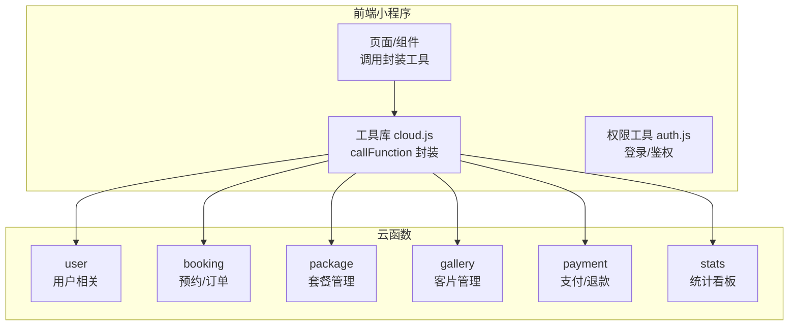
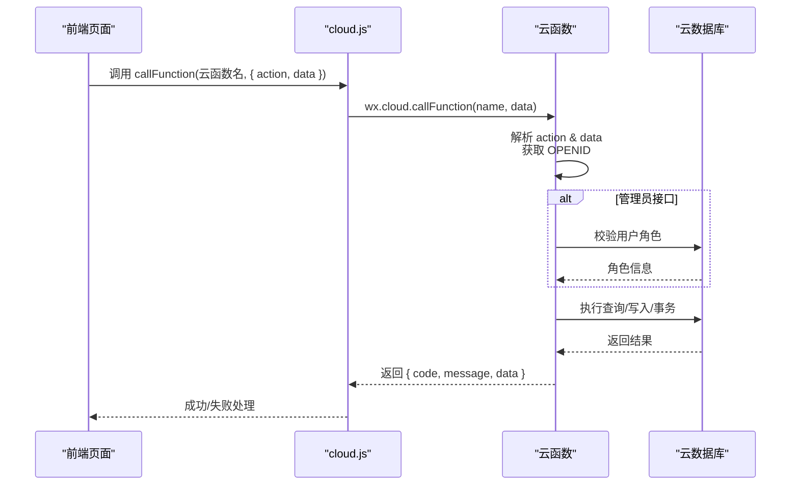
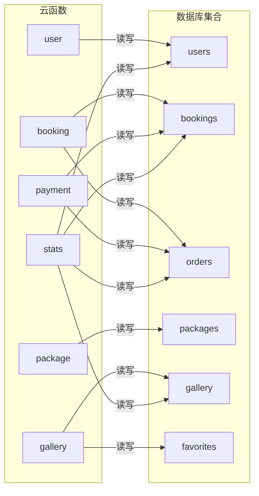

# API接口文档

<cite>
**本文档引用的文件**
- [booking/index.js](file://miniprogram/cloudfunctions/booking/index.js)
- [booking/package.json](file://miniprogram/cloudfunctions/booking/package.json)
- [gallery/index.js](file://miniprogram/cloudfunctions/gallery/index.js)
- [gallery/package.json](file://miniprogram/cloudfunctions/gallery/package.json)
- [package/index.js](file://miniprogram/cloudfunctions/package/index.js)
- [package/package.json](file://miniprogram/cloudfunctions/package/package.json)
- [payment/index.js](file://miniprogram/cloudfunctions/payment/index.js)
- [payment/package.json](file://miniprogram/cloudfunctions/payment/package.json)
- [stats/index.js](file://miniprogram/cloudfunctions/stats/index.js)
- [stats/package.json](file://miniprogram/cloudfunctions/stats/package.json)
- [user/index.js](file://miniprogram/cloudfunctions/user/index.js)
- [user/package.json](file://miniprogram/cloudfunctions/user/package.json)
- [cloud.js](file://miniprogram/src/utils/cloud.js)
- [auth.js](file://miniprogram/src/utils/auth.js)
- [booking/index.vue](file://miniprogram/src/pages/booking/index.vue)
</cite>

## 目录
1. [简介](#简介)
2. [项目结构](#项目结构)
3. [核心组件](#核心组件)
4. [架构总览](#架构总览)
5. [详细组件分析](#详细组件分析)
6. [依赖关系分析](#依赖关系分析)
7. [性能考虑](#性能考虑)
8. [故障排除指南](#故障排除指南)
9. [结论](#结论)
10. [附录](#附录)

## 简介
本文件为 lvpai 项目的云函数接口文档，覆盖所有云函数的 HTTP 方法、URL 路径、请求参数、响应格式与错误码定义，并提供接口调用示例、参数说明、返回值解析、安全机制、权限验证、限流策略、版本管理与兼容性说明、废弃接口迁移指南、接口测试方法、调试技巧与性能监控方案。文档面向前端开发者与第三方集成方，帮助快速理解与正确使用系统提供的云函数接口。

## 项目结构
云函数按功能模块划分，每个模块独立部署为一个云函数，前端通过 wx.cloud.callFunction 调用对应云函数名及 action 参数进行交互。

图表来源
- [cloud.js:1-66](file://miniprogram/src/utils/cloud.js#L1-L66)
- [user/index.js:1-31](file://miniprogram/cloudfunctions/user/index.js#L1-L31)
- [booking/index.js:67-93](file://miniprogram/cloudfunctions/booking/index.js#L67-L93)
- [package/index.js:26-58](file://miniprogram/cloudfunctions/package/index.js#L26-L58)
- [gallery/index.js:26-64](file://miniprogram/cloudfunctions/gallery/index.js#L26-L64)
- [payment/index.js:26-52](file://miniprogram/cloudfunctions/payment/index.js#L26-L52)
- [stats/index.js:52-68](file://miniprogram/cloudfunctions/stats/index.js#L52-L68)

章节来源
- [cloud.js:1-66](file://miniprogram/src/utils/cloud.js#L1-L66)
- [booking/package.json:1-7](file://miniprogram/cloudfunctions/booking/package.json#L1-L7)
- [gallery/package.json:1-7](file://miniprogram/cloudfunctions/gallery/package.json#L1-L7)
- [package/package.json:1-7](file://miniprogram/cloudfunctions/package/package.json#L1-L7)
- [payment/package.json:1-7](file://miniprogram/cloudfunctions/payment/package.json#L1-L7)
- [stats/package.json:1-7](file://miniprogram/cloudfunctions/stats/package.json#L1-L7)
- [user/package.json:1-7](file://miniprogram/cloudfunctions/user/package.json#L1-L7)

## 核心组件
- 云函数统一入口：每个云函数均通过 exports.main 接收 event（包含 action 与 data），并从 cloud.getWXContext() 获取 OPENID。
- 响应规范：统一返回 { code, message, data } 结构；code=0 表示成功，非0表示错误；前端工具库会根据 code 判定成功/失败。
- 权限控制：多数接口对 OPENID 进行校验；管理员接口额外校验用户角色（admin/superAdmin）。
- 数据一致性：关键流程使用数据库事务（如创建预约同时生成订单、支付成功联动更新等）。

章节来源
- [booking/index.js:67-93](file://miniprogram/cloudfunctions/booking/index.js#L67-L93)
- [payment/index.js:26-52](file://miniprogram/cloudfunctions/payment/index.js#L26-L52)
- [user/index.js:7-31](file://miniprogram/cloudfunctions/user/index.js#L7-L31)
- [cloud.js:5-26](file://miniprogram/src/utils/cloud.js#L5-L26)

## 架构总览
云函数间通过数据库协作完成业务闭环，前端通过封装工具统一调用。

图表来源
- [cloud.js:5-26](file://miniprogram/src/utils/cloud.js#L5-L26)
- [user/index.js:33-67](file://miniprogram/cloudfunctions/user/index.js#L33-L67)
- [booking/index.js:98-206](file://miniprogram/cloudfunctions/booking/index.js#L98-L206)
- [payment/index.js:65-166](file://miniprogram/cloudfunctions/payment/index.js#L65-L166)

## 详细组件分析

### 云函数：user（用户）
- 云函数名：user
- 功能：登录、获取资料、更新手机号、更新资料、设置管理员角色
- 权限：除登录外均需已登录用户 OPENID；设置管理员角色需当前用户为 superAdmin

接口定义
- 登录
  - 方法：POST（通过 wx.cloud.callFunction）
  - 路径：云函数名 user
  - 请求参数：无
  - 响应：{ code, message, data: 用户信息 }
  - 错误码：-1（获取 openid 失败）、-1（用户不存在）
- 获取用户资料
  - 方法：POST
  - 路径：云函数名 user
  - 请求参数：无
  - 响应：{ code, message, data: 用户信息 }
  - 错误码：-1（获取 openid 失败）、-1（用户不存在）
- 更新手机号
  - 方法：POST
  - 路径：云函数名 user
  - 请求参数：{ phone }
  - 响应：{ code, message, data: 更新后的用户信息 }
  - 错误码：-1（手机号为空）、-1（手机号格式不正确）、-1（用户不存在）
- 更新资料
  - 方法：POST
  - 路径：云函数名 user
  - 请求参数：{ nickname?, avatar? }（二选一或都传）
  - 响应：{ code, message, data: 更新后的用户信息 }
  - 错误码：-1（更新数据为空）、-1（没有要更新的字段）、-1（用户不存在）
- 设置管理员角色
  - 方法：POST
  - 路径：云函数名 user
  - 请求参数：{ targetOpenid, role }（role 可为 user/admin/superAdmin）
  - 响应：{ code, message, data: 目标用户最新信息 }
  - 错误码：-1（目标 openid 为空）、-1（角色值无效）、-1（当前用户不存在）、-1（权限不足）、-1（目标用户不存在）

调用示例（前端）
- 登录：await callFunction('user', { action: 'login' })
- 获取资料：await callFunction('user', { action: 'getProfile' })
- 更新手机号：await callFunction('user', { action: 'updatePhone', data: { phone } })
- 更新资料：await callFunction('user', { action: 'updateProfile', data: { nickname, avatar } })
- 设置管理员：await callFunction('user', { action: 'setAdmin', data: { targetOpenid, role } })

章节来源
- [user/index.js:14-205](file://miniprogram/cloudfunctions/user/index.js#L14-L205)
- [cloud.js:5-26](file://miniprogram/src/utils/cloud.js#L5-L26)

### 云函数：booking（预约/订单）
- 云函数名：booking
- 功能：创建预约、查询预约列表、获取预约详情、取消预约、更新预约状态（管理员）、查询可用时段
- 权限：非管理员仅能操作自己的预约；更新状态与查询全部需管理员

接口定义
- 创建预约
  - 方法：POST
  - 路径：云函数名 booking
  - 请求参数：{ packageId, date, timeSlot, contactName, contactPhone, persons, remark? }
  - 响应：{ code, message, data: { booking, order } }
  - 错误码：-1（请选择套餐/日期/时段/联系人姓名/电话/人数）、-1（无效的预约时段）、-1（该时段预约已满）、-1（套餐不存在）、-1（服务器内部错误）
- 查询预约列表
  - 方法：POST
  - 路径：云函数名 booking
  - 请求参数：{ isAdmin?, status?, date?, page=1, pageSize=10 }
  - 响应：{ code, message, data: { list, total, page, pageSize } }
  - 错误码：-1（无权限查看全部预约）
- 获取预约详情
  - 方法：POST
  - 路径：云函数名 booking
  - 请求参数：{ id }
  - 响应：{ code, message, data: { booking, order? } }
  - 错误码：-1（预约ID不能为空）、-1（预约不存在）、-1（无权限查看此预约）
- 取消预约
  - 方法：POST
  - 路径：云函数名 booking
  - 请求参数：{ id }
  - 响应：{ code, message, data: { bookingId, cancelled, needRefund, refundMessage? } }
  - 错误码：-1（预约ID不能为空）、-1（预约不存在）、-1（无权限取消此预约）、-1（已完成的预约无法取消）、-1（预约已取消）
- 更新预约状态（管理员）
  - 方法：POST
  - 路径：云函数名 booking
  - 请求参数：{ id, status }
  - 响应：{ code, message, data: { bookingId, status, updateTime } }
  - 错误码：-1（无权限执行此操作）、-1（预约ID不能为空）、-1（无效的预约状态）、-1（预约不存在）
- 获取可用时段
  - 方法：POST
  - 路径：云函数名 booking
  - 请求参数：{ date }
  - 响应：{ code, message, data: { morning, afternoon, golden }（每项含 booked/available/isFull） }
  - 错误码：-1（日期不能为空）

调用示例（前端）
- 创建预约：await callFunction('booking', { action: 'create', data })
- 查询列表：await callFunction('booking', { action: 'list', data: { isAdmin:false, page, pageSize } })
- 获取详情：await callFunction('booking', { action: 'detail', data: { id } })
- 取消预约：await callFunction('booking', { action: 'cancel', data: { id } })
- 更新状态：await callFunction('booking', { action: 'updateStatus', data: { id, status } })
- 可用时段：await callFunction('booking', { action: 'availableSlots', data: { date } })

章节来源
- [booking/index.js:73-462](file://miniprogram/cloudfunctions/booking/index.js#L73-L462)
- [booking/index.vue:442-470](file://miniprogram/src/pages/booking/index.vue#L442-L470)

### 云函数：package（套餐）
- 云函数名：package
- 功能：查询套餐列表、获取套餐详情、创建套餐（管理员）、更新套餐（管理员）、删除套餐（管理员）、上下架套餐（管理员）
- 权限：非管理员仅能看到上架套餐；其余操作需管理员

接口定义
- 查询套餐列表
  - 方法：POST
  - 路径：云函数名 package
  - 请求参数：{ category?, isAdmin? }
  - 响应：{ code, message, data: { list } }
- 获取套餐详情
  - 方法：POST
  - 路径：云函数名 package
  - 请求参数：{ id }
  - 响应：{ code, message, data: 套餐对象 }
  - 错误码：-1（套餐ID不能为空）、-1（套餐不存在）
- 创建套餐（管理员）
  - 方法：POST
  - 路径：云函数名 package
  - 请求参数：套餐字段（由具体字段决定）
  - 响应：{ code, message, data: { _id, ...套餐字段 } }
  - 错误码：-1（无权限操作）
- 更新套餐（管理员）
  - 方法：POST
  - 路径：云函数名 package
  - 请求参数：{ id, ...更新字段 }
  - 响应：{ code, message, data: { id } }
  - 错误码：-1（无权限操作、套餐ID不能为空）
- 删除套餐（管理员）
  - 方法：POST
  - 路径：云函数名 package
  - 请求参数：{ id }
  - 响应：{ code, message, data: { id } }
  - 错误码：-1（无权限操作、套餐ID不能为空）
- 上下架套餐（管理员）
  - 方法：POST
  - 路径：云函数名 package
  - 请求参数：{ id, status }（status: on/off）
  - 响应：{ code, message, data: { id, status } }
  - 错误码：-1（无权限操作、套餐ID不能为空、状态值无效）

调用示例（前端）
- 列表：await callFunction('package', { action: 'list', data: { category, isAdmin:false } })
- 详情：await callFunction('package', { action: 'detail', data: { id } })
- 创建：await callFunction('package', { action: 'create', data: { ... } })
- 更新：await callFunction('package', { action: 'update', data: { id, ... } })
- 删除：await callFunction('package', { action: 'delete', data: { id } })
- 上下架：await callFunction('package', { action: 'updateStatus', data: { id, status:'on'/'off' } })

章节来源
- [package/index.js:32-221](file://miniprogram/cloudfunctions/package/index.js#L32-L221)

### 云函数：gallery（客片）
- 云函数名：gallery
- 功能：客片列表、详情、创建（管理员）、更新（管理员）、删除（管理员）、收藏/取消收藏、我的收藏、检查是否收藏
- 权限：非管理员仅能看到已发布客片；其余操作需管理员

接口定义
- 客片列表
  - 方法：POST
  - 路径：云函数名 gallery
  - 请求参数：{ category?, page=1, pageSize=10, isAdmin? }
  - 响应：{ code, message, data: { list, total, page, pageSize } }
- 客片详情
  - 方法：POST
  - 路径：云函数名 gallery
  - 请求参数：{ id }
  - 响应：{ code, message, data: 客片对象 }
  - 错误码：-1（客片ID不能为空）、-1（客片不存在）
- 创建客片（管理员）
  - 方法：POST
  - 路径：云函数名 gallery
  - 请求参数：客片字段
  - 响应：{ code, message, data: { _id, ...客片字段 } }
  - 错误码：-1（无权限操作）
- 更新客片（管理员）
  - 方法：POST
  - 路径：云函数名 gallery
  - 请求参数：{ id, ...更新字段 }
  - 响应：{ code, message, data: { id } }
  - 错误码：-1（无权限操作、客片ID不能为空）
- 删除客片（管理员）
  - 方法：POST
  - 路径：云函数名 gallery
  - 请求参数：{ id }
  - 响应：{ code, message, data: { id } }
  - 错误码：-1（无权限操作、客片ID不能为空）
- 收藏/取消收藏
  - 方法：POST
  - 路径：云函数名 gallery
  - 请求参数：{ galleryId }
  - 响应：{ code, message, data: { isFavorited } }
  - 错误码：-1（客片ID不能为空）
- 我的收藏
  - 方法：POST
  - 路径：云函数名 gallery
  - 请求参数：{ page=1, pageSize=10 }
  - 响应：{ code, message, data: { list, total, page, pageSize } }
- 检查是否收藏
  - 方法：POST
  - 路径：云函数名 gallery
  - 请求参数：{ galleryId }
  - 响应：{ code, message, data: { isFavorited } }
  - 错误码：-1（客片ID不能为空）

调用示例（前端）
- 列表：await callFunction('gallery', { action: 'list', data: { category, isAdmin:false } })
- 详情：await callFunction('gallery', { action: 'detail', data: { id } })
- 收藏切换：await callFunction('gallery', { action: 'favorite', data: { galleryId } })
- 我的收藏：await callFunction('gallery', { action: 'myFavorites', data: { page, pageSize } })
- 检查收藏：await callFunction('gallery', { action: 'checkFavorite', data: { galleryId } })

章节来源
- [gallery/index.js:32-359](file://miniprogram/cloudfunctions/gallery/index.js#L32-L359)

### 云函数：payment（支付/退款）
- 云函数名：payment
- 功能：创建支付订单（模拟/真实）、支付成功回调处理（前端触发）、支付回调（微信服务器推送）、退款（管理员）、查询订单、我的订单
- 权限：订单相关接口按订单所属用户或管理员身份校验；退款需管理员

接口定义
- 创建支付订单
  - 方法：POST
  - 路径：云函数名 payment
  - 请求参数：{ orderId }
  - 响应：{ code, message, data: { orderId, orderNo, paymentParams, totalPrice, depositAmount, isMock?, mockMessage? } }
  - 错误码：-1（订单ID不能为空）、-1（订单不存在）、-1（无权限支付此订单）、-1（订单状态异常，无法支付）
- 支付成功回调处理（前端调用）
  - 方法：POST
  - 路径：云函数名 payment
  - 请求参数：{ orderId }
  - 响应：{ code, message, data: { orderId, payStatus:'paid', payTime } }
  - 错误码：-1（订单ID不能为空）、-1（订单不存在）、-1（无权限操作此订单）、-1（订单状态异常）
- 支付回调（微信服务器推送，模拟）
  - 方法：POST
  - 路径：云函数名 payment
  - 请求参数：回调数据（由微信服务器推送）
  - 响应：{ code, message, data: { message?, receivedData? } }
- 退款（管理员）
  - 方法：POST
  - 路径：云函数名 payment
  - 请求参数：{ orderId }
  - 响应：{ code, message, data: { orderId, refundStatus:'refunded', refundTime, isMock?, mockMessage? } }
  - 错误码：-1（无权限执行此操作）、-1（订单ID不能为空）、-1（订单不存在）、-1（订单未支付，无法退款）
- 查询订单
  - 方法：POST
  - 路径：云函数名 payment
  - 请求参数：{ orderId?, orderNo? }（二选一）
  - 响应：{ code, message, data: 订单对象 }
  - 错误码：-1（订单ID或订单编号不能为空）、-1（订单不存在）、-1（无权限查看此订单）
- 我的订单
  - 方法：POST
  - 路径：云函数名 payment
  - 请求参数：{ payStatus?, page=1, pageSize=10 }
  - 响应：{ code, message, data: { list, total, page, pageSize } }

调用示例（前端）
- 创建支付：await callFunction('payment', { action: 'createOrder', data: { orderId } })
- 支付成功：await callFunction('payment', { action: 'paySuccess', data: { orderId } })
- 查询订单：await callFunction('payment', { action: 'getOrder', data: { orderId } })
- 我的订单：await callFunction('payment', { action: 'myOrders', data: { page, pageSize } })

章节来源
- [payment/index.js:32-531](file://miniprogram/cloudfunctions/payment/index.js#L32-L531)

### 云函数：stats（统计看板）
- 云函数名：stats
- 功能：管理员数据概览（今日预约数、待处理订单、本月收入、客片/预约/用户总数、状态分布、近7日趋势）
- 权限：仅管理员

接口定义
- 数据概览
  - 方法：POST
  - 路径：云函数名 stats
  - 请求参数：无
  - 响应：{ code, message, data: { todayBookings, pendingOrders, monthIncome, totalGallery, totalBookings, totalUsers, statusStats, weeklyTrend, statsTime } }
  - 错误码：-1（无权限查看统计数据）

调用示例（前端）
- 概览：await callFunction('stats', { action: 'overview' })

章节来源
- [stats/index.js:52-228](file://miniprogram/cloudfunctions/stats/index.js#L52-L228)

## 依赖关系分析

图表来源
- [user/index.js:4-5](file://miniprogram/cloudfunctions/user/index.js#L4-L5)
- [booking/index.js:4-5](file://miniprogram/cloudfunctions/booking/index.js#L4-L5)
- [package/index.js:4-5](file://miniprogram/cloudfunctions/package/index.js#L4-L5)
- [gallery/index.js:4-5](file://miniprogram/cloudfunctions/gallery/index.js#L4-L5)
- [payment/index.js:4-5](file://miniprogram/cloudfunctions/payment/index.js#L4-L5)
- [stats/index.js:4-6](file://miniprogram/cloudfunctions/stats/index.js#L4-L6)

章节来源
- [booking/index.js:4-5](file://miniprogram/cloudfunctions/booking/index.js#L4-L5)
- [payment/index.js:4-5](file://miniprogram/cloudfunctions/payment/index.js#L4-L5)
- [stats/index.js:4-6](file://miniprogram/cloudfunctions/stats/index.js#L4-L6)

## 性能考虑
- 分页查询：列表接口均支持 page/pageSize，建议前端合理设置分页大小以减少单次传输量。
- 权限前置：管理员校验在数据库查询前完成，避免不必要的数据库访问。
- 事务一致性：关键流程使用事务保证数据一致性，但会增加数据库开销，建议仅在必要场景使用。
- 聚合统计：统计接口使用聚合查询与循环统计相结合的方式，注意在大数据量下的性能表现。
- 缓存策略：前端可在本地缓存用户信息、套餐列表等静态数据，减少重复请求。

## 故障排除指南
- 通用错误处理
  - 前端工具库会根据 code 判定成功/失败；建议在调用处统一处理错误提示。
  - 若出现“未知操作”，检查 action 是否正确传递。
- 权限问题
  - “无权限查看全部预约/无权限操作”等错误通常来自管理员校验失败；确认当前用户角色。
- 数据校验
  - “订单不存在/预约不存在/客片不存在”等错误通常来自 ID 无效或已被删除；请在调用前确认资源存在。
- 支付相关
  - 模拟支付模式下，支付回调与真实退款不会生效；需配置微信支付商户号后方可启用真实支付。
- 日志定位
  - 云函数内有错误日志输出，可在云开发控制台查看执行日志定位问题。

章节来源
- [cloud.js:5-26](file://miniprogram/src/utils/cloud.js#L5-L26)
- [booking/index.js:89-92](file://miniprogram/cloudfunctions/booking/index.js#L89-L92)
- [payment/index.js:48-51](file://miniprogram/cloudfunctions/payment/index.js#L48-L51)

## 结论
本接口文档基于 lvpai 项目现有云函数实现，提供了统一的调用规范、权限模型与错误码约定。建议在集成过程中遵循以下原则：
- 使用统一的调用封装工具进行请求与错误处理；
- 严格区分管理员与普通用户权限；
- 对关键流程使用分页与事务保障；
- 在支付模块按需启用真实支付与退款能力。

## 附录

### 版本管理与兼容性
- 当前版本：v1.0
- 兼容性：接口参数与返回结构保持稳定；新增接口以 action 字段扩展，不影响既有接口。
- 废弃接口：暂无废弃接口。

### 安全机制与权限验证
- OPENID 获取：通过 cloud.getWXContext() 获取当前用户 OPENID。
- 角色校验：管理员接口统一校验用户角色（admin/superAdmin）。
- 资源归属：非管理员接口仅允许操作自身资源（如订单、预约、收藏）。

### 限流策略
- 云函数层面未见显式限流配置；建议结合业务流量在云开发控制台设置配额限制。

### 接口测试方法
- 单元测试：可在本地使用云函数 SDK 模拟环境进行单元测试。
- 集成测试：通过前端页面触发云函数调用，观察返回结果与页面反馈。
- 日志测试：关注云函数日志输出，定位异常分支。

### 调试技巧
- 使用 wx.cloud.callFunction 的 fail 回调捕获网络错误；
- 在云函数中打印关键变量（如 OPENID、请求参数、查询结果）辅助定位；
- 对事务流程进行回滚测试，确保异常分支正确处理。