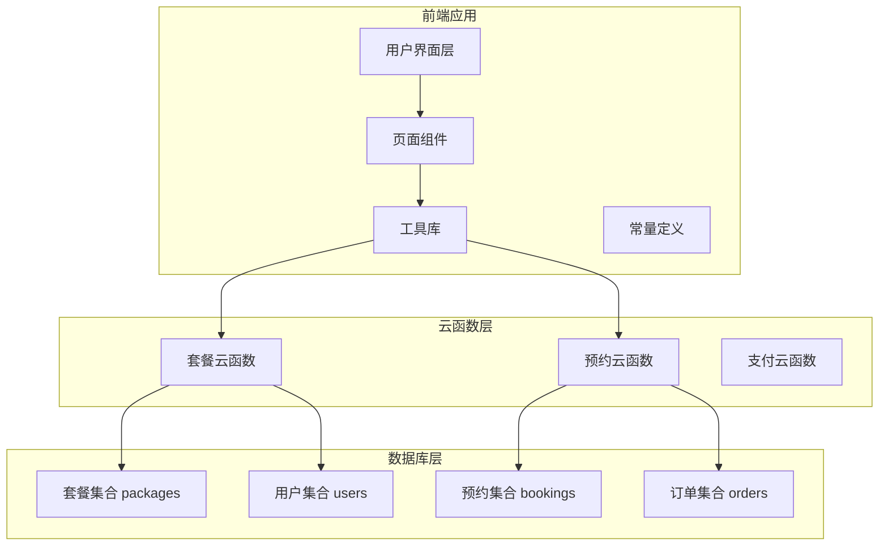
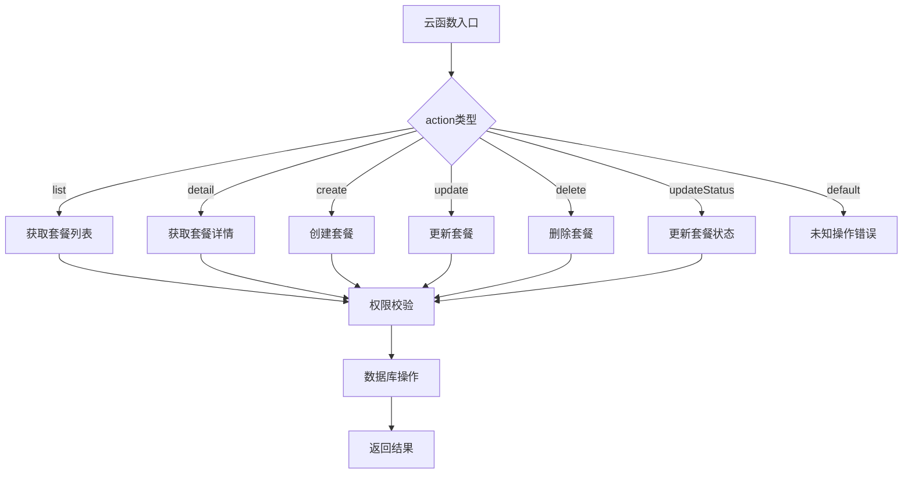
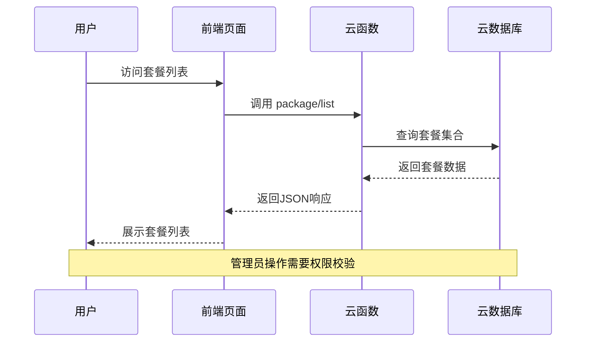
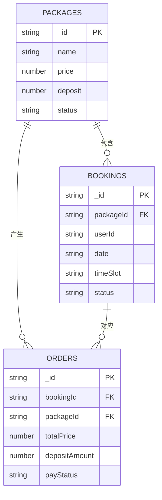
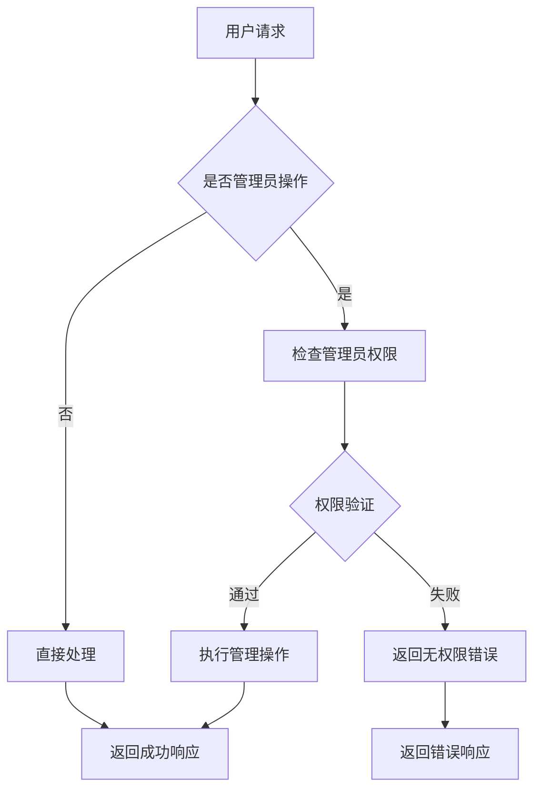
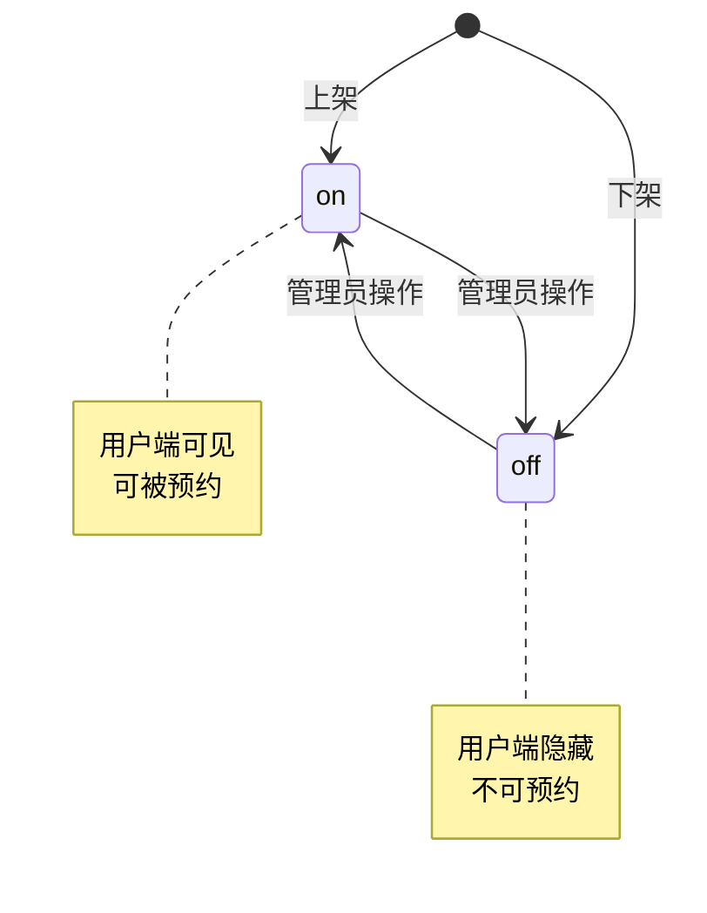
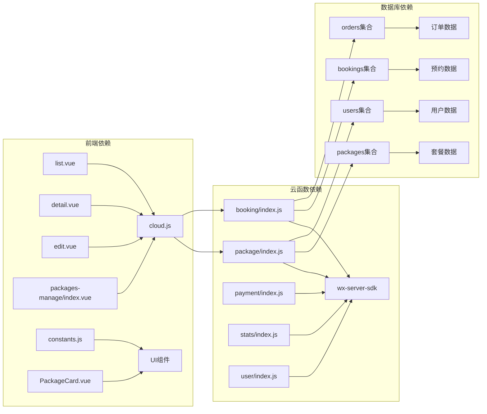
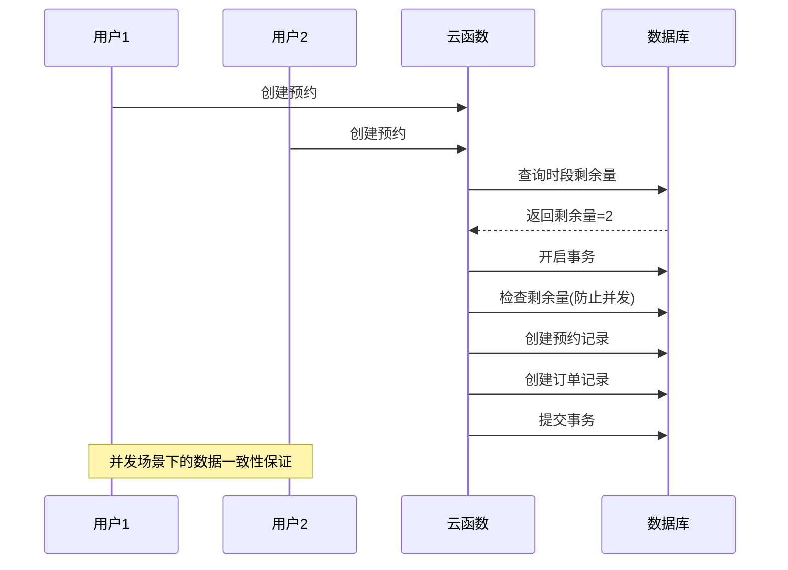

# 套餐管理API

<cite>
**本文档引用的文件**
- [package/index.js](file://miniprogram/cloudfunctions/package/index.js)
- [package/package.json](file://miniprogram/cloudfunctions/package/package.json)
- [booking/index.js](file://miniprogram/cloudfunctions/booking/index.js)
- [list.vue](file://miniprogram/src/pages/packages/list.vue)
- [detail.vue](file://miniprogram/src/pages/packages/detail.vue)
- [cloud.js](file://miniprogram/src/utils/cloud.js)
- [constants.js](file://miniprogram/src/utils/constants.js)
- [PackageCard.vue](file://miniprogram/src/components/PackageCard.vue)
- [packages-manage/index.vue](file://miniprogram/src/pages-admin/packages-manage/index.vue)
- [packages-manage/edit.vue](file://miniprogram/src/pages-admin/packages-manage/edit.vue)
</cite>

## 目录
1. [简介](#简介)
2. [项目结构](#项目结构)
3. [核心组件](#核心组件)
4. [架构概览](#架构概览)
5. [详细组件分析](#详细组件分析)
6. [依赖分析](#依赖分析)
7. [性能考虑](#性能考虑)
8. [故障排除指南](#故障排除指南)
9. [结论](#结论)
10. [附录](#附录)

## 简介

套餐管理API是朵兰摄影小程序的核心功能模块，负责管理摄影套餐的完整生命周期。该系统基于微信云开发构建，提供完整的套餐管理功能，包括套餐列表展示、详情查询、创建、更新、删除以及状态管理。

系统采用前后端分离架构，前端使用UniApp框架开发，后端通过云函数提供RESTful风格的API接口。套餐数据存储在云数据库中，支持管理员权限控制和用户端展示过滤。

## 项目结构



**图表来源**
- [package/index.js:1-222](file://miniprogram/cloudfunctions/package/index.js#L1-L222)
- [booking/index.js:1-463](file://miniprogram/cloudfunctions/booking/index.js#L1-L463)

**章节来源**
- [package/index.js:1-222](file://miniprogram/cloudfunctions/package/index.js#L1-L222)
- [package/package.json:1-7](file://miniprogram/cloudfunctions/package/package.json#L1-L7)

## 核心组件

### 云函数架构

套餐管理云函数采用统一入口设计，通过action参数路由到不同的业务处理函数：



**图表来源**
- [package/index.js:26-58](file://miniprogram/cloudfunctions/package/index.js#L26-L58)

### 数据模型

套餐数据模型包含以下关键字段：

| 字段名 | 类型 | 必填 | 描述 |
|--------|------|------|------|
| name | string | 是 | 套餐名称 |
| category | string | 是 | 套餐分类 |
| price | number | 是 | 套餐价格 |
| deposit | number | 是 | 定金金额 |
| duration | number | 否 | 拍摄时长(分钟) |
| costumeCount | number | 否 | 服装套数 |
| retouchCount | number | 否 | 精修张数 |
| coverImage | string | 是 | 封面图片URL |
| detailImages | array | 否 | 详情图片URL数组 |
| features | array | 否 | 套餐特色亮点 |
| tag | string | 否 | 标签 |
| description | string | 否 | 详细描述 |
| status | string | 是 | 上架状态(on/off) |
| createTime | date | 是 | 创建时间 |
| updateTime | date | 是 | 更新时间 |

**章节来源**
- [package/index.js:119-123](file://miniprogram/cloudfunctions/package/index.js#L119-L123)
- [edit.vue:240-254](file://miniprogram/src/pages-admin/packages-manage/edit.vue#L240-L254)

## 架构概览



**图表来源**
- [list.vue:94-125](file://miniprogram/src/pages/packages/list.vue#L94-L125)
- [package/index.js:61-86](file://miniprogram/cloudfunctions/package/index.js#L61-L86)

## 详细组件分析

### 套餐云函数API

#### getPackageList（获取套餐列表）

**HTTP方法**: POST  
**URL路径**: `/package/list`  
**权限要求**: 无需登录  
**请求参数**:

| 参数名 | 类型 | 必填 | 描述 |
|--------|------|------|------|
| action | string | 是 | 固定值: "list" |
| category | string | 否 | 套餐分类筛选 |
| isAdmin | boolean | 否 | 是否管理员模式 |

**响应格式**:
```json
{
  "code": 0,
  "message": "success",
  "data": {
    "list": [
      {
        "_id": "套餐ID",
        "name": "套餐名称",
        "category": "分类",
        "price": 价格,
        "deposit": 定金,
        "coverImage": "封面图URL",
        "status": "on/off",
        "createTime": "创建时间",
        "updateTime": "更新时间"
      }
    ]
  }
}
```

**业务逻辑**:
- 用户端仅返回状态为"on"的套餐
- 管理员可获取所有套餐
- 支持按分类筛选
- 按排序字段升序排列

**章节来源**
- [package/index.js:61-86](file://miniprogram/cloudfunctions/package/index.js#L61-L86)
- [list.vue:94-125](file://miniprogram/src/pages/packages/list.vue#L94-L125)

#### getPackageDetail（获取套餐详情）

**HTTP方法**: POST  
**URL路径**: `/package/detail`  
**权限要求**: 无需登录  
**请求参数**:

| 参数名 | 类型 | 必填 | 描述 |
|--------|------|------|------|
| action | string | 是 | 固定值: "detail" |
| id | string | 是 | 套餐ID |

**响应格式**:
```json
{
  "code": 0,
  "message": "success",
  "data": {
    "_id": "套餐ID",
    "name": "套餐名称",
    "category": "分类",
    "price": 价格,
    "deposit": 定金,
    "duration": 拍摄时长,
    "costumeCount": 服装套数,
    "retouchCount": 精修张数,
    "coverImage": "封面图URL",
    "detailImages": ["图片URL1", "图片URL2"],
    "features": ["特色1", "特色2"],
    "tag": "标签",
    "description": "描述",
    "status": "状态",
    "createTime": "创建时间",
    "updateTime": "更新时间"
  }
}
```

**业务逻辑**:
- 校验套餐是否存在
- 返回完整的套餐信息
- 不进行权限校验

**章节来源**
- [package/index.js:88-107](file://miniprogram/cloudfunctions/package/index.js#L88-L107)
- [detail.vue:202-237](file://miniprogram/src/pages/packages/detail.vue#L202-L237)

#### createPackage（创建套餐）

**HTTP方法**: POST  
**URL路径**: `/package/create`  
**权限要求**: 管理员  
**请求参数**:
与套餐数据模型相同，除ID外的所有字段

**响应格式**:
```json
{
  "code": 0,
  "message": "success",
  "data": {
    "_id": "新创建的套餐ID",
    "name": "套餐名称",
    "category": "分类",
    "price": 价格,
    "deposit": 定金,
    "status": "状态",
    "createTime": "当前时间",
    "updateTime": "当前时间"
  }
}
```

**业务逻辑**:
- 校验管理员权限
- 自动设置创建时间和更新时间
- 返回完整的创建结果

**章节来源**
- [package/index.js:109-134](file://miniprogram/cloudfunctions/package/index.js#L109-L134)
- [edit.vue:395-455](file://miniprogram/src/pages-admin/packages-manage/edit.vue#L395-L455)

#### updatePackage（更新套餐）

**HTTP方法**: POST  
**URL路径**: `/package/update`  
**权限要求**: 管理员  
**请求参数**:

| 参数名 | 类型 | 必填 | 描述 |
|--------|------|------|------|
| action | string | 是 | 固定值: "update" |
| id | string | 是 | 套餐ID |
| 其他 | object | 否 | 套餐字段 |

**响应格式**:
```json
{
  "code": 0,
  "message": "success",
  "data": {
    "id": "更新的套餐ID"
  }
}
```

**业务逻辑**:
- 校验管理员权限
- 自动更新更新时间
- 支持部分字段更新

**章节来源**
- [package/index.js:136-164](file://miniprogram/cloudfunctions/package/index.js#L136-L164)
- [edit.vue:423-433](file://miniprogram/src/pages-admin/packages-manage/edit.vue#L423-L433)

#### deletePackage（删除套餐）

**HTTP方法**: POST  
**URL路径**: `/package/delete`  
**权限要求**: 管理员  
**请求参数**:

| 参数名 | 类型 | 必填 | 描述 |
|--------|------|------|------|
| action | string | 是 | 固定值: "delete" |
| id | string | 是 | 套餐ID |

**响应格式**:
```json
{
  "code": 0,
  "message": "success",
  "data": {
    "id": "删除的套餐ID"
  }
}
```

**业务逻辑**:
- 校验管理员权限
- 直接删除套餐记录

**章节来源**
- [package/index.js:166-187](file://miniprogram/cloudfunctions/package/index.js#L166-L187)
- [packages-manage/index.vue:221-264](file://miniprogram/src/pages-admin/packages-manage/index.vue#L221-L264)

#### updatePackageStatus（更新套餐状态）

**HTTP方法**: POST  
**URL路径**: `/package/updateStatus`  
**权限要求**: 管理员  
**请求参数**:

| 参数名 | 类型 | 必填 | 描述 |
|--------|------|------|------|
| action | string | 是 | 固定值: "updateStatus" |
| id | string | 是 | 套餐ID |
| status | string | 是 | 新状态: "on" 或 "off" |

**响应格式**:
```json
{
  "code": 0,
  "message": "success",
  "data": {
    "id": "更新的套餐ID",
    "status": "新的状态"
  }
}
```

**业务逻辑**:
- 校验管理员权限
- 仅允许"on"和"off"两种状态
- 自动更新更新时间

**章节来源**
- [package/index.js:189-221](file://miniprogram/cloudfunctions/package/index.js#L189-L221)
- [packages-manage/index.vue:183-219](file://miniprogram/src/pages-admin/packages-manage/index.vue#L183-L219)

### 错误码定义

| 错误码 | 描述 | 触发场景 |
|--------|------|----------|
| 0 | 成功 | 所有正常操作 |
| -1 | 失败 | 通用错误 |
| -1 | 未知操作 | action参数无效 |
| -1 | 无权限操作 | 非管理员访问管理接口 |
| -1 | 套餐ID不能为空 | 更新/删除/状态更新缺少ID |
| -1 | 套餐不存在 | 查询详情或操作不存在的套餐 |
| -1 | 状态值无效 | 状态更新值不在允许范围内 |

**章节来源**
- [package/index.js:51-56](file://miniprogram/cloudfunctions/package/index.js#L51-L56)
- [package/index.js:114-115](file://miniprogram/cloudfunctions/package/index.js#L114-L115)
- [package/index.js:146-148](file://miniprogram/cloudfunctions/package/index.js#L146-L148)

### 套餐与预约系统的关联关系



**图表来源**
- [booking/index.js:120-130](file://miniprogram/cloudfunctions/booking/index.js#L120-L130)
- [booking/index.js:173-186](file://miniprogram/cloudfunctions/booking/index.js#L173-L186)

**章节来源**
- [booking/index.js:98-206](file://miniprogram/cloudfunctions/booking/index.js#L98-L206)

### 权限验证机制

系统采用分级权限控制：



**图表来源**
- [package/index.js:8-24](file://miniprogram/cloudfunctions/package/index.js#L8-L24)
- [booking/index.js:32-46](file://miniprogram/cloudfunctions/booking/index.js#L32-L46)

**章节来源**
- [package/index.js:111-115](file://miniprogram/cloudfunctions/package/index.js#L111-L115)
- [booking/index.js:221-226](file://miniprogram/cloudfunctions/booking/index.js#L221-L226)

### 数据验证和状态管理

#### 数据验证规则

| 字段 | 验证规则 | 错误信息 |
|------|----------|----------|
| name | 非空字符串 | 请输入套餐名称 |
| category | 存在于分类列表 | 请选择有效分类 |
| price | 数字且大于0 | 请输入有效价格 |
| deposit | 数字且大于0 | 请输入有效定金 |
| coverImage | 非空 | 请上传封面图 |
| contactName | 非空 | 请填写联系人姓名 |
| contactPhone | 非空 | 请填写联系人电话 |
| persons | 数字且>=1 | 请填写有效人数 |

#### 状态管理流程



**图表来源**
- [package/index.js:203-205](file://miniprogram/cloudfunctions/package/index.js#L203-L205)

**章节来源**
- [edit.vue:370-393](file://miniprogram/src/pages-admin/packages-manage/edit.vue#L370-L393)
- [package/index.js:197-205](file://miniprogram/cloudfunctions/package/index.js#L197-L205)

## 依赖分析



**图表来源**
- [package/package.json:3-5](file://miniprogram/cloudfunctions/package/package.json#L3-L5)
- [list.vue:59-61](file://miniprogram/src/pages/packages/list.vue#L59-L61)
- [detail.vue:143-144](file://miniprogram/src/pages/packages/detail.vue#L143-L144)

**章节来源**
- [package/package.json:1-7](file://miniprogram/cloudfunctions/package/package.json#L1-L7)
- [cloud.js:1-66](file://miniprogram/src/utils/cloud.js#L1-L66)

## 性能考虑

### 数据库查询优化

1. **索引策略**
   - 在`packages`集合上建立`category`和`status`索引
   - 在`bookings`集合上建立`date`和`timeSlot`索引

2. **查询优化**
   - 使用投影只返回必要字段
   - 实施分页查询避免一次性加载大量数据
   - 缓存热门套餐数据

### 并发控制



**图表来源**
- [booking/index.js:150-206](file://miniprogram/cloudfunctions/booking/index.js#L150-L206)

**章节来源**
- [booking/index.js:150-206](file://miniprogram/cloudfunctions/booking/index.js#L150-L206)

## 故障排除指南

### 常见问题及解决方案

#### 权限相关问题

**问题**: 无权限操作
**原因**: 非管理员用户尝试访问管理接口
**解决**: 确保用户具有admin或superAdmin角色

**问题**: 无权限查看全部预约
**原因**: 普通用户尝试查看其他用户预约
**解决**: 实现用户权限验证逻辑

#### 数据验证问题

**问题**: 套餐创建失败
**原因**: 必填字段缺失或格式不正确
**解决**: 检查前端表单验证和后端数据校验

**问题**: 套餐更新失败
**原因**: ID参数缺失或套餐不存在
**解决**: 确保传递正确的套餐ID

#### 数据库连接问题

**问题**: 云函数执行超时
**原因**: 数据库查询未使用索引
**解决**: 为常用查询字段建立索引

**章节来源**
- [package/index.js:111-115](file://miniprogram/cloudfunctions/package/index.js#L111-L115)
- [booking/index.js:328-331](file://miniprogram/cloudfunctions/booking/index.js#L328-L331)

### 接口测试方法

#### 单元测试

```javascript
// 测试用例示例
describe('套餐管理API', () => {
  test('获取套餐列表', async () => {
    const result = await callFunction('package', {
      action: 'list',
      data: {}
    })
    expect(result.code).toBe(0)
    expect(result.data.list).toBeInstanceOf(Array)
  })
  
  test('创建套餐权限验证', async () => {
    const result = await callFunction('package', {
      action: 'create',
      data: {
        name: '测试套餐',
        category: 'basic',
        price: 1000,
        deposit: 200,
        coverImage: 'test.jpg'
      }
    })
    expect(result.code).toBe(-1)
    expect(result.message).toBe('无权限操作')
  })
})
```

#### 集成测试

1. **端到端测试流程**
   - 登录管理员账号
   - 创建测试套餐
   - 验证套餐列表显示
   - 更新套餐信息
   - 删除测试套餐
   - 验证权限控制

2. **性能测试**
   - 并发用户测试
   - 大数据量查询测试
   - 网络异常处理测试

**章节来源**
- [cloud.js:5-26](file://miniprogram/src/utils/cloud.js#L5-L26)

## 结论

套餐管理API提供了完整的摄影套餐生命周期管理功能，具有以下特点：

1. **完整的功能覆盖**: 支持套餐的全生命周期管理
2. **严格的权限控制**: 区分管理员和普通用户的操作权限
3. **良好的扩展性**: 基于云函数架构，易于功能扩展
4. **完善的错误处理**: 统一的错误码和响应格式
5. **强一致性的数据管理**: 通过事务保证数据完整性

系统与预约系统的紧密集成确保了业务流程的连贯性和数据的一致性。建议在生产环境中进一步完善监控和日志记录功能，以提升系统的可观测性和维护性。

## 附录

### 接口调用示例

#### 获取套餐列表
```javascript
// 前端调用示例
const response = await callFunction('package', {
  action: 'list',
  data: {
    category: 'basic',
    isAdmin: false
  }
})

// 响应处理
if (response.code === 0) {
  const packages = response.data.list
  // 渲染套餐列表
}
```

#### 创建套餐
```javascript
// 管理员创建套餐
const newPackage = await callFunction('package', {
  action: 'create',
  data: {
    name: '蒙古袍摄影套餐',
    category: 'advanced',
    price: 2888,
    deposit: 500,
    duration: 120,
    costumeCount: 3,
    retouchCount: 20,
    coverImage: 'https://example.com/image.jpg',
    features: ['蒙古袍体验', '专业化妆师', '精修20张'],
    description: '包含全套蒙古族服饰拍摄体验',
    status: 'on'
  }
})
```

#### 套餐数据模型
```typescript
interface PackageModel {
  _id?: string
  name: string
  category: string
  price: number
  deposit: number
  duration?: number
  costumeCount?: number
  retouchCount?: number
  coverImage: string
  detailImages?: string[]
  features?: string[]
  tag?: string
  description?: string
  status: 'on' | 'off'
  createTime?: Date
  updateTime?: Date
}
```