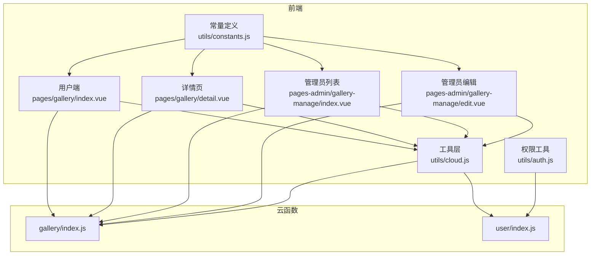
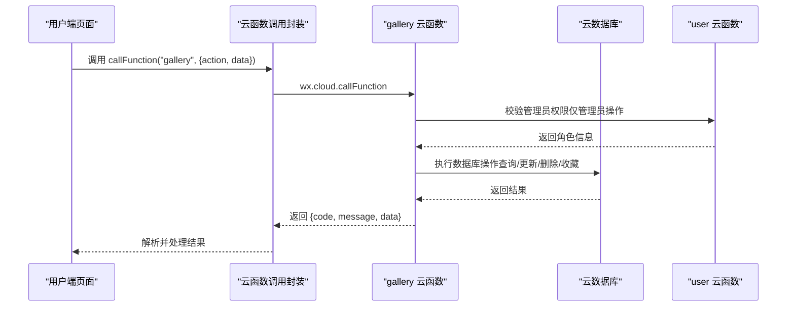
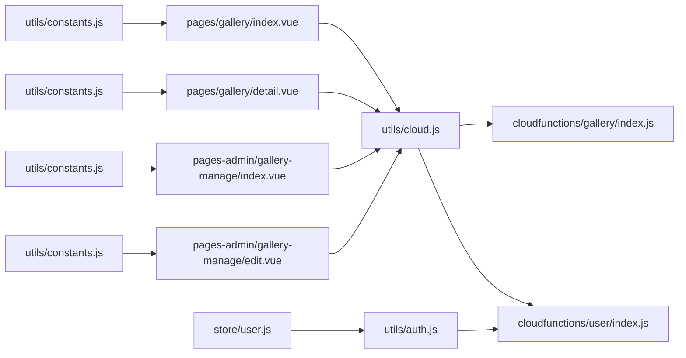
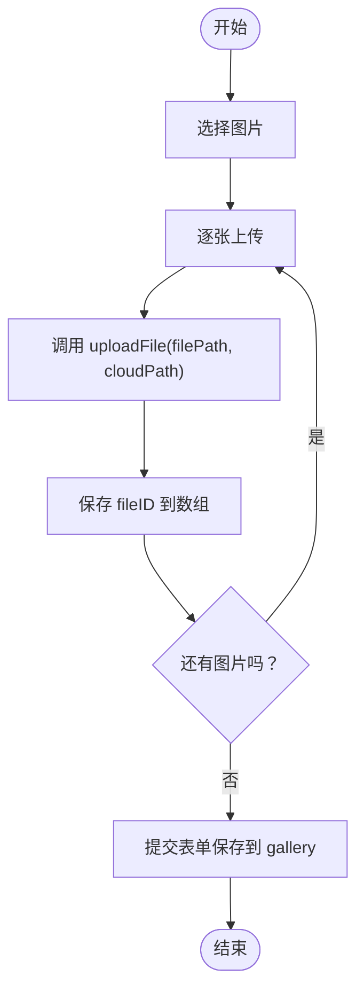
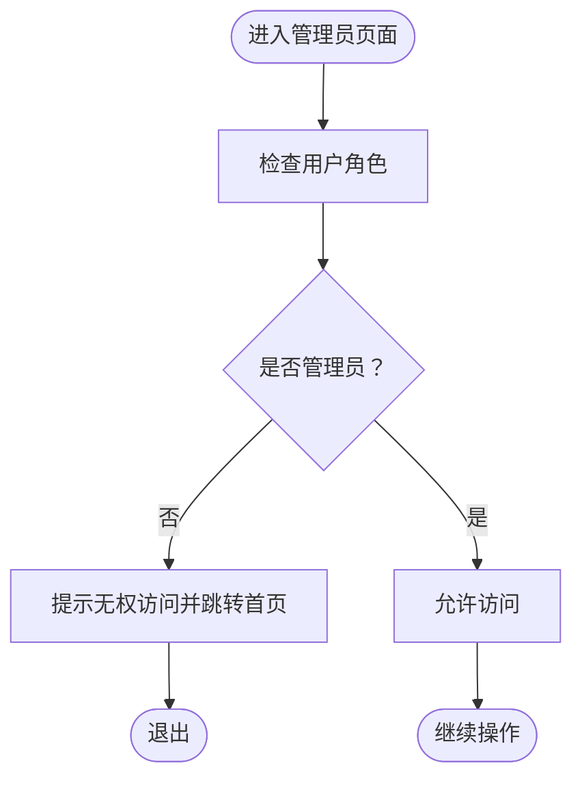

# 客片管理API

<cite>
**本文档引用的文件**
- [gallery/index.js](file://miniprogram/cloudfunctions/gallery/index.js)
- [gallery/package.json](file://miniprogram/cloudfunctions/gallery/package.json)
- [cloud.js](file://miniprogram/src/utils/cloud.js)
- [index.vue（客片列表）](file://miniprogram/src/pages/gallery/index.vue)
- [detail.vue（客片详情）](file://miniprogram/src/pages/gallery/detail.vue)
- [constants.js](file://miniprogram/src/utils/constants.js)
- [GalleryItem.vue](file://miniprogram/src/components/GalleryItem.vue)
- [user/index.js](file://miniprogram/cloudfunctions/user/index.js)
- [auth.js](file://miniprogram/src/utils/auth.js)
- [user store](file://miniprogram/src/store/user.js)
- [gallery-manage/index.vue（管理员列表）](file://miniprogram/src/pages-admin/gallery-manage/index.vue)
- [gallery-manage/edit.vue（管理员编辑）](file://miniprogram/src/pages-admin/gallery-manage/edit.vue)
</cite>

## 目录
1. [简介](#简介)
2. [项目结构](#项目结构)
3. [核心组件](#核心组件)
4. [架构概览](#架构概览)
5. [详细组件分析](#详细组件分析)
6. [依赖关系分析](#依赖关系分析)
7. [性能考虑](#性能考虑)
8. [故障排查指南](#故障排查指南)
9. [结论](#结论)
10. [附录](#附录)

## 简介
本文件系统性梳理客片展示系统的云函数接口与前端调用方式，覆盖客片列表、详情、收藏、分页与权限控制等完整流程。重点说明以下接口：
- getGalleryList（获取客片列表）
- getGalleryDetail（获取客片详情）
- createGallery（创建客片，管理员）
- updateGallery（更新客片，管理员）
- deleteGallery（删除客片，管理员）
- toggleFavorite（切换收藏）
- getMyFavorites（获取我的收藏）
- checkFavorite（检查收藏）

同时提供接口调用示例、数据模型、权限验证、文件上传与存储管理、缓存策略、错误码定义及测试方法。

## 项目结构
客片管理由三部分组成：
- 云函数：gallery（提供客片CRUD、收藏、分页、权限校验）
- 前端页面：用户端客片列表与详情页，以及管理员端客片管理页
- 工具层：云函数调用封装、权限工具、常量定义

图表来源
- [gallery/index.js:26-64](file://miniprogram/cloudfunctions/gallery/index.js#L26-L64)
- [cloud.js:6-26](file://miniprogram/src/utils/cloud.js#L6-L26)
- [index.vue（客片列表）:104-189](file://miniprogram/src/pages/gallery/index.vue#L104-L189)
- [detail.vue（客片详情）:92-143](file://miniprogram/src/pages/gallery/detail.vue#L92-L143)
- [gallery-manage/index.vue（管理员列表）:95-182](file://miniprogram/src/pages-admin/gallery-manage/index.vue#L95-L182)
- [gallery-manage/edit.vue（管理员编辑）:169-299](file://miniprogram/src/pages-admin/gallery-manage/edit.vue#L169-L299)

章节来源
- [gallery/index.js:1-64](file://miniprogram/cloudfunctions/gallery/index.js#L1-L64)
- [cloud.js:1-66](file://miniprogram/src/utils/cloud.js#L1-L66)
- [index.vue（客片列表）:100-282](file://miniprogram/src/pages/gallery/index.vue#L100-L282)
- [detail.vue（客片详情）:90-234](file://miniprogram/src/pages/gallery/detail.vue#L90-L234)
- [gallery-manage/index.vue（管理员列表）:92-295](file://miniprogram/src/pages-admin/gallery-manage/index.vue#L92-L295)
- [gallery-manage/edit.vue（管理员编辑）:166-332](file://miniprogram/src/pages-admin/gallery-manage/edit.vue#L166-L332)

## 核心组件
- 云函数 gallery：统一入口，根据 action 分发至不同业务函数；内置管理员权限校验；支持分页、排序、条件过滤。
- 前端调用封装：callFunction 统一封装云函数调用，返回标准化结果对象（含 code/message/data）。
- 权限工具：用户登录、角色判断（admin/superAdmin），管理员端访问控制。
- 数据模型：gallery、favorites、users 等集合字段约定（见“数据模型”）。

章节来源
- [gallery/index.js:26-64](file://miniprogram/cloudfunctions/gallery/index.js#L26-L64)
- [cloud.js:6-26](file://miniprogram/src/utils/cloud.js#L6-L26)
- [auth.js:28-36](file://miniprogram/src/utils/auth.js#L28-L36)
- [user/index.js:34-66](file://miniprogram/cloudfunctions/user/index.js#L34-L66)

## 架构概览
客片管理采用“前端页面 + 云函数 + 云数据库/云存储”的三层架构。前端通过 wx.cloud.callFunction 调用 gallery 云函数，云函数使用 wx-server-sdk 进行数据库操作与权限校验，并返回统一格式的结果对象。

图表来源
- [cloud.js:6-26](file://miniprogram/src/utils/cloud.js#L6-L26)
- [gallery/index.js:26-64](file://miniprogram/cloudfunctions/gallery/index.js#L26-L64)
- [user/index.js:34-82](file://miniprogram/cloudfunctions/user/index.js#L34-L82)

## 详细组件分析

### 接口总览与调用规范
- 云函数名称：gallery
- 公共请求体字段：
  - action：字符串，必填，指定具体操作
  - data：对象，可选，承载业务参数
- 公共响应体字段：
  - code：整数，0 表示成功，非0表示错误
  - message：字符串，错误描述或成功提示
  - data：对象，承载业务数据（如列表、详情、操作结果）

章节来源
- [gallery/index.js:26-64](file://miniprogram/cloudfunctions/gallery/index.js#L26-L64)
- [cloud.js:6-26](file://miniprogram/src/utils/cloud.js#L6-L26)

### getGalleryList（获取客片列表）
- 功能：按分类、分页、排序返回客片列表；用户端默认仅返回已发布客片。
- 请求参数：
  - category：字符串，可选，分类筛选
  - page：整数，默认1，页码
  - pageSize：整数，默认10，每页条数
  - isAdmin：布尔，可选，管理员端传入 true 时返回所有状态
- 响应数据：
  - list：数组，客片列表
  - total：整数，总数
  - page/pageSize：分页信息
- 错误码：
  - -1：通用错误（如数据库异常）
- 示例调用（用户端）：
  - action: "list"
  - data: { category: "", page: 1, pageSize: 10 }
- 示例调用（管理员端）：
  - action: "list"
  - data: { category: "", page: 1, pageSize: 10, isAdmin: true }

章节来源
- [gallery/index.js:67-103](file://miniprogram/cloudfunctions/gallery/index.js#L67-L103)
- [index.vue（客片列表）:151-159](file://miniprogram/src/pages/gallery/index.vue#L151-L159)

### getGalleryDetail（获取客片详情）
- 功能：根据客片 ID 返回详情信息。
- 请求参数：
  - id：字符串，必填
- 响应数据：
  - 客片对象（包含标题、分类、封面图、图片列表、文案、标签、发布时间等）
- 错误码：
  - -1：客片ID为空或客片不存在

章节来源
- [gallery/index.js:105-124](file://miniprogram/cloudfunctions/gallery/index.js#L105-L124)
- [detail.vue（客片详情）:120-143](file://miniprogram/src/pages/gallery/detail.vue#L120-L143)

### createGallery（创建客片，管理员）
- 功能：创建新客片，自动设置创建/更新时间、初始点赞数。
- 请求参数：
  - 根据业务字段传入（如标题、分类、封面图、图片列表、标签、文案、状态等）
- 响应数据：
  - 新增客片的 _id 与创建数据
- 错误码：
  - -1：无权限操作（非管理员）、其他异常

章节来源
- [gallery/index.js:126-152](file://miniprogram/cloudfunctions/gallery/index.js#L126-L152)
- [gallery-manage/edit.vue（管理员编辑）:284-299](file://miniprogram/src/pages-admin/gallery-manage/edit.vue#L284-L299)

### updateGallery（更新客片，管理员）
- 功能：更新客片信息并更新时间戳。
- 请求参数：
  - id：字符串，必填
  - 其他字段：根据业务字段传入
- 响应数据：
  - 更新成功的 id
- 错误码：
  - -1：无权限操作、客片ID为空、其他异常

章节来源
- [gallery/index.js:154-182](file://miniprogram/cloudfunctions/gallery/index.js#L154-L182)
- [gallery-manage/index.vue（管理员列表）:200-235](file://miniprogram/src/pages-admin/gallery-manage/index.vue#L200-L235)

### deleteGallery（删除客片，管理员）
- 功能：删除客片及其相关收藏记录，使用事务保证一致性。
- 请求参数：
  - id：字符串，必填
- 响应数据：
  - 删除成功的 id
- 错误码：
  - -1：无权限操作、客片ID为空、其他异常

章节来源
- [gallery/index.js:184-225](file://miniprogram/cloudfunctions/gallery/index.js#L184-L225)
- [gallery-manage/index.vue（管理员列表）:237-280](file://miniprogram/src/pages-admin/gallery-manage/index.vue#L237-L280)

### toggleFavorite（切换收藏）
- 功能：为当前用户对某客片进行收藏/取消收藏，同时更新客片点赞数。
- 请求参数：
  - galleryId：字符串，必填
- 响应数据：
  - isFavorited：布尔，当前收藏状态
- 错误码：
  - -1：客片ID为空、其他异常

章节来源
- [gallery/index.js:227-283](file://miniprogram/cloudfunctions/gallery/index.js#L227-L283)
- [index.vue（客片列表）:218-241](file://miniprogram/src/pages/gallery/index.vue#L218-L241)
- [detail.vue（客片详情）:161-183](file://miniprogram/src/pages/gallery/detail.vue#L161-L183)

### getMyFavorites（获取我的收藏）
- 功能：返回当前用户的收藏列表，并联查已发布的客片信息。
- 请求参数：
  - page/pageSize：分页参数
- 响应数据：
  - list：收藏项列表（包含 gallery 详情）
  - total：收藏总数
  - page/pageSize：分页信息
- 错误码：
  - -1：其他异常

章节来源
- [gallery/index.js:285-339](file://miniprogram/cloudfunctions/gallery/index.js#L285-L339)
- [index.vue（客片列表）:129-142](file://miniprogram/src/pages/gallery/index.vue#L129-L142)

### checkFavorite（检查收藏）
- 功能：检查当前用户是否已收藏某客片。
- 请求参数：
  - galleryId：字符串，必填
- 响应数据：
  - isFavorited：布尔
- 错误码：
  - -1：客片ID为空、其他异常

章节来源
- [gallery/index.js:341-359](file://miniprogram/cloudfunctions/gallery/index.js#L341-L359)
- [detail.vue（客片详情）:145-159](file://miniprogram/src/pages/gallery/detail.vue#L145-L159)

### 权限验证与管理员校验
- 管理员校验：通过调用 user 云函数获取用户角色，仅 admin 或 superAdmin 可执行创建/更新/删除等操作。
- 前端权限控制：管理员端页面在进入时检查用户角色，无权限则提示并跳转首页。

章节来源
- [gallery/index.js:8-24](file://miniprogram/cloudfunctions/gallery/index.js#L8-L24)
- [user/index.js:34-82](file://miniprogram/cloudfunctions/user/index.js#L34-L82)
- [auth.js:28-36](file://miniprogram/src/utils/auth.js#L28-L36)
- [gallery-manage/index.vue（管理员列表）:108-121](file://miniprogram/src/pages-admin/gallery-manage/index.vue#L108-L121)

### 数据模型与字段约定
- gallery 集合关键字段（示例）：
  - _id：主键
  - title：标题
  - category：分类（如 mausoleum/grassland/couple/children）
  - coverImage：封面图
  - images：图片列表
  - tags：标签数组
  - copyText：朋友圈文案
  - status：状态（published/draft）
  - likes：点赞数
  - createTime/updateTime：时间戳
- favorites 集合关键字段（示例）：
  - userId：用户标识
  - galleryId：客片标识
  - createTime：收藏时间
- users 集合关键字段（示例）：
  - openid：用户标识
  - role：角色（user/admin/superAdmin）

章节来源
- [constants.js:13-20](file://miniprogram/src/utils/constants.js#L13-L20)
- [gallery/index.js:67-103](file://miniprogram/cloudfunctions/gallery/index.js#L67-L103)
- [gallery/index.js:285-339](file://miniprogram/cloudfunctions/gallery/index.js#L285-L339)
- [user/index.js:34-66](file://miniprogram/cloudfunctions/user/index.js#L34-L66)

### 图片上传与存储管理
- 前端上传流程（管理员编辑页）：
  - 选择封面图与客片图片
  - 逐张调用 uploadFile 上传至云存储，生成 fileID
  - 将 fileID 数组保存到 gallery 的 coverImage/images 字段
- 存储路径建议：按 gallery/image_{timestamp}_{index}.{ext} 命名，便于识别与清理
- 文件清理：删除客片时需同步删除云存储中的对应文件（当前 gallery 云函数未直接删除文件，建议在业务侧补充）

章节来源
- [gallery-manage/edit.vue（管理员编辑）:284-299](file://miniprogram/src/pages-admin/gallery-manage/edit.vue#L284-L299)
- [cloud.js:28-38](file://miniprogram/src/utils/cloud.js#L28-L38)

### 缓存策略
- 前端缓存：
  - 用户收藏 ID 缓存：首次加载收藏列表后，将收藏的 galleryId 缓存到 Set 中，避免每次重新请求
  - 列表分页缓存：用户端列表按页加载，支持触底加载更多
- 后端缓存：
  - 云函数未显式使用缓存，但可通过合理索引与分页减少查询压力

章节来源
- [index.vue（客片列表）:125-142](file://miniprogram/src/pages/gallery/index.vue#L125-L142)
- [index.vue（客片列表）:144-189](file://miniprogram/src/pages/gallery/index.vue#L144-L189)

### 错误码定义
- 通用错误码：
  - -1：通用错误（如参数缺失、权限不足、数据库异常）
  - 0：成功
- 典型错误场景：
  - 客片ID为空
  - 无权限操作（非管理员执行管理员操作）
  - 客户端网络错误、云函数执行异常

章节来源
- [gallery/index.js:109-111](file://miniprogram/cloudfunctions/gallery/index.js#L109-L111)
- [gallery/index.js:130-132](file://miniprogram/cloudfunctions/gallery/index.js#L130-L132)
- [cloud.js:6-26](file://miniprogram/src/utils/cloud.js#L6-L26)

### 接口调用示例
- 获取列表（用户端）：
  - action: "list"
  - data: { category: "", page: 1, pageSize: 10 }
- 获取详情：
  - action: "detail"
  - data: { id: "客片ID" }
- 切换收藏：
  - action: "favorite"
  - data: { galleryId: "客片ID", isFavorite: true/false }
- 获取我的收藏：
  - action: "myFavorites"
  - data: { page: 1, pageSize: 10 }
- 管理员创建/更新/删除：
  - action: "create"/"update"/"delete"
  - data: {...客片字段...}

章节来源
- [index.vue（客片列表）:151-159](file://miniprogram/src/pages/gallery/index.vue#L151-L159)
- [detail.vue（客片详情）:125-128](file://miniprogram/src/pages/gallery/detail.vue#L125-L128)
- [detail.vue（客片详情）:162-170](file://miniprogram/src/pages/gallery/detail.vue#L162-L170)
- [index.vue（客片列表）:131-134](file://miniprogram/src/pages/gallery/index.vue#L131-L134)
- [gallery-manage/index.vue（管理员列表）:206-212](file://miniprogram/src/pages-admin/gallery-manage/index.vue#L206-L212)
- [gallery-manage/edit.vue（管理员编辑）:284-299](file://miniprogram/src/pages-admin/gallery-manage/edit.vue#L284-L299)

## 依赖关系分析

图表来源
- [index.vue（客片列表）:104-105](file://miniprogram/src/pages/gallery/index.vue#L104-L105)
- [detail.vue（客片详情）:92-93](file://miniprogram/src/pages/gallery/detail.vue#L92-L93)
- [gallery-manage/index.vue（管理员列表）:95-96](file://miniprogram/src/pages-admin/gallery-manage/index.vue#L95-L96)
- [gallery-manage/edit.vue（管理员编辑）:169-170](file://miniprogram/src/pages-admin/gallery-manage/edit.vue#L169-L170)
- [cloud.js:6-26](file://miniprogram/src/utils/cloud.js#L6-L26)
- [gallery/index.js:26-64](file://miniprogram/cloudfunctions/gallery/index.js#L26-L64)
- [user/index.js:7-31](file://miniprogram/cloudfunctions/user/index.js#L7-L31)
- [auth.js:1-46](file://miniprogram/src/utils/auth.js#L1-L46)
- [user store:1-47](file://miniprogram/src/store/user.js#L1-L47)
- [constants.js:1-73](file://miniprogram/src/utils/constants.js#L1-L73)

章节来源
- [index.vue（客片列表）:100-282](file://miniprogram/src/pages/gallery/index.vue#L100-L282)
- [detail.vue（客片详情）:90-234](file://miniprogram/src/pages/gallery/detail.vue#L90-L234)
- [gallery-manage/index.vue（管理员列表）:92-295](file://miniprogram/src/pages-admin/gallery-manage/index.vue#L92-L295)
- [gallery-manage/edit.vue（管理员编辑）:166-332](file://miniprogram/src/pages-admin/gallery-manage/edit.vue#L166-L332)
- [cloud.js:1-66](file://miniprogram/src/utils/cloud.js#L1-L66)
- [gallery/index.js:1-64](file://miniprogram/cloudfunctions/gallery/index.js#L1-L64)
- [user/index.js:1-31](file://miniprogram/cloudfunctions/user/index.js#L1-L31)
- [auth.js:1-46](file://miniprogram/src/utils/auth.js#L1-L46)
- [user store:1-47](file://miniprogram/src/store/user.js#L1-L47)
- [constants.js:1-73](file://miniprogram/src/utils/constants.js#L1-L73)

## 性能考虑
- 分页与排序：列表接口按 createTime 降序分页，避免一次性加载大量数据
- 条件过滤：支持分类筛选，减少无关数据传输
- 收藏联查：获取收藏列表时联查 gallery 并过滤 published 状态，确保只返回已发布客片
- 事务一致性：删除客片时开启事务，保证客片与收藏记录的一致性
- 建议优化：
  - 为 gallery.category、gallery.status、favorites.userId/galleryId 建立复合索引
  - 对图片 URL 使用 CDN 缓存与懒加载
  - 对频繁查询的分类标签进行本地缓存

[本节为通用性能建议，无需特定文件来源]

## 故障排查指南
- 云函数调用失败：
  - 检查 callFunction 返回的 code/message，定位是参数错误还是服务端异常
  - 查看云函数日志，关注数据库查询与事务执行情况
- 权限问题：
  - 确认用户角色是否为 admin/superAdmin
  - 管理员端页面进入前应进行角色校验
- 数据异常：
  - 列表为空：检查 category/status 条件与 isAdmin 参数
  - 收藏状态不一致：检查 favorites 与 gallery 的联查逻辑
- 图片上传失败：
  - 检查 uploadFile 返回的 fileID 是否正确
  - 确认云存储权限与命名规则

章节来源
- [cloud.js:6-26](file://miniprogram/src/utils/cloud.js#L6-L26)
- [gallery/index.js:8-24](file://miniprogram/cloudfunctions/gallery/index.js#L8-L24)
- [gallery-manage/index.vue（管理员列表）:108-121](file://miniprogram/src/pages-admin/gallery-manage/index.vue#L108-L121)

## 结论
客片管理API通过 gallery 云函数实现了完整的客片生命周期管理，结合前端分页、收藏与权限控制，形成清晰的用户与管理员双端体验。建议在后续迭代中完善文件删除与缓存策略，进一步提升性能与稳定性。

[本节为总结性内容，无需特定文件来源]

## 附录

### API 定义与调用示例

- getGalleryList（获取客片列表）
  - 方法：GET/POST（通过云函数调用）
  - URL：云函数 gallery
  - 请求参数：
    - action: "list"
    - data: { category, page, pageSize, isAdmin }
  - 响应：{ code, message, data: { list, total, page, pageSize } }

- getGalleryDetail（获取客片详情）
  - 方法：GET/POST
  - URL：云函数 gallery
  - 请求参数：
    - action: "detail"
    - data: { id }
  - 响应：{ code, message, data: 客片对象 }

- createGallery（创建客片，管理员）
  - 方法：GET/POST
  - URL：云函数 gallery
  - 请求参数：
    - action: "create"
    - data: {...客片字段...}
  - 响应：{ code, message, data: { _id, ... } }

- updateGallery（更新客片，管理员）
  - 方法：GET/POST
  - URL：云函数 gallery
  - 请求参数：
    - action: "update"
    - data: { id, ... }
  - 响应：{ code, message, data: { id } }

- deleteGallery（删除客片，管理员）
  - 方法：GET/POST
  - URL：云函数 gallery
  - 请求参数：
    - action: "delete"
    - data: { id }
  - 响应：{ code, message, data: { id } }

- toggleFavorite（切换收藏）
  - 方法：GET/POST
  - URL：云函数 gallery
  - 请求参数：
    - action: "favorite"
    - data: { galleryId }
  - 响应：{ code, message, data: { isFavorited } }

- getMyFavorites（获取我的收藏）
  - 方法：GET/POST
  - URL：云函数 gallery
  - 请求参数：
    - action: "myFavorites"
    - data: { page, pageSize }
  - 响应：{ code, message, data: { list, total, page, pageSize } }

- checkFavorite（检查收藏）
  - 方法：GET/POST
  - URL：云函数 gallery
  - 请求参数：
    - action: "checkFavorite"
    - data: { galleryId }
  - 响应：{ code, message, data: { isFavorited } }

章节来源
- [gallery/index.js:67-359](file://miniprogram/cloudfunctions/gallery/index.js#L67-L359)
- [index.vue（客片列表）:144-189](file://miniprogram/src/pages/gallery/index.vue#L144-L189)
- [detail.vue（客片详情）:119-183](file://miniprogram/src/pages/gallery/detail.vue#L119-L183)
- [gallery-manage/index.vue（管理员列表）:136-235](file://miniprogram/src/pages-admin/gallery-manage/index.vue#L136-L235)
- [gallery-manage/edit.vue（管理员编辑）:284-299](file://miniprogram/src/pages-admin/gallery-manage/edit.vue#L284-L299)

### 图片上传流程（管理员端）

图表来源
- [gallery-manage/edit.vue（管理员编辑）:284-299](file://miniprogram/src/pages-admin/gallery-manage/edit.vue#L284-L299)
- [cloud.js:28-38](file://miniprogram/src/utils/cloud.js#L28-L38)

### 权限验证流程

图表来源
- [gallery-manage/index.vue（管理员列表）:108-121](file://miniprogram/src/pages-admin/gallery-manage/index.vue#L108-L121)
- [auth.js:28-36](file://miniprogram/src/utils/auth.js#L28-L36)