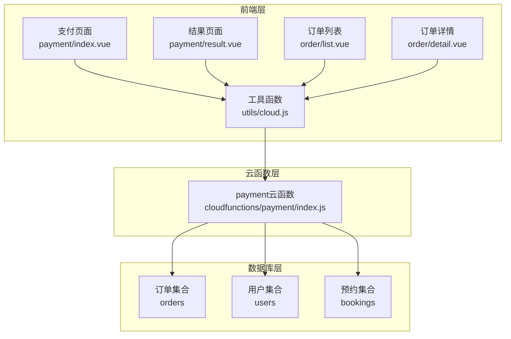
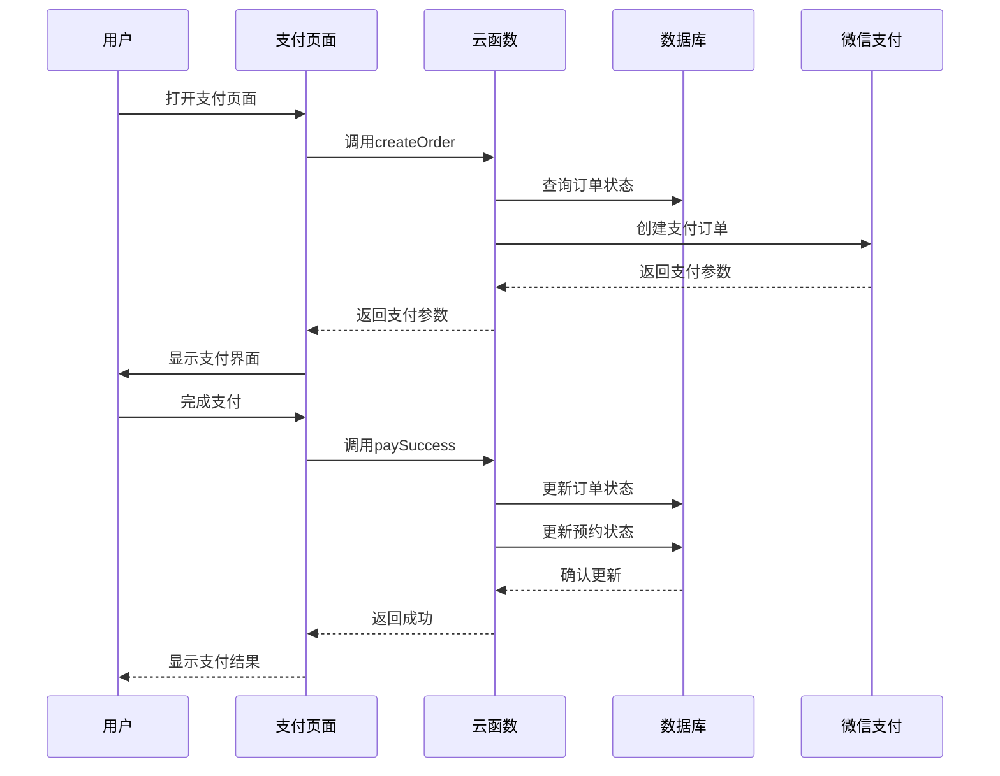
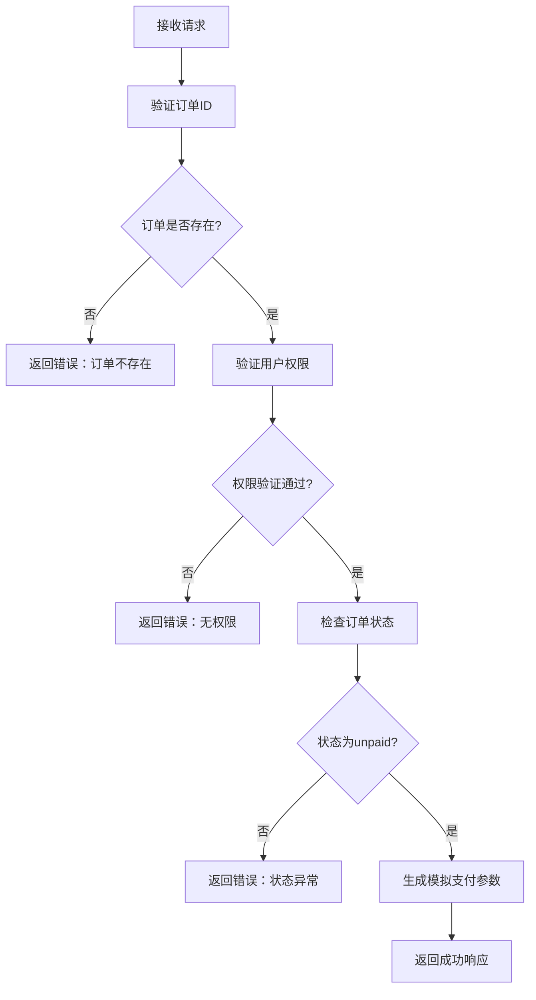
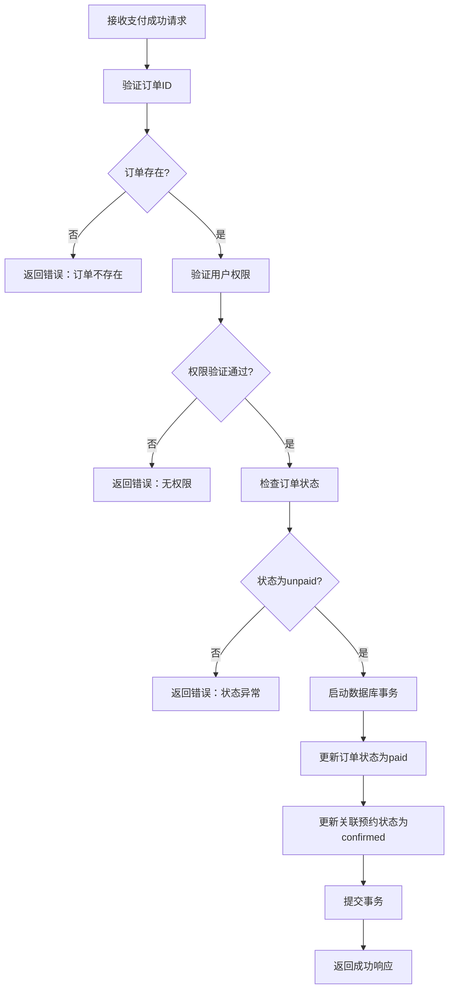
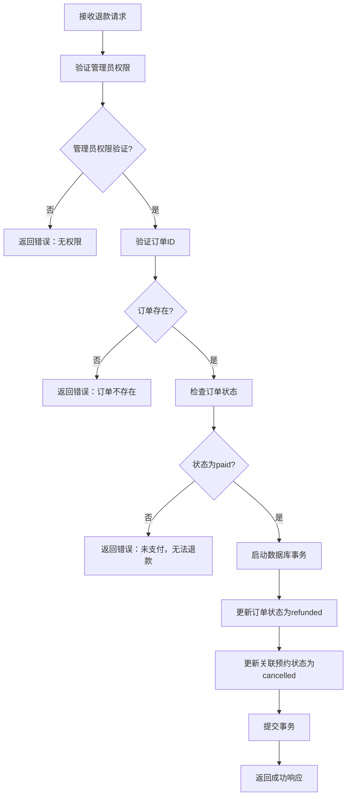
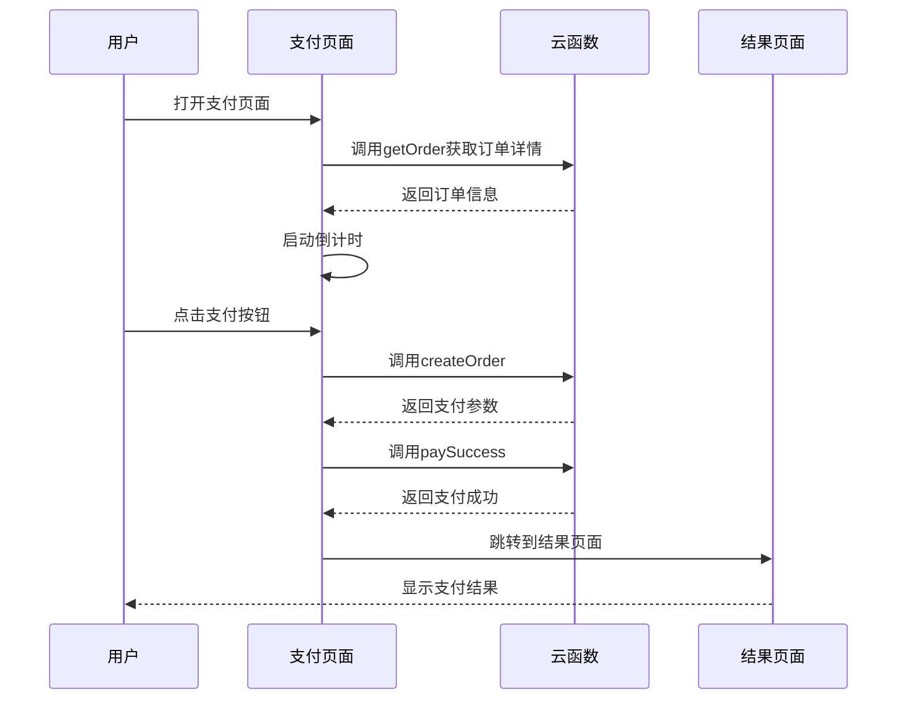
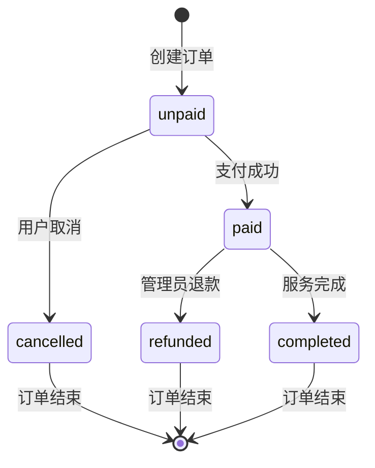
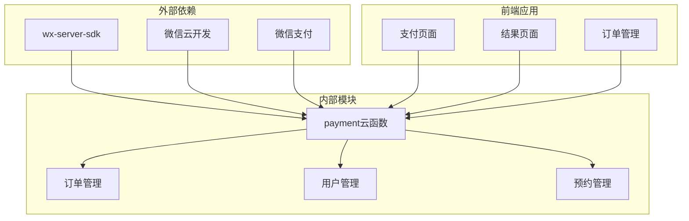

# 支付管理API

<cite>
**本文档引用的文件**
- [payment/index.js](file://miniprogram/cloudfunctions/payment/index.js)
- [payment/package.json](file://miniprogram/cloudfunctions/payment/package.json)
- [payment/index.vue](file://miniprogram/src/pages/payment/index.vue)
- [payment/result.vue](file://miniprogram/src/pages/payment/result.vue)
- [cloud.js](file://miniprogram/src/utils/cloud.js)
- [constants.js](file://miniprogram/src/utils/constants.js)
- [list.vue](file://miniprogram/src/pages/order/list.vue)
- [detail.vue](file://miniprogram/src/pages/order/detail.vue)
</cite>

## 目录
1. [简介](#简介)
2. [项目结构](#项目结构)
3. [核心组件](#核心组件)
4. [架构概览](#架构概览)
5. [详细组件分析](#详细组件分析)
6. [依赖关系分析](#依赖关系分析)
7. [性能考虑](#性能考虑)
8. [故障排除指南](#故障排除指南)
9. [结论](#结论)

## 简介

支付管理API是基于微信云开发构建的旅拍小程序支付系统，提供了完整的支付生命周期管理功能。该系统支持订单创建、支付处理、状态查询、退款管理等核心功能，并集成了微信支付的完整流程。

系统采用前后端分离架构，前端使用Vue.js框架，后端使用微信云函数，数据库采用云开发数据库。支付流程包括订单创建、支付确认、状态同步和退款处理四个主要阶段。

## 项目结构

支付系统主要由以下三个部分组成：

**图表来源**
- [payment/index.js:1-532](file://miniprogram/cloudfunctions/payment/index.js#L1-L532)
- [payment/index.vue:1-535](file://miniprogram/src/pages/payment/index.vue#L1-L535)
- [cloud.js:1-66](file://miniprogram/src/utils/cloud.js#L1-L66)

**章节来源**
- [payment/index.js:1-532](file://miniprogram/cloudfunctions/payment/index.js#L1-L532)
- [payment/package.json:1-7](file://miniprogram/cloudfunctions/payment/package.json#L1-L7)

## 核心组件

支付管理系统包含以下核心组件：

### 云函数服务
- **支付云函数**：处理所有支付相关的业务逻辑
- **订单管理**：订单创建、查询、状态更新
- **退款处理**：管理员权限的退款操作
- **状态同步**：订单状态与预约状态的联动更新

### 前端页面组件
- **支付确认页面**：展示订单信息和支付流程
- **支付结果页面**：显示支付成功或失败的状态
- **订单管理页面**：用户查看和管理自己的订单
- **订单详情页面**：查看订单的详细信息和状态

### 数据模型
- **订单状态**：unpaid（待支付）、paid（已支付）、refunded（已退款）
- **预约状态**：pending（待确认）、confirmed（已确认）、completed（已完成）、cancelled（已取消）
- **用户角色**：普通用户、管理员、超级管理员

**章节来源**
- [constants.js:39-56](file://miniprogram/src/utils/constants.js#L39-L56)
- [payment/index.js:65-166](file://miniprogram/cloudfunctions/payment/index.js#L65-L166)

## 架构概览

支付系统采用三层架构设计，确保了良好的可维护性和扩展性：

**图表来源**
- [payment/index.js:65-239](file://miniprogram/cloudfunctions/payment/index.js#L65-L239)
- [payment/index.vue:209-247](file://miniprogram/src/pages/payment/index.vue#L209-L247)

系统架构特点：
- **异步处理**：所有云函数调用都是异步的，避免阻塞主线程
- **事务保证**：关键业务操作使用数据库事务确保数据一致性
- **权限控制**：管理员权限验证，防止越权操作
- **状态管理**：完整的状态流转控制，确保业务逻辑正确性

## 详细组件分析

### 支付云函数核心功能

#### createPayment（创建支付订单）

**接口定义**
- HTTP方法：POST
- URL路径：/payment/createOrder
- 请求参数：
  - orderId：订单ID（必填）
- 响应格式：
  - code：状态码（0表示成功）
  - message：消息描述
  - data：返回数据对象
    - orderId：订单ID
    - orderNo：订单编号
    - paymentParams：支付参数对象
    - totalPrice：总金额
    - depositAmount：定金金额

**处理流程**

**图表来源**
- [payment/index.js:65-166](file://miniprogram/cloudfunctions/payment/index.js#L65-L166)

**错误码定义**
- 0：操作成功
- -1：通用错误
- 其他：具体业务错误码

#### paySuccess（支付成功处理）

**接口定义**
- HTTP方法：POST
- URL路径：/payment/paySuccess
- 请求参数：
  - orderId：订单ID（必填）
- 响应格式：
  - code：状态码
  - message：消息描述
  - data：返回数据对象
    - orderId：订单ID
    - payStatus：支付状态
    - payTime：支付时间

**处理流程**

**图表来源**
- [payment/index.js:172-239](file://miniprogram/cloudfunctions/payment/index.js#L172-L239)

#### refund（处理退款）

**接口定义**
- HTTP方法：POST
- URL路径：/payment/refund
- 请求参数：
  - orderId：订单ID（必填）
- 响应格式：
  - code：状态码
  - message：消息描述
  - data：返回数据对象
    - orderId：订单ID
    - refundStatus：退款状态
    - refundTime：退款时间

**处理流程**

**图表来源**
- [payment/index.js:338-450](file://miniprogram/cloudfunctions/payment/index.js#L338-L450)

#### getOrder（查询订单详情）

**接口定义**
- HTTP方法：GET
- URL路径：/payment/getOrder
- 请求参数：
  - orderId：订单ID（二选一）
  - orderNo：订单编号（二选一）
- 响应格式：
  - code：状态码
  - message：消息描述
  - data：订单详情对象

**权限控制**
- 非管理员用户只能查询自己的订单
- 管理员可以查询所有订单

#### myOrders（获取用户订单列表）

**接口定义**
- HTTP方法：GET
- URL路径：/payment/myOrders
- 请求参数：
  - payStatus：支付状态筛选
  - page：页码，默认1
  - pageSize：每页数量，默认10
- 响应格式：
  - code：状态码
  - message：消息描述
  - data：订单列表数据
    - list：订单列表
    - total：总数
    - page：当前页
    - pageSize：每页数量

**章节来源**
- [payment/index.js:455-531](file://miniprogram/cloudfunctions/payment/index.js#L455-L531)

### 前端支付页面组件

#### 支付确认页面

**功能特性**
- 实时倒计时显示（30分钟）
- 订单信息展示
- 支付金额计算
- 支付状态监控
- 错误处理和重试机制

**页面交互流程**

**图表来源**
- [payment/index.vue:131-247](file://miniprogram/src/pages/payment/index.vue#L131-L247)

**章节来源**
- [payment/index.vue:1-535](file://miniprogram/src/pages/payment/index.vue#L1-L535)

#### 支付结果页面

**功能特性**
- 支付成功/失败状态展示
- 订单信息汇总
- 操作按钮（查看详情、重新支付、返回首页）
- 客服联系方式

**章节来源**
- [payment/result.vue:1-358](file://miniprogram/src/pages/payment/result.vue#L1-L358)

### 数据模型设计

#### 订单状态流转

#### 预约状态联动

当订单状态发生变化时，关联的预约状态也会相应更新：
- 订单从unpaid变为paid：预约状态从pending变为confirmed
- 订单从paid变为refunded：预约状态从confirmed变为cancelled

**章节来源**
- [constants.js:29-56](file://miniprogram/src/utils/constants.js#L29-L56)
- [payment/index.js:204-239](file://miniprogram/cloudfunctions/payment/index.js#L204-L239)

## 依赖关系分析

支付系统的主要依赖关系如下：

**图表来源**
- [payment/package.json:3-5](file://miniprogram/cloudfunctions/payment/package.json#L3-L5)

**依赖特点**
- **轻量级依赖**：仅依赖微信云开发SDK
- **无第三方支付SDK**：直接使用微信云开发支付能力
- **模块化设计**：各功能模块职责清晰，耦合度低

**章节来源**
- [payment/package.json:1-7](file://miniprogram/cloudfunctions/payment/package.json#L1-L7)

## 性能考虑

### 云函数性能优化

1. **异步处理**
   - 所有数据库操作都使用异步方法
   - 避免阻塞云函数执行

2. **事务优化**
   - 关键业务操作使用数据库事务
   - 减少数据不一致风险

3. **权限缓存**
   - 管理员权限验证结果可缓存
   - 减少重复查询

### 前端性能优化

1. **页面懒加载**
   - 支付页面按需加载
   - 减少初始加载时间

2. **状态缓存**
   - 订单状态本地缓存
   - 减少网络请求

3. **倒计时优化**
   - 倒计时定时器及时清理
   - 防止内存泄漏

### 数据库性能优化

1. **索引设计**
   - 订单ID、订单编号建立索引
   - 用户ID建立索引

2. **查询优化**
   - 使用精确查询替代模糊查询
   - 合理使用limit限制结果集

## 故障排除指南

### 常见错误及解决方案

#### 支付相关错误

| 错误类型 | 错误码 | 描述 | 解决方案 |
|---------|--------|------|----------|
| 订单不存在 | -1 | 订单ID无效或已被删除 | 检查订单ID有效性，重新获取订单信息 |
| 权限不足 | -1 | 非订单拥有者访问 | 确保用户登录状态正确，检查用户权限 |
| 状态异常 | -1 | 订单状态不符合要求 | 检查订单当前状态，等待状态变更 |
| 支付失败 | -1 | 支付过程出现错误 | 检查网络连接，重新发起支付 |

#### 退款相关错误

| 错误类型 | 错误码 | 描述 | 解决方案 |
|---------|--------|------|----------|
| 非管理员 | -1 | 普通用户尝试退款 | 确保操作用户具有管理员权限 |
| 未支付订单 | -1 | 对未支付订单发起退款 | 先完成支付再申请退款 |
| 退款失败 | -1 | 退款处理过程中出错 | 检查退款参数，联系技术支持 |

### 调试方法

1. **云函数调试**
   - 使用微信开发者工具的云函数调试功能
   - 查看云函数日志输出

2. **前端调试**
   - 使用浏览器开发者工具
   - 检查网络请求和响应

3. **数据库调试**
   - 使用云开发控制台查看数据状态
   - 监控数据库查询性能

### 异常处理最佳实践

1. **统一错误处理**
   - 所有API调用都应包含错误处理
   - 提供友好的错误提示信息

2. **重试机制**
   - 网络异常时提供重试选项
   - 避免重复操作导致的数据不一致

3. **状态监控**
   - 实时监控订单状态变化
   - 及时发现和处理异常情况

**章节来源**
- [payment/index.js:48-51](file://miniprogram/cloudfunctions/payment/index.js#L48-L51)
- [cloud.js:6-26](file://miniprogram/src/utils/cloud.js#L6-L26)

## 结论

支付管理API是一个功能完整、架构清晰的支付系统。系统具备以下优势：

1. **完整的业务流程**：覆盖从订单创建到支付完成的全流程
2. **良好的安全性**：完善的权限控制和数据验证机制
3. **优秀的用户体验**：直观的界面设计和流畅的操作体验
4. **可靠的稳定性**：事务处理和错误恢复机制确保数据一致性

系统目前处于模拟支付模式，真实接入微信支付需要进行以下配置：
- 在微信公众平台配置微信支付商户号
- 配置云函数中的支付回调地址
- 设置支付证书和密钥
- 完善支付参数验证逻辑

未来可以考虑的功能扩展：
- 支持多种支付方式
- 增强支付安全机制
- 优化支付流程性能
- 添加支付统计和报表功能