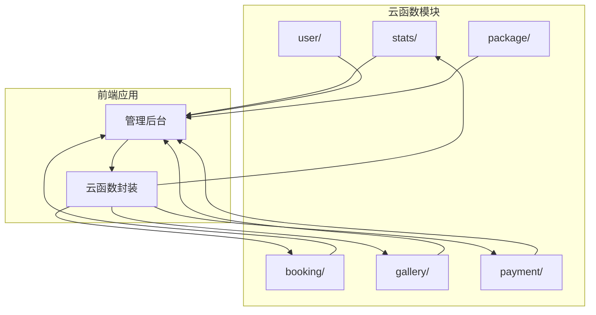
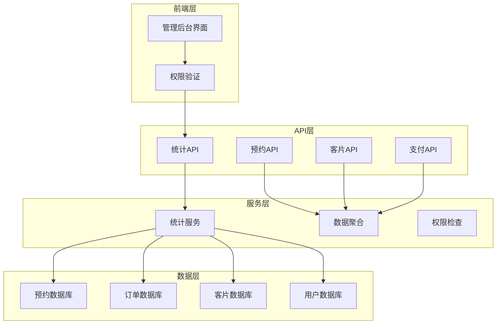
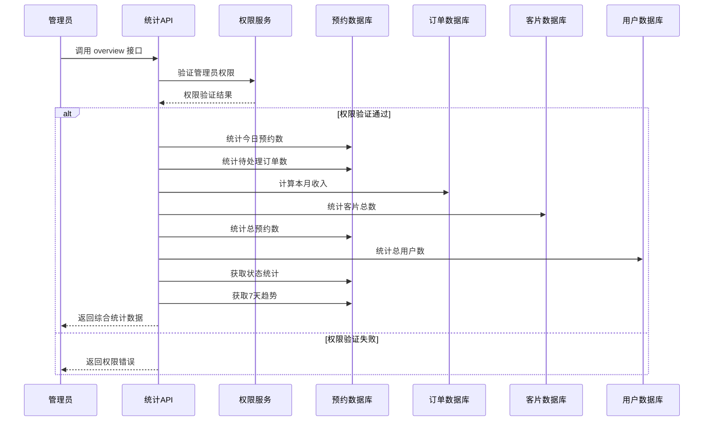
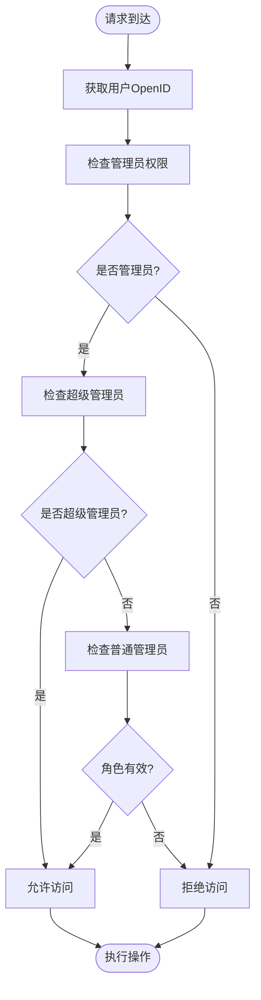
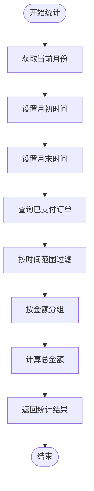
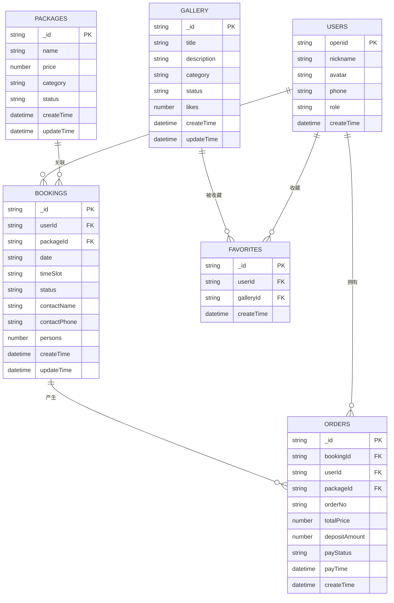
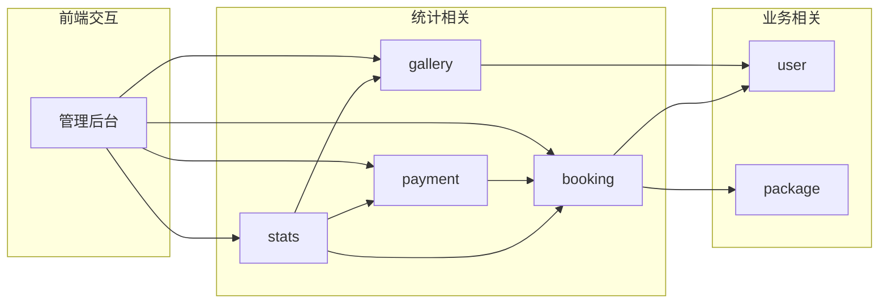
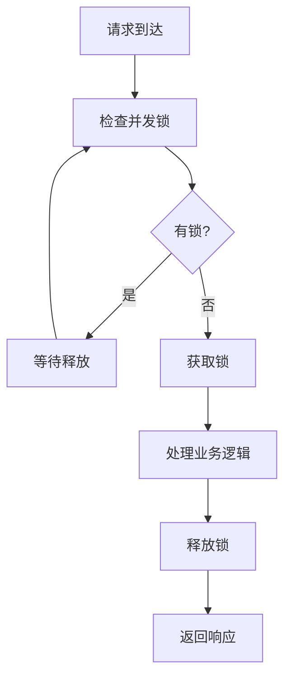

# 数据统计API

<cite>
**本文档引用的文件**
- [stats/index.js](file://miniprogram/cloudfunctions/stats/index.js)
- [stats/package.json](file://miniprogram/cloudfunctions/stats/package.json)
- [booking/index.js](file://miniprogram/cloudfunctions/booking/index.js)
- [gallery/index.js](file://miniprogram/cloudfunctions/gallery/index.js)
- [payment/index.js](file://miniprogram/cloudfunctions/payment/index.js)
- [user/index.js](file://miniprogram/cloudfunctions/user/index.js)
- [package/index.js](file://miniprogram/cloudfunctions/package/index.js)
- [dashboard/index.vue](file://miniprogram/src/pages-admin/dashboard/index.vue)
- [cloud.js](file://miniprogram/src/utils/cloud.js)
- [constants.js](file://miniprogram/src/utils/constants.js)
- [auth.js](file://miniprogram/src/utils/auth.js)
</cite>

## 目录
1. [简介](#简介)
2. [项目结构](#项目结构)
3. [核心组件](#核心组件)
4. [架构概览](#架构概览)
5. [详细组件分析](#详细组件分析)
6. [依赖关系分析](#依赖关系分析)
7. [性能考虑](#性能考虑)
8. [故障排除指南](#故障排除指南)
9. [结论](#结论)

## 简介

本项目是一个基于微信小程序的旅拍服务平台，包含完整的数据统计API系统。该系统提供了预约统计、收入统计、客片统计等功能，通过云函数接口为管理后台提供实时的数据分析能力。

系统采用云开发架构，所有统计功能都通过云函数实现，确保了数据的安全性和准确性。统计API支持管理员权限验证，提供多种统计维度的数据聚合和报表生成功能。

## 项目结构

项目采用模块化的云函数架构，每个功能模块都有独立的云函数目录：

**图表来源**
- [stats/index.js:1-229](file://miniprogram/cloudfunctions/stats/index.js#L1-L229)
- [booking/index.js:1-463](file://miniprogram/cloudfunctions/booking/index.js#L1-L463)
- [gallery/index.js:1-360](file://miniprogram/cloudfunctions/gallery/index.js#L1-L360)

**章节来源**
- [stats/index.js:1-229](file://miniprogram/cloudfunctions/stats/index.js#L1-L229)
- [stats/package.json:1-7](file://miniprogram/cloudfunctions/stats/package.json#L1-L7)

## 核心组件

### 统计API核心功能

系统的核心统计功能集中在stats云函数中，提供以下主要接口：

1. **数据概览接口** (`overview`)
   - 获取今日预约数、待处理订单数
   - 计算本月收入、客片总数、总预约数、总用户数
   - 提供各状态预约数量统计和最近7天预约趋势

2. **权限管理系统**
   - 管理员权限验证
   - 用户角色管理
   - 数据访问控制

3. **数据聚合引擎**
   - 实时数据统计
   - 多维度数据汇总
   - 时间序列分析

**章节来源**
- [stats/index.js:52-162](file://miniprogram/cloudfunctions/stats/index.js#L52-L162)
- [user/index.js:156-205](file://miniprogram/cloudfunctions/user/index.js#L156-L205)

## 架构概览

系统采用分层架构设计，确保统计功能的可扩展性和维护性：

**图表来源**
- [stats/index.js:73-162](file://miniprogram/cloudfunctions/stats/index.js#L73-L162)
- [booking/index.js:67-93](file://miniprogram/cloudfunctions/booking/index.js#L67-L93)
- [gallery/index.js:26-64](file://miniprogram/cloudfunctions/gallery/index.js#L26-L64)

## 详细组件分析

### 统计API核心实现

#### 数据概览接口 (getOverview)

数据概览接口是统计系统的核心，提供全面的业务指标统计：

**图表来源**
- [stats/index.js:73-162](file://miniprogram/cloudfunctions/stats/index.js#L73-L162)

#### 权限验证机制

系统实现了严格的权限控制机制：

**图表来源**
- [stats/index.js:11-25](file://miniprogram/cloudfunctions/stats/index.js#L11-L25)
- [user/index.js:156-205](file://miniprogram/cloudfunctions/user/index.js#L156-L205)

#### 数据聚合策略

系统采用多种数据聚合策略来优化统计性能：

1. **实时聚合**：对频繁查询的指标进行实时计算
2. **缓存策略**：对静态或低频变化的数据进行缓存
3. **批量查询**：减少数据库连接次数
4. **索引优化**：为常用查询字段建立索引

**章节来源**
- [stats/index.js:167-228](file://miniprogram/cloudfunctions/stats/index.js#L167-L228)

### 统计指标计算逻辑

#### 预约统计指标

系统提供多层次的预约统计指标：

| 指标类型 | 计算方式 | 数据来源 | 更新频率 |
|---------|---------|---------|---------|
| 今日预约数 | 按日期过滤 + 状态排除取消 | bookings | 实时 |
| 待处理订单 | 状态为已确认 | bookings | 实时 |
| 本月收入 | 按支付时间聚合 + 金额求和 | orders | 实时 |
| 客片总数 | 全量统计 | gallery | 实时 |
| 总预约数 | 全量统计 | bookings | 实时 |
| 总用户数 | 全量统计 | users | 实时 |

#### 收入统计机制

收入统计采用精确的时间范围计算：

**图表来源**
- [stats/index.js:99-121](file://miniprogram/cloudfunctions/stats/index.js#L99-L121)

#### 客片统计分析

客片统计提供完整的图片管理指标：

| 统计维度 | 计算方法 | 应用场景 |
|---------|---------|---------|
| 客片总数 | gallery表全量统计 | 总量监控 |
| 分类统计 | 按category分组统计 | 内容分析 |
| 点赞统计 | likes字段聚合 | 互动分析 |
| 发布状态 | 按status分组 | 内容质量 |

**章节来源**
- [gallery/index.js:67-103](file://miniprogram/cloudfunctions/gallery/index.js#L67-L103)

### 错误码定义

系统采用统一的错误码规范：

| 错误码 | 含义 | 说明 |
|-------|------|------|
| 0 | 成功 | 请求处理成功 |
| -1 | 通用错误 | 服务器内部错误 |
| -2 | 参数错误 | 请求参数缺失或格式错误 |
| -3 | 权限错误 | 无权限执行操作 |
| -4 | 业务错误 | 业务逻辑错误 |

**章节来源**
- [stats/index.js:57-67](file://miniprogram/cloudfunctions/stats/index.js#L57-L67)
- [booking/index.js:98-206](file://miniprogram/cloudfunctions/booking/index.js#L98-L206)

## 依赖关系分析

### 数据库依赖关系

系统涉及多个数据库集合之间的复杂关系：

**图表来源**
- [booking/index.js:134-148](file://miniprogram/cloudfunctions/booking/index.js#L134-L148)
- [payment/index.js:174-239](file://miniprogram/cloudfunctions/payment/index.js#L174-L239)

### 云函数依赖关系

**图表来源**
- [stats/index.js:1-229](file://miniprogram/cloudfunctions/stats/index.js#L1-L229)
- [booking/index.js:1-463](file://miniprogram/cloudfunctions/booking/index.js#L1-L463)
- [gallery/index.js:1-360](file://miniprogram/cloudfunctions/gallery/index.js#L1-L360)

**章节来源**
- [stats/index.js:1-229](file://miniprogram/cloudfunctions/stats/index.js#L1-L229)
- [booking/index.js:1-463](file://miniprogram/cloudfunctions/booking/index.js#L1-L463)

## 性能考虑

### 查询优化策略

1. **索引优化**
   - 为常用查询字段建立索引
   - 优化复合查询条件
   - 使用合适的查询范围

2. **聚合查询优化**
   - 使用数据库聚合功能减少网络传输
   - 批量查询减少连接开销
   - 缓存热点数据

3. **分页查询**
   - 合理设置分页大小
   - 使用游标分页提高性能
   - 避免深度分页查询

### 缓存策略

系统采用多层缓存策略：

1. **内存缓存**：缓存热点统计数据
2. **数据库缓存**：利用数据库聚合功能
3. **前端缓存**：缓存用户界面状态

### 并发控制

**图表来源**
- [booking/index.js:150-206](file://miniprogram/cloudfunctions/booking/index.js#L150-L206)

## 故障排除指南

### 常见问题诊断

1. **权限验证失败**
   - 检查用户OpenID是否正确
   - 验证用户角色配置
   - 确认数据库连接正常

2. **统计数据异常**
   - 检查数据聚合逻辑
   - 验证时间范围计算
   - 确认过滤条件正确

3. **接口响应超时**
   - 优化查询语句
   - 增加数据库索引
   - 实施分页查询

### 调试方法

1. **日志分析**
   - 查看云函数执行日志
   - 监控数据库查询日志
   - 分析错误堆栈信息

2. **性能监控**
   - 监控接口响应时间
   - 分析数据库查询性能
   - 跟踪内存使用情况

3. **数据验证**
   - 对比统计结果与实际数据
   - 验证数据完整性
   - 检查数据一致性

**章节来源**
- [stats/index.js:21-25](file://miniprogram/cloudfunctions/stats/index.js#L21-L25)
- [booking/index.js:202-206](file://miniprogram/cloudfunctions/booking/index.js#L202-L206)

## 结论

本数据统计API系统提供了完整的业务数据分析能力，具有以下特点：

1. **功能完整**：涵盖预约、收入、客片等核心业务指标
2. **权限严格**：完善的管理员权限控制机制
3. **性能优化**：采用多种优化策略确保系统性能
4. **易于扩展**：模块化设计便于功能扩展
5. **安全可靠**：数据访问控制和错误处理机制完善

系统通过云函数架构实现了高可用的数据统计服务，为管理后台提供了实时、准确的业务洞察，有助于提升运营效率和决策质量。