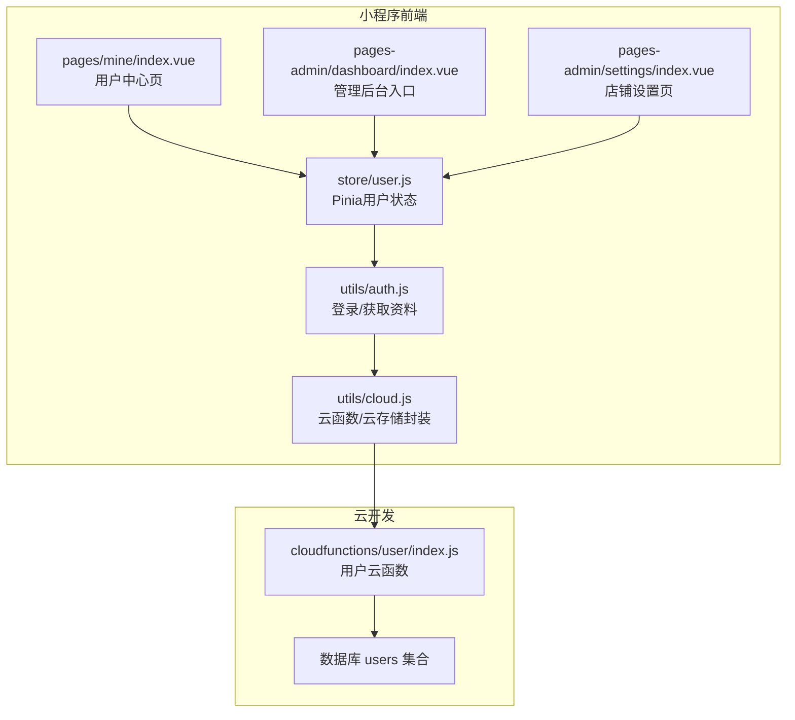
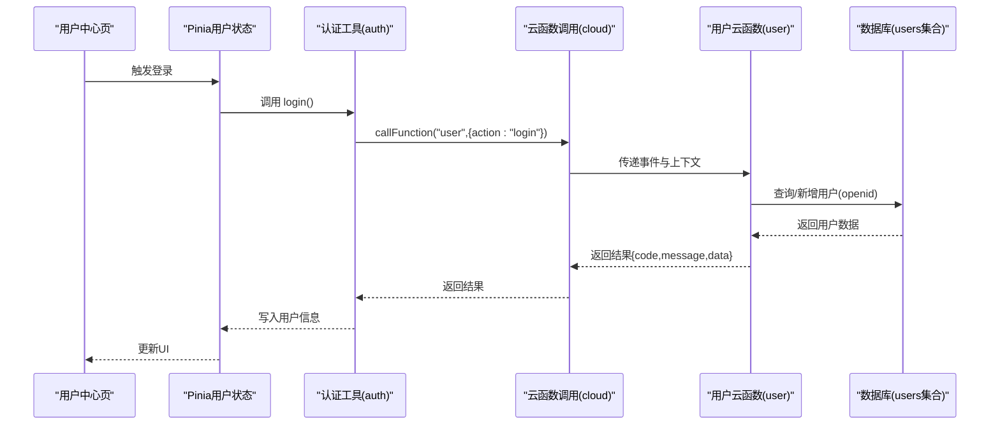
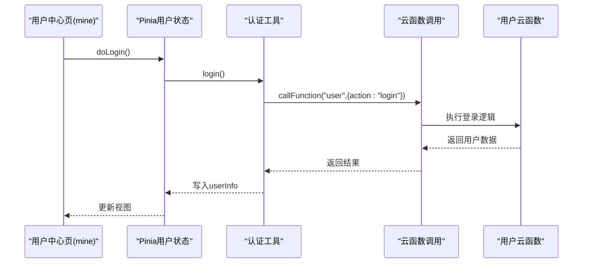
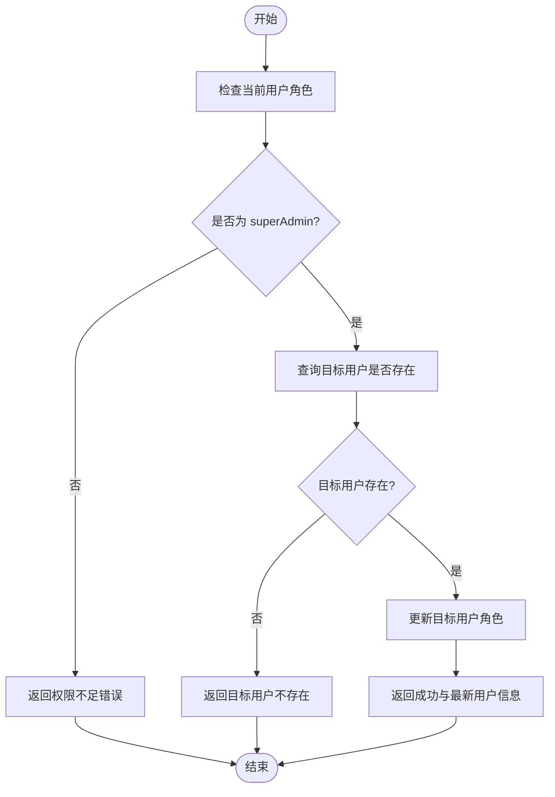
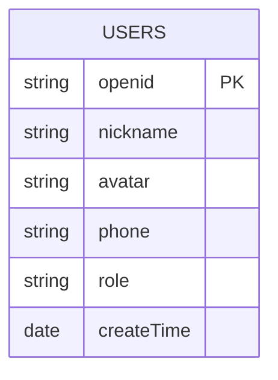
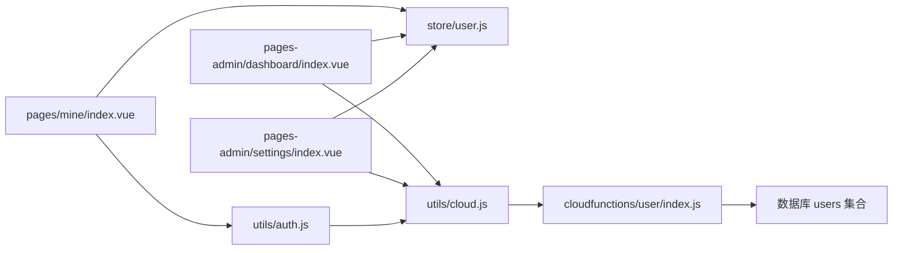

# 用户管理API

<cite>
**本文档引用的文件**
- [miniprogram/cloudfunctions/user/index.js](file://miniprogram/cloudfunctions/user/index.js)
- [miniprogram/src/utils/auth.js](file://miniprogram/src/utils/auth.js)
- [miniprogram/src/store/user.js](file://miniprogram/src/store/user.js)
- [miniprogram/src/pages/mine/index.vue](file://miniprogram/src/pages/mine/index.vue)
- [miniprogram/src/pages-admin/dashboard/index.vue](file://miniprogram/src/pages-admin/dashboard/index.vue)
- [miniprogram/src/pages-admin/settings/index.vue](file://miniprogram/src/pages-admin/settings/index.vue)
- [miniprogram/src/utils/cloud.js](file://miniprogram/src/utils/cloud.js)
- [miniprogram/cloudfunctions/user/package.json](file://miniprogram/cloudfunctions/user/package.json)
</cite>

## 目录
1. [简介](#简介)
2. [项目结构](#项目结构)
3. [核心组件](#核心组件)
4. [架构总览](#架构总览)
5. [详细组件分析](#详细组件分析)
6. [依赖关系分析](#依赖关系分析)
7. [性能考虑](#性能考虑)
8. [故障排查指南](#故障排查指南)
9. [结论](#结论)
10. [附录](#附录)

## 简介
本文件面向开发者与产品人员，系统化梳理用户管理API的云函数接口与前端集成方式，覆盖用户注册、登录、获取与更新个人信息、管理员角色变更等能力，并明确角色体系（user、admin、superAdmin）与权限控制逻辑。文档同时给出接口调用示例、安全机制、会话管理、测试方法与最佳实践。

## 项目结构
用户管理相关模块分布于云开发与前端小程序两端：
- 云函数：用户相关业务逻辑集中在 user 云函数，负责登录、查询、更新、角色管理等。
- 前端：通过 auth 工具封装调用云函数；Pinia store 管理用户状态；页面根据权限渲染管理入口。

图表来源
- [miniprogram/src/pages/mine/index.vue](file://miniprogram/src/pages/mine/index.vue)
- [miniprogram/src/store/user.js](file://miniprogram/src/store/user.js)
- [miniprogram/src/utils/auth.js](file://miniprogram/src/utils/auth.js)
- [miniprogram/src/utils/cloud.js](file://miniprogram/src/utils/cloud.js)
- [miniprogram/cloudfunctions/user/index.js](file://miniprogram/cloudfunctions/user/index.js)

章节来源
- [miniprogram/src/pages/mine/index.vue](file://miniprogram/src/pages/mine/index.vue)
- [miniprogram/src/store/user.js](file://miniprogram/src/store/user.js)
- [miniprogram/src/utils/auth.js](file://miniprogram/src/utils/auth.js)
- [miniprogram/src/utils/cloud.js](file://miniprogram/src/utils/cloud.js)
- [miniprogram/cloudfunctions/user/index.js](file://miniprogram/cloudfunctions/user/index.js)

## 核心组件
- 用户云函数（user）
  - 提供登录、获取资料、更新手机号、更新资料、设置管理员角色等动作。
  - 基于云开发数据库 users 集合进行数据持久化。
- 前端认证工具（auth）
  - 封装调用 user 云函数的动作，提供登录与获取资料方法。
- Pinia 用户状态（store/user）
  - 维护登录态、用户信息、管理员判断。
- 页面与权限控制
  - 用户中心页根据登录态显示信息与入口。
  - 管理后台页在进入时校验管理员权限。

章节来源
- [miniprogram/cloudfunctions/user/index.js](file://miniprogram/cloudfunctions/user/index.js)
- [miniprogram/src/utils/auth.js](file://miniprogram/src/utils/auth.js)
- [miniprogram/src/store/user.js](file://miniprogram/src/store/user.js)
- [miniprogram/src/pages/mine/index.vue](file://miniprogram/src/pages/mine/index.vue)
- [miniprogram/src/pages-admin/dashboard/index.vue](file://miniprogram/src/pages-admin/dashboard/index.vue)

## 架构总览
用户管理API采用“前端调用云函数 -> 云函数操作数据库”的分层设计。前端通过 wx.cloud.callFunction 调用 user 云函数，云函数基于 wx-server-sdk 获取用户上下文（openid），并在 users 集合上执行 CRUD 操作。管理员权限通过角色字段与校验逻辑实现。

图表来源
- [miniprogram/src/pages/mine/index.vue](file://miniprogram/src/pages/mine/index.vue)
- [miniprogram/src/store/user.js](file://miniprogram/src/store/user.js)
- [miniprogram/src/utils/auth.js](file://miniprogram/src/utils/auth.js)
- [miniprogram/src/utils/cloud.js](file://miniprogram/src/utils/cloud.js)
- [miniprogram/cloudfunctions/user/index.js](file://miniprogram/cloudfunctions/user/index.js)

## 详细组件分析

### 用户云函数（user）接口规范
- 通用响应格式
  - 成功：{ code: 0, message: "success", data: any }
  - 失败：{ code: -1, message: string }
- 通用参数
  - event.action: 指定操作类型（字符串）
  - event.data: 操作所需数据对象（可选）

接口一览
- 登录（action: "login"）
  - 方法：POST（通过 wx.cloud.callFunction）
  - 路径：云函数 user
  - 请求参数：无（使用云函数上下文中的 openid）
  - 响应：用户对象（含 openid、nickname、avatar、phone、role、createTime 等）
  - 错误码：-1（获取 openid 失败、服务器错误）
- 获取用户资料（action: "getProfile"）
  - 方法：POST
  - 路径：云函数 user
  - 请求参数：无
  - 响应：用户对象
  - 错误码：-1（未获取到 openid、用户不存在、服务器错误）
- 更新手机号（action: "updatePhone"）
  - 方法：POST
  - 路径：云函数 user
  - 请求参数：{ phone: string }
  - 响应：更新后的用户对象
  - 错误码：-1（openid 为空、手机号为空、格式不正确、用户不存在、服务器错误）
- 更新用户资料（action: "updateProfile"）
  - 方法：POST
  - 路径：云函数 user
  - 请求参数：{ nickname?: string, avatar?: string }
  - 响应：更新后的用户对象
  - 错误码：-1（openid 为空、更新数据为空、用户不存在、未提供有效字段、服务器错误）
- 设置管理员角色（action: "setAdmin"）
  - 方法：POST
  - 路径：云函数 user
  - 请求参数：{ targetOpenid: string, role: "user"|"admin"|"superAdmin" }
  - 响应：被修改用户的最新用户对象
  - 错误码：-1（openid 为空、目标 openid 为空、角色非法、当前用户非 superAdmin、目标用户不存在、服务器错误）

章节来源
- [miniprogram/cloudfunctions/user/index.js](file://miniprogram/cloudfunctions/user/index.js)

### 前端调用与状态管理
- 登录流程
  - 页面触发登录 -> 调用 auth.login -> 通过 cloud.callFunction 调用 user 云函数 -> 写入 Pinia 用户状态 -> 更新页面 UI。
- 用户状态
  - store/user 维护 userInfo、isLoggedIn、isAdminUser，并提供 doLogin、fetchProfile、clearUser。
- 权限控制
  - auth 工具提供 isAdmin、isSuperAdmin 判断；管理后台页在进入时检查权限并提示或跳转。

图表来源
- [miniprogram/src/pages/mine/index.vue](file://miniprogram/src/pages/mine/index.vue)
- [miniprogram/src/store/user.js](file://miniprogram/src/store/user.js)
- [miniprogram/src/utils/auth.js](file://miniprogram/src/utils/auth.js)
- [miniprogram/src/utils/cloud.js](file://miniprogram/src/utils/cloud.js)
- [miniprogram/cloudfunctions/user/index.js](file://miniprogram/cloudfunctions/user/index.js)

章节来源
- [miniprogram/src/pages/mine/index.vue](file://miniprogram/src/pages/mine/index.vue)
- [miniprogram/src/store/user.js](file://miniprogram/src/store/user.js)
- [miniprogram/src/utils/auth.js](file://miniprogram/src/utils/auth.js)
- [miniprogram/src/utils/cloud.js](file://miniprogram/src/utils/cloud.js)

### 角色体系与权限控制
- 角色定义
  - user：普通用户
  - admin：管理员
  - superAdmin：超级管理员
- 权限规则
  - setAdmin 接口仅允许 superAdmin 调用，且需提供合法角色值。
  - 前端 isAdmin/isSuperAdmin 基于用户对象的 role 字段判断。
  - 管理后台入口仅在用户具备 admin/admin 权限时显示。

图表来源
- [miniprogram/cloudfunctions/user/index.js](file://miniprogram/cloudfunctions/user/index.js)
- [miniprogram/src/utils/auth.js](file://miniprogram/src/utils/auth.js)

章节来源
- [miniprogram/cloudfunctions/user/index.js](file://miniprogram/cloudfunctions/user/index.js)
- [miniprogram/src/utils/auth.js](file://miniprogram/src/utils/auth.js)

### 数据模型
- 用户集合（users）字段
  - openid：用户唯一标识（来自微信开放平台）
  - nickname：昵称
  - avatar：头像URL
  - phone：手机号
  - role：角色（user/admin/superAdmin）
  - createTime：创建时间（服务端时间）

图表来源
- [miniprogram/cloudfunctions/user/index.js](file://miniprogram/cloudfunctions/user/index.js)

章节来源
- [miniprogram/cloudfunctions/user/index.js](file://miniprogram/cloudfunctions/user/index.js)

### 安全机制与会话管理
- 会话与身份
  - 云函数通过 wx-server-sdk 获取 OPENID，作为用户唯一标识。
  - 前端通过 wx.checkSession 判断登录态有效性（工具中提供 checkAuth 方法）。
- 参数校验
  - 更新手机号时进行格式校验。
  - setAdmin 接口对角色值进行白名单校验。
- 权限隔离
  - setAdmin 仅允许 superAdmin 执行，避免越权提升角色。

章节来源
- [miniprogram/cloudfunctions/user/index.js](file://miniprogram/cloudfunctions/user/index.js)
- [miniprogram/src/utils/auth.js](file://miniprogram/src/utils/auth.js)

## 依赖关系分析
- 前端依赖
  - pages/mine/index.vue 依赖 store/user 与 utils/auth。
  - pages-admin/dashboard/index.vue 与 pages-admin/settings/index.vue 依赖 store/user 与 utils/cloud。
  - utils/cloud.js 依赖 wx.cloud 封装云函数与云存储。
- 云函数依赖
  - user 云函数依赖 wx-server-sdk 与数据库 users 集合。
- 角色与权限
  - auth 工具提供 isAdmin/isSuperAdmin，管理后台页在进入时进行权限检查。

图表来源
- [miniprogram/src/pages/mine/index.vue](file://miniprogram/src/pages/mine/index.vue)
- [miniprogram/src/pages-admin/dashboard/index.vue](file://miniprogram/src/pages-admin/dashboard/index.vue)
- [miniprogram/src/pages-admin/settings/index.vue](file://miniprogram/src/pages-admin/settings/index.vue)
- [miniprogram/src/store/user.js](file://miniprogram/src/store/user.js)
- [miniprogram/src/utils/auth.js](file://miniprogram/src/utils/auth.js)
- [miniprogram/src/utils/cloud.js](file://miniprogram/src/utils/cloud.js)
- [miniprogram/cloudfunctions/user/index.js](file://miniprogram/cloudfunctions/user/index.js)

章节来源
- [miniprogram/src/pages/mine/index.vue](file://miniprogram/src/pages/mine/index.vue)
- [miniprogram/src/pages-admin/dashboard/index.vue](file://miniprogram/src/pages-admin/dashboard/index.vue)
- [miniprogram/src/pages-admin/settings/index.vue](file://miniprogram/src/pages-admin/settings/index.vue)
- [miniprogram/src/store/user.js](file://miniprogram/src/store/user.js)
- [miniprogram/src/utils/auth.js](file://miniprogram/src/utils/auth.js)
- [miniprogram/src/utils/cloud.js](file://miniprogram/src/utils/cloud.js)
- [miniprogram/cloudfunctions/user/index.js](file://miniprogram/cloudfunctions/user/index.js)

## 性能考虑
- 减少不必要的数据库查询：登录时若用户已存在则直接返回，避免重复写入。
- 合理使用更新字段：更新资料时仅传入需要变更的字段，减少写放大。
- 前端缓存策略：Pinia 中缓存用户信息，避免频繁调用云函数。
- 管理后台按需加载：统计与设置页面在进入时再拉取数据，避免首屏阻塞。

## 故障排查指南
- 云函数执行错误
  - 现象：返回 { code: -1, message } 或服务器错误。
  - 排查：检查云函数日志、网络与权限。
- openid 获取失败
  - 现象：登录/查询/更新时报错。
  - 排查：确认运行环境、用户授权与 wx-server-sdk 初始化。
- 手机号格式不正确
  - 现象：更新手机号失败。
  - 排查：确认传入格式符合中国大陆手机号规则。
- 权限不足
  - 现象：setAdmin 返回权限不足。
  - 排查：确认当前用户角色为 superAdmin，且目标用户存在。
- 前端调用失败
  - 现象：调用云函数返回错误。
  - 排查：检查 utils/cloud.js 的封装逻辑与 wx.cloud 状态。

章节来源
- [miniprogram/cloudfunctions/user/index.js](file://miniprogram/cloudfunctions/user/index.js)
- [miniprogram/src/utils/cloud.js](file://miniprogram/src/utils/cloud.js)

## 结论
用户管理API以简洁的云函数接口与前端状态管理相结合，实现了从登录到资料维护再到角色管理的完整闭环。通过角色与权限控制确保后台操作的安全性，配合前端缓存与按需加载优化用户体验。建议在生产环境中持续关注日志与错误监控，完善边界条件与异常处理。

## 附录

### 接口调用示例（步骤说明）
- 登录
  - 前端：调用 auth.login -> 云函数 user 执行 action: "login" -> 返回用户对象。
- 获取用户资料
  - 前端：调用 auth.getUserProfile -> 云函数 user 执行 action: "getProfile" -> 返回用户对象。
- 更新手机号
  - 前端：准备 { phone } -> 调用云函数 user 执行 action: "updatePhone" -> 返回更新后用户对象。
- 更新用户资料
  - 前端：准备 { nickname?, avatar? } -> 调用云函数 user 执行 action: "updateProfile" -> 返回更新后用户对象。
- 设置管理员角色
  - 前端：准备 { targetOpenid, role } -> 调用云函数 user 执行 action: "setAdmin" -> 返回目标用户最新对象。

章节来源
- [miniprogram/src/utils/auth.js](file://miniprogram/src/utils/auth.js)
- [miniprogram/src/utils/cloud.js](file://miniprogram/src/utils/cloud.js)
- [miniprogram/cloudfunctions/user/index.js](file://miniprogram/cloudfunctions/user/index.js)

### 测试方法
- 单元测试（云函数）
  - 使用云开发提供的本地调试与单元测试框架，针对各 action 编写用例，覆盖正常路径与异常分支（如 openid 为空、手机号格式错误、权限不足等）。
- 端到端测试（小程序）
  - 在模拟器中执行登录、查看资料、更新资料、切换角色等流程，观察 UI 变化与错误提示。
- 权限测试
  - 使用不同角色用户账号进行 setAdmin 调用，验证权限控制逻辑。

### 最佳实践
- 前端
  - 使用 Pinia 缓存用户信息，避免重复请求。
  - 对用户输入进行前端校验（如手机号格式），降低后端压力。
  - 管理后台页面在进入时统一做权限检查。
- 云函数
  - 明确 action 分发与参数校验，保持错误码与消息一致。
  - 对敏感操作（如角色变更）增加幂等与审计思路。
- 安全
  - 严格限制角色变更权限，仅允许 superAdmin 操作。
  - 对外暴露的云函数尽量最小化权限，避免越权。