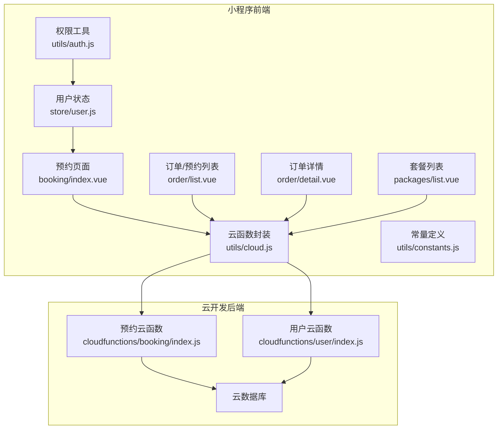
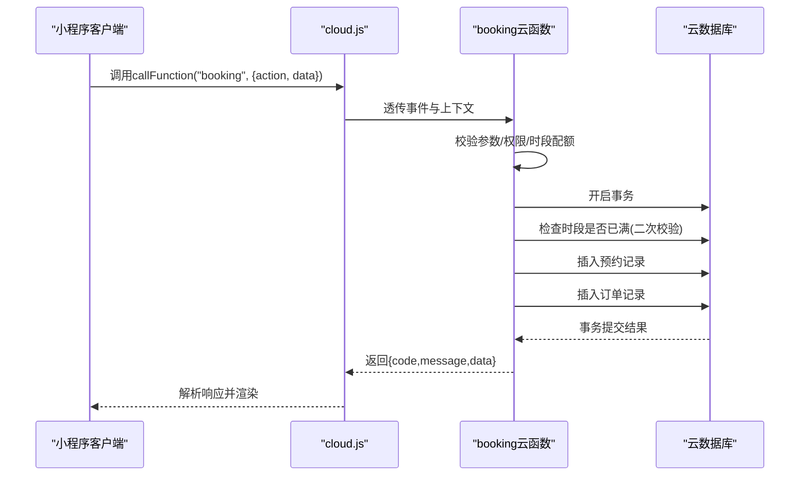
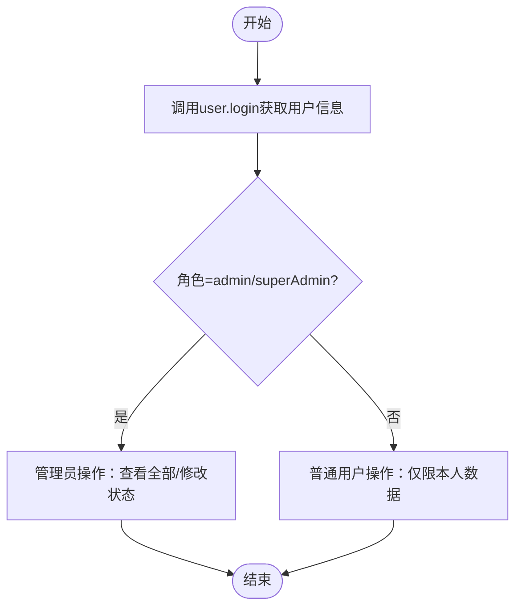
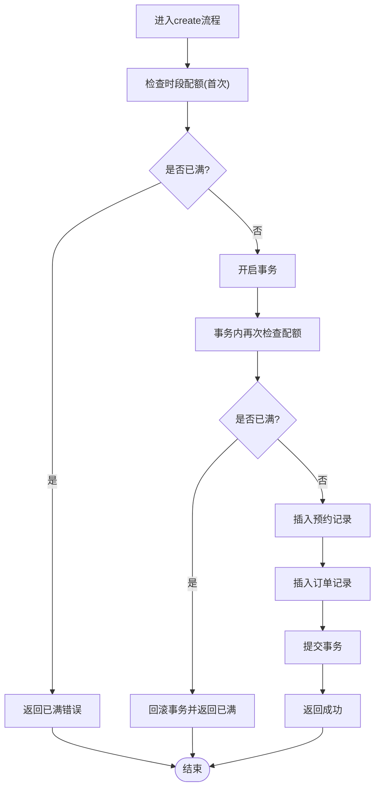
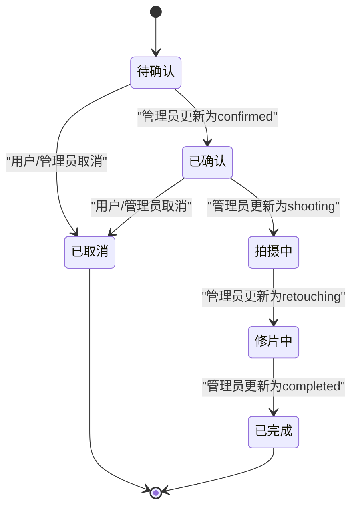
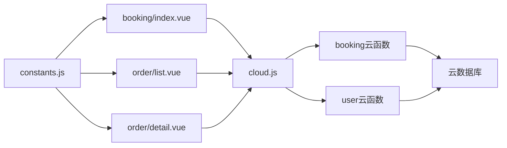

# 预约管理API

<cite>
**本文档引用的文件**
- [booking/index.js](file://miniprogram/cloudfunctions/booking/index.js)
- [booking/package.json](file://miniprogram/cloudfunctions/booking/package.json)
- [cloud.js](file://miniprogram/src/utils/cloud.js)
- [constants.js](file://miniprogram/src/utils/constants.js)
- [booking/index.vue](file://miniprogram/src/pages/booking/index.vue)
- [order/list.vue](file://miniprogram/src/pages/order/list.vue)
- [order/detail.vue](file://miniprogram/src/pages/order/detail.vue)
- [packages/list.vue](file://miniprogram/src/pages/packages/list.vue)
- [user/index.js](file://miniprogram/cloudfunctions/user/index.js)
- [user.js](file://miniprogram/src/store/user.js)
- [auth.js](file://miniprogram/src/utils/auth.js)
</cite>

## 目录
1. [简介](#简介)
2. [项目结构](#项目结构)
3. [核心组件](#核心组件)
4. [架构总览](#架构总览)
5. [详细组件分析](#详细组件分析)
6. [依赖关系分析](#依赖关系分析)
7. [性能考虑](#性能考虑)
8. [故障排除指南](#故障排除指南)
9. [结论](#结论)
10. [附录](#附录)

## 简介
本文件为预约管理API的完整技术文档，覆盖云函数接口设计与实现，包括创建预约、查询预约列表、获取预约详情、取消预约、更新预约状态、获取可用时段等核心能力。文档同时阐述权限验证机制、并发控制与事务处理、时段限制策略，并提供接口调用示例、错误码定义、测试方法与常见问题解决方案。

## 项目结构
预约管理API由云开发后端与小程序前端共同组成：
- 后端云函数：booking（预约管理）、user（用户管理）
- 前端页面：预约页面、订单/预约列表、订单详情、套餐列表
- 工具模块：云函数封装、常量定义、权限工具

**图表来源**
- [booking/index.js:67-93](file://miniprogram/cloudfunctions/booking/index.js#L67-L93)
- [cloud.js:5-26](file://miniprogram/src/utils/cloud.js#L5-L26)
- [booking/index.vue:207-494](file://miniprogram/src/pages/booking/index.vue#L207-L494)
- [order/list.vue:144-322](file://miniprogram/src/pages/order/list.vue#L144-L322)
- [order/detail.vue:145-284](file://miniprogram/src/pages/order/detail.vue#L145-L284)
- [packages/list.vue:57-131](file://miniprogram/src/pages/packages/list.vue#L57-L131)
- [user/index.js:7-31](file://miniprogram/cloudfunctions/user/index.js#L7-L31)

**章节来源**
- [booking/index.js:1-463](file://miniprogram/cloudfunctions/booking/index.js#L1-L463)
- [booking/package.json:1-7](file://miniprogram/cloudfunctions/booking/package.json#L1-L7)
- [cloud.js:1-66](file://miniprogram/src/utils/cloud.js#L1-L66)
- [constants.js:1-73](file://miniprogram/src/utils/constants.js#L1-L73)
- [booking/index.vue:1-1029](file://miniprogram/src/pages/booking/index.vue#L1-L1029)
- [order/list.vue:1-554](file://miniprogram/src/pages/order/list.vue#L1-L554)
- [order/detail.vue:1-451](file://miniprogram/src/pages/order/detail.vue#L1-L451)
- [packages/list.vue:1-305](file://miniprogram/src/pages/packages/list.vue#L1-L305)
- [user/index.js:1-206](file://miniprogram/cloudfunctions/user/index.js#L1-L206)
- [user.js:1-48](file://miniprogram/src/store/user.js#L1-L48)
- [auth.js:1-47](file://miniprogram/src/utils/auth.js#L1-L47)

## 核心组件
- 云函数 booking：提供预约生命周期管理与可用时段查询
- 云函数 user：提供用户登录、资料查询与角色管理
- 前端工具 cloud.js：统一封装 wx.cloud.callFunction 调用
- 常量定义 constants.js：包含预约状态、支付状态、时段等枚举
- 前端页面：预约页面负责创建预约；订单/预约列表与详情负责查询与取消

**章节来源**
- [booking/index.js:67-93](file://miniprogram/cloudfunctions/booking/index.js#L67-L93)
- [user/index.js:7-31](file://miniprogram/cloudfunctions/user/index.js#L7-L31)
- [cloud.js:5-26](file://miniprogram/src/utils/cloud.js#L5-L26)
- [constants.js:22-56](file://miniprogram/src/utils/constants.js#L22-L56)

## 架构总览
预约管理API采用“前端调用云函数 -> 云函数访问数据库”的模式。关键流程：
- 前端通过 cloud.js 统一调用 booking 云函数
- 云函数根据 action 分发到具体业务逻辑
- 通过事务保证创建预约时的原子性（预约记录与订单记录）
- 通过时段配额与二次检查防止超卖
- 权限校验区分普通用户与管理员

**图表来源**
- [cloud.js:5-26](file://miniprogram/src/utils/cloud.js#L5-L26)
- [booking/index.js:98-206](file://miniprogram/cloudfunctions/booking/index.js#L98-L206)

**章节来源**
- [booking/index.js:98-206](file://miniprogram/cloudfunctions/booking/index.js#L98-L206)
- [cloud.js:5-26](file://miniprogram/src/utils/cloud.js#L5-L26)

## 详细组件分析

### 接口定义与调用规范

#### create（创建预约）
- HTTP方法：POST（通过 wx.cloud.callFunction）
- URL路径：云函数名称 booking
- 请求参数
  - packageId：套餐ID（必填）
  - date：预约日期（YYYY-MM-DD，必填）
  - timeSlot：预约时段（morning/afternoon/golden，必填）
  - contactName：联系人姓名（必填）
  - contactPhone：联系电话（必填）
  - persons：拍摄人数（≥1，必填）
  - remark：备注（可选）
- 响应格式
  - code：0表示成功，非0为错误码
  - message：描述信息
  - data：包含 booking 与 order 对象
- 错误码
  - -1：参数缺失或无效、时段已满、套餐不存在、服务器内部错误
- 实现要点
  - 参数校验与时段有效性校验
  - 时段配额检查（首次检查与事务内二次检查）
  - 事务：同时创建预约记录与订单记录
  - 订单号生成规则：LP + 年月日时分秒 + 4位随机数

**章节来源**
- [booking/index.js:98-206](file://miniprogram/cloudfunctions/booking/index.js#L98-L206)
- [booking/index.vue:423-470](file://miniprogram/src/pages/booking/index.vue#L423-L470)

#### list（查询预约列表）
- HTTP方法：POST
- URL路径：云函数名称 booking
- 请求参数
  - isAdmin：是否以管理员身份查询（可选）
  - status：按状态过滤（可选）
  - date：按日期过滤（可选）
  - page/pageSize：分页参数
- 响应格式
  - code/message/data.list/data.total/data.page/data.pageSize
- 权限
  - 非管理员仅能查看自己的预约
  - 管理员需具备 admin/superAdmin 角色

**章节来源**
- [booking/index.js:211-259](file://miniprogram/cloudfunctions/booking/index.js#L211-L259)

#### detail（获取预约详情）
- HTTP方法：POST
- URL路径：云函数名称 booking
- 请求参数
  - id：预约ID（必填）
- 响应格式
  - code/message/data.booking/data.order
- 权限
  - 非管理员仅能查看自己的预约

**章节来源**
- [booking/index.js:264-303](file://miniprogram/cloudfunctions/booking/index.js#L264-L303)

#### cancel（取消预约）
- HTTP方法：POST
- URL路径：云函数名称 booking
- 请求参数
  - id：预约ID（必填）
- 响应格式
  - code/message/data.bookingId/data.cancelled/data.needRefund/data.refundMessage
- 权限
  - 非管理员仅能取消自己的预约
- 限制
  - 已完成或已取消的预约不可重复取消
- 退款
  - 若订单已支付，标记为退款中并返回提示

**章节来源**
- [booking/index.js:308-385](file://miniprogram/cloudfunctions/booking/index.js#L308-L385)

#### updateStatus（更新预约状态，管理员）
- HTTP方法：POST
- URL路径：云函数名称 booking
- 请求参数
  - id：预约ID（必填）
  - status：有效值 pending/confirmed/shooting/retouching/completed/cancelled（必填）
- 响应格式
  - code/message/data.bookingId/data.status/data.updateTime
- 权限
  - 仅 admin/superAdmin 可执行

**章节来源**
- [booking/index.js:390-438](file://miniprogram/cloudfunctions/booking/index.js#L390-L438)

#### availableSlots（获取可用时段）
- HTTP方法：POST
- URL路径：云函数名称 booking
- 请求参数
  - date：日期（YYYY-MM-DD，必填）
- 响应格式
  - code/message/data.{morning/afternoon/golden}: {booked, available, isFull}
- 限制
  - 每个时段最多允许5个预约

**章节来源**
- [booking/index.js:443-462](file://miniprogram/cloudfunctions/booking/index.js#L443-L462)

### 权限验证机制
- 用户登录与角色
  - 通过 user 云函数进行登录与资料查询
  - 用户角色：user/admin/superAdmin
- 前端权限判断
  - 使用 auth.js 的 isAdmin/isSuperAdmin 进行角色判断
  - Pinia store 中的 useUserStore 管理登录态与角色
- 后端权限校验
  - checkAdmin：从 users 集合查询角色
  - 管理员可查看全部预约并修改状态
  - 普通用户仅能查看/取消自己的预约

**图表来源**
- [user/index.js:34-67](file://miniprogram/cloudfunctions/user/index.js#L34-L67)
- [auth.js:28-36](file://miniprogram/src/utils/auth.js#L28-L36)
- [user.js:5-47](file://miniprogram/src/store/user.js#L5-L47)

**章节来源**
- [user/index.js:34-67](file://miniprogram/cloudfunctions/user/index.js#L34-L67)
- [auth.js:28-36](file://miniprogram/src/utils/auth.js#L28-L36)
- [user.js:5-47](file://miniprogram/src/store/user.js#L5-L47)

### 并发控制与事务处理
- 时段配额防超卖
  - 首次检查：在进入事务前检查时段是否已满
  - 二次检查：在事务内再次计数，避免并发场景下的超卖
- 事务保证
  - 同步插入预约记录与订单记录，失败回滚
- 时间槽配置
  - TIME_SLOTS：morning/afternoon/golden
  - MAX_BOOKINGS_PER_SLOT：每时段最大预约数

**图表来源**
- [booking/index.js:114-167](file://miniprogram/cloudfunctions/booking/index.js#L114-L167)
- [booking/index.js:150-206](file://miniprogram/cloudfunctions/booking/index.js#L150-L206)

**章节来源**
- [booking/index.js:114-167](file://miniprogram/cloudfunctions/booking/index.js#L114-L167)
- [booking/index.js:150-206](file://miniprogram/cloudfunctions/booking/index.js#L150-L206)

### 预约状态机
- 状态枚举
  - pending：待确认
  - confirmed：已确认
  - shooting：拍摄中
  - retouching：修片中
  - completed：已完成
  - cancelled：已取消
- 状态流转
  - 创建后初始状态为 pending
  - 管理员可将状态推进至 confirmed/shooting/retouching/completed
  - 支持取消（cancelled），已完成不可取消

**图表来源**
- [constants.js:29-37](file://miniprogram/src/utils/constants.js#L29-L37)

**章节来源**
- [constants.js:29-37](file://miniprogram/src/utils/constants.js#L29-L37)

### 前端调用示例与参数说明
- 预约页面（创建预约）
  - 调用方式：callFunction('booking', { action: 'create', data })
  - 关键参数：packageId/date/timeSlot/contactName/contactPhone/persons/remark
  - 成功后跳转支付页
- 取消预约
  - 调用方式：callFunction('booking', { action: 'cancel', data: { id } })
  - 成功后刷新列表
- 查询可用时段
  - 调用方式：callFunction('booking', { action: 'availableSlots', data: { date } })

**章节来源**
- [booking/index.vue:423-470](file://miniprogram/src/pages/booking/index.vue#L423-L470)
- [order/list.vue:292-311](file://miniprogram/src/pages/order/list.vue#L292-L311)
- [order/detail.vue:192-196](file://miniprogram/src/pages/order/detail.vue#L192-L196)

## 依赖关系分析
- 前端对云函数的依赖
  - booking/index.vue 依赖 cloud.js 调用 booking 云函数
  - order/list.vue 与 order/detail.vue 依赖 cloud.js 调用 booking 云函数
- 云函数对数据库的依赖
  - booking 云函数读写 bookings、orders、packages、users 集合
  - user 云函数读写 users 集合
- 常量与状态
  - constants.js 提供状态枚举与时段配置，被前端页面广泛使用

**图表来源**
- [booking/index.vue:210-400](file://miniprogram/src/pages/booking/index.vue#L210-L400)
- [order/list.vue:146-322](file://miniprogram/src/pages/order/list.vue#L146-L322)
- [order/detail.vue:147-284](file://miniprogram/src/pages/order/detail.vue#L147-L284)
- [cloud.js:5-26](file://miniprogram/src/utils/cloud.js#L5-L26)
- [booking/index.js:67-93](file://miniprogram/cloudfunctions/booking/index.js#L67-L93)
- [user/index.js:7-31](file://miniprogram/cloudfunctions/user/index.js#L7-L31)
- [constants.js:22-56](file://miniprogram/src/utils/constants.js#L22-L56)

**章节来源**
- [booking/index.vue:210-400](file://miniprogram/src/pages/booking/index.vue#L210-L400)
- [order/list.vue:146-322](file://miniprogram/src/pages/order/list.vue#L146-L322)
- [order/detail.vue:147-284](file://miniprogram/src/pages/order/detail.vue#L147-L284)
- [cloud.js:5-26](file://miniprogram/src/utils/cloud.js#L5-L26)
- [booking/index.js:67-93](file://miniprogram/cloudfunctions/booking/index.js#L67-L93)
- [user/index.js:7-31](file://miniprogram/cloudfunctions/user/index.js#L7-L31)
- [constants.js:22-56](file://miniprogram/src/utils/constants.js#L22-L56)

## 性能考虑
- 数据库查询优化
  - 在 bookings 上按 date/timeSlot/status 建立复合索引可提升时段统计与列表查询性能
- 事务范围
  - 事务内仅包含必要的插入操作，避免长时间持有锁
- 前端分页
  - 列表接口支持分页，建议合理设置 pageSize，减少一次性传输数据量
- 缓存策略
  - 可在前端缓存可用时段结果，减少重复请求

## 故障排除指南
- 常见错误与排查
  - 未知操作：检查 event.action 是否正确传递
  - 无权限：确认用户角色或调用时 isAdmin 参数
  - 时段已满：检查 availableSlots 返回值，或等待其他用户取消
  - 预约不存在：确认传入的 id 是否正确
  - 服务器内部错误：查看云函数日志定位异常
- 前端调试
  - 使用 uni.showToast 展示错误信息
  - 在开发工具中查看网络面板与云函数日志

**章节来源**
- [booking/index.js:86-92](file://miniprogram/cloudfunctions/booking/index.js#L86-L92)
- [order/list.vue:292-311](file://miniprogram/src/pages/order/list.vue#L292-L311)
- [order/detail.vue:225-247](file://miniprogram/src/pages/order/detail.vue#L225-L247)

## 结论
预约管理API通过清晰的接口设计、严格的权限控制与并发保护，实现了从创建、查询、取消到状态管理的完整闭环。前端通过统一的云函数封装简化了调用流程，后端通过事务与时段配额保障了数据一致性与业务规则。建议在生产环境中完善索引、监控与告警，持续优化用户体验。

## 附录

### 接口调用示例（路径参考）
- 创建预约
  - [booking/index.vue:423-470](file://miniprogram/src/pages/booking/index.vue#L423-L470)
- 取消预约
  - [order/list.vue:292-311](file://miniprogram/src/pages/order/list.vue#L292-L311)
  - [order/detail.vue:225-247](file://miniprogram/src/pages/order/detail.vue#L225-L247)
- 查询可用时段
  - [booking/index.vue:342-356](file://miniprogram/src/pages/booking/index.vue#L342-L356)

### 常量与状态（路径参考）
- 预约状态与支付状态
  - [constants.js:29-56](file://miniprogram/src/utils/constants.js#L29-L56)
- 时段配置
  - [constants.js:22-27](file://miniprogram/src/utils/constants.js#L22-L27)