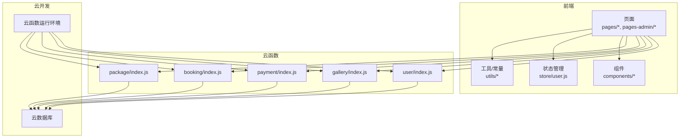
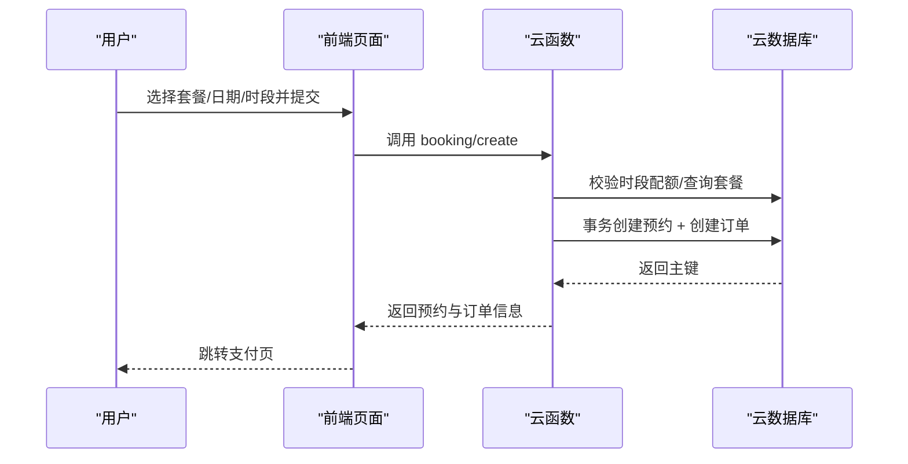
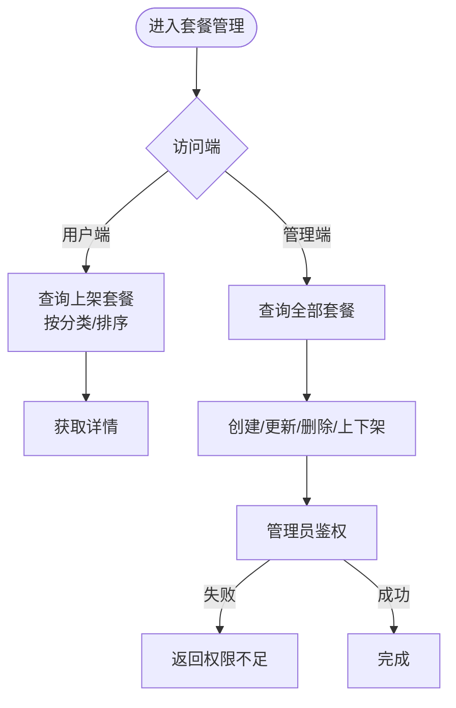
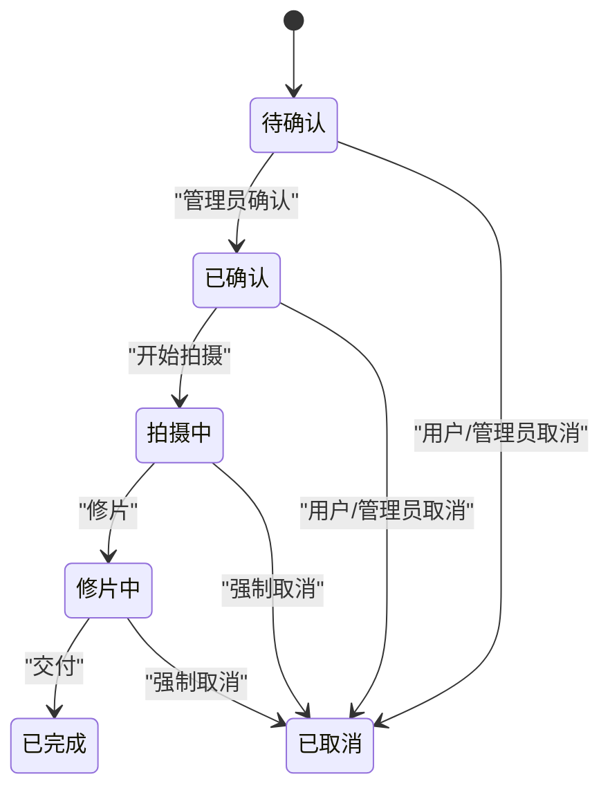
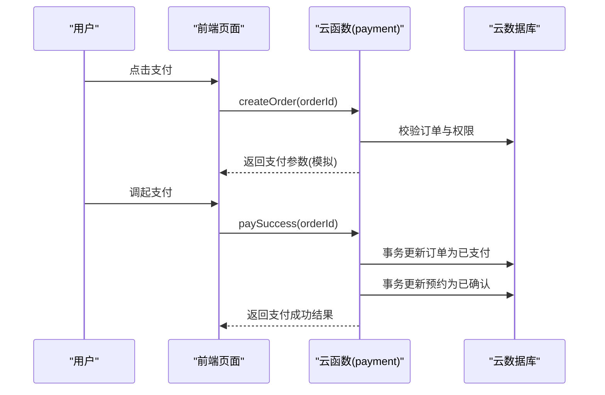
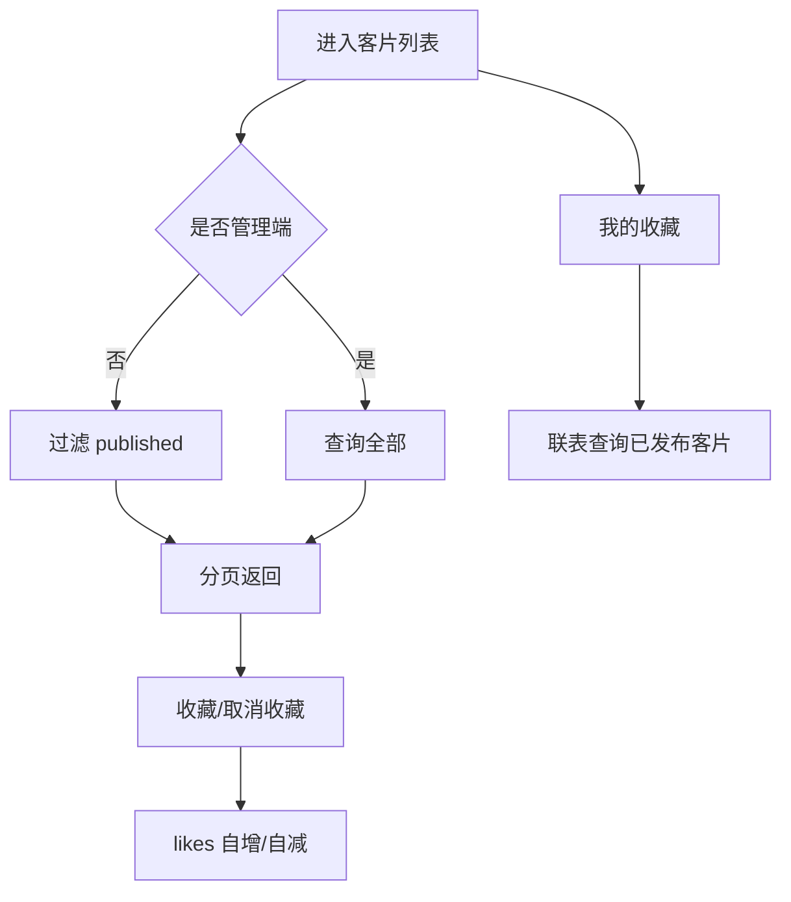
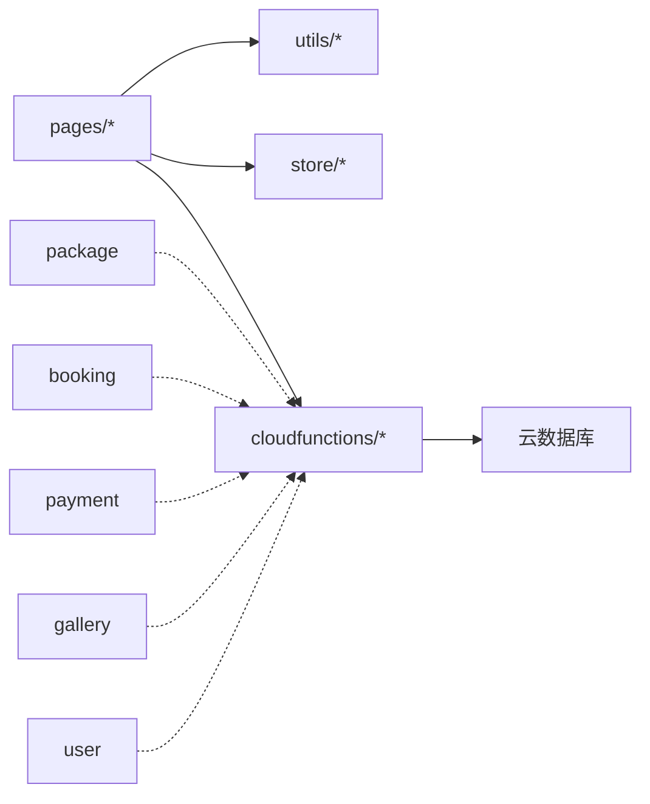

# 业务功能

<cite>
**本文引用的文件**
- [miniprogram/src/pages.json](file://miniprogram/src/pages.json)
- [miniprogram/package.json](file://miniprogram/package.json)
- [miniprogram/cloudfunctions/package/index.js](file://miniprogram/cloudfunctions/package/index.js)
- [miniprogram/cloudfunctions/booking/index.js](file://miniprogram/cloudfunctions/booking/index.js)
- [miniprogram/cloudfunctions/payment/index.js](file://miniprogram/cloudfunctions/payment/index.js)
- [miniprogram/cloudfunctions/gallery/index.js](file://miniprogram/cloudfunctions/gallery/index.js)
- [miniprogram/cloudfunctions/user/index.js](file://miniprogram/cloudfunctions/user/index.js)
- [miniprogram/src/utils/constants.js](file://miniprogram/src/utils/constants.js)
- [miniprogram/src/components/PackageCard.vue](file://miniprogram/src/components/PackageCard.vue)
- [miniprogram/src/components/GalleryItem.vue](file://miniprogram/src/components/GalleryItem.vue)
- [miniprogram/src/pages/booking/index.vue](file://miniprogram/src/pages/booking/index.vue)
</cite>

## 目录
1. [简介](#简介)
2. [项目结构](#项目结构)
3. [核心组件](#核心组件)
4. [架构总览](#架构总览)
5. [详细组件分析](#详细组件分析)
6. [依赖分析](#依赖分析)
7. [性能考虑](#性能考虑)
8. [故障排查指南](#故障排查指南)
9. [结论](#结论)
10. [附录](#附录)

## 简介
本项目为“朵兰摄影”微信小程序，围绕旅拍服务构建，提供从套餐浏览、预约拍摄、支付到客片展示与个人中心的完整业务闭环。系统采用前后端分离架构：前端使用 Vue 3 + UniApp，后端通过云开发云函数承载业务逻辑；数据库采用云开发数据库，统一存储用户、套餐、预约、订单、客片等数据。

## 项目结构
- 前端目录
  - pages：页面级路由与视图，如首页、套餐、客片、预约、支付、门店、个人中心、订单等
  - pages-admin：管理后台页面，如仪表盘、订单管理、套餐管理、客片管理、设置
  - components：通用组件，如套餐卡片、客片条目、导航栏、浮动按钮
  - utils：常量与工具，如业务常量、云函数调用封装、鉴权工具
  - store：状态管理（Pinia），如用户状态
- 云函数目录
  - package：套餐相关 CRUD、状态变更、列表/详情查询
  - booking：预约创建、查询、取消、状态变更、可用时段查询
  - payment：订单创建、支付成功回调、支付回调、退款、订单查询
  - gallery：客片列表/详情、收藏/取消收藏、我的收藏
  - user：登录、获取/更新资料、更新手机号、设置管理员

图表来源
- [miniprogram/src/pages.json:1-177](file://miniprogram/src/pages.json#L1-L177)
- [miniprogram/package.json:1-22](file://miniprogram/package.json#L1-L22)
- [miniprogram/cloudfunctions/package/index.js:1-222](file://miniprogram/cloudfunctions/package/index.js#L1-L222)
- [miniprogram/cloudfunctions/booking/index.js:1-463](file://miniprogram/cloudfunctions/booking/index.js#L1-L463)
- [miniprogram/cloudfunctions/payment/index.js:1-532](file://miniprogram/cloudfunctions/payment/index.js#L1-L532)
- [miniprogram/cloudfunctions/gallery/index.js:1-360](file://miniprogram/cloudfunctions/gallery/index.js#L1-L360)
- [miniprogram/cloudfunctions/user/index.js:1-206](file://miniprogram/cloudfunctions/user/index.js#L1-L206)

章节来源
- [miniprogram/src/pages.json:1-177](file://miniprogram/src/pages.json#L1-L177)
- [miniprogram/package.json:1-22](file://miniprogram/package.json#L1-L22)

## 核心组件
- 套餐管理（package）
  - 功能：列表/详情查询、创建/更新/删除、上下架、排序
  - 关键点：管理员鉴权、状态过滤（用户端仅显示上架）、排序字段
- 预约系统（booking）
  - 功能：创建预约、查询列表/详情、取消、状态变更、可用时段查询
  - 关键点：并发控制（事务）、时段配额限制、预约与订单联动
- 支付流程（payment）
  - 功能：创建支付订单、支付成功回调、支付回调、退款、订单查询
  - 关键点：模拟支付与真实接入提示、事务更新订单与预约状态
- 客片展示（gallery）
  - 功能：列表/详情、收藏/取消收藏、我的收藏
  - 关键点：发布态过滤、收藏计数、收藏与客片关联
- 个人中心（user）
  - 功能：登录、获取/更新资料、更新手机号、设置管理员
  - 关键点：角色校验、手机号格式校验

章节来源
- [miniprogram/cloudfunctions/package/index.js:26-222](file://miniprogram/cloudfunctions/package/index.js#L26-L222)
- [miniprogram/cloudfunctions/booking/index.js:67-463](file://miniprogram/cloudfunctions/booking/index.js#L67-L463)
- [miniprogram/cloudfunctions/payment/index.js:26-532](file://miniprogram/cloudfunctions/payment/index.js#L26-L532)
- [miniprogram/cloudfunctions/gallery/index.js:26-360](file://miniprogram/cloudfunctions/gallery/index.js#L26-L360)
- [miniprogram/cloudfunctions/user/index.js:7-206](file://miniprogram/cloudfunctions/user/index.js#L7-L206)

## 架构总览
系统采用“前端页面 + 云函数 + 云数据库”的三层架构。前端页面通过云函数调用实现业务能力，云函数对数据库进行读写，并在关键路径使用事务保证一致性。业务常量集中于 utils，页面组件复用性强，管理后台与用户端共享同一套云函数能力。

图表来源
- [miniprogram/src/pages/booking/index.vue:422-470](file://miniprogram/src/pages/booking/index.vue#L422-L470)
- [miniprogram/cloudfunctions/booking/index.js:98-206](file://miniprogram/cloudfunctions/booking/index.js#L98-L206)

## 详细组件分析

### 套餐管理（package）
- 业务流程
  - 用户端：按分类筛选，仅显示上架套餐，支持排序
  - 管理端：增删改查、上下架、排序
- 数据处理
  - 列表查询：根据分类与状态过滤，按排序字段升序
  - 详情查询：按 ID 查询，不存在则返回错误
  - 管理操作：管理员鉴权，非法操作返回权限不足
- 异常处理
  - 参数校验失败、数据库查询异常、权限不足均返回统一错误结构

图表来源
- [miniprogram/cloudfunctions/package/index.js:61-86](file://miniprogram/cloudfunctions/package/index.js#L61-L86)
- [miniprogram/cloudfunctions/package/index.js:88-107](file://miniprogram/cloudfunctions/package/index.js#L88-L107)
- [miniprogram/cloudfunctions/package/index.js:109-134](file://miniprogram/cloudfunctions/package/index.js#L109-L134)
- [miniprogram/cloudfunctions/package/index.js:136-164](file://miniprogram/cloudfunctions/package/index.js#L136-L164)
- [miniprogram/cloudfunctions/package/index.js:166-187](file://miniprogram/cloudfunctions/package/index.js#L166-L187)
- [miniprogram/cloudfunctions/package/index.js:189-221](file://miniprogram/cloudfunctions/package/index.js#L189-L221)

章节来源
- [miniprogram/cloudfunctions/package/index.js:26-222](file://miniprogram/cloudfunctions/package/index.js#L26-L222)

### 预约系统（booking）
- 业务流程
  - 选择套餐 → 选择日期 → 选择时段（可用性检查） → 填写联系人信息 → 提交创建
  - 创建时同时生成预约与订单，使用事务保证一致性
  - 管理员可查看/修改预约状态，用户可取消未完成预约
- 数据处理
  - 时段配额：每日期间最多 5 个预约
  - 订单号：LP 前缀 + 时间戳 + 4 位随机数
  - 并发保护：事务二次校验时段是否仍可预约
- 状态转换
  - 用户提交 → pending → 管理员确认 → confirmed → 拍摄中 → 修片中 → completed
  - 取消：用户或管理员取消，若已支付则标记退款流程

图表来源
- [miniprogram/cloudfunctions/booking/index.js:404-407](file://miniprogram/cloudfunctions/booking/index.js#L404-L407)
- [miniprogram/cloudfunctions/booking/index.js:389-438](file://miniprogram/cloudfunctions/booking/index.js#L389-L438)

章节来源
- [miniprogram/cloudfunctions/booking/index.js:67-463](file://miniprogram/cloudfunctions/booking/index.js#L67-L463)
- [miniprogram/src/pages/booking/index.vue:422-470](file://miniprogram/src/pages/booking/index.vue#L422-L470)

### 支付流程（payment）
- 业务流程
  - 创建支付订单：校验订单存在且为本人、状态为未支付，返回模拟支付参数
  - 支付成功回调：前端调用成功回调，事务更新订单为已支付、预约为已确认
  - 支付回调：真实接入时由微信服务器推送，解析并更新订单与预约
  - 退款：管理员发起，事务更新订单与预约状态
- 安全与合规
  - 订单权限校验：仅本人可支付
  - 状态幂等：已支付订单不可重复支付
  - 事务一致性：订单与预约状态更新原子化

图表来源
- [miniprogram/cloudfunctions/payment/index.js:65-166](file://miniprogram/cloudfunctions/payment/index.js#L65-L166)
- [miniprogram/cloudfunctions/payment/index.js:172-239](file://miniprogram/cloudfunctions/payment/index.js#L172-L239)
- [miniprogram/cloudfunctions/payment/index.js:253-327](file://miniprogram/cloudfunctions/payment/index.js#L253-L327)
- [miniprogram/cloudfunctions/payment/index.js:338-450](file://miniprogram/cloudfunctions/payment/index.js#L338-L450)

章节来源
- [miniprogram/cloudfunctions/payment/index.js:26-532](file://miniprogram/cloudfunctions/payment/index.js#L26-L532)

### 客片展示（gallery）
- 业务流程
  - 用户端：按分类筛选，仅显示已发布客片；支持收藏/取消收藏；查看我的收藏
  - 管理端：创建/更新/删除客片；删除时级联清理收藏
- 数据处理
  - 发布态过滤：用户端仅取 status=published
  - 收藏计数：收藏/取消收藏时对 likes 字段自增/自减
  - 我的收藏：联表查询已发布客片，组装返回

图表来源
- [miniprogram/cloudfunctions/gallery/index.js:66-103](file://miniprogram/cloudfunctions/gallery/index.js#L66-L103)
- [miniprogram/cloudfunctions/gallery/index.js:227-283](file://miniprogram/cloudfunctions/gallery/index.js#L227-L283)
- [miniprogram/cloudfunctions/gallery/index.js:285-339](file://miniprogram/cloudfunctions/gallery/index.js#L285-L339)

章节来源
- [miniprogram/cloudfunctions/gallery/index.js:26-360](file://miniprogram/cloudfunctions/gallery/index.js#L26-L360)

### 个人中心（user）
- 业务流程
  - 登录：首次登录创建用户记录，后续直接返回
  - 更新资料：昵称/头像可选更新
  - 更新手机号：格式校验 + 更新
  - 设置管理员：仅超级管理员可操作，校验目标用户存在
- 安全措施
  - 角色校验：设置管理员需当前用户为超级管理员
  - 输入校验：手机号正则校验

章节来源
- [miniprogram/cloudfunctions/user/index.js:7-206](file://miniprogram/cloudfunctions/user/index.js#L7-L206)

## 依赖分析
- 前端依赖
  - @dcloudio/uni-app、@dcloudio/vue、pinia：框架与状态管理
  - 项目脚本：开发/构建命令
- 云函数依赖
  - wx-server-sdk：云函数运行时 SDK
  - 各云函数独立维护 package.json，按需引入依赖
- 页面与云函数耦合
  - 页面通过统一的云函数调用封装与后端交互，降低耦合度
  - 常量集中于 utils，避免硬编码

图表来源
- [miniprogram/package.json:9-21](file://miniprogram/package.json#L9-L21)
- [miniprogram/src/pages.json:1-177](file://miniprogram/src/pages.json#L1-L177)

章节来源
- [miniprogram/package.json:1-22](file://miniprogram/package.json#L1-L22)
- [miniprogram/src/pages.json:1-177](file://miniprogram/src/pages.json#L1-L177)

## 性能考虑
- 数据库索引建议
  - users(_openid)
  - packages(category, status, sortOrder)
  - bookings(userId, date, timeSlot, status)
  - orders(userId, orderNo, payStatus)
  - gallery(status, category)
- 分页与排序
  - 列表查询使用 limit/skip，结合合适索引提升分页性能
- 事务使用
  - 预约创建与订单创建使用事务，避免脏数据；注意事务锁范围与时长
- 前端渲染
  - 图片懒加载、列表虚拟化（如滚动区域较大时可考虑）

## 故障排查指南
- 常见错误类型
  - 权限不足：管理员操作但当前用户非管理员
  - 参数缺失：必填字段为空或格式不正确
  - 数据不存在：查询对象被删除或 ID 错误
  - 并发冲突：时段已满、订单状态异常
- 排查步骤
  - 检查云函数返回的 code/message
  - 核对用户 openid 与数据所属关系
  - 核对状态流转是否符合预期
  - 查看数据库对应集合的数据状态
- 安全加固
  - 对外暴露的云函数必须进行权限校验
  - 支付相关接口必须校验订单状态与归属

章节来源
- [miniprogram/cloudfunctions/booking/index.js:101-128](file://miniprogram/cloudfunctions/booking/index.js#L101-L128)
- [miniprogram/cloudfunctions/payment/index.js:84-92](file://miniprogram/cloudfunctions/payment/index.js#L84-L92)
- [miniprogram/cloudfunctions/user/index.js:166-178](file://miniprogram/cloudfunctions/user/index.js#L166-L178)

## 结论
lvpai 小程序以清晰的前后端分层与云函数能力为核心，实现了从套餐、预约、支付到客片与个人中心的完整业务闭环。通过事务保障关键路径一致性、严格的权限校验与输入校验，提升了系统的可靠性与安全性。建议在生产环境中完善数据库索引、接入真实支付与退款通道，并持续优化前端渲染与交互体验。

## 附录
- 业务常量
  - 套餐分类、客片分类、时段、状态枚举、门店信息、标语等集中于常量文件，便于统一维护与扩展
- 页面与组件
  - 页面路由集中在 pages.json，管理后台与用户端共用云函数能力
  - 通用组件（套餐卡片、客片条目）提升复用性与一致性

章节来源
- [miniprogram/src/utils/constants.js:1-73](file://miniprogram/src/utils/constants.js#L1-L73)
- [miniprogram/src/pages.json:1-177](file://miniprogram/src/pages.json#L1-L177)
- [miniprogram/src/components/PackageCard.vue:1-100](file://miniprogram/src/components/PackageCard.vue#L1-L100)
- [miniprogram/src/components/GalleryItem.vue:1-60](file://miniprogram/src/components/GalleryItem.vue#L1-L60)