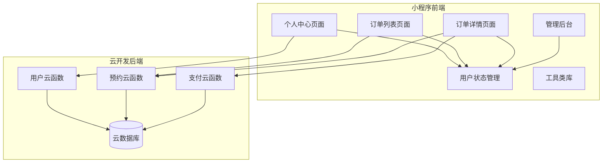
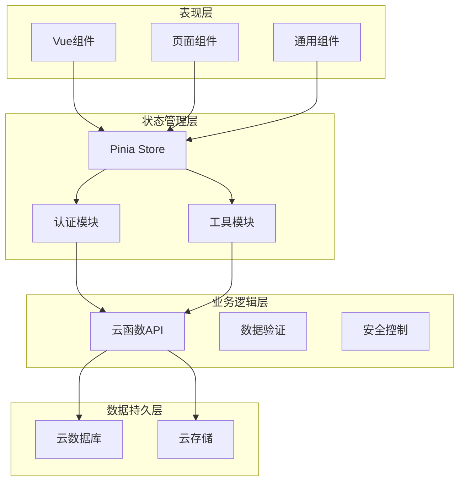
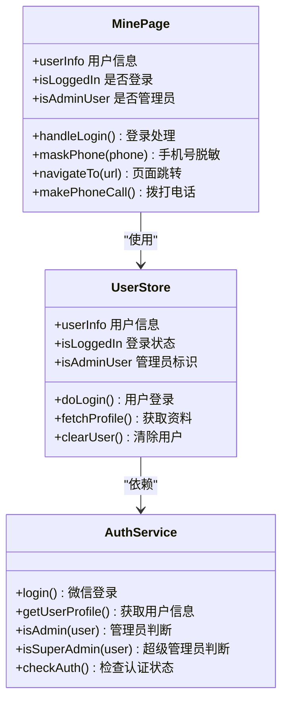
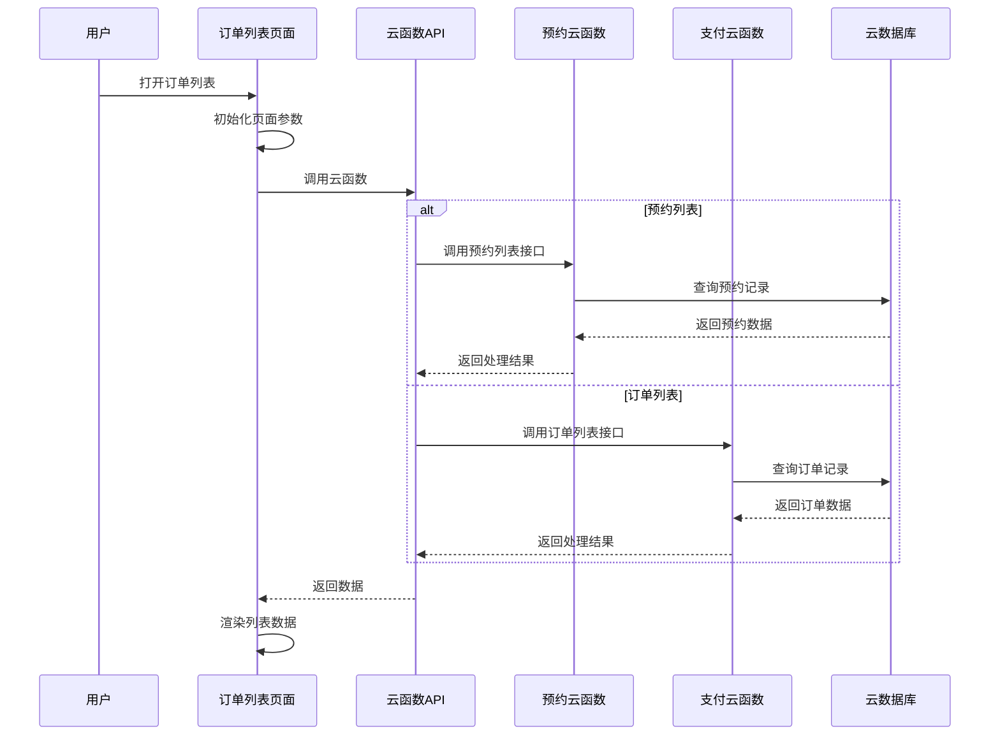
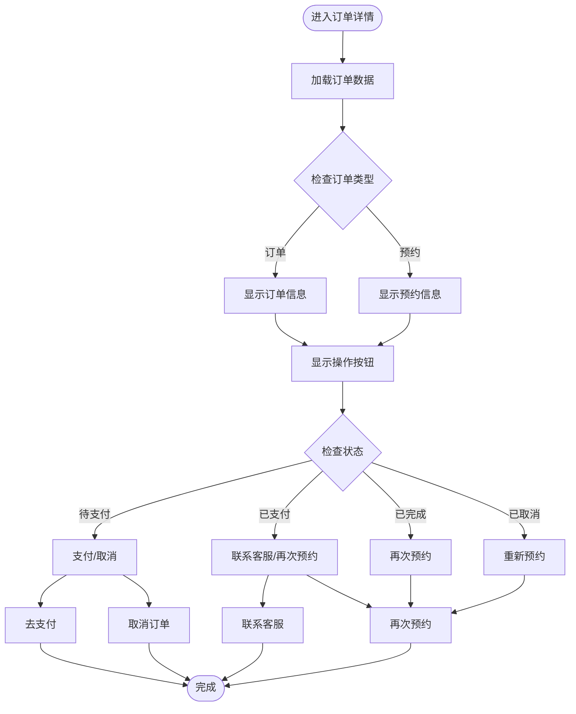
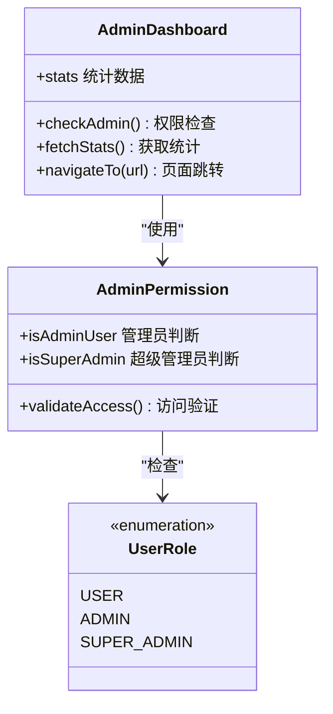
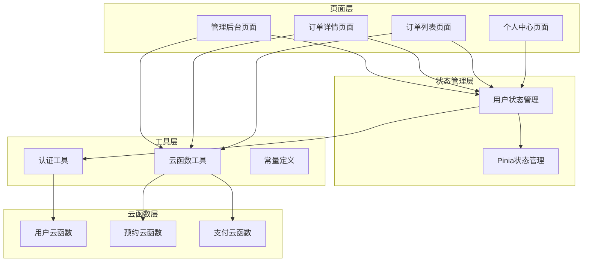
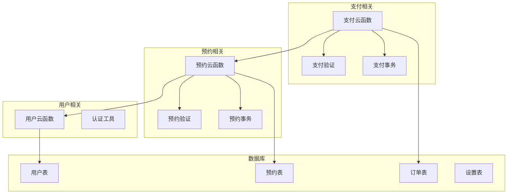

# 个人中心

<cite>
**本文档引用的文件**
- [miniprogram/src/pages/mine/index.vue](file://miniprogram/src/pages/mine/index.vue)
- [miniprogram/src/store/user.js](file://miniprogram/src/store/user.js)
- [miniprogram/src/utils/auth.js](file://miniprogram/src/utils/auth.js)
- [miniprogram/src/pages/order/list.vue](file://miniprogram/src/pages/order/list.vue)
- [miniprogram/src/pages/order/detail.vue](file://miniprogram/src/pages/order/detail.vue)
- [miniprogram/src/utils/constants.js](file://miniprogram/src/utils/constants.js)
- [miniprogram/src/utils/cloud.js](file://miniprogram/src/utils/cloud.js)
- [miniprogram/cloudfunctions/user/index.js](file://miniprogram/cloudfunctions/user/index.js)
- [miniprogram/cloudfunctions/booking/index.js](file://miniprogram/cloudfunctions/booking/index.js)
- [miniprogram/cloudfunctions/payment/index.js](file://miniprogram/cloudfunctions/payment/index.js)
- [miniprogram/src/pages-admin/dashboard/index.vue](file://miniprogram/src/pages-admin/dashboard/index.vue)
- [miniprogram/src/pages-admin/orders/detail.vue](file://miniprogram/src/pages-admin/orders/detail.vue)
- [miniprogram/src/pages-admin/settings/index.vue](file://miniprogram/src/pages-admin/settings/index.vue)
</cite>

## 目录
1. [简介](#简介)
2. [项目结构](#项目结构)
3. [核心组件](#核心组件)
4. [架构概览](#架构概览)
5. [详细组件分析](#详细组件分析)
6. [依赖关系分析](#依赖关系分析)
7. [性能考虑](#性能考虑)
8. [故障排除指南](#故障排除指南)
9. [结论](#结论)
10. [附录](#附录)

## 简介
个人中心是朵兰摄影小程序的核心功能模块，为用户提供统一的账户管理界面。该系统集成了用户信息展示、订单管理、预约历史和个人设置等功能，采用前后端分离架构，通过云开发服务实现数据持久化和业务逻辑处理。

系统主要面向两类用户：
- **普通用户**：查看个人信息、管理预约和订单、收藏客片、联系客服
- **管理员用户**：拥有完整的后台管理权限，包括订单状态管理、套餐管理、客片管理和店铺设置

## 项目结构
个人中心功能分布在小程序前端和云开发后端两个层面：

**图表来源**
- [miniprogram/src/pages/mine/index.vue:1-309](file://miniprogram/src/pages/mine/index.vue#L1-L309)
- [miniprogram/cloudfunctions/user/index.js:1-206](file://miniprogram/cloudfunctions/user/index.js#L1-L206)

**章节来源**
- [miniprogram/src/pages/mine/index.vue:1-309](file://miniprogram/src/pages/mine/index.vue#L1-L309)
- [miniprogram/src/store/user.js:1-48](file://miniprogram/src/store/user.js#L1-L48)

## 核心组件
个人中心系统由以下核心组件构成：

### 用户认证与权限管理
- **用户状态管理**：基于 Pinia 的响应式状态管理
- **权限控制**：支持普通用户、管理员和超级管理员三级权限
- **会话管理**：基于微信登录态的认证机制

### 订单管理系统
- **订单列表**：支持预约记录、正式订单和收藏列表
- **订单详情**：详细的订单状态展示和操作入口
- **状态流转**：完整的订单生命周期管理

### 管理后台系统
- **数据统计**：实时业务指标展示
- **订单管理**：管理员级的订单状态操作
- **设置管理**：店铺信息和营业时间配置

**章节来源**
- [miniprogram/src/store/user.js:1-48](file://miniprogram/src/store/user.js#L1-L48)
- [miniprogram/src/utils/auth.js:1-47](file://miniprogram/src/utils/auth.js#L1-L47)
- [miniprogram/src/utils/constants.js:1-73](file://miniprogram/src/utils/constants.js#L1-L73)

## 架构概览
个人中心采用分层架构设计，确保前后端职责清晰分离：

**图表来源**
- [miniprogram/src/utils/cloud.js:1-66](file://miniprogram/src/utils/cloud.js#L1-L66)
- [miniprogram/src/utils/auth.js:1-47](file://miniprogram/src/utils/auth.js#L1-L47)

## 详细组件分析

### 个人中心页面 (Mine Page)
个人中心页面是用户访问的第一个界面，提供统一的功能入口：

**图表来源**
- [miniprogram/src/pages/mine/index.vue:74-125](file://miniprogram/src/pages/mine/index.vue#L74-L125)
- [miniprogram/src/store/user.js:5-47](file://miniprogram/src/store/user.js#L5-L47)
- [miniprogram/src/utils/auth.js:6-46](file://miniprogram/src/utils/auth.js#L6-L46)

#### 用户信息展示
- **头像显示**：支持自定义头像和默认头像
- **昵称展示**：显示用户昵称或"点击登录"
- **手机号脱敏**：11位手机号中间4位显示为星号
- **登录状态**：根据认证状态动态显示

#### 功能入口设计
- **预约管理**：查看和管理预约记录
- **订单管理**：查看和管理购买订单
- **收藏管理**：查看和管理收藏的客片
- **客服联系**：一键联系客服
- **电话联系**：直接拨打电话

**章节来源**
- [miniprogram/src/pages/mine/index.vue:1-309](file://miniprogram/src/pages/mine/index.vue#L1-L309)

### 订单管理系统

#### 订单列表页面
订单列表页面支持三种类型的列表展示：

**图表来源**
- [miniprogram/src/pages/order/list.vue:213-253](file://miniprogram/src/pages/order/list.vue#L213-L253)
- [miniprogram/cloudfunctions/booking/index.js:211-259](file://miniprogram/cloudfunctions/booking/index.js#L211-L259)
- [miniprogram/cloudfunctions/payment/index.js:497-531](file://miniprogram/cloudfunctions/payment/index.js#L497-L531)

#### 订单状态展示
系统支持多种订单状态的可视化展示：

| 状态类型 | 状态值 | 颜色 | 图标 | 描述 |
|---------|--------|------|------|------|
| 预约状态 | pending | #ff976a | ⏳ | 待确认 |
| 预约状态 | confirmed | #07c160 | ✅ | 已确认 |
| 预约状态 | completed | #999999 | ✨ | 已完成 |
| 预约状态 | cancelled | #ee0a24 | ❌ | 已取消 |
| 支付状态 | unpaid | #ff976a | 📋 | 待支付 |
| 支付状态 | paid | #07c160 | 💰 | 已支付 |
| 支付状态 | refunded | #999999 | 💸 | 已退款 |

#### 订单详情页面
订单详情页面提供完整的订单信息展示和操作能力：

**图表来源**
- [miniprogram/src/pages/order/detail.vue:108-141](file://miniprogram/src/pages/order/detail.vue#L108-L141)

**章节来源**
- [miniprogram/src/pages/order/list.vue:1-554](file://miniprogram/src/pages/order/list.vue#L1-L554)
- [miniprogram/src/pages/order/detail.vue:1-451](file://miniprogram/src/pages/order/detail.vue#L1-L451)

### 管理后台系统

#### 管理员权限控制
管理员系统采用分级权限模型：

**图表来源**
- [miniprogram/src/pages-admin/dashboard/index.vue:90-103](file://miniprogram/src/pages-admin/dashboard/index.vue#L90-L103)
- [miniprogram/src/utils/auth.js:28-36](file://miniprogram/src/utils/auth.js#L28-L36)

#### 数据统计面板
管理后台提供实时业务数据展示：

| 统计指标 | 描述 | 更新频率 |
|---------|------|----------|
| 今日预约 | 当天新增预约数量 | 实时 |
| 待处理订单 | 待确认的订单数量 | 实时 |
| 本月收入 | 当月累计收入 | 实时 |
| 累计客片 | 历史客片总数 | 实时 |
| 累计预约 | 历史预约总数 | 实时 |
| 总用户数 | 注册用户总数 | 实时 |

**章节来源**
- [miniprogram/src/pages-admin/dashboard/index.vue:1-295](file://miniprogram/src/pages-admin/dashboard/index.vue#L1-L295)

## 依赖关系分析

### 前端依赖关系
个人中心系统的前端依赖关系如下：

**图表来源**
- [miniprogram/src/store/user.js:1-48](file://miniprogram/src/store/user.js#L1-L48)
- [miniprogram/src/utils/cloud.js:5-26](file://miniprogram/src/utils/cloud.js#L5-L26)

### 后端依赖关系
云函数之间的依赖关系确保业务逻辑的正确执行：

**图表来源**
- [miniprogram/cloudfunctions/user/index.js:1-206](file://miniprogram/cloudfunctions/user/index.js#L1-L206)
- [miniprogram/cloudfunctions/booking/index.js:98-206](file://miniprogram/cloudfunctions/booking/index.js#L98-L206)
- [miniprogram/cloudfunctions/payment/index.js:65-166](file://miniprogram/cloudfunctions/payment/index.js#L65-L166)

**章节来源**
- [miniprogram/src/utils/cloud.js:1-66](file://miniprogram/src/utils/cloud.js#L1-L66)
- [miniprogram/src/utils/auth.js:1-47](file://miniprogram/src/utils/auth.js#L1-L47)

## 性能考虑
个人中心系统在设计时充分考虑了性能优化：

### 数据加载优化
- **分页加载**：订单列表采用分页加载，每页10条记录
- **懒加载**：滚动到底部时才加载下一页数据
- **缓存策略**：用户信息和权限状态进行本地缓存

### 网络请求优化
- **请求合并**：多个小请求合并为批量请求
- **超时控制**：设置合理的请求超时时间
- **重试机制**：网络异常时自动重试

### UI渲染优化
- **虚拟滚动**：大量数据时使用虚拟滚动技术
- **懒渲染**：非关键区域延迟渲染
- **防抖节流**：频繁操作使用防抖节流

## 故障排除指南

### 常见问题及解决方案

#### 登录认证问题
**问题现象**：用户无法登录或登录状态异常
**可能原因**：
- 微信登录态过期
- 云函数调用失败
- 网络连接异常

**解决步骤**：
1. 检查微信登录态是否有效
2. 验证云函数调用结果
3. 确认网络连接状态
4. 重新初始化用户状态

#### 订单数据异常
**问题现象**：订单列表显示异常或数据不完整
**可能原因**：
- 数据库查询条件错误
- 权限验证失败
- 网络请求超时

**解决步骤**：
1. 检查查询条件和过滤参数
2. 验证用户权限级别
3. 确认数据完整性
4. 重新加载页面数据

#### 支付流程问题
**问题现象**：支付状态异常或支付回调失败
**可能原因**：
- 支付参数配置错误
- 微信支付回调处理异常
- 事务执行失败

**解决步骤**：
1. 验证支付参数完整性
2. 检查支付回调逻辑
3. 确认事务执行状态
4. 手动触发状态更新

**章节来源**
- [miniprogram/src/pages/order/list.vue:246-252](file://miniprogram/src/pages/order/list.vue#L246-L252)
- [miniprogram/src/pages/order/detail.vue:200-206](file://miniprogram/src/pages/order/detail.vue#L200-L206)

## 结论
个人中心功能模块是一个功能完整、架构清晰的小程序核心模块。系统通过合理的分层设计实现了前后端的有效分离，通过云开发服务提供了可靠的数据持久化能力。

### 主要优势
- **用户体验友好**：简洁直观的界面设计，符合小程序使用习惯
- **功能完整**：涵盖用户管理、订单处理、预约管理等核心业务
- **权限控制严格**：完善的用户权限管理体系
- **扩展性强**：模块化设计便于功能扩展和维护

### 技术亮点
- **响应式状态管理**：基于 Pinia 的现代化状态管理
- **云函数集成**：充分利用云开发的Serverless特性
- **权限分级**：支持多级权限控制和管理后台
- **数据安全**：严格的权限验证和数据隔离

### 改进建议
- **性能监控**：增加详细的性能监控和日志记录
- **错误处理**：完善错误处理和用户反馈机制
- **国际化支持**：考虑多语言支持需求
- **离线缓存**：增强离线数据缓存能力

## 附录

### API 接口规范

#### 用户相关接口
| 接口名称 | 方法 | 参数 | 返回值 | 权限要求 |
|---------|------|------|--------|----------|
| 用户登录 | login | 无 | 用户信息 | 匿名用户 |
| 获取用户信息 | getProfile | 无 | 用户详情 | 已登录用户 |
| 更新手机号 | updatePhone | phone | 用户信息 | 已登录用户 |
| 更新用户资料 | updateProfile | nickname, avatar | 用户信息 | 已登录用户 |

#### 预约相关接口
| 接口名称 | 方法 | 参数 | 返回值 | 权限要求 |
|---------|------|------|--------|----------|
| 创建预约 | create | packageId, date, timeSlot, contactName, contactPhone, persons, remark | 预约和订单信息 | 已登录用户 |
| 预约列表 | list | isAdmin, status, date, page, pageSize | 预约列表 | 已登录用户 |
| 预约详情 | detail | id | 预约详情 | 已登录用户 |
| 取消预约 | cancel | id | 取消结果 | 预约所有者或管理员 |
| 更新状态 | updateStatus | id, status | 状态更新结果 | 管理员 |

#### 支付相关接口
| 接口名称 | 方法 | 参数 | 返回值 | 权限要求 |
|---------|------|------|--------|----------|
| 创建支付订单 | createOrder | orderId | 支付参数 | 订单所有者 |
| 支付成功 | paySuccess | orderId | 订单状态 | 订单所有者 |
| 支付回调 | callback | data | 回调结果 | 微信服务器 |
| 退款处理 | refund | orderId | 退款结果 | 管理员 |
| 订单详情 | getOrder | orderId, orderNo | 订单详情 | 已登录用户 |
| 我的订单 | myOrders | payStatus, page, pageSize | 订单列表 | 已登录用户 |

### 数据模型

#### 用户表 (users)
| 字段名 | 类型 | 描述 | 约束 |
|-------|------|------|------|
| _id | ObjectId | 主键 | 自增 |
| openid | String | 微信唯一标识 | 唯一索引 |
| nickname | String | 昵称 | 可空 |
| avatar | String | 头像URL | 可空 |
| phone | String | 手机号 | 可空 |
| role | String | 用户角色 | 默认: user |
| createTime | Date | 创建时间 | 索引 |

#### 预约表 (bookings)
| 字段名 | 类型 | 描述 | 约束 |
|-------|------|------|------|
| _id | ObjectId | 主键 | 自增 |
| userId | String | 用户OpenID | 索引 |
| packageId | String | 套餐ID | 索引 |
| packageName | String | 套餐名称 | 无 |
| packagePrice | Number | 套餐价格 | 无 |
| date | String | 预约日期 | 无 |
| timeSlot | String | 预约时段 | 无 |
| contactName | String | 联系人姓名 | 无 |
| contactPhone | String | 联系人电话 | 无 |
| persons | Number | 预约人数 | 无 |
| status | String | 预约状态 | 默认: pending |
| remark | String | 备注 | 可空 |
| createTime | Date | 创建时间 | 索引 |
| updateTime | Date | 更新时间 | 索引 |

#### 订单表 (orders)
| 字段名 | 类型 | 描述 | 约束 |
|-------|------|------|------|
| _id | ObjectId | 主键 | 自增 |
| bookingId | String | 关联预约ID | 索引 |
| userId | String | 用户OpenID | 索引 |
| packageId | String | 套餐ID | 索引 |
| packageName | String | 套餐名称 | 无 |
| totalPrice | Number | 订单总价 | 无 |
| depositAmount | Number | 定金金额 | 无 |
| payStatus | String | 支付状态 | 默认: unpaid |
| orderNo | String | 订单编号 | 唯一索引 |
| payTime | Date | 支付时间 | 可空 |
| refundTime | Date | 退款时间 | 可空 |
| createTime | Date | 创建时间 | 索引 |
| updateTime | Date | 更新时间 | 索引 |

### 安全最佳实践
- **权限验证**：所有敏感操作都必须进行权限验证
- **数据校验**：客户端和服务端双重数据校验
- **SQL注入防护**：使用参数化查询和命令对象
- **XSS防护**：对用户输入进行HTML转义
- **CSRF防护**：使用Token验证防止跨站请求伪造
- **日志审计**：记录所有重要操作的日志