# 套餐管理系统

<cite>
**本文档引用的文件**
- [list.vue](file://miniprogram/src/pages/packages/list.vue)
- [detail.vue](file://miniprogram/src/pages/packages/detail.vue)
- [PackageCard.vue](file://miniprogram/src/components/PackageCard.vue)
- [packages-manage/index.vue](file://miniprogram/src/pages-admin/packages-manage/index.vue)
- [packages-manage/edit.vue](file://miniprogram/src/pages-admin/packages-manage/edit.vue)
- [constants.js](file://miniprogram/src/utils/constants.js)
- [cloud.js](file://miniprogram/src/utils/cloud.js)
- [index.js](file://miniprogram/cloudfunctions/package/index.js)
- [user.js](file://miniprogram/src/store/user.js)
- [pages.json](file://miniprogram/src/pages.json)
- [auth.js](file://miniprogram/src/utils/auth.js)
- [App.vue](file://miniprogram/src/App.vue)
</cite>

## 目录
1. [简介](#简介)
2. [项目结构](#项目结构)
3. [核心组件](#核心组件)
4. [架构概览](#架构概览)
5. [详细组件分析](#详细组件分析)
6. [依赖关系分析](#依赖关系分析)
7. [性能考虑](#性能考虑)
8. [故障排除指南](#故障排除指南)
9. [结论](#结论)

## 简介

套餐管理系统是一个基于微信小程序平台的完整解决方案，专注于摄影服务行业的套餐展示与管理。该系统提供了用户端的套餐浏览、分类筛选、详情查看功能，以及管理后台的套餐增删改查、状态管理等完整功能。

系统采用前后端分离架构，前端使用Vue 3 + UniApp框架，后端基于微信云开发的云函数和云数据库。通过精心设计的组件化架构和完善的权限管理体系，为用户提供流畅的套餐浏览体验，同时为管理员提供高效的内容管理工具。

## 项目结构

项目采用模块化的目录结构，清晰地分离了用户界面、管理后台、工具函数和云函数等不同层次的功能模块。

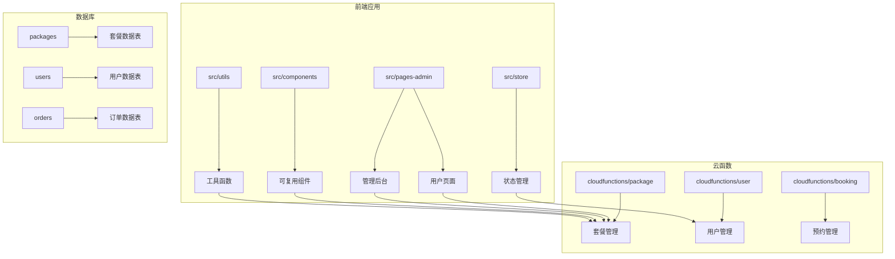

**图表来源**
- [pages.json:1-177](file://miniprogram/src/pages.json#L1-L177)
- [App.vue:1-26](file://miniprogram/src/App.vue#L1-L26)

**章节来源**
- [pages.json:1-177](file://miniprogram/src/pages.json#L1-L177)
- [App.vue:1-26](file://miniprogram/src/App.vue#L1-L26)

## 核心组件

系统的核心组件包括套餐列表展示、套餐详情查看、套餐卡片组件等，这些组件共同构成了完整的套餐浏览体验。

### 套餐数据模型

系统采用统一的数据模型来表示套餐信息，确保前后端数据的一致性和完整性。

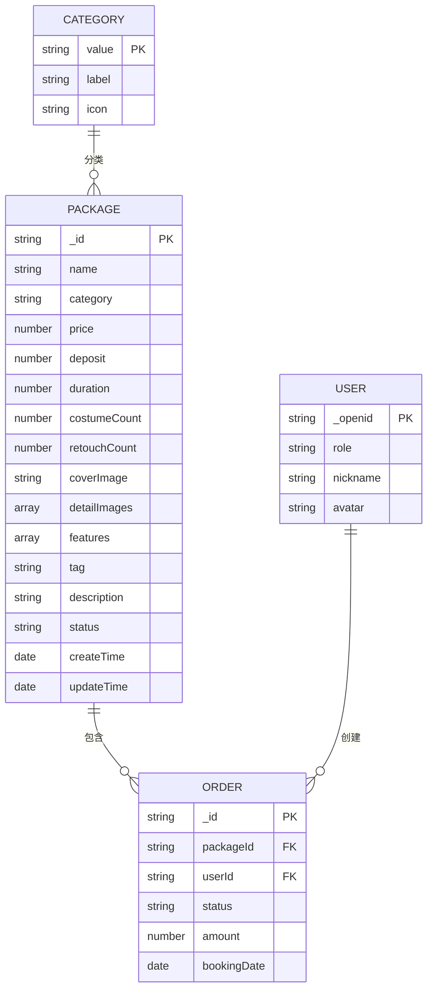

**图表来源**
- [index.js:119-133](file://miniprogram/cloudfunctions/package/index.js#L119-L133)
- [constants.js:6-11](file://miniprogram/src/utils/constants.js#L6-L11)

### 分类体系

系统实现了四层分类体系，每种分类都有独特的视觉标识和功能定位：

| 分类 | 值 | 图标 | 描述 |
|------|----|------|------|
| 基础套餐 | basic | 🏛️ | 景区指定拍摄点，出片率100% |
| 进阶套餐 | advanced | 🌾 | 蒙古袍/民族风/公主服，一站式换装 |
| 家庭套餐 | family | 👨‍👩‍👧‍👦 | 全家福，记录美好时光 |
| VIP定制 | vip | 👑 | VIP专属定制，尊享私人摄影 |

**章节来源**
- [constants.js:6-11](file://miniprogram/src/utils/constants.js#L6-L11)
- [list.vue:64-75](file://miniprogram/src/pages/packages/list.vue#L64-L75)

## 架构概览

系统采用三层架构设计，从前端界面到云函数再到数据库，形成了清晰的分层结构。

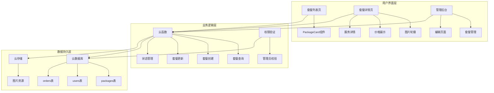

**图表来源**
- [index.js:26-58](file://miniprogram/cloudfunctions/package/index.js#L26-L58)
- [cloud.js:6-26](file://miniprogram/src/utils/cloud.js#L6-L26)

**章节来源**
- [index.js:26-58](file://miniprogram/cloudfunctions/package/index.js#L26-L58)
- [cloud.js:6-26](file://miniprogram/src/utils/cloud.js#L6-L26)

## 详细组件分析

### 套餐列表组件分析

套餐列表页面是用户浏览套餐的主要入口，实现了完整的分类筛选和懒加载功能。

#### 组件架构设计

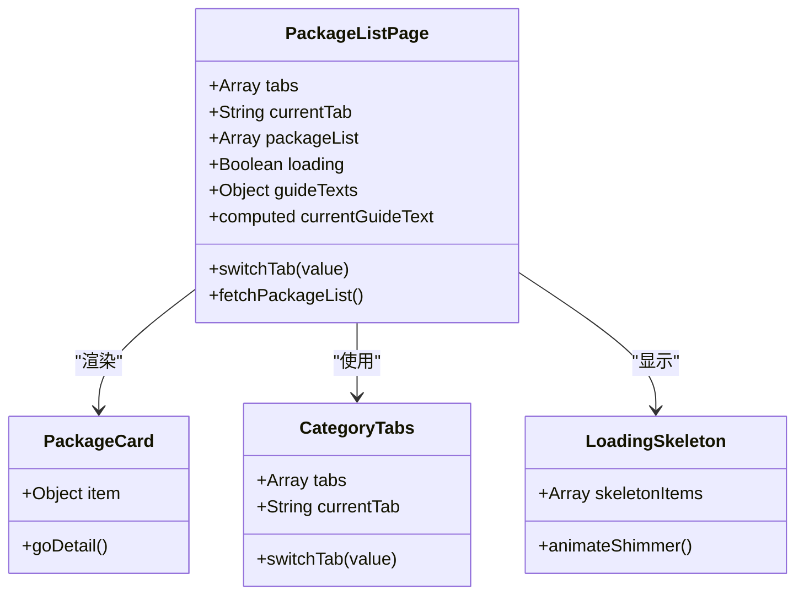

**图表来源**
- [list.vue:57-131](file://miniprogram/src/pages/packages/list.vue#L57-L131)
- [PackageCard.vue:21-31](file://miniprogram/src/components/PackageCard.vue#L21-L31)

#### 分类筛选机制

系统实现了智能的分类筛选功能，支持动态切换和状态保持：

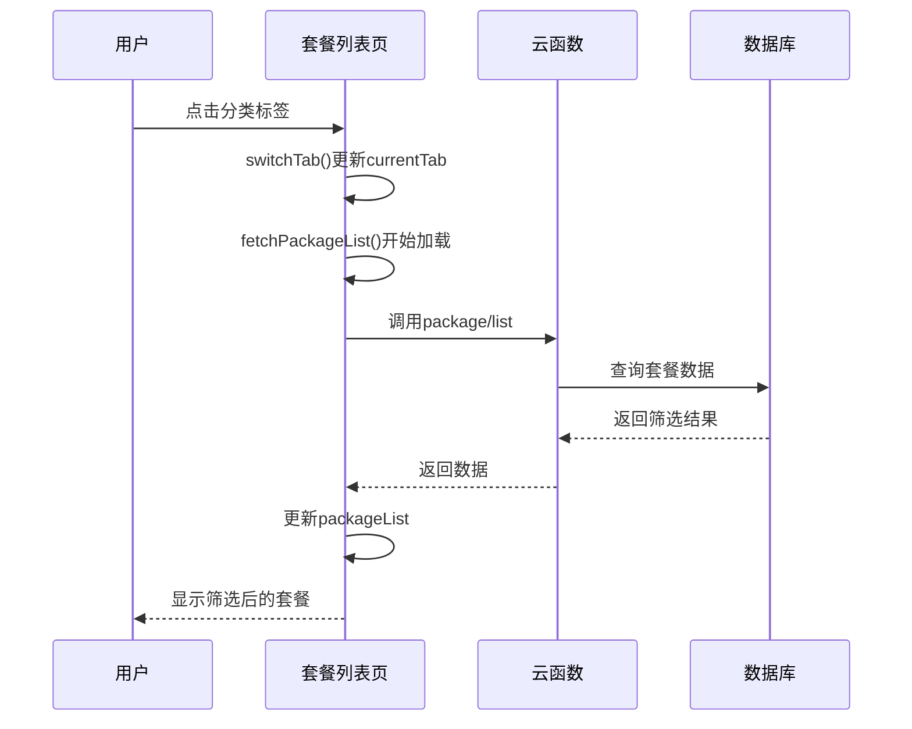

**图表来源**
- [list.vue:87-125](file://miniprogram/src/pages/packages/list.vue#L87-L125)
- [index.js:61-86](file://miniprogram/cloudfunctions/package/index.js#L61-L86)

#### 懒加载与用户体验优化

系统采用了多层次的懒加载策略来提升用户体验：

1. **骨架屏加载**：在数据加载期间显示骨架屏，提供视觉反馈
2. **图片懒加载**：使用`lazy-load`属性延迟图片加载
3. **无限滚动**：支持长列表的虚拟滚动效果

**章节来源**
- [list.vue:25-53](file://miniprogram/src/pages/packages/list.vue#L25-L53)
- [PackageCard.vue](file://miniprogram/src/components/PackageCard.vue#L3)

### 套餐详情组件分析

套餐详情页面提供了完整的套餐信息展示和交互功能。

#### 详情页面架构

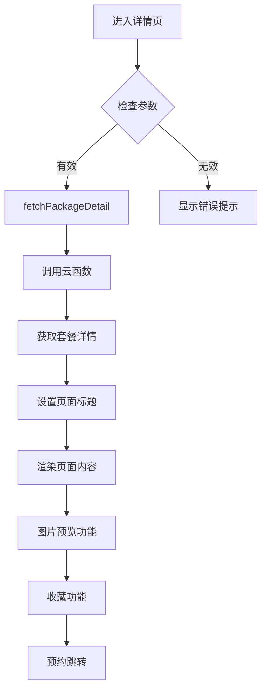

**图表来源**
- [detail.vue:202-250](file://miniprogram/src/pages/packages/detail.vue#L202-L250)

#### 价格展示与库存管理

系统实现了灵活的价格展示机制，支持多种价格模式：

| 展示元素 | 数据来源 | 格式化规则 |
|----------|----------|------------|
| 套餐价格 | package.price | ¥数字起 |
| 定金金额 | package.deposit | 仅需支付¥数字 |
| 服务详情 | 多个字段组合 | 数字+单位 |

**章节来源**
- [detail.vue:36-47](file://miniprogram/src/pages/packages/detail.vue#L36-L47)
- [detail.vue:66-83](file://miniprogram/src/pages/packages/detail.vue#L66-L83)

### 套餐卡片组件分析

PackageCard组件是系统中最基础的展示组件，承担着套餐信息的可视化展示任务。

#### 组件设计特点

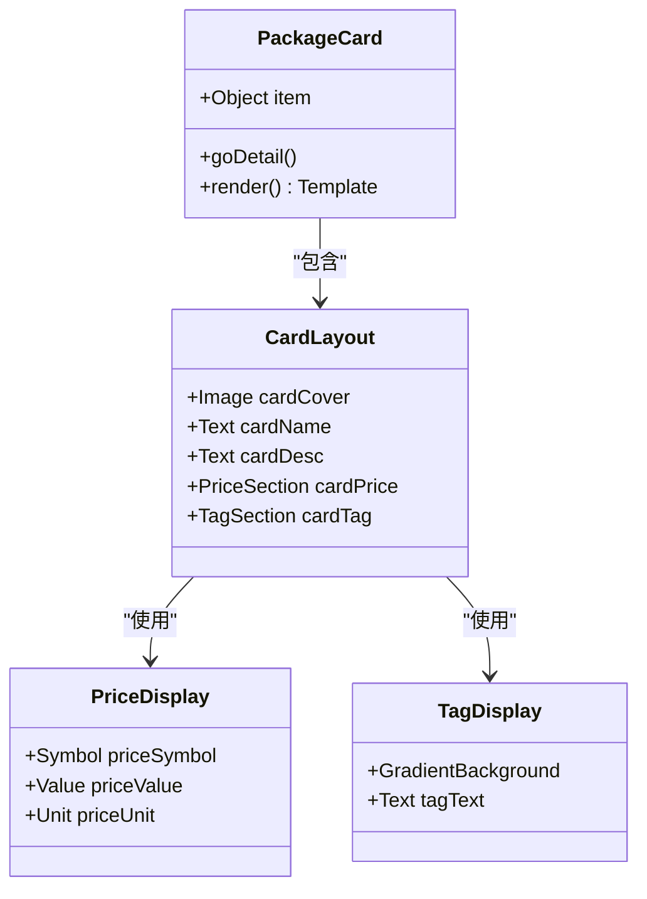

**图表来源**
- [PackageCard.vue:1-31](file://miniprogram/src/components/PackageCard.vue#L1-L31)

#### 性能优化策略

组件层面的性能优化措施：

1. **事件委托**：只在卡片根元素绑定点击事件
2. **懒加载图片**：使用`lazy-load`属性优化图片加载
3. **最小化DOM操作**：通过模板语法减少手动DOM操作

**章节来源**
- [PackageCard.vue:21-31](file://miniprogram/src/components/PackageCard.vue#L21-L31)

### 管理后台组件分析

管理后台提供了完整的套餐管理功能，包括增删改查、状态管理和批量操作。

#### 后台管理架构

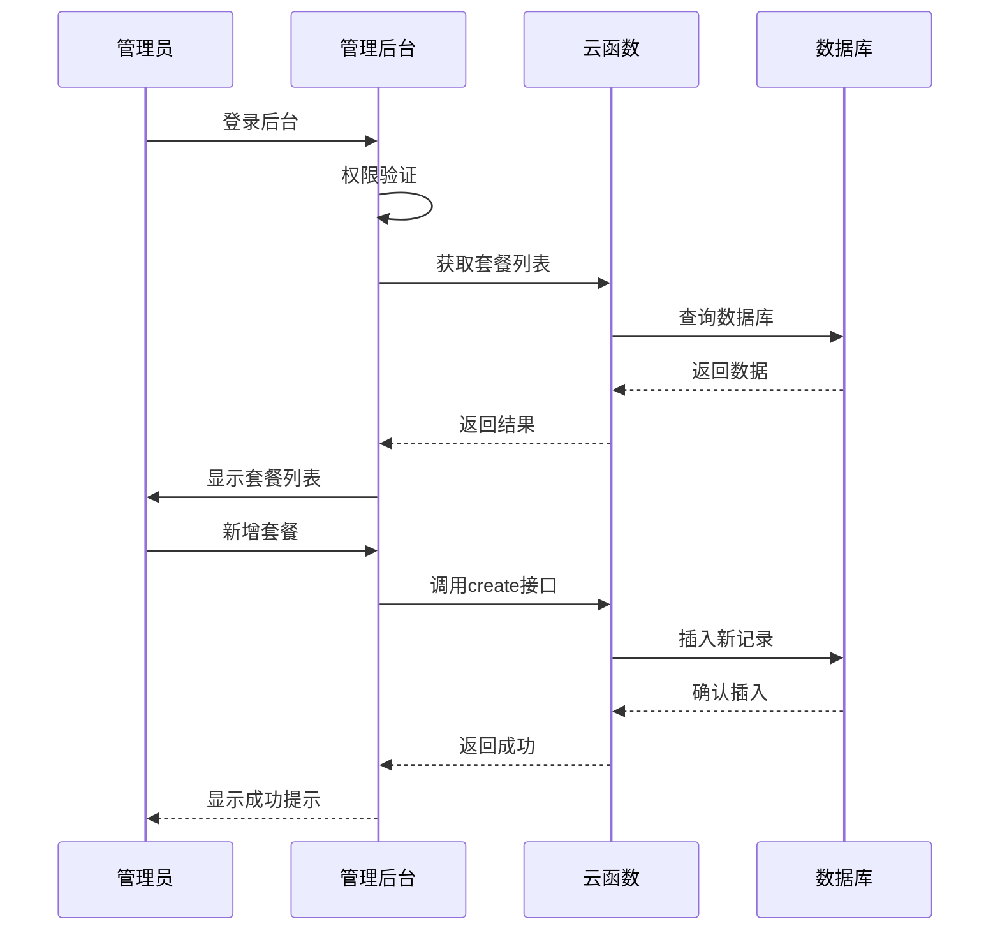

**图表来源**
- [packages-manage/index.vue:120-166](file://miniprogram/src/pages-admin/packages-manage/index.vue#L120-L166)
- [index.js:109-134](file://miniprogram/cloudfunctions/package/index.js#L109-L134)

#### 数据验证与异常处理

管理后台实现了严格的数据验证机制：

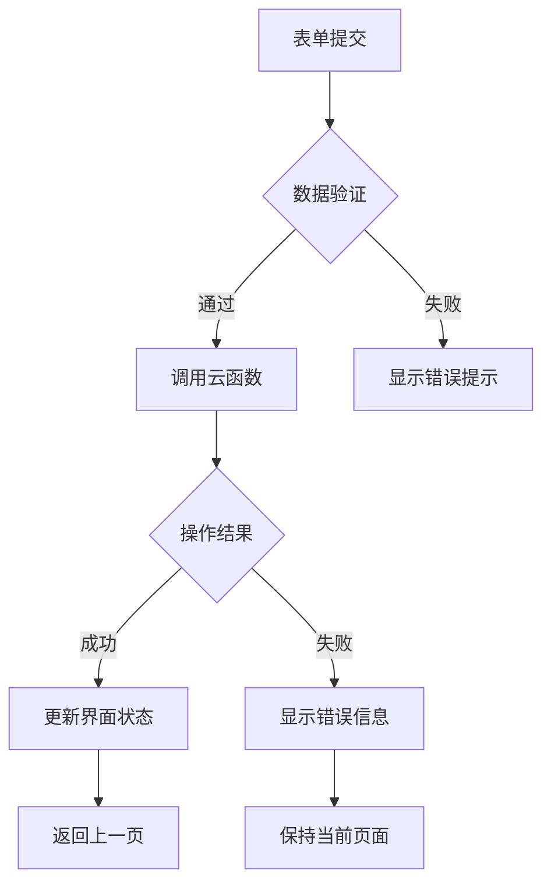

**图表来源**
- [packages-manage/edit.vue:370-393](file://miniprogram/src/pages-admin/packages-manage/edit.vue#L370-L393)

**章节来源**
- [packages-manage/edit.vue:370-455](file://miniprogram/src/pages-admin/packages-manage/edit.vue#L370-L455)

## 依赖关系分析

系统各模块之间的依赖关系清晰明确，遵循单一职责原则和依赖倒置原则。

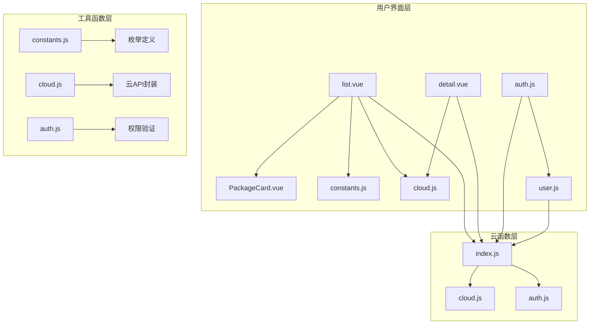

**图表来源**
- [list.vue:59-61](file://miniprogram/src/pages/packages/list.vue#L59-L61)
- [detail.vue:143-144](file://miniprogram/src/pages/packages/detail.vue#L143-L144)
- [index.js:1-30](file://miniprogram/cloudfunctions/package/index.js#L1-L30)

**章节来源**
- [list.vue:59-61](file://miniprogram/src/pages/packages/list.vue#L59-L61)
- [detail.vue:143-144](file://miniprogram/src/pages/packages/detail.vue#L143-L144)
- [index.js:1-30](file://miniprogram/cloudfunctions/package/index.js#L1-L30)

## 性能考虑

系统在多个层面实现了性能优化，确保良好的用户体验。

### 数据加载优化

1. **条件查询优化**：根据是否管理员身份调整查询条件
2. **排序优化**：按排序字段进行升序排列
3. **分页加载**：支持大数据集的分页处理

### 缓存策略

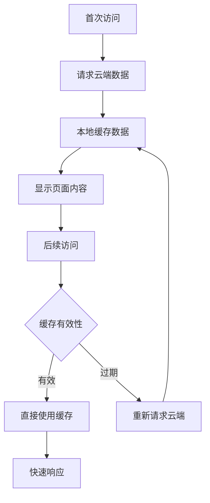

### 图片优化

1. **懒加载**：减少初始页面加载时间
2. **压缩处理**：上传时自动压缩图片
3. **CDN加速**：利用云存储的CDN服务

## 故障排除指南

### 常见问题及解决方案

#### 套餐列表无法加载

**问题现象**：套餐列表显示空白或加载失败

**可能原因**：
1. 网络连接异常
2. 云函数调用失败
3. 数据库查询超时

**解决步骤**：
1. 检查网络连接状态
2. 查看控制台错误日志
3. 验证云函数部署状态
4. 检查数据库权限配置

#### 套餐详情显示异常

**问题现象**：详情页面部分内容不显示或格式错乱

**可能原因**：
1. 数据字段缺失
2. 图片资源加载失败
3. 样式冲突

**解决步骤**：
1. 验证数据完整性
2. 检查图片URL有效性
3. 清理浏览器缓存
4. 检查样式文件

#### 管理后台权限问题

**问题现象**：管理员无法访问后台功能

**可能原因**：
1. 用户角色验证失败
2. 会话状态异常
3. 权限配置错误

**解决步骤**：
1. 检查用户角色设置
2. 重新登录系统
3. 验证权限配置
4. 清理会话数据

**章节来源**
- [index.js:54-57](file://miniprogram/cloudfunctions/package/index.js#L54-L57)
- [auth.js:28-36](file://miniprogram/src/utils/auth.js#L28-L36)

## 结论

套餐管理系统通过精心设计的架构和完善的组件体系，为摄影服务行业提供了一个功能完整、性能优良的解决方案。系统的主要优势包括：

1. **模块化设计**：清晰的组件划分和职责分离
2. **用户体验优化**：智能的懒加载和骨架屏技术
3. **权限安全保障**：严格的管理员权限验证机制
4. **扩展性强**：灵活的数据模型和分类体系
5. **维护友好**：标准化的代码结构和错误处理

该系统不仅满足了当前的功能需求，还为未来的功能扩展和技术升级奠定了坚实的基础。通过持续的优化和完善，这套系统能够更好地服务于摄影服务行业的发展需要。