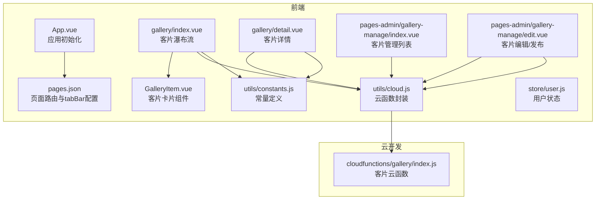
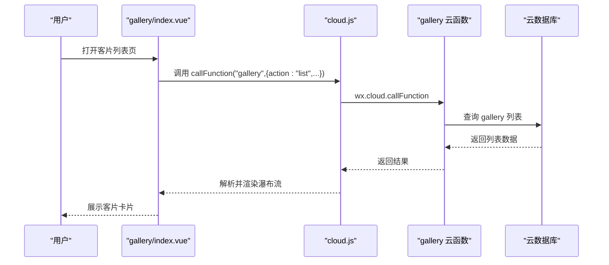
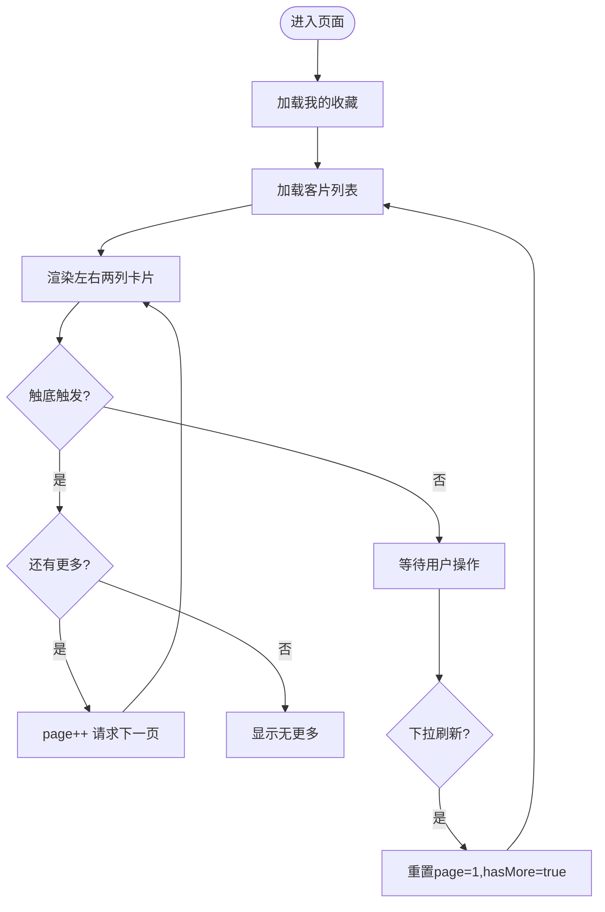
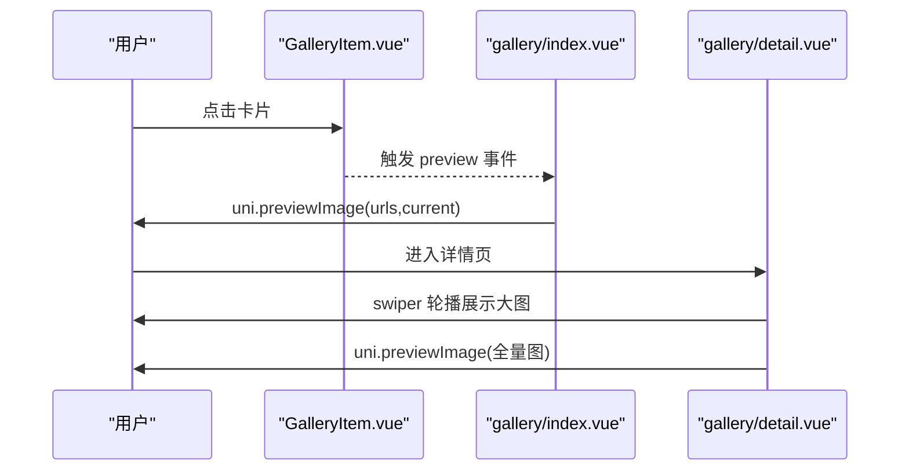
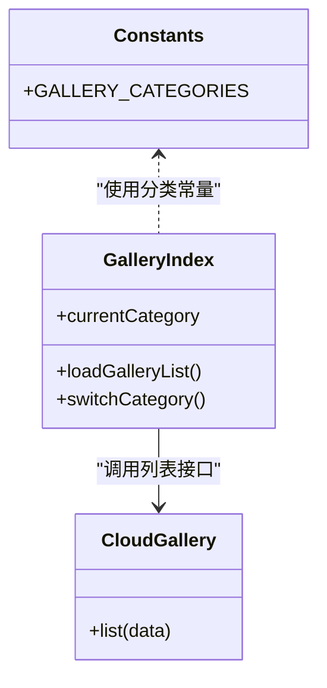
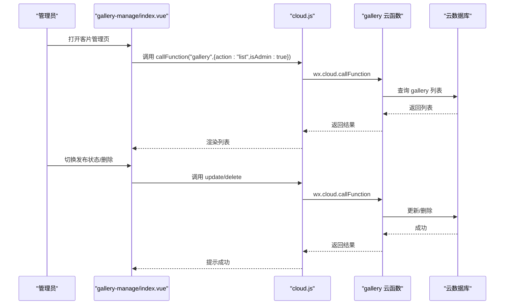
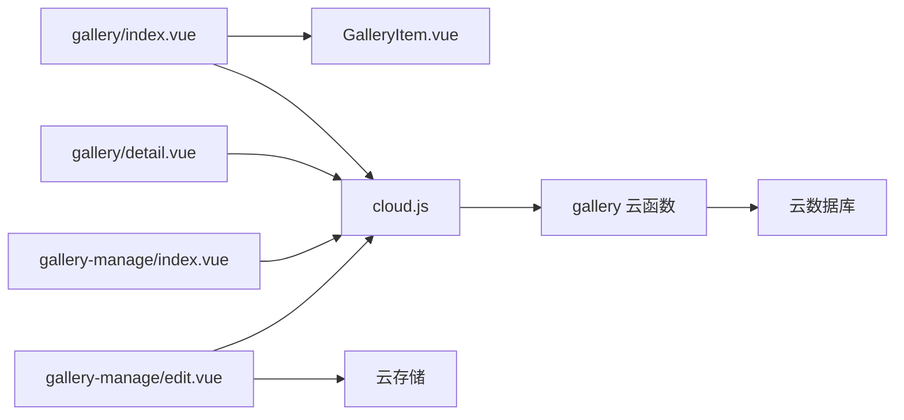

# 客片展示系统

<cite>
**本文档引用的文件**
- [App.vue](file://miniprogram/src/App.vue)
- [pages.json](file://miniprogram/src/pages.json)
- [constants.js](file://miniprogram/src/utils/constants.js)
- [cloud.js](file://miniprogram/src/utils/cloud.js)
- [user.js](file://miniprogram/src/store/user.js)
- [GalleryItem.vue](file://miniprogram/src/components/GalleryItem.vue)
- [gallery/index.vue](file://miniprogram/src/pages/gallery/index.vue)
- [gallery/detail.vue](file://miniprogram/src/pages/gallery/detail.vue)
- [gallery-manage/index.vue](file://miniprogram/src/pages-admin/gallery-manage/index.vue)
- [gallery-manage/edit.vue](file://miniprogram/src/pages-admin/gallery-manage/edit.vue)
- [gallery/index.js](file://miniprogram/cloudfunctions/gallery/index.js)
- [package.json](file://miniprogram/cloudfunctions/gallery/package.json)
</cite>

## 目录
1. [简介](#简介)
2. [项目结构](#项目结构)
3. [核心组件](#核心组件)
4. [架构总览](#架构总览)
5. [详细组件分析](#详细组件分析)
6. [依赖关系分析](#依赖关系分析)
7. [性能考虑](#性能考虑)
8. [故障排查指南](#故障排查指南)
9. [结论](#结论)
10. [附录](#附录)

## 简介
本系统是一个基于微信小程序与云开发的客片展示平台，提供客片瀑布流浏览、分类筛选、收藏管理、详情查看、图片预览与复制文案等功能。后端通过云函数统一处理数据访问与业务逻辑，前端采用 Vue 3 + UniApp 技术栈构建，支持管理员后台进行客片发布与管理。

## 项目结构
系统采用分层与模块化组织：
- 前端页面：gallery 展示页、gallery 详情页、管理员后台 gallery-manage 管理页
- 组件：GalleryItem 可复用的客片卡片组件
- 工具：cloud.js 统一封装云函数调用、常量定义 constants.js、用户状态 store/user.js
- 后端：云函数 gallery，负责客片列表、详情、收藏、管理等操作

**图表来源**
- [App.vue:1-26](file://miniprogram/src/App.vue#L1-L26)
- [pages.json:1-177](file://miniprogram/src/pages.json#L1-L177)
- [gallery/index.vue:1-533](file://miniprogram/src/pages/gallery/index.vue#L1-L533)
- [gallery/detail.vue:1-450](file://miniprogram/src/pages/gallery/detail.vue#L1-L450)
- [GalleryItem.vue:1-60](file://miniprogram/src/components/GalleryItem.vue#L1-L60)
- [cloud.js:1-66](file://miniprogram/src/utils/cloud.js#L1-L66)
- [constants.js:1-73](file://miniprogram/src/utils/constants.js#L1-L73)
- [user.js:1-48](file://miniprogram/src/store/user.js#L1-L48)
- [gallery-manage/index.vue:1-524](file://miniprogram/src/pages-admin/gallery-manage/index.vue#L1-L524)
- [gallery-manage/edit.vue:1-808](file://miniprogram/src/pages-admin/gallery-manage/edit.vue#L1-L808)
- [gallery/index.js:1-360](file://miniprogram/cloudfunctions/gallery/index.js#L1-L360)

**章节来源**
- [App.vue:1-26](file://miniprogram/src/App.vue#L1-L26)
- [pages.json:1-177](file://miniprogram/src/pages.json#L1-L177)

## 核心组件
- 客片瀑布流页面：支持分类筛选、触底加载、收藏状态标记、图片预览与复制文案
- 客片详情页面：大图轮播、文案复制、收藏切换、拍摄信息展示
- 客片卡片组件：懒加载封面图、标签展示、点击预览事件
- 云函数 gallery：提供列表、详情、收藏、管理等接口
- 管理后台：客片列表、发布状态切换、新增/编辑、删除

**章节来源**
- [gallery/index.vue:1-533](file://miniprogram/src/pages/gallery/index.vue#L1-L533)
- [gallery/detail.vue:1-450](file://miniprogram/src/pages/gallery/detail.vue#L1-L450)
- [GalleryItem.vue:1-60](file://miniprogram/src/components/GalleryItem.vue#L1-L60)
- [gallery/index.js:1-360](file://miniprogram/cloudfunctions/gallery/index.js#L1-L360)
- [gallery-manage/index.vue:1-524](file://miniprogram/src/pages-admin/gallery-manage/index.vue#L1-L524)
- [gallery-manage/edit.vue:1-808](file://miniprogram/src/pages-admin/gallery-manage/edit.vue#L1-L808)

## 架构总览
前端通过云函数封装调用云函数，云函数访问云数据库，实现数据与业务逻辑分离。管理员后台通过权限校验后进行客片的增删改查与发布状态控制。

**图表来源**
- [gallery/index.vue:144-189](file://miniprogram/src/pages/gallery/index.vue#L144-L189)
- [cloud.js:5-26](file://miniprogram/src/utils/cloud.js#L5-L26)
- [gallery/index.js:66-103](file://miniprogram/cloudfunctions/gallery/index.js#L66-L103)

## 详细组件分析

### 客片瀑布流布局与无限滚动
- 布局策略：使用两个列容器，通过计算属性将列表按奇偶索引分配到左右两列，形成简易瀑布流效果
- 无限滚动：监听页面触底事件，当未处于加载且仍有更多时，自动请求下一页
- 下拉刷新：监听下拉刷新事件，重置页码并重新加载
- 加载状态与空态：根据 loading、hasMore、isFirstLoad 控制加载动画、无更多提示与空状态展示

**图表来源**
- [gallery/index.vue:116-189](file://miniprogram/src/pages/gallery/index.vue#L116-L189)
- [gallery/index.vue:265-275](file://miniprogram/src/pages/gallery/index.vue#L265-L275)

**章节来源**
- [gallery/index.vue:116-189](file://miniprogram/src/pages/gallery/index.vue#L116-L189)
- [gallery/index.vue:265-275](file://miniprogram/src/pages/gallery/index.vue#L265-L275)

### 图片懒加载与预览
- 懒加载：客片卡片中的封面图使用懒加载属性，减少首屏资源消耗
- 预览：点击卡片或详情页大图轮播，调用小程序原生预览接口，支持多图切换与当前索引定位

**图表来源**
- [GalleryItem.vue:1-60](file://miniprogram/src/components/GalleryItem.vue#L1-L60)
- [gallery/index.vue:206-216](file://miniprogram/src/pages/gallery/index.vue#L206-L216)
- [gallery/detail.vue:185-196](file://miniprogram/src/pages/gallery/detail.vue#L185-L196)

**章节来源**
- [GalleryItem.vue:1-60](file://miniprogram/src/components/GalleryItem.vue#L1-L60)
- [gallery/index.vue:206-216](file://miniprogram/src/pages/gallery/index.vue#L206-L216)
- [gallery/detail.vue:185-196](file://miniprogram/src/pages/gallery/detail.vue#L185-L196)

### 客片分类管理与标签系统
- 分类常量：定义客片分类枚举，前端用于分类标签栏与筛选
- 分类筛选：列表请求携带分类参数，云函数按条件查询
- 标签展示：卡片与详情页均展示标签，支持复制文案分享

**图表来源**
- [constants.js:13-20](file://miniprogram/src/utils/constants.js#L13-L20)
- [gallery/index.vue:108-199](file://miniprogram/src/pages/gallery/index.vue#L108-L199)
- [gallery/index.js:66-103](file://miniprogram/cloudfunctions/gallery/index.js#L66-L103)

**章节来源**
- [constants.js:13-20](file://miniprogram/src/utils/constants.js#L13-L20)
- [gallery/index.vue:108-199](file://miniprogram/src/pages/gallery/index.vue#L108-L199)
- [gallery/index.js:66-103](file://miniprogram/cloudfunctions/gallery/index.js#L66-L103)

### 搜索功能
- 当前实现：前端未提供专门的搜索入口或搜索接口；可通过分类筛选与标签辅助浏览
- 建议扩展：可在云函数中增加关键词检索字段与索引，前端增加搜索框与防抖逻辑，调用云函数的搜索接口

**章节来源**
- [gallery/index.js:66-103](file://miniprogram/cloudfunctions/gallery/index.js#L66-L103)

### 客片详情展示、大图预览与下载
- 详情页：展示标题、分类标签、朋友圈文案、拍摄信息等
- 大图轮播：使用 swiper 实现图片轮播与计数
- 预览：支持全量图片预览与当前索引定位
- 下载：当前未实现直接下载功能，可结合云存储文件 ID 使用原生下载接口扩展

**章节来源**
- [gallery/detail.vue:1-450](file://miniprogram/src/pages/gallery/detail.vue#L1-L450)

### 收藏、分享与评论系统
- 收藏：前端维护收藏集合，云函数提供收藏/取消收藏接口，同步更新 gallery 的点赞数
- 分享：提供复制文案功能，便于分享至社交平台
- 评论：当前未实现评论模块，可在 gallery 数据模型中增加 comments 字段与云函数接口扩展

**章节来源**
- [gallery/index.vue:218-241](file://miniprogram/src/pages/gallery/index.vue#L218-L241)
- [gallery/detail.vue:161-183](file://miniprogram/src/pages/gallery/detail.vue#L161-L183)
- [gallery/index.js:227-283](file://miniprogram/cloudfunctions/gallery/index.js#L227-L283)

### 管理后台：客片发布与管理
- 权限校验：管理员角色校验，非管理员跳转首页
- 列表管理：支持下拉刷新、加载更多、发布状态切换、删除
- 编辑发布：封面图与客片图集上传、标签管理、发布状态控制

**图表来源**
- [gallery-manage/index.vue:136-182](file://miniprogram/src/pages-admin/gallery-manage/index.vue#L136-L182)
- [gallery-manage/index.vue:199-235](file://miniprogram/src/pages-admin/gallery-manage/index.vue#L199-L235)
- [gallery/index.js:126-225](file://miniprogram/cloudfunctions/gallery/index.js#L126-L225)

**章节来源**
- [gallery-manage/index.vue:108-235](file://miniprogram/src/pages-admin/gallery-manage/index.vue#L108-L235)
- [gallery-manage/edit.vue:246-312](file://miniprogram/src/pages-admin/gallery-manage/edit.vue#L246-L312)
- [gallery/index.js:126-225](file://miniprogram/cloudfunctions/gallery/index.js#L126-L225)

## 依赖关系分析
- 前端依赖：Vue 3、UniApp、Pinia、SCSS
- 云开发：云函数、云数据库、云存储
- 关键依赖链：
  - gallery/index.vue → GalleryItem.vue → cloud.js → gallery 云函数 → 云数据库
  - gallery/detail.vue → cloud.js → gallery 云函数 → 云数据库
  - gallery-manage/index.vue → cloud.js → gallery 云函数 → 云数据库
  - gallery-manage/edit.vue → cloud.js → gallery 云函数 → 云存储/云数据库

**图表来源**
- [gallery/index.vue:100-105](file://miniprogram/src/pages/gallery/index.vue#L100-L105)
- [GalleryItem.vue:1-23](file://miniprogram/src/components/GalleryItem.vue#L1-L23)
- [cloud.js:1-66](file://miniprogram/src/utils/cloud.js#L1-L66)
- [gallery/index.js:1-360](file://miniprogram/cloudfunctions/gallery/index.js#L1-L360)
- [gallery-manage/edit.vue:246-299](file://miniprogram/src/pages-admin/gallery-manage/edit.vue#L246-L299)

**章节来源**
- [cloud.js:1-66](file://miniprogram/src/utils/cloud.js#L1-L66)
- [gallery/index.js:1-360](file://miniprogram/cloudfunctions/gallery/index.js#L1-L360)

## 性能考虑
- 图片懒加载：卡片封面图启用懒加载，降低首屏网络与内存压力
- 无限滚动节流：加载状态与“无更多”标志避免重复请求
- 分页加载：服务端分页与客户端分页结合，控制单次请求数据量
- CDN 加速：建议将图片存储于云存储并开启 CDN，提升图片加载速度
- 性能监控：可在云函数中埋点统计请求耗时与错误率，前端记录页面停留时长与交互延迟

[本节为通用性能建议，不直接分析具体文件]

## 故障排查指南
- 云函数调用失败：检查云函数名称与参数格式，确认返回码与消息
- 权限不足：管理员校验失败会提示无权访问并跳转首页
- 数据为空：检查分类筛选条件与状态过滤（用户端仅返回已发布）
- 图片预览异常：确认传入的图片 URL 数组与当前索引有效

**章节来源**
- [cloud.js:5-26](file://miniprogram/src/utils/cloud.js#L5-L26)
- [gallery/index.js:8-24](file://miniprogram/cloudfunctions/gallery/index.js#L8-L24)
- [gallery/index.js:77-80](file://miniprogram/cloudfunctions/gallery/index.js#L77-L80)
- [gallery/index.vue:206-216](file://miniprogram/src/pages/gallery/index.vue#L206-L216)

## 结论
该客片展示系统通过前后端分离与云开发能力，实现了稳定的客片浏览、分类筛选、收藏管理与后台发布流程。前端采用瀑布流布局与懒加载优化用户体验，后端通过云函数统一处理业务逻辑。建议后续增强搜索、评论与下载功能，并完善 CDN 与性能监控体系，进一步提升系统可用性与可维护性。

[本节为总结性内容，不直接分析具体文件]

## 附录

### 数据模型与接口概览
- 客片集合：包含标题、分类、标签、封面图、图片数组、状态、创建时间等
- 收藏集合：关联用户与客片，记录收藏时间
- 接口清单：
  - 列表：按分类与分页查询，用户端仅返回已发布
  - 详情：按 ID 查询
  - 收藏：切换收藏状态并更新点赞数
  - 管理：创建、更新、删除客片，批量删除相关收藏

**章节来源**
- [gallery/index.js:66-103](file://miniprogram/cloudfunctions/gallery/index.js#L66-L103)
- [gallery/index.js:105-124](file://miniprogram/cloudfunctions/gallery/index.js#L105-L124)
- [gallery/index.js:227-283](file://miniprogram/cloudfunctions/gallery/index.js#L227-L283)
- [gallery/index.js:126-225](file://miniprogram/cloudfunctions/gallery/index.js#L126-L225)