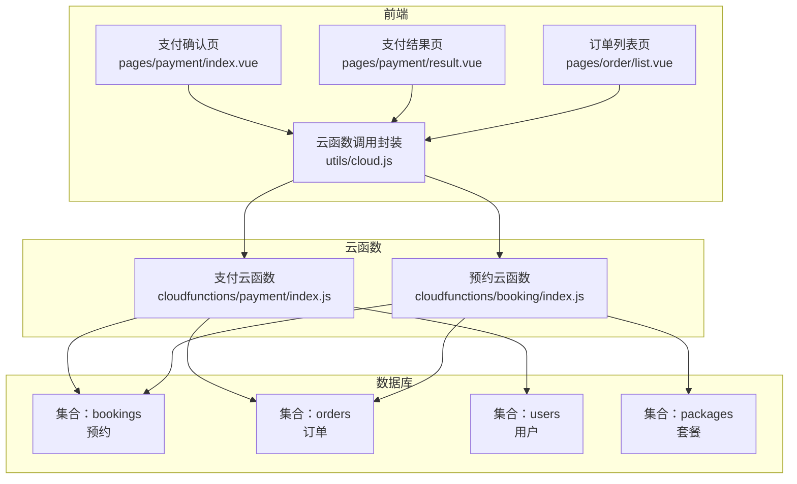
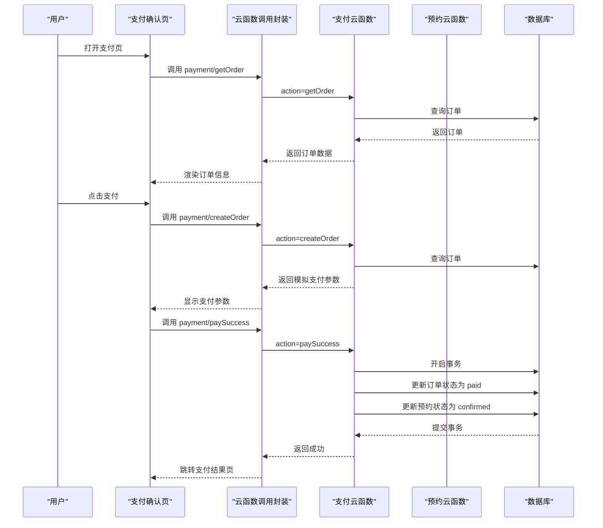
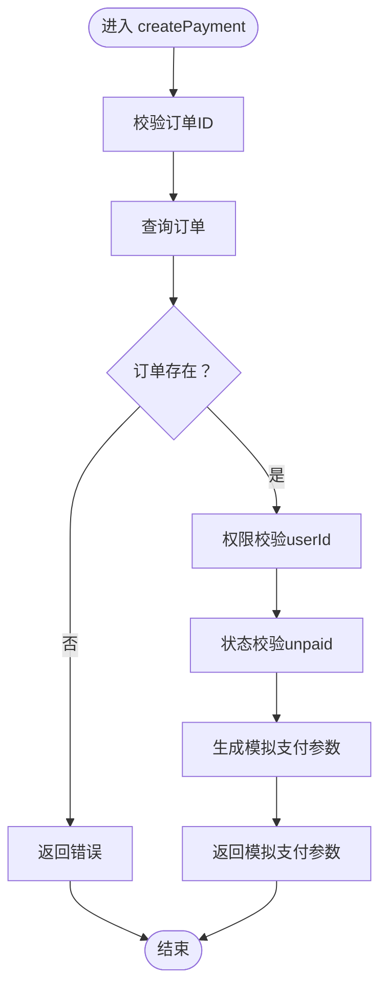
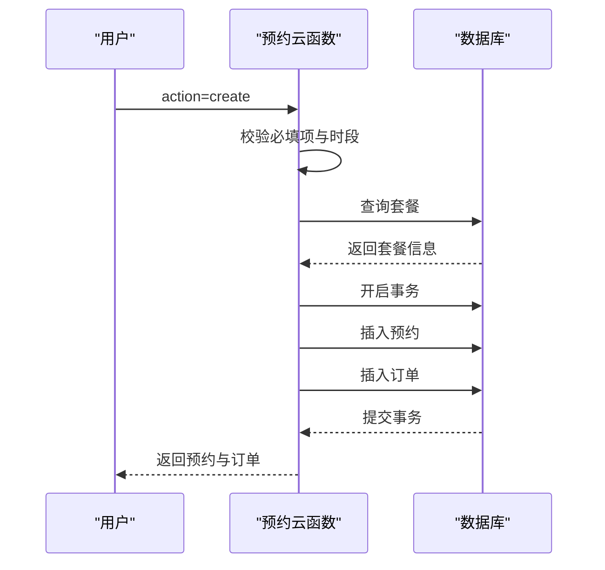
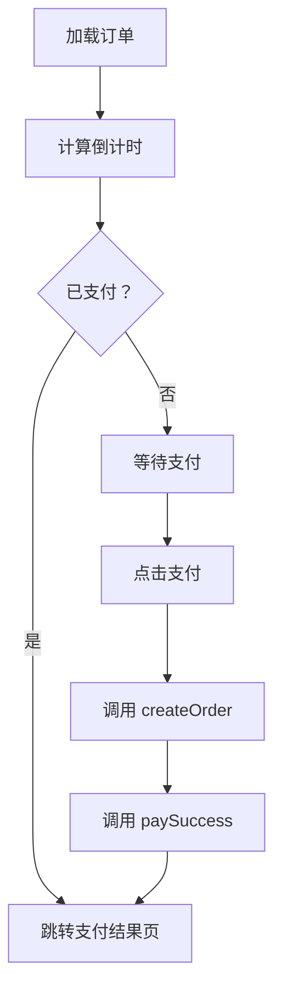
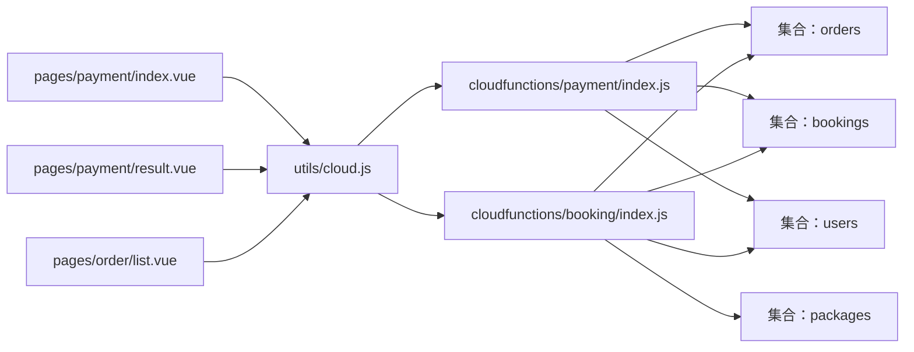

# 支付系统

<cite>
**本文档引用的文件**
- [payment/index.js](file://miniprogram/cloudfunctions/payment/index.js)
- [payment/package.json](file://miniprogram/cloudfunctions/payment/package.json)
- [booking/index.js](file://miniprogram/cloudfunctions/booking/index.js)
- [payment/index.vue](file://miniprogram/src/pages/payment/index.vue)
- [payment/result.vue](file://miniprogram/src/pages/payment/result.vue)
- [cloud.js](file://miniprogram/src/utils/cloud.js)
- [constants.js](file://miniprogram/src/utils/constants.js)
- [order/list.vue](file://miniprogram/src/pages/order/list.vue)
</cite>

## 目录
1. [简介](#简介)
2. [项目结构](#项目结构)
3. [核心组件](#核心组件)
4. [架构总览](#架构总览)
5. [详细组件分析](#详细组件分析)
6. [依赖关系分析](#依赖关系分析)
7. [性能考虑](#性能考虑)
8. [故障排查指南](#故障排查指南)
9. [结论](#结论)
10. [附录](#附录)

## 简介
本支付系统基于微信小程序云开发构建，实现了从预约下单到支付完成的完整闭环。系统采用“预约-订单”双实体模型，支持模拟支付与真实支付两种模式，并提供了退款、订单查询、状态同步等核心能力。本文档将深入解析支付集成、订单创建、状态同步与回调处理机制，同时给出安全策略、异常处理、退款流程、超时清理与数据一致性保障方案，以及调试与监控建议。

## 项目结构
支付系统主要由三部分组成：
- 前端页面：支付确认页、支付结果页、订单列表页
- 云函数：支付云函数（负责创建订单、支付成功、回调、退款、查询）、预约云函数（负责创建预约并联动生成订单）
- 工具模块：云函数调用封装

图表来源
- [payment/index.js:1-532](file://miniprogram/cloudfunctions/payment/index.js#L1-532)
- [booking/index.js:1-463](file://miniprogram/cloudfunctions/booking/index.js#L1-463)
- [payment/index.vue:1-535](file://miniprogram/src/pages/payment/index.vue#L1-535)
- [payment/result.vue:1-358](file://miniprogram/src/pages/payment/result.vue#L1-358)
- [cloud.js:1-66](file://miniprogram/src/utils/cloud.js#L1-66)
- [order/list.vue:1-554](file://miniprogram/src/pages/order/list.vue#L1-554)

章节来源
- [payment/index.js:1-532](file://miniprogram/cloudfunctions/payment/index.js#L1-532)
- [booking/index.js:1-463](file://miniprogram/cloudfunctions/booking/index.js#L1-463)
- [payment/index.vue:1-535](file://miniprogram/src/pages/payment/index.vue#L1-535)
- [payment/result.vue:1-358](file://miniprogram/src/pages/payment/result.vue#L1-358)
- [cloud.js:1-66](file://miniprogram/src/utils/cloud.js#L1-66)
- [order/list.vue:1-554](file://miniprogram/src/pages/order/list.vue#L1-554)

## 核心组件
- 支付云函数：提供创建订单、支付成功、回调、退款、订单查询等能力；当前为模拟模式，真实支付需配置商户号
- 预约云函数：创建预约并联动生成订单，使用事务保证数据一致性
- 前端支付页：展示订单信息、倒计时、支付按钮，处理支付流程与结果跳转
- 云函数调用封装：统一处理云函数调用、错误与返回值解析

章节来源
- [payment/index.js:26-52](file://miniprogram/cloudfunctions/payment/index.js#L26-52)
- [booking/index.js:67-93](file://miniprogram/cloudfunctions/booking/index.js#L67-93)
- [payment/index.vue:106-267](file://miniprogram/src/pages/payment/index.vue#L106-267)
- [cloud.js:5-26](file://miniprogram/src/utils/cloud.js#L5-26)

## 架构总览
系统采用前后端分离的云开发架构：
- 前端通过云函数调用封装发起请求
- 云函数访问数据库集合进行数据读写
- 支付云函数提供模拟支付参数，真实支付需配置微信支付商户号
- 预约云函数在创建预约的同时生成订单，确保“预约-订单”关联一致

图表来源
- [payment/index.vue:130-247](file://miniprogram/src/pages/payment/index.vue#L130-247)
- [cloud.js:5-26](file://miniprogram/src/utils/cloud.js#L5-26)
- [payment/index.js:65-166](file://miniprogram/cloudfunctions/payment/index.js#L65-166)
- [payment/index.js:172-239](file://miniprogram/cloudfunctions/payment/index.js#L172-239)

## 详细组件分析

### 支付云函数（cloudfunctions/payment/index.js）
- 功能职责
  - 创建支付订单：校验订单存在性与状态，返回模拟支付参数（真实模式需配置商户号）
  - 支付成功回调处理：前端模拟支付成功后更新订单与预约状态，使用事务保证一致性
  - 支付回调处理：预留真实回调处理逻辑（签名验证、订单状态更新）
  - 退款处理：管理员权限校验后执行退款（模拟模式下直接更新订单与预约状态）
  - 订单查询与列表：支持按订单ID或订单号查询，支持分页与状态筛选

- 关键流程
  - 创建订单：查询订单 -> 权限校验 -> 状态校验 -> 生成模拟支付参数
  - 支付成功：查询订单 -> 权限校验 -> 状态校验 -> 事务更新订单与预约
  - 退款：管理员校验 -> 订单存在性与状态校验 -> 事务更新订单与预约

图表来源
- [payment/index.js:65-166](file://miniprogram/cloudfunctions/payment/index.js#L65-166)

章节来源
- [payment/index.js:65-166](file://miniprogram/cloudfunctions/payment/index.js#L65-166)
- [payment/index.js:172-239](file://miniprogram/cloudfunctions/payment/index.js#L172-239)
- [payment/index.js:253-327](file://miniprogram/cloudfunctions/payment/index.js#L253-327)
- [payment/index.js:338-450](file://miniprogram/cloudfunctions/payment/index.js#L338-450)
- [payment/index.js:455-531](file://miniprogram/cloudfunctions/payment/index.js#L455-531)

### 预约云函数（cloudfunctions/booking/index.js）
- 功能职责
  - 创建预约并联动生成订单：使用事务确保“预约-订单”一致性
  - 预约状态管理：支持取消、状态更新、可用时段查询
  - 数据一致性：并发场景下再次检查时段是否已满，防止超卖

- 关键流程
  - 创建预约：校验必填项与时段容量 -> 查询套餐信息 -> 事务创建预约与订单 -> 提交事务

图表来源
- [booking/index.js:98-206](file://miniprogram/cloudfunctions/booking/index.js#L98-206)

章节来源
- [booking/index.js:98-206](file://miniprogram/cloudfunctions/booking/index.js#L98-206)
- [booking/index.js:264-303](file://miniprogram/cloudfunctions/booking/index.js#L264-303)
- [booking/index.js:308-385](file://miniprogram/cloudfunctions/booking/index.js#L308-385)
- [booking/index.js:390-438](file://miniprogram/cloudfunctions/booking/index.js#L390-438)
- [booking/index.js:443-462](file://miniprogram/cloudfunctions/booking/index.js#L443-462)

### 前端支付页面（pages/payment/index.vue）
- 功能职责
  - 展示订单信息与支付信息
  - 倒计时显示与超时处理
  - 发起支付流程：调用云函数创建订单与模拟支付成功
  - 结果跳转：支付成功跳转结果页

- 关键流程
  - 加载订单：调用 payment/getOrder -> 计算倒计时 -> 若已支付则跳转结果页
  - 支付流程：调用 payment/createOrder -> 调用 payment/paySuccess -> 跳转结果页

图表来源
- [payment/index.vue:130-247](file://miniprogram/src/pages/payment/index.vue#L130-247)

章节来源
- [payment/index.vue:106-267](file://miniprogram/src/pages/payment/index.vue#L106-267)

### 支付结果页面（pages/payment/result.vue）
- 功能职责
  - 展示支付成功/失败状态
  - 展示订单与预约信息
  - 提供查看订单、重新支付、返回首页等操作

章节来源
- [payment/result.vue:1-358](file://miniprogram/src/pages/payment/result.vue#L1-358)

### 云函数调用封装（utils/cloud.js）
- 功能职责
  - 统一封装 wx.cloud.callFunction，处理返回值与错误
  - 提供文件上传、下载、删除等云存储工具

章节来源
- [cloud.js:5-66](file://miniprogram/src/utils/cloud.js#L5-66)

## 依赖关系分析
- 支付云函数依赖微信云开发 SDK，访问数据库集合 orders、bookings、users
- 预约云函数同样依赖微信云开发 SDK，访问数据库集合 bookings、orders、packages、users
- 前端页面通过云函数调用封装与云函数交互
- 支付状态与订单状态在前端常量中定义，便于统一管理

图表来源
- [cloud.js:5-26](file://miniprogram/src/utils/cloud.js#L5-26)
- [payment/index.js:1-6](file://miniprogram/cloudfunctions/payment/index.js#L1-6)
- [booking/index.js:1-6](file://miniprogram/cloudfunctions/booking/index.js#L1-6)
- [payment/index.vue](file://miniprogram/src/pages/payment/index.vue#L109)
- [payment/result.vue](file://miniprogram/src/pages/payment/result.vue#L82)
- [order/list.vue](file://miniprogram/src/pages/order/list.vue#L146)

章节来源
- [payment/package.json:1-7](file://miniprogram/cloudfunctions/payment/package.json#L1-7)
- [constants.js:39-56](file://miniprogram/src/utils/constants.js#L39-56)

## 性能考虑
- 事务优化：支付成功与退款均使用事务，减少并发冲突导致的数据不一致风险
- 分页查询：订单列表支持分页与状态筛选，降低单次查询负载
- 倒计时控制：前端倒计时避免无效支付请求，提升用户体验
- 云函数依赖：仅引入必要依赖 wx-server-sdk，减少包体积

章节来源
- [payment/index.js:204-239](file://miniprogram/cloudfunctions/payment/index.js#L204-239)
- [booking/index.js:150-206](file://miniprogram/cloudfunctions/booking/index.js#L150-206)
- [order/list.vue:213-253](file://miniprogram/src/pages/order/list.vue#L213-253)

## 故障排查指南
- 常见错误与定位
  - 订单不存在：检查订单ID或订单号是否正确，确认订单归属用户
  - 权限不足：确认用户身份与订单userId匹配，管理员权限校验
  - 订单状态异常：确认订单状态为 unpaid，避免重复支付
  - 云函数调用失败：检查云函数名称与参数，查看控制台日志
  - 退款失败：确认订单已支付且管理员权限有效

- 调试方法
  - 前端：使用 uni.showToast 输出错误信息，检查网络请求与返回值
  - 云函数：在关键节点添加 console.error，查看云函数日志
  - 数据库：核对 orders、bookings 集合字段与状态变化

- 监控方案
  - 日志监控：记录关键操作（创建订单、支付成功、退款）与错误堆栈
  - 异常告警：对高频错误（如权限不足、订单不存在）设置阈值告警
  - 性能监控：关注云函数执行耗时与数据库查询次数

章节来源
- [payment/index.js:48-51](file://miniprogram/cloudfunctions/payment/index.js#L48-51)
- [booking/index.js:321-341](file://miniprogram/cloudfunctions/booking/index.js#L321-341)
- [cloud.js:20-25](file://miniprogram/src/utils/cloud.js#L20-25)

## 结论
本支付系统以“预约-订单”为核心模型，结合云函数与前端页面，实现了从下单到支付完成的闭环。当前系统处于模拟支付模式，具备完善的权限校验、事务处理与状态管理能力。建议在真实接入微信支付时，补充签名验证、回调幂等处理与超时清理策略，以进一步提升安全性与稳定性。

## 附录

### 支付安全策略与防重放
- 签名验证：真实接入时应校验微信支付回调签名，确保数据完整性与来源可信
- 幂等处理：回调与前端操作均需支持幂等，避免重复更新订单状态
- 参数校验：严格校验回调参数（outTradeNo、transactionId、timeEnd等），防止伪造请求
- 交易号唯一：使用订单号作为 outTradeNo，确保唯一性与可追溯性

章节来源
- [payment/index.js:253-327](file://miniprogram/cloudfunctions/payment/index.js#L253-327)

### 支付超时处理与订单清理
- 前端倒计时：支付页展示倒计时，超时自动刷新订单状态
- 后端清理：建议增加定时任务扫描未支付订单，超过时限自动取消并释放时段
- 时段释放：取消预约时释放对应时段，防止并发超卖

章节来源
- [payment/index.vue:146-189](file://miniprogram/src/pages/payment/index.vue#L146-189)
- [booking/index.js:308-385](file://miniprogram/cloudfunctions/booking/index.js#L308-385)

### 退款流程实现
- 管理员权限：退款操作需管理员校验
- 状态校验：仅已支付订单可退款
- 事务更新：退款成功后更新订单与预约状态
- 通知机制：退款完成后通知用户与管理员

章节来源
- [payment/index.js:338-450](file://miniprogram/cloudfunctions/payment/index.js#L338-450)
- [booking/index.js:308-385](file://miniprogram/cloudfunctions/booking/index.js#L308-385)

### 错误码定义与返回规范
- 统一返回结构：{ code, message, data }
- 业务错误码：-1 表示业务错误，0 表示成功
- 建议扩展：为不同错误场景定义明确的错误码，便于前端与监控系统识别

章节来源
- [payment/index.js:26-52](file://miniprogram/cloudfunctions/payment/index.js#L26-52)
- [cloud.js:11-18](file://miniprogram/src/utils/cloud.js#L11-18)