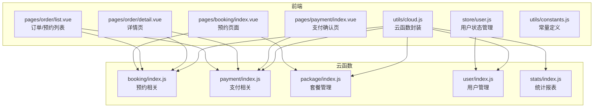
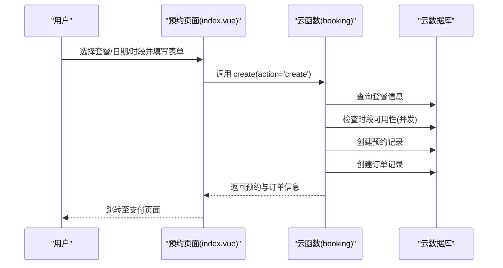
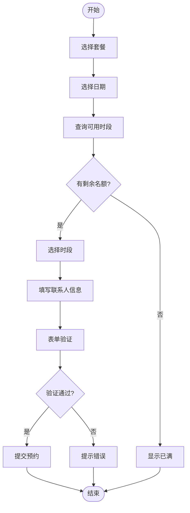
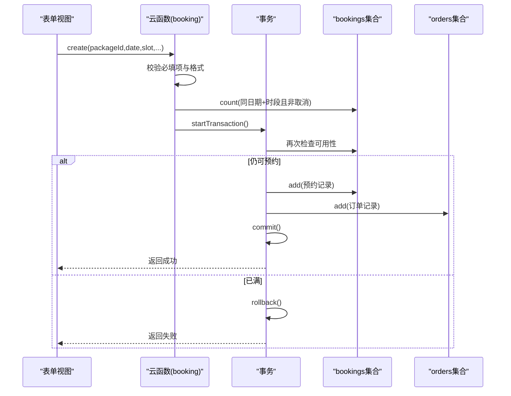
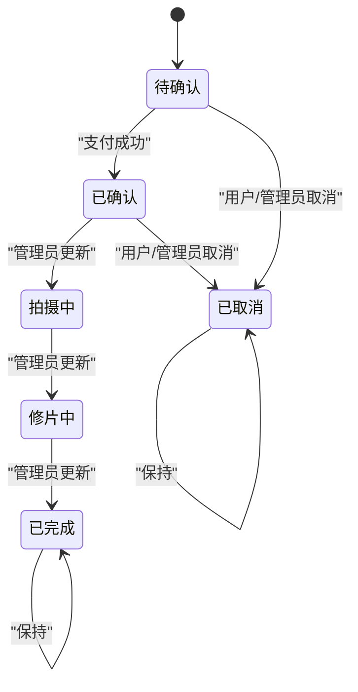
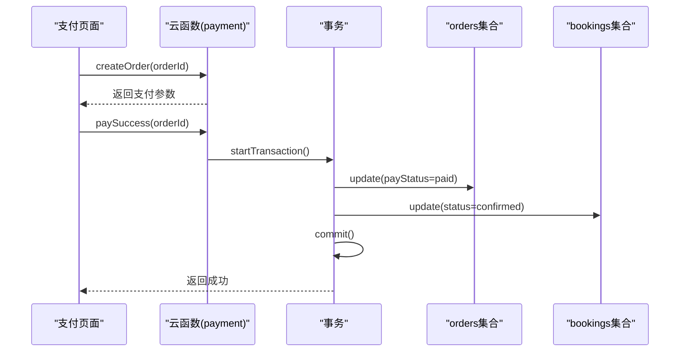
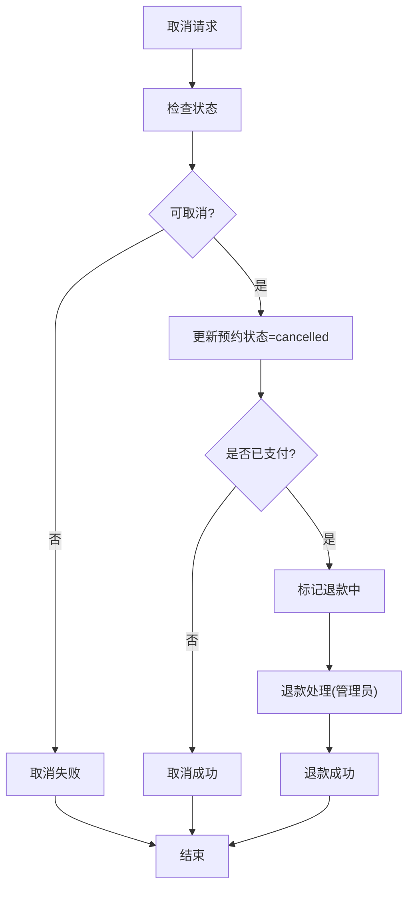
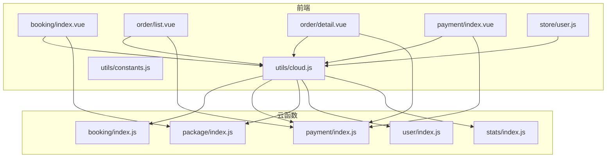

# 预约预订系统

<cite>
**本文档引用的文件**
- [miniprogram/cloudfunctions/booking/index.js](file://miniprogram/cloudfunctions/booking/index.js)
- [miniprogram/cloudfunctions/payment/index.js](file://miniprogram/cloudfunctions/payment/index.js)
- [miniprogram/cloudfunctions/package/index.js](file://miniprogram/cloudfunctions/package/index.js)
- [miniprogram/cloudfunctions/user/index.js](file://miniprogram/cloudfunctions/user/index.js)
- [miniprogram/cloudfunctions/stats/index.js](file://miniprogram/cloudfunctions/stats/index.js)
- [miniprogram/src/pages/booking/index.vue](file://miniprogram/src/pages/booking/index.vue)
- [miniprogram/src/pages/order/list.vue](file://miniprogram/src/pages/order/list.vue)
- [miniprogram/src/pages/order/detail.vue](file://miniprogram/src/pages/order/detail.vue)
- [miniprogram/src/pages/payment/index.vue](file://miniprogram/src/pages/payment/index.vue)
- [miniprogram/src/store/user.js](file://miniprogram/src/store/user.js)
- [miniprogram/src/utils/cloud.js](file://miniprogram/src/utils/cloud.js)
- [miniprogram/src/utils/constants.js](file://miniprogram/src/utils/constants.js)
</cite>

## 目录
1. [简介](#简介)
2. [项目结构](#项目结构)
3. [核心组件](#核心组件)
4. [架构总览](#架构总览)
5. [详细组件分析](#详细组件分析)
6. [依赖关系分析](#依赖关系分析)
7. [性能考虑](#性能考虑)
8. [故障排查指南](#故障排查指南)
9. [结论](#结论)
10. [附录](#附录)

## 简介
本系统是一个基于微信小程序与云开发的预约预订平台，主要面向旅拍服务场景。系统提供从套餐浏览、预约时间选择、表单验证、订单创建、支付处理到状态管理的完整闭环。系统采用前后端分离架构，前端使用 Vue 3 + UniApp 开发，后端通过云函数提供 API，数据存储于云数据库。

系统核心功能包括：
- 预约流程设计与时间槽选择
- 预约表单验证与提交机制
- 预约状态机与并发控制
- 预约与支付系统的关联
- 预约确认通知与状态更新
- 预约取消、修改与退款处理
- 数据模型设计与查询优化

## 项目结构
系统采用按功能模块划分的目录结构，前端页面与云函数分别组织，便于维护与扩展。

图表来源
- [miniprogram/src/pages/booking/index.vue:1-1029](file://miniprogram/src/pages/booking/index.vue#L1-L1029)
- [miniprogram/src/pages/order/list.vue:1-554](file://miniprogram/src/pages/order/list.vue#L1-L554)
- [miniprogram/src/pages/order/detail.vue:1-451](file://miniprogram/src/pages/order/detail.vue#L1-L451)
- [miniprogram/src/pages/payment/index.vue:1-535](file://miniprogram/src/pages/payment/index.vue#L1-L535)
- [miniprogram/src/store/user.js:1-48](file://miniprogram/src/store/user.js#L1-L48)
- [miniprogram/src/utils/cloud.js:1-66](file://miniprogram/src/utils/cloud.js#L1-L66)
- [miniprogram/src/utils/constants.js:1-73](file://miniprogram/src/utils/constants.js#L1-L73)
- [miniprogram/cloudfunctions/booking/index.js:1-463](file://miniprogram/cloudfunctions/booking/index.js#L1-L463)
- [miniprogram/cloudfunctions/payment/index.js:1-532](file://miniprogram/cloudfunctions/payment/index.js#L1-L532)
- [miniprogram/cloudfunctions/package/index.js:1-222](file://miniprogram/cloudfunctions/package/index.js#L1-L222)
- [miniprogram/cloudfunctions/user/index.js:1-206](file://miniprogram/cloudfunctions/user/index.js#L1-L206)
- [miniprogram/cloudfunctions/stats/index.js:1-229](file://miniprogram/cloudfunctions/stats/index.js#L1-L229)

章节来源
- [miniprogram/src/pages/booking/index.vue:1-1029](file://miniprogram/src/pages/booking/index.vue#L1-L1029)
- [miniprogram/cloudfunctions/booking/index.js:1-463](file://miniprogram/cloudfunctions/booking/index.js#L1-L463)

## 核心组件
- 预约云函数：负责预约创建、查询、取消、状态更新与可用时段查询，包含事务与并发控制。
- 支付云函数：负责订单创建、支付成功处理、退款处理与订单查询。
- 套餐云函数：负责套餐列表、详情、增删改与状态管理。
- 用户云函数：负责用户登录、资料更新与角色管理。
- 统计云函数：负责管理员数据概览与趋势统计。
- 前端页面：预约页面、订单/预约列表、详情页、支付确认页。
- 工具模块：云函数封装、常量定义、用户状态管理。

章节来源
- [miniprogram/cloudfunctions/booking/index.js:67-93](file://miniprogram/cloudfunctions/booking/index.js#L67-L93)
- [miniprogram/cloudfunctions/payment/index.js:26-52](file://miniprogram/cloudfunctions/payment/index.js#L26-L52)
- [miniprogram/cloudfunctions/package/index.js:26-58](file://miniprogram/cloudfunctions/package/index.js#L26-L58)
- [miniprogram/cloudfunctions/user/index.js:7-31](file://miniprogram/cloudfunctions/user/index.js#L7-L31)
- [miniprogram/cloudfunctions/stats/index.js:52-68](file://miniprogram/cloudfunctions/stats/index.js#L52-L68)
- [miniprogram/src/pages/booking/index.vue:207-494](file://miniprogram/src/pages/booking/index.vue#L207-L494)
- [miniprogram/src/pages/order/list.vue:144-322](file://miniprogram/src/pages/order/list.vue#L144-L322)
- [miniprogram/src/pages/order/detail.vue:145-284](file://miniprogram/src/pages/order/detail.vue#L145-L284)
- [miniprogram/src/pages/payment/index.vue:106-267](file://miniprogram/src/pages/payment/index.vue#L106-L267)
- [miniprogram/src/utils/cloud.js:5-26](file://miniprogram/src/utils/cloud.js#L5-L26)
- [miniprogram/src/utils/constants.js:1-73](file://miniprogram/src/utils/constants.js#L1-L73)

## 架构总览
系统采用“前端页面 + 云函数 + 云数据库”的三层架构。前端通过云函数封装统一调用后端接口，云函数对数据库进行读写操作，并在必要时使用事务保证数据一致性。

图表来源
- [miniprogram/src/pages/booking/index.vue:422-470](file://miniprogram/src/pages/booking/index.vue#L422-L470)
- [miniprogram/cloudfunctions/booking/index.js:98-206](file://miniprogram/cloudfunctions/booking/index.js#L98-L206)

章节来源
- [miniprogram/src/pages/booking/index.vue:422-470](file://miniprogram/src/pages/booking/index.vue#L422-L470)
- [miniprogram/cloudfunctions/booking/index.js:98-206](file://miniprogram/cloudfunctions/booking/index.js#L98-L206)

## 详细组件分析

### 预约流程与时间槽选择
- 时间槽配置：支持上午、下午、黄金时段三类，每时段最大预约数限制。
- 日期选择：日历组件支持月份切换与日期禁用规则（仅允许未来60天内）。
- 可用时段查询：根据所选日期动态查询各时段剩余名额。
- 表单验证：必填项校验、手机号格式校验、提交按钮启用条件计算。

图表来源
- [miniprogram/src/pages/booking/index.vue:341-421](file://miniprogram/src/pages/booking/index.vue#L341-L421)

章节来源
- [miniprogram/src/pages/booking/index.vue:341-421](file://miniprogram/src/pages/booking/index.vue#L341-L421)
- [miniprogram/src/utils/constants.js:22-27](file://miniprogram/src/utils/constants.js#L22-L27)

### 预约表单验证与提交机制
- 必填项：套餐、日期、时段、联系人姓名、联系电话、拍摄人数。
- 校验逻辑：手机号正则校验、时段有效性校验、并发检查。
- 提交流程：调用云函数创建预约与订单，成功后跳转支付页。

图表来源
- [miniprogram/src/pages/booking/index.vue:422-470](file://miniprogram/src/pages/booking/index.vue#L422-L470)
- [miniprogram/cloudfunctions/booking/index.js:98-206](file://miniprogram/cloudfunctions/booking/index.js#L98-L206)

章节来源
- [miniprogram/src/pages/booking/index.vue:422-470](file://miniprogram/src/pages/booking/index.vue#L422-L470)
- [miniprogram/cloudfunctions/booking/index.js:98-206](file://miniprogram/cloudfunctions/booking/index.js#L98-L206)

### 预约状态机设计
- 状态枚举：pending（待确认）、confirmed（已确认）、shooting（拍摄中）、retouching（修片中）、completed（已完成）、cancelled（已取消）。
- 状态流转：创建后初始 pending；支付成功后由支付云函数更新为 confirmed；管理员可直接更新状态。
- 状态展示：前端根据状态映射显示颜色与标签。

图表来源
- [miniprogram/src/utils/constants.js:29-37](file://miniprogram/src/utils/constants.js#L29-L37)
- [miniprogram/cloudfunctions/booking/index.js:390-438](file://miniprogram/cloudfunctions/booking/index.js#L390-L438)
- [miniprogram/cloudfunctions/payment/index.js:216-238](file://miniprogram/cloudfunctions/payment/index.js#L216-L238)

章节来源
- [miniprogram/src/utils/constants.js:29-37](file://miniprogram/src/utils/constants.js#L29-L37)
- [miniprogram/cloudfunctions/booking/index.js:390-438](file://miniprogram/cloudfunctions/booking/index.js#L390-L438)
- [miniprogram/cloudfunctions/payment/index.js:216-238](file://miniprogram/cloudfunctions/payment/index.js#L216-L238)

### 时间冲突检测与并发控制策略
- 时段容量控制：每个时段最大预约数限制，避免超卖。
- 并发检查：创建预约前与事务内双重检查，防止竞态条件导致超卖。
- 事务保证：预约与订单创建在同一个事务中，确保数据一致性。

章节来源
- [miniprogram/cloudfunctions/booking/index.js:51-65](file://miniprogram/cloudfunctions/booking/index.js#L51-L65)
- [miniprogram/cloudfunctions/booking/index.js:150-206](file://miniprogram/cloudfunctions/booking/index.js#L150-L206)

### 预约与支付系统的关联
- 订单创建：预约成功后创建订单，包含订单号、应付金额、支付状态等。
- 支付流程：前端调用支付云函数创建订单并模拟支付成功，触发事务更新订单与预约状态。
- 支付回调：预留真实支付回调处理，当前为模拟模式。

图表来源
- [miniprogram/src/pages/payment/index.vue:209-247](file://miniprogram/src/pages/payment/index.vue#L209-L247)
- [miniprogram/cloudfunctions/payment/index.js:65-166](file://miniprogram/cloudfunctions/payment/index.js#L65-L166)
- [miniprogram/cloudfunctions/payment/index.js:203-239](file://miniprogram/cloudfunctions/payment/index.js#L203-L239)

章节来源
- [miniprogram/src/pages/payment/index.vue:209-247](file://miniprogram/src/pages/payment/index.vue#L209-L247)
- [miniprogram/cloudfunctions/payment/index.js:65-166](file://miniprogram/cloudfunctions/payment/index.js#L65-L166)
- [miniprogram/cloudfunctions/payment/index.js:203-239](file://miniprogram/cloudfunctions/payment/index.js#L203-L239)

### 预约确认通知与状态更新逻辑
- 状态更新：支付成功后，订单与预约状态同步更新。
- 前端展示：列表与详情页根据状态实时展示最新状态与操作按钮。
- 倒计时：支付页提供30分钟倒计时，超时订单自动失效。

章节来源
- [miniprogram/cloudfunctions/payment/index.js:216-238](file://miniprogram/cloudfunctions/payment/index.js#L216-L238)
- [miniprogram/src/pages/order/list.vue:185-194](file://miniprogram/src/pages/order/list.vue#L185-L194)
- [miniprogram/src/pages/order/detail.vue:156-172](file://miniprogram/src/pages/order/detail.vue#L156-L172)
- [miniprogram/src/pages/payment/index.vue:145-189](file://miniprogram/src/pages/payment/index.vue#L145-L189)

### 预约取消、修改与退款处理
- 取消流程：用户或管理员取消预约，已支付订单标记退款状态。
- 修改流程：管理员可直接更新预约状态，支持多阶段状态变更。
- 退款处理：管理员发起退款，更新订单与预约状态；当前为模拟模式。

图表来源
- [miniprogram/cloudfunctions/booking/index.js:308-385](file://miniprogram/cloudfunctions/booking/index.js#L308-L385)
- [miniprogram/cloudfunctions/payment/index.js:338-450](file://miniprogram/cloudfunctions/payment/index.js#L338-L450)

章节来源
- [miniprogram/cloudfunctions/booking/index.js:308-385](file://miniprogram/cloudfunctions/booking/index.js#L308-L385)
- [miniprogram/cloudfunctions/payment/index.js:338-450](file://miniprogram/cloudfunctions/payment/index.js#L338-L450)

### 数据模型设计与查询性能优化
- 集合与字段
  - users：用户信息（openid、角色、创建时间）
  - packages：套餐信息（名称、价格、定金、状态、排序）
  - bookings：预约记录（用户ID、套餐ID、日期、时段、状态、联系人、人数、备注、时间戳）
  - orders：订单记录（关联bookingId、用户ID、套餐信息、总价、定金、支付状态、订单号、时间戳）

- 索引建议
  - bookings：date、timeSlot、status、userId
  - orders：bookingId、userId、payStatus、orderNo
  - users：openid、role
  - packages：status、category、sortOrder

- 查询优化
  - 分页查询：列表页使用 skip/limit 实现分页。
  - 条件过滤：按状态、日期、用户ID精确过滤。
  - 聚合统计：使用聚合管道进行收入统计与状态分布。

章节来源
- [miniprogram/cloudfunctions/booking/index.js:51-65](file://miniprogram/cloudfunctions/booking/index.js#L51-L65)
- [miniprogram/cloudfunctions/payment/index.js:455-492](file://miniprogram/cloudfunctions/payment/index.js#L455-L492)
- [miniprogram/cloudfunctions/package/index.js:61-86](file://miniprogram/cloudfunctions/package/index.js#L61-L86)
- [miniprogram/cloudfunctions/stats/index.js:167-228](file://miniprogram/cloudfunctions/stats/index.js#L167-L228)

## 依赖关系分析
系统依赖关系清晰，前端通过工具模块统一调用云函数，云函数之间相互独立，职责明确。

图表来源
- [miniprogram/src/pages/booking/index.vue:207-494](file://miniprogram/src/pages/booking/index.vue#L207-L494)
- [miniprogram/src/pages/order/list.vue:144-322](file://miniprogram/src/pages/order/list.vue#L144-L322)
- [miniprogram/src/pages/order/detail.vue:145-284](file://miniprogram/src/pages/order/detail.vue#L145-L284)
- [miniprogram/src/pages/payment/index.vue:106-267](file://miniprogram/src/pages/payment/index.vue#L106-L267)
- [miniprogram/src/store/user.js:1-48](file://miniprogram/src/store/user.js#L1-L48)
- [miniprogram/src/utils/cloud.js:5-26](file://miniprogram/src/utils/cloud.js#L5-L26)
- [miniprogram/cloudfunctions/booking/index.js:67-93](file://miniprogram/cloudfunctions/booking/index.js#L67-L93)
- [miniprogram/cloudfunctions/payment/index.js:26-52](file://miniprogram/cloudfunctions/payment/index.js#L26-L52)
- [miniprogram/cloudfunctions/package/index.js:26-58](file://miniprogram/cloudfunctions/package/index.js#L26-L58)
- [miniprogram/cloudfunctions/user/index.js:7-31](file://miniprogram/cloudfunctions/user/index.js#L7-L31)
- [miniprogram/cloudfunctions/stats/index.js:52-68](file://miniprogram/cloudfunctions/stats/index.js#L52-L68)

章节来源
- [miniprogram/src/utils/cloud.js:5-26](file://miniprogram/src/utils/cloud.js#L5-L26)

## 性能考虑
- 事务使用：在创建预约与订单时使用事务，确保原子性，减少回滚成本。
- 并发控制：双重检查可用性，避免超卖。
- 分页查询：列表页采用分页加载，降低单次查询压力。
- 索引优化：建议为高频查询字段建立索引，如 bookings 的 date/timeSlot/status/userId。
- 缓存策略：前端可缓存套餐列表与可用时段，减少重复请求。
- 异步处理：支付回调与退款处理建议异步化，避免阻塞主流程。

## 故障排查指南
- 预约失败
  - 检查必填项与格式校验是否通过。
  - 确认时段是否已满。
  - 查看云函数返回的错误信息。

- 支付问题
  - 确认订单状态为未支付。
  - 检查支付参数生成与模拟支付逻辑。
  - 关注支付回调与事务提交结果。

- 权限问题
  - 管理员操作需验证角色。
  - 用户只能查看自己的数据。

- 数据一致性
  - 事务回滚时检查异常日志。
  - 并发场景下关注可用性检查时机。

章节来源
- [miniprogram/cloudfunctions/booking/index.js:98-118](file://miniprogram/cloudfunctions/booking/index.js#L98-L118)
- [miniprogram/cloudfunctions/payment/index.js:172-239](file://miniprogram/cloudfunctions/payment/index.js#L172-L239)
- [miniprogram/cloudfunctions/user/index.js:156-205](file://miniprogram/cloudfunctions/user/index.js#L156-L205)

## 结论
本系统通过清晰的前后端分离架构与完善的云函数设计，实现了从预约到支付的完整业务闭环。系统具备良好的并发控制与状态管理能力，同时提供了可扩展的数据模型与查询优化方案。建议后续完善真实支付与退款接入、增加更丰富的统计维度与通知机制，以进一步提升用户体验与运营效率。

## 附录
- 常量定义：包含套餐分类、时间槽、状态映射等。
- 用户状态：登录、资料管理与角色控制。
- 云函数封装：统一的云函数调用与文件操作接口。

章节来源
- [miniprogram/src/utils/constants.js:1-73](file://miniprogram/src/utils/constants.js#L1-L73)
- [miniprogram/src/store/user.js:1-48](file://miniprogram/src/store/user.js#L1-L48)
- [miniprogram/src/utils/cloud.js:28-66](file://miniprogram/src/utils/cloud.js#L28-L66)