# 云函数开发

<cite>
**本文引用的文件**
- [miniprogram/cloudfunctions/booking/index.js](file://miniprogram/cloudfunctions/booking/index.js)
- [miniprogram/cloudfunctions/user/index.js](file://miniprogram/cloudfunctions/user/index.js)
- [miniprogram/cloudfunctions/payment/index.js](file://miniprogram/cloudfunctions/payment/index.js)
- [miniprogram/cloudfunctions/gallery/index.js](file://miniprogram/cloudfunctions/gallery/index.js)
- [miniprogram/cloudfunctions/package/index.js](file://miniprogram/cloudfunctions/package/index.js)
- [miniprogram/cloudfunctions/stats/index.js](file://miniprogram/cloudfunctions/stats/index.js)
- [miniprogram/cloudfunctions/booking/package.json](file://miniprogram/cloudfunctions/booking/package.json)
- [miniprogram/cloudfunctions/user/package.json](file://miniprogram/cloudfunctions/user/package.json)
- [miniprogram/cloudfunctions/payment/package.json](file://miniprogram/cloudfunctions/payment/package.json)
- [miniprogram/cloudfunctions/gallery/package.json](file://miniprogram/cloudfunctions/gallery/package.json)
- [miniprogram/cloudfunctions/package/package.json](file://miniprogram/cloudfunctions/package/package.json)
- [miniprogram/cloudfunctions/stats/package.json](file://miniprogram/cloudfunctions/stats/package.json)
- [miniprogram/src/utils/cloud.js](file://miniprogram/src/utils/cloud.js)
- [miniprogram/src/utils/constants.js](file://miniprogram/src/utils/constants.js)
- [miniprogram/src/store/user.js](file://miniprogram/src/store/user.js)
</cite>

## 目录
1. [简介](#简介)
2. [项目结构](#项目结构)
3. [核心组件](#核心组件)
4. [架构总览](#架构总览)
5. [详细组件分析](#详细组件分析)
6. [依赖分析](#依赖分析)
7. [性能考量](#性能考量)
8. [故障排查指南](#故障排查指南)
9. [结论](#结论)
10. [附录](#附录)

## 简介
本文件面向 lvpai 小程序项目的云函数开发者，系统性梳理并讲解各云函数模块的职责、实现细节、生命周期、参数与错误处理、安全策略、最佳实践、性能优化与调试方法。重点覆盖以下核心业务：
- 预约管理：创建、查询、取消、状态变更、可用时段查询
- 用户管理：登录、资料更新、手机号绑定、管理员角色设置
- 支付处理：订单创建、支付成功、回调处理、退款
- 内容管理：客片增删改查、收藏切换、收藏列表、收藏状态检查
- 套餐管理：套餐列表、详情、增删改、上下架
- 数据统计：概览、状态分布、近七日趋势

同时，结合前端工具封装与状态管理，说明云函数与前端组件的交互方式、数据库操作与存储管理。

## 项目结构
云函数采用按功能域划分的目录组织，每个云函数独立目录包含入口文件与依赖声明，便于部署与维护。

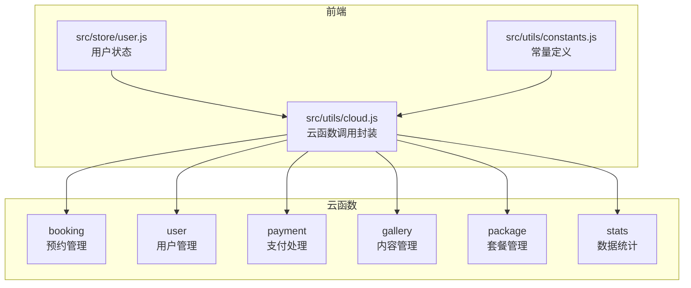

图表来源
- [miniprogram/cloudfunctions/booking/index.js:1-463](file://miniprogram/cloudfunctions/booking/index.js#L1-L463)
- [miniprogram/cloudfunctions/user/index.js:1-206](file://miniprogram/cloudfunctions/user/index.js#L1-L206)
- [miniprogram/cloudfunctions/payment/index.js:1-532](file://miniprogram/cloudfunctions/payment/index.js#L1-L532)
- [miniprogram/cloudfunctions/gallery/index.js:1-360](file://miniprogram/cloudfunctions/gallery/index.js#L1-L360)
- [miniprogram/cloudfunctions/package/index.js:1-222](file://miniprogram/cloudfunctions/package/index.js#L1-L222)
- [miniprogram/cloudfunctions/stats/index.js:1-229](file://miniprogram/cloudfunctions/stats/index.js#L1-L229)
- [miniprogram/src/utils/cloud.js:1-66](file://miniprogram/src/utils/cloud.js#L1-L66)
- [miniprogram/src/utils/constants.js:1-73](file://miniprogram/src/utils/constants.js#L1-L73)
- [miniprogram/src/store/user.js:1-48](file://miniprogram/src/store/user.js#L1-L48)

章节来源
- [miniprogram/cloudfunctions/booking/index.js:1-463](file://miniprogram/cloudfunctions/booking/index.js#L1-L463)
- [miniprogram/cloudfunctions/user/index.js:1-206](file://miniprogram/cloudfunctions/user/index.js#L1-L206)
- [miniprogram/cloudfunctions/payment/index.js:1-532](file://miniprogram/cloudfunctions/payment/index.js#L1-L532)
- [miniprogram/cloudfunctions/gallery/index.js:1-360](file://miniprogram/cloudfunctions/gallery/index.js#L1-L360)
- [miniprogram/cloudfunctions/package/index.js:1-222](file://miniprogram/cloudfunctions/package/index.js#L1-L222)
- [miniprogram/cloudfunctions/stats/index.js:1-229](file://miniprogram/cloudfunctions/stats/index.js#L1-L229)
- [miniprogram/src/utils/cloud.js:1-66](file://miniprogram/src/utils/cloud.js#L1-L66)
- [miniprogram/src/utils/constants.js:1-73](file://miniprogram/src/utils/constants.js#L1-L73)
- [miniprogram/src/store/user.js:1-48](file://miniprogram/src/store/user.js#L1-L48)

## 核心组件
- 预约管理（booking）：负责预约的创建、列表查询、详情、取消、状态更新、可用时段查询；内置并发保护与事务保证数据一致性。
- 用户管理（user）：负责登录注册、个人资料更新、手机号绑定、管理员角色设置；严格基于 openid 进行权限控制。
- 支付处理（payment）：负责订单创建、支付成功、回调处理、退款；提供模拟支付/退款以适配开发阶段；真实接入需配置商户号。
- 内容管理（gallery）：负责客片的增删改查、收藏切换、收藏列表与状态检查；支持管理员与普通用户的差异化访问。
- 套餐管理（package）：负责套餐的增删改、上下架与列表查询；支持分类筛选与状态过滤。
- 数据统计（stats）：负责管理员视角的数据概览、状态分布与近七日趋势统计。

章节来源
- [miniprogram/cloudfunctions/booking/index.js:67-93](file://miniprogram/cloudfunctions/booking/index.js#L67-L93)
- [miniprogram/cloudfunctions/user/index.js:7-31](file://miniprogram/cloudfunctions/user/index.js#L7-L31)
- [miniprogram/cloudfunctions/payment/index.js:26-52](file://miniprogram/cloudfunctions/payment/index.js#L26-L52)
- [miniprogram/cloudfunctions/gallery/index.js:26-64](file://miniprogram/cloudfunctions/gallery/index.js#L26-L64)
- [miniprogram/cloudfunctions/package/index.js:26-58](file://miniprogram/cloudfunctions/package/index.js#L26-L58)
- [miniprogram/cloudfunctions/stats/index.js:52-68](file://miniprogram/cloudfunctions/stats/index.js#L52-L68)

## 架构总览
云函数通过统一的入口分发器根据 action 参数路由到具体业务处理函数，所有函数均基于微信云开发 SDK 初始化数据库连接，使用事务保障关键流程一致性，并对管理员权限进行集中校验。

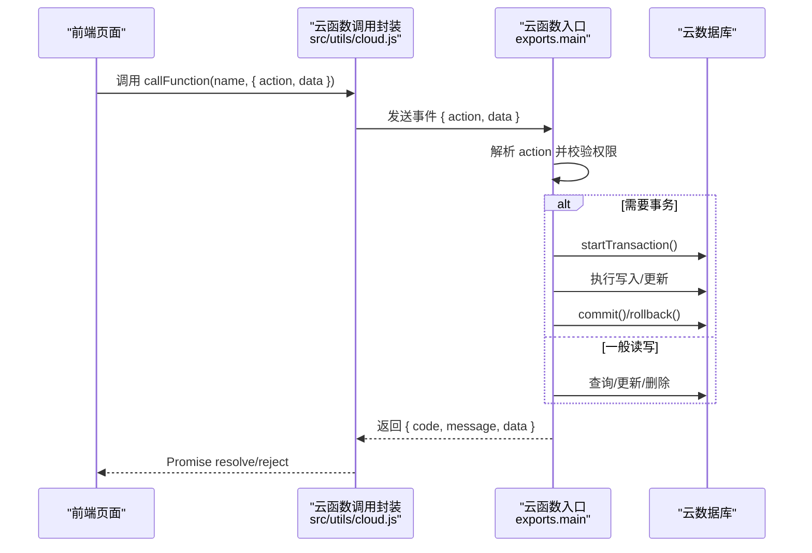

图表来源
- [miniprogram/src/utils/cloud.js:6-26](file://miniprogram/src/utils/cloud.js#L6-L26)
- [miniprogram/cloudfunctions/booking/index.js:67-93](file://miniprogram/cloudfunctions/booking/index.js#L67-L93)
- [miniprogram/cloudfunctions/user/index.js:7-31](file://miniprogram/cloudfunctions/user/index.js#L7-L31)
- [miniprogram/cloudfunctions/payment/index.js:26-52](file://miniprogram/cloudfunctions/payment/index.js#L26-L52)
- [miniprogram/cloudfunctions/gallery/index.js:26-64](file://miniprogram/cloudfunctions/gallery/index.js#L26-L64)
- [miniprogram/cloudfunctions/package/index.js:26-58](file://miniprogram/cloudfunctions/package/index.js#L26-L58)
- [miniprogram/cloudfunctions/stats/index.js:52-68](file://miniprogram/cloudfunctions/stats/index.js#L52-L68)

## 详细组件分析

### 预约管理（booking）
- 功能要点
  - 订单编号生成规则：包含日期时间与四位随机数
  - 时段配置与容量限制：每日三时段，每时段最多 5 个预约
  - 并发保护：创建预约时二次检查容量并使用事务
  - 关联订单：创建预约即生成对应订单，包含定金与订单号
  - 权限控制：非管理员仅能操作本人预约；管理员可全量查询与修改状态
- 关键流程（创建预约）

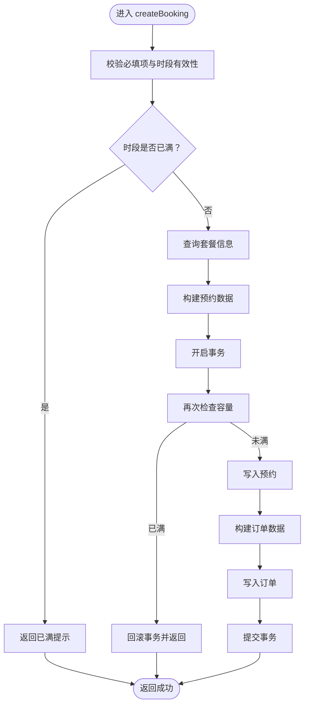

图表来源
- [miniprogram/cloudfunctions/booking/index.js:98-206](file://miniprogram/cloudfunctions/booking/index.js#L98-L206)

- 关键流程（取消预约）

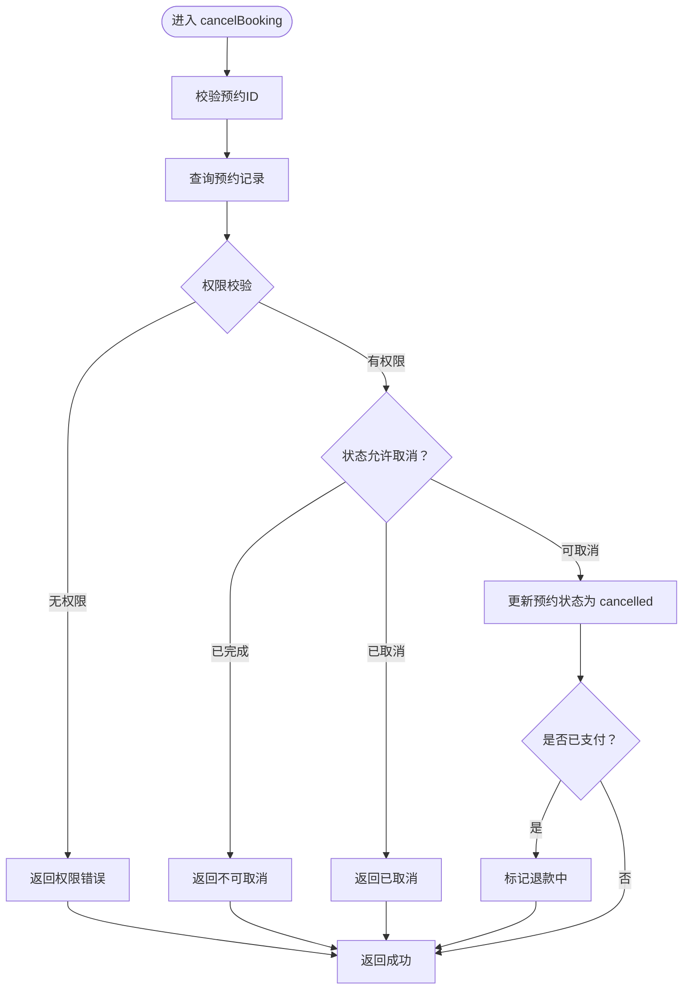

图表来源
- [miniprogram/cloudfunctions/booking/index.js:308-385](file://miniprogram/cloudfunctions/booking/index.js#L308-L385)

- 关键流程（管理员更新状态）

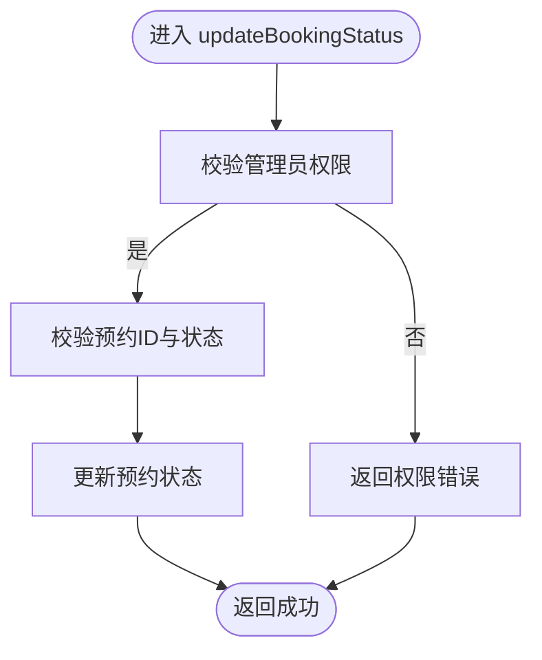

图表来源
- [miniprogram/cloudfunctions/booking/index.js:390-438](file://miniprogram/cloudfunctions/booking/index.js#L390-L438)

- 关键流程（可用时段查询）

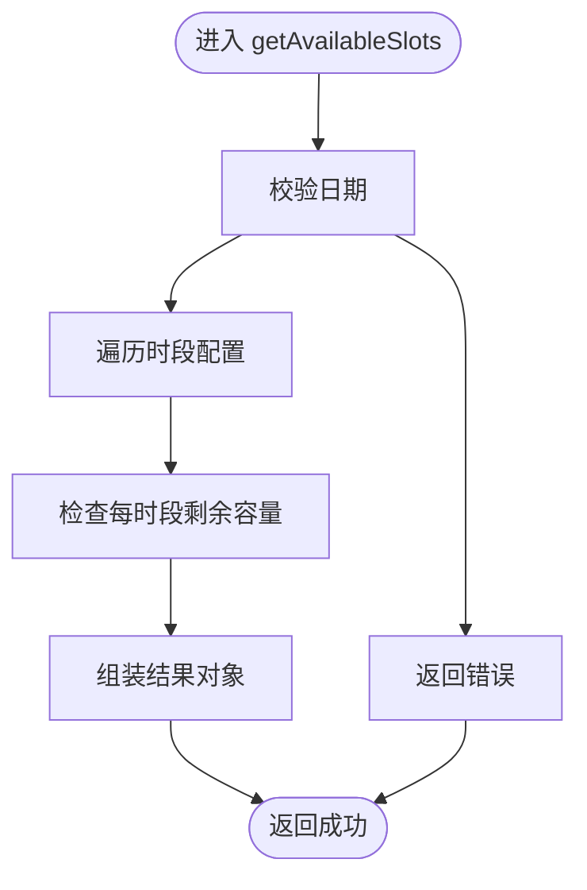

图表来源
- [miniprogram/cloudfunctions/booking/index.js:443-462](file://miniprogram/cloudfunctions/booking/index.js#L443-L462)

章节来源
- [miniprogram/cloudfunctions/booking/index.js:1-463](file://miniprogram/cloudfunctions/booking/index.js#L1-L463)

### 用户管理（user）
- 功能要点
  - 登录即注册：首次登录自动创建用户记录
  - 资料更新：昵称、头像可选更新
  - 手机号绑定：正则校验与幂等更新
  - 角色管理：仅超级管理员可提升/变更他人角色
- 关键流程（登录）

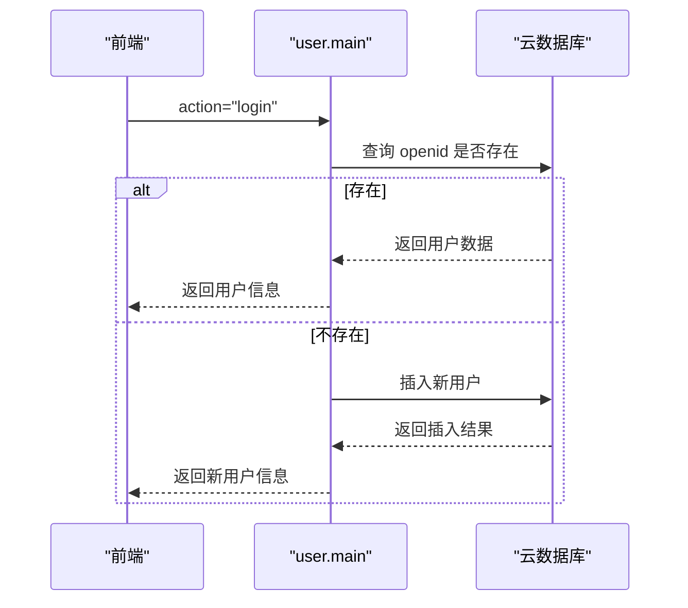

图表来源
- [miniprogram/cloudfunctions/user/index.js:34-67](file://miniprogram/cloudfunctions/user/index.js#L34-L67)

章节来源
- [miniprogram/cloudfunctions/user/index.js:1-206](file://miniprogram/cloudfunctions/user/index.js#L1-L206)

### 支付处理（payment）
- 功能要点
  - 订单创建：校验订单存在性、支付状态与归属
  - 支付成功：前端调用后端更新订单与关联预约状态（事务）
  - 回调处理：预留真实回调解析与签名验证（模拟模式下直接返回）
  - 退款：管理员权限校验，支持真实退款接口与模拟退款
  - 权限控制：非管理员仅能操作本人订单
- 关键流程（支付成功）

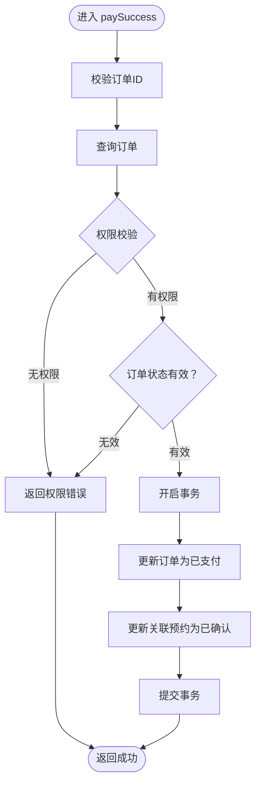

图表来源
- [miniprogram/cloudfunctions/payment/index.js:172-239](file://miniprogram/cloudfunctions/payment/index.js#L172-L239)

章节来源
- [miniprogram/cloudfunctions/payment/index.js:1-532](file://miniprogram/cloudfunctions/payment/index.js#L1-L532)

### 内容管理（gallery）
- 功能要点
  - 列表与详情：支持分类筛选、发布态过滤
  - 管理员操作：创建、更新、删除客片（删除时级联清理收藏）
  - 收藏功能：切换收藏、查询我的收藏、检查收藏状态
- 关键流程（删除客片）

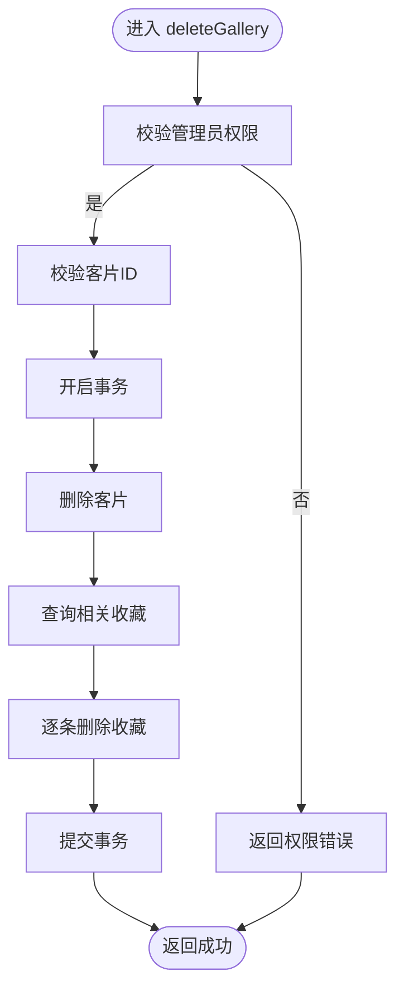

图表来源
- [miniprogram/cloudfunctions/gallery/index.js:184-225](file://miniprogram/cloudfunctions/gallery/index.js#L184-L225)

章节来源
- [miniprogram/cloudfunctions/gallery/index.js:1-360](file://miniprogram/cloudfunctions/gallery/index.js#L1-L360)

### 套餐管理（package）
- 功能要点
  - 列表与详情：支持分类筛选与状态过滤
  - 管理员操作：创建、更新、删除、上下架
- 关键流程（上下架）

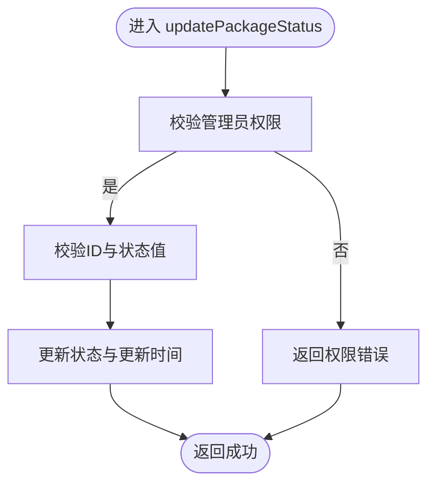

图表来源
- [miniprogram/cloudfunctions/package/index.js:189-221](file://miniprogram/cloudfunctions/package/index.js#L189-L221)

章节来源
- [miniprogram/cloudfunctions/package/index.js:1-222](file://miniprogram/cloudfunctions/package/index.js#L1-L222)

### 数据统计（stats）
- 功能要点
  - 管理员专属：今日预约数、待处理订单、本月收入、客片/预约/用户总数
  - 统计维度：各状态预约数量、近七日预约趋势
- 关键流程（概览）

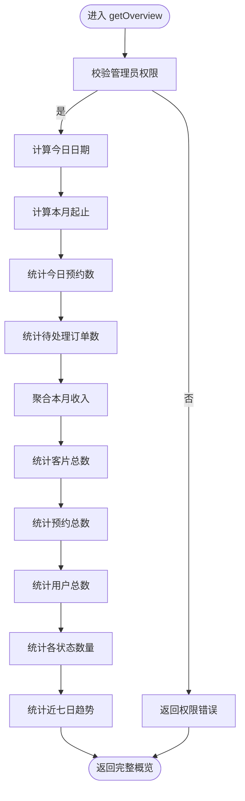

图表来源
- [miniprogram/cloudfunctions/stats/index.js:73-162](file://miniprogram/cloudfunctions/stats/index.js#L73-L162)

章节来源
- [miniprogram/cloudfunctions/stats/index.js:1-229](file://miniprogram/cloudfunctions/stats/index.js#L1-L229)

## 依赖分析
- 公共依赖
  - wx-server-sdk：所有云函数均依赖该 SDK 进行环境初始化、数据库与云支付等能力调用
- 云函数间耦合
  - 预约与订单：创建预约时同步生成订单，取消/支付成功/退款会联动更新订单状态
  - 管理员权限：多个云函数共享管理员校验逻辑，确保一致的权限控制
- 外部集成
  - 微信云开发支付：支付与退款预留真实接入点，当前以模拟模式运行

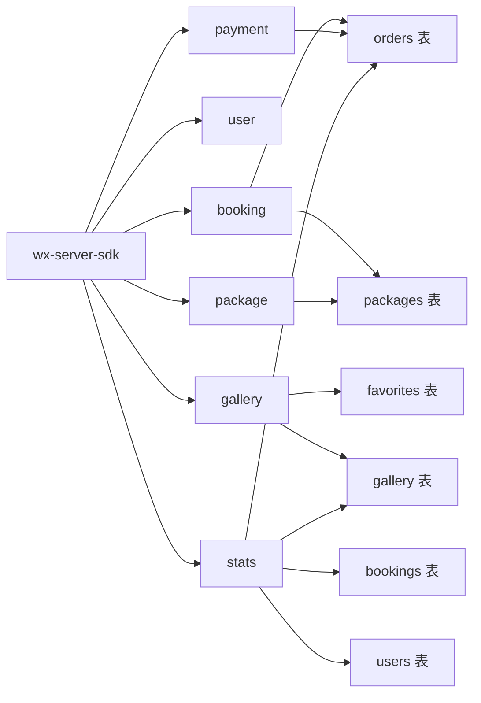

图表来源
- [miniprogram/cloudfunctions/booking/package.json:1-7](file://miniprogram/cloudfunctions/booking/package.json#L1-L7)
- [miniprogram/cloudfunctions/user/package.json:1-7](file://miniprogram/cloudfunctions/user/package.json#L1-L7)
- [miniprogram/cloudfunctions/payment/package.json:1-7](file://miniprogram/cloudfunctions/payment/package.json#L1-L7)
- [miniprogram/cloudfunctions/gallery/package.json:1-7](file://miniprogram/cloudfunctions/gallery/package.json#L1-L7)
- [miniprogram/cloudfunctions/package/package.json:1-7](file://miniprogram/cloudfunctions/package/package.json#L1-L7)
- [miniprogram/cloudfunctions/stats/package.json:1-7](file://miniprogram/cloudfunctions/stats/package.json#L1-L7)

章节来源
- [miniprogram/cloudfunctions/booking/package.json:1-7](file://miniprogram/cloudfunctions/booking/package.json#L1-L7)
- [miniprogram/cloudfunctions/user/package.json:1-7](file://miniprogram/cloudfunctions/user/package.json#L1-L7)
- [miniprogram/cloudfunctions/payment/package.json:1-7](file://miniprogram/cloudfunctions/payment/package.json#L1-L7)
- [miniprogram/cloudfunctions/gallery/package.json:1-7](file://miniprogram/cloudfunctions/gallery/package.json#L1-L7)
- [miniprogram/cloudfunctions/package/package.json:1-7](file://miniprogram/cloudfunctions/package/package.json#L1-L7)
- [miniprogram/cloudfunctions/stats/package.json:1-7](file://miniprogram/cloudfunctions/stats/package.json#L1-L7)

## 性能考量
- 查询优化
  - 合理使用 where 条件与排序索引，避免全表扫描
  - 列表分页使用 skip/limit，注意大偏移场景下的性能影响
- 事务与并发
  - 关键路径使用事务保证一致性；在高并发场景下，二次检查容量可降低冲突概率
- 聚合统计
  - 统计类接口建议缓存短期结果，减少频繁聚合查询
- 存储与网络
  - 文件上传/下载使用云存储临时链接，避免在云函数内做大量数据传输
- 日志与监控
  - 对关键错误与异常路径增加日志输出，便于定位性能瓶颈

## 故障排查指南
- 通用错误处理
  - 云函数入口统一捕获异常并返回标准结构，前端据此判断错误类型
  - 常见错误：参数缺失、权限不足、资源不存在、状态异常
- 预约相关
  - 时段已满：检查时段容量与并发保护逻辑
  - 重复取消/已完成不可取消：核对状态流转
- 支付相关
  - 模拟模式：当前为开发测试模式，真实支付需配置商户号
  - 回调与退款：预留真实接入点，需完善签名验证与幂等处理
- 内容与套餐
  - 管理员权限：确认用户角色为 admin 或 superAdmin
  - 删除级联：确认收藏表清理逻辑执行

章节来源
- [miniprogram/cloudfunctions/booking/index.js:89-92](file://miniprogram/cloudfunctions/booking/index.js#L89-L92)
- [miniprogram/cloudfunctions/user/index.js:27-30](file://miniprogram/cloudfunctions/user/index.js#L27-L30)
- [miniprogram/cloudfunctions/payment/index.js:48-51](file://miniprogram/cloudfunctions/payment/index.js#L48-L51)
- [miniprogram/cloudfunctions/gallery/index.js:26-64](file://miniprogram/cloudfunctions/gallery/index.js#L26-L64)
- [miniprogram/cloudfunctions/package/index.js:26-58](file://miniprogram/cloudfunctions/package/index.js#L26-L58)
- [miniprogram/cloudfunctions/stats/index.js:64-67](file://miniprogram/cloudfunctions/stats/index.js#L64-L67)

## 结论
lvpai 项目的云函数围绕“预约—订单—支付—内容—套餐—统计”形成闭环，具备清晰的权限控制与事务一致性保障。建议在生产环境中逐步替换模拟支付/退款为真实接入，并完善回调与退款的幂等与重试机制；同时持续优化查询与统计性能，加强日志与监控体系，以支撑业务增长。

## 附录

### 云函数与前端交互规范
- 云函数调用封装
  - 统一通过工具函数发起调用，约定返回结构 { code, message, data }
  - 前端根据 code 判断成功/失败，message 作为用户提示
- 前端常量与状态
  - 套餐分类、客片分类、预约时段、状态枚举等集中定义，便于前后端一致
- 用户状态
  - 使用 Pinia 管理登录态与管理员标识，驱动 UI 与权限控制

章节来源
- [miniprogram/src/utils/cloud.js:6-26](file://miniprogram/src/utils/cloud.js#L6-L26)
- [miniprogram/src/utils/constants.js:1-73](file://miniprogram/src/utils/constants.js#L1-L73)
- [miniprogram/src/store/user.js:1-48](file://miniprogram/src/store/user.js#L1-L48)