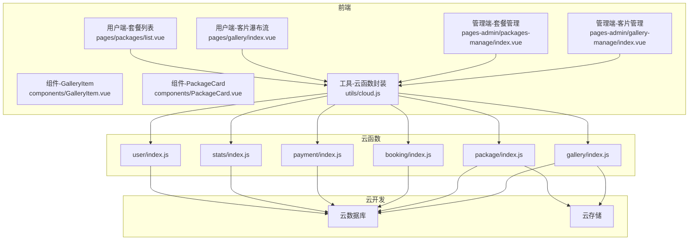
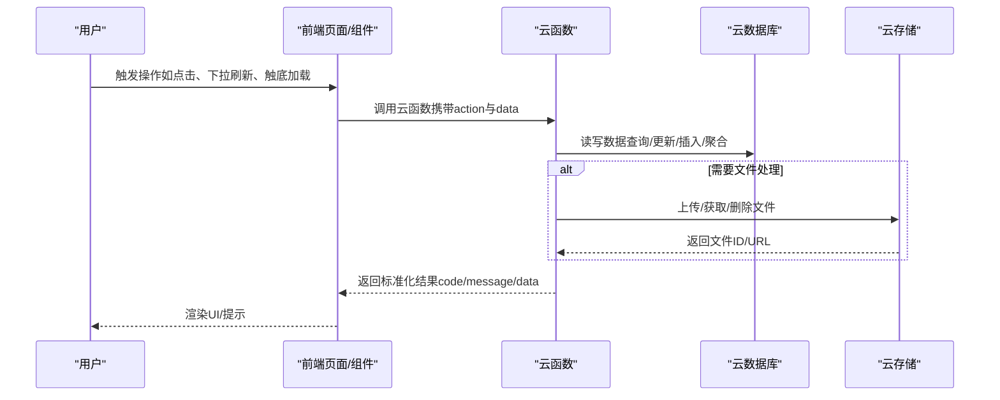
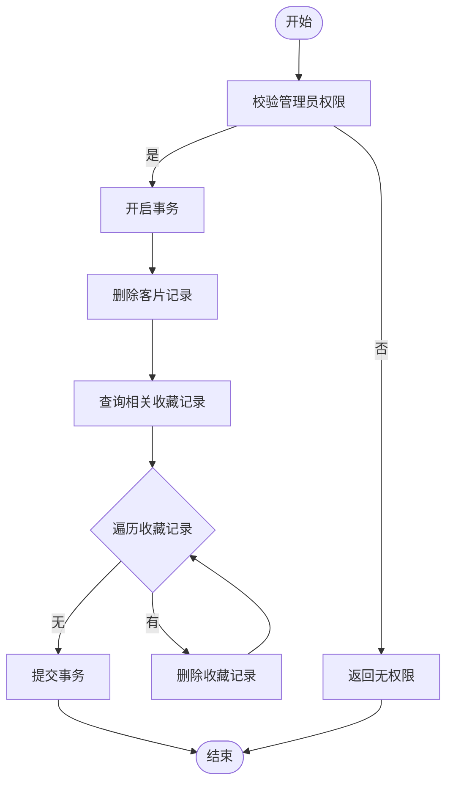
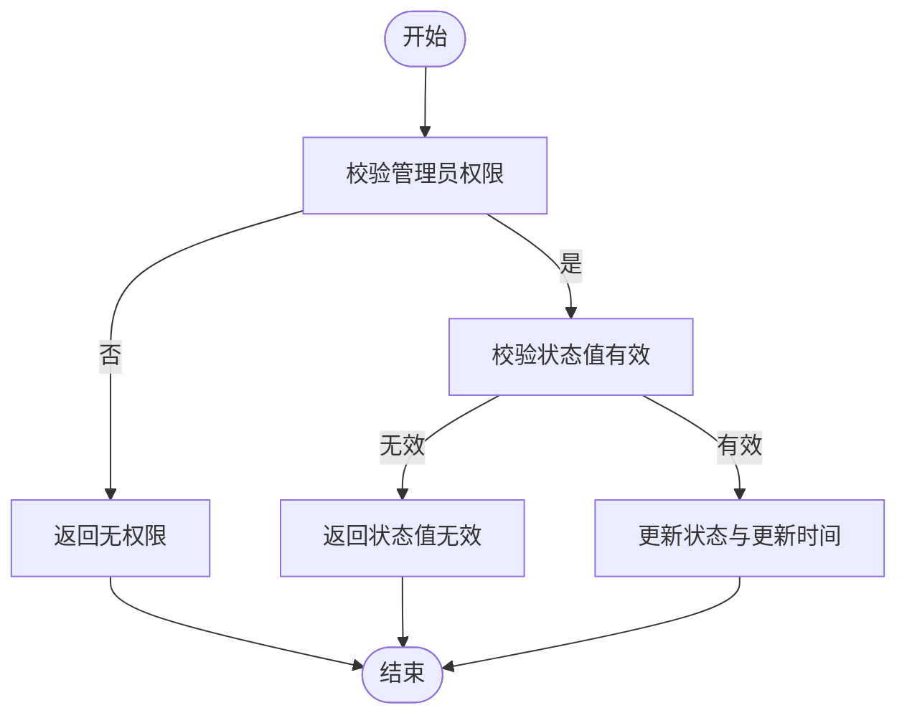
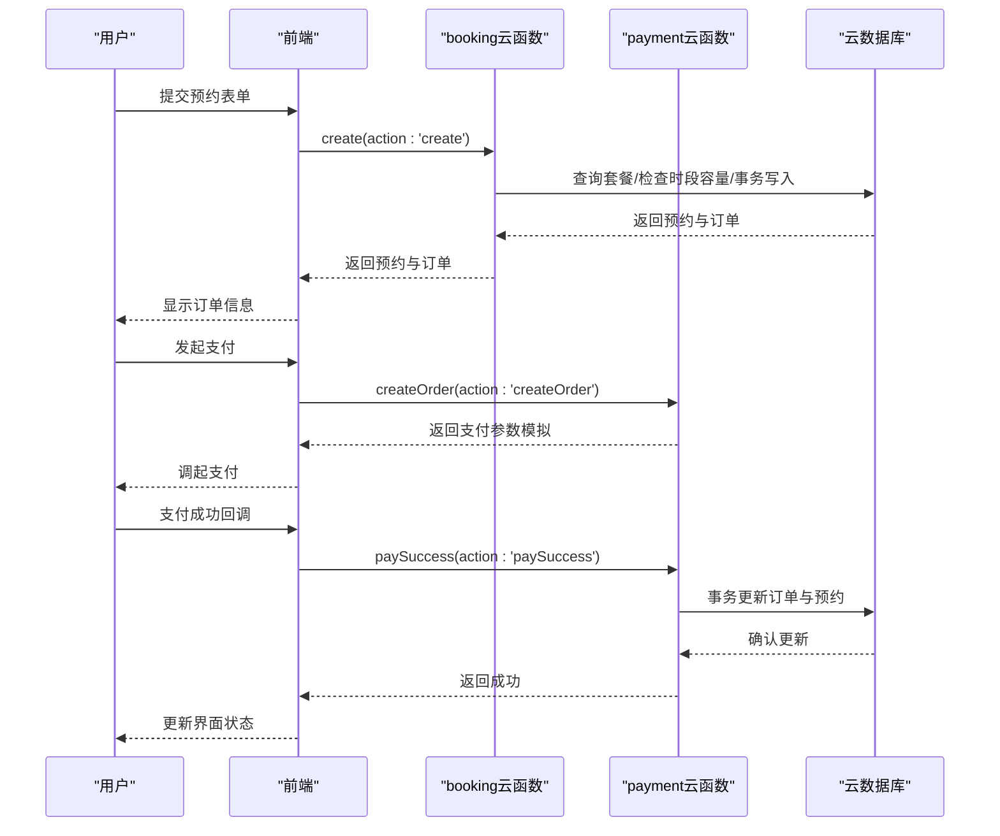
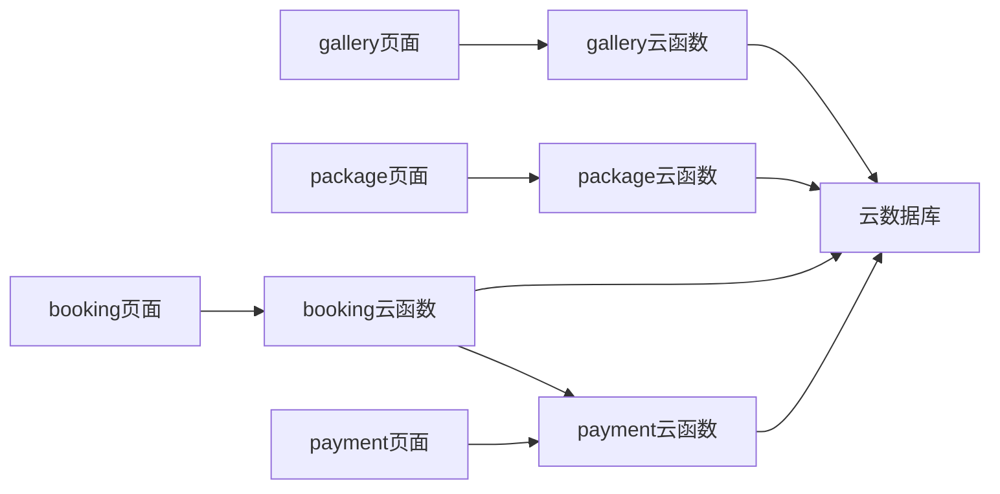

# 内容管理云函数

<cite>
**本文档引用的文件**
- [miniprogram/cloudfunctions/gallery/index.js](file://miniprogram/cloudfunctions/gallery/index.js)
- [miniprogram/cloudfunctions/package/index.js](file://miniprogram/cloudfunctions/package/index.js)
- [miniprogram/cloudfunctions/booking/index.js](file://miniprogram/cloudfunctions/booking/index.js)
- [miniprogram/cloudfunctions/payment/index.js](file://miniprogram/cloudfunctions/payment/index.js)
- [miniprogram/cloudfunctions/stats/index.js](file://miniprogram/cloudfunctions/stats/index.js)
- [miniprogram/src/pages-admin/gallery-manage/index.vue](file://miniprogram/src/pages-admin/gallery-manage/index.vue)
- [miniprogram/src/pages-admin/packages-manage/index.vue](file://miniprogram/src/pages-admin/packages-manage/index.vue)
- [miniprogram/src/pages/gallery/index.vue](file://miniprogram/src/pages/gallery/index.vue)
- [miniprogram/src/pages/packages/list.vue](file://miniprogram/src/pages/packages/list.vue)
- [miniprogram/src/components/GalleryItem.vue](file://miniprogram/src/components/GalleryItem.vue)
- [miniprogram/src/components/PackageCard.vue](file://miniprogram/src/components/PackageCard.vue)
- [miniprogram/src/utils/cloud.js](file://miniprogram/src/utils/cloud.js)
- [miniprogram/src/utils/constants.js](file://miniprogram/src/utils/constants.js)
- [miniprogram/src/utils/auth.js](file://miniprogram/src/utils/auth.js)
</cite>

## 目录
1. [简介](#简介)
2. [项目结构](#项目结构)
3. [核心组件](#核心组件)
4. [架构总览](#架构总览)
5. [详细组件分析](#详细组件分析)
6. [依赖关系分析](#依赖关系分析)
7. [性能考虑](#性能考虑)
8. [故障排查指南](#故障排查指南)
9. [结论](#结论)
10. [附录](#附录)

## 简介
本项目围绕“内容管理云函数”构建，重点覆盖客片管理与套餐管理两大模块，提供完整的 CRUD、权限控制、瀑布流展示、收藏与图片处理等能力，并与前端组件形成清晰的数据交互链路。系统采用微信云开发，通过云函数统一处理业务逻辑，前端通过封装的云函数调用工具与后端交互。

## 项目结构
- 云函数层：gallery（客片）、package（套餐）、booking（预约）、payment（支付）、stats（统计）、user（用户）
- 前端页面层：管理端（gallery-manage、packages-manage）与用户端（gallery、packages/list）
- 组件层：GalleryItem、PackageCard
- 工具层：cloud.js（云函数/云存储封装）、constants.js（常量）、auth.js（权限）

图表来源
- [miniprogram/src/pages-admin/gallery-manage/index.vue:1-524](file://miniprogram/src/pages-admin/gallery-manage/index.vue#L1-L524)
- [miniprogram/src/pages-admin/packages-manage/index.vue:1-500](file://miniprogram/src/pages-admin/packages-manage/index.vue#L1-L500)
- [miniprogram/src/pages/gallery/index.vue:1-533](file://miniprogram/src/pages/gallery/index.vue#L1-L533)
- [miniprogram/src/pages/packages/list.vue:1-305](file://miniprogram/src/pages/packages/list.vue#L1-L305)
- [miniprogram/src/components/GalleryItem.vue:1-60](file://miniprogram/src/components/GalleryItem.vue#L1-L60)
- [miniprogram/src/components/PackageCard.vue:1-100](file://miniprogram/src/components/PackageCard.vue#L1-L100)
- [miniprogram/src/utils/cloud.js:1-66](file://miniprogram/src/utils/cloud.js#L1-L66)
- [miniprogram/cloudfunctions/gallery/index.js:1-360](file://miniprogram/cloudfunctions/gallery/index.js#L1-L360)
- [miniprogram/cloudfunctions/package/index.js:1-222](file://miniprogram/cloudfunctions/package/index.js#L1-L222)
- [miniprogram/cloudfunctions/booking/index.js:1-463](file://miniprogram/cloudfunctions/booking/index.js#L1-L463)
- [miniprogram/cloudfunctions/payment/index.js:1-532](file://miniprogram/cloudfunctions/payment/index.js#L1-L532)
- [miniprogram/cloudfunctions/stats/index.js:1-229](file://miniprogram/cloudfunctions/stats/index.js#L1-L229)

章节来源
- [miniprogram/src/utils/cloud.js:1-66](file://miniprogram/src/utils/cloud.js#L1-L66)
- [miniprogram/cloudfunctions/gallery/index.js:1-360](file://miniprogram/cloudfunctions/gallery/index.js#L1-L360)
- [miniprogram/cloudfunctions/package/index.js:1-222](file://miniprogram/cloudfunctions/package/index.js#L1-L222)
- [miniprogram/cloudfunctions/booking/index.js:1-463](file://miniprogram/cloudfunctions/booking/index.js#L1-L463)
- [miniprogram/cloudfunctions/payment/index.js:1-532](file://miniprogram/cloudfunctions/payment/index.js#L1-L532)
- [miniprogram/cloudfunctions/stats/index.js:1-229](file://miniprogram/cloudfunctions/stats/index.js#L1-L229)

## 核心组件
- 客片云函数（gallery）：提供列表、详情、创建、更新、删除、收藏、我的收藏、收藏状态检查等能力；支持管理员权限校验与事务删除（级联清理收藏）
- 套餐云函数（package）：提供列表、详情、创建、更新、删除、上下架状态更新等能力；支持管理员权限校验
- 预约云函数（booking）：提供创建预约、列表、详情、取消、状态更新、可用时段查询；支持并发保护与事务一致性
- 支付云函数（payment）：提供创建支付、支付成功、回调、退款、订单查询、我的订单；提供模拟支付与退款便于开发测试
- 统计云函数（stats）：提供管理员数据概览（今日预约、待处理订单、月收入、客片/预约/用户总数、状态分布、周趋势）
- 前端组件与页面：瀑布流展示、分类筛选、收藏交互、骨架屏加载、懒加载、下拉刷新与触底加载

章节来源
- [miniprogram/cloudfunctions/gallery/index.js:26-360](file://miniprogram/cloudfunctions/gallery/index.js#L26-L360)
- [miniprogram/cloudfunctions/package/index.js:26-222](file://miniprogram/cloudfunctions/package/index.js#L26-L222)
- [miniprogram/cloudfunctions/booking/index.js:67-463](file://miniprogram/cloudfunctions/booking/index.js#L67-L463)
- [miniprogram/cloudfunctions/payment/index.js:26-532](file://miniprogram/cloudfunctions/payment/index.js#L26-L532)
- [miniprogram/cloudfunctions/stats/index.js:52-229](file://miniprogram/cloudfunctions/stats/index.js#L52-L229)
- [miniprogram/src/pages/gallery/index.vue:100-283](file://miniprogram/src/pages/gallery/index.vue#L100-L283)
- [miniprogram/src/pages/packages/list.vue:57-131](file://miniprogram/src/pages/packages/list.vue#L57-L131)

## 架构总览
系统采用“前端-云函数-云数据库/云存储”的三层架构。前端通过封装的云函数调用工具发起请求，云函数进行权限校验、业务处理与数据持久化，必要时使用事务保证一致性，最终返回标准化响应。

图表来源
- [miniprogram/src/utils/cloud.js:5-26](file://miniprogram/src/utils/cloud.js#L5-L26)
- [miniprogram/cloudfunctions/gallery/index.js:26-64](file://miniprogram/cloudfunctions/gallery/index.js#L26-L64)
- [miniprogram/cloudfunctions/package/index.js:26-58](file://miniprogram/cloudfunctions/package/index.js#L26-L58)
- [miniprogram/cloudfunctions/booking/index.js:67-93](file://miniprogram/cloudfunctions/booking/index.js#L67-L93)
- [miniprogram/cloudfunctions/payment/index.js:26-52](file://miniprogram/cloudfunctions/payment/index.js#L26-L52)

## 详细组件分析

### 客片管理（gallery 云函数）
- 功能要点
  - 列表：支持分类筛选、分页、按创建时间倒序；用户端仅返回已发布状态
  - 详情：按ID查询客片详情
  - 管理员操作：创建、更新、删除（含事务删除收藏记录）
  - 收藏：切换收藏状态，原子性增减点赞数
  - 我的收藏：分页查询收藏记录并联表获取已发布客片
  - 收藏状态检查
- 关键流程（删除客片）

图表来源
- [miniprogram/cloudfunctions/gallery/index.js:184-225](file://miniprogram/cloudfunctions/gallery/index.js#L184-L225)

- 前端瀑布流展示
  - 分类标签切换、下拉刷新、触底加载、懒加载、收藏按钮、预览图片
  - 收藏状态通过“我的收藏”接口一次性拉取并缓存，避免逐条查询
- 关键交互
  - 列表加载：callFunction('gallery', { action: 'list', data })
  - 收藏切换：callFunction('gallery', { action: 'favorite', galleryId })
  - 我的收藏：callFunction('gallery', { action: 'myFavorites' })

章节来源
- [miniprogram/cloudfunctions/gallery/index.js:66-360](file://miniprogram/cloudfunctions/gallery/index.js#L66-L360)
- [miniprogram/src/pages/gallery/index.vue:100-283](file://miniprogram/src/pages/gallery/index.vue#L100-L283)
- [miniprogram/src/components/GalleryItem.vue:1-60](file://miniprogram/src/components/GalleryItem.vue#L1-L60)

### 套餐管理（package 云函数）
- 功能要点
  - 列表：支持分类筛选、按排序字段升序；用户端仅返回上架状态
  - 详情：按ID查询套餐详情
  - 管理员操作：创建、更新、删除、上下架状态更新
- 关键流程（上下架）

图表来源
- [miniprogram/cloudfunctions/package/index.js:189-221](file://miniprogram/cloudfunctions/package/index.js#L189-L221)

- 前端管理端
  - 列表展示、上下架开关、编辑/删除弹窗、下拉刷新与触底加载
  - 上下架：callFunction('package', { action: 'updateStatus', data: { id, status } })
- 前端用户端
  - 分类标签切换、骨架屏加载、套餐卡片展示

章节来源
- [miniprogram/cloudfunctions/package/index.js:60-222](file://miniprogram/cloudfunctions/package/index.js#L60-L222)
- [miniprogram/src/pages-admin/packages-manage/index.vue:1-500](file://miniprogram/src/pages-admin/packages-manage/index.vue#L1-L500)
- [miniprogram/src/pages/packages/list.vue:57-131](file://miniprogram/src/pages/packages/list.vue#L57-L131)
- [miniprogram/src/components/PackageCard.vue:1-100](file://miniprogram/src/components/PackageCard.vue#L1-L100)

### 预约与支付（booking/payment 云函数）
- 预约流程
  - 创建预约：校验必填项、时段容量、并发保护（二次检查）、事务创建预约与订单
  - 取消预约：权限校验、状态限制、关联订单退款标记
  - 管理员状态更新：校验状态集合
  - 可用时段查询：按日期查询各时段剩余容量
- 支付流程
  - 创建支付：校验订单与权限，返回模拟支付参数（开发测试）
  - 支付成功：前端调用，事务更新订单与预约状态
  - 退款：管理员权限校验，模拟退款（开发测试）
  - 订单查询与我的订单：支持按ID或订单号查询，支持分页

图表来源
- [miniprogram/cloudfunctions/booking/index.js:98-206](file://miniprogram/cloudfunctions/booking/index.js#L98-L206)
- [miniprogram/cloudfunctions/payment/index.js:65-166](file://miniprogram/cloudfunctions/payment/index.js#L65-L166)
- [miniprogram/cloudfunctions/payment/index.js:172-239](file://miniprogram/cloudfunctions/payment/index.js#L172-L239)

章节来源
- [miniprogram/cloudfunctions/booking/index.js:67-463](file://miniprogram/cloudfunctions/booking/index.js#L67-L463)
- [miniprogram/cloudfunctions/payment/index.js:26-532](file://miniprogram/cloudfunctions/payment/index.js#L26-L532)

### 统计与权限（stats/auth）
- 统计概览：管理员可见，包含今日预约、待处理订单、月收入、客片/预约/用户总数、状态分布、周趋势
- 权限工具：登录、获取用户信息、判断管理员/超级管理员、会话检查

章节来源
- [miniprogram/cloudfunctions/stats/index.js:52-229](file://miniprogram/cloudfunctions/stats/index.js#L52-L229)
- [miniprogram/src/utils/auth.js:1-47](file://miniprogram/src/utils/auth.js#L1-L47)

## 依赖关系分析
- 云函数间耦合
  - booking 与 payment：通过订单ID建立关联，支付成功联动更新预约状态
  - gallery 与 package：无直接依赖，分别服务于内容展示与预约入口
- 前端与云函数
  - 所有页面通过 utils/cloud.js 的 callFunction 统一调用，降低耦合
- 数据一致性
  - gallery 删除使用事务，确保客片与收藏记录一致删除
  - booking 创建使用事务，确保预约与订单同时写入
  - payment 成功/退款使用事务，确保订单与预约状态一致

图表来源
- [miniprogram/src/utils/cloud.js:5-26](file://miniprogram/src/utils/cloud.js#L5-L26)
- [miniprogram/cloudfunctions/gallery/index.js:26-64](file://miniprogram/cloudfunctions/gallery/index.js#L26-L64)
- [miniprogram/cloudfunctions/package/index.js:26-58](file://miniprogram/cloudfunctions/package/index.js#L26-L58)
- [miniprogram/cloudfunctions/booking/index.js:67-93](file://miniprogram/cloudfunctions/booking/index.js#L67-L93)
- [miniprogram/cloudfunctions/payment/index.js:26-52](file://miniprogram/cloudfunctions/payment/index.js#L26-L52)

章节来源
- [miniprogram/src/utils/cloud.js:1-66](file://miniprogram/src/utils/cloud.js#L1-L66)
- [miniprogram/cloudfunctions/booking/index.js:150-206](file://miniprogram/cloudfunctions/booking/index.js#L150-L206)
- [miniprogram/cloudfunctions/payment/index.js:203-239](file://miniprogram/cloudfunctions/payment/index.js#L203-L239)

## 性能考虑
- 分页与懒加载
  - 前端瀑布流采用分页加载与懒加载，减少首屏压力
  - 客片列表默认每页10条，支持下拉刷新与触底加载
- 缓存与复用
  - “我的收藏”一次性拉取并缓存收藏ID集合，避免逐条查询
- 事务与并发
  - gallery 删除与 booking 创建均使用事务，保证一致性
  - booking 创建在事务内再次检查容量，防止超卖
- 存储与CDN
  - 图片上传至云存储，前端通过临时链接或直链展示；建议在小程序后台配置CDN加速以提升首帧速度
- 前端渲染
  - 套餐列表使用骨架屏，提升感知性能
  - 瀑布流双列布局减少滚动抖动

章节来源
- [miniprogram/src/pages/gallery/index.vue:116-283](file://miniprogram/src/pages/gallery/index.vue#L116-L283)
- [miniprogram/src/pages/packages/list.vue:25-131](file://miniprogram/src/pages/packages/list.vue#L25-L131)
- [miniprogram/cloudfunctions/booking/index.js:150-206](file://miniprogram/cloudfunctions/booking/index.js#L150-L206)
- [miniprogram/cloudfunctions/gallery/index.js:198-225](file://miniprogram/cloudfunctions/gallery/index.js#L198-L225)

## 故障排查指南
- 通用错误码
  - code: 0 表示成功；非0表示错误，message包含具体原因
- 常见问题定位
  - 权限不足：管理员校验失败（如非管理员调用创建/删除/上下架）
  - 参数缺失：必填字段为空（如创建预约缺少套餐、日期、时段、联系人等）
  - 数据不存在：查询ID对应的客片/套餐/订单不存在
  - 并发冲突：预约时段已满或重复取消
- 排查步骤
  - 检查前端调用参数与云函数入参匹配
  - 查看云函数日志与数据库状态
  - 对涉及事务的接口（删除、创建预约、支付成功）核对事务提交/回滚路径
- 建议
  - 在开发阶段使用 payment 的模拟支付/退款，避免真实交易风险
  - 对外暴露的云函数增加必要的输入校验与边界检查

章节来源
- [miniprogram/cloudfunctions/gallery/index.js:127-132](file://miniprogram/cloudfunctions/gallery/index.js#L127-L132)
- [miniprogram/cloudfunctions/booking/index.js:98-118](file://miniprogram/cloudfunctions/booking/index.js#L98-L118)
- [miniprogram/cloudfunctions/payment/index.js:65-93](file://miniprogram/cloudfunctions/payment/index.js#L65-L93)

## 结论
本项目通过云函数实现了内容管理的核心闭环：客片与套餐的管理、预约与支付的协同、统计与权限的支撑。前端采用瀑布流与骨架屏优化用户体验，云函数层面通过权限校验与事务保障数据一致性。建议后续在生产环境完善云存储CDN配置与支付回调处理，持续优化前端懒加载与图片压缩策略。

## 附录
- 常量与配置
  - 分类、时段、状态、价格等常量集中于 constants.js
  - 前端通过组件化复用（GalleryItem、PackageCard）提升维护性
- 最佳实践
  - 优先使用云函数封装复杂逻辑，前端保持薄层
  - 对关键路径（创建预约、支付成功、删除客片）进行充分的边界与并发测试
  - 对外开放的云函数需严格校验入参与权限

章节来源
- [miniprogram/src/utils/constants.js:1-73](file://miniprogram/src/utils/constants.js#L1-L73)
- [miniprogram/src/components/GalleryItem.vue:1-60](file://miniprogram/src/components/GalleryItem.vue#L1-L60)
- [miniprogram/src/components/PackageCard.vue:1-100](file://miniprogram/src/components/PackageCard.vue#L1-L100)