# 支付处理云函数

<cite>
**本文档引用的文件**
- [payment/index.js](file://miniprogram/cloudfunctions/payment/index.js)
- [payment/package.json](file://miniprogram/cloudfunctions/payment/package.json)
- [booking/index.js](file://miniprogram/cloudfunctions/booking/index.js)
- [payment/index.vue](file://miniprogram/src/pages/payment/index.vue)
- [payment/result.vue](file://miniprogram/src/pages/payment/result.vue)
- [cloud.js](file://miniprogram/src/utils/cloud.js)
- [constants.js](file://miniprogram/src/utils/constants.js)
</cite>

## 目录
1. [简介](#简介)
2. [项目结构](#项目结构)
3. [核心组件](#核心组件)
4. [架构概览](#架构概览)
5. [详细组件分析](#详细组件分析)
6. [依赖关系分析](#依赖关系分析)
7. [性能考虑](#性能考虑)
8. [故障排除指南](#故障排除指南)
9. [结论](#结论)

## 简介

本项目是一个基于微信小程序云开发的旅拍服务系统，其中支付处理云函数是整个系统的核心组件之一。该系统实现了完整的支付流程，包括订单创建、支付状态管理、退款处理等功能，并提供了模拟支付模式以便于开发和测试。

支付处理云函数主要负责：
- 订单支付状态管理
- 支付回调处理
- 退款操作
- 订单查询和列表管理
- 管理员权限控制

## 项目结构

该项目采用前后端分离的架构设计，支付功能由云函数和前端页面共同组成：

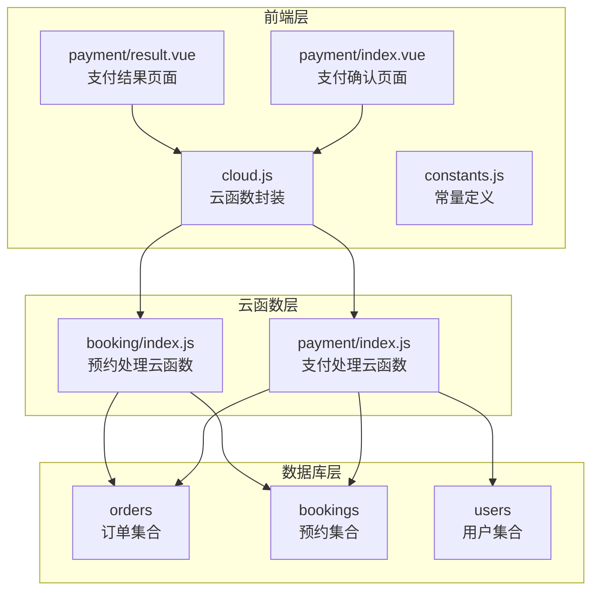

**图表来源**
- [payment/index.js:1-532](file://miniprogram/cloudfunctions/payment/index.js#L1-L532)
- [booking/index.js:1-200](file://miniprogram/cloudfunctions/booking/index.js#L1-L200)

**章节来源**
- [payment/index.js:1-532](file://miniprogram/cloudfunctions/payment/index.js#L1-L532)
- [booking/index.js:1-200](file://miniprogram/cloudfunctions/booking/index.js#L1-L200)

## 核心组件

支付处理云函数包含以下核心组件：

### 1. 支付订单管理模块
- 订单创建和验证
- 支付状态更新
- 订单查询和列表管理

### 2. 支付回调处理模块
- 微信支付回调接收
- 支付状态验证
- 订单状态同步

### 3. 退款处理模块
- 管理员权限验证
- 退款状态更新
- 退款流程控制

### 4. 数据库操作模块
- 事务处理
- 数据一致性保证
- 权限控制

**章节来源**
- [payment/index.js:26-52](file://miniprogram/cloudfunctions/payment/index.js#L26-L52)
- [payment/index.js:65-166](file://miniprogram/cloudfunctions/payment/index.js#L65-L166)
- [payment/index.js:172-239](file://miniprogram/cloudfunctions/payment/index.js#L172-L239)
- [payment/index.js:338-450](file://miniprogram/cloudfunctions/payment/index.js#L338-L450)

## 架构概览

支付系统的整体架构采用事件驱动的设计模式：

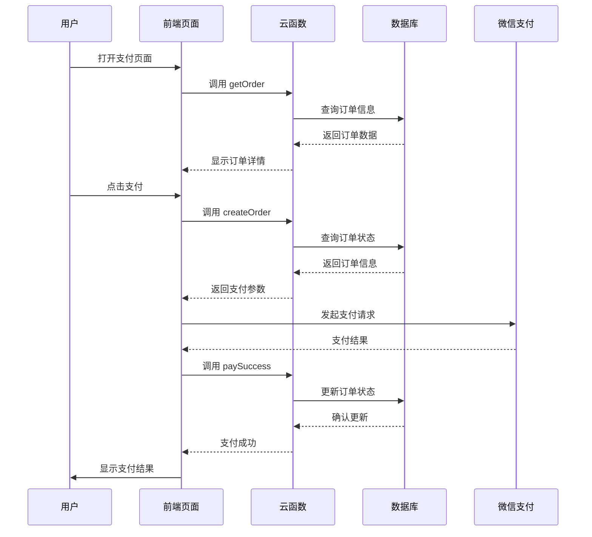

**图表来源**
- [payment/index.vue:210-247](file://miniprogram/src/pages/payment/index.vue#L210-L247)
- [payment/index.js:65-166](file://miniprogram/cloudfunctions/payment/index.js#L65-L166)
- [payment/index.js:172-239](file://miniprogram/cloudfunctions/payment/index.js#L172-L239)

## 详细组件分析

### 支付订单数据模型

支付系统采用文档型数据库设计，主要包含以下数据模型：

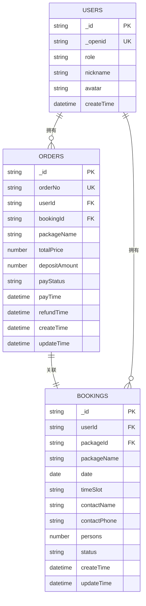

**图表来源**
- [booking/index.js:174-190](file://miniprogram/cloudfunctions/booking/index.js#L174-L190)
- [booking/index.js:134-148](file://miniprogram/cloudfunctions/booking/index.js#L134-L148)

#### 支付状态流转图

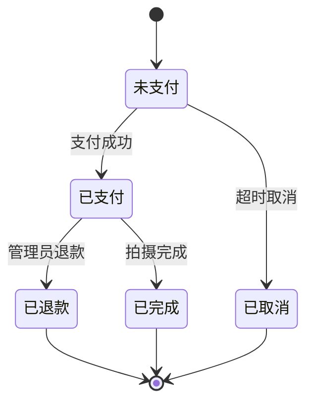

**图表来源**
- [constants.js:39-44](file://miniprogram/src/utils/constants.js#L39-L44)

### 支付流程实现

#### 统一下单接口调用

支付云函数提供了完整的统一下单接口调用流程：

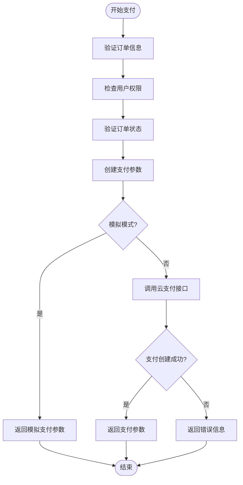

**图表来源**
- [payment/index.js:65-166](file://miniprogram/cloudfunctions/payment/index.js#L65-L166)

#### 支付回调处理机制

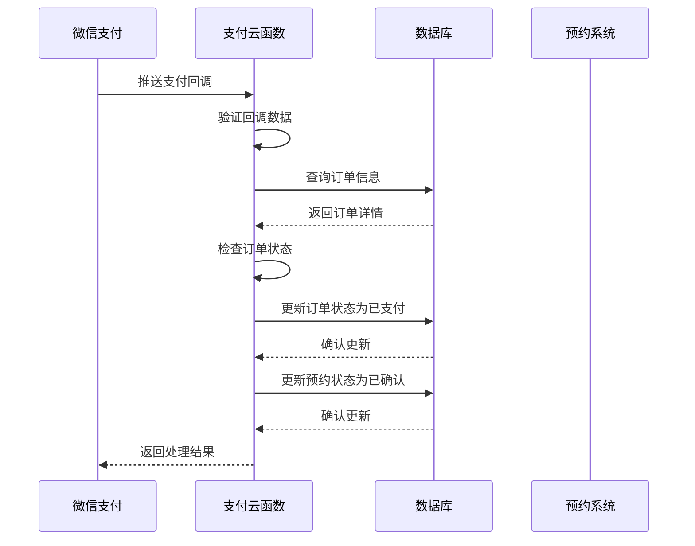

**图表来源**
- [payment/index.js:253-327](file://miniprogram/cloudfunctions/payment/index.js#L253-L327)

### 退款处理实现

#### 退款流程控制

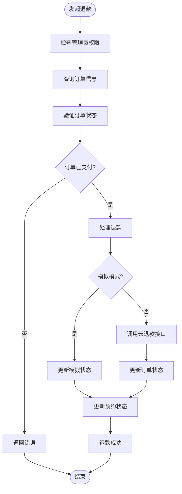

**图表来源**
- [payment/index.js:338-450](file://miniprogram/cloudfunctions/payment/index.js#L338-L450)

### 前端支付页面交互

#### 支付页面状态管理

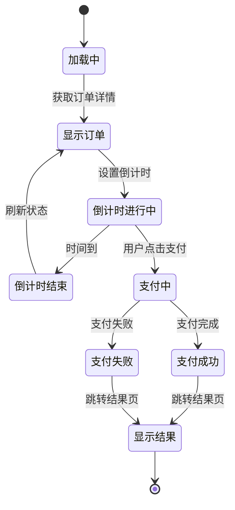

**图表来源**
- [payment/index.vue:131-172](file://miniprogram/src/pages/payment/index.vue#L131-L172)

**章节来源**
- [payment/index.js:65-166](file://miniprogram/cloudfunctions/payment/index.js#L65-L166)
- [payment/index.js:172-239](file://miniprogram/cloudfunctions/payment/index.js#L172-L239)
- [payment/index.js:253-327](file://miniprogram/cloudfunctions/payment/index.js#L253-L327)
- [payment/index.js:338-450](file://miniprogram/cloudfunctions/payment/index.js#L338-L450)
- [payment/index.vue:131-172](file://miniprogram/src/pages/payment/index.vue#L131-L172)

## 依赖关系分析

### 外部依赖

支付系统主要依赖以下外部组件：

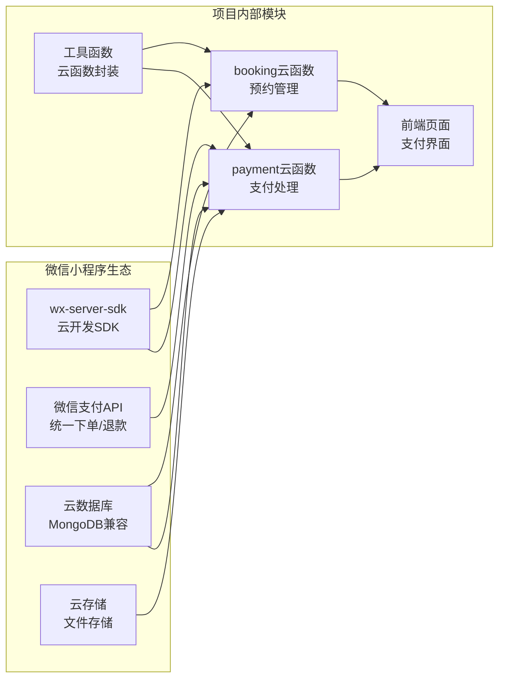

**图表来源**
- [payment/package.json:1-7](file://miniprogram/cloudfunctions/payment/package.json#L1-L7)
- [payment/index.js:1-5](file://miniprogram/cloudfunctions/payment/index.js#L1-L5)

### 内部模块依赖

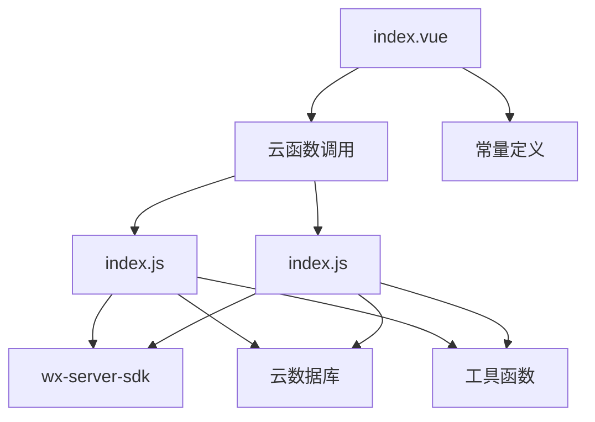

**图表来源**
- [payment/index.js:1-5](file://miniprogram/cloudfunctions/payment/index.js#L1-L5)
- [booking/index.js:1-5](file://miniprogram/cloudfunctions/booking/index.js#L1-L5)

**章节来源**
- [payment/package.json:1-7](file://miniprogram/cloudfunctions/payment/package.json#L1-L7)
- [payment/index.js:1-5](file://miniprogram/cloudfunctions/payment/index.js#L1-L5)
- [booking/index.js:1-5](file://miniprogram/cloudfunctions/booking/index.js#L1-L5)

## 性能考虑

### 数据库查询优化

1. **索引设计**
   - 订单号(orderNo)：唯一索引，用于快速查询
   - 用户ID(userId)：普通索引，用于用户订单查询
   - 创建时间(createTime)：索引，用于排序和分页

2. **查询优化策略**
   - 使用`limit(1)`限制单条记录查询
   - 合理使用where条件过滤
   - 避免N+1查询问题

### 事务处理优化

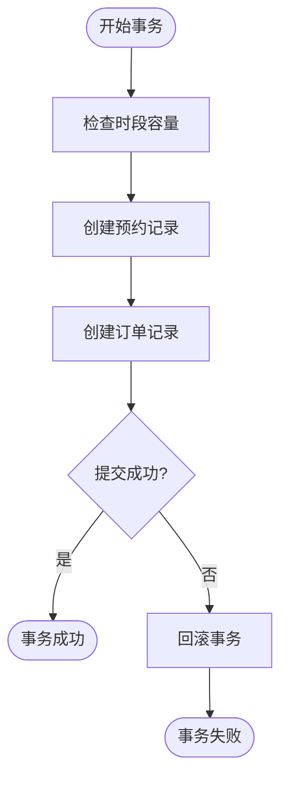

**图表来源**
- [booking/index.js:150-193](file://miniprogram/cloudfunctions/booking/index.js#L150-L193)

### 缓存策略

虽然当前实现未使用缓存，但建议在生产环境中考虑：
- 订单状态缓存
- 用户信息缓存
- 套餐价格缓存

## 故障排除指南

### 常见问题及解决方案

#### 支付参数生成失败

**问题描述**：创建支付订单时返回错误

**可能原因**：
1. 订单不存在或已被删除
2. 用户权限不足
3. 订单状态异常

**解决方案**：
```javascript
// 检查订单存在性
const { data: orders } = await db.collection('orders')
  .where({ _id: orderId })
  .limit(1)
  .get()

if (orders.length === 0) {
  return { code: -1, message: '订单不存在' }
}
```

#### 支付回调处理异常

**问题描述**：微信支付回调无法正常处理

**可能原因**：
1. 回调数据格式不正确
2. 订单状态已更新
3. 数据库连接异常

**解决方案**：
```javascript
// 添加详细的错误日志
try {
  // 处理回调逻辑
} catch (err) {
  console.error('支付回调处理失败:', err)
  console.error('回调数据:', JSON.stringify(data))
  return { code: 'FAIL', message: '处理失败' }
}
```

#### 退款处理失败

**问题描述**：退款操作无法完成

**可能原因**：
1. 订单状态不是已支付
2. 管理员权限验证失败
3. 退款金额不匹配

**解决方案**：
```javascript
// 严格的状态检查
if (order.payStatus !== 'paid') {
  return { code: -1, message: '订单未支付，无法退款' }
}

// 管理员权限验证
const isAdminRole = await checkAdmin(OPENID)
if (!isAdminRole) {
  return { code: -1, message: '无权限执行此操作' }
}
```

**章节来源**
- [payment/index.js:78-92](file://miniprogram/cloudfunctions/payment/index.js#L78-L92)
- [payment/index.js:253-327](file://miniprogram/cloudfunctions/payment/index.js#L253-L327)
- [payment/index.js:338-450](file://miniprogram/cloudfunctions/payment/index.js#L338-L450)

## 结论

支付处理云函数为旅拍小程序系统提供了完整的支付解决方案。通过模块化的架构设计，系统实现了：

1. **完整的支付流程**：从订单创建到支付完成的全流程支持
2. **灵活的部署模式**：支持模拟支付和真实支付两种模式
3. **强大的权限控制**：基于角色的访问控制和数据权限管理
4. **可靠的事务处理**：确保数据一致性和业务逻辑正确性
5. **良好的扩展性**：清晰的代码结构便于后续功能扩展

系统的主要优势包括：
- 清晰的职责分离和模块化设计
- 完善的错误处理和异常恢复机制
- 详细的日志记录和调试支持
- 灵活的配置选项和部署模式

未来可以考虑的改进方向：
- 集成更完善的支付安全验证机制
- 添加支付防重放攻击的令牌系统
- 实现更丰富的支付状态监控和告警
- 优化性能和扩展性以支持更大规模的并发访问