# 数据分析统计云函数

<cite>
**本文档引用的文件**
- [stats/index.js](file://miniprogram/cloudfunctions/stats/index.js)
- [stats/package.json](file://miniprogram/cloudfunctions/stats/package.json)
- [booking/index.js](file://miniprogram/cloudfunctions/booking/index.js)
- [payment/index.js](file://miniprogram/cloudfunctions/payment/index.js)
- [user/index.js](file://miniprogram/cloudfunctions/user/index.js)
- [package/index.js](file://miniprogram/cloudfunctions/package/index.js)
- [gallery/index.js](file://miniprogram/cloudfunctions/gallery/index.js)
- [dashboard/index.vue](file://miniprogram/src/pages-admin/dashboard/index.vue)
- [cloud.js](file://miniprogram/src/utils/cloud.js)
- [project.config.json](file://miniprogram/project.config.json)
</cite>

## 目录
1. [简介](#简介)
2. [项目结构](#项目结构)
3. [核心组件](#核心组件)
4. [架构概览](#架构概览)
5. [详细组件分析](#详细组件分析)
6. [依赖关系分析](#依赖关系分析)
7. [性能考虑](#性能考虑)
8. [故障排除指南](#故障排除指南)
9. [结论](#结论)

## 简介

这是一个基于微信小程序云开发的旅拍摄影服务平台，专注于数据分析统计云函数的实现。系统通过云函数提供预约统计、收入统计、用户行为分析和趋势预测等核心功能，为后台管理系统提供实时数据支撑。

该系统采用模块化设计，包含预约管理、支付处理、用户管理、套餐管理和客片管理等多个功能模块，所有统计分析都通过专门的统计云函数统一处理，确保数据的一致性和准确性。

## 项目结构

项目采用前后端分离的架构设计，主要分为以下层次：

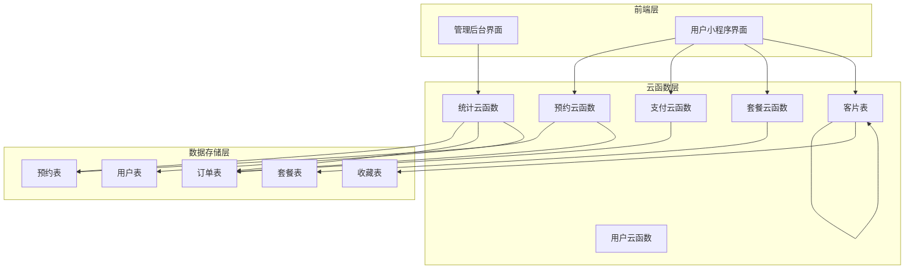

**图表来源**
- [stats/index.js:1-229](file://miniprogram/cloudfunctions/stats/index.js#L1-L229)
- [booking/index.js:1-463](file://miniprogram/cloudfunctions/booking/index.js#L1-L463)
- [payment/index.js:1-532](file://miniprogram/cloudfunctions/payment/index.js#L1-L532)

**章节来源**
- [project.config.json:1-21](file://miniprogram/project.config.json#L1-L21)

## 核心组件

### 统计云函数核心功能

统计云函数是整个系统的核心组件，负责提供全面的数据分析和报表生成功能：

#### 主要统计指标
- **今日预约数**: 实时统计当天有效预约数量
- **待处理订单**: 统计已支付但未完成的预约数量
- **本月收入**: 计算指定月份内的总收入（定金总额）
- **累计客片**: 统计所有客片总数
- **累计预约**: 统计历史总预约数量
- **总用户数**: 统计平台注册用户总数

#### 高级分析功能
- **预约状态分布**: 统计各状态（待确认、已确认、拍摄中、后期、已完成、已取消）的预约数量
- **7天预约趋势**: 展示最近一周的预约量变化趋势
- **实时数据更新**: 支持动态环境下的实时数据统计

**章节来源**
- [stats/index.js:52-162](file://miniprogram/cloudfunctions/stats/index.js#L52-L162)

### 权限控制机制

系统实现了严格的权限控制体系：

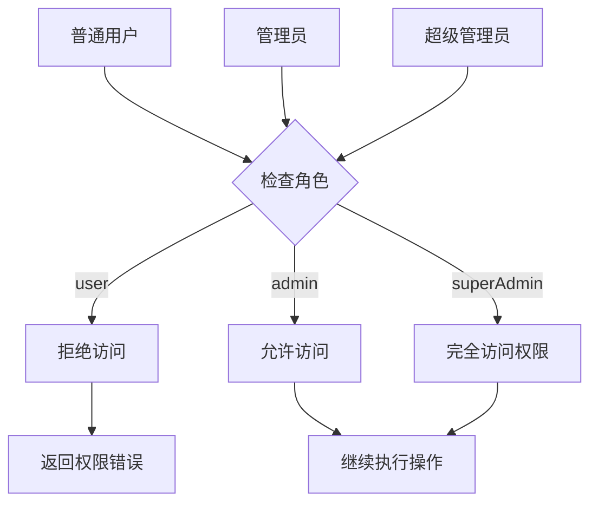

**图表来源**
- [stats/index.js:11-25](file://miniprogram/cloudfunctions/stats/index.js#L11-L25)
- [user/index.js:156-205](file://miniprogram/cloudfunctions/user/index.js#L156-L205)

**章节来源**
- [stats/index.js:73-78](file://miniprogram/cloudfunctions/stats/index.js#L73-L78)

## 架构概览

系统采用微服务架构，每个云函数独立处理特定业务领域：

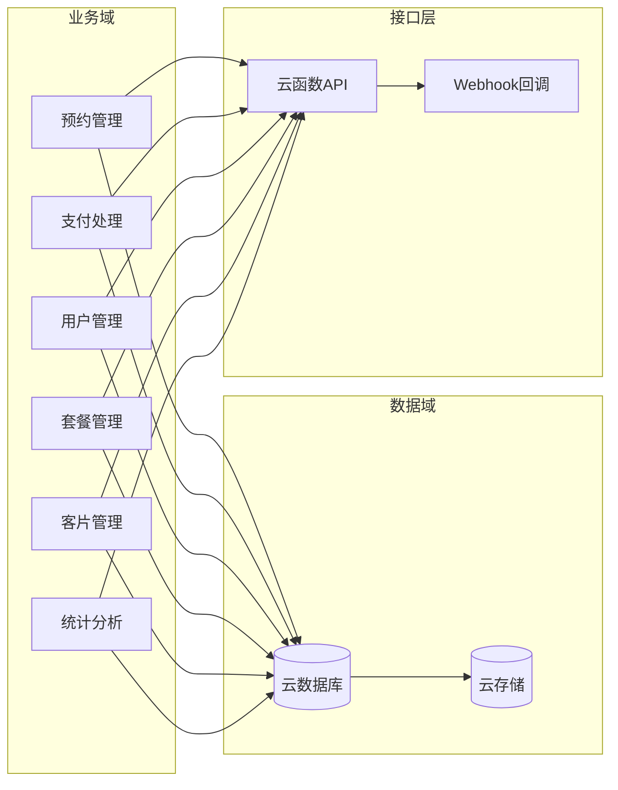

**图表来源**
- [stats/index.js:1-229](file://miniprogram/cloudfunctions/stats/index.js#L1-L229)
- [booking/index.js:1-463](file://miniprogram/cloudfunctions/booking/index.js#L1-L463)

## 详细组件分析

### 统计云函数详细实现

#### 数据概览统计流程

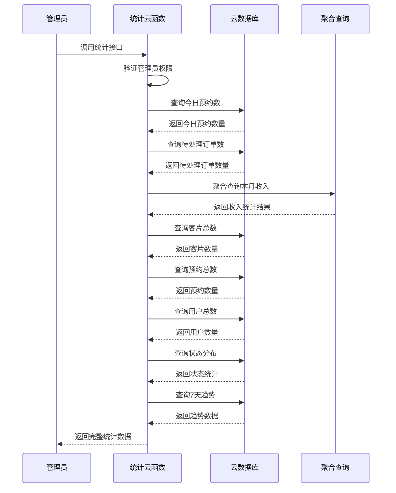

**图表来源**
- [stats/index.js:73-162](file://miniprogram/cloudfunctions/stats/index.js#L73-L162)

#### 收入统计聚合查询

统计云函数使用MongoDB聚合管道进行高效的数据聚合：

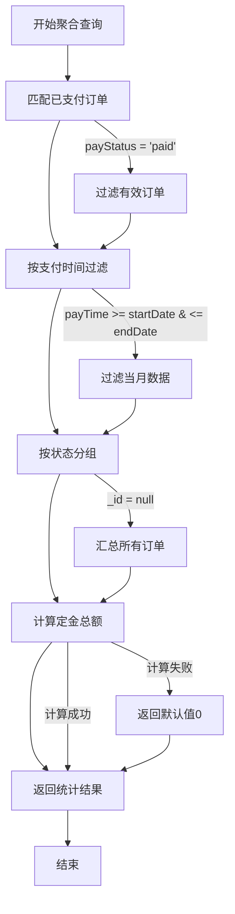

**图表来源**
- [stats/index.js:100-121](file://miniprogram/cloudfunctions/stats/index.js#L100-L121)

**章节来源**
- [stats/index.js:73-162](file://miniprogram/cloudfunctions/stats/index.js#L73-L162)

### 预约统计实现

#### 预约状态管理

系统实现了完整的预约生命周期管理：

| 状态 | 描述 | 业务含义 |
|------|------|----------|
| pending | 待确认 | 用户已预约但等待确认 |
| confirmed | 已确认 | 管理员已确认预约 |
| shooting | 拍摄中 | 正在进行拍摄 |
| retouching | 后期制作 | 进行照片后期处理 |
| completed | 已完成 | 拍摄和后期全部完成 |
| cancelled | 已取消 | 预约被取消 |

#### 时间段预约控制

系统支持三种预约时间段，每段时间段最多容纳固定数量的预约：

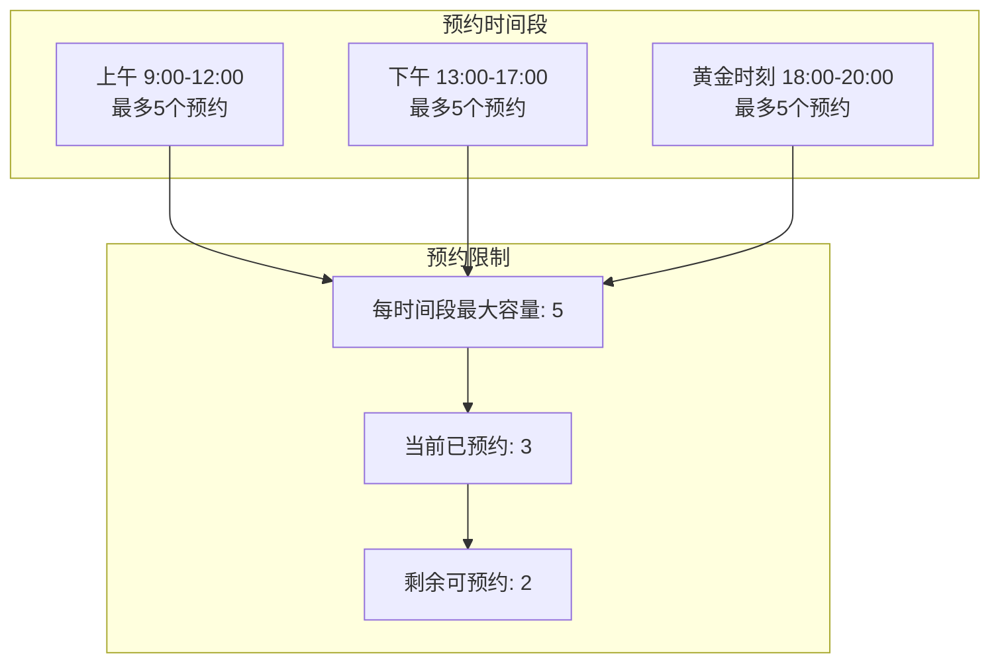

**图表来源**
- [booking/index.js:7-9](file://miniprogram/cloudfunctions/booking/index.js#L7-L9)
- [booking/index.js:51-65](file://miniprogram/cloudfunctions/booking/index.js#L51-L65)

**章节来源**
- [booking/index.js:51-65](file://miniprogram/cloudfunctions/booking/index.js#L51-L65)

### 支付统计集成

#### 支付状态流转

支付系统与统计系统紧密集成，通过订单状态变化触发统计更新：

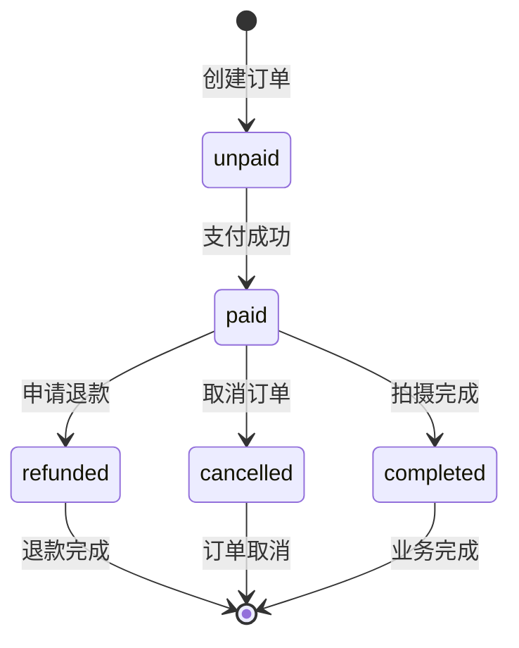

**图表来源**
- [payment/index.js:203-238](file://miniprogram/cloudfunctions/payment/index.js#L203-L238)

**章节来源**
- [payment/index.js:203-238](file://miniprogram/cloudfunctions/payment/index.js#L203-L238)

### 用户行为分析

#### 用户活跃度统计

系统通过多种维度分析用户行为：

- **预约频率**: 统计用户的预约次数和时间间隔
- **消费能力**: 分析用户的平均消费金额和消费频次
- **偏好分析**: 统计用户偏好的套餐类型和拍摄时间
- **留存分析**: 跟踪用户的持续使用情况

#### 收藏行为追踪

系统记录用户对客片的收藏行为，用于分析用户兴趣偏好：

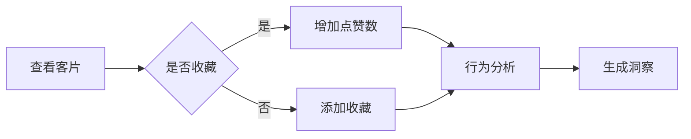

**图表来源**
- [gallery/index.js:227-282](file://miniprogram/cloudfunctions/gallery/index.js#L227-L282)

**章节来源**
- [gallery/index.js:227-282](file://miniprogram/cloudfunctions/gallery/index.js#L227-L282)

## 依赖关系分析

### 技术栈依赖

系统采用现代化的技术栈构建：

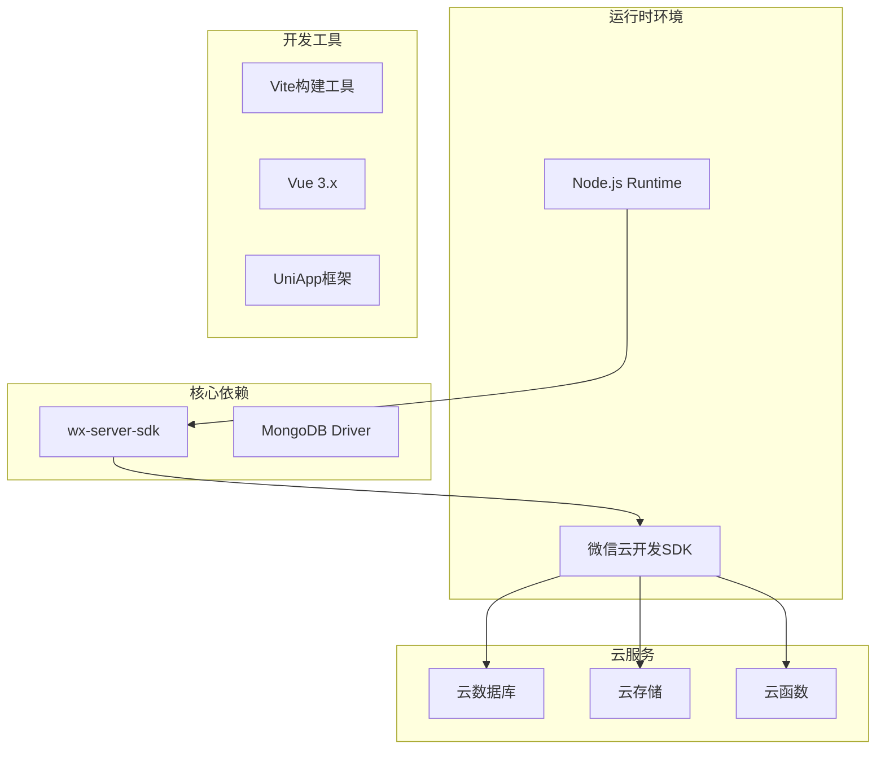

**图表来源**
- [stats/package.json:1-7](file://miniprogram/cloudfunctions/stats/package.json#L1-L7)

### 数据模型关系

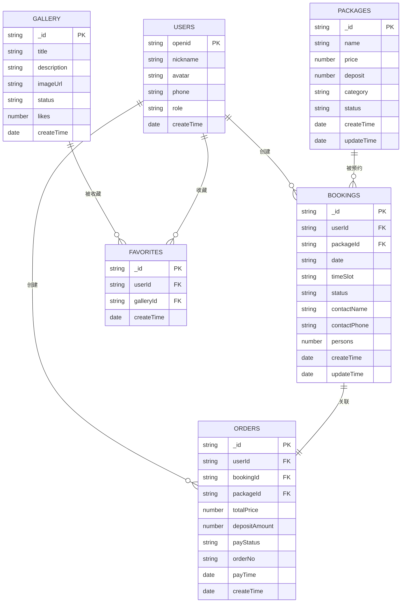

**图表来源**
- [booking/index.js:134-148](file://miniprogram/cloudfunctions/booking/index.js#L134-L148)
- [payment/index.js:174-186](file://miniprogram/cloudfunctions/payment/index.js#L174-L186)

**章节来源**
- [booking/index.js:134-148](file://miniprogram/cloudfunctions/booking/index.js#L134-L148)
- [payment/index.js:174-186](file://miniprogram/cloudfunctions/payment/index.js#L174-L186)

## 性能考虑

### 查询优化策略

#### 聚合查询优化

统计云函数使用了高效的聚合查询策略：

1. **索引利用**: 对常用查询字段建立索引
2. **聚合管道**: 使用MongoDB聚合管道减少数据传输
3. **分页处理**: 对大数据集进行分页查询
4. **条件过滤**: 在聚合阶段进行数据过滤

#### 缓存策略

虽然当前版本未实现传统缓存，但可以考虑以下优化方案：

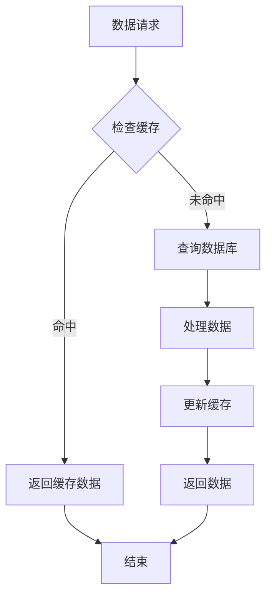

### 并发控制

#### 事务处理

系统使用数据库事务确保数据一致性：

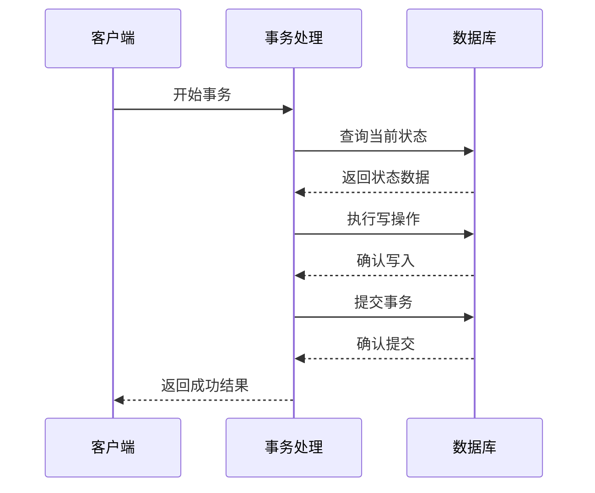

**图表来源**
- [booking/index.js:150-205](file://miniprogram/cloudfunctions/booking/index.js#L150-L205)
- [payment/index.js:203-238](file://miniprogram/cloudfunctions/payment/index.js#L203-L238)

**章节来源**
- [booking/index.js:150-205](file://miniprogram/cloudfunctions/booking/index.js#L150-L205)
- [payment/index.js:203-238](file://miniprogram/cloudfunctions/payment/index.js#L203-L238)

## 故障排除指南

### 常见问题及解决方案

#### 权限相关问题

| 问题描述 | 可能原因 | 解决方案 |
|----------|----------|----------|
| 无权限查看统计数据 | 用户角色不是管理员 | 检查用户角色配置 |
| 预约创建失败 | 时段已满 | 提示用户选择其他时段 |
| 支付回调失败 | 商户号配置错误 | 检查微信支付配置 |

#### 数据统计异常

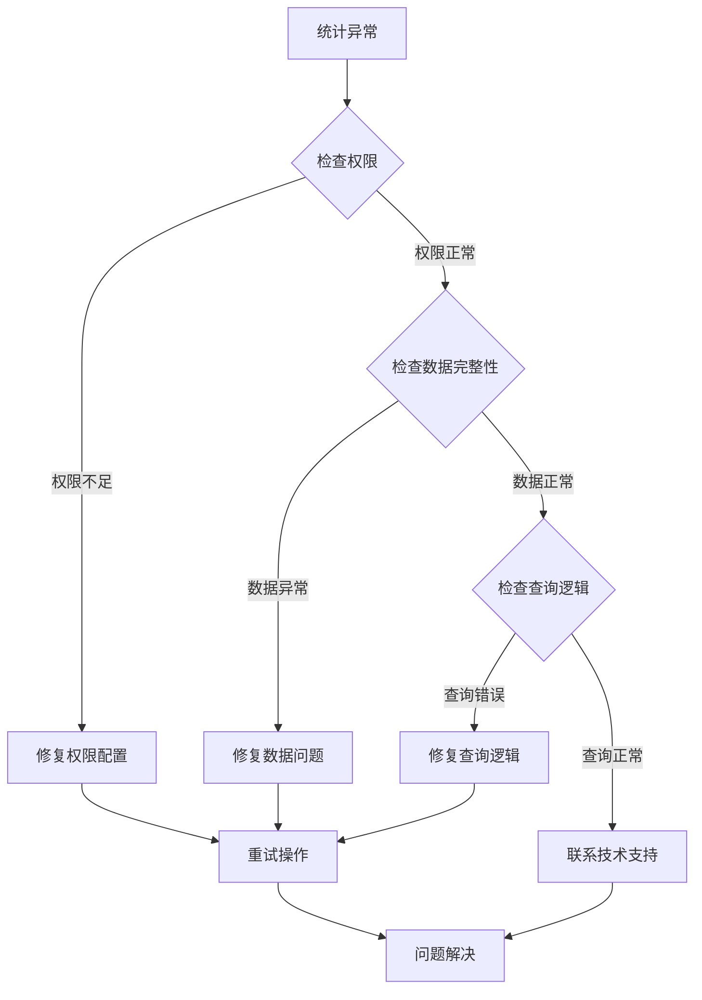

#### 性能问题诊断

1. **查询超时**: 检查数据库索引配置
2. **内存溢出**: 优化聚合查询和分页处理
3. **并发冲突**: 检查事务处理逻辑

**章节来源**
- [stats/index.js:158-161](file://miniprogram/cloudfunctions/stats/index.js#L158-L161)
- [booking/index.js:163-166](file://miniprogram/cloudfunctions/booking/index.js#L163-L166)

## 结论

数据分析统计云函数为旅拍摄影服务平台提供了强大的数据支撑能力。通过模块化的架构设计和完善的权限控制，系统能够准确统计各类业务指标，并为后台管理提供实时的数据可视化支持。

### 主要优势

1. **模块化设计**: 各功能模块职责清晰，便于维护和扩展
2. **权限安全**: 严格的权限控制确保数据安全
3. **实时统计**: 支持动态环境下的实时数据更新
4. **性能优化**: 采用聚合查询和事务处理保证系统性能

### 发展建议

1. **引入缓存机制**: 实现多级缓存提升查询性能
2. **增强监控告警**: 添加详细的性能监控和异常告警
3. **扩展分析维度**: 增加更多维度的用户行为分析
4. **优化移动端体验**: 改进管理后台的交互体验

该系统为类似的服务平台提供了良好的技术参考，通过持续优化和扩展，可以满足更复杂的业务需求。