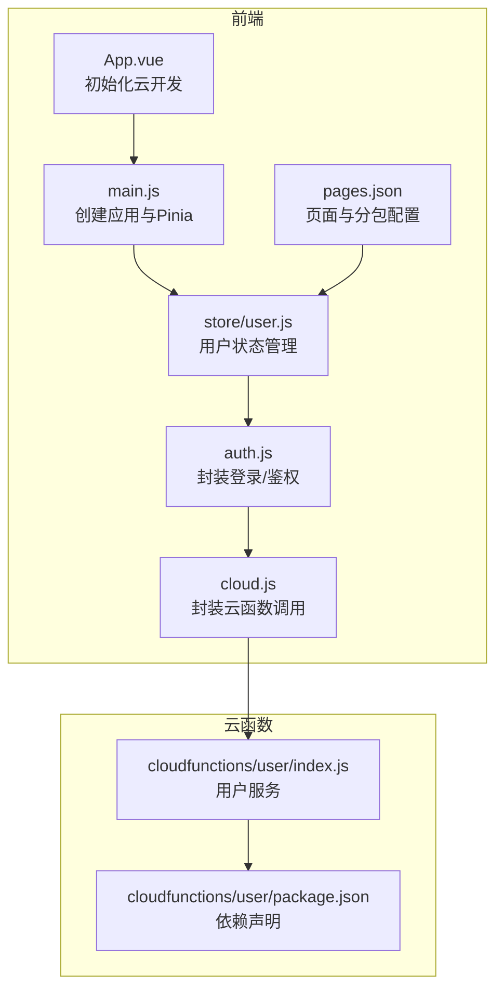
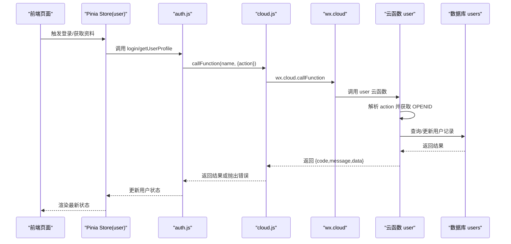
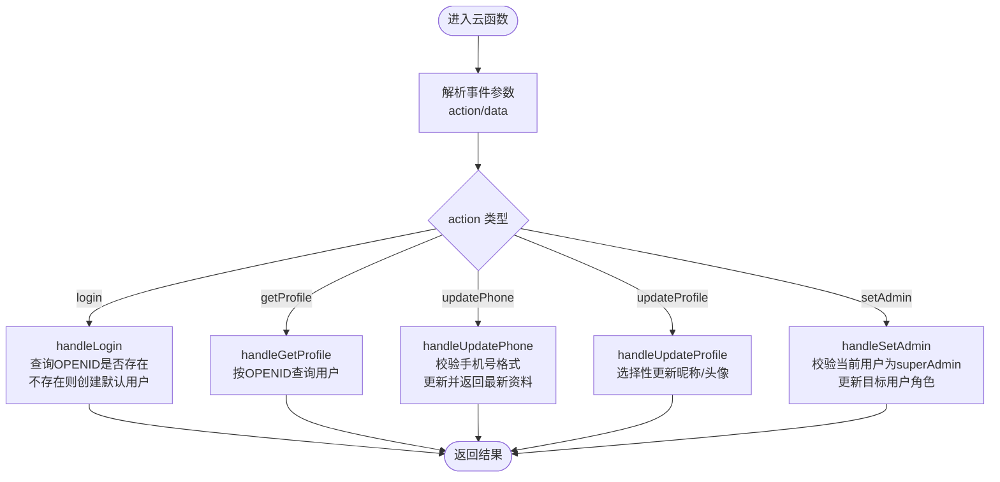
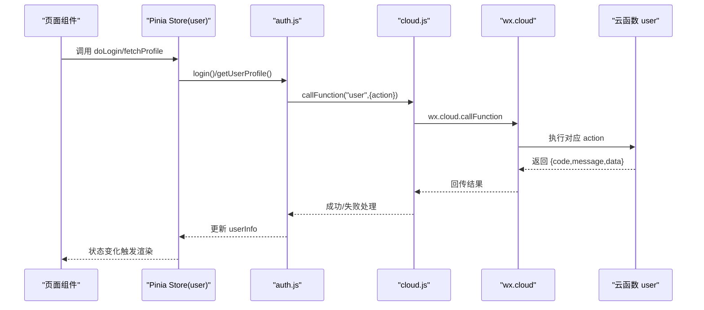
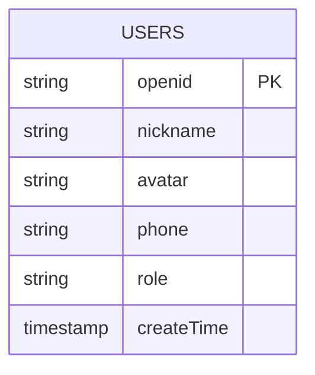
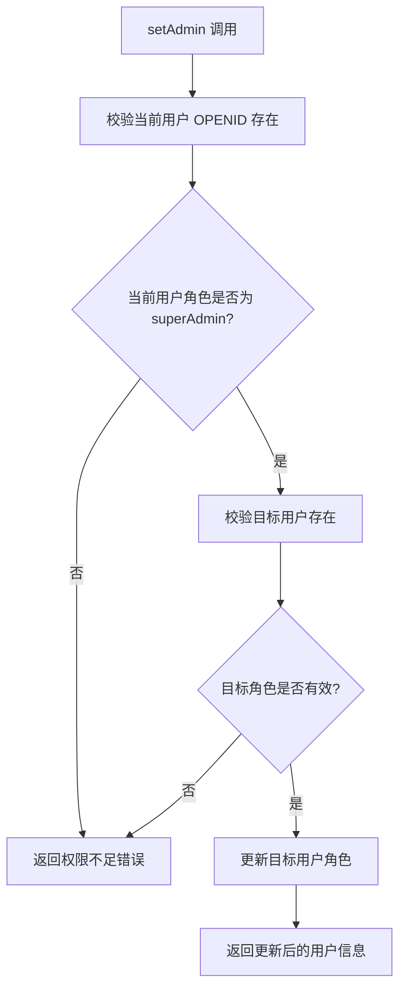
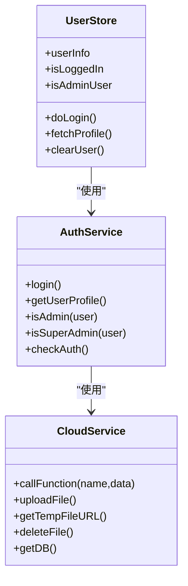
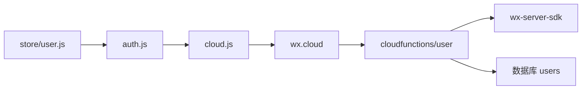

# 用户管理云函数

<cite>
**本文档引用的文件**
- [user/index.js](file://miniprogram/cloudfunctions/user/index.js)
- [user/package.json](file://miniprogram/cloudfunctions/user/package.json)
- [auth.js](file://miniprogram/src/utils/auth.js)
- [cloud.js](file://miniprogram/src/utils/cloud.js)
- [user.js](file://miniprogram/src/store/user.js)
- [pages.json](file://miniprogram/src/pages.json)
- [App.vue](file://miniprogram/src/App.vue)
- [main.js](file://miniprogram/src/main.js)
</cite>

## 目录
1. [简介](#简介)
2. [项目结构](#项目结构)
3. [核心组件](#核心组件)
4. [架构总览](#架构总览)
5. [详细组件分析](#详细组件分析)
6. [依赖关系分析](#依赖关系分析)
7. [性能考虑](#性能考虑)
8. [故障排查指南](#故障排查指南)
9. [结论](#结论)
10. [附录](#附录)

## 简介
本文件面向开发者，系统性阐述用户管理云函数的设计与实现，覆盖用户注册、登录、资料更新、权限验证与角色管理等完整流程。文档从架构视角解析云函数与前端的协作方式，明确 OpenID 获取与管理、角色权限体系（普通用户、管理员、超级管理员）、安全验证与错误处理策略，并给出与前端认证组件的交互模式及最佳实践。

## 项目结构
用户管理相关的核心位置如下：
- 云函数：miniprogram/cloudfunctions/user
- 前端工具层：miniprogram/src/utils/{auth.js, cloud.js}
- 状态管理：miniprogram/src/store/user.js
- 页面路由：miniprogram/src/pages.json
- 应用入口：miniprogram/src/{App.vue, main.js}

图表来源
- [App.vue:1-26](file://miniprogram/src/App.vue#L1-L26)
- [main.js:1-11](file://miniprogram/src/main.js#L1-L11)
- [auth.js:1-47](file://miniprogram/src/utils/auth.js#L1-L47)
- [cloud.js:1-66](file://miniprogram/src/utils/cloud.js#L1-L66)
- [user.js:1-48](file://miniprogram/src/store/user.js#L1-L48)
- [pages.json:1-177](file://miniprogram/src/pages.json#L1-L177)
- [user/index.js:1-206](file://miniprogram/cloudfunctions/user/index.js#L1-L206)
- [user/package.json:1-7](file://miniprogram/cloudfunctions/user/package.json#L1-L7)

章节来源
- [App.vue:1-26](file://miniprogram/src/App.vue#L1-L26)
- [main.js:1-11](file://miniprogram/src/main.js#L1-L11)
- [pages.json:1-177](file://miniprogram/src/pages.json#L1-L177)

## 核心组件
- 云函数 user：提供登录、获取资料、更新手机、更新资料、设置管理员角色等能力；通过 action 字段区分不同操作。
- 前端工具 auth：封装登录与用户资料获取，供 Pinia Store 使用。
- 前端工具 cloud：统一封装 wx.cloud.callFunction 的调用与错误处理。
- Pinia Store user：集中管理用户登录态、角色判断与资料拉取。
- 页面配置 pages.json：定义主包与管理后台分包，支撑不同角色访问不同页面。

章节来源
- [user/index.js:7-31](file://miniprogram/cloudfunctions/user/index.js#L7-L31)
- [auth.js:6-26](file://miniprogram/src/utils/auth.js#L6-L26)
- [cloud.js:5-26](file://miniprogram/src/utils/cloud.js#L5-L26)
- [user.js:5-47](file://miniprogram/src/store/user.js#L5-L47)
- [pages.json:77-131](file://miniprogram/src/pages.json#L77-L131)

## 架构总览
整体交互链路：前端通过 wx.cloud 调用 user 云函数，云函数基于微信上下文获取 OPENID，访问数据库 users 集合完成用户状态管理与权限校验。

图表来源
- [auth.js:7-26](file://miniprogram/src/utils/auth.js#L7-L26)
- [cloud.js:6-26](file://miniprogram/src/utils/cloud.js#L6-L26)
- [user/index.js:7-31](file://miniprogram/cloudfunctions/user/index.js#L7-L31)

## 详细组件分析

### 云函数 user：用户服务
- 入口与上下文
  - 通过 cloud.init 与 cloud.getWXContext 获取环境与 OPENID。
  - 事件参数包含 action 与 data，根据 action 分派处理函数。
- 登录流程
  - 若用户不存在则创建新用户，默认角色为 user，记录创建时间。
  - 若用户已存在则直接返回用户信息。
- 资料管理
  - 获取资料：按 OPENID 查询用户。
  - 更新手机号：校验手机号格式，更新后返回最新资料。
  - 更新资料：支持昵称与头像字段选择性更新。
- 权限与角色管理
  - setAdmin：仅超级管理员可修改目标用户的 role，支持 user/admin/superAdmin。
  - 内置权限检查：当前用户必须为 superAdmin 才能执行角色变更。

图表来源
- [user/index.js:7-31](file://miniprogram/cloudfunctions/user/index.js#L7-L31)
- [user/index.js:34-67](file://miniprogram/cloudfunctions/user/index.js#L34-L67)
- [user/index.js:69-82](file://miniprogram/cloudfunctions/user/index.js#L69-L82)
- [user/index.js:84-115](file://miniprogram/cloudfunctions/user/index.js#L84-L115)
- [user/index.js:117-154](file://miniprogram/cloudfunctions/user/index.js#L117-L154)
- [user/index.js:156-205](file://miniprogram/cloudfunctions/user/index.js#L156-L205)

章节来源
- [user/index.js:1-206](file://miniprogram/cloudfunctions/user/index.js#L1-L206)
- [user/package.json:1-7](file://miniprogram/cloudfunctions/user/package.json#L1-L7)

### 前端工具层：认证与云函数调用
- auth.js
  - login：调用 user 云函数的 login 动作，返回用户数据。
  - getUserProfile：调用 user 云函数的 getProfile 动作，返回用户数据。
  - isAdmin/isSuperAdmin：基于用户角色判断是否管理员/超级管理员。
  - checkAuth：检查本地登录态有效性。
- cloud.js
  - callFunction：统一封装 wx.cloud.callFunction，按返回 code 判定成功或错误。
  - 提供文件上传、下载、删除等云存储能力（与用户管理相关功能可复用）。

图表来源
- [auth.js:6-26](file://miniprogram/src/utils/auth.js#L6-L26)
- [cloud.js:6-26](file://miniprogram/src/utils/cloud.js#L6-L26)
- [user.js:10-32](file://miniprogram/src/store/user.js#L10-L32)

章节来源
- [auth.js:1-47](file://miniprogram/src/utils/auth.js#L1-L47)
- [cloud.js:1-66](file://miniprogram/src/utils/cloud.js#L1-L66)
- [user.js:1-48](file://miniprogram/src/store/user.js#L1-L48)

### 数据模型与 OpenID 管理
- 用户集合 users 字段要点
  - openid：用户唯一标识，来自微信上下文。
  - nickname/avatar：用户昵称与头像。
  - phone：手机号，支持更新。
  - role：角色，支持 user/admin/superAdmin。
  - createTime：创建时间，使用云开发服务端时间。
- OpenID 获取与管理
  - 云函数通过 cloud.getWXContext 获取 OPENID，避免从前端传递敏感标识。
  - 前端通过 auth.js 的 login/getUserProfile 间接使用 OPENID 完成业务操作。

图表来源
- [user/index.js:48-57](file://miniprogram/cloudfunctions/user/index.js#L48-L57)
- [user/index.js:100-105](file://miniprogram/cloudfunctions/user/index.js#L100-L105)
- [user/index.js:170-179](file://miniprogram/cloudfunctions/user/index.js#L170-L179)

章节来源
- [user/index.js:4-6](file://miniprogram/cloudfunctions/user/index.js#L4-L6)
- [user/index.js:48-57](file://miniprogram/cloudfunctions/user/index.js#L48-L57)

### 角色权限体系与安全验证
- 角色定义
  - user：普通用户，可查看与基本编辑自身资料。
  - admin：管理员，具备部分后台管理权限。
  - superAdmin：超级管理员，具备最高权限，如修改他人角色。
- 权限检查逻辑
  - setAdmin：仅当当前用户角色为 superAdmin 时允许执行。
  - 前端通过 isAdmin/isSuperAdmin 判断界面与功能可见性。
- 安全验证措施
  - 云端统一校验 OPENID 与用户存在性，避免前端伪造。
  - 手机号更新前进行格式校验。
  - 统一错误码与消息返回，便于前端一致化处理。

图表来源
- [user/index.js:156-205](file://miniprogram/cloudfunctions/user/index.js#L156-L205)
- [auth.js:28-36](file://miniprogram/src/utils/auth.js#L28-L36)

章节来源
- [user/index.js:156-205](file://miniprogram/cloudfunctions/user/index.js#L156-L205)
- [auth.js:28-36](file://miniprogram/src/utils/auth.js#L28-L36)

### 前端状态管理与页面交互
- Pinia Store user
  - userInfo：保存当前用户信息。
  - isLoggedIn/isAdminUser：计算属性，用于控制界面显示与交互。
  - doLogin/fetchProfile/clearUser：封装登录、拉取资料与登出清理。
- 页面与分包
  - pages.json 定义了管理后台分包 pages-admin，结合角色判断可实现菜单与页面级别的访问控制。

图表来源
- [user.js:5-47](file://miniprogram/src/store/user.js#L5-L47)
- [auth.js:6-46](file://miniprogram/src/utils/auth.js#L6-L46)
- [cloud.js:5-65](file://miniprogram/src/utils/cloud.js#L5-L65)

章节来源
- [user.js:1-48](file://miniprogram/src/store/user.js#L1-L48)
- [pages.json:77-131](file://miniprogram/src/pages.json#L77-L131)

## 依赖关系分析
- 云函数依赖
  - wx-server-sdk：提供云开发运行时能力与数据库访问。
- 前端依赖
  - Pinia：状态管理。
  - 微信小程序云开发 SDK：通过 wx.cloud 调用云函数与访问数据库。
- 关键耦合点
  - 前端通过 auth.js 与 cloud.js 与云函数解耦。
  - 云函数通过 OPENID 与数据库 users 集合耦合，保证用户身份与权限一致性。

图表来源
- [auth.js:4](file://miniprogram/src/utils/auth.js#L4)
- [cloud.js:4](file://miniprogram/src/utils/cloud.js#L4)
- [user/index.js:1](file://miniprogram/cloudfunctions/user/index.js#L1)
- [user/package.json:4](file://miniprogram/cloudfunctions/user/package.json#L4)

章节来源
- [user/package.json:1-7](file://miniprogram/cloudfunctions/user/package.json#L1-L7)
- [auth.js:1-47](file://miniprogram/src/utils/auth.js#L1-L47)
- [cloud.js:1-66](file://miniprogram/src/utils/cloud.js#L1-L66)

## 性能考虑
- 数据库查询
  - 以 openid 作为查询条件，建议在 users 集合建立相应索引以提升查询效率。
- 云函数冷启动
  - 合理复用连接与缓存，避免在每次请求中重复初始化资源。
- 前端调用
  - 对频繁调用的接口进行节流与去重，减少不必要的云函数调用次数。
- 文件操作
  - 图片/头像上传建议使用云存储并结合临时链接缓存，降低网络开销。

## 故障排查指南
- 常见错误与定位
  - 未知操作：检查前端传入的 action 是否正确。
  - 获取用户 openid 失败：确认云函数运行环境与微信上下文可用。
  - 用户不存在：确认登录流程是否先执行 login 动作。
  - 权限不足：确认当前用户角色是否为 superAdmin。
  - 手机号格式不正确：检查正则校验与输入格式。
- 错误处理策略
  - 云函数统一捕获异常并返回标准错误对象，前端据此提示用户或重试。
  - 前端对 callFunction 的失败回调进行统一处理，避免未捕获异常导致崩溃。

章节来源
- [user/index.js:24-30](file://miniprogram/cloudfunctions/user/index.js#L24-L30)
- [user/index.js:35-37](file://miniprogram/cloudfunctions/user/index.js#L35-L37)
- [user/index.js:103-105](file://miniprogram/cloudfunctions/user/index.js#L103-L105)
- [user/index.js:177-179](file://miniprogram/cloudfunctions/user/index.js#L177-L179)
- [cloud.js:11-23](file://miniprogram/src/utils/cloud.js#L11-L23)

## 结论
用户管理云函数以 OPENID 为核心标识，围绕登录、资料管理与角色权限构建了清晰的服务边界。前端通过 Pinia 与工具层实现一致化的认证与状态管理，配合云函数的权限校验与安全验证，形成完整的用户生命周期闭环。建议后续在数据库索引、云函数性能优化与前端错误治理方面持续改进。

## 附录
- 最佳实践清单
  - 始终通过云函数侧获取与校验 OPENID，避免从前端传递。
  - 对关键操作（如角色变更）进行二次确认与审计日志准备。
  - 在 pages.json 中结合角色控制页面访问，实现前端级权限收敛。
  - 对手机号等敏感字段进行严格的格式校验与最小必要原则更新。