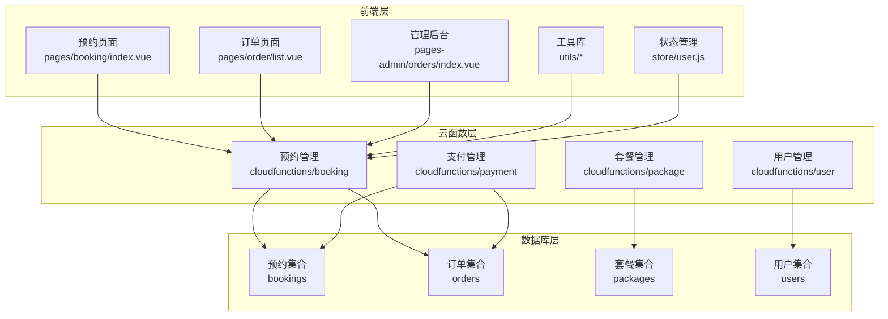
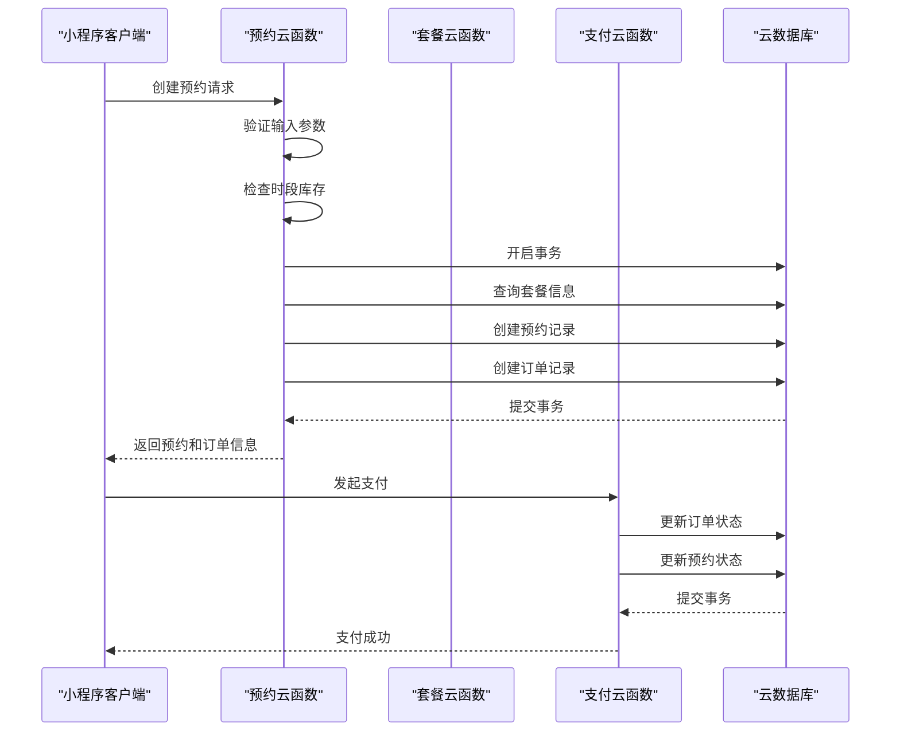
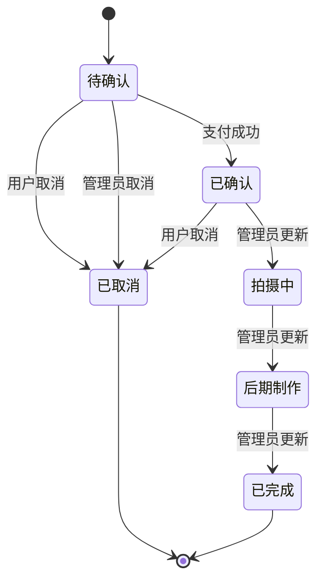
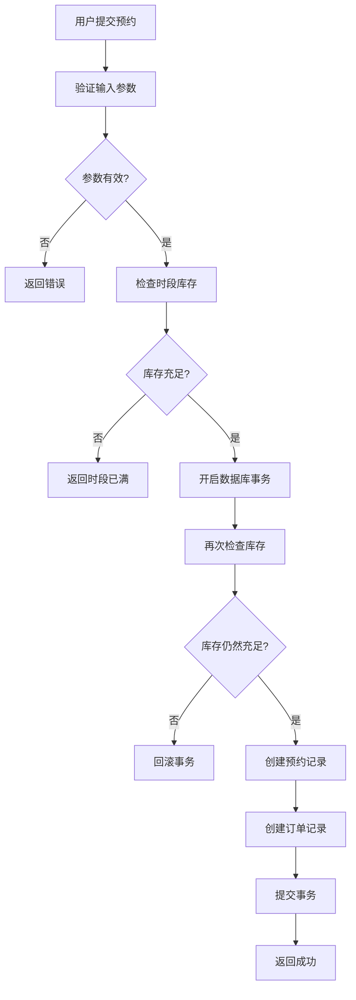
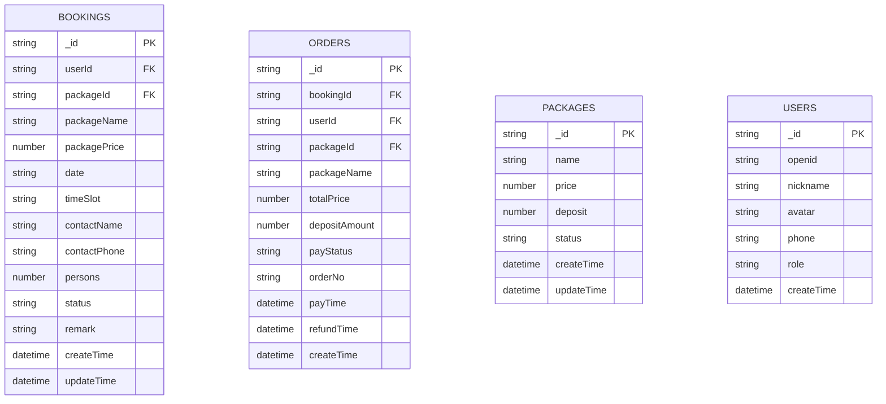
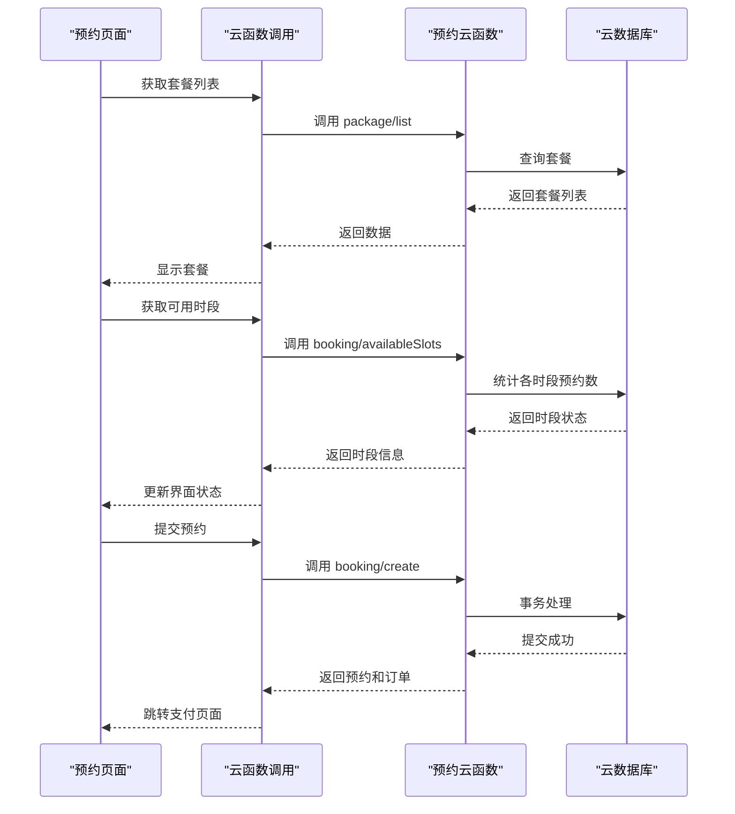
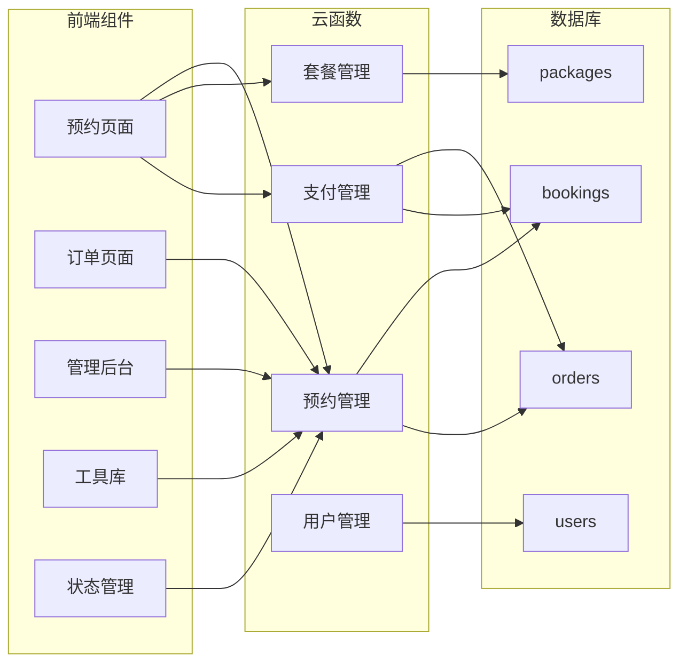

# 预约管理云函数

<cite>
**本文档引用的文件**
- [booking/index.js](file://miniprogram/cloudfunctions/booking/index.js)
- [booking/package.json](file://miniprogram/cloudfunctions/booking/package.json)
- [package/index.js](file://miniprogram/cloudfunctions/package/index.js)
- [payment/index.js](file://miniprogram/cloudfunctions/payment/index.js)
- [user/index.js](file://miniprogram/cloudfunctions/user/index.js)
- [booking/index.vue](file://miniprogram/src/pages/booking/index.vue)
- [constants.js](file://miniprogram/src/utils/constants.js)
- [cloud.js](file://miniprogram/src/utils/cloud.js)
- [user.js](file://miniprogram/src/store/user.js)
- [list.vue](file://miniprogram/src/pages/order/list.vue)
- [orders/index.vue](file://miniprogram/src/pages-admin/orders/index.vue)
</cite>

## 目录
1. [简介](#简介)
2. [项目结构](#项目结构)
3. [核心组件](#核心组件)
4. [架构概览](#架构概览)
5. [详细组件分析](#详细组件分析)
6. [依赖关系分析](#依赖关系分析)
7. [性能考虑](#性能考虑)
8. [故障排除指南](#故障排除指南)
9. [结论](#结论)

## 简介

这是一个基于微信小程序云开发的预约管理系统，专注于摄影服务的预约管理。系统实现了完整的预约生命周期管理，包括预约创建、查询、取消和状态管理功能。系统采用云函数架构，通过事务处理确保数据一致性，并实现了完善的权限控制和并发控制机制。

## 项目结构

项目采用前后端分离的架构设计，主要分为以下层次：



**图表来源**
- [booking/index.js:1-463](file://miniprogram/cloudfunctions/booking/index.js#L1-L463)
- [package/index.js:1-222](file://miniprogram/cloudfunctions/package/index.js#L1-L222)
- [payment/index.js:1-532](file://miniprogram/cloudfunctions/payment/index.js#L1-L532)

**章节来源**
- [booking/index.js:1-463](file://miniprogram/cloudfunctions/booking/index.js#L1-L463)
- [booking/package.json:1-7](file://miniprogram/cloudfunctions/booking/package.json#L1-L7)

## 核心组件

### 预约管理云函数

预约管理云函数是整个系统的核心，提供了完整的预约生命周期管理功能：

- **预约创建**：支持套餐选择、日期时间选择、联系人信息录入
- **预约查询**：支持按状态、日期筛选，分页查询
- **预约取消**：支持用户主动取消和管理员强制取消
- **状态管理**：完整的状态流转机制
- **并发控制**：通过事务和库存检查防止超卖

### 时段管理系统

系统实现了灵活的时段管理机制：

- **时段类型**：上午、下午、黄金时段三种类型
- **库存限制**：每个时段最多容纳5个预约
- **实时检查**：创建预约时进行库存检查
- **并发保护**：使用事务确保高并发场景下的数据一致性

### 权限控制系统

系统实现了多层次的权限控制：

- **用户权限**：普通用户只能操作自己的预约
- **管理员权限**：超级管理员和管理员拥有完整权限
- **角色管理**：支持用户、管理员、超级管理员三种角色

**章节来源**
- [booking/index.js:7-10](file://miniprogram/cloudfunctions/booking/index.js#L7-L10)
- [booking/index.js:29-46](file://miniprogram/cloudfunctions/booking/index.js#L29-L46)
- [booking/index.js:48-65](file://miniprogram/cloudfunctions/booking/index.js#L48-L65)

## 架构概览

系统采用微服务架构，通过云函数实现功能模块化：



**图表来源**
- [booking/index.js:95-206](file://miniprogram/cloudfunctions/booking/index.js#L95-L206)
- [payment/index.js:168-239](file://miniprogram/cloudfunctions/payment/index.js#L168-L239)

## 详细组件分析

### 预约状态机设计

系统实现了完整的预约状态流转机制：



**状态定义**：
- **待确认**：用户已预约但未支付
- **已确认**：用户已支付，等待拍摄
- **拍摄中**：正在进行拍摄
- **后期制作**：照片正在处理中
- **已完成**：拍摄完成，处理完毕
- **已取消**：被用户或管理员取消

**图表来源**
- [constants.js:29-37](file://miniprogram/src/utils/constants.js#L29-L37)

### 并发控制和库存管理

系统通过多重机制确保并发安全：



**图表来源**
- [booking/index.js:95-206](file://miniprogram/cloudfunctions/booking/index.js#L95-L206)

### 数据模型设计

系统采用简洁高效的数据模型：



**图表来源**
- [booking/index.js:134-148](file://miniprogram/cloudfunctions/booking/index.js#L134-L148)
- [booking/index.js:174-186](file://miniprogram/cloudfunctions/booking/index.js#L174-L186)

### 前端交互流程

前端组件与云函数的交互流程：



**图表来源**
- [booking/index.vue:342-356](file://miniprogram/src/pages/booking/index.vue#L342-L356)
- [booking/index.vue:423-470](file://miniprogram/src/pages/booking/index.vue#L423-L470)

**章节来源**
- [booking/index.js:1-463](file://miniprogram/cloudfunctions/booking/index.js#L1-L463)
- [booking/index.vue:1-1029](file://miniprogram/src/pages/booking/index.vue#L1-L1029)

## 依赖关系分析

系统各组件之间的依赖关系：



**图表来源**
- [booking/index.js:1-463](file://miniprogram/cloudfunctions/booking/index.js#L1-L463)
- [package/index.js:1-222](file://miniprogram/cloudfunctions/package/index.js#L1-L222)
- [payment/index.js:1-532](file://miniprogram/cloudfunctions/payment/index.js#L1-L532)
- [user/index.js:1-206](file://miniprogram/cloudfunctions/user/index.js#L1-L206)

**章节来源**
- [booking/index.js:1-463](file://miniprogram/cloudfunctions/booking/index.js#L1-L463)
- [package/index.js:1-222](file://miniprogram/cloudfunctions/package/index.js#L1-L222)
- [payment/index.js:1-532](file://miniprogram/cloudfunctions/payment/index.js#L1-L532)
- [user/index.js:1-206](file://miniprogram/cloudfunctions/user/index.js#L1-L206)

## 性能考虑

### 数据库优化

1. **索引策略**：建议在以下字段建立索引
   - `bookings.date` 和 `bookings.timeSlot` 组合索引
   - `bookings.userId` 用户索引
   - `orders.orderNo` 订单号索引
   - `orders.userId` 用户索引

2. **查询优化**：使用投影减少数据传输
   ```javascript
   // 优化前
   db.collection('bookings').where({userId: openid}).get()
   
   // 优化后
   db.collection('bookings').where({userId: openid})
     .field({packageName: 1, date: 1, timeSlot: 1, status: 1})
     .get()
   ```

3. **分页查询**：合理设置分页大小，避免一次性查询大量数据

### 缓存策略

1. **前端缓存**：对套餐列表等静态数据进行缓存
2. **CDN加速**：图片资源使用CDN加速
3. **数据库连接池**：合理配置云函数的数据库连接

### 并发处理

1. **事务隔离**：使用数据库事务确保数据一致性
2. **乐观锁**：在高并发场景下使用版本号控制
3. **队列处理**：对耗时操作使用异步队列

## 故障排除指南

### 常见问题及解决方案

#### 预约创建失败

**问题描述**：用户提交预约时提示"时段已满"

**可能原因**：
1. 时段库存不足
2. 并发情况下库存被其他用户占用
3. 数据库事务冲突

**解决方案**：
1. 检查时段库存统计逻辑
2. 确保事务中的双重检查机制
3. 实现重试机制处理短暂冲突

#### 支付状态不同步

**问题描述**：支付完成后订单状态未更新

**可能原因**：
1. 支付回调未正确处理
2. 事务提交失败
3. 网络异常导致状态不同步

**解决方案**：
1. 检查支付回调处理逻辑
2. 实现幂等性处理
3. 添加补偿机制

#### 权限验证失败

**问题描述**：管理员无法查看所有预约

**可能原因**：
1. 用户角色信息错误
2. 权限检查逻辑问题
3. 缓存数据过期

**解决方案**：
1. 验证用户角色字段
2. 检查权限验证函数
3. 清除相关缓存

**章节来源**
- [booking/index.js:308-385](file://miniprogram/cloudfunctions/booking/index.js#L308-L385)
- [payment/index.js:168-239](file://miniprogram/cloudfunctions/payment/index.js#L168-L239)

## 结论

本预约管理系统通过合理的架构设计和完善的业务逻辑，实现了摄影服务预约的全流程管理。系统具有以下特点：

1. **功能完整**：覆盖预约管理的所有核心功能
2. **安全性强**：完善的权限控制和数据验证
3. **并发安全**：通过事务和库存检查确保数据一致性
4. **用户体验好**：前端界面友好，交互流畅
5. **扩展性强**：模块化设计便于功能扩展

系统采用云开发技术栈，充分利用了微信小程序平台的优势，为用户提供了一站式的预约管理解决方案。通过持续的优化和维护，系统能够满足不断增长的业务需求。