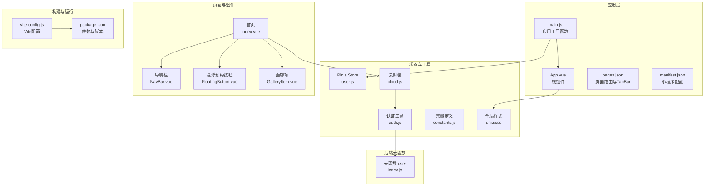
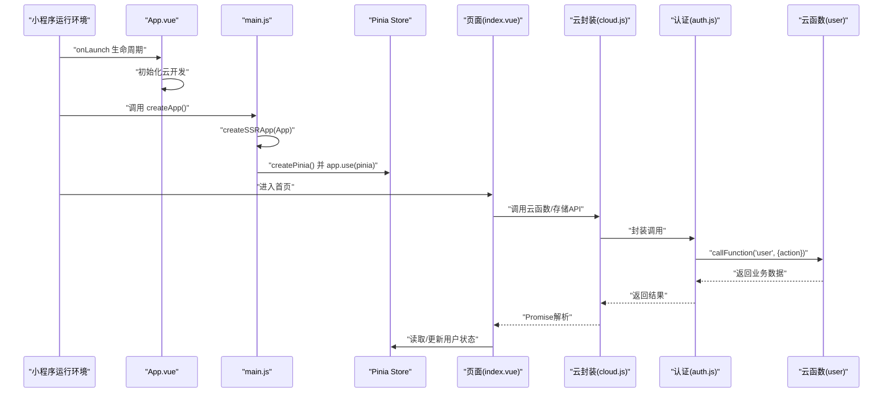
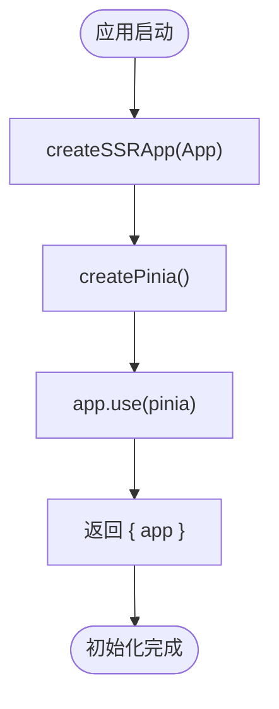
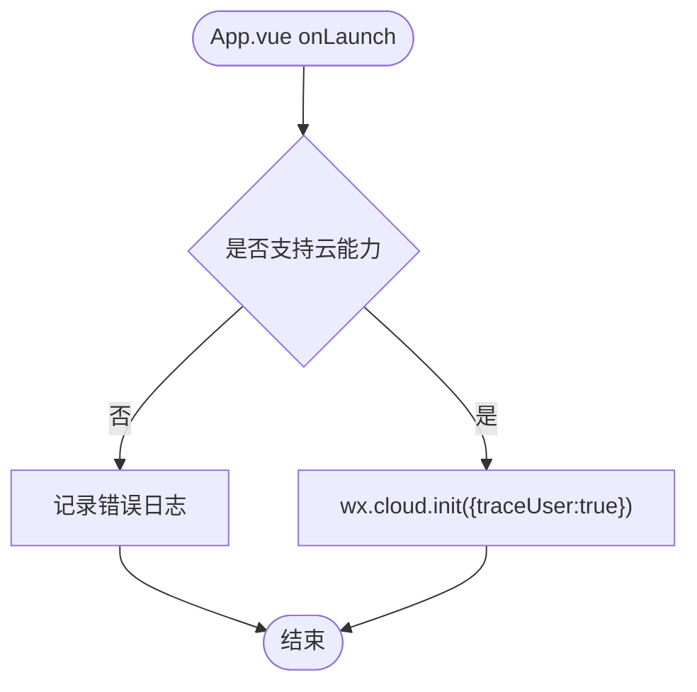
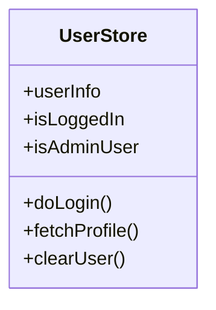
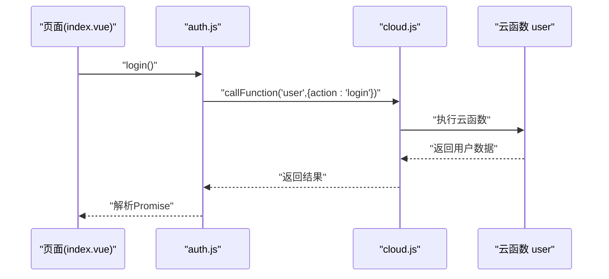
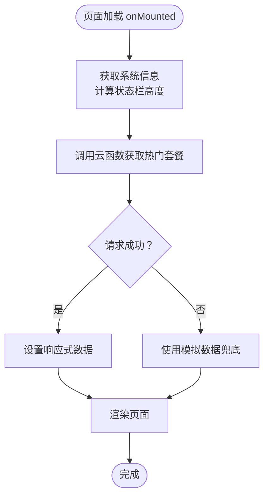
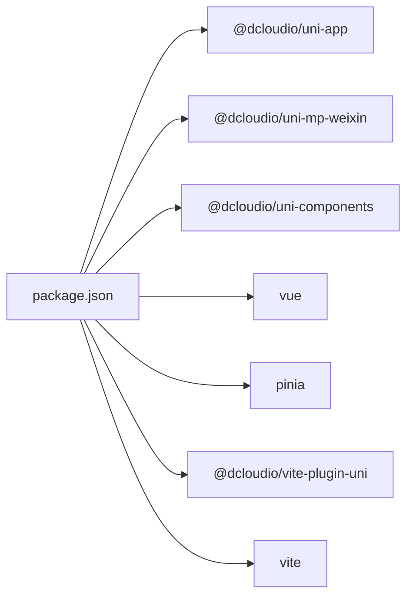

# Vue框架与应用初始化

<cite>
**本文档引用的文件**
- [main.js](file://miniprogram/src/main.js)
- [App.vue](file://miniprogram/src/App.vue)
- [manifest.json](file://miniprogram/src/manifest.json)
- [pages.json](file://miniprogram/src/pages.json)
- [vite.config.js](file://miniprogram/vite.config.js)
- [user.js](file://miniprogram/src/store/user.js)
- [cloud.js](file://miniprogram/src/utils/cloud.js)
- [auth.js](file://miniprogram/src/utils/auth.js)
- [uni.scss](file://miniprogram/src/uni.scss)
- [package.json](file://miniprogram/package.json)
- [index.vue](file://miniprogram/src/pages/index/index.vue)
- [NavBar.vue](file://miniprogram/src/components/NavBar.vue)
- [FloatingButton.vue](file://miniprogram/src/components/FloatingButton.vue)
- [GalleryItem.vue](file://miniprogram/src/components/GalleryItem.vue)
- [constants.js](file://miniprogram/src/utils/constants.js)
- [index.js](file://miniprogram/cloudfunctions/user/index.js)
</cite>

## 目录
1. [引言](#引言)
2. [项目结构](#项目结构)
3. [核心组件](#核心组件)
4. [架构总览](#架构总览)
5. [详细组件分析](#详细组件分析)
6. [依赖关系分析](#依赖关系分析)
7. [性能考量](#性能考量)
8. [故障排查指南](#故障排查指南)
9. [结论](#结论)
10. [附录](#附录)

## 引言
本文件面向在UniApp中使用Vue 3进行跨平台小程序开发的工程师，系统阐述应用初始化流程、Composition API实践、插件注册机制、Pinia状态管理集成、全局配置与云开发初始化等主题。文档同时覆盖App.vue根组件设计理念、全局样式管理、以及云函数调用封装的最佳实践，并提供错误处理与性能优化建议。

## 项目结构
该工程采用典型的“页面+组件+工具+云函数”分层组织，配合Vite与UniApp插件完成构建与多端编译。

图表来源
- [main.js:1-11](file://miniprogram/src/main.js#L1-L11)
- [App.vue:1-26](file://miniprogram/src/App.vue#L1-L26)
- [pages.json:1-177](file://miniprogram/src/pages.json#L1-L177)
- [manifest.json:1-24](file://miniprogram/src/manifest.json#L1-L24)
- [user.js:1-48](file://miniprogram/src/store/user.js#L1-L48)
- [cloud.js:1-66](file://miniprogram/src/utils/cloud.js#L1-L66)
- [auth.js:1-47](file://miniprogram/src/utils/auth.js#L1-L47)
- [constants.js:1-73](file://miniprogram/src/utils/constants.js#L1-L73)
- [index.vue:1-521](file://miniprogram/src/pages/index/index.vue#L1-L521)
- [NavBar.vue:1-79](file://miniprogram/src/components/NavBar.vue#L1-L79)
- [FloatingButton.vue:1-48](file://miniprogram/src/components/FloatingButton.vue#L1-L48)
- [GalleryItem.vue:1-60](file://miniprogram/src/components/GalleryItem.vue#L1-L60)
- [vite.config.js:1-7](file://miniprogram/vite.config.js#L1-L7)
- [package.json:1-22](file://miniprogram/package.json#L1-L22)
- [index.js:1-206](file://miniprogram/cloudfunctions/user/index.js#L1-L206)

章节来源
- [main.js:1-11](file://miniprogram/src/main.js#L1-L11)
- [vite.config.js:1-7](file://miniprogram/vite.config.js#L1-L7)
- [package.json:1-22](file://miniprogram/package.json#L1-L22)

## 核心组件
- 应用工厂与初始化
  - 使用createSSRApp创建应用实例，通过createPinia注册状态管理，并导出包含app的对象，便于多端统一初始化。
  - 关键路径参考：[应用工厂函数:5-10](file://miniprogram/src/main.js#L5-L10)

- 根组件与云开发初始化
  - 在App.vue的onLaunch生命周期中初始化云开发，确保小程序运行时具备云能力。
  - 关键路径参考：[根组件云初始化:4-13](file://miniprogram/src/App.vue#L4-L13)

- 全局样式与品牌规范
  - 通过uni.scss集中定义品牌色、功能色、文字色、背景色、边框色、间距、圆角与字号等变量，供各页面与组件按需使用。
  - 关键路径参考：[全局样式变量:1-43](file://miniprogram/src/uni.scss#L1-L43)

- 页面路由与TabBar配置
  - pages.json集中声明页面、分包、TabBar与全局导航样式，保证多端一致的导航体验。
  - 关键路径参考：[页面与TabBar配置:1-177](file://miniprogram/src/pages.json#L1-L177)

- 构建与多端配置
  - vite.config.js启用@uni/vite-plugin-uni插件；package.json提供开发与构建脚本，支持微信小程序平台。
  - 关键路径参考：[Vite配置:1-7](file://miniprogram/vite.config.js#L1-L7)，[项目脚本与依赖:5-22](file://miniprogram/package.json#L5-L22)

章节来源
- [main.js:1-11](file://miniprogram/src/main.js#L1-L11)
- [App.vue:1-26](file://miniprogram/src/App.vue#L1-L26)
- [uni.scss:1-43](file://miniprogram/src/uni.scss#L1-L43)
- [pages.json:1-177](file://miniprogram/src/pages.json#L1-L177)
- [vite.config.js:1-7](file://miniprogram/vite.config.js#L1-L7)
- [package.json:1-22](file://miniprogram/package.json#L1-L22)

## 架构总览
下图展示了从应用启动到页面渲染、状态管理与云函数调用的整体流程。

图表来源
- [App.vue:4-13](file://miniprogram/src/App.vue#L4-L13)
- [main.js:5-10](file://miniprogram/src/main.js#L5-L10)
- [index.vue:150-178](file://miniprogram/src/pages/index/index.vue#L150-L178)
- [cloud.js:6-26](file://miniprogram/src/utils/cloud.js#L6-L26)
- [auth.js:7-26](file://miniprogram/src/utils/auth.js#L7-L26)
- [index.js:7-31](file://miniprogram/cloudfunctions/user/index.js#L7-L31)

## 详细组件分析

### 应用初始化与插件注册
- 初始化流程
  - createSSRApp负责创建Vue应用实例，确保在不同运行环境下的一致行为。
  - createPinia创建状态容器，并通过app.use(pinia)完成插件注册，使全局可访问。
  - 返回包含app的对象，便于多端统一挂载。
- 关键路径参考：[应用工厂与插件注册:5-10](file://miniprogram/src/main.js#L5-L10)

图表来源
- [main.js:5-10](file://miniprogram/src/main.js#L5-L10)

章节来源
- [main.js:1-11](file://miniprogram/src/main.js#L1-L11)

### 根组件设计与云开发初始化
- 设计理念
  - App.vue作为全局入口，在onLaunch中进行云开发初始化，避免页面级重复逻辑。
  - 通过条件判断确保基础库版本满足云能力要求，提升兼容性。
- 关键路径参考：[根组件云初始化:4-13](file://miniprogram/src/App.vue#L4-L13)

图表来源
- [App.vue:4-13](file://miniprogram/src/App.vue#L4-L13)

章节来源
- [App.vue:1-26](file://miniprogram/src/App.vue#L1-L26)

### Pinia状态管理集成
- Store定义
  - 使用defineStore定义用户状态模块，包含用户信息、登录态计算属性、登录/获取资料/清除用户等动作。
  - 采用组合式风格，结合ref/computed实现响应式数据与派生状态。
- 关键路径参考：[用户Store:5-47](file://miniprogram/src/store/user.js#L5-L47)

图表来源
- [user.js:1-48](file://miniprogram/src/store/user.js#L1-L48)

章节来源
- [user.js:1-48](file://miniprogram/src/store/user.js#L1-L48)

### 云开发封装与认证工具
- 云封装
  - 提供callFunction、uploadFile、getTempFileURL、deleteFile、getDB等方法，统一封装wx.cloud调用，返回Promise，便于在页面中异步处理。
  - 关键路径参考：[云封装:6-66](file://miniprogram/src/utils/cloud.js#L6-L66)
- 认证工具
  - login/getUserProfile基于云函数user实现；isAdmin/isSuperAdmin用于权限判断；checkAuth检查会话有效性。
  - 关键路径参考：[认证工具:7-47](file://miniprogram/src/utils/auth.js#L7-L47)
- 云函数(user)
  - 实现登录、获取资料、更新手机号、更新资料、设置管理员等操作，包含参数校验与权限控制。
  - 关键路径参考：[云函数user:14-206](file://miniprogram/cloudfunctions/user/index.js#L14-L206)

图表来源
- [index.vue:150-178](file://miniprogram/src/pages/index/index.vue#L150-L178)
- [auth.js:7-15](file://miniprogram/src/utils/auth.js#L7-L15)
- [cloud.js:6-26](file://miniprogram/src/utils/cloud.js#L6-L26)
- [index.js:14-67](file://miniprogram/cloudfunctions/user/index.js#L14-L67)

章节来源
- [cloud.js:1-66](file://miniprogram/src/utils/cloud.js#L1-L66)
- [auth.js:1-47](file://miniprogram/src/utils/auth.js#L1-L47)
- [index.js:1-206](file://miniprogram/cloudfunctions/user/index.js#L1-L206)

### 页面与组件实践（Composition API）
- 首页(index.vue)
  - 使用<script setup>与ref/onMounted等组合式API，实现Banner轮播、快捷入口、热门套餐、场景展示等功能。
  - 通过callFunction调用云函数获取数据，失败时回退至模拟数据，体现健壮性。
  - 关键路径参考：[首页页面逻辑:112-214](file://miniprogram/src/pages/index/index.vue#L112-L214)
- 导航栏组件(NavBar.vue)
  - 接收title与showBack属性，动态计算状态栏高度，提供返回逻辑。
  - 关键路径参考：[导航栏组件:19-37](file://miniprogram/src/components/NavBar.vue#L19-L37)
- 悬浮预约按钮(FloatingButton.vue)
  - 发射click事件并跳转到预约页，增强交互体验。
  - 关键路径参考：[悬浮按钮组件:7-15](file://miniprogram/src/components/FloatingButton.vue#L7-L15)
- 画廊项组件(GalleryItem.vue)
  - 展示封面图与标签，支持预览事件发射。
  - 关键路径参考：[画廊项组件:13-23](file://miniprogram/src/components/GalleryItem.vue#L13-L23)

图表来源
- [index.vue:206-214](file://miniprogram/src/pages/index/index.vue#L206-L214)
- [index.vue:150-178](file://miniprogram/src/pages/index/index.vue#L150-L178)

章节来源
- [index.vue:1-521](file://miniprogram/src/pages/index/index.vue#L1-L521)
- [NavBar.vue:1-79](file://miniprogram/src/components/NavBar.vue#L1-L79)
- [FloatingButton.vue:1-48](file://miniprogram/src/components/FloatingButton.vue#L1-L48)
- [GalleryItem.vue:1-60](file://miniprogram/src/components/GalleryItem.vue#L1-L60)

### 全局样式与品牌规范
- 统一变量管理
  - 在uni.scss中集中定义品牌色、功能色、文字色、背景色、边框色、间距、圆角与字号等变量，页面与组件通过SCSS变量引用，确保视觉一致性。
- 关键路径参考：[全局样式变量:1-43](file://miniprogram/src/uni.scss#L1-L43)

章节来源
- [uni.scss:1-43](file://miniprogram/src/uni.scss#L1-L43)

### 全局配置与Manifest
- Manifest配置
  - 包含小程序名称、版本、微信小程序appid、编译设置、组件化开关、权限描述、云函数根目录等。
  - 关键路径参考：[Manifest配置:7-22](file://miniprogram/src/manifest.json#L7-L22)
- Pages配置
  - pages.json定义主包页面、分包、TabBar图标与文案、全局导航样式等。
  - 关键路径参考：[Pages配置:1-177](file://miniprogram/src/pages.json#L1-L177)

章节来源
- [manifest.json:1-24](file://miniprogram/src/manifest.json#L1-L24)
- [pages.json:1-177](file://miniprogram/src/pages.json#L1-L177)

## 依赖关系分析
- 运行时依赖
  - @dcloudio/uni-app、@dcloudio/uni-mp-weixin、@dcloudio/uni-components、vue、pinia等。
- 开发时依赖
  - @dcloudio/vite-plugin-uni、vite等。
- 关键路径参考：[依赖与脚本:9-22](file://miniprogram/package.json#L9-L22)

图表来源
- [package.json:9-22](file://miniprogram/package.json#L9-L22)

章节来源
- [package.json:1-22](file://miniprogram/package.json#L1-L22)

## 性能考量
- 首屏优化
  - 首页在onMounted中按需加载热门套餐数据，失败时回退模拟数据，减少白屏时间。
  - 关键路径参考：[首屏数据加载:150-178](file://miniprogram/src/pages/index/index.vue#L150-L178)
- 资源加载
  - 图片懒加载与按需展示，降低初始渲染压力。
  - 关键路径参考：[图片懒加载](file://miniprogram/src/components/GalleryItem.vue#L3)
- 状态管理
  - Pinia Store使用组合式风格，避免不必要的响应式开销；仅在需要时更新状态。
  - 关键路径参考：[用户Store:5-47](file://miniprogram/src/store/user.js#L5-L47)
- 云函数调用
  - 统一封装callFunction，避免重复请求与错误处理分散，提高可维护性。
  - 关键路径参考：[云封装:6-26](file://miniprogram/src/utils/cloud.js#L6-L26)

## 故障排查指南
- 云开发初始化失败
  - 现象：控制台提示基础库版本过低或未初始化云能力。
  - 处理：确保基础库版本满足要求，并在App.vue的onLaunch中执行初始化。
  - 关键路径参考：[云初始化:6-12](file://miniprogram/src/App.vue#L6-L12)
- 云函数调用异常
  - 现象：callFunction返回错误或Promise拒绝。
  - 处理：检查云函数名称与参数、网络状态与权限配置；在页面中捕获异常并提示用户。
  - 关键路径参考：[云封装与错误处理:20-26](file://miniprogram/src/utils/cloud.js#L20-L26)
- 登录与权限问题
  - 现象：登录失败或权限不足。
  - 处理：确认云函数user的权限逻辑与角色判断；在auth.js中检查checkAuth与错误日志。
  - 关键路径参考：[认证工具:39-47](file://miniprogram/src/utils/auth.js#L39-L47)，[云函数权限:170-179](file://miniprogram/cloudfunctions/user/index.js#L170-L179)

章节来源
- [App.vue:6-12](file://miniprogram/src/App.vue#L6-L12)
- [cloud.js:20-26](file://miniprogram/src/utils/cloud.js#L20-L26)
- [auth.js:39-47](file://miniprogram/src/utils/auth.js#L39-L47)
- [index.js:170-179](file://miniprogram/cloudfunctions/user/index.js#L170-L179)

## 结论
本项目在UniApp中采用Vue 3 Composition API与Pinia实现了清晰的应用初始化与状态管理，结合云封装与云函数，形成了从前端到后端的完整闭环。通过全局样式变量与统一的页面配置，提升了跨平台一致性与可维护性。建议在后续迭代中持续关注首屏性能、错误监控与权限边界，以进一步提升用户体验与稳定性。

## 附录
- 最佳实践清单
  - 在App.vue统一初始化云能力，避免页面级重复逻辑。
  - 使用Pinia组合式风格定义Store，保持状态单一职责。
  - 通过云封装统一处理wx.cloud调用，集中错误处理。
  - 在pages.json中统一配置TabBar与导航样式，确保跨端一致。
  - 使用uni.scss集中管理品牌与设计变量，提升复用性。
- 常用路径速查
  - 应用工厂与插件注册：[main.js:5-10](file://miniprogram/src/main.js#L5-L10)
  - 根组件云初始化：[App.vue:4-13](file://miniprogram/src/App.vue#L4-L13)
  - 用户Store：[user.js:5-47](file://miniprogram/src/store/user.js#L5-L47)
  - 云封装：[cloud.js:6-66](file://miniprogram/src/utils/cloud.js#L6-L66)
  - 认证工具：[auth.js:7-47](file://miniprogram/src/utils/auth.js#L7-L47)
  - 首页页面逻辑：[index.vue:112-214](file://miniprogram/src/pages/index/index.vue#L112-L214)
  - 全局样式变量：[uni.scss:1-43](file://miniprogram/src/uni.scss#L1-L43)
  - 页面与TabBar配置：[pages.json:1-177](file://miniprogram/src/pages.json#L1-L177)
  - Manifest配置：[manifest.json:7-22](file://miniprogram/src/manifest.json#L7-L22)
  - Vite配置：[vite.config.js:1-7](file://miniprogram/vite.config.js#L1-L7)
  - 依赖与脚本：[package.json:5-22](file://miniprogram/package.json#L5-L22)
  - 云函数user：[index.js:14-206](file://miniprogram/cloudfunctions/user/index.js#L14-L206)