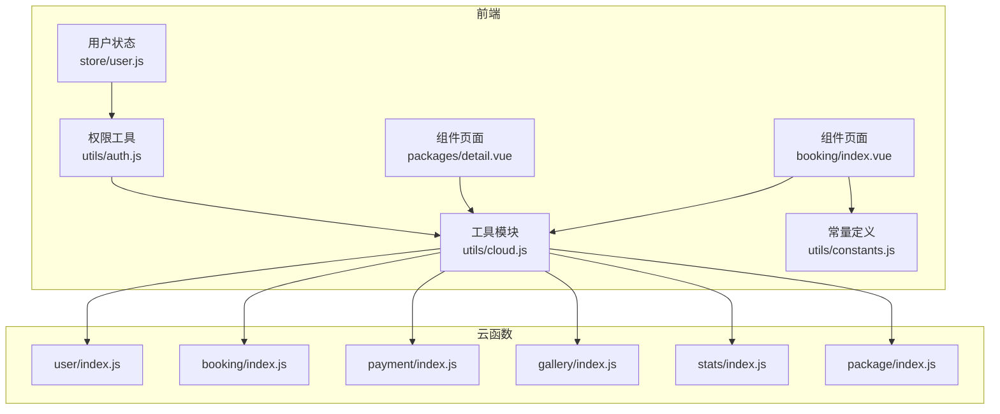
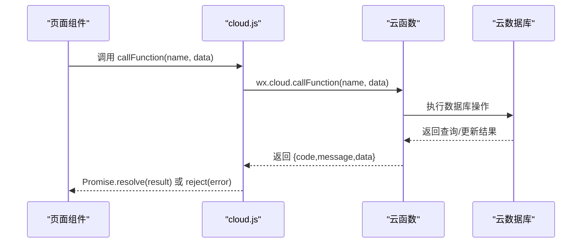
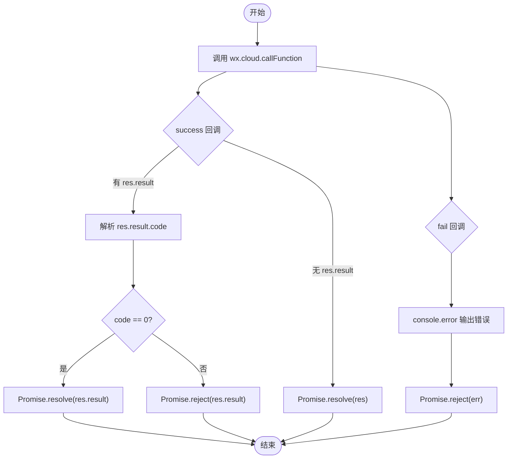
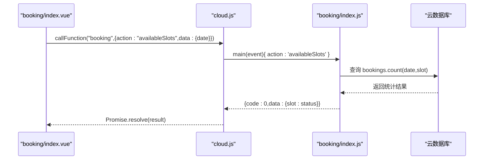
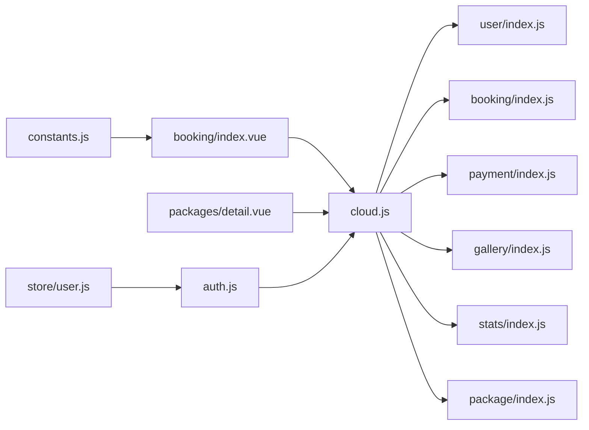

# 云函数集成

<cite>
**本文档引用的文件**
- [cloud.js](file://miniprogram/src/utils/cloud.js)
- [constants.js](file://miniprogram/src/utils/constants.js)
- [user/index.js](file://miniprogram/cloudfunctions/user/index.js)
- [booking/index.js](file://miniprogram/cloudfunctions/booking/index.js)
- [payment/index.js](file://miniprogram/cloudfunctions/payment/index.js)
- [gallery/index.js](file://miniprogram/cloudfunctions/gallery/index.js)
- [stats/index.js](file://miniprogram/cloudfunctions/stats/index.js)
- [package/index.js](file://miniprogram/cloudfunctions/package/index.js)
- [auth.js](file://miniprogram/src/utils/auth.js)
- [user.js](file://miniprogram/src/store/user.js)
- [booking/index.vue](file://miniprogram/src/pages/booking/index.vue)
- [packages/detail.vue](file://miniprogram/src/pages/packages/detail.vue)
</cite>

## 目录
1. [简介](#简介)
2. [项目结构](#项目结构)
3. [核心组件](#核心组件)
4. [架构总览](#架构总览)
5. [详细组件分析](#详细组件分析)
6. [依赖关系分析](#依赖关系分析)
7. [性能考量](#性能考量)
8. [故障排查指南](#故障排查指南)
9. [结论](#结论)
10. [附录](#附录)

## 简介
本项目基于微信云开发构建，采用前后端分离的架构设计。前端通过云函数封装模块统一调用后端云函数，实现用户管理、预约管理、支付流程、客片展示等核心业务功能。本文档深入解析云函数集成的设计与实现，包括：
- 云函数调用封装与请求参数处理
- 响应数据解析与错误码规范
- 常量定义与业务常量管理
- 最佳实践（错误处理、超时控制、重试机制）
- 完整集成示例（组件调用、异步处理、数据缓存）
- 云开发限制、性能优化与调试技巧
- 数据交互模式与安全考虑

## 项目结构
项目采用“前端组件 + 云函数”双层架构，前端通过 utils/cloud.js 统一封装云函数调用，各业务云函数按功能模块划分，便于维护与扩展。

**图表来源**
- [booking/index.vue:207-494](file://miniprogram/src/pages/booking/index.vue#L207-L494)
- [packages/detail.vue:141-251](file://miniprogram/src/pages/packages/detail.vue#L141-L251)
- [cloud.js:1-66](file://miniprogram/src/utils/cloud.js#L1-L66)
- [auth.js:1-47](file://miniprogram/src/utils/auth.js#L1-L47)
- [user.js:1-48](file://miniprogram/src/store/user.js#L1-L48)
- [constants.js:1-73](file://miniprogram/src/utils/constants.js#L1-L73)
- [user/index.js:1-206](file://miniprogram/cloudfunctions/user/index.js#L1-L206)
- [booking/index.js:1-463](file://miniprogram/cloudfunctions/booking/index.js#L1-L463)
- [payment/index.js:1-532](file://miniprogram/cloudfunctions/payment/index.js#L1-L532)
- [gallery/index.js:1-360](file://miniprogram/cloudfunctions/gallery/index.js#L1-L360)
- [stats/index.js:1-229](file://miniprogram/cloudfunctions/stats/index.js#L1-L229)
- [package/index.js:1-222](file://miniprogram/cloudfunctions/package/index.js#L1-L222)

**章节来源**
- [cloud.js:1-66](file://miniprogram/src/utils/cloud.js#L1-L66)
- [constants.js:1-73](file://miniprogram/src/utils/constants.js#L1-L73)

## 核心组件
本节聚焦云函数集成的关键组件与职责划分。

- 云函数调用封装（utils/cloud.js）
  - 提供统一的云函数调用入口，支持 Promise 化处理
  - 规范响应结构：统一返回 { code, message, data }，便于前端一致处理
  - 支持文件上传、下载、删除等云存储操作
  - 提供数据库引用便捷方法

- 常量定义（utils/constants.js）
  - 统一管理业务常量：套餐分类、客片分类、预约时段、状态枚举等
  - 便于前端组件复用，避免硬编码

- 权限与认证（utils/auth.js、store/user.js）
  - 封装登录、获取用户信息、管理员判断等权限相关逻辑
  - Pinia 状态管理用户登录态与角色信息

**章节来源**
- [cloud.js:5-66](file://miniprogram/src/utils/cloud.js#L5-L66)
- [constants.js:5-73](file://miniprogram/src/utils/constants.js#L5-L73)
- [auth.js:6-36](file://miniprogram/src/utils/auth.js#L6-L36)
- [user.js:5-47](file://miniprogram/src/store/user.js#L5-L47)

## 架构总览
前端通过云函数封装模块调用后端云函数，云函数负责业务逻辑与数据库操作，返回标准化响应。下图展示典型调用链路。

**图表来源**
- [cloud.js:6-26](file://miniprogram/src/utils/cloud.js#L6-L26)
- [booking/index.vue:342-356](file://miniprogram/src/pages/booking/index.vue#L342-L356)
- [packages/detail.vue:202-237](file://miniprogram/src/pages/packages/detail.vue#L202-L237)

## 详细组件分析

### 云函数调用封装（cloud.js）
- 设计要点
  - Promise 化：将 wx.cloud.callFunction 包装为 Promise，简化异步处理
  - 响应规范化：优先解析 res.result.code，0 表示成功，非 0 表示业务错误；若 res.result 为空则透传原响应
  - 错误处理：捕获 fail 回调并输出详细错误日志
  - 文件操作：uploadFile/getTempFileURL/deleteFile 提供云存储常用能力
  - 数据库引用：getDB 直接返回 wx.cloud.database()

- 请求参数处理
  - 必填参数校验：在调用侧进行基础校验（如手机号格式、必填字段）
  - 动态 data 结构：根据 action 动态拼装不同业务参数

- 响应数据解析
  - 成功：返回 { code: 0, message: 'success', data: ... }
  - 失败：返回 { code: -1, message: '错误信息', data?: ... }
  - 异常：reject(err)，便于上层统一处理

**图表来源**
- [cloud.js:6-26](file://miniprogram/src/utils/cloud.js#L6-L26)

**章节来源**
- [cloud.js:5-66](file://miniprogram/src/utils/cloud.js#L5-L66)

### 常量定义（constants.js）
- 作用
  - 统一管理业务常量，避免分散硬编码
  - 便于前端组件复用，减少重复逻辑
- 主要常量
  - 套餐分类：PACKAGE_CATEGORIES
  - 客片分类：GALLERY_CATEGORIES
  - 预约时段：TIME_SLOTS
  - 预约状态：BOOKING_STATUS
  - 支付状态：PAY_STATUS
  - 订单状态：ORDER_STATUS
  - 店铺信息：STORE_INFO
  - Slogan：SLOGAN

**章节来源**
- [constants.js:5-73](file://miniprogram/src/utils/constants.js#L5-L73)

### 用户云函数（user/index.js）
- 功能
  - 登录：首次调用自动创建用户记录
  - 获取用户信息：按 openid 查询
  - 更新手机号：正则校验 + 更新
  - 更新资料：动态字段更新
  - 设置管理员：权限校验 + 角色变更
- 错误码约定
  - 0：成功
  - -1：通用错误或业务校验失败
- 安全性
  - 所有操作均基于 openid 进行权限校验
  - 管理员操作严格校验角色

**章节来源**
- [user/index.js:7-31](file://miniprogram/cloudfunctions/user/index.js#L7-L31)
- [user/index.js:34-205](file://miniprogram/cloudfunctions/user/index.js#L34-L205)

### 预约云函数（booking/index.js）
- 功能
  - 创建预约：校验必填项、时段可用性、并发安全（事务）、联动创建订单
  - 查询列表：支持分页、状态/日期筛选、管理员权限
  - 获取详情：权限校验（本人或管理员）
  - 取消预约：状态限制、退款标记
  - 更新状态：管理员专用
  - 可用时段：批量查询各时段剩余名额
- 关键设计
  - 事务保证数据一致性
  - 时段上限控制（MAX_BOOKINGS_PER_SLOT）
  - 管理员权限校验（checkAdmin）

**章节来源**
- [booking/index.js:67-93](file://miniprogram/cloudfunctions/booking/index.js#L67-L93)
- [booking/index.js:98-206](file://miniprogram/cloudfunctions/booking/index.js#L98-L206)
- [booking/index.js:211-259](file://miniprogram/cloudfunctions/booking/index.js#L211-L259)
- [booking/index.js:264-303](file://miniprogram/cloudfunctions/booking/index.js#L264-L303)
- [booking/index.js:308-385](file://miniprogram/cloudfunctions/booking/index.js#L308-L385)
- [booking/index.js:390-438](file://miniprogram/cloudfunctions/booking/index.js#L390-L438)
- [booking/index.js:443-462](file://miniprogram/cloudfunctions/booking/index.js#L443-L462)

### 支付云函数（payment/index.js）
- 功能
  - 创建支付订单：模拟支付参数（开发测试），真实接入需配置商户号
  - 支付成功回调：前端调用更新订单与预约状态（事务）
  - 支付回调处理：模拟处理（开发测试），真实接入需实现签名验证
  - 退款处理：管理员权限 + 事务更新
  - 订单查询：支持按订单 ID 或订单号查询，权限校验
  - 我的订单：按用户查询分页列表
- 安全与合规
  - 真实接入需配置微信支付商户号与证书
  - 回调需进行签名验证与幂等处理

**章节来源**
- [payment/index.js:26-52](file://miniprogram/cloudfunctions/payment/index.js#L26-L52)
- [payment/index.js:65-166](file://miniprogram/cloudfunctions/payment/index.js#L65-L166)
- [payment/index.js:172-239](file://miniprogram/cloudfunctions/payment/index.js#L172-L239)
- [payment/index.js:253-327](file://miniprogram/cloudfunctions/payment/index.js#L253-L327)
- [payment/index.js:338-450](file://miniprogram/cloudfunctions/payment/index.js#L338-L450)
- [payment/index.js:455-531](file://miniprogram/cloudfunctions/payment/index.js#L455-L531)

### 客片云函数（gallery/index.js）
- 功能
  - 列表：分类筛选、发布状态过滤、分页
  - 详情：按 ID 查询
  - 管理员：创建/更新/删除客片
  - 收藏：添加/取消收藏，联动更新点赞数
  - 我的收藏：分页查询并联查客片信息
  - 检查收藏：按用户与客片 ID 查询
- 事务与一致性
  - 删除客片时级联删除收藏记录

**章节来源**
- [gallery/index.js:26-64](file://miniprogram/cloudfunctions/gallery/index.js#L26-L64)
- [gallery/index.js:67-103](file://miniprogram/cloudfunctions/gallery/index.js#L67-L103)
- [gallery/index.js:105-124](file://miniprogram/cloudfunctions/gallery/index.js#L105-L124)
- [gallery/index.js:127-152](file://miniprogram/cloudfunctions/gallery/index.js#L127-L152)
- [gallery/index.js:154-182](file://miniprogram/cloudfunctions/gallery/index.js#L154-L182)
- [gallery/index.js:184-225](file://miniprogram/cloudfunctions/gallery/index.js#L184-L225)
- [gallery/index.js:227-283](file://miniprogram/cloudfunctions/gallery/index.js#L227-L283)
- [gallery/index.js:285-339](file://miniprogram/cloudfunctions/gallery/index.js#L285-L339)
- [gallery/index.js:341-359](file://miniprogram/cloudfunctions/gallery/index.js#L341-L359)

### 统计云函数（stats/index.js）
- 功能
  - 管理员：获取数据概览（今日预约、待处理订单、本月收入、客片/预约/用户总数）
  - 状态统计：各预约状态数量
  - 趋势分析：最近7天预约趋势
- 设计注意
  - 今日日期与当月范围计算
  - 聚合查询异常降级处理

**章节来源**
- [stats/index.js:52-68](file://miniprogram/cloudfunctions/stats/index.js#L52-L68)
- [stats/index.js:73-162](file://miniprogram/cloudfunctions/stats/index.js#L73-L162)
- [stats/index.js:167-192](file://miniprogram/cloudfunctions/stats/index.js#L167-L192)
- [stats/index.js:197-228](file://miniprogram/cloudfunctions/stats/index.js#L197-L228)

### 套餐云函数（package/index.js）
- 功能
  - 列表：分类筛选、上架状态过滤
  - 详情：按 ID 查询
  - 管理员：创建/更新/删除/上下架
- 设计注意
  - 管理员权限校验
  - 排序字段 sortOrder 控制展示顺序

**章节来源**
- [package/index.js:26-58](file://miniprogram/cloudfunctions/package/index.js#L26-L58)
- [package/index.js:61-86](file://miniprogram/cloudfunctions/package/index.js#L61-L86)
- [package/index.js:89-107](file://miniprogram/cloudfunctions/package/index.js#L89-L107)
- [package/index.js:109-134](file://miniprogram/cloudfunctions/package/index.js#L109-L134)
- [package/index.js:137-164](file://miniprogram/cloudfunctions/package/index.js#L137-L164)
- [package/index.js:167-187](file://miniprogram/cloudfunctions/package/index.js#L167-L187)
- [package/index.js:190-221](file://miniprogram/cloudfunctions/package/index.js#L190-L221)

### 前端集成示例

#### 在组件中调用云函数
- 预约页面（booking/index.vue）
  - 获取可用时段：调用 booking/availableSlots
  - 创建预约：调用 booking/create
  - 获取套餐列表/详情：调用 package/list、package/detail
  - 登录态检查：调用 user/login、user/getProfile
- 套餐详情页（packages/detail.vue）
  - 获取套餐详情：调用 package/detail

**图表来源**
- [booking/index.vue:342-356](file://miniprogram/src/pages/booking/index.vue#L342-L356)
- [booking/index.js:443-462](file://miniprogram/cloudfunctions/booking/index.js#L443-L462)

**章节来源**
- [booking/index.vue:342-470](file://miniprogram/src/pages/booking/index.vue#L342-L470)
- [packages/detail.vue:202-237](file://miniprogram/src/pages/packages/detail.vue#L202-L237)
- [auth.js:7-26](file://miniprogram/src/utils/auth.js#L7-L26)
- [user.js:11-32](file://miniprogram/src/store/user.js#L11-L32)

## 依赖关系分析
- 前端依赖
  - 组件依赖 cloud.js 进行云函数调用
  - 组件依赖 auth.js 进行登录与权限判断
  - 组件依赖 constants.js 进行常量复用
  - 组件依赖 store/user.js 管理用户状态
- 云函数依赖
  - 云函数依赖 wx-server-sdk 初始化环境
  - 云函数依赖数据库命令（db.command、db.aggregate）进行复杂查询
  - 云函数依赖事务（startTransaction）保证数据一致性

**图表来源**
- [cloud.js:1-66](file://miniprogram/src/utils/cloud.js#L1-L66)
- [user/index.js:1-3](file://miniprogram/cloudfunctions/user/index.js#L1-L3)
- [booking/index.js:1-3](file://miniprogram/cloudfunctions/booking/index.js#L1-L3)
- [payment/index.js:1-3](file://miniprogram/cloudfunctions/payment/index.js#L1-L3)
- [gallery/index.js:1-3](file://miniprogram/cloudfunctions/gallery/index.js#L1-L3)
- [stats/index.js:1-3](file://miniprogram/cloudfunctions/stats/index.js#L1-L3)
- [package/index.js:1-3](file://miniprogram/cloudfunctions/package/index.js#L1-L3)
- [booking/index.vue:210-212](file://miniprogram/src/pages/booking/index.vue#L210-L212)
- [packages/detail.vue:143-143](file://miniprogram/src/pages/packages/detail.vue#L143-L143)
- [auth.js:4-4](file://miniprogram/src/utils/auth.js#L4-L4)
- [user.js:3-3](file://miniprogram/src/store/user.js#L3-L3)
- [constants.js:1-1](file://miniprogram/src/utils/constants.js#L1-L1)

**章节来源**
- [cloud.js:1-66](file://miniprogram/src/utils/cloud.js#L1-L66)
- [booking/index.vue:207-212](file://miniprogram/src/pages/booking/index.vue#L207-L212)
- [packages/detail.vue:141-143](file://miniprogram/src/pages/packages/detail.vue#L141-L143)

## 性能考量
- 云函数冷启动
  - 首次调用可能触发冷启动，建议在应用启动时预热关键云函数
- 数据库查询优化
  - 合理使用索引与复合查询条件，避免全表扫描
  - 对高频查询使用分页与排序字段索引
- 事务使用
  - 事务会增加锁竞争，仅在必要时使用，尽量缩短事务执行时间
- 文件存储
  - 大文件上传建议使用云存储直传策略，减少云函数压力
- 缓存策略
  - 前端对静态数据（如套餐列表、常量）进行本地缓存，降低重复请求
  - 对热点数据（如可用时段）进行短期缓存，结合失效策略

[本节为通用指导，无需特定文件来源]

## 故障排查指南
- 常见错误类型
  - 参数缺失：检查前端必填校验与云函数入参
  - 权限不足：确认 openid 与角色校验逻辑
  - 数据不存在：检查查询条件与数据状态
  - 事务回滚：查看事务内异常日志
- 调试技巧
  - 前端：在 cloud.js 中增强错误日志输出，区分业务错误与系统错误
  - 云函数：在关键节点打印上下文信息（openid、action、data），便于定位问题
  - 数据库：使用聚合查询时注意异常降级，避免阻塞主流程
- 超时与重试
  - 前端：对网络请求设置合理超时与重试次数，避免长时间阻塞 UI
  - 云函数：避免长时间循环与大对象序列化，必要时拆分为多个小函数

**章节来源**
- [cloud.js:20-23](file://miniprogram/src/utils/cloud.js#L20-L23)
- [booking/index.js:27-30](file://miniprogram/cloudfunctions/booking/index.js#L27-L30)
- [payment/index.js:48-51](file://miniprogram/cloudfunctions/payment/index.js#L48-L51)

## 结论
本项目通过统一的云函数封装模块实现了清晰的前后端边界，配合完善的常量定义与权限体系，有效支撑了预约、支付、客片、统计等核心业务。建议在后续迭代中：
- 完善真实支付接入（商户号配置、签名验证、回调幂等）
- 加强前端缓存与离线策略，提升用户体验
- 持续优化数据库查询与事务使用，保障高并发稳定性
- 建立完善的监控与告警机制，快速定位与解决问题

[本节为总结性内容，无需特定文件来源]

## 附录

### 云函数调用最佳实践清单
- 错误处理
  - 前端：统一捕获 Promise reject，提示用户友好错误信息
  - 云函数：对异常进行 try-catch 并返回标准化错误
- 超时控制
  - 前端：设置请求超时时间，超时后提示重试
  - 云函数：避免长时间阻塞操作，必要时拆分任务
- 重试机制
  - 前端：对网络错误与业务错误进行指数退避重试
  - 云函数：对可重试的数据库操作进行幂等设计
- 数据缓存
  - 前端：对静态数据与热点数据进行本地缓存，设置过期时间
  - 云函数：对频繁访问的查询结果进行短期缓存
- 安全考虑
  - 权限校验：所有敏感操作必须校验 openid 与角色
  - 输入校验：前后端双重校验，防止注入与越权
  - 日志脱敏：避免在日志中输出敏感信息

[本节为通用指导，无需特定文件来源]