# 前端开发

<cite>
**本文档引用的文件**
- [main.js](file://miniprogram/src/main.js)
- [App.vue](file://miniprogram/src/App.vue)
- [pages.json](file://miniprogram/src/pages.json)
- [user.js](file://miniprogram/src/store/user.js)
- [auth.js](file://miniprogram/src/utils/auth.js)
- [cloud.js](file://miniprogram/src/utils/cloud.js)
- [FloatingButton.vue](file://miniprogram/src/components/FloatingButton.vue)
- [NavBar.vue](file://miniprogram/src/components/NavBar.vue)
- [constants.js](file://miniprogram/src/utils/constants.js)
- [vite.config.js](file://miniprogram/vite.config.js)
- [index.vue（首页）](file://miniprogram/src/pages/index/index.vue)
- [list.vue（套餐列表页）](file://miniprogram/src/pages/packages/list.vue)
- [index.vue（我的页面）](file://miniprogram/src/pages/mine/index.vue)
- [uni.scss](file://miniprogram/src/uni.scss)
- [package.json](file://miniprogram/package.json)
</cite>

## 目录
1. [简介](#简介)
2. [项目结构](#项目结构)
3. [核心组件](#核心组件)
4. [架构总览](#架构总览)
5. [详细组件分析](#详细组件分析)
6. [依赖关系分析](#依赖关系分析)
7. [性能考虑](#性能考虑)
8. [故障排查指南](#故障排查指南)
9. [结论](#结论)
10. [附录](#附录)

## 简介
本文件面向 lvpai 项目的前端开发者，系统性梳理基于 Vue 3 + Pinia + UniApp 的实现，涵盖页面路由与 TabBar 设计、组件化开发模式、状态管理最佳实践、用户认证流程、云函数调用封装、样式管理与响应式布局，并提供可扩展的开发指南与性能优化建议。

## 项目结构
lvpai 前端采用 UniApp 跨平台框架，统一使用 Vue 3 组合式 API（Composition API），通过 Vite 插件构建，状态管理使用 Pinia，页面路由与 TabBar 在 pages.json 中集中配置，业务逻辑通过云函数封装在 utils/cloud.js 中。

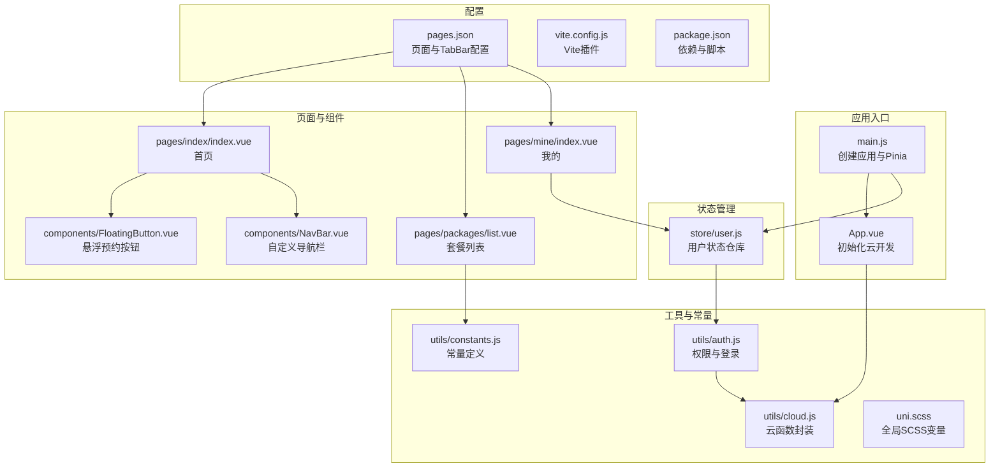

**图表来源**
- [main.js:1-11](file://miniprogram/src/main.js#L1-L11)
- [App.vue:1-26](file://miniprogram/src/App.vue#L1-L26)
- [pages.json:1-177](file://miniprogram/src/pages.json#L1-L177)
- [user.js:1-48](file://miniprogram/src/store/user.js#L1-L48)
- [auth.js:1-47](file://miniprogram/src/utils/auth.js#L1-L47)
- [cloud.js:1-66](file://miniprogram/src/utils/cloud.js#L1-L66)
- [constants.js:1-73](file://miniprogram/src/utils/constants.js#L1-L73)
- [vite.config.js:1-7](file://miniprogram/vite.config.js#L1-L7)
- [index.vue（首页）:1-521](file://miniprogram/src/pages/index/index.vue#L1-L521)
- [list.vue（套餐列表页）:1-305](file://miniprogram/src/pages/packages/list.vue#L1-L305)
- [index.vue（我的页面）:1-309](file://miniprogram/src/pages/mine/index.vue#L1-L309)
- [uni.scss:1-43](file://miniprogram/src/uni.scss#L1-L43)
- [package.json:1-22](file://miniprogram/package.json#L1-L22)

**章节来源**
- [main.js:1-11](file://miniprogram/src/main.js#L1-L11)
- [App.vue:1-26](file://miniprogram/src/App.vue#L1-L26)
- [pages.json:1-177](file://miniprogram/src/pages.json#L1-L177)
- [vite.config.js:1-7](file://miniprogram/vite.config.js#L1-L7)
- [package.json:1-22](file://miniprogram/package.json#L1-L22)

## 核心组件
- 应用入口与状态管理
  - 应用在入口处创建 SSR App 实例并挂载 Pinia，确保全局状态可用。
  - 用户状态仓库使用组合式 Store 定义，暴露登录、获取资料、清理用户信息等方法，并提供只读计算属性表示登录态与管理员态。
- 云函数封装
  - 统一封装 callFunction、uploadFile、getTempFileURL、deleteFile、getDB 等常用云能力，返回 Promise，便于在页面与组件中统一处理错误与结果。
- 权限与登录
  - 提供 login、getUserProfile、isAdmin/isSuperAdmin、checkAuth 等方法，登录流程通过调用云函数 user 实现。
- 常量与样式
  - constants.js 定义套餐分类、客片分类、时间槽、状态枚举、门店信息与标语；uni.scss 定义品牌色、功能色、文字色、背景色、圆角与间距等全局变量，统一视觉规范。

**章节来源**
- [main.js:1-11](file://miniprogram/src/main.js#L1-L11)
- [user.js:1-48](file://miniprogram/src/store/user.js#L1-L48)
- [cloud.js:1-66](file://miniprogram/src/utils/cloud.js#L1-L66)
- [auth.js:1-47](file://miniprogram/src/utils/auth.js#L1-L47)
- [constants.js:1-73](file://miniprogram/src/utils/constants.js#L1-L73)
- [uni.scss:1-43](file://miniprogram/src/uni.scss#L1-L43)

## 架构总览
下图展示从页面到云函数的典型调用链路，以及状态管理在“我的”页面中的使用。

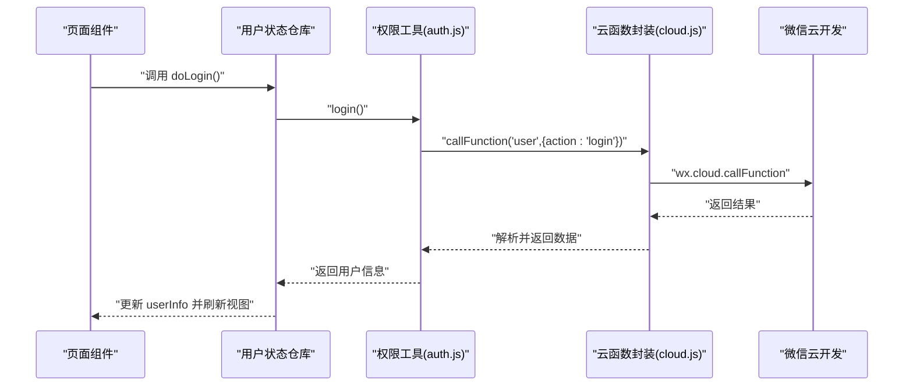

**图表来源**
- [index.vue（我的页面）:74-125](file://miniprogram/src/pages/mine/index.vue#L74-L125)
- [user.js:10-20](file://miniprogram/src/store/user.js#L10-L20)
- [auth.js:7-15](file://miniprogram/src/utils/auth.js#L7-L15)
- [cloud.js:6-26](file://miniprogram/src/utils/cloud.js#L6-L26)

## 详细组件分析

### 页面路由与 TabBar 设计
- 页面注册集中在 pages.json 的 pages 数组中，子包 pages-admin 通过 subPackages 进行分包管理，提升首屏加载性能。
- tabBar 采用静态图标与选中态图标，结合全局 globalStyle 设置导航栏与背景色，统一品牌风格。
- 各页面在 style 中可覆盖标题文本与导航样式，如首页使用自定义导航样式。

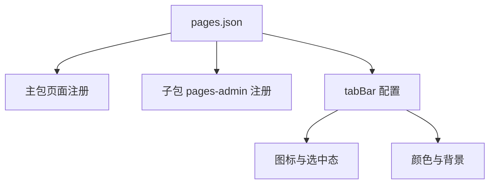

**图表来源**
- [pages.json:1-177](file://miniprogram/src/pages.json#L1-L177)

**章节来源**
- [pages.json:1-177](file://miniprogram/src/pages.json#L1-L177)

### 组件化开发模式
- 自定义导航栏 NavBar：支持动态标题、返回按钮与右侧插槽，适配不同页面需求。
- 悬浮预约按钮 FloatingButton：统一样式与动画，点击后触发事件并跳转至预约页。

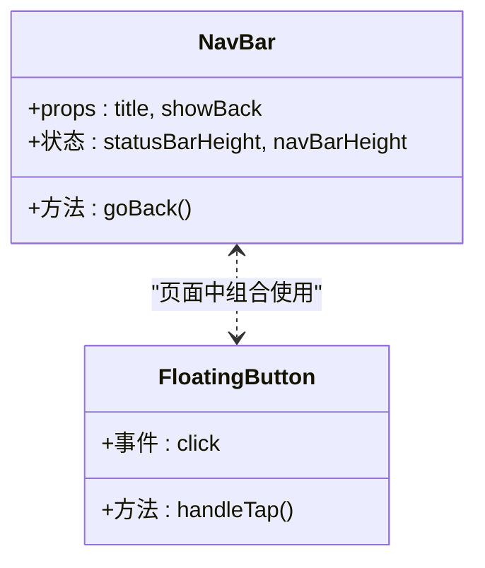

**图表来源**
- [NavBar.vue:1-79](file://miniprogram/src/components/NavBar.vue#L1-L79)
- [FloatingButton.vue:1-48](file://miniprogram/src/components/FloatingButton.vue#L1-L48)

**章节来源**
- [NavBar.vue:1-79](file://miniprogram/src/components/NavBar.vue#L1-L79)
- [FloatingButton.vue:1-48](file://miniprogram/src/components/FloatingButton.vue#L1-L48)

### 状态管理最佳实践（Pinia）
- 使用组合式 Store 定义用户状态，将副作用（登录、获取资料）封装在 Store 内部，页面仅消费状态与调用方法。
- 计算属性 isLoggedIn、isAdminUser 提供只读派生状态，避免在多处重复判断。
- 错误处理集中在 Store 层，页面只需关注 UI 反馈。

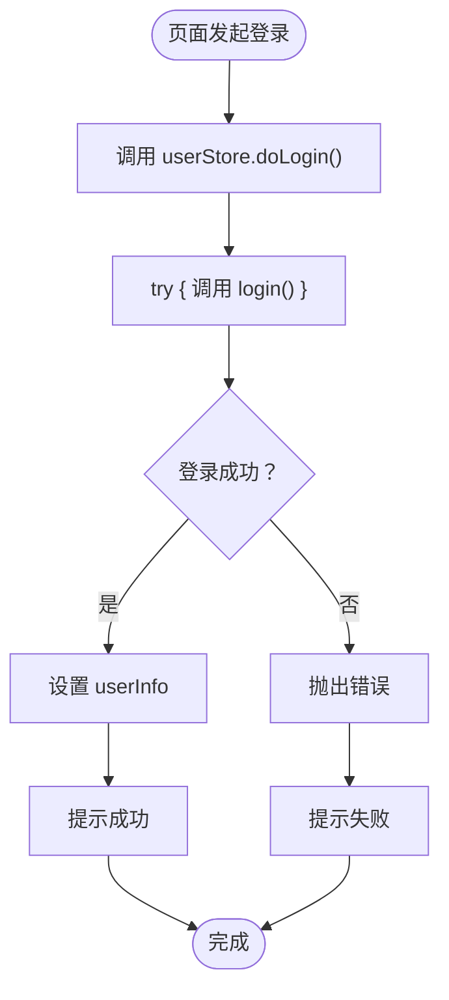

**图表来源**
- [user.js:10-20](file://miniprogram/src/store/user.js#L10-L20)
- [auth.js:7-15](file://miniprogram/src/utils/auth.js#L7-L15)
- [index.vue（我的页面）:82-99](file://miniprogram/src/pages/mine/index.vue#L82-L99)

**章节来源**
- [user.js:1-48](file://miniprogram/src/store/user.js#L1-L48)
- [index.vue（我的页面）:74-125](file://miniprogram/src/pages/mine/index.vue#L74-L125)

### 用户认证流程
- 登录：调用云函数 user 的 login 接口，成功后将用户信息写入 Store。
- 获取资料：调用 getProfile 接口，用于补充用户头像、昵称等信息。
- 权限判断：通过 isAdmin/isSuperAdmin 判断角色，控制管理入口显示。

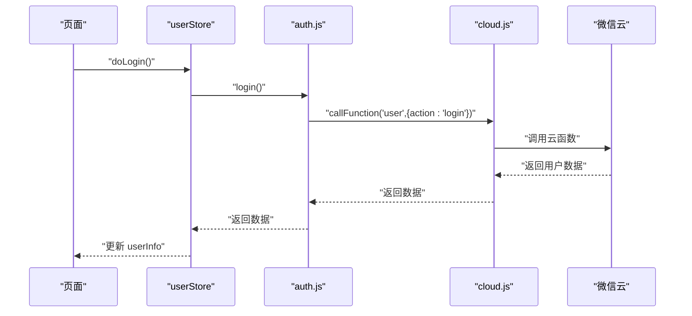

**图表来源**
- [auth.js:7-15](file://miniprogram/src/utils/auth.js#L7-L15)
- [cloud.js:6-26](file://miniprogram/src/utils/cloud.js#L6-L26)
- [user.js:10-20](file://miniprogram/src/store/user.js#L10-L20)

**章节来源**
- [auth.js:1-47](file://miniprogram/src/utils/auth.js#L1-L47)
- [cloud.js:1-66](file://miniprogram/src/utils/cloud.js#L1-L66)
- [user.js:1-48](file://miniprogram/src/store/user.js#L1-L48)

### 云函数调用封装
- callFunction：统一封装 wx.cloud.callFunction，按返回码 code 判定成功或失败，失败时抛出结果对象，便于页面统一处理。
- uploadFile/getTempFileURL/deleteFile：对云存储进行文件上传、获取临时链接与删除文件的 Promise 封装。
- getDB：直接返回数据库引用，便于小程序端进行简单查询。

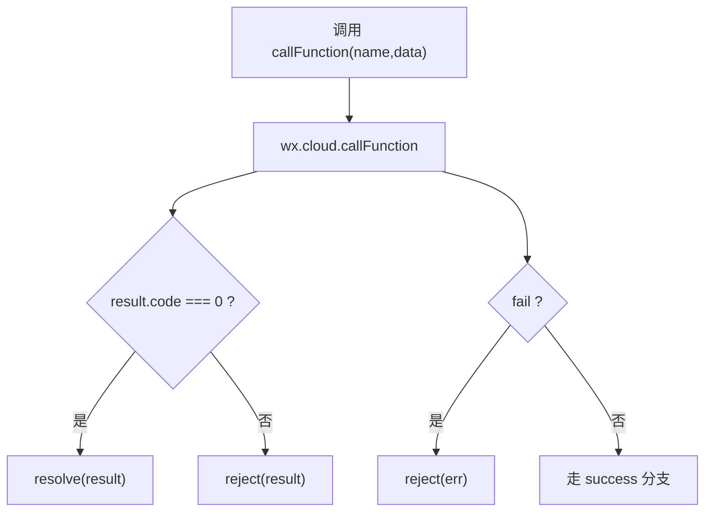

**图表来源**
- [cloud.js:6-26](file://miniprogram/src/utils/cloud.js#L6-L26)

**章节来源**
- [cloud.js:1-66](file://miniprogram/src/utils/cloud.js#L1-L66)

### 页面级业务示例

#### 首页（响应式布局与骨架屏）
- 使用自定义导航栏与滚动监听，实现吸顶效果与标题颜色过渡。
- 轮播图叠加标语，网格展示“必拍场景”，水平滚动展示“热门套餐”。
- 通过云函数获取套餐列表，失败时回退为模拟数据；使用骨架屏提升加载体验。

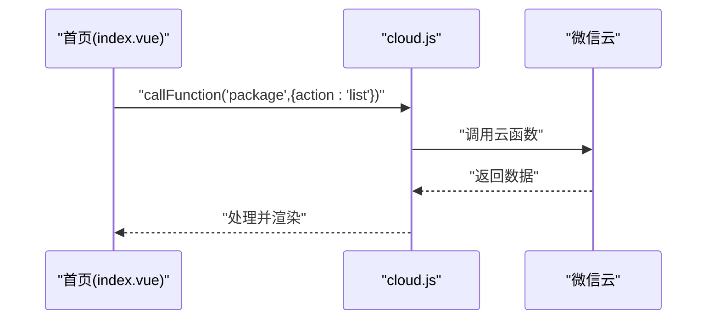

**图表来源**
- [index.vue（首页）:150-178](file://miniprogram/src/pages/index/index.vue#L150-L178)
- [cloud.js:6-26](file://miniprogram/src/utils/cloud.js#L6-L26)

**章节来源**
- [index.vue（首页）:1-521](file://miniprogram/src/pages/index/index.vue#L1-L521)

#### 套餐列表页（分类筛选与空态）
- 顶部分类标签栏，支持横向滚动与激活态指示线。
- 根据当前分类动态请求云函数 package/list，非“全部”时附加 category 参数。
- 使用骨架屏与空状态组件优化用户体验。

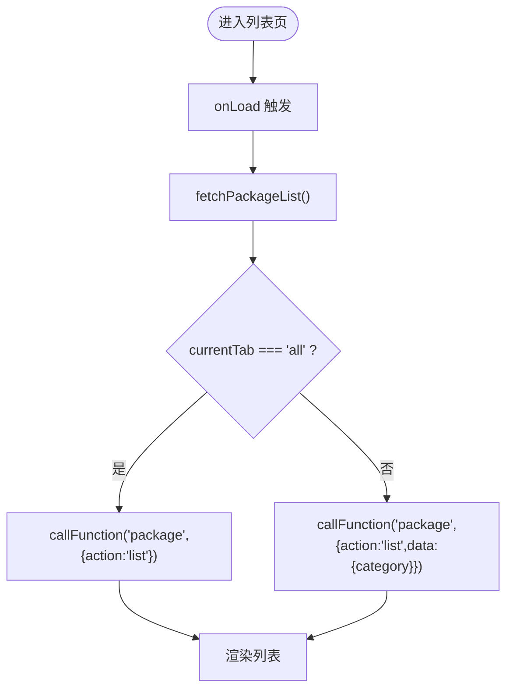

**图表来源**
- [list.vue（套餐列表页）:87-130](file://miniprogram/src/pages/packages/list.vue#L87-L130)
- [cloud.js:6-26](file://miniprogram/src/utils/cloud.js#L6-L26)

**章节来源**
- [list.vue（套餐列表页）:1-305](file://miniprogram/src/pages/packages/list.vue#L1-L305)

#### 我的页面（登录态与管理入口）
- 未登录时展示“点击登录”，登录成功后显示头像与昵称。
- 提供“我的预约/订单/收藏”入口，管理员角色显示“管理后台”入口。
- 电话号码脱敏显示，支持一键拨号与联系客服。

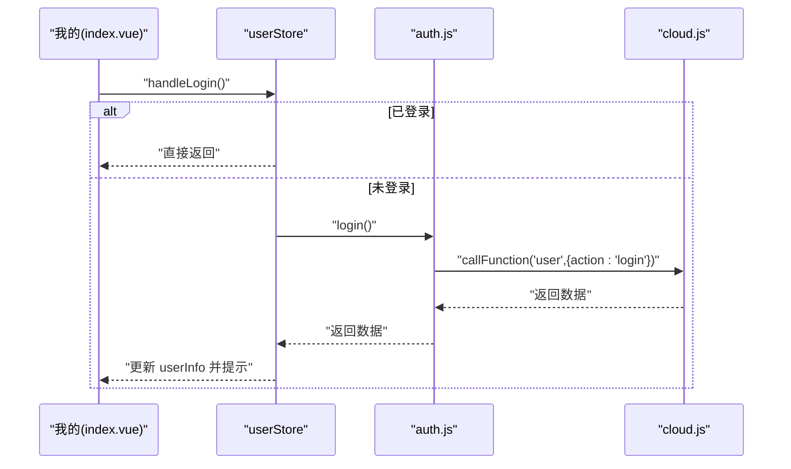

**图表来源**
- [index.vue（我的页面）:82-99](file://miniprogram/src/pages/mine/index.vue#L82-L99)
- [user.js:10-20](file://miniprogram/src/store/user.js#L10-L20)
- [auth.js:7-15](file://miniprogram/src/utils/auth.js#L7-L15)

**章节来源**
- [index.vue（我的页面）:1-309](file://miniprogram/src/pages/mine/index.vue#L1-L309)

## 依赖关系分析
- 应用依赖
  - @dcloudio/uni-app、@dcloudio/uni-mp-weixin、@dcloudio/uni-components 提供跨端运行时与组件生态。
  - vue 与 pinia 提供组合式 API 与状态管理。
  - vite 与 @dcloudio/vite-plugin-uni 提供构建与插件支持。
- 运行与构建
  - npm scripts 提供开发与构建命令，分别针对微信小程序平台。

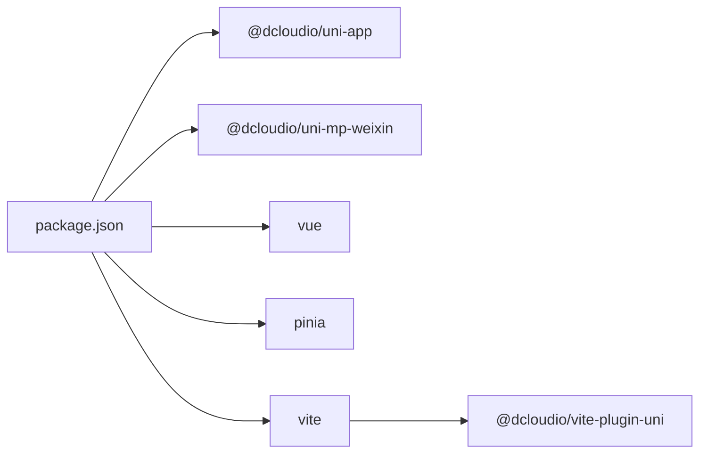

**图表来源**
- [package.json:1-22](file://miniprogram/package.json#L1-L22)
- [vite.config.js:1-7](file://miniprogram/vite.config.js#L1-L7)

**章节来源**
- [package.json:1-22](file://miniprogram/package.json#L1-L22)
- [vite.config.js:1-7](file://miniprogram/vite.config.js#L1-L7)

## 性能考虑
- 分包策略
  - 通过 subPackages 将管理后台页面拆分为独立包，减少主包体积，提升首屏加载速度。
- 图片与资源
  - 使用云存储上传图片并通过 getTempFileURL 获取临时链接，避免直接暴露后端地址。
- 列表渲染
  - 套餐列表使用水平滚动容器与骨架屏，减少首屏白屏时间与布局抖动。
- 状态与副作用
  - 将登录、获取资料等副作用收敛到 Store，避免页面重复发起请求，降低网络开销。
- 样式与主题
  - 通过 uni.scss 统一变量与命名，减少重复样式定义，提高维护效率。

[本节为通用性能建议，不直接分析具体文件，故无章节来源]

## 故障排查指南
- 登录失败
  - 检查云函数 user 的 login 是否正常返回数据；确认 wx.checkSession 状态；查看控制台错误日志。
- 云函数调用异常
  - 核对 callFunction 返回码与错误信息；确认云函数名称与参数格式；检查网络与权限。
- 页面跳转失效
  - 确认 pages.json 中页面路径与导航链接一致；检查 uni.navigateTo 调用参数。
- 样式不生效
  - 检查 scoped 作用域与深度选择器使用；确认 uni.scss 变量是否正确引入；验证 rpx 单位与设备像素比。

**章节来源**
- [auth.js:39-46](file://miniprogram/src/utils/auth.js#L39-L46)
- [cloud.js:6-26](file://miniprogram/src/utils/cloud.js#L6-L26)
- [pages.json:1-177](file://miniprogram/src/pages.json#L1-L177)
- [uni.scss:1-43](file://miniprogram/src/uni.scss#L1-L43)

## 结论
lvpai 前端以 Vue 3 + Pinia + UniApp 为基础，结合统一的云函数封装与状态管理，实现了清晰的页面路由与 TabBar 设计、可复用的组件体系与良好的用户体验。通过分包策略、骨架屏与变量化的样式管理，项目具备良好的可维护性与扩展性。后续可在权限细化、缓存策略与埋点上报等方面进一步完善。

[本节为总结性内容，不直接分析具体文件，故无章节来源]

## 附录

### 开发最佳实践清单
- 页面与组件
  - 使用 Composition API 组织逻辑；将副作用收敛到 Store；合理拆分小组件，保持单一职责。
- 状态管理
  - 使用计算属性派生状态；集中处理错误与回退；避免在组件内直接访问外部副作用。
- 云函数调用
  - 统一错误处理与提示；对敏感数据进行脱敏；对大文件使用云存储与临时链接。
- 样式与主题
  - 全局变量统一管理；遵循 rpx 响应式单位；使用深度选择器时注意作用域。
- 性能与体验
  - 骨架屏与懒加载；分包与按需加载；避免不必要的重渲染。

[本节为通用指导，不直接分析具体文件，故无章节来源]