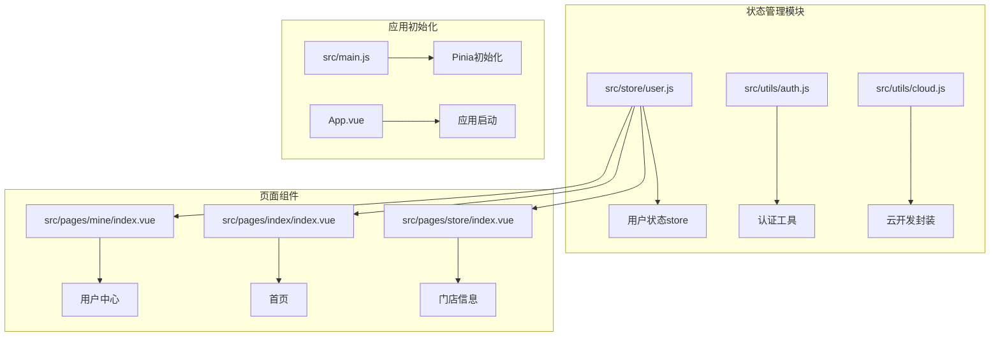
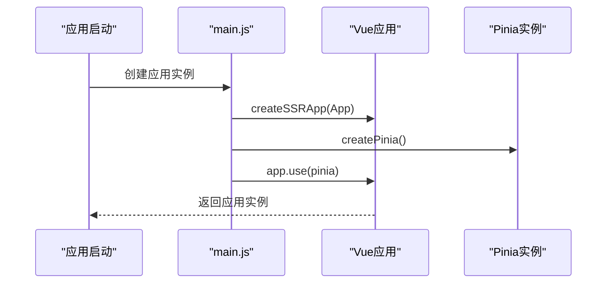
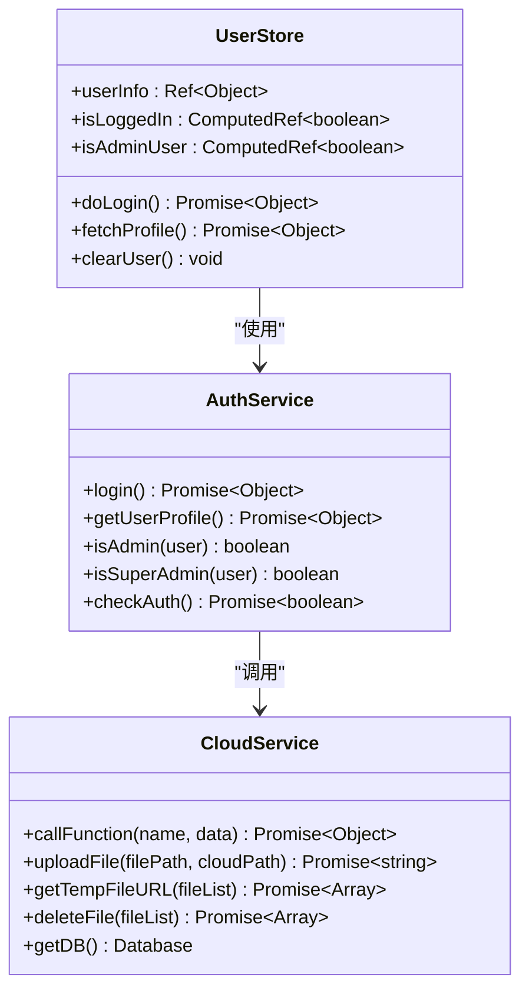
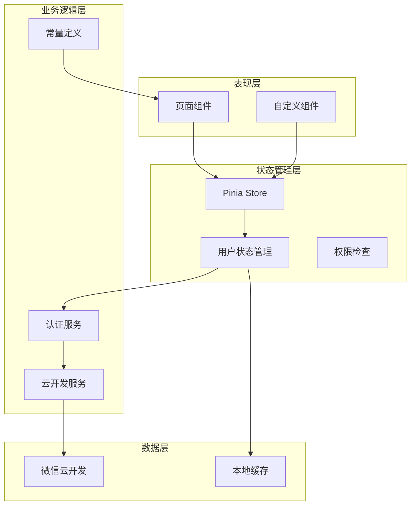
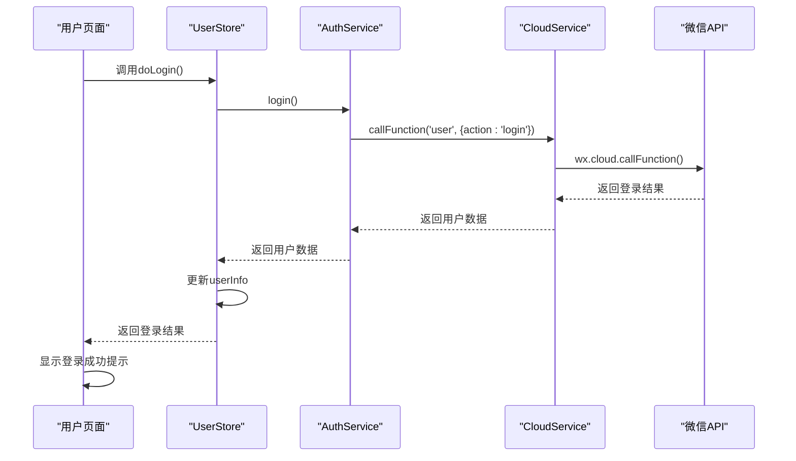
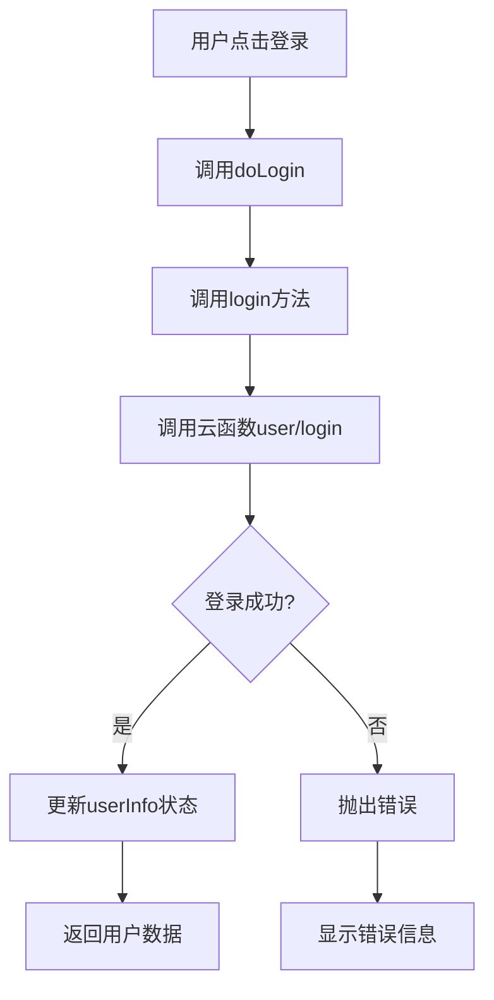
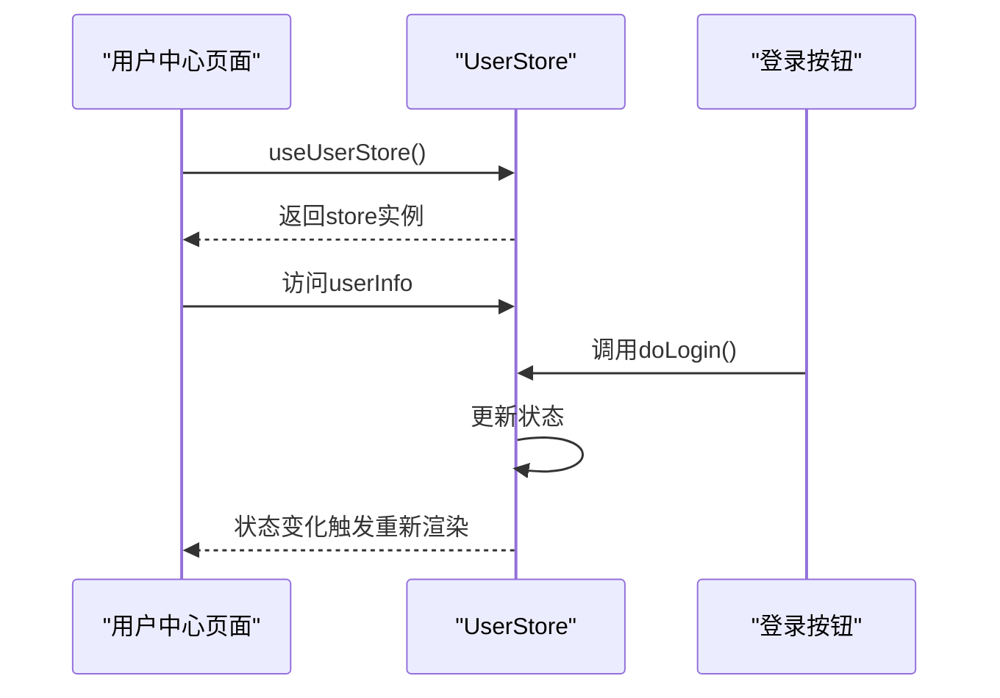
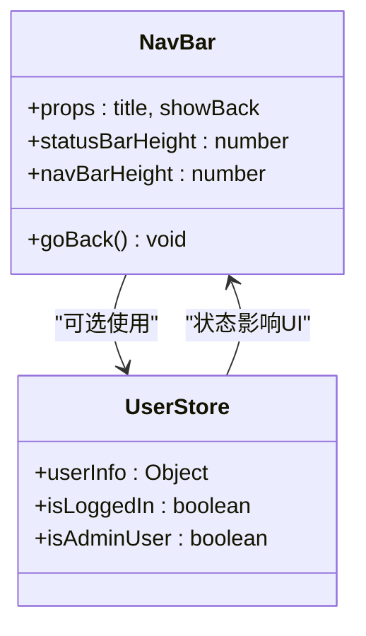
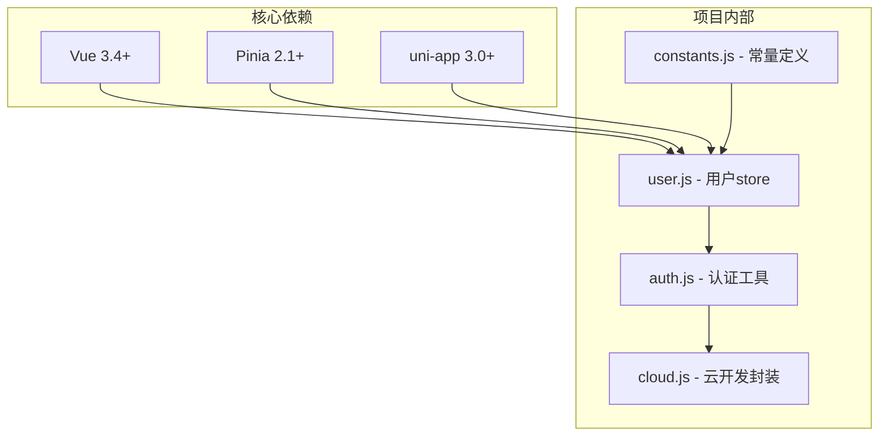
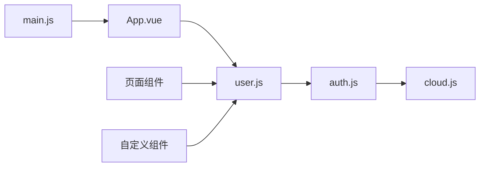

# 状态管理(Pinia)

<cite>
**本文档引用的文件**
- [user.js](file://miniprogram/src/store/user.js)
- [auth.js](file://miniprogram/src/utils/auth.js)
- [cloud.js](file://miniprogram/src/utils/cloud.js)
- [main.js](file://miniprogram/src/main.js)
- [index.vue](file://miniprogram/src/pages/mine/index.vue)
- [index.vue](file://miniprogram/src/pages/index/index.vue)
- [index.vue](file://miniprogram/src/pages/store/index.vue)
- [NavBar.vue](file://miniprogram/src/components/NavBar.vue)
- [constants.js](file://miniprogram/src/utils/constants.js)
- [package.json](file://miniprogram/package.json)
</cite>

## 目录
1. [简介](#简介)
2. [项目结构](#项目结构)
3. [核心组件](#核心组件)
4. [架构概览](#架构概览)
5. [详细组件分析](#详细组件分析)
6. [依赖关系分析](#依赖关系分析)
7. [性能考虑](#性能考虑)
8. [故障排除指南](#故障排除指南)
9. [结论](#结论)

## 简介

本项目采用Pinia作为状态管理解决方案，为微信小程序提供响应式状态管理能力。Pinia是Vue 3官方推荐的状态管理库，相比Vuex具有更简洁的API、更好的TypeScript支持和更小的体积。

在lvpai项目中，Pinia主要用于管理用户认证状态、权限检查和用户信息缓存等功能。通过组合式API风格的store定义，实现了类型安全和更好的开发体验。

## 项目结构

项目采用模块化的文件组织方式，状态管理相关的文件主要位于以下位置：

**图表来源**
- [user.js:1-48](file://miniprogram/src/store/user.js#L1-L48)
- [main.js:1-11](file://miniprogram/src/main.js#L1-L11)

**章节来源**
- [user.js:1-48](file://miniprogram/src/store/user.js#L1-L48)
- [main.js:1-11](file://miniprogram/src/main.js#L1-L11)

## 核心组件

### Pinia Store配置

项目在应用启动时初始化Pinia实例，并将其注册到Vue应用中：

**图表来源**
- [main.js:5-9](file://miniprogram/src/main.js#L5-L9)

### 用户状态管理Store

用户状态管理是Pinia在本项目中的核心应用，定义了完整的用户生命周期管理：

**图表来源**
- [user.js:5-47](file://miniprogram/src/store/user.js#L5-L47)
- [auth.js:6-46](file://miniprogram/src/utils/auth.js#L6-L46)

**章节来源**
- [user.js:1-48](file://miniprogram/src/store/user.js#L1-L48)
- [auth.js:1-47](file://miniprogram/src/utils/auth.js#L1-L47)

## 架构概览

### 状态管理架构

项目采用分层架构设计，将状态管理与业务逻辑分离：

**图表来源**
- [user.js:5-47](file://miniprogram/src/store/user.js#L5-L47)
- [auth.js:6-46](file://miniprogram/src/utils/auth.js#L6-L46)
- [cloud.js:6-65](file://miniprogram/src/utils/cloud.js#L6-L65)

### 组件交互流程

用户登录状态管理的完整流程如下：

**图表来源**
- [index.vue:82-99](file://miniprogram/src/pages/mine/index.vue#L82-L99)
- [user.js:11-20](file://miniprogram/src/store/user.js#L11-L20)
- [auth.js:7-15](file://miniprogram/src/utils/auth.js#L7-L15)
- [cloud.js:6-26](file://miniprogram/src/utils/cloud.js#L6-L26)

**章节来源**
- [index.vue:74-125](file://miniprogram/src/pages/mine/index.vue#L74-L125)

## 详细组件分析

### 用户状态Store实现

#### 状态定义

用户状态Store定义了三个核心状态：

1. **userInfo**: 存储当前用户的完整信息
2. **isLoggedIn**: 基于userInfo的计算属性，判断用户是否已登录
3. **isAdminUser**: 基于用户角色的计算属性，判断是否为管理员

#### Action方法

Store提供了三个核心Action方法：

1. **doLogin**: 处理用户登录流程
2. **fetchProfile**: 获取用户详细信息
3. **clearUser**: 清除用户状态

#### Getter计算属性

通过computed定义的Getter提供了：
- 登录状态检查
- 权限级别判断
- 角色验证

**章节来源**
- [user.js:5-47](file://miniprogram/src/store/user.js#L5-L47)

### 认证服务实现

认证服务封装了所有与用户认证相关的操作：

#### 登录流程

**图表来源**
- [user.js:11-20](file://miniprogram/src/store/user.js#L11-L20)
- [auth.js:7-15](file://miniprogram/src/utils/auth.js#L7-L15)

#### 权限检查

权限检查通过角色字段实现：
- 普通管理员: role === 'admin'
- 超级管理员: role === 'superAdmin'

**章节来源**
- [auth.js:28-36](file://miniprogram/src/utils/auth.js#L28-L36)

### 页面集成示例

#### 用户中心页面集成

用户中心页面展示了Pinia在实际页面中的使用方式：

**图表来源**
- [index.vue:74-99](file://miniprogram/src/pages/mine/index.vue#L74-L99)

**章节来源**
- [index.vue:74-125](file://miniprogram/src/pages/mine/index.vue#L74-L125)

### 组件间状态共享

#### 导航栏组件集成

导航栏组件展示了如何在子组件中使用store：

**图表来源**
- [NavBar.vue:19-36](file://miniprogram/src/components/NavBar.vue#L19-L36)

**章节来源**
- [NavBar.vue:1-79](file://miniprogram/src/components/NavBar.vue#L1-L79)

## 依赖关系分析

### 外部依赖

项目对外部库的依赖关系如下：

**图表来源**
- [package.json:9-14](file://miniprogram/package.json#L9-L14)
- [user.js:1-3](file://miniprogram/src/store/user.js#L1-L3)

### 内部模块依赖

**图表来源**
- [main.js:1-11](file://miniprogram/src/main.js#L1-L11)
- [user.js:1-3](file://miniprogram/src/store/user.js#L1-L3)

**章节来源**
- [package.json:1-22](file://miniprogram/package.json#L1-L22)

## 性能考虑

### 状态更新优化

1. **细粒度状态更新**: 使用ref和computed确保只有相关组件重新渲染
2. **异步操作处理**: 所有异步操作都通过Promise处理，避免阻塞UI线程
3. **错误边界**: 每个异步操作都有try-catch处理，防止应用崩溃

### 内存管理

1. **状态清理**: 提供clearUser方法用于清理用户状态
2. **组件卸载**: Vue组件自动清理响应式依赖
3. **云资源释放**: 云函数调用完成后及时释放资源

### 缓存策略

1. **用户信息缓存**: 登录后缓存用户信息，避免重复请求
2. **权限状态缓存**: 基于用户信息的权限状态通过computed缓存
3. **网络请求去重**: 同一请求在完成前不会重复发起

## 故障排除指南

### 常见问题及解决方案

#### 登录失败

**问题**: 用户登录后状态未更新
**解决方案**: 
1. 检查云函数返回格式是否正确
2. 确认userInfo状态更新逻辑
3. 查看控制台错误日志

#### 权限检查异常

**问题**: 管理员入口不显示
**解决方案**:
1. 验证用户角色字段值
2. 检查isAdmin函数逻辑
3. 确认用户信息缓存状态

#### 状态不同步

**问题**: 多个组件显示不同的用户状态
**解决方案**:
1. 确保所有组件使用同一个store实例
2. 检查store的响应式更新
3. 验证computed属性的依赖关系

**章节来源**
- [user.js:11-37](file://miniprogram/src/store/user.js#L11-L37)
- [auth.js:28-46](file://miniprogram/src/utils/auth.js#L28-L46)

## 结论

lvpai项目中的Pinia状态管理实现展现了现代Vue应用的最佳实践：

### 主要优势

1. **简洁的API**: 组合式API风格使代码更加直观易懂
2. **类型安全**: TypeScript支持提供编译时类型检查
3. **模块化设计**: 清晰的模块分离便于维护和测试
4. **性能优化**: 响应式系统确保最小化重渲染

### 最佳实践

1. **状态集中管理**: 将用户状态集中在单一store中
2. **异步操作封装**: 通过Action封装复杂的异步逻辑
3. **错误处理**: 完善的错误处理机制提升用户体验
4. **权限控制**: 基于角色的权限检查机制

### 改进建议

1. **状态持久化**: 可以考虑添加localStorage持久化
2. **状态重置**: 提供更完善的store重置机制
3. **调试工具**: 集成Pinia DevTools进行开发调试
4. **单元测试**: 为store添加单元测试覆盖

通过合理的架构设计和最佳实践的应用，Pinia为lvpai项目提供了稳定可靠的状态管理解决方案，为后续的功能扩展奠定了良好的基础。