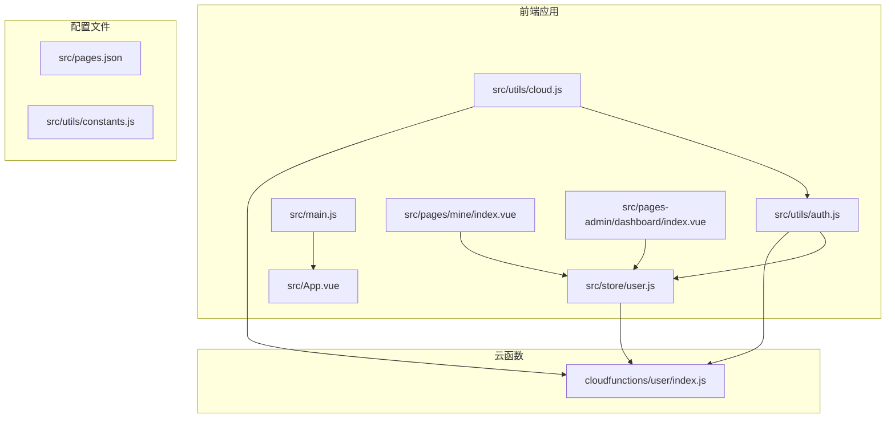
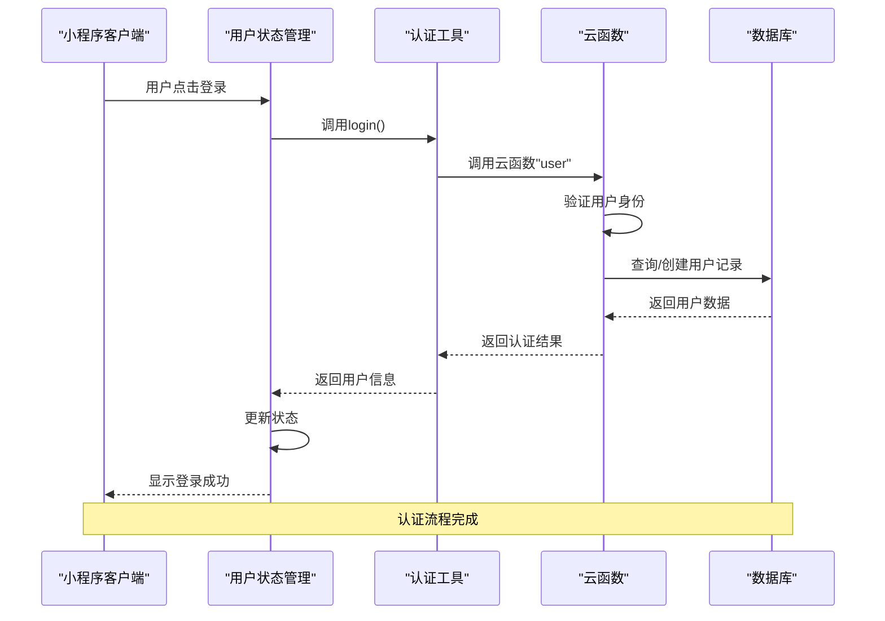
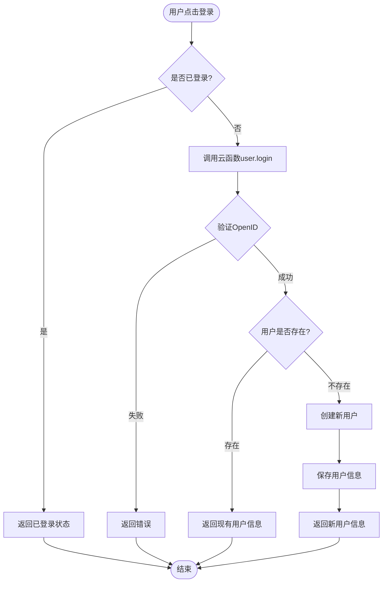
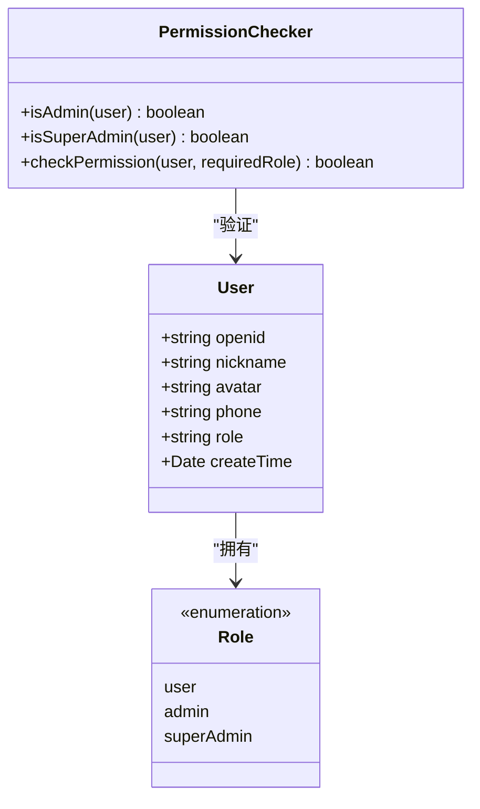
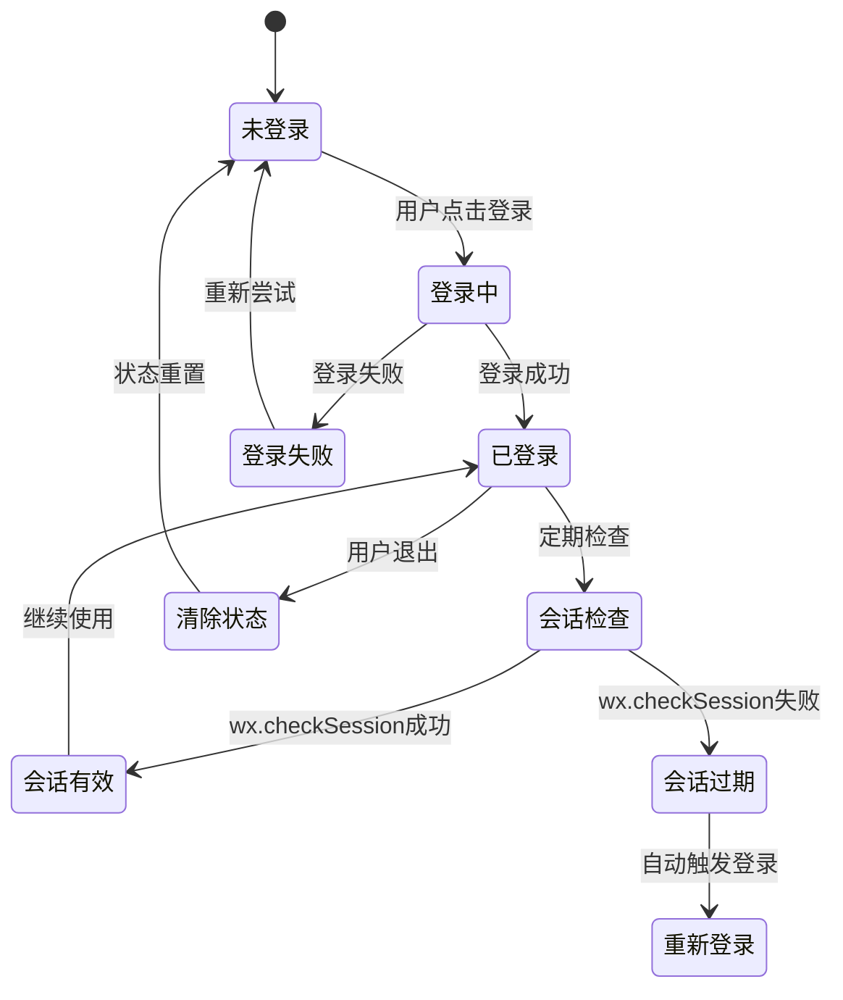
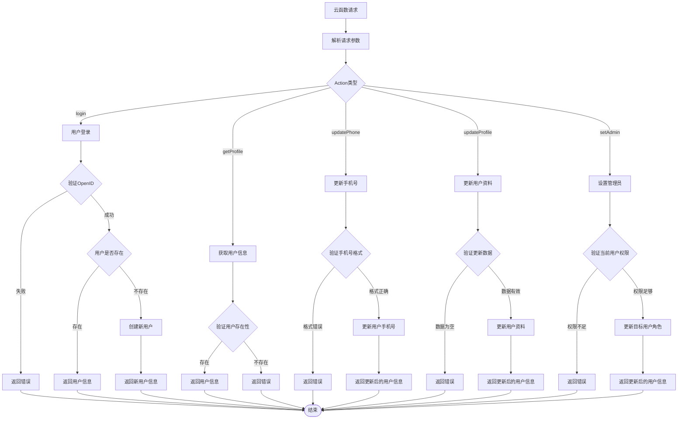
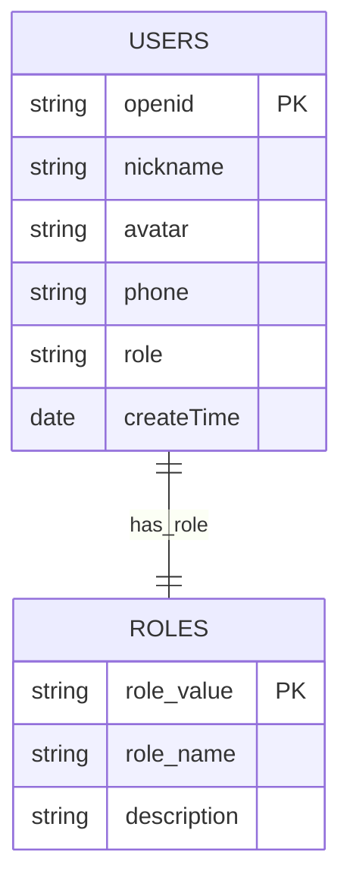
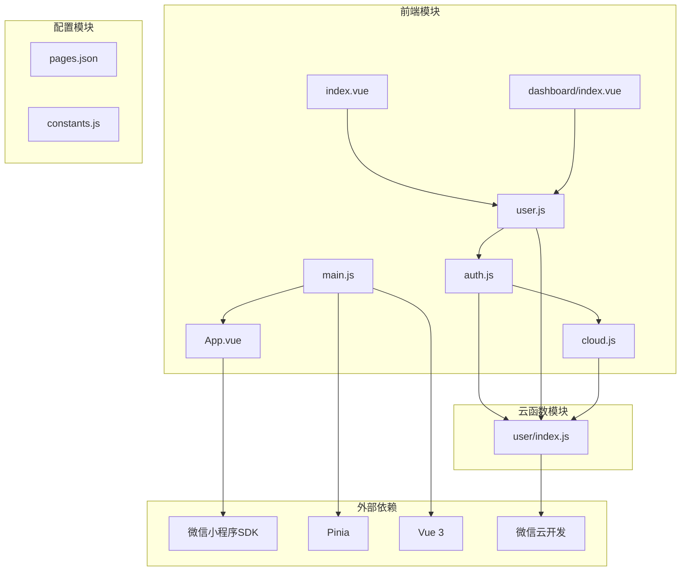

# 用户认证系统

<cite>
**本文档引用的文件**
- [auth.js](file://miniprogram/src/utils/auth.js)
- [user.js](file://miniprogram/src/store/user.js)
- [cloud.js](file://miniprogram/src/utils/cloud.js)
- [index.js](file://miniprogram/cloudfunctions/user/index.js)
- [main.js](file://miniprogram/src/main.js)
- [App.vue](file://miniprogram/src/App.vue)
- [index.vue](file://miniprogram/src/pages/mine/index.vue)
- [index.vue](file://miniprogram/src/pages-admin/dashboard/index.vue)
- [pages.json](file://miniprogram/src/pages.json)
- [constants.js](file://miniprogram/src/utils/constants.js)
</cite>

## 目录
1. [简介](#简介)
2. [项目结构](#项目结构)
3. [核心组件](#核心组件)
4. [架构概览](#架构概览)
5. [详细组件分析](#详细组件分析)
6. [依赖关系分析](#依赖关系分析)
7. [性能考虑](#性能考虑)
8. [故障排除指南](#故障排除指南)
9. [结论](#结论)

## 简介

本项目是一个基于微信小程序的摄影服务平台，用户认证系统是整个应用的核心基础设施。该系统实现了完整的用户身份认证、权限管理和会话管理功能，支持普通用户、管理员和超级管理员三级权限体系。

认证系统采用前后端分离架构，前端使用Vue 3 + Pinia进行状态管理，后端使用微信云开发的云函数提供API服务。系统通过OpenID机制实现用户身份识别，支持自动登录、权限验证和安全的会话管理。

## 项目结构

项目采用模块化组织方式，认证相关的核心文件分布如下：



**图表来源**
- [auth.js:1-47](file://miniprogram/src/utils/auth.js#L1-L47)
- [user.js:1-48](file://miniprogram/src/store/user.js#L1-L48)
- [cloud.js:1-66](file://miniprogram/src/utils/cloud.js#L1-L66)
- [index.js:1-206](file://miniprogram/cloudfunctions/user/index.js#L1-L206)

**章节来源**
- [auth.js:1-47](file://miniprogram/src/utils/auth.js#L1-L47)
- [user.js:1-48](file://miniprogram/src/store/user.js#L1-L48)
- [cloud.js:1-66](file://miniprogram/src/utils/cloud.js#L1-L66)
- [index.js:1-206](file://miniprogram/cloudfunctions/user/index.js#L1-L206)

## 核心组件

### 认证工具模块 (auth.js)

认证工具模块提供了用户认证的核心功能，包括登录、用户信息获取、权限判断和会话检查：

- **登录功能**: 通过调用云函数"user"的"login"操作完成用户登录
- **用户信息获取**: 通过"getProfile"操作获取当前用户的详细信息
- **权限判断**: 提供isAdmin和isSuperAdmin方法进行角色权限验证
- **会话检查**: 使用wx.checkSession检查用户的登录状态

### 用户状态管理 (user.js)

用户状态管理模块基于Pinia实现，负责维护用户认证状态和相关操作：

- **状态管理**: 使用ref管理用户信息，computed计算登录状态和管理员状态
- **登录流程**: doLogin方法封装完整的登录过程
- **信息获取**: fetchProfile方法获取最新的用户信息
- **状态清理**: clearUser方法清除用户状态

### 云函数接口 (cloudfunctions/user/index.js)

云函数提供后端认证服务，处理所有用户相关的业务逻辑：

- **用户登录**: 自动创建新用户或返回现有用户信息
- **用户信息管理**: 支持更新用户资料和手机号
- **权限管理**: 实现管理员角色设置和权限验证
- **数据安全**: 所有操作都基于OpenID进行用户身份验证

**章节来源**
- [auth.js:6-46](file://miniprogram/src/utils/auth.js#L6-L46)
- [user.js:5-47](file://miniprogram/src/store/user.js#L5-L47)
- [index.js:7-31](file://miniprogram/cloudfunctions/user/index.js#L7-L31)

## 架构概览

认证系统采用分层架构设计，确保了良好的代码组织和安全性：



**图表来源**
- [auth.js:7-15](file://miniprogram/src/utils/auth.js#L7-L15)
- [user.js:11-20](file://miniprogram/src/store/user.js#L11-L20)
- [index.js:34-66](file://miniprogram/cloudfunctions/user/index.js#L34-L66)

系统架构特点：
- **前后端分离**: 前端负责UI交互和状态管理，后端提供API服务
- **状态集中管理**: 使用Pinia统一管理用户认证状态
- **安全验证**: 所有敏感操作都在云函数中进行身份验证
- **错误处理**: 完善的异常处理机制确保系统稳定性

## 详细组件分析

### 认证工具模块详细分析

#### 登录流程实现

登录流程是认证系统的核心，实现了从用户触发到状态更新的完整过程：



**图表来源**
- [auth.js:7-15](file://miniprogram/src/utils/auth.js#L7-L15)
- [index.js:34-66](file://miniprogram/cloudfunctions/user/index.js#L34-L66)

#### 权限验证机制

系统实现了三级权限管理体系：



**图表来源**
- [auth.js:28-36](file://miniprogram/src/utils/auth.js#L28-L36)
- [index.js:156-205](file://miniprogram/cloudfunctions/user/index.js#L156-L205)

权限验证规则：
- **普通用户**: 具备基本的用户功能权限
- **管理员**: 在普通权限基础上增加管理功能
- **超级管理员**: 拥有系统最高权限，可以管理其他用户的角色

#### 会话管理策略

系统采用微信原生的会话管理机制：



**图表来源**
- [auth.js:39-46](file://miniprogram/src/utils/auth.js#L39-L46)
- [user.js:35-37](file://miniprogram/src/store/user.js#L35-L37)

### 用户状态管理详细分析

#### Pinia Store设计

用户状态管理模块基于Vue 3的Composition API和Pinia状态管理：

```mermaid
graph LR
subgraph "用户状态管理"
A[userInfo: ref(null)] --> B[isLoggedIn: computed]
C[doLogin: async] --> D[fetchProfile: async]
E[clearUser: function] --> F[isAdminUser: computed]
end
subgraph "认证工具"
G[login] --> H[getUserProfile]
I[isAdmin] --> J[isSuperAdmin]
end
subgraph "云函数"
K[user/index.js]
end
A --> K
C --> G
D --> H
F --> I
```

**图表来源**
- [user.js:5-47](file://miniprogram/src/store/user.js#L5-L47)
- [auth.js:6-36](file://miniprogram/src/utils/auth.js#L6-L36)

状态管理特点：
- **响应式状态**: 使用ref和computed确保状态变化时UI自动更新
- **异步操作**: 所有网络请求都是异步处理
- **错误传播**: 异常会向上抛出，由调用方处理

#### 页面集成模式

不同页面对认证状态的使用方式：

**个人中心页面** (`pages/mine/index.vue`)
- 显示用户登录状态
- 提供登录入口
- 根据权限显示管理入口

**管理后台页面** (`pages-admin/dashboard/index.vue`)
- 进行管理员权限验证
- 无权限时自动跳转首页

**章节来源**
- [user.js:10-37](file://miniprogram/src/store/user.js#L10-L37)
- [index.vue:74-125](file://miniprogram/src/pages/mine/index.vue#L74-L125)
- [index.vue:90-133](file://miniprogram/src/pages-admin/dashboard/index.vue#L90-L133)

### 云函数认证服务详细分析

#### 用户管理功能

云函数实现了完整的用户生命周期管理：



**图表来源**
- [index.js:7-31](file://miniprogram/cloudfunctions/user/index.js#L7-L31)
- [index.js:34-66](file://miniprogram/cloudfunctions/user/index.js#L34-L66)
- [index.js:69-82](file://miniprogram/cloudfunctions/user/index.js#L69-L82)
- [index.js:84-115](file://miniprogram/cloudfunctions/user/index.js#L84-L115)
- [index.js:117-154](file://miniprogram/cloudfunctions/user/index.js#L117-L154)
- [index.js:156-205](file://miniprogram/cloudfunctions/user/index.js#L156-L205)

#### 数据库设计

用户数据模型采用简洁高效的设计：



**图表来源**
- [index.js:48-55](file://miniprogram/cloudfunctions/user/index.js#L48-L55)

数据模型特点：
- **OpenID主键**: 基于微信OpenID确保用户唯一性
- **角色字段**: 支持灵活的权限分级
- **时间戳**: 记录用户创建时间便于统计分析

**章节来源**
- [index.js:34-205](file://miniprogram/cloudfunctions/user/index.js#L34-L205)

## 依赖关系分析

### 模块依赖图



**图表来源**
- [auth.js:4](file://miniprogram/src/utils/auth.js#L4)
- [user.js:3](file://miniprogram/src/store/user.js#L3)
- [main.js:2](file://miniprogram/src/main.js#L2)
- [App.vue:6](file://miniprogram/src/App.vue#L6)

### 关键依赖关系

1. **认证工具依赖云函数**: auth.js通过callFunction封装所有云函数调用
2. **状态管理依赖认证工具**: user.js依赖auth.js提供的认证方法
3. **页面依赖状态管理**: 各页面组件依赖user.js提供的用户状态
4. **云函数依赖数据库**: user/index.js直接操作云数据库

### 循环依赖检测

经过分析，系统中不存在循环依赖：
- auth.js不依赖user.js
- user.js只依赖auth.js，不反向依赖
- 云函数独立运行，不依赖前端模块

**章节来源**
- [auth.js:4](file://miniprogram/src/utils/auth.js#L4)
- [user.js:3](file://miniprogram/src/store/user.js#L3)
- [main.js:2](file://miniprogram/src/main.js#L2)

## 性能考虑

### 认证性能优化

1. **状态缓存策略**: 用户信息在Pinia中缓存，避免重复请求
2. **会话复用**: 使用微信原生会话机制减少重复登录
3. **懒加载**: 云函数按需调用，避免不必要的网络请求
4. **错误快速响应**: 异常情况立即返回，减少等待时间

### 数据库性能

1. **索引优化**: OpenID作为查询条件，天然具备索引优势
2. **批量操作**: 支持批量更新用户资料，减少数据库往返
3. **事务处理**: 关键操作使用事务确保数据一致性

### 安全性能

1. **权限检查**: 所有敏感操作都进行权限验证
2. **输入验证**: 严格的参数验证防止恶意输入
3. **会话安全**: 基于微信平台的安全机制

## 故障排除指南

### 常见问题及解决方案

#### 登录失败问题

**问题现象**: 用户点击登录无响应或显示登录失败

**可能原因**:
1. 网络连接异常
2. 云函数调用失败
3. 用户授权被拒绝

**解决步骤**:
1. 检查网络连接状态
2. 查看云函数日志
3. 确认用户授权状态

#### 权限验证失败

**问题现象**: 管理员功能无法使用

**可能原因**:
1. 用户角色不是管理员
2. 云函数权限验证失败
3. 状态同步问题

**解决步骤**:
1. 检查用户角色信息
2. 验证云函数权限逻辑
3. 重新登录刷新状态

#### 会话过期问题

**问题现象**: 已登录用户突然需要重新登录

**可能原因**:
1. 微信会话过期
2. 网络异常导致状态不同步
3. 应用重启

**解决步骤**:
1. 检查wx.checkSession返回状态
2. 实现自动重新登录机制
3. 优化状态持久化

### 调试技巧

1. **启用详细日志**: 在开发环境中开启详细的console输出
2. **使用开发者工具**: 利用微信开发者工具的调试功能
3. **监控云函数**: 查看云函数的执行时间和错误日志
4. **状态检查**: 定期检查Pinia状态的同步情况

**章节来源**
- [auth.js:11-14](file://miniprogram/src/utils/auth.js#L11-L14)
- [user.js:16-19](file://miniprogram/src/store/user.js#L16-L19)
- [index.js:27-30](file://miniprogram/cloudfunctions/user/index.js#L27-L30)

## 结论

本用户认证系统实现了完整的身份认证、权限管理和会话管理功能。系统采用现代化的技术栈，具有以下优势：

1. **架构清晰**: 前后端分离，职责明确
2. **安全可靠**: 基于微信平台的安全机制，严格的权限验证
3. **易于扩展**: 模块化设计，便于功能扩展和维护
4. **用户体验**: 流畅的登录体验和完善的错误处理

系统的主要特点包括：
- 基于OpenID的用户身份识别
- 三级权限管理体系
- 响应式的状态管理
- 完善的错误处理机制
- 安全的数据传输

未来可以考虑的改进方向：
- 添加Token刷新机制
- 实现更细粒度的权限控制
- 增加多设备登录管理
- 优化性能监控和日志记录