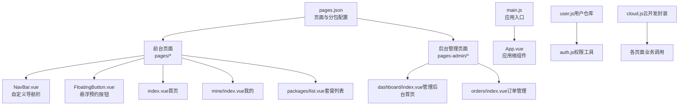
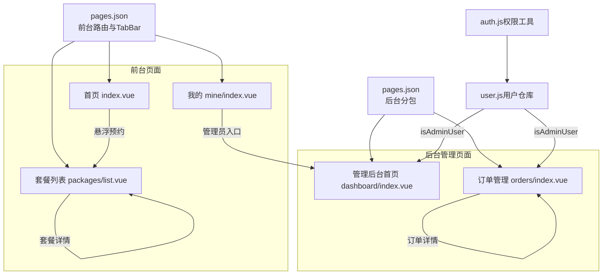
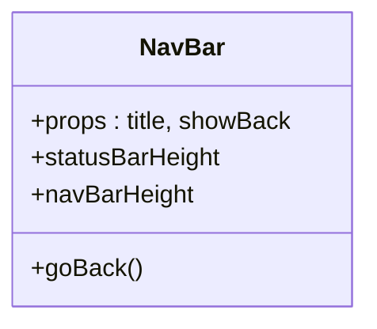
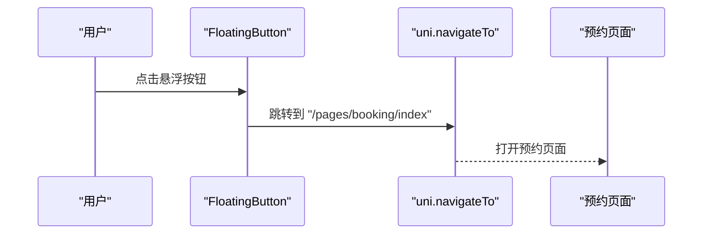
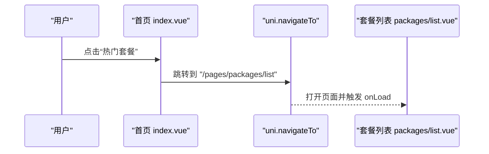
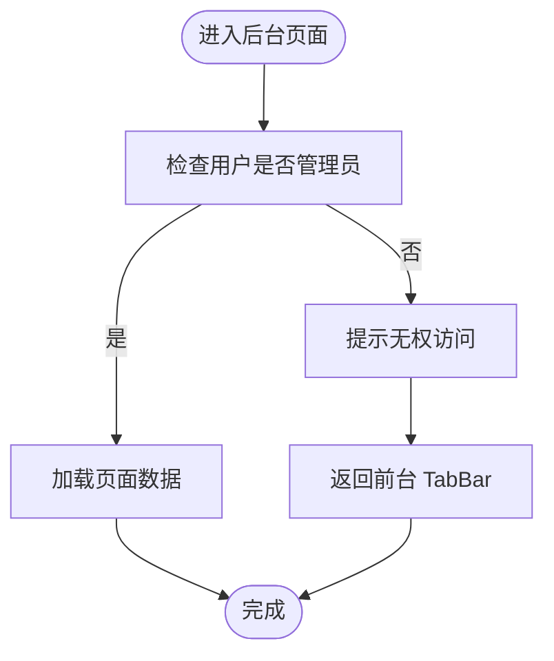
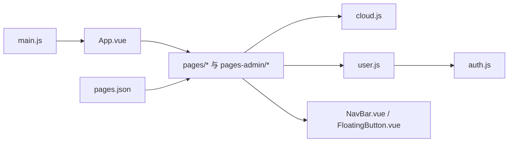

# 路由与导航

<cite>
**本文引用的文件**
- [pages.json](file://miniprogram/src/pages.json)
- [main.js](file://miniprogram/src/main.js)
- [App.vue](file://miniprogram/src/App.vue)
- [NavBar.vue](file://miniprogram/src/components/NavBar.vue)
- [FloatingButton.vue](file://miniprogram/src/components/FloatingButton.vue)
- [index.vue（首页）](file://miniprogram/src/pages/index/index.vue)
- [mine/index.vue（我的）](file://miniprogram/src/pages/mine/index.vue)
- [packages/list.vue（套餐列表）](file://miniprogram/src/pages/packages/list.vue)
- [dashboard/index.vue（管理后台首页）](file://miniprogram/src/pages-admin/dashboard/index.vue)
- [orders/index.vue（订单管理）](file://miniprogram/src/pages-admin/orders/index.vue)
- [auth.js](file://miniprogram/src/utils/auth.js)
- [user.js（用户仓库）](file://miniprogram/src/store/user.js)
- [cloud.js（云开发封装）](file://miniprogram/src/utils/cloud.js)
- [constants.js（常量定义）](file://miniprogram/src/utils/constants.js)
</cite>

## 目录
1. [简介](#简介)
2. [项目结构](#项目结构)
3. [核心组件](#核心组件)
4. [架构总览](#架构总览)
5. [详细组件分析](#详细组件分析)
6. [依赖关系分析](#依赖关系分析)
7. [性能考量](#性能考量)
8. [故障排查指南](#故障排查指南)
9. [结论](#结论)
10. [附录](#附录)

## 简介
本文件系统化梳理该 UniApp 项目的路由与导航体系，围绕以下目标展开：
- 深入解析 pages.json 的页面路由定义、分包与 TabBar 配置、全局导航样式
- 解释页面跳转机制、参数传递方式、权限控制与路由守卫实现
- 对比前台页面与后台管理页面的路由差异与权限控制策略
- 提供常见导航场景（条件跳转、返回逻辑、页面传参）的实际示例
- 探讨路由性能优化、懒加载策略与多端兼容性处理
- 总结导航组件的自定义实现与最佳实践

## 项目结构
该项目采用典型的 UniApp 结构：前台页面位于 pages 目录，后台管理页面位于 pages-admin 目录；通过分包配置实现资源按需加载；使用 Pinia 进行状态管理；通过云函数封装统一调用后端能力。

图表来源
- [pages.json:1-177](file://miniprogram/src/pages.json#L1-L177)
- [main.js:1-11](file://miniprogram/src/main.js#L1-L11)
- [App.vue:1-26](file://miniprogram/src/App.vue#L1-L26)
- [NavBar.vue:1-79](file://miniprogram/src/components/NavBar.vue#L1-L79)
- [FloatingButton.vue:1-48](file://miniprogram/src/components/FloatingButton.vue#L1-L48)
- [index.vue（首页）:1-521](file://miniprogram/src/pages/index/index.vue#L1-L521)
- [mine/index.vue（我的）:1-309](file://miniprogram/src/pages/mine/index.vue#L1-L309)
- [packages/list.vue（套餐列表）:1-305](file://miniprogram/src/pages/packages/list.vue#L1-L305)
- [dashboard/index.vue（管理后台首页）:1-295](file://miniprogram/src/pages-admin/dashboard/index.vue#L1-L295)
- [orders/index.vue（订单管理）:1-402](file://miniprogram/src/pages-admin/orders/index.vue#L1-L402)
- [user.js（用户仓库）:1-48](file://miniprogram/src/store/user.js#L1-L48)
- [auth.js（权限工具）:1-47](file://miniprogram/src/utils/auth.js#L1-L47)
- [cloud.js（云开发封装）:1-66](file://miniprogram/src/utils/cloud.js#L1-L66)

章节来源
- [pages.json:1-177](file://miniprogram/src/pages.json#L1-L177)
- [main.js:1-11](file://miniprogram/src/main.js#L1-L11)
- [App.vue:1-26](file://miniprogram/src/App.vue#L1-L26)

## 核心组件
- 页面路由与分包：前台页面与后台管理页面分别声明于 pages 与 subPackages，便于资源隔离与按需加载
- TabBar：统一的底部导航，包含首页、套餐、客片、门店、我的五个入口
- 全局样式：统一的导航栏文字颜色、背景色与页面背景色
- 自定义导航栏：NavBar 组件提供可复用的标题栏与返回逻辑
- 悬浮按钮：FloatingButton 统一触发预约跳转
- 权限与用户状态：Pinia 用户仓库与权限工具，支撑后台路由守卫
- 云开发封装：统一调用云函数，简化页面与后台管理的数据交互

章节来源
- [pages.json:1-177](file://miniprogram/src/pages.json#L1-L177)
- [NavBar.vue:1-79](file://miniprogram/src/components/NavBar.vue#L1-L79)
- [FloatingButton.vue:1-48](file://miniprogram/src/components/FloatingButton.vue#L1-L48)
- [user.js（用户仓库）:1-48](file://miniprogram/src/store/user.js#L1-L48)
- [auth.js（权限工具）:1-47](file://miniprogram/src/utils/auth.js#L1-L47)
- [cloud.js（云开发封装）:1-66](file://miniprogram/src/utils/cloud.js#L1-L66)

## 架构总览
下图展示前台与后台页面的路由关系、权限守卫与页面跳转流程。

图表来源
- [pages.json:1-177](file://miniprogram/src/pages.json#L1-L177)
- [index.vue（首页）:1-521](file://miniprogram/src/pages/index/index.vue#L1-L521)
- [mine/index.vue（我的）:1-309](file://miniprogram/src/pages/mine/index.vue#L1-L309)
- [packages/list.vue（套餐列表）:1-305](file://miniprogram/src/pages/packages/list.vue#L1-L305)
- [dashboard/index.vue（管理后台首页）:1-295](file://miniprogram/src/pages-admin/dashboard/index.vue#L1-L295)
- [orders/index.vue（订单管理）:1-402](file://miniprogram/src/pages-admin/orders/index.vue#L1-L402)
- [user.js（用户仓库）:1-48](file://miniprogram/src/store/user.js#L1-L48)
- [auth.js（权限工具）:1-47](file://miniprogram/src/utils/auth.js#L1-L47)

## 详细组件分析

### pages.json 配置详解
- 页面路由定义：前台页面在 pages 数组中声明，每个页面包含路径与样式（如导航栏标题、自定义导航样式）
- 分包配置：后台管理页面位于 subPackages，根目录为 pages-admin，内部包含多个子页面
- TabBar 配置：定义颜色、背景色、边框样式与列表项（pagePath、文本、图标路径），与前台页面路径一一对应
- 全局样式：统一设置导航栏文字颜色、标题与背景色

章节来源
- [pages.json:1-177](file://miniprogram/src/pages.json#L1-L177)

### 自定义导航栏组件 NavBar
- 功能：提供标题、左侧返回按钮、右侧插槽，支持动态计算导航栏高度
- 返回逻辑：通过 uni.navigateBack 实现返回上一页
- 使用场景：首页等需要自定义样式的页面

图表来源
- [NavBar.vue:1-79](file://miniprogram/src/components/NavBar.vue#L1-L79)

章节来源
- [NavBar.vue:1-79](file://miniprogram/src/components/NavBar.vue#L1-L79)

### 悬浮预约按钮 FloatingButton
- 功能：点击后触发 uni.navigateTo 跳转至预约页面
- 使用场景：首页、套餐列表等页面的快速入口

图表来源
- [FloatingButton.vue:1-48](file://miniprogram/src/components/FloatingButton.vue#L1-L48)

章节来源
- [FloatingButton.vue:1-48](file://miniprogram/src/components/FloatingButton.vue#L1-L48)

### 前台页面跳转与参数传递
- 首页 index.vue：提供快捷入口与地图导航；点击“门店”时使用 uni.openLocation 打开地图；点击其他入口使用 uni.navigateTo 跳转
- 我的 mine/index.vue：根据用户登录状态与角色决定是否显示管理入口；使用 uni.navigateTo 传递查询参数（如 type=booking）
- 套餐列表 packages/list.vue：使用 onLoad 生命周期加载数据；切换分类时通过参数过滤

图表来源
- [index.vue（首页）:180-198](file://miniprogram/src/pages/index/index.vue#L180-L198)
- [packages/list.vue（套餐列表）:127-130](file://miniprogram/src/pages/packages/list.vue#L127-L130)

章节来源
- [index.vue（首页）:180-198](file://miniprogram/src/pages/index/index.vue#L180-L198)
- [packages/list.vue（套餐列表）:87-92](file://miniprogram/src/pages/packages/list.vue#L87-L92)
- [packages/list.vue（套餐列表）:127-130](file://miniprogram/src/pages/packages/list.vue#L127-L130)

### 后台管理页面与权限控制
- 管理后台首页 dashboard/index.vue：检查用户是否管理员，非管理员则提示并返回前台 TabBar
- 订单管理 orders/index.vue：同样进行管理员权限校验，失败时提示并返回前台 TabBar
- 权限工具：auth.js 提供 isAdmin、isSuperAdmin、checkAuth 等方法；user.js 使用 Pinia 管理用户状态与权限判断

图表来源
- [dashboard/index.vue（管理后台首页）:90-103](file://miniprogram/src/pages-admin/dashboard/index.vue#L90-L103)
- [orders/index.vue（订单管理）:106-119](file://miniprogram/src/pages-admin/orders/index.vue#L106-L119)
- [auth.js（权限工具）:28-36](file://miniprogram/src/utils/auth.js#L28-L36)
- [user.js（用户仓库）:5-8](file://miniprogram/src/store/user.js#L5-L8)

章节来源
- [dashboard/index.vue（管理后台首页）:90-103](file://miniprogram/src/pages-admin/dashboard/index.vue#L90-L103)
- [orders/index.vue（订单管理）:106-119](file://miniprogram/src/pages-admin/orders/index.vue#L106-L119)
- [auth.js（权限工具）:28-36](file://miniprogram/src/utils/auth.js#L28-L36)
- [user.js（用户仓库）:5-8](file://miniprogram/src/store/user.js#L5-L8)

### 页面返回逻辑
- 自定义导航栏：NavBar 组件提供 goBack 方法，使用 uni.navigateBack 返回上一页
- 页面内返回：部分页面在特定条件下调用 uni.navigateBack 或 uni.switchTab

章节来源
- [NavBar.vue:34-36](file://miniprogram/src/components/NavBar.vue#L34-L36)
- [dashboard/index.vue（管理后台首页）:97-99](file://miniprogram/src/pages-admin/dashboard/index.vue#L97-L99)
- [orders/index.vue（订单管理）:113-115](file://miniprogram/src/pages-admin/orders/index.vue#L113-L115)

### 参数传递与条件跳转
- 查询参数：我的页面通过 uni.navigateTo 传递查询参数（如 type=booking）
- 条件跳转：首页根据路径类型选择 uni.openLocation 或 uni.navigateTo
- 分类筛选：套餐列表通过参数过滤不同分类

章节来源
- [mine/index.vue（我的）:22-33](file://miniprogram/src/pages/mine/index.vue#L22-L33)
- [index.vue（首页）:182-192](file://miniprogram/src/pages/index/index.vue#L182-L192)
- [packages/list.vue（套餐列表）:103-105](file://miniprogram/src/pages/packages/list.vue#L103-L105)

### TabBar 与页面样式
- TabBar 列表项与前台页面路径一一对应，确保点击后正确跳转
- 全局样式统一导航栏与页面背景色，提升一致性

章节来源
- [pages.json:132-169](file://miniprogram/src/pages.json#L132-L169)
- [pages.json:170-175](file://miniprogram/src/pages.json#L170-L175)

## 依赖关系分析
- 应用入口：main.js 创建应用实例并挂载 Pinia
- 根组件：App.vue 初始化云开发能力
- 页面与组件：各页面依赖 NavBar、FloatingButton 等组件；通过 cloud.js 调用云函数；通过 user.js 与 auth.js 进行权限判断
- 分包与路由：pages.json 决定页面与分包结构，影响打包体积与运行时加载

图表来源
- [main.js:1-11](file://miniprogram/src/main.js#L1-L11)
- [App.vue:1-26](file://miniprogram/src/App.vue#L1-L26)
- [cloud.js（云开发封装）:1-66](file://miniprogram/src/utils/cloud.js#L1-L66)
- [user.js（用户仓库）:1-48](file://miniprogram/src/store/user.js#L1-L48)
- [auth.js（权限工具）:1-47](file://miniprogram/src/utils/auth.js#L1-L47)
- [NavBar.vue:1-79](file://miniprogram/src/components/NavBar.vue#L1-L79)
- [FloatingButton.vue:1-48](file://miniprogram/src/components/FloatingButton.vue#L1-L48)
- [pages.json:1-177](file://miniprogram/src/pages.json#L1-L177)

章节来源
- [main.js:1-11](file://miniprogram/src/main.js#L1-L11)
- [App.vue:1-26](file://miniprogram/src/App.vue#L1-L26)
- [cloud.js（云开发封装）:1-66](file://miniprogram/src/utils/cloud.js#L1-L66)
- [user.js（用户仓库）:1-48](file://miniprogram/src/store/user.js#L1-L48)
- [auth.js（权限工具）:1-47](file://miniprogram/src/utils/auth.js#L1-L47)
- [NavBar.vue:1-79](file://miniprogram/src/components/NavBar.vue#L1-L79)
- [FloatingButton.vue:1-48](file://miniprogram/src/components/FloatingButton.vue#L1-L48)
- [pages.json:1-177](file://miniprogram/src/pages.json#L1-L177)

## 性能考量
- 分包策略：后台管理页面置于 subPackages，避免前台页面加载不必要的后台资源，降低首屏体积
- 按需加载：前台页面与后台页面分离，减少公共代码重复加载
- 组件复用：自定义 NavBar 与 FloatingButton 在多个页面复用，减少重复逻辑
- 云函数封装：统一调用云函数，减少页面内重复逻辑与错误处理分散
- 列表加载优化：后台订单列表支持下拉刷新与上拉加载更多，结合分页参数控制数据量

章节来源
- [pages.json:77-131](file://miniprogram/src/pages.json#L77-L131)
- [orders/index.vue（订单管理）:132-209](file://miniprogram/src/pages-admin/orders/index.vue#L132-L209)
- [cloud.js（云开发封装）:1-66](file://miniprogram/src/utils/cloud.js#L1-L66)

## 故障排查指南
- 权限不足：后台页面若非管理员访问，会提示无权访问并返回前台 TabBar。检查用户状态与权限判断逻辑
- 页面无法跳转：确认 pages.json 中路径与页面实际路径一致；检查 uni.navigateTo 参数格式
- 返回异常：确认 NavBar 组件的 goBack 是否被正确调用；必要时使用 uni.navigateBack 并设置 delta
- 数据加载失败：检查云函数调用封装与错误处理；查看控制台日志定位问题

章节来源
- [dashboard/index.vue（管理后台首页）:90-103](file://miniprogram/src/pages-admin/dashboard/index.vue#L90-L103)
- [orders/index.vue（订单管理）:106-119](file://miniprogram/src/pages-admin/orders/index.vue#L106-L119)
- [NavBar.vue:34-36](file://miniprogram/src/components/NavBar.vue#L34-L36)
- [cloud.js（云开发封装）:1-66](file://miniprogram/src/utils/cloud.js#L1-L66)

## 结论
本项目通过清晰的 pages.json 配置、分包策略与自定义导航组件，构建了前台与后台分离的路由体系。权限控制通过 Pinia 与权限工具实现，后台页面在进入时进行管理员校验，保障安全。页面跳转与参数传递遵循统一规范，结合云函数封装提升了可维护性。建议在后续迭代中进一步引入路由守卫与更细粒度的懒加载策略，以进一步优化性能与用户体验。

## 附录
- 常用跳转方法
  - uni.navigateTo：保留当前页面，打开新页面
  - uni.redirectTo：关闭当前页面，打开新页面
  - uni.switchTab：跳转到 TabBar 页面
  - uni.navigateBack：返回上一页或多页
- 常见参数传递方式
  - 查询字符串：如 ?id=123&type=xxx
  - 路径参数：在 pages.json 中定义动态段并在页面中接收
- 多端兼容性
  - 使用 uni-app API 保证在小程序、H5、App 等平台的一致行为
  - 注意不同平台对导航栏、TabBar 的差异化表现，必要时通过条件编译或样式适配