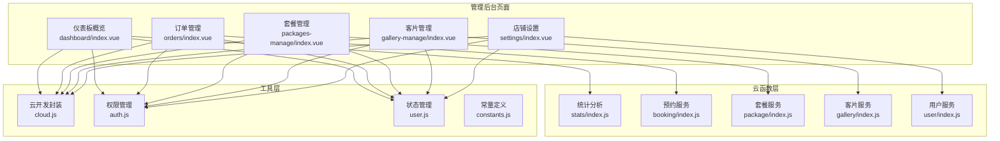
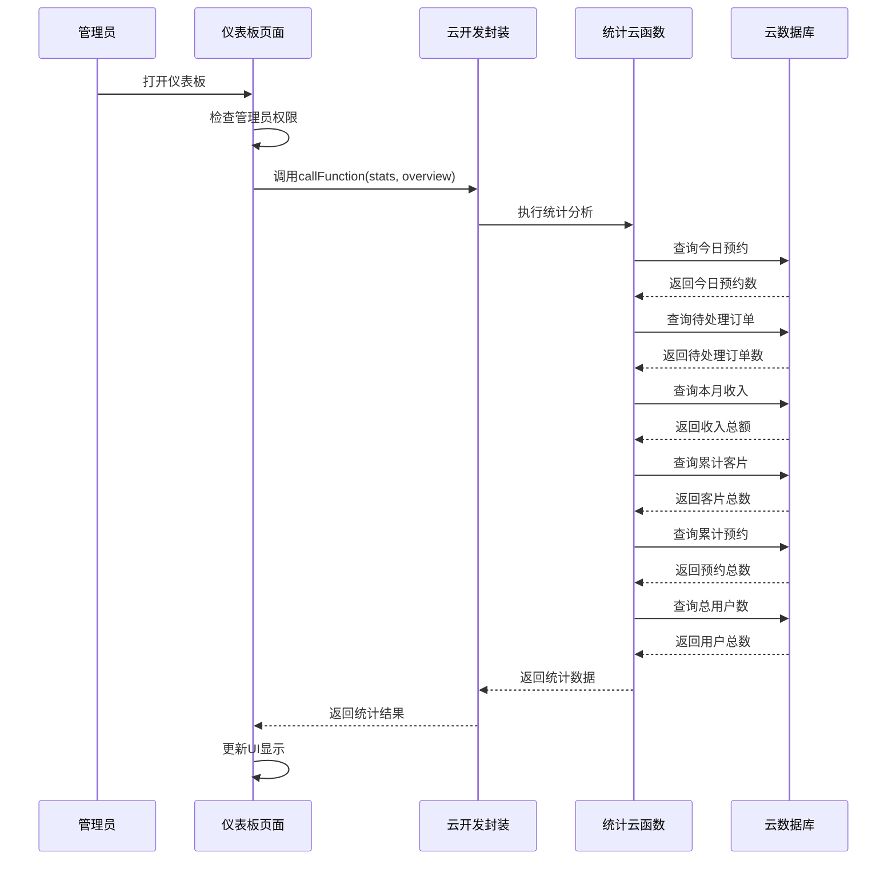
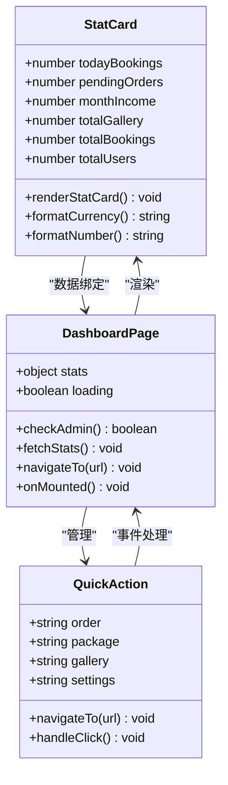
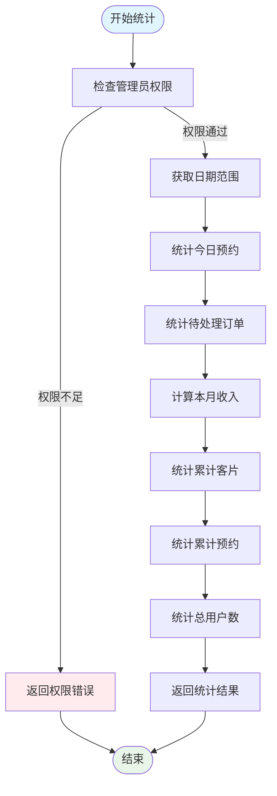
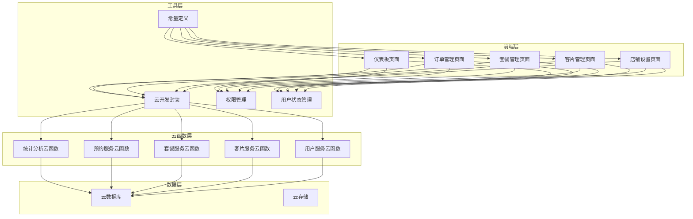

# 仪表板概览

<cite>
**本文档引用的文件**
- [dashboard/index.vue](file://miniprogram/src/pages-admin/dashboard/index.vue)
- [stats/index.js](file://miniprogram/cloudfunctions/stats/index.js)
- [cloud.js](file://miniprogram/src/utils/cloud.js)
- [auth.js](file://miniprogram/src/utils/auth.js)
- [user.js](file://miniprogram/src/store/user.js)
- [orders/index.vue](file://miniprogram/src/pages-admin/orders/index.vue)
- [packages-manage/index.vue](file://miniprogram/src/pages-admin/packages-manage/index.vue)
- [gallery-manage/index.vue](file://miniprogram/src/pages-admin/gallery-manage/index.vue)
- [settings/index.vue](file://miniprogram/src/pages-admin/settings/index.vue)
- [constants.js](file://miniprogram/src/utils/constants.js)
</cite>

## 目录
1. [简介](#简介)
2. [项目结构](#项目结构)
3. [核心组件](#核心组件)
4. [架构概览](#架构概览)
5. [详细组件分析](#详细组件分析)
6. [依赖关系分析](#依赖关系分析)
7. [性能考虑](#性能考虑)
8. [故障排除指南](#故障排除指南)
9. [结论](#结论)

## 简介

仪表板概览页面是管理后台的核心入口，为管理员提供实时的业务数据统计和快捷功能入口。该页面集成了数据可视化、权限控制、响应式布局等特性，旨在帮助管理员快速掌握店铺运营状况并高效执行日常管理工作。

## 项目结构

该项目采用前后端分离的架构设计，管理后台页面位于 `miniprogram/src/pages-admin/` 目录下，采用 Vue 3 Composition API 和 UniApp 框架构建。

**图表来源**
- [dashboard/index.vue:1-295](file://miniprogram/src/pages-admin/dashboard/index.vue#L1-L295)
- [stats/index.js:1-229](file://miniprogram/cloudfunctions/stats/index.js#L1-L229)

**章节来源**
- [dashboard/index.vue:1-295](file://miniprogram/src/pages-admin/dashboard/index.vue#L1-L295)
- [stats/index.js:1-229](file://miniprogram/cloudfunctions/stats/index.js#L1-L229)

## 核心组件

仪表板概览页面由三个主要部分组成：

### 数据统计区域
- **今日预约**：显示当天有效预约数量
- **待处理订单**：显示已确认但未完成的预约数量
- **本月收入**：显示当月已支付订单的定金总额
- **累计客片**：显示所有客片作品总数
- **累计预约**：显示历史总预约数量
- **总用户数**：显示注册用户总数

### 快捷入口区域
- **订单管理**：快速进入订单列表管理
- **套餐管理**：快速进入套餐产品管理
- **客片管理**：快速进入客片作品管理
- **店铺设置**：快速进入店铺信息配置

### 权限控制机制
- 基于用户角色的访问控制
- 实时权限验证和错误处理
- 无权限时的自动跳转机制

**章节来源**
- [dashboard/index.vue:10-64](file://miniprogram/src/pages-admin/dashboard/index.vue#L10-L64)
- [dashboard/index.vue:90-103](file://miniprogram/src/pages-admin/dashboard/index.vue#L90-L103)

## 架构概览

系统采用三层架构设计，实现了清晰的职责分离和数据流控制。

**图表来源**
- [dashboard/index.vue:105-122](file://miniprogram/src/pages-admin/dashboard/index.vue#L105-L122)
- [stats/index.js:73-162](file://miniprogram/cloudfunctions/stats/index.js#L73-L162)

## 详细组件分析

### 仪表板页面组件

仪表板页面采用响应式网格布局，支持多种设备尺寸的自适应显示。

#### 数据统计卡片设计
每个统计卡片都包含数值显示和标签说明，采用统一的视觉设计规范：

**图表来源**
- [dashboard/index.vue:73-134](file://miniprogram/src/pages-admin/dashboard/index.vue#L73-L134)

#### 权限验证机制
页面在挂载时自动进行管理员权限验证，确保只有授权用户才能访问管理功能。

**章节来源**
- [dashboard/index.vue:73-134](file://miniprogram/src/pages-admin/dashboard/index.vue#L73-L134)

### 统计分析云函数

统计分析云函数负责从数据库中提取和计算各种业务指标，采用高效的查询策略和错误处理机制。

#### 数据计算逻辑
统计函数按以下顺序执行各项指标的计算：

**图表来源**
- [stats/index.js:73-162](file://miniprogram/cloudfunctions/stats/index.js#L73-L162)

#### 数据准确性保障
统计函数采用了多重数据验证和错误处理机制：

1. **管理员权限验证**：确保只有管理员可以访问统计功能
2. **数据完整性检查**：对查询结果进行空值检查
3. **异常处理机制**：捕获并处理数据库查询异常
4. **默认值处理**：在查询失败时返回合理的默认值

**章节来源**
- [stats/index.js:73-162](file://miniprogram/cloudfunctions/stats/index.js#L73-L162)

### 快捷入口功能模块

快捷入口提供了四个核心管理功能的快速访问通道：

#### 订单管理模块
- **功能描述**：查看和管理所有预约订单
- **核心特性**：
  - 多状态筛选（待确认、已确认、拍摄中、修片中、已完成、已取消）
  - 分页加载和下拉刷新
  - 订单详情查看和状态更新
  - 实时状态标签显示

#### 套餐管理模块
- **功能描述**：管理摄影套餐产品
- **核心特性**：
  - 套餐分类管理（基础版、高级版、家庭版、VIP定制）
  - 上架/下架状态控制
  - 套餐信息编辑和删除
  - 图片封面管理和价格设置

#### 客片管理模块
- **功能描述**：管理摄影作品展示
- **核心特性**：
  - 客片分类管理（陵前写真、草原旅拍、情侣私奔、儿童成长）
  - 发布/草稿状态控制
  - 图片集管理
  - 标签系统和元数据管理

#### 店铺设置模块
- **功能描述**：配置店铺基本信息
- **核心特性**：
  - 基本信息编辑（名称、电话、地址）
  - 营业时间设置（旺季和淡季）
  - 店铺公告管理
  - 实时保存和验证

**章节来源**
- [orders/index.vue:1-402](file://miniprogram/src/pages-admin/orders/index.vue#L1-L402)
- [packages-manage/index.vue:1-500](file://miniprogram/src/pages-admin/packages-manage/index.vue#L1-L500)
- [gallery-manage/index.vue:1-524](file://miniprogram/src/pages-admin/gallery-manage/index.vue#L1-L524)
- [settings/index.vue:1-443](file://miniprogram/src/pages-admin/settings/index.vue#L1-L443)

## 依赖关系分析

系统各组件之间的依赖关系体现了清晰的分层架构设计。

**图表来源**
- [dashboard/index.vue:75-76](file://miniprogram/src/pages-admin/dashboard/index.vue#L75-L76)
- [stats/index.js:1-6](file://miniprogram/cloudfunctions/stats/index.js#L1-L6)

### 关键依赖关系

1. **权限控制依赖**：所有管理页面都依赖用户状态管理和权限验证
2. **数据访问依赖**：页面通过云开发封装访问云函数和数据库
3. **状态管理依赖**：使用 Pinia 进行全局状态管理
4. **常量配置依赖**：统一的常量定义确保数据一致性

**章节来源**
- [user.js:1-48](file://miniprogram/src/store/user.js#L1-L48)
- [auth.js:1-47](file://miniprogram/src/utils/auth.js#L1-L47)
- [cloud.js:1-66](file://miniprogram/src/utils/cloud.js#L1-L66)

## 性能考虑

系统在设计时充分考虑了性能优化和用户体验：

### 数据加载优化
- **懒加载机制**：统计信息在页面挂载时异步加载
- **缓存策略**：合理利用浏览器缓存减少重复请求
- **分页加载**：大量数据采用分页加载避免一次性传输过多数据

### 响应式设计
- **弹性布局**：使用 CSS Grid 和 Flexbox 实现自适应布局
- **媒体查询**：针对不同屏幕尺寸优化显示效果
- **触摸优化**：移动端触摸交互体验优化

### 错误处理机制
- **降级处理**：网络异常时提供友好的错误提示
- **重试机制**：关键操作支持自动重试
- **状态反馈**：所有用户操作都有明确的状态反馈

## 故障排除指南

### 常见问题及解决方案

#### 权限访问问题
**问题现象**：页面显示无权访问或自动跳转
**可能原因**：
- 用户未登录或会话过期
- 用户角色不是管理员
- 云函数权限验证失败

**解决步骤**：
1. 检查用户登录状态
2. 验证用户角色权限
3. 查看云函数日志输出
4. 确认数据库中的用户信息

#### 数据加载失败
**问题现象**：统计数据显示为0或加载超时
**可能原因**：
- 数据库连接异常
- 查询条件不匹配
- 云函数执行超时

**解决步骤**：
1. 检查数据库连接状态
2. 验证查询条件和索引
3. 查看云函数执行日志
4. 优化查询性能

#### 页面显示异常
**问题现象**：界面布局错乱或元素显示异常
**可能原因**：
- CSS样式冲突
- 响应式断点问题
- 设备兼容性问题

**解决步骤**：
1. 检查CSS样式定义
2. 测试不同设备尺寸
3. 验证Flexbox和Grid布局
4. 检查第三方样式影响

**章节来源**
- [dashboard/index.vue:113-121](file://miniprogram/src/pages-admin/dashboard/index.vue#L113-L121)
- [stats/index.js:158-161](file://miniprogram/cloudfunctions/stats/index.js#L158-L161)

## 结论

仪表板概览页面作为管理后台的核心入口，成功实现了以下目标：

### 功能完整性
- 提供了完整的业务数据统计视图
- 实现了便捷的快捷功能入口
- 建立了完善的权限控制机制

### 技术先进性
- 采用现代化的Vue 3技术栈
- 实现了响应式和跨平台兼容
- 建立了清晰的分层架构设计

### 用户体验优化
- 简洁直观的界面设计
- 流畅的交互体验
- 友好的错误处理机制

该系统为摄影工作室的数字化管理提供了坚实的技术基础，通过持续的优化和扩展，可以满足不断增长的业务需求。