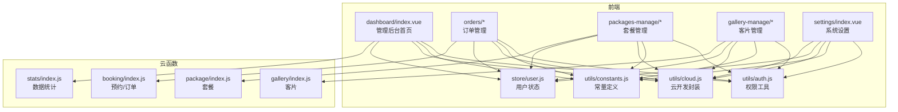
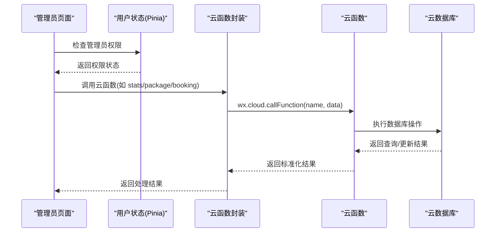
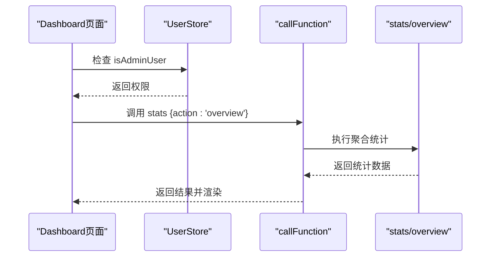
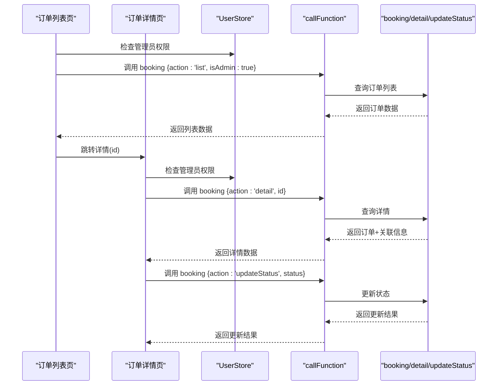
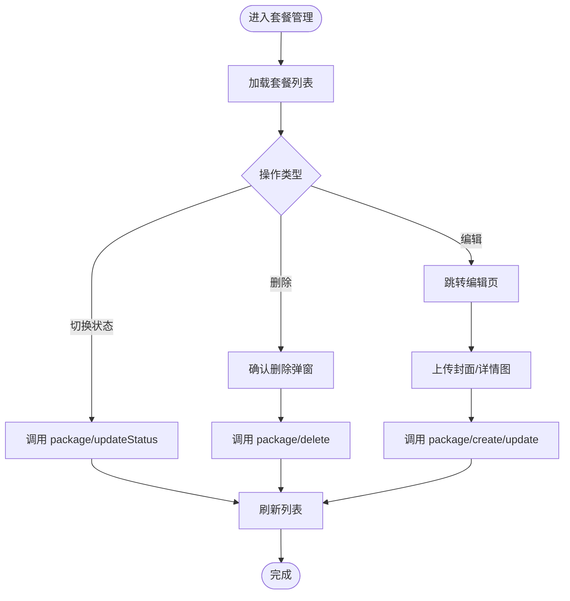
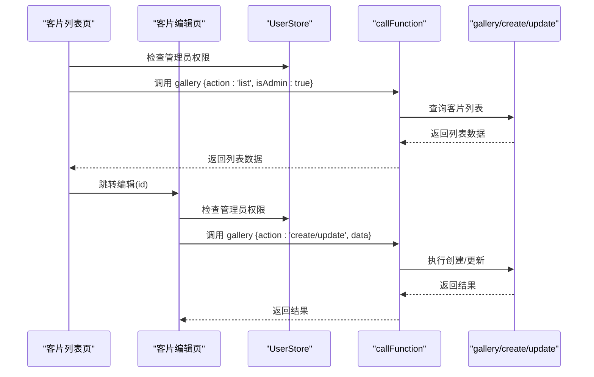
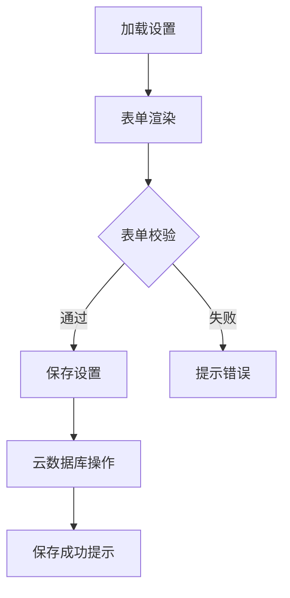
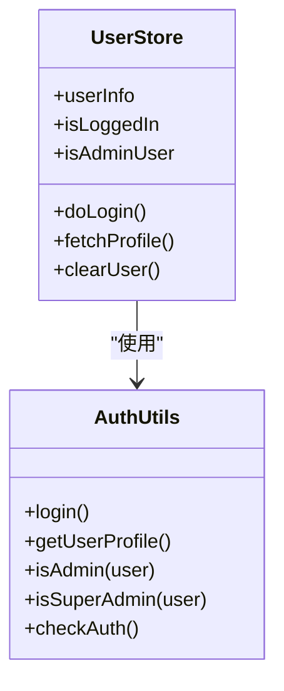
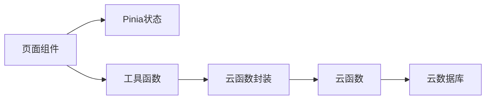

# 后台管理系统

<cite>
**本文档引用的文件**
- [dashboard/index.vue](file://miniprogram/src/pages-admin/dashboard/index.vue)
- [orders/index.vue](file://miniprogram/src/pages-admin/orders/index.vue)
- [orders/detail.vue](file://miniprogram/src/pages-admin/orders/detail.vue)
- [packages-manage/index.vue](file://miniprogram/src/pages-admin/packages-manage/index.vue)
- [packages-manage/edit.vue](file://miniprogram/src/pages-admin/packages-manage/edit.vue)
- [gallery-manage/index.vue](file://miniprogram/src/pages-admin/gallery-manage/index.vue)
- [gallery-manage/edit.vue](file://miniprogram/src/pages-admin/gallery-manage/edit.vue)
- [settings/index.vue](file://miniprogram/src/pages-admin/settings/index.vue)
- [user.js](file://miniprogram/src/store/user.js)
- [cloud.js](file://miniprogram/src/utils/cloud.js)
- [constants.js](file://miniprogram/src/utils/constants.js)
- [auth.js](file://miniprogram/src/utils/auth.js)
- [stats/index.js](file://miniprogram/cloudfunctions/stats/index.js)
- [booking/index.js](file://miniprogram/cloudfunctions/booking/index.js)
- [package/index.js](file://miniprogram/cloudfunctions/package/index.js)
- [gallery/index.js](file://miniprogram/cloudfunctions/gallery/index.js)
</cite>

## 目录
1. [简介](#简介)
2. [项目结构](#项目结构)
3. [核心组件](#核心组件)
4. [架构总览](#架构总览)
5. [详细组件分析](#详细组件分析)
6. [依赖关系分析](#依赖关系分析)
7. [性能考虑](#性能考虑)
8. [故障排查指南](#故障排查指南)
9. [结论](#结论)
10. [附录](#附录)

## 简介
本后台管理系统面向摄影工作室场景，提供订单管理、套餐管理、客片管理、数据统计与系统设置等核心功能。系统采用前后端分离架构：前端基于 Vue 3 + UniApp，后端使用微信云开发（云函数 + 云数据库），通过 Pinia 管理用户状态，具备完善的管理员权限控制、数据审核流程与批量操作能力。后台界面设计以卡片化布局为主，强调数据可视化与操作便捷性。

## 项目结构
系统采用按功能模块划分的目录结构，后台管理页面集中在 `src/pages-admin` 目录下，配套工具函数位于 `src/utils`，状态管理位于 `src/store`，云函数位于 `cloudfunctions` 目录。

**图表来源**
- [dashboard/index.vue:1-295](file://miniprogram/src/pages-admin/dashboard/index.vue#L1-L295)
- [orders/index.vue:1-402](file://miniprogram/src/pages-admin/orders/index.vue#L1-L402)
- [packages-manage/index.vue:1-500](file://miniprogram/src/pages-admin/packages-manage/index.vue#L1-L500)
- [gallery-manage/index.vue:1-524](file://miniprogram/src/pages-admin/gallery-manage/index.vue#L1-L524)
- [settings/index.vue:1-443](file://miniprogram/src/pages-admin/settings/index.vue#L1-L443)
- [user.js:1-48](file://miniprogram/src/store/user.js#L1-L48)
- [cloud.js:1-66](file://miniprogram/src/utils/cloud.js#L1-L66)
- [constants.js:1-73](file://miniprogram/src/utils/constants.js#L1-L73)
- [auth.js:1-47](file://miniprogram/src/utils/auth.js#L1-L47)
- [stats/index.js:1-229](file://miniprogram/cloudfunctions/stats/index.js#L1-L229)
- [booking/index.js:1-463](file://miniprogram/cloudfunctions/booking/index.js#L1-L463)
- [package/index.js:1-222](file://miniprogram/cloudfunctions/package/index.js#L1-L222)
- [gallery/index.js:1-360](file://miniprogram/cloudfunctions/gallery/index.js#L1-L360)

**章节来源**
- [dashboard/index.vue:1-295](file://miniprogram/src/pages-admin/dashboard/index.vue#L1-L295)
- [orders/index.vue:1-402](file://miniprogram/src/pages-admin/orders/index.vue#L1-L402)
- [packages-manage/index.vue:1-500](file://miniprogram/src/pages-admin/packages-manage/index.vue#L1-L500)
- [gallery-manage/index.vue:1-524](file://miniprogram/src/pages-admin/gallery-manage/index.vue#L1-L524)
- [settings/index.vue:1-443](file://miniprogram/src/pages-admin/settings/index.vue#L1-L443)

## 核心组件
- 管理后台首页：提供数据概览卡片、快捷入口与权限校验。
- 订单管理：支持状态筛选、分页加载、详情查看与状态流转。
- 套餐管理：支持上下架切换、新增/编辑、删除与分页加载。
- 客片管理：支持发布/下架切换、新增/编辑、删除与分页加载。
- 系统设置：支持店铺信息维护与保存。
- 权限控制：Pinia 状态管理 + 工具函数判断管理员角色。
- 云开发封装：统一调用云函数、文件上传/下载与数据库操作。

**章节来源**
- [dashboard/index.vue:73-134](file://miniprogram/src/pages-admin/dashboard/index.vue#L73-L134)
- [orders/index.vue:78-223](file://miniprogram/src/pages-admin/orders/index.vue#L78-L223)
- [packages-manage/index.vue:83-279](file://miniprogram/src/pages-admin/packages-manage/index.vue#L83-L279)
- [gallery-manage/index.vue:92-294](file://miniprogram/src/pages-admin/gallery-manage/index.vue#L92-L294)
- [settings/index.vue:103-267](file://miniprogram/src/pages-admin/settings/index.vue#L103-L267)
- [user.js:1-48](file://miniprogram/src/store/user.js#L1-L48)
- [cloud.js:1-66](file://miniprogram/src/utils/cloud.js#L1-L66)

## 架构总览
系统采用“前端页面 + 云函数 + 云数据库”的三层架构。前端通过封装的云函数接口进行数据交互，云函数负责业务逻辑与权限校验，云数据库存储业务数据。

**图表来源**
- [dashboard/index.vue:90-122](file://miniprogram/src/pages-admin/dashboard/index.vue#L90-L122)
- [user.js:1-48](file://miniprogram/src/store/user.js#L1-L48)
- [cloud.js:5-26](file://miniprogram/src/utils/cloud.js#L5-L26)
- [stats/index.js:52-68](file://miniprogram/cloudfunctions/stats/index.js#L52-L68)
- [package/index.js:26-58](file://miniprogram/cloudfunctions/package/index.js#L26-L58)
- [booking/index.js:67-93](file://miniprogram/cloudfunctions/booking/index.js#L67-L93)

## 详细组件分析

### 管理后台首页（数据概览）
- 功能要点
  - 权限校验：非管理员跳转首页并提示无权访问。
  - 数据概览：今日预约、待处理订单、本月收入、累计客片、累计预约、总用户数。
  - 快捷入口：订单管理、套餐管理、客片管理、系统设置。
  - 加载状态：全局遮罩提示加载中。
- 技术实现
  - 调用云函数 stats 的 overview 接口获取数据。
  - 使用 Pinia 状态管理判断管理员身份。
  - SCSS 样式定义主题色与布局。

**图表来源**
- [dashboard/index.vue:90-122](file://miniprogram/src/pages-admin/dashboard/index.vue#L90-L122)
- [stats/index.js:73-162](file://miniprogram/cloudfunctions/stats/index.js#L73-L162)
- [user.js:5-9](file://miniprogram/src/store/user.js#L5-L9)

**章节来源**
- [dashboard/index.vue:73-134](file://miniprogram/src/pages-admin/dashboard/index.vue#L73-L134)
- [stats/index.js:52-162](file://miniprogram/cloudfunctions/stats/index.js#L52-L162)

### 订单管理（列表与详情）
- 订单列表
  - 状态筛选：全部、待确认、已确认、拍摄中、修片中、已完成、已取消。
  - 分页加载：下拉刷新与滚动到底加载更多。
  - 操作：跳转详情、状态标签与颜色映射。
- 订单详情
  - 状态流转：根据当前状态显示对应操作按钮（确认预约、开始拍摄、进入修片、完成订单）。
  - 退款流程：当满足条件时显示退款按钮，调用支付云函数发起退款。
  - 客户信息：支持一键拨打电话。
- 权限控制
  - 非管理员禁止访问，提示并跳转首页。

**图表来源**
- [orders/index.vue:106-222](file://miniprogram/src/pages-admin/orders/index.vue#L106-L222)
- [orders/detail.vue:182-381](file://miniprogram/src/pages-admin/orders/detail.vue#L182-L381)
- [booking/index.js:211-303](file://miniprogram/cloudfunctions/booking/index.js#L211-L303)

**章节来源**
- [orders/index.vue:78-223](file://miniprogram/src/pages-admin/orders/index.vue#L78-L223)
- [orders/detail.vue:160-382](file://miniprogram/src/pages-admin/orders/detail.vue#L160-L382)
- [booking/index.js:67-303](file://miniprogram/cloudfunctions/booking/index.js#L67-L303)

### 套餐管理（列表与编辑）
- 套餐列表
  - 分类标签：陵前印记、草原征途、家族传承、定制旅拍。
  - 上下架切换：通过开关切换状态，调用云函数更新。
  - 编辑/删除：支持跳转编辑与确认删除。
  - 分页加载：下拉刷新与滚动到底加载更多。
- 套餐编辑
  - 基本信息：名称、分类、价格、定金、服务详情。
  - 图片上传：封面图与详情图，支持多图上传与删除。
  - 特色标签：最多6个，支持添加/删除。
  - 保存：调用云函数 create/update，支持草稿/上架状态。
- 权限控制
  - 仅管理员可操作。

**图表来源**
- [packages-manage/index.vue:120-278](file://miniprogram/src/pages-admin/packages-manage/index.vue#L120-L278)
- [packages-manage/edit.vue:287-455](file://miniprogram/src/pages-admin/packages-manage/edit.vue#L287-L455)
- [package/index.js:60-222](file://miniprogram/cloudfunctions/package/index.js#L60-L222)

**章节来源**
- [packages-manage/index.vue:83-279](file://miniprogram/src/pages-admin/packages-manage/index.vue#L83-L279)
- [packages-manage/edit.vue:226-514](file://miniprogram/src/pages-admin/packages-manage/edit.vue#L226-L514)
- [package/index.js:26-222](file://miniprogram/cloudfunctions/package/index.js#L26-L222)

### 客片管理（列表与编辑）
- 客片列表
  - 分类标签：全部、陵前写真、草原旅拍、情侣私奔、儿童成长。
  - 发布/草稿切换：通过开关切换状态，调用云函数更新。
  - 编辑/删除：支持跳转编辑与确认删除。
  - 分页加载：下拉刷新与滚动到底加载更多。
- 客片编辑
  - 基本信息：标题、分类。
  - 标签管理：最多5个，支持添加/删除。
  - 图片上传：封面图与客片图，最多9张。
  - 朋友圈文案：最多500字。
  - 发布设置：立即发布开关。
- 权限控制
  - 仅管理员可操作。

**图表来源**
- [gallery-manage/index.vue:136-294](file://miniprogram/src/pages-admin/gallery-manage/index.vue#L136-L294)
- [gallery-manage/edit.vue:246-443](file://miniprogram/src/pages-admin/gallery-manage/edit.vue#L246-L443)
- [gallery/index.js:66-225](file://miniprogram/cloudfunctions/gallery/index.js#L66-L225)

**章节来源**
- [gallery-manage/index.vue:92-295](file://miniprogram/src/pages-admin/gallery-manage/index.vue#L92-L295)
- [gallery-manage/edit.vue:166-444](file://miniprogram/src/pages-admin/gallery-manage/edit.vue#L166-L444)
- [gallery/index.js:26-225](file://miniprogram/cloudfunctions/gallery/index.js#L26-L225)

### 系统设置（店铺信息）
- 功能要点
  - 基本信息：店铺名称、联系电话、地址。
  - 营业时间：旺季与淡季营业时间。
  - 店铺公告：首页展示文案，最多500字。
  - 保存逻辑：若存在记录则更新，否则新增；包含时间戳字段。
- 权限控制
  - 仅管理员可访问与修改。

**图表来源**
- [settings/index.vue:138-267](file://miniprogram/src/pages-admin/settings/index.vue#L138-L267)
- [cloud.js:63-65](file://miniprogram/src/utils/cloud.js#L63-L65)

**章节来源**
- [settings/index.vue:103-267](file://miniprogram/src/pages-admin/settings/index.vue#L103-L267)
- [cloud.js:63-65](file://miniprogram/src/utils/cloud.js#L63-L65)

### 权限控制与认证
- 用户状态管理
  - 使用 Pinia 管理用户信息与登录状态。
  - 提供管理员判断方法。
- 权限工具
  - 登录、获取用户资料、判断管理员/超级管理员。
- 页面级权限
  - 各后台页面在 mounted 中检查管理员权限，不通过则提示并跳转首页。

**图表来源**
- [user.js:1-48](file://miniprogram/src/store/user.js#L1-L48)
- [auth.js:1-47](file://miniprogram/src/utils/auth.js#L1-L47)

**章节来源**
- [user.js:1-48](file://miniprogram/src/store/user.js#L1-L48)
- [auth.js:1-47](file://miniprogram/src/utils/auth.js#L1-L47)

## 依赖关系分析
- 前端依赖
  - Vue 3 + UniApp：跨平台小程序框架。
  - Pinia：轻量状态管理。
  - SCSS：样式预处理。
- 云函数依赖
  - 微信云开发 SDK：云函数、数据库、存储。
- 关键依赖链
  - 页面组件 → 用户状态 → 权限校验 → 云函数封装 → 云函数 → 云数据库。

**图表来源**
- [cloud.js:1-66](file://miniprogram/src/utils/cloud.js#L1-L66)
- [stats/index.js:1-229](file://miniprogram/cloudfunctions/stats/index.js#L1-L229)
- [booking/index.js:1-463](file://miniprogram/cloudfunctions/booking/index.js#L1-L463)
- [package/index.js:1-222](file://miniprogram/cloudfunctions/package/index.js#L1-L222)
- [gallery/index.js:1-360](file://miniprogram/cloudfunctions/gallery/index.js#L1-L360)

**章节来源**
- [cloud.js:1-66](file://miniprogram/src/utils/cloud.js#L1-L66)
- [stats/index.js:1-229](file://miniprogram/cloudfunctions/stats/index.js#L1-L229)
- [booking/index.js:1-463](file://miniprogram/cloudfunctions/booking/index.js#L1-L463)
- [package/index.js:1-222](file://miniprogram/cloudfunctions/package/index.js#L1-L222)
- [gallery/index.js:1-360](file://miniprogram/cloudfunctions/gallery/index.js#L1-L360)

## 性能考虑
- 分页与懒加载
  - 列表页均采用分页加载与“加载更多”机制，避免一次性渲染大量数据。
- 并发控制
  - 预约创建使用数据库事务保证一致性，防止高并发导致超卖。
- 文件上传
  - 图片上传采用云存储，前端仅传递文件路径，减少传输体积。
- 状态缓存
  - 页面内使用响应式变量缓存当前筛选条件与分页参数，减少重复请求。

[本节为通用指导，无需特定文件引用]

## 故障排查指南
- 权限相关
  - 现象：提示“无权访问”并跳转首页。
  - 排查：确认用户角色是否为 admin/superAdmin；检查用户状态是否正确初始化。
- 数据加载失败
  - 现象：加载中提示或空状态。
  - 排查：检查云函数返回码与消息；确认网络状态与云函数部署情况。
- 操作失败
  - 现象：切换状态、上下架、删除等操作失败。
  - 排查：查看云函数错误日志；确认目标数据是否存在；检查权限校验逻辑。
- 文件上传失败
  - 现象：封面图或详情图上传失败。
  - 排查：检查文件大小与格式限制；确认云存储权限与网络状态。

**章节来源**
- [dashboard/index.vue:90-122](file://miniprogram/src/pages-admin/dashboard/index.vue#L90-L122)
- [orders/index.vue:131-187](file://miniprogram/src/pages-admin/orders/index.vue#L131-L187)
- [packages-manage/index.vue:183-264](file://miniprogram/src/pages-admin/packages-manage/index.vue#L183-L264)
- [gallery-manage/index.vue:199-280](file://miniprogram/src/pages-admin/gallery-manage/index.vue#L199-L280)
- [cloud.js:28-60](file://miniprogram/src/utils/cloud.js#L28-L60)

## 结论
本后台管理系统围绕订单、套餐、客片三大业务域构建，结合数据统计与系统设置，形成完整的运营闭环。通过严格的管理员权限控制、清晰的状态流转与完善的错误处理机制，系统在易用性与安全性之间取得良好平衡。建议后续可扩展批量操作、导出报表与审计日志等功能，进一步提升运营效率与合规性。

[本节为总结性内容，无需特定文件引用]

## 附录

### 管理员操作指南
- 登录与权限
  - 使用管理员账号登录，系统自动识别角色并开放后台入口。
- 数据概览
  - 查看今日预约、待处理订单、本月收入等关键指标。
- 订单管理
  - 通过状态筛选快速定位订单；在详情页进行状态流转与退款处理。
- 套餐管理
  - 新增/编辑套餐时完善服务详情与图片素材；及时上下架过期套餐。
- 客片管理
  - 发布高质量客片，合理设置标签与朋友圈文案；及时下架违规内容。
- 系统设置
  - 维护店铺信息与公告，确保对外展示内容准确一致。

[本节为操作指引，无需特定文件引用]

### 数据管理最佳实践
- 数据备份
  - 建议定期导出订单、套餐、客片与用户数据至本地或云端存储。
- 审核流程
  - 对于客片与套餐变更，建议建立双人复核机制，保留操作日志。
- 清理策略
  - 定期清理已取消订单与无效草稿，保持数据库整洁。

[本节为通用指导，无需特定文件引用]

### 安全防护措施
- 权限最小化
  - 仅授予必要管理员角色，避免超级管理员滥用。
- 输入校验
  - 前端与云函数双重校验，防止非法数据入库。
- 日志审计
  - 记录关键操作（状态变更、上下架、删除）的时间与操作人，便于追溯。

[本节为通用指导，无需特定文件引用]