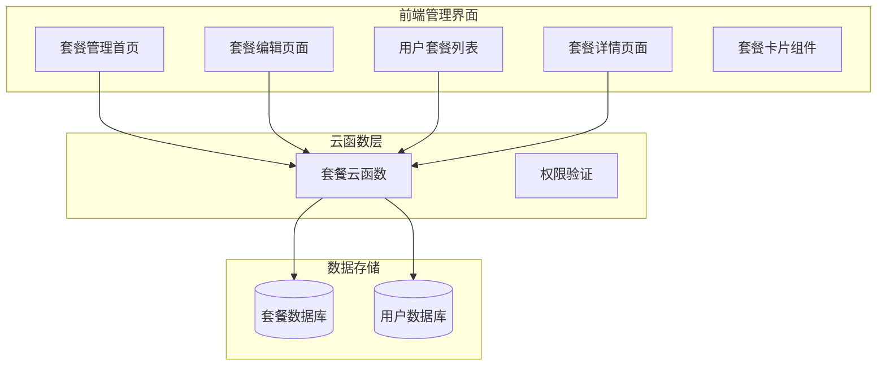
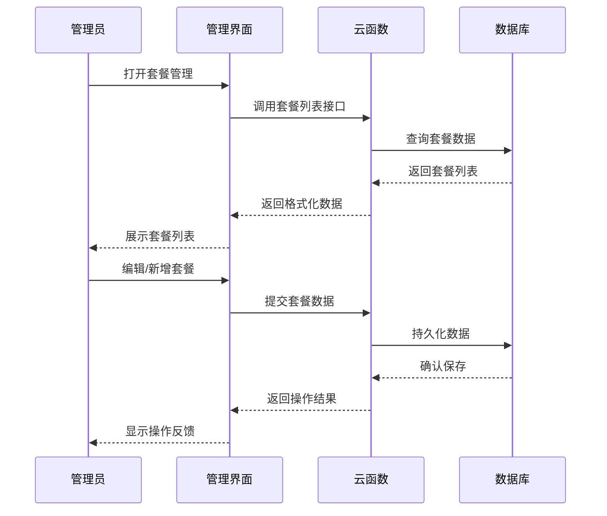
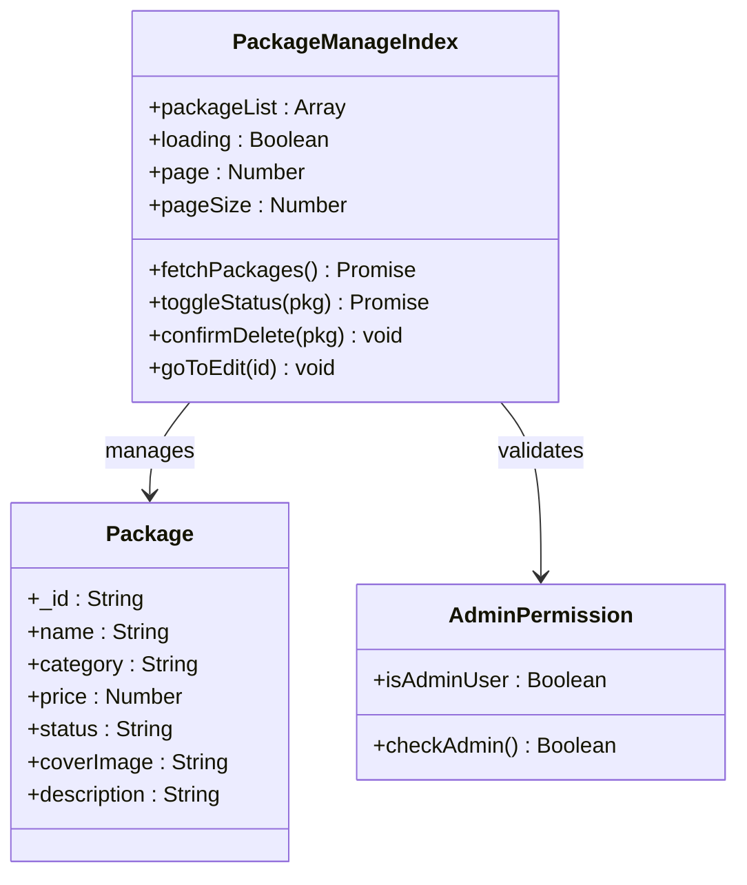
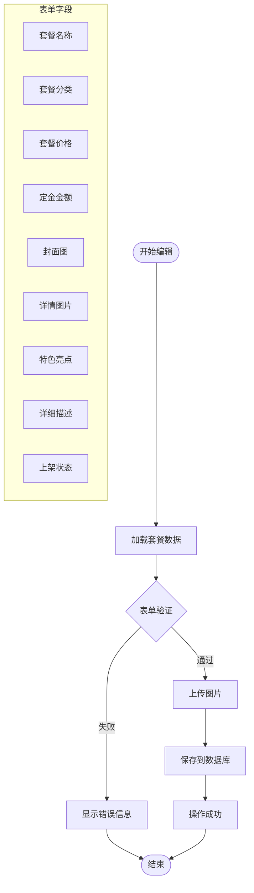
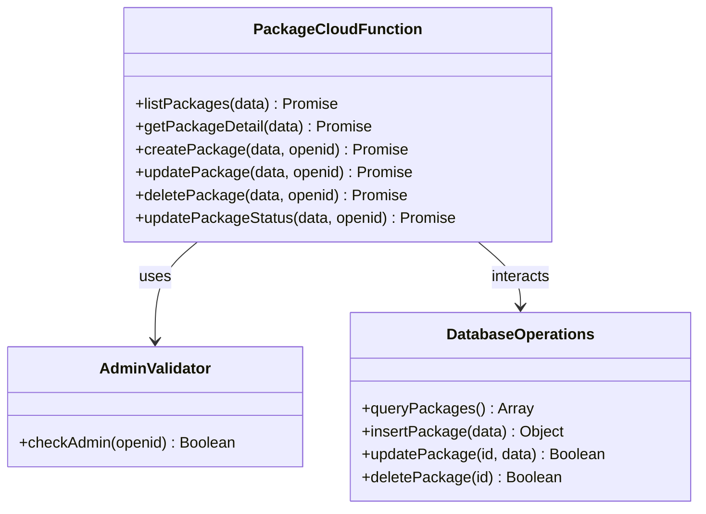
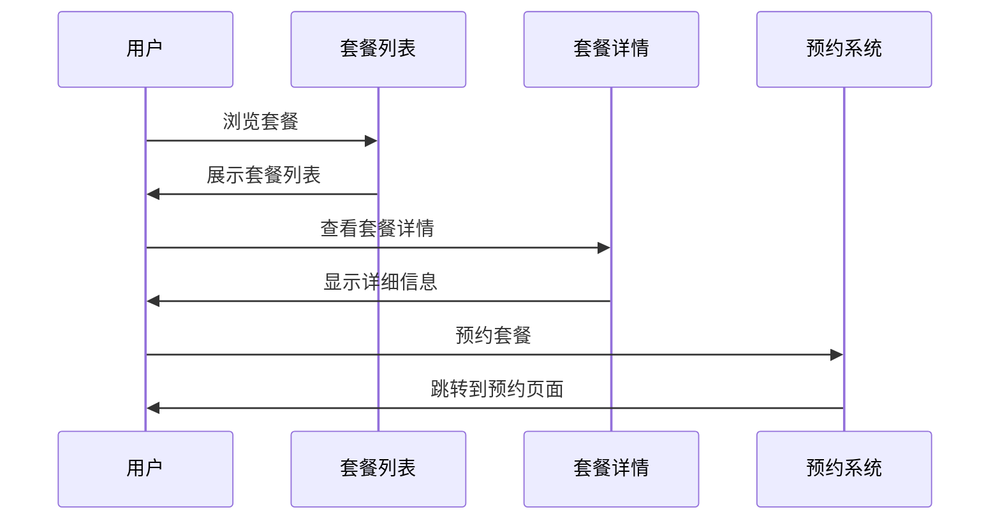
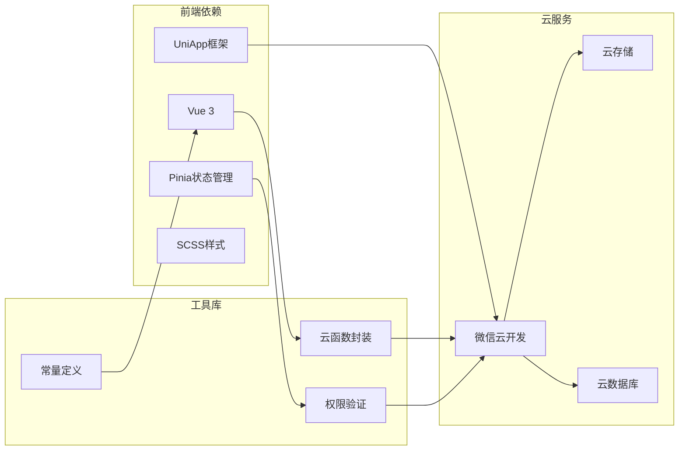

# 套餐管理

<cite>
**本文档引用的文件**
- [packages-manage/index.vue](file://miniprogram/src/pages-admin/packages-manage/index.vue)
- [packages-manage/edit.vue](file://miniprogram/src/pages-admin/packages-manage/edit.vue)
- [package/index.js](file://miniprogram/cloudfunctions/package/index.js)
- [cloud.js](file://miniprogram/src/utils/cloud.js)
- [constants.js](file://miniprogram/src/utils/constants.js)
- [user.js](file://miniprogram/src/store/user.js)
- [list.vue](file://miniprogram/src/pages/packages/list.vue)
- [detail.vue](file://miniprogram/src/pages/packages/detail.vue)
- [PackageCard.vue](file://miniprogram/src/components/PackageCard.vue)
</cite>

## 目录
1. [简介](#简介)
2. [项目结构](#项目结构)
3. [核心组件](#核心组件)
4. [架构概览](#架构概览)
5. [详细组件分析](#详细组件分析)
6. [依赖关系分析](#依赖关系分析)
7. [性能考虑](#性能考虑)
8. [故障排除指南](#故障排除指南)
9. [结论](#结论)
10. [附录](#附录)

## 简介
套餐管理是本小程序的核心功能模块，为管理员提供了完整的套餐生命周期管理能力。该系统支持套餐的增删改查、状态管理、分类管理、图片处理等功能，为用户提供了一个完整的摄影套餐预订服务。

## 项目结构
套餐管理系统采用前后端分离架构，分为前端管理界面和后端云函数两大部分：

**图表来源**
- [packages-manage/index.vue:1-500](file://miniprogram/src/pages-admin/packages-manage/index.vue#L1-L500)
- [packages-manage/edit.vue:1-864](file://miniprogram/src/pages-admin/packages-manage/edit.vue#L1-L864)
- [package/index.js:1-222](file://miniprogram/cloudfunctions/package/index.js#L1-L222)

**章节来源**
- [packages-manage/index.vue:1-500](file://miniprogram/src/pages-admin/packages-manage/index.vue#L1-L500)
- [packages-manage/edit.vue:1-864](file://miniprogram/src/pages-admin/packages-manage/edit.vue#L1-L864)
- [package/index.js:1-222](file://miniprogram/cloudfunctions/package/index.js#L1-L222)

## 核心组件
套餐管理系统包含以下核心组件：

### 管理端组件
- **套餐管理首页**：展示所有套餐列表，支持上架状态切换、编辑和删除操作
- **套餐编辑页面**：提供完整的套餐信息录入和编辑功能
- **权限验证**：基于角色的管理员权限控制

### 用户端组件
- **套餐列表页面**：面向用户的套餐浏览和分类筛选
- **套餐详情页面**：展示套餐详细信息和预约功能
- **套餐卡片组件**：可复用的套餐展示组件

**章节来源**
- [packages-manage/index.vue:83-279](file://miniprogram/src/pages-admin/packages-manage/index.vue#L83-L279)
- [packages-manage/edit.vue:226-514](file://miniprogram/src/pages-admin/packages-manage/edit.vue#L226-L514)
- [list.vue:57-131](file://miniprogram/src/pages/packages/list.vue#L57-L131)

## 架构概览
系统采用三层架构设计，确保功能清晰分离和良好的可维护性：

**图表来源**
- [cloud.js:5-26](file://miniprogram/src/utils/cloud.js#L5-L26)
- [package/index.js:26-58](file://miniprogram/cloudfunctions/package/index.js#L26-L58)

系统架构特点：
- **前后端分离**：前端负责界面展示，后端负责业务逻辑和数据持久化
- **权限控制**：通过管理员角色验证确保数据安全
- **响应式设计**：支持移动端和桌面端访问
- **状态管理**：使用Vue 3 Composition API实现响应式状态管理

**章节来源**
- [cloud.js:1-66](file://miniprogram/src/utils/cloud.js#L1-L66)
- [user.js:1-48](file://miniprogram/src/store/user.js#L1-L48)

## 详细组件分析

### 套餐管理首页组件
管理首页提供套餐的集中管理功能：

**图表来源**
- [packages-manage/index.vue:83-279](file://miniprogram/src/pages-admin/packages-manage/index.vue#L83-L279)

主要功能特性：
- **分页加载**：支持大数据量的分页显示
- **实时状态切换**：通过开关控件即时切换套餐上架状态
- **批量操作**：支持删除确认和批量删除
- **权限验证**：确保只有管理员可以访问和操作

**章节来源**
- [packages-manage/index.vue:120-279](file://miniprogram/src/pages-admin/packages-manage/index.vue#L120-L279)

### 套餐编辑组件
编辑页面提供完整的套餐信息录入和编辑功能：

**图表来源**
- [packages-manage/edit.vue:226-514](file://miniprogram/src/pages-admin/packages-manage/edit.vue#L226-L514)

表单字段设计：
- **基本信息**：名称、分类、价格、定金
- **服务详情**：拍摄时长、服装套数、精修张数
- **图片管理**：封面图和详情图片上传
- **特色展示**：多个特色亮点和标签
- **状态控制**：上架/下架状态切换

**章节来源**
- [packages-manage/edit.vue:101-217](file://miniprogram/src/pages-admin/packages-manage/edit.vue#L101-L217)

### 云函数服务
云函数提供后端业务逻辑处理：

**图表来源**
- [package/index.js:26-222](file://miniprogram/cloudfunctions/package/index.js#L26-L222)

云函数功能：
- **权限验证**：检查用户是否具有管理员权限
- **数据操作**：提供完整的CRUD操作
- **状态管理**：支持套餐状态的切换
- **错误处理**：统一的错误处理和返回格式

**章节来源**
- [package/index.js:26-222](file://miniprogram/cloudfunctions/package/index.js#L26-L222)

### 用户端套餐展示
用户端提供套餐浏览和预约功能：

**图表来源**
- [list.vue:57-131](file://miniprogram/src/pages/packages/list.vue#L57-L131)
- [detail.vue:141-251](file://miniprogram/src/pages/packages/detail.vue#L141-L251)

用户端特性：
- **分类筛选**：支持按套餐类型分类浏览
- **详情展示**：完整的套餐信息展示
- **预约功能**：直接跳转到预约系统
- **收藏功能**：支持用户收藏感兴趣的套餐

**章节来源**
- [list.vue:57-131](file://miniprogram/src/pages/packages/list.vue#L57-L131)
- [detail.vue:141-251](file://miniprogram/src/pages/packages/detail.vue#L141-L251)

## 依赖关系分析

**图表来源**
- [cloud.js:1-66](file://miniprogram/src/utils/cloud.js#L1-L66)
- [constants.js:1-73](file://miniprogram/src/utils/constants.js#L1-L73)
- [user.js:1-48](file://miniprogram/src/store/user.js#L1-L48)

依赖关系特点：
- **模块化设计**：各组件职责明确，耦合度低
- **工具库抽象**：通过工具库封装底层API调用
- **状态管理**：使用Pinia实现全局状态管理
- **云服务集成**：深度集成微信云开发服务

**章节来源**
- [cloud.js:1-66](file://miniprogram/src/utils/cloud.js#L1-L66)
- [constants.js:1-73](file://miniprogram/src/utils/constants.js#L1-L73)
- [user.js:1-48](file://miniprogram/src/store/user.js#L1-L48)

## 性能考虑
套餐管理系统在性能方面采用了多项优化策略：

### 前端性能优化
- **虚拟滚动**：对于大量数据的列表采用虚拟滚动技术
- **懒加载**：图片资源采用懒加载机制
- **缓存策略**：合理使用浏览器缓存减少重复请求
- **响应式设计**：适配不同屏幕尺寸，提升用户体验

### 后端性能优化
- **分页查询**：数据库查询采用分页机制，避免一次性加载大量数据
- **索引优化**：对常用查询字段建立数据库索引
- **并发控制**：限制同时进行的数据库操作数量
- **连接池管理**：合理管理数据库连接，避免连接泄漏

### 图片处理优化
- **压缩处理**：上传图片自动压缩，减少存储空间占用
- **CDN加速**：图片资源通过CDN分发，提升加载速度
- **格式优化**：支持多种图片格式，根据场景选择最优格式

## 故障排除指南

### 常见问题及解决方案

#### 权限相关问题
**问题**：管理员权限验证失败
**原因**：用户角色不是管理员或权限过期
**解决方案**：
1. 检查用户数据库中的角色字段
2. 确认管理员账号的权限配置
3. 重新登录获取新的权限令牌

#### 数据库操作异常
**问题**：套餐数据保存失败
**原因**：数据库连接异常或字段验证失败
**解决方案**：
1. 检查数据库连接状态
2. 验证必填字段的完整性
3. 查看具体的错误日志信息

#### 图片上传失败
**问题**：图片上传过程中断
**原因**：网络不稳定或文件大小超限
**解决方案**：
1. 检查网络连接状态
2. 确认文件大小符合要求
3. 重新尝试上传操作

#### 前端显示异常
**问题**：页面渲染不正确或空白
**原因**：组件状态异常或数据格式错误
**解决方案**：
1. 检查组件的响应式数据绑定
2. 验证API返回的数据格式
3. 查看浏览器控制台的错误信息

**章节来源**
- [package/index.js:8-24](file://miniprogram/cloudfunctions/package/index.js#L8-L24)
- [cloud.js:5-26](file://miniprogram/src/utils/cloud.js#L5-L26)

## 结论
套餐管理系统是一个功能完整、架构清晰的小程序解决方案。系统通过前后端分离的设计，实现了良好的可维护性和扩展性。主要优势包括：

1. **完整的功能覆盖**：从基础的增删改查到高级的状态管理和图片处理
2. **优秀的用户体验**：响应式设计和流畅的交互体验
3. **可靠的安全保障**：完善的权限验证和数据保护机制
4. **良好的性能表现**：通过多项优化策略确保系统的高效运行

该系统为摄影类小程序提供了标准化的套餐管理解决方案，可以根据具体需求进行二次开发和功能扩展。

## 附录

### 数据模型定义
套餐数据模型包含以下字段：
- **基础信息**：名称、分类、价格、定金、描述
- **服务信息**：拍摄时长、服装套数、精修张数
- **媒体资源**：封面图、详情图片、特色图片
- **状态信息**：上架状态、创建时间、更新时间

### API接口规范
系统提供统一的云函数接口规范，支持标准的CRUD操作和状态管理功能。

### 最佳实践建议
1. **图片优化**：建议使用WebP格式图片，控制文件大小
2. **缓存策略**：合理设置缓存时间，平衡性能和数据新鲜度
3. **错误处理**：完善错误提示和重试机制
4. **监控告警**：建立系统监控和异常告警机制