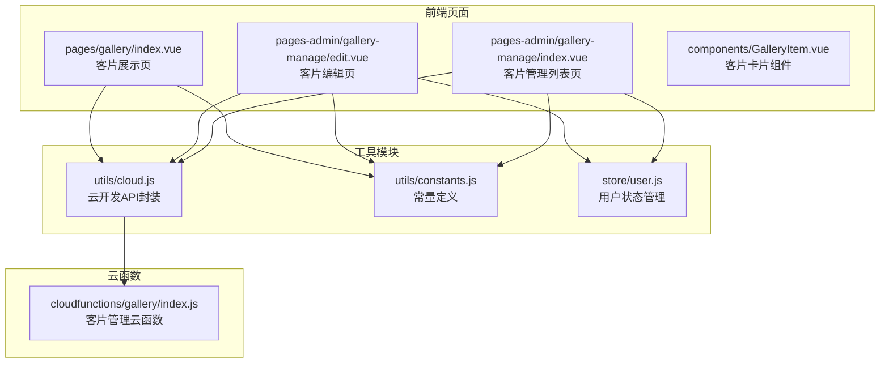
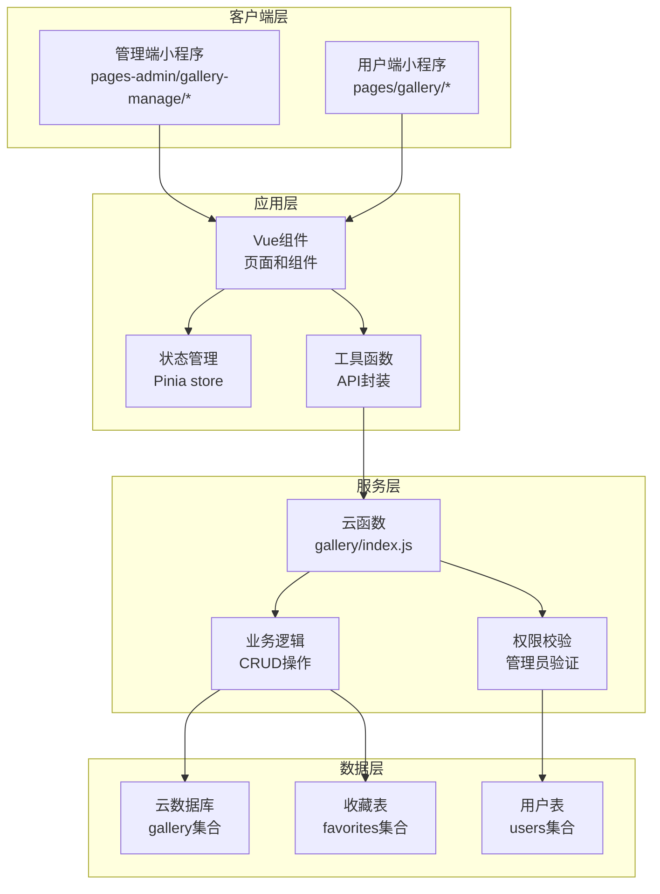
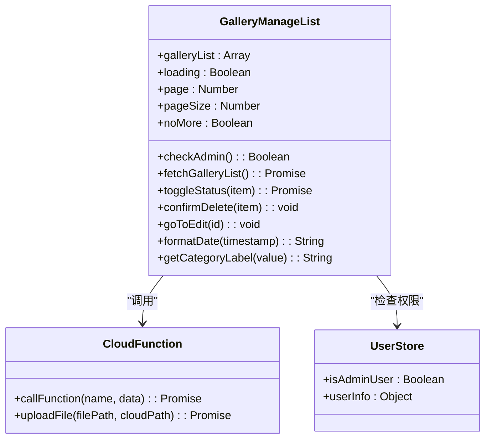
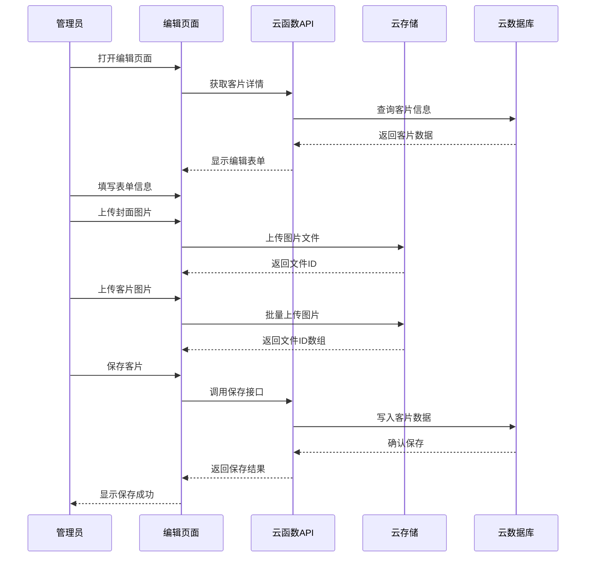
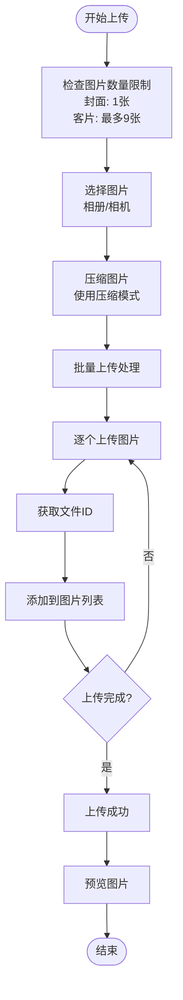
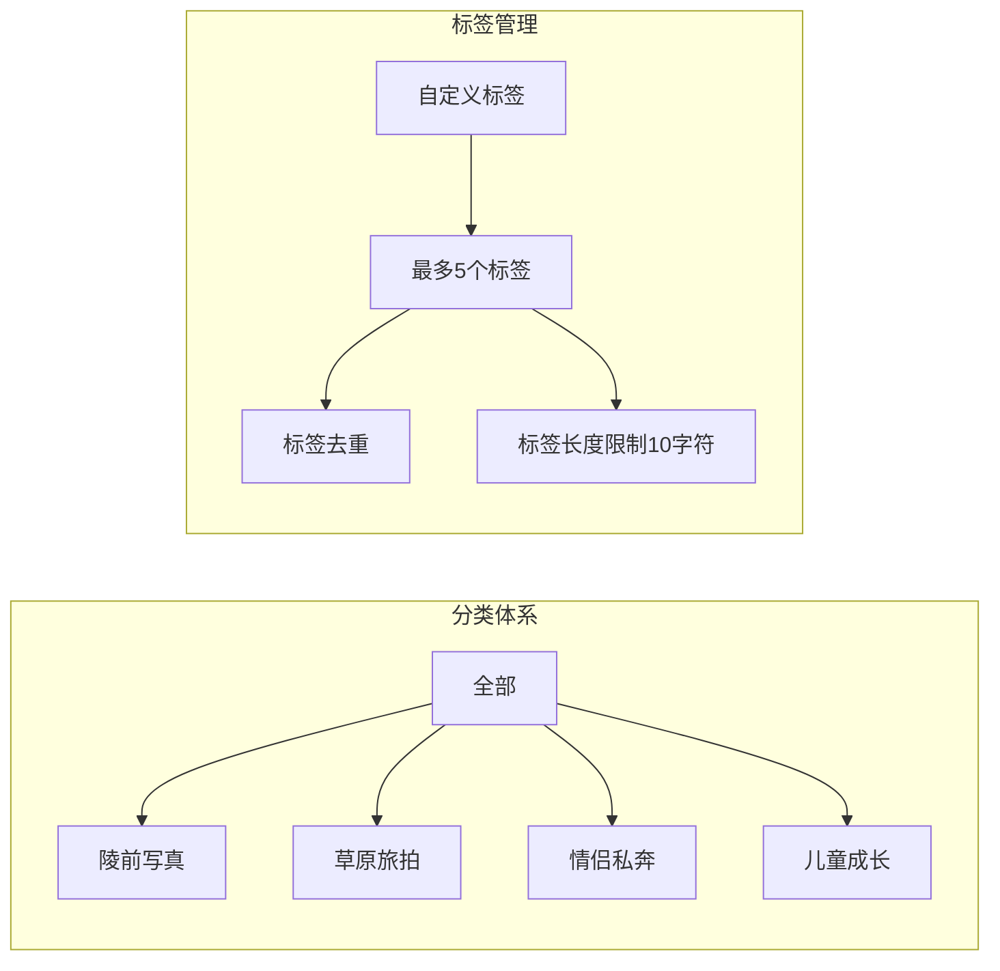
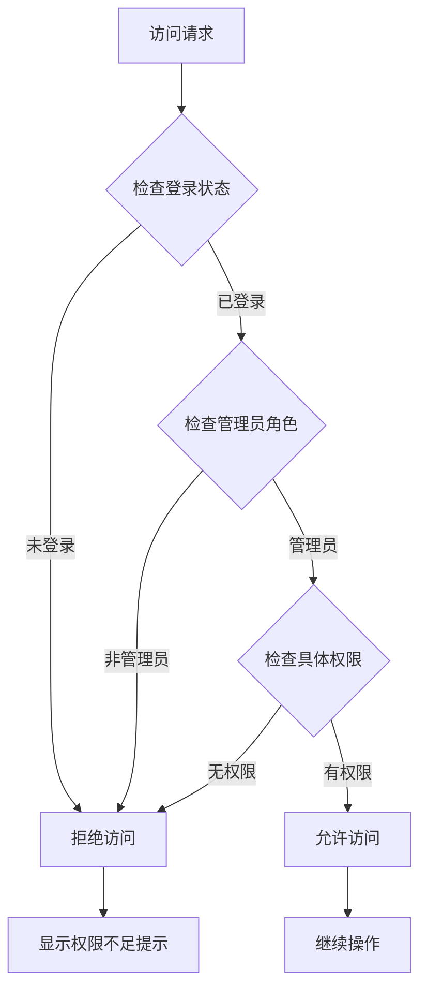
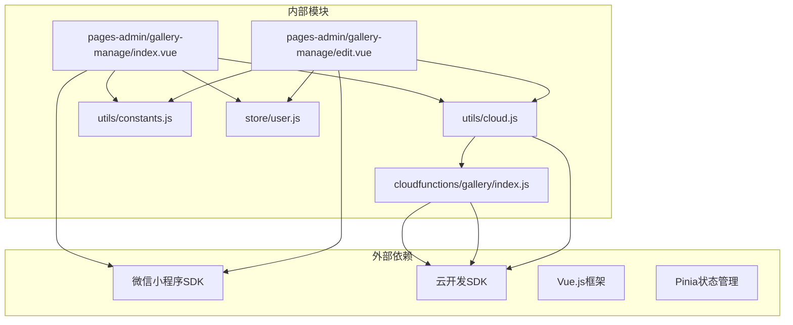

# 客片管理

<cite>
**本文档引用的文件**
- [miniprogram/src/pages-admin/gallery-manage/index.vue](file://miniprogram/src/pages-admin/gallery-manage/index.vue)
- [miniprogram/src/pages-admin/gallery-manage/edit.vue](file://miniprogram/src/pages-admin/gallery-manage/edit.vue)
- [miniprogram/cloudfunctions/gallery/index.js](file://miniprogram/cloudfunctions/gallery/index.js)
- [miniprogram/src/utils/cloud.js](file://miniprogram/src/utils/cloud.js)
- [miniprogram/src/pages/gallery/index.vue](file://miniprogram/src/pages/gallery/index.vue)
- [miniprogram/src/utils/constants.js](file://miniprogram/src/utils/constants.js)
- [miniprogram/src/components/GalleryItem.vue](file://miniprogram/src/components/GalleryItem.vue)
- [miniprogram/src/store/user.js](file://miniprogram/src/store/user.js)
</cite>

## 目录
1. [简介](#简介)
2. [项目结构](#项目结构)
3. [核心组件](#核心组件)
4. [架构概览](#架构概览)
5. [详细组件分析](#详细组件分析)
6. [依赖关系分析](#依赖关系分析)
7. [性能考虑](#性能考虑)
8. [故障排除指南](#故障排除指南)
9. [结论](#结论)

## 简介

客片管理功能是朵兰摄影小程序的重要组成部分，为管理员提供了完整的客片作品管理解决方案。该系统支持客片信息的录入和编辑、图片的上传和管理、分类体系、标签管理以及搜索功能。

系统采用前后端分离架构，前端使用Vue.js框架构建管理界面，后端通过微信云开发提供数据存储和业务逻辑处理。管理员可以通过直观的界面完成客片的全生命周期管理，包括新增、编辑、删除和批量操作等功能。

## 项目结构

客片管理功能主要分布在以下目录结构中：

**图表来源**
- [miniprogram/src/pages-admin/gallery-manage/index.vue:1-524](file://miniprogram/src/pages-admin/gallery-manage/index.vue#L1-L524)
- [miniprogram/src/pages-admin/gallery-manage/edit.vue:1-808](file://miniprogram/src/pages-admin/gallery-manage/edit.vue#L1-L808)
- [miniprogram/cloudfunctions/gallery/index.js:1-360](file://miniprogram/cloudfunctions/gallery/index.js#L1-L360)

**章节来源**
- [miniprogram/src/pages-admin/gallery-manage/index.vue:1-524](file://miniprogram/src/pages-admin/gallery-manage/index.vue#L1-L524)
- [miniprogram/src/pages-admin/gallery-manage/edit.vue:1-808](file://miniprogram/src/pages-admin/gallery-manage/edit.vue#L1-L808)
- [miniprogram/cloudfunctions/gallery/index.js:1-360](file://miniprogram/cloudfunctions/gallery/index.js#L1-L360)

## 核心组件

客片管理功能由多个核心组件协同工作：

### 管理端组件
- **客片管理列表页**：提供客片作品的浏览、编辑、删除和状态切换功能
- **客片编辑页**：支持客片信息的完整编辑，包括标题、描述、分类、标签和图片管理
- **用户端客片展示页**：向普通用户提供客片浏览和交互功能

### 后端组件
- **云函数服务**：提供客片数据的增删改查、收藏管理等核心业务逻辑
- **权限控制系统**：基于用户角色的访问控制机制
- **文件存储服务**：处理客片图片的上传和管理

**章节来源**
- [miniprogram/src/pages-admin/gallery-manage/index.vue:92-295](file://miniprogram/src/pages-admin/gallery-manage/index.vue#L92-L295)
- [miniprogram/src/pages-admin/gallery-manage/edit.vue:166-444](file://miniprogram/src/pages-admin/gallery-manage/edit.vue#L166-L444)
- [miniprogram/cloudfunctions/gallery/index.js:26-64](file://miniprogram/cloudfunctions/gallery/index.js#L26-L64)

## 架构概览

系统采用分层架构设计，确保前后端职责清晰分离：

**图表来源**
- [miniprogram/src/pages-admin/gallery-manage/index.vue:92-295](file://miniprogram/src/pages-admin/gallery-manage/index.vue#L92-L295)
- [miniprogram/cloudfunctions/gallery/index.js:26-64](file://miniprogram/cloudfunctions/gallery/index.js#L26-L64)

## 详细组件分析

### 客片管理列表组件

客片管理列表组件提供了管理员对所有客片作品的统一管理界面：

**图表来源**
- [miniprogram/src/pages-admin/gallery-manage/index.vue:92-295](file://miniprogram/src/pages-admin/gallery-manage/index.vue#L92-L295)
- [miniprogram/src/store/user.js:5-47](file://miniprogram/src/store/user.js#L5-L47)

#### 核心功能特性

1. **分页加载**：支持无限滚动分页，提升大数据量下的用户体验
2. **状态管理**：实时切换客片发布状态（已发布/草稿）
3. **批量操作**：支持删除确认和状态切换
4. **权限控制**：管理员专属访问权限验证

**章节来源**
- [miniprogram/src/pages-admin/gallery-manage/index.vue:136-182](file://miniprogram/src/pages-admin/gallery-manage/index.vue#L136-L182)
- [miniprogram/src/pages-admin/gallery-manage/index.vue:199-235](file://miniprogram/src/pages-admin/gallery-manage/index.vue#L199-L235)

### 客片编辑组件

客片编辑组件提供了完整的客片信息编辑功能：

**图表来源**
- [miniprogram/src/pages-admin/gallery-manage/edit.vue:340-391](file://miniprogram/src/pages-admin/gallery-manage/edit.vue#L340-L391)
- [miniprogram/src/utils/cloud.js:28-38](file://miniprogram/src/utils/cloud.js#L28-L38)

#### 表单字段管理

编辑组件支持以下关键字段：

| 字段名称 | 类型 | 必填 | 限制 | 描述 |
|---------|------|------|------|------|
| 标题 | String | 是 | 最大50字符 | 客片作品标题 |
| 分类 | Enum | 是 | 4种分类 | 作品分类标签 |
| 标签 | Array | 否 | 最多5个 | 自定义标签 |
| 封面图 | Image | 是 | 单张图片 | 作品封面显示图 |
| 客片图片 | Array | 是 | 1-9张图片 | 作品详情图片集 |
| 朋友圈文案 | Textarea | 否 | 最大500字符 | 分享文案 |
| 发布状态 | Switch | 否 | 自动草稿 | 是否公开发布 |

**章节来源**
- [miniprogram/src/pages-admin/gallery-manage/edit.vue:180-189](file://miniprogram/src/pages-admin/gallery-manage/edit.vue#L180-L189)
- [miniprogram/src/pages-admin/gallery-manage/edit.vue:216-244](file://miniprogram/src/pages-admin/gallery-manage/edit.vue#L216-L244)

### 图片上传与管理

系统提供了完整的图片处理能力：

**图表来源**
- [miniprogram/src/pages-admin/gallery-manage/edit.vue:246-299](file://miniprogram/src/pages-admin/gallery-manage/edit.vue#L246-L299)

#### 图片处理特性

1. **自动压缩**：上传前自动压缩图片以节省存储空间
2. **批量上传**：支持多张图片同时上传
3. **预览功能**：上传后可预览图片效果
4. **删除管理**：支持单张图片删除操作

**章节来源**
- [miniprogram/src/pages-admin/gallery-manage/edit.vue:272-312](file://miniprogram/src/pages-admin/gallery-manage/edit.vue#L272-L312)

### 分类体系与标签管理

系统实现了灵活的分类和标签体系：

**图表来源**
- [miniprogram/src/utils/constants.js:13-20](file://miniprogram/src/utils/constants.js#L13-L20)

#### 分类特点

- **层次化分类**：支持按主题分类的层级结构
- **灵活筛选**：用户端可按分类浏览客片
- **扩展性**：支持未来添加新的分类类型

**章节来源**
- [miniprogram/src/utils/constants.js:13-20](file://miniprogram/src/utils/constants.js#L13-L20)
- [miniprogram/src/pages/gallery/index.vue:4-17](file://miniprogram/src/pages/gallery/index.vue#L4-L17)

### 权限控制与安全

系统实施了严格的权限控制机制：

**图表来源**
- [miniprogram/src/store/user.js:5-47](file://miniprogram/src/store/user.js#L5-L47)
- [miniprogram/cloudfunctions/gallery/index.js:8-24](file://miniprogram/cloudfunctions/gallery/index.js#L8-L24)

#### 安全措施

1. **角色验证**：仅管理员可访问管理功能
2. **操作审计**：所有管理操作都有明确的权限控制
3. **数据隔离**：用户端只能看到已发布的客片

**章节来源**
- [miniprogram/src/store/user.js:8-8](file://miniprogram/src/store/user.js#L8-L8)
- [miniprogram/cloudfunctions/gallery/index.js:8-24](file://miniprogram/cloudfunctions/gallery/index.js#L8-L24)

## 依赖关系分析

客片管理功能的依赖关系如下：

**图表来源**
- [miniprogram/src/pages-admin/gallery-manage/index.vue:94-96](file://miniprogram/src/pages-admin/gallery-manage/index.vue#L94-L96)
- [miniprogram/src/pages-admin/gallery-manage/edit.vue:168-170](file://miniprogram/src/pages-admin/gallery-manage/edit.vue#L168-L170)
- [miniprogram/cloudfunctions/gallery/index.js:1-2](file://miniprogram/cloudfunctions/gallery/index.js#L1-L2)

### 关键依赖特性

1. **云开发集成**：深度集成微信云开发的各项服务
2. **状态管理**：使用Pinia实现全局状态管理
3. **组件化设计**：采用Vue组件化架构，提高代码复用性

**章节来源**
- [miniprogram/src/utils/cloud.js:5-26](file://miniprogram/src/utils/cloud.js#L5-L26)
- [miniprogram/src/store/user.js:1-48](file://miniprogram/src/store/user.js#L1-L48)

## 性能考虑

系统在设计时充分考虑了性能优化：

### 数据加载优化
- **分页加载**：默认每页10条记录，支持无限滚动
- **懒加载**：图片采用懒加载策略，提升首屏加载速度
- **缓存策略**：用户收藏状态本地缓存，减少重复请求

### 图片处理优化
- **自动压缩**：上传前自动压缩图片，减少带宽消耗
- **CDN加速**：云存储自动CDN加速，提升图片加载速度
- **格式优化**：支持多种图片格式，适应不同场景需求

### 用户体验优化
- **加载状态**：提供详细的加载状态反馈
- **错误处理**：完善的错误处理和用户提示机制
- **响应式设计**：适配不同屏幕尺寸的设备

## 故障排除指南

### 常见问题及解决方案

#### 权限相关问题
**问题**：无法访问管理功能
**原因**：用户非管理员身份或未登录
**解决**：
1. 确认用户具有管理员权限
2. 检查用户登录状态
3. 重新登录系统

#### 图片上传失败
**问题**：图片上传过程中断
**原因**：网络不稳定或图片过大
**解决**：
1. 检查网络连接状态
2. 重新选择较小的图片文件
3. 稍后重试上传操作

#### 数据加载异常
**问题**：客片列表加载失败
**原因**：云函数调用异常或数据库连接问题
**解决**：
1. 检查云函数运行状态
2. 验证数据库连接配置
3. 查看云函数日志获取详细错误信息

#### 存储空间不足
**问题**：图片上传失败，提示存储空间不足
**解决**：
1. 清理不必要的图片文件
2. 联系微信云开发客服升级存储空间
3. 优化图片压缩策略

**章节来源**
- [miniprogram/src/pages-admin/gallery-manage/index.vue:171-181](file://miniprogram/src/pages-admin/gallery-manage/index.vue#L171-L181)
- [miniprogram/src/pages-admin/gallery-manage/edit.vue:262-268](file://miniprogram/src/pages-admin/gallery-manage/edit.vue#L262-L268)

## 结论

客片管理功能通过精心设计的架构和完善的业务逻辑，为朵兰摄影提供了高效、可靠的客片作品管理解决方案。系统具备以下优势：

1. **功能完整性**：覆盖客片管理的全生命周期操作
2. **用户体验优秀**：直观的界面设计和流畅的操作体验
3. **技术架构先进**：采用现代化的技术栈和最佳实践
4. **安全性可靠**：完善的权限控制和数据保护机制
5. **扩展性强**：模块化设计便于功能扩展和维护

该系统不仅满足了当前的业务需求，还为未来的功能扩展和技术演进奠定了坚实的基础。通过持续的优化和完善，客片管理功能将继续为朵兰摄影的数字化转型提供强有力的支持。