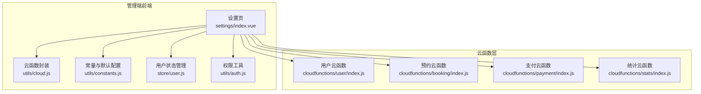
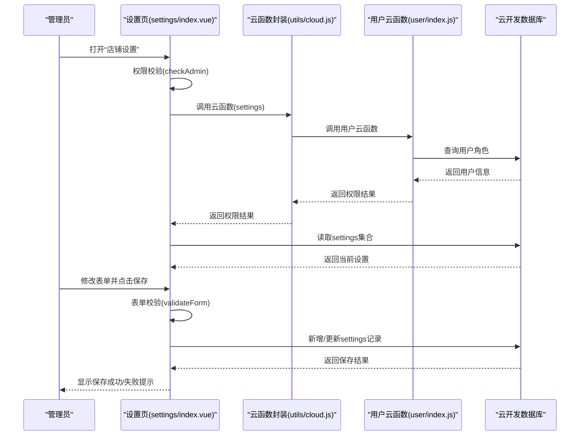
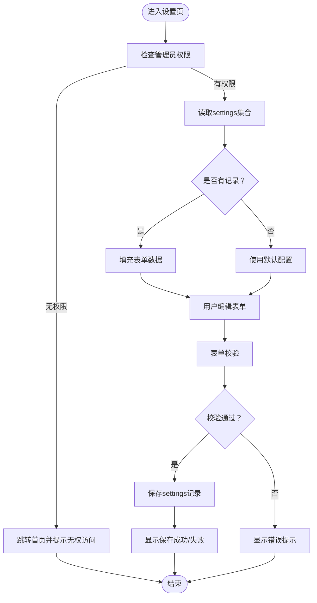
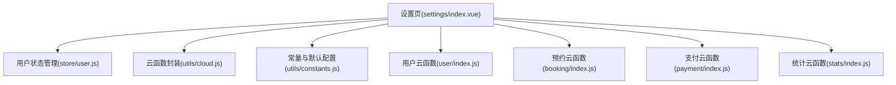

# 系统设置

<cite>
**本文档引用的文件**
- [miniprogram/src/pages-admin/settings/index.vue](file://miniprogram/src/pages-admin/settings/index.vue)
- [miniprogram/src/utils/cloud.js](file://miniprogram/src/utils/cloud.js)
- [miniprogram/src/utils/constants.js](file://miniprogram/src/utils/constants.js)
- [miniprogram/src/store/user.js](file://miniprogram/src/store/user.js)
- [miniprogram/src/utils/auth.js](file://miniprogram/src/utils/auth.js)
- [miniprogram/cloudfunctions/user/index.js](file://miniprogram/cloudfunctions/user/index.js)
- [miniprogram/cloudfunctions/booking/index.js](file://miniprogram/cloudfunctions/booking/index.js)
- [miniprogram/cloudfunctions/payment/index.js](file://miniprogram/cloudfunctions/payment/index.js)
- [miniprogram/cloudfunctions/stats/index.js](file://miniprogram/cloudfunctions/stats/index.js)
</cite>

## 目录
1. [简介](#简介)
2. [项目结构](#项目结构)
3. [核心组件](#核心组件)
4. [架构总览](#架构总览)
5. [详细组件分析](#详细组件分析)
6. [依赖关系分析](#依赖关系分析)
7. [性能考量](#性能考量)
8. [故障排查指南](#故障排查指南)
9. [结论](#结论)
10. [附录](#附录)

## 简介
本文件面向“系统设置”功能，聚焦后台店铺信息与系统配置管理。内容涵盖：
- 店铺基本信息编辑：名称、地址、联系方式、营业时间等
- 系统参数配置：支付设置、预约规则、通知配置等运营参数
- 权限管理设置：管理员账号管理、权限分配与操作日志记录
- 系统维护与安全：数据备份与安全防护建议
- 操作指南：配置修改流程、验证规则与生效机制

本系统采用前后端分离架构，前端通过云函数调用实现权限控制与数据持久化，后端以云开发数据库为核心存储。

## 项目结构
系统设置功能位于管理端页面，主要由以下模块组成：
- 管理端设置页：负责展示与编辑店铺信息
- 云函数封装：统一调用云函数与数据库
- 常量与默认配置：提供默认店铺信息与业务常量
- 用户与权限：用户登录、角色判断与管理员设置
- 业务云函数：预约、支付、统计等核心业务的云函数

图表来源
- [miniprogram/src/pages-admin/settings/index.vue:1-443](file://miniprogram/src/pages-admin/settings/index.vue#L1-L443)
- [miniprogram/src/utils/cloud.js:1-66](file://miniprogram/src/utils/cloud.js#L1-L66)
- [miniprogram/src/utils/constants.js:1-73](file://miniprogram/src/utils/constants.js#L1-L73)
- [miniprogram/src/store/user.js:1-48](file://miniprogram/src/store/user.js#L1-L48)
- [miniprogram/src/utils/auth.js:1-47](file://miniprogram/src/utils/auth.js#L1-L47)
- [miniprogram/cloudfunctions/user/index.js:1-206](file://miniprogram/cloudfunctions/user/index.js#L1-L206)
- [miniprogram/cloudfunctions/booking/index.js:1-463](file://miniprogram/cloudfunctions/booking/index.js#L1-L463)
- [miniprogram/cloudfunctions/payment/index.js:1-532](file://miniprogram/cloudfunctions/payment/index.js#L1-L532)
- [miniprogram/cloudfunctions/stats/index.js:1-229](file://miniprogram/cloudfunctions/stats/index.js#L1-L229)

章节来源
- [miniprogram/src/pages-admin/settings/index.vue:1-443](file://miniprogram/src/pages-admin/settings/index.vue#L1-L443)
- [miniprogram/src/utils/cloud.js:1-66](file://miniprogram/src/utils/cloud.js#L1-L66)
- [miniprogram/src/utils/constants.js:1-73](file://miniprogram/src/utils/constants.js#L1-L73)
- [miniprogram/src/store/user.js:1-48](file://miniprogram/src/store/user.js#L1-L48)
- [miniprogram/src/utils/auth.js:1-47](file://miniprogram/src/utils/auth.js#L1-L47)
- [miniprogram/cloudfunctions/user/index.js:1-206](file://miniprogram/cloudfunctions/user/index.js#L1-L206)
- [miniprogram/cloudfunctions/booking/index.js:1-463](file://miniprogram/cloudfunctions/booking/index.js#L1-L463)
- [miniprogram/cloudfunctions/payment/index.js:1-532](file://miniprogram/cloudfunctions/payment/index.js#L1-L532)
- [miniprogram/cloudfunctions/stats/index.js:1-229](file://miniprogram/cloudfunctions/stats/index.js#L1-L229)

## 核心组件
- 设置页组件：负责渲染表单、权限校验、数据获取与保存
- 云函数封装：统一调用云函数，处理响应码与错误
- 常量与默认配置：提供默认店铺信息与业务常量
- 用户与权限：登录、角色判断与管理员设置
- 业务云函数：预约、支付、统计等核心业务

章节来源
- [miniprogram/src/pages-admin/settings/index.vue:103-267](file://miniprogram/src/pages-admin/settings/index.vue#L103-L267)
- [miniprogram/src/utils/cloud.js:5-26](file://miniprogram/src/utils/cloud.js#L5-L26)
- [miniprogram/src/utils/constants.js:58-73](file://miniprogram/src/utils/constants.js#L58-L73)
- [miniprogram/src/store/user.js:5-47](file://miniprogram/src/store/user.js#L5-L47)
- [miniprogram/src/utils/auth.js:28-36](file://miniprogram/src/utils/auth.js#L28-L36)

## 架构总览
系统设置功能遵循“前端页面 + 云函数 + 数据库”的三层架构。前端页面负责用户交互与表单校验；云函数负责权限校验与业务逻辑；数据库负责数据持久化。

图表来源
- [miniprogram/src/pages-admin/settings/index.vue:123-256](file://miniprogram/src/pages-admin/settings/index.vue#L123-L256)
- [miniprogram/src/utils/cloud.js:5-26](file://miniprogram/src/utils/cloud.js#L5-L26)
- [miniprogram/cloudfunctions/user/index.js:33-67](file://miniprogram/cloudfunctions/user/index.js#L33-L67)

## 详细组件分析

### 设置页组件（settings/index.vue）
- 功能职责
  - 展示与编辑店铺基本信息：名称、地址、联系电话
  - 编辑营业时间：旺季与淡季营业时间
  - 编辑店铺公告：支持字数限制与展示位置
  - 权限校验：仅管理员可访问
  - 数据获取与保存：从数据库读取与写入settings集合
  - 表单校验：必填字段校验与提示
- 关键流程
  - 页面挂载时进行管理员权限校验，若无权限则跳转首页
  - 从数据库读取settings集合，若无记录则使用默认配置
  - 保存时根据是否存在记录决定新增或更新
- 数据模型
  - settings集合字段：name、phone、address、peakHours、offPeakHours、notice、updateTime、createTime（新增时）

图表来源
- [miniprogram/src/pages-admin/settings/index.vue:123-256](file://miniprogram/src/pages-admin/settings/index.vue#L123-L256)

章节来源
- [miniprogram/src/pages-admin/settings/index.vue:103-267](file://miniprogram/src/pages-admin/settings/index.vue#L103-L267)

### 云函数封装（utils/cloud.js）
- 功能职责
  - 统一封装云函数调用，处理响应码与错误
  - 提供数据库引用、文件上传与删除等辅助方法
- 使用场景
  - 设置页调用云函数获取/更新settings集合
  - 其他页面调用用户、预约、支付等云函数

章节来源
- [miniprogram/src/utils/cloud.js:5-26](file://miniprogram/src/utils/cloud.js#L5-L26)

### 常量与默认配置（utils/constants.js）
- 功能职责
  - 定义套餐分类、客片分类、预约时段、状态枚举等业务常量
  - 提供默认店铺信息（名称、地址、电话、经纬度、营业时间）
- 使用场景
  - 设置页在无记录时回退到默认配置
  - 前端展示与校验使用

章节来源
- [miniprogram/src/utils/constants.js:58-73](file://miniprogram/src/utils/constants.js#L58-L73)

### 用户与权限（store/user.js、utils/auth.js）
- 功能职责
  - 用户登录与信息获取
  - 角色判断：普通用户、管理员、超级管理员
  - 管理员设置：仅超级管理员可修改其他用户的管理员角色
- 使用场景
  - 设置页与仪表盘等页面进行权限校验
  - 用户云函数中的管理员权限校验

章节来源
- [miniprogram/src/store/user.js:5-47](file://miniprogram/src/store/user.js#L5-L47)
- [miniprogram/src/utils/auth.js:28-36](file://miniprogram/src/utils/auth.js#L28-L36)
- [miniprogram/cloudfunctions/user/index.js:156-205](file://miniprogram/cloudfunctions/user/index.js#L156-L205)

### 业务云函数（user、booking、payment、stats）
- 用户云函数（user/index.js）
  - 登录：首次登录创建用户记录，后续返回用户信息
  - 获取资料：返回当前用户信息
  - 设置管理员：仅超级管理员可修改目标用户角色
- 预约云函数（booking/index.js）
  - 创建预约：校验必填项、时段可用性、并发一致性
  - 管理员权限：部分操作需要管理员或超级管理员
- 支付云函数（payment/index.js）
  - 模拟支付：开发阶段提供模拟支付参数
  - 真实接入：注释中提供真实支付下单与回调处理的参考
- 统计云函数（stats/index.js）
  - 管理员权限：仅管理员可查看数据概览
  - 统计维度：今日预约、待处理订单、本月收入、客片总数、总预约、总用户等

章节来源
- [miniprogram/cloudfunctions/user/index.js:33-67](file://miniprogram/cloudfunctions/user/index.js#L33-L67)
- [miniprogram/cloudfunctions/user/index.js:156-205](file://miniprogram/cloudfunctions/user/index.js#L156-L205)
- [miniprogram/cloudfunctions/booking/index.js:98-206](file://miniprogram/cloudfunctions/booking/index.js#L98-L206)
- [miniprogram/cloudfunctions/payment/index.js:65-166](file://miniprogram/cloudfunctions/payment/index.js#L65-L166)
- [miniprogram/cloudfunctions/stats/index.js:73-162](file://miniprogram/cloudfunctions/stats/index.js#L73-L162)

## 依赖关系分析
- 设置页依赖
  - 用户状态管理：用于判断管理员身份
  - 云函数封装：统一调用云函数
  - 常量与默认配置：默认店铺信息回退
- 云函数依赖
  - 数据库：读写settings集合与用户集合
  - 权限校验：基于用户角色判断

图表来源
- [miniprogram/src/pages-admin/settings/index.vue:103-267](file://miniprogram/src/pages-admin/settings/index.vue#L103-L267)
- [miniprogram/src/store/user.js:5-47](file://miniprogram/src/store/user.js#L5-L47)
- [miniprogram/src/utils/cloud.js:5-26](file://miniprogram/src/utils/cloud.js#L5-L26)
- [miniprogram/src/utils/constants.js:58-73](file://miniprogram/src/utils/constants.js#L58-L73)
- [miniprogram/cloudfunctions/user/index.js:33-67](file://miniprogram/cloudfunctions/user/index.js#L33-L67)
- [miniprogram/cloudfunctions/booking/index.js:98-206](file://miniprogram/cloudfunctions/booking/index.js#L98-L206)
- [miniprogram/cloudfunctions/payment/index.js:65-166](file://miniprogram/cloudfunctions/payment/index.js#L65-L166)
- [miniprogram/cloudfunctions/stats/index.js:73-162](file://miniprogram/cloudfunctions/stats/index.js#L73-L162)

## 性能考量
- 数据库查询
  - settings集合通常只有一条记录，查询限制为1，避免全表扫描
  - 使用索引优化常见查询字段（如_updateTime）
- 并发控制
  - 预约创建使用事务保证一致性，减少竞态条件
- 前端渲染
  - 表单采用双向绑定，减少DOM操作
  - 加载状态与错误提示提升用户体验

## 故障排查指南
- 权限问题
  - 若提示“无权访问”，检查当前用户角色是否为管理员或超级管理员
  - 管理员设置仅超级管理员可执行
- 数据读取失败
  - 检查settings集合是否存在记录，若无则使用默认配置
  - 确认云函数调用返回码与错误信息
- 保存失败
  - 检查必填字段是否为空
  - 查看数据库写入日志与事务回滚原因
- 支付相关
  - 开发阶段使用模拟支付参数，真实支付需配置商户号与回调
  - 支付回调与退款处理需按注释中的真实接入方式实现

章节来源
- [miniprogram/src/pages-admin/settings/index.vue:123-256](file://miniprogram/src/pages-admin/settings/index.vue#L123-L256)
- [miniprogram/cloudfunctions/user/index.js:156-205](file://miniprogram/cloudfunctions/user/index.js#L156-L205)
- [miniprogram/cloudfunctions/booking/index.js:98-206](file://miniprogram/cloudfunctions/booking/index.js#L98-L206)
- [miniprogram/cloudfunctions/payment/index.js:65-166](file://miniprogram/cloudfunctions/payment/index.js#L65-L166)

## 结论
系统设置功能通过清晰的权限控制与简洁的数据模型，实现了对店铺信息与系统配置的集中管理。前端页面提供直观的编辑体验，后端云函数保障了数据一致性与安全性。建议在生产环境中完善支付与退款的真实接入，并建立定期备份与监控机制，确保系统的稳定运行。

## 附录

### 操作指南：系统设置修改流程
- 进入管理后台
  - 通过管理员账户登录，进入管理后台首页
- 打开“店铺设置”
  - 在快捷入口中点击“店铺设置”
- 编辑基本信息
  - 填写店铺名称、联系电话、地址
  - 设置旺季与淡季营业时间
  - 编辑店铺公告（支持字数限制）
- 保存设置
  - 点击“保存设置”，系统进行表单校验
  - 成功后提示保存成功，失败则显示错误信息
- 生效机制
  - settings集合中的记录即时生效
  - 默认配置仅在无记录时使用

章节来源
- [miniprogram/src/pages-admin/settings/index.vue:103-267](file://miniprogram/src/pages-admin/settings/index.vue#L103-L267)

### 系统维护与安全建议
- 数据备份
  - 定期导出settings与用户集合数据
  - 使用云开发提供的备份与恢复功能
- 安全防护
  - 严格控制管理员角色授予，仅超级管理员可设置管理员
  - 对敏感操作（如设置管理员）增加二次确认与日志记录
  - 支付与退款流程建议启用HTTPS与签名验证