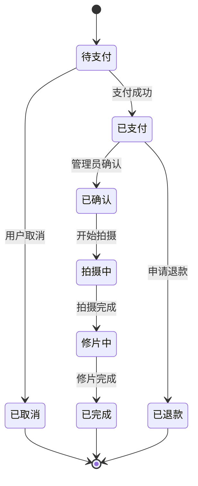
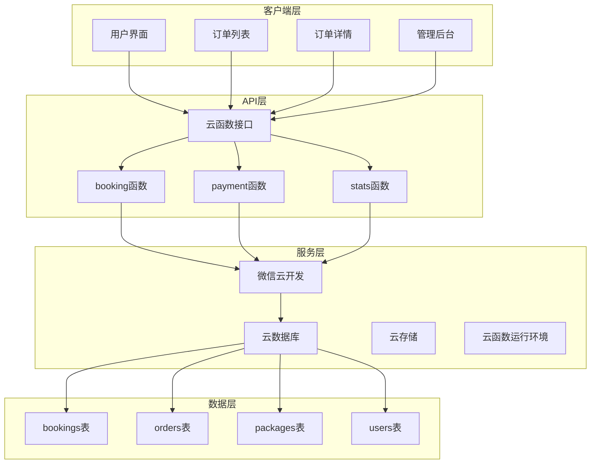
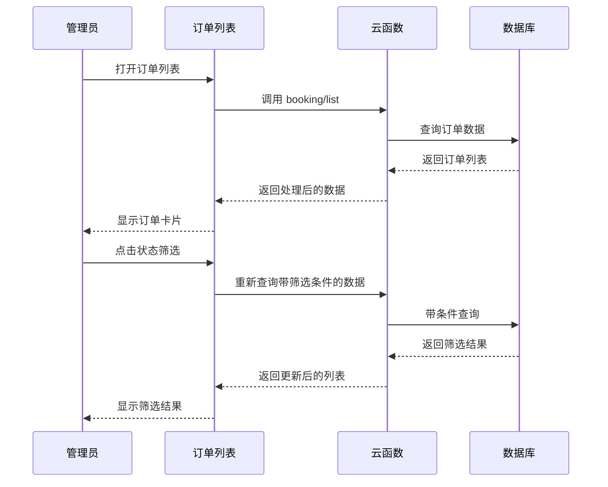
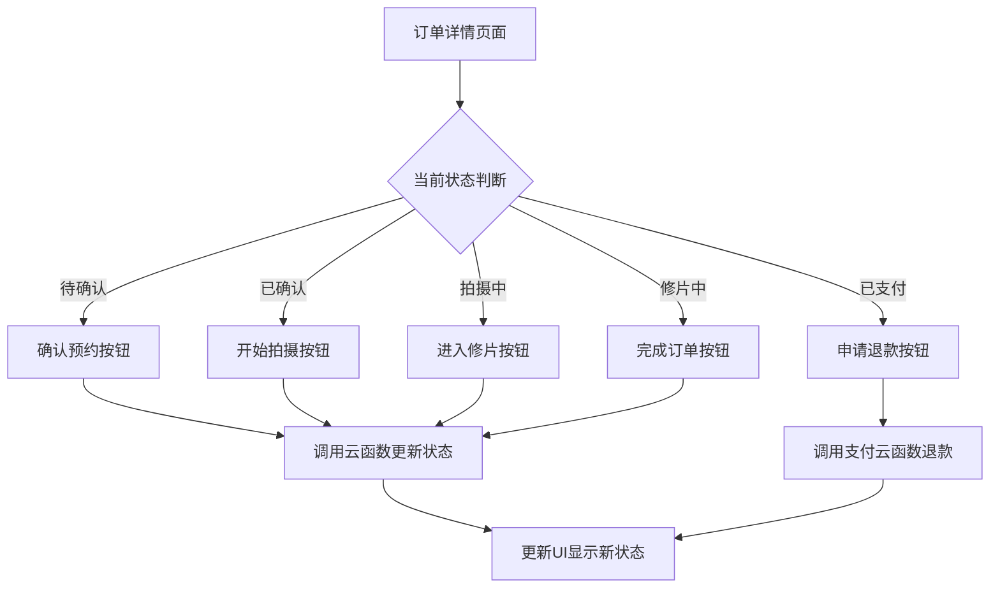
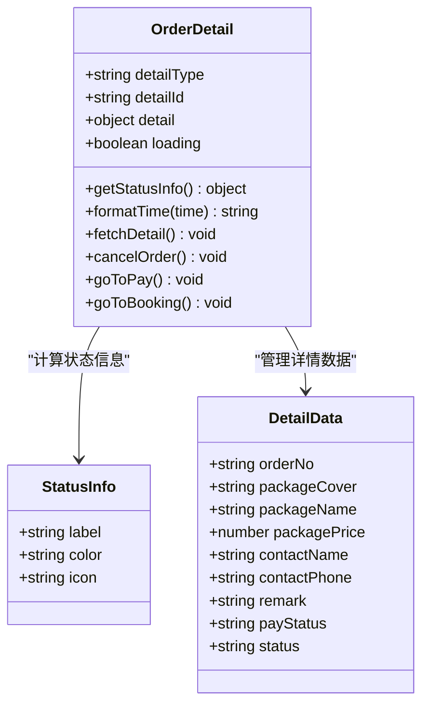
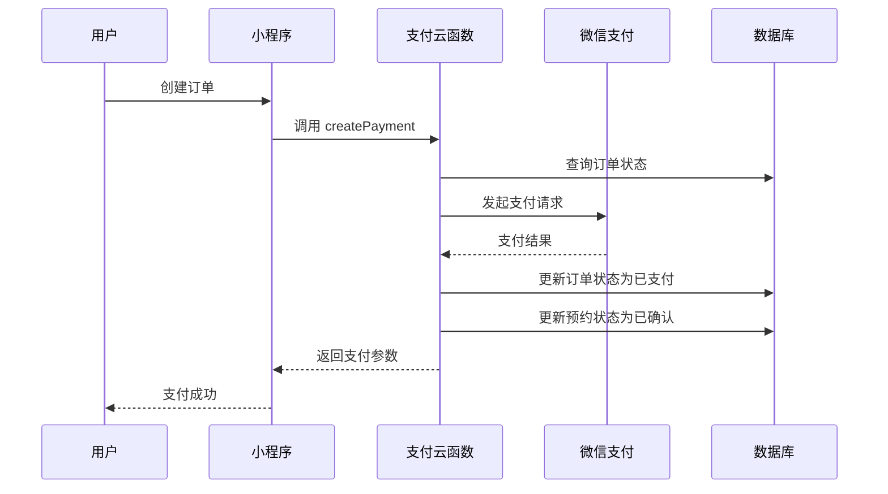
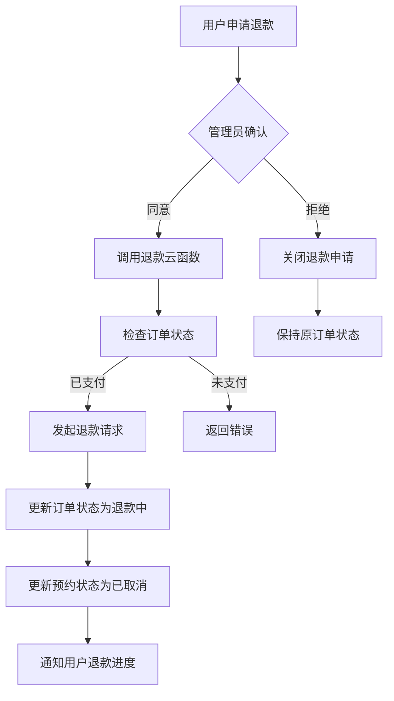
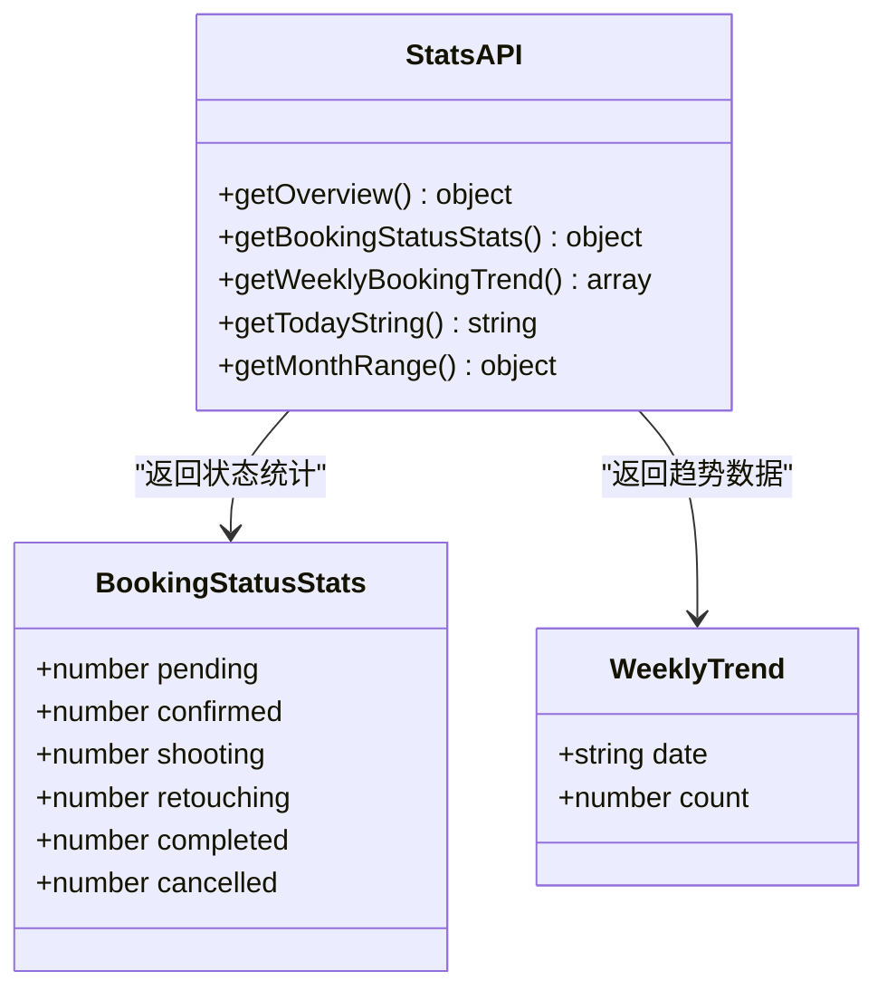
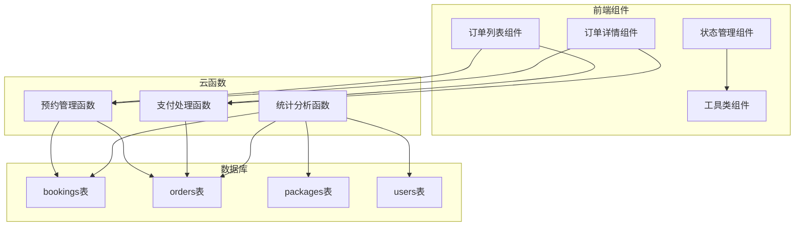

# 订单管理

<cite>
**本文档引用的文件**
- [miniprogram/src/pages-admin/orders/index.vue](file://miniprogram/src/pages-admin/orders/index.vue)
- [miniprogram/src/pages-admin/orders/detail.vue](file://miniprogram/src/pages-admin/orders/detail.vue)
- [miniprogram/src/pages/order/list.vue](file://miniprogram/src/pages/order/list.vue)
- [miniprogram/src/pages/order/detail.vue](file://miniprogram/src/pages/order/detail.vue)
- [miniprogram/cloudfunctions/booking/index.js](file://miniprogram/cloudfunctions/booking/index.js)
- [miniprogram/cloudfunctions/payment/index.js](file://miniprogram/cloudfunctions/payment/index.js)
- [miniprogram/cloudfunctions/stats/index.js](file://miniprogram/cloudfunctions/stats/index.js)
- [miniprogram/src/utils/constants.js](file://miniprogram/src/utils/constants.js)
- [miniprogram/src/utils/cloud.js](file://miniprogram/src/utils/cloud.js)
- [miniprogram/src/store/user.js](file://miniprogram/src/store/user.js)
- [miniprogram/src/pages.json](file://miniprogram/src/pages.json)
</cite>

## 目录
1. [简介](#简介)
2. [项目结构](#项目结构)
3. [核心组件](#核心组件)
4. [架构概览](#架构概览)
5. [详细组件分析](#详细组件分析)
6. [依赖关系分析](#依赖关系分析)
7. [性能考虑](#性能考虑)
8. [故障排除指南](#故障排除指南)
9. [最佳实践](#最佳实践)
10. [结论](#结论)

## 简介

这是一个基于微信小程序的摄影预约系统，专注于订单管理功能。系统提供了完整的订单生命周期管理，包括订单创建、状态跟踪、支付处理、退款管理和数据统计等功能。系统采用前后端分离架构，前端使用Vue.js框架，后端使用微信云开发的云函数和数据库。

## 项目结构

系统采用模块化的项目结构，主要分为以下几个部分：

```mermaid
graph TB
subgraph "前端应用"
A[miniprogram/src/pages] -- 用户端页面
B[miniprogram/src/pages-admin] -- 管理端页面
C[miniprogram/src/utils] -- 工具类
D[miniprogram/src/store] -- 状态管理
end
subgraph "云函数"
E[cloudfunctions/booking] -- 预约管理
F[cloudfunctions/payment] -- 支付处理
G[cloudfunctions/stats] -- 数据统计
end
subgraph "数据库"
H[bookings] -- 预约记录
I[orders] -- 订单记录
J[packages] -- 套餐信息
K[users] -- 用户信息
end
A --> E
A --> F
B --> E
B --> F
B --> G
E --> H
E --> I
F --> I
G --> H
G --> I
```

**图表来源**
- [miniprogram/src/pages.json:77-130](file://miniprogram/src/pages.json#L77-L130)

**章节来源**
- [miniprogram/src/pages.json:1-177](file://miniprogram/src/pages.json#L1-L177)

## 核心组件

### 订单管理架构

系统的核心功能围绕订单管理展开，主要包括以下组件：

1. **订单列表组件** - 展示所有订单的汇总信息
2. **订单详情组件** - 提供订单的详细信息和操作功能
3. **状态管理系统** - 管理订单和预约的状态流转
4. **支付处理系统** - 处理订单支付和退款流程
5. **数据统计系统** - 提供业务数据统计和分析

### 状态管理机制

系统实现了完整的订单状态管理，支持多种状态转换：



**图表来源**
- [miniprogram/src/utils/constants.js:46-56](file://miniprogram/src/utils/constants.js#L46-L56)

**章节来源**
- [miniprogram/src/utils/constants.js:1-73](file://miniprogram/src/utils/constants.js#L1-L73)

## 架构概览

系统采用前后端分离架构，前端负责用户界面展示，后端通过云函数处理业务逻辑。



**图表来源**
- [miniprogram/cloudfunctions/booking/index.js:67-93](file://miniprogram/cloudfunctions/booking/index.js#L67-L93)
- [miniprogram/cloudfunctions/payment/index.js:26-52](file://miniprogram/cloudfunctions/payment/index.js#L26-L52)

## 详细组件分析

### 管理端订单列表

管理端订单列表提供了完整的订单管理功能，支持多种筛选和操作。

#### 主要功能特性

1. **状态筛选** - 支持按订单状态进行筛选
2. **分页加载** - 实现无限滚动的分页加载
3. **实时刷新** - 支持下拉刷新功能
4. **权限控制** - 管理员专用功能

#### 关键实现细节



**图表来源**
- [miniprogram/src/pages-admin/orders/index.vue:132-187](file://miniprogram/src/pages-admin/orders/index.vue#L132-L187)
- [miniprogram/cloudfunctions/booking/index.js:211-259](file://miniprogram/cloudfunctions/booking/index.js#L211-L259)

**章节来源**
- [miniprogram/src/pages-admin/orders/index.vue:1-402](file://miniprogram/src/pages-admin/orders/index.vue#L1-L402)

### 管理端订单详情

订单详情页面提供了丰富的信息展示和操作功能。

#### 信息展示模块

1. **状态卡片** - 显示当前订单状态
2. **客户信息** - 展示客户基本信息
3. **预约信息** - 显示预约相关详情
4. **订单信息** - 展示订单财务信息

#### 操作功能模块



**图表来源**
- [miniprogram/src/pages-admin/orders/detail.vue:172-180](file://miniprogram/src/pages-admin/orders/detail.vue#L172-L180)
- [miniprogram/src/pages-admin/orders/detail.vue:263-311](file://miniprogram/src/pages-admin/orders/detail.vue#L263-L311)

**章节来源**
- [miniprogram/src/pages-admin/orders/detail.vue:1-586](file://miniprogram/src/pages-admin/orders/detail.vue#L1-L586)

### 用户端订单管理

用户端提供了个人订单的查看和管理功能。

#### 订单列表功能

用户端订单列表支持按支付状态进行筛选：

- 全部订单
- 待支付
- 已支付
- 已完成
- 已取消

#### 订单详情功能

用户端订单详情页面展示了订单的完整信息：



**图表来源**
- [miniprogram/src/pages/order/detail.vue:157-172](file://miniprogram/src/pages/order/detail.vue#L157-L172)
- [miniprogram/src/pages/order/detail.vue:150-155](file://miniprogram/src/pages/order/detail.vue#L150-L155)

**章节来源**
- [miniprogram/src/pages/order/list.vue:1-554](file://miniprogram/src/pages/order/list.vue#L1-L554)
- [miniprogram/src/pages/order/detail.vue:1-451](file://miniprogram/src/pages/order/detail.vue#L1-L451)

### 支付处理系统

支付系统实现了完整的支付流程，包括订单创建、支付处理和退款管理。

#### 支付流程



**图表来源**
- [miniprogram/cloudfunctions/payment/index.js:65-166](file://miniprogram/cloudfunctions/payment/index.js#L65-L166)
- [miniprogram/cloudfunctions/payment/index.js:172-239](file://miniprogram/cloudfunctions/payment/index.js#L172-L239)

#### 退款流程



**图表来源**
- [miniprogram/cloudfunctions/payment/index.js:338-450](file://miniprogram/cloudfunctions/payment/index.js#L338-L450)

**章节来源**
- [miniprogram/cloudfunctions/payment/index.js:1-532](file://miniprogram/cloudfunctions/payment/index.js#L1-L532)

### 数据统计系统

统计系统为管理员提供了全面的业务数据分析功能。

#### 核心统计指标

1. **今日预约数** - 当天有效预约的数量
2. **待处理订单数** - 已支付但未完成的预约数量
3. **本月收入** - 当月已支付订单的定金总额
4. **总客片数** - 系统中客片的总数
5. **总预约数** - 系统中预约的总数
6. **总用户数** - 系统中注册用户的总数

#### 统计功能实现



**图表来源**
- [miniprogram/cloudfunctions/stats/index.js:73-162](file://miniprogram/cloudfunctions/stats/index.js#L73-L162)
- [miniprogram/cloudfunctions/stats/index.js:167-228](file://miniprogram/cloudfunctions/stats/index.js#L167-L228)

**章节来源**
- [miniprogram/cloudfunctions/stats/index.js:1-229](file://miniprogram/cloudfunctions/stats/index.js#L1-L229)

## 依赖关系分析

系统各组件之间的依赖关系如下：



**图表来源**
- [miniprogram/src/utils/cloud.js:5-26](file://miniprogram/src/utils/cloud.js#L5-L26)

### 核心依赖关系

1. **权限控制** - 通过用户状态管理器控制管理员权限
2. **数据同步** - 通过云函数实现前后端数据同步
3. **状态管理** - 通过常量定义统一管理状态信息
4. **API封装** - 通过工具类封装云函数调用

**章节来源**
- [miniprogram/src/store/user.js:1-48](file://miniprogram/src/store/user.js#L1-L48)
- [miniprogram/src/utils/cloud.js:1-66](file://miniprogram/src/utils/cloud.js#L1-L66)

## 性能考虑

### 数据加载优化

1. **分页加载** - 实现无限滚动的分页加载，避免一次性加载大量数据
2. **缓存策略** - 合理使用本地缓存减少重复请求
3. **懒加载** - 图片资源采用懒加载方式
4. **请求合并** - 合并相似的请求减少网络开销

### 状态管理优化

1. **响应式更新** - 使用Vue的响应式系统实现高效的状态更新
2. **计算属性** - 使用计算属性避免重复计算
3. **事件节流** - 对频繁触发的操作进行节流处理

### 错误处理优化

1. **统一错误处理** - 通过工具类统一处理错误信息
2. **降级策略** - 实现优雅降级保证用户体验
3. **重试机制** - 对网络请求实现智能重试

## 故障排除指南

### 常见问题及解决方案

#### 订单状态异常

**问题描述**：订单状态无法正常更新
**可能原因**：
1. 权限不足导致状态更新失败
2. 数据库事务处理异常
3. 云函数调用超时

**解决步骤**：
1. 检查用户权限状态
2. 查看云函数日志
3. 验证数据库连接状态

#### 支付处理失败

**问题描述**：支付请求无法正常处理
**可能原因**：
1. 微信支付配置不正确
2. 订单状态异常
3. 网络连接问题

**解决步骤**：
1. 检查支付配置参数
2. 验证订单状态有效性
3. 重试支付请求

#### 数据统计异常

**问题描述**：统计数据不准确或缺失
**可能原因**：
1. 聚合查询执行失败
2. 时间范围计算错误
3. 权限不足

**解决步骤**：
1. 检查聚合查询语法
2. 验证时间范围参数
3. 确认管理员权限

**章节来源**
- [miniprogram/cloudfunctions/booking/index.js:89-93](file://miniprogram/cloudfunctions/booking/index.js#L89-L93)
- [miniprogram/cloudfunctions/payment/index.js:48-52](file://miniprogram/cloudfunctions/payment/index.js#L48-L52)

## 最佳实践

### 订单审核流程

1. **建立审核标准** - 明确订单审核的标准和流程
2. **权限分级管理** - 不同级别的管理员有不同的审核权限
3. **审核记录追踪** - 保留完整的审核历史记录
4. **自动化提醒** - 设置超时提醒和异常通知

### 异常处理策略

1. **预防性检查** - 在关键操作前进行数据验证
2. **优雅降级** - 当某个功能异常时提供替代方案
3. **用户友好提示** - 向用户提供清晰的错误信息
4. **日志记录** - 完整记录异常信息便于排查

### 客户沟通流程

1. **及时响应** - 建立快速响应机制
2. **多渠道沟通** - 支持电话、消息等多种沟通方式
3. **标准化话术** - 提供标准化的沟通模板
4. **满意度跟踪** - 建立客户满意度反馈机制

### 数据管理最佳实践

1. **数据备份** - 定期备份重要数据
2. **数据清理** - 建立数据清理和归档机制
3. **隐私保护** - 严格遵守数据隐私保护法规
4. **性能监控** - 持续监控数据库性能指标

### 系统维护建议

1. **定期更新** - 及时更新系统版本和安全补丁
2. **性能优化** - 定期进行性能评估和优化
3. **容量规划** - 根据业务增长预测系统容量需求
4. **灾难恢复** - 建立完善的灾难恢复预案

## 结论

本订单管理系统通过合理的架构设计和完善的业务逻辑，为摄影预约服务提供了全面的订单管理解决方案。系统具有以下特点：

1. **功能完整性** - 覆盖了订单管理的各个环节
2. **用户体验良好** - 界面简洁直观，操作流畅
3. **扩展性强** - 模块化设计便于功能扩展
4. **安全性高** - 完善的权限控制和数据保护机制

通过遵循本文档中的最佳实践和建议，可以进一步提升系统的稳定性和用户体验，为业务发展提供强有力的技术支撑。