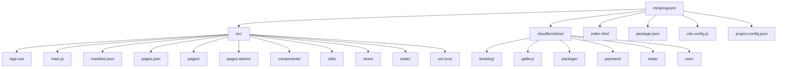
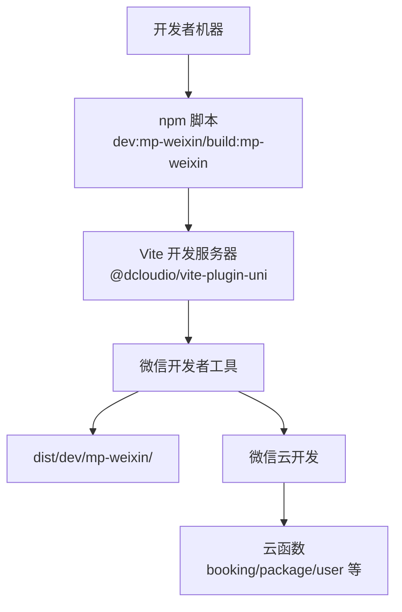
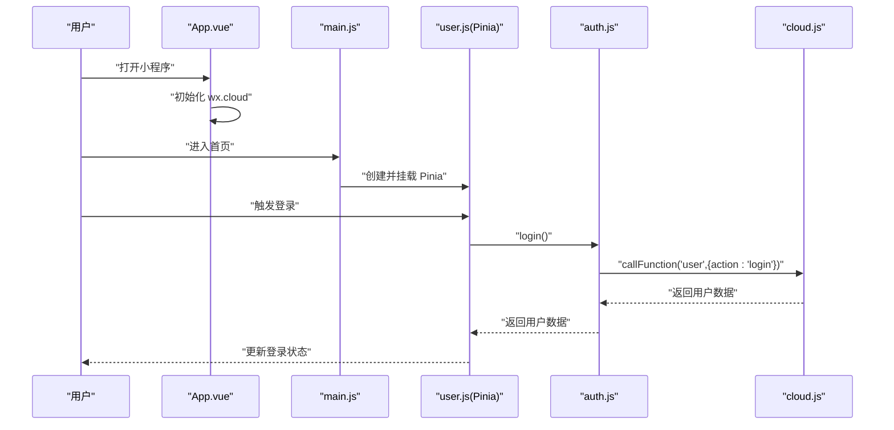
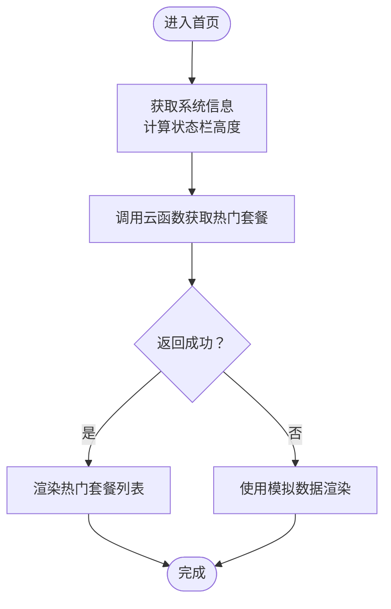

# 快速开始

<cite>
**本文引用的文件**
- [package.json](file://miniprogram/package.json)
- [vite.config.js](file://miniprogram/vite.config.js)
- [project.config.json](file://miniprogram/project.config.json)
- [main.js](file://miniprogram/src/main.js)
- [manifest.json](file://miniprogram/src/manifest.json)
- [pages.json](file://miniprogram/src/pages.json)
- [App.vue](file://miniprogram/src/App.vue)
- [index.vue](file://miniprogram/src/pages/index/index.vue)
- [cloud.js](file://miniprogram/src/utils/cloud.js)
- [auth.js](file://miniprogram/src/utils/auth.js)
- [constants.js](file://miniprogram/src/utils/constants.js)
- [user.js](file://miniprogram/src/store/user.js)
- [PackageCard.vue](file://miniprogram/src/components/PackageCard.vue)
- [FloatingButton.vue](file://miniprogram/src/components/FloatingButton.vue)
- [booking/package.json](file://miniprogram/cloudfunctions/booking/package.json)
- [package/package.json](file://miniprogram/cloudfunctions/package/package.json)
- [user/package.json](file://miniprogram/cloudfunctions/user/package.json)
</cite>

## 目录
1. [简介](#简介)
2. [项目结构](#项目结构)
3. [核心组件](#核心组件)
4. [架构总览](#架构总览)
5. [详细组件分析](#详细组件分析)
6. [依赖分析](#依赖分析)
7. [性能考虑](#性能考虑)
8. [故障排除指南](#故障排除指南)
9. [结论](#结论)
10. [附录](#附录)

## 简介
本指南面向希望快速搭建 lvpai 微信小程序开发与调试环境的开发者。lvpai 是基于 uni-app 3.x 与 Vue 3 的跨平台小程序项目，目标是“成吉思汗陵蒙古袍旅拍预约”场景，包含前台展示页、预约下单、订单管理以及后台管理界面，并集成微信云开发能力。

通过本指南，你将完成：
- 环境准备（Node.js、微信开发者工具）
- 依赖安装与项目配置
- 启动开发服务器与热更新调试
- 构建与发布流程
- 常见问题排查与调试技巧

## 项目结构
miniprogram 为核心目录，包含前端源码、Vite 配置、微信小程序配置、云函数等。

图表来源
- [project.config.json:1-21](file://miniprogram/project.config.json#L1-L21)
- [pages.json:1-177](file://miniprogram/src/pages.json#L1-L177)

章节来源
- [project.config.json:1-21](file://miniprogram/project.config.json#L1-L21)
- [pages.json:1-177](file://miniprogram/src/pages.json#L1-L177)

## 核心组件
- 开发命令：通过 npm scripts 提供一键启动与构建，分别针对微信小程序平台。
- Vite 插件：使用 @dcloudio/vite-plugin-uni 注入 uni-app 平台能力。
- 运行时入口：main.js 创建应用实例并挂载 Pinia。
- 平台配置：manifest.json 与 pages.json 定义小程序名称、分包、tabBar、权限等。
- 云开发初始化：App.vue 在启动时初始化 wx.cloud。
- 工具与状态：cloud.js、auth.js、constants.js、user.js 提供云调用、鉴权、常量与全局用户状态。

章节来源
- [package.json:5-8](file://miniprogram/package.json#L5-L8)
- [vite.config.js:1-7](file://miniprogram/vite.config.js#L1-L7)
- [main.js:1-11](file://miniprogram/src/main.js#L1-L11)
- [manifest.json:1-24](file://miniprogram/src/manifest.json#L1-L24)
- [pages.json:1-177](file://miniprogram/src/pages.json#L1-L177)
- [App.vue:1-26](file://miniprogram/src/App.vue#L1-L26)
- [cloud.js:1-66](file://miniprogram/src/utils/cloud.js#L1-L66)
- [auth.js:1-47](file://miniprogram/src/utils/auth.js#L1-L47)
- [constants.js:1-73](file://miniprogram/src/utils/constants.js#L1-L73)
- [user.js:1-48](file://miniprogram/src/store/user.js#L1-L48)

## 架构总览
下图展示了从开发者本地到微信开发者工具与云开发的整体交互关系。

图表来源
- [package.json:5-8](file://miniprogram/package.json#L5-L8)
- [vite.config.js:1-7](file://miniprogram/vite.config.js#L1-L7)
- [project.config.json:2-3](file://miniprogram/project.config.json#L2-L3)

## 详细组件分析

### 开发命令与构建发布
- 开发命令：npm run dev:mp-weixin
  - 功能：启动 uni-app 对微信小程序平台的开发服务器，支持热更新与源码映射。
  - 实现：通过 uni 命令行参数 -p mp-weixin 指定目标平台。
- 构建命令：npm run build:mp-weixin
  - 功能：编译生成 dist/build/mp-weixin 目标产物，用于发布或体验版预览。
- Vite 配置：vite.config.js 引入 @dcloudio/vite-plugin-uni，使 Vite 具备 uni-app 平台能力。
- 项目配置：project.config.json 指定 miniprogramRoot 为 dist/dev/mp-weixin/，便于微信开发者工具自动识别构建输出。

章节来源
- [package.json:5-8](file://miniprogram/package.json#L5-L8)
- [vite.config.js:1-7](file://miniprogram/vite.config.js#L1-L7)
- [project.config.json:2-3](file://miniprogram/project.config.json#L2-L3)

### 应用入口与状态管理
- main.js：创建 SSR 应用实例，注册 Pinia，导出 createApp 供 uni-app 使用。
- App.vue：应用生命周期 onLaunch 中初始化 wx.cloud，确保后续云函数与云存储可用。
- user.js（Pinia Store）：封装登录、获取用户资料、判断管理员等逻辑，统一管理用户态。

图表来源
- [App.vue:1-26](file://miniprogram/src/App.vue#L1-L26)
- [main.js:1-11](file://miniprogram/src/main.js#L1-L11)
- [user.js:1-48](file://miniprogram/src/store/user.js#L1-L48)
- [auth.js:1-47](file://miniprogram/src/utils/auth.js#L1-L47)
- [cloud.js:1-66](file://miniprogram/src/utils/cloud.js#L1-L66)

章节来源
- [main.js:1-11](file://miniprogram/src/main.js#L1-L11)
- [App.vue:1-26](file://miniprogram/src/App.vue#L1-L26)
- [user.js:1-48](file://miniprogram/src/store/user.js#L1-L48)
- [auth.js:1-47](file://miniprogram/src/utils/auth.js#L1-L47)
- [cloud.js:1-66](file://miniprogram/src/utils/cloud.js#L1-L66)

### 页面与导航
- pages.json：定义所有页面路径、分包、tabBar、全局样式等。
- 首页 index.vue：展示轮播、快捷入口、热门套餐、场景推荐与信任背书等模块；通过云函数调用获取套餐数据；悬浮预约按钮跳转至预约页。
- 组件化：PackageCard.vue 展示套餐卡片；FloatingButton.vue 提供悬浮预约入口。

图表来源
- [index.vue:150-178](file://miniprogram/src/pages/index/index.vue#L150-L178)

章节来源
- [pages.json:1-177](file://miniprogram/src/pages.json#L1-L177)
- [index.vue:1-521](file://miniprogram/src/pages/index/index.vue#L1-L521)
- [PackageCard.vue:1-100](file://miniprogram/src/components/PackageCard.vue#L1-L100)
- [FloatingButton.vue:1-48](file://miniprogram/src/components/FloatingButton.vue#L1-L48)

### 云开发与云函数
- 云开发初始化：App.vue 在启动时初始化 wx.cloud。
- 云函数调用封装：cloud.js 提供 callFunction、uploadFile、getTempFileURL、deleteFile、getDB 等常用接口。
- 云函数依赖：各云函数目录下的 package.json 引入 wx-server-sdk。
- 用户相关：auth.js 封装登录与用户资料查询；user.js 使用 Pinia 管理用户态。

章节来源
- [App.vue:1-26](file://miniprogram/src/App.vue#L1-L26)
- [cloud.js:1-66](file://miniprogram/src/utils/cloud.js#L1-L66)
- [auth.js:1-47](file://miniprogram/src/utils/auth.js#L1-L47)
- [booking/package.json:1-7](file://miniprogram/cloudfunctions/booking/package.json#L1-L7)
- [package/package.json:1-7](file://miniprogram/cloudfunctions/package/package.json#L1-L7)
- [user/package.json:1-7](file://miniprogram/cloudfunctions/user/package.json#L1-L7)

## 依赖分析
- 运行时依赖
  - @dcloudio/uni-app、@dcloudio/uni-mp-weixin、@dcloudio/uni-components：提供 uni-app 与微信小程序平台能力。
  - vue：3.x 版本。
  - pinia：状态管理。
- 开发依赖
  - @dcloudio/uni-cli-shared、@dcloudio/vite-plugin-uni、vite：构建与开发服务器。
- 云函数依赖
  - wx-server-sdk：云函数运行时 SDK。

章节来源
- [package.json:9-20](file://miniprogram/package.json#L9-L20)
- [booking/package.json:1-7](file://miniprogram/cloudfunctions/booking/package.json#L1-L7)
- [package/package.json:1-7](file://miniprogram/cloudfunctions/package/package.json#L1-L7)
- [user/package.json:1-7](file://miniprogram/cloudfunctions/user/package.json#L1-L7)

## 性能考虑
- 分包策略：pages-admin 作为独立分包，减少主包体积，提升首屏加载速度。
- 图片懒加载：组件内使用懒加载策略，降低首屏压力。
- 云函数调用：避免频繁调用，合并请求，合理缓存。
- 样式与资源：统一使用 uni.scss，减少重复样式，控制静态资源体积。

章节来源
- [pages.json:77-131](file://miniprogram/src/pages.json#L77-L131)
- [PackageCard.vue:33-100](file://miniprogram/src/components/PackageCard.vue#L33-L100)

## 故障排除指南
- 无法启动开发服务器
  - 确认 Node.js 版本满足项目要求（建议使用 LTS 版本）。
  - 确认已安装依赖：执行 npm install。
  - 确认未被防火墙或代理阻断网络访问。
- 微信开发者工具无法识别项目
  - 确认 project.config.json 的 miniprogramRoot 指向 dist/dev/mp-weixin。
  - 在微信开发者工具中选择“添加项目”，根目录指向 miniprogram。
- 云函数调用失败
  - 确认已在 App.vue 中初始化 wx.cloud。
  - 确认云函数已上传并在微信开发者工具中部署。
  - 查看控制台错误日志，定位 callFunction 返回的 result 或错误对象。
- 登录或用户信息获取异常
  - 检查 auth.js 中 login 与 getUserProfile 的调用链路。
  - 确认云函数 user 的实现与权限配置正确。
- 构建产物未更新
  - 清理缓存后重新构建：删除 dist 目录并重新执行构建命令。
- 分包页面无法访问
  - 检查 pages.json 中 subPackages 配置与页面路径是否一致。

章节来源
- [project.config.json:2-3](file://miniprogram/project.config.json#L2-L3)
- [App.vue:1-26](file://miniprogram/src/App.vue#L1-L26)
- [cloud.js:1-66](file://miniprogram/src/utils/cloud.js#L1-L66)
- [auth.js:1-47](file://miniprogram/src/utils/auth.js#L1-L47)
- [pages.json:77-131](file://miniprogram/src/pages.json#L77-L131)

## 结论
按照本指南完成环境准备、依赖安装与配置后，即可通过 npm run dev:mp-weixin 快速启动开发服务器，并在微信开发者工具中进行调试。构建阶段使用 npm run build:mp-weixin 生成生产产物。结合分包策略、组件化与云开发能力，可高效迭代 lvpai 小程序的功能与体验。

## 附录

### 环境要求
- Node.js：建议使用长期支持版本（LTS）。
- 微信开发者工具：用于预览与调试小程序。
- 云开发：需在微信公众平台开通云开发并完成初始化。

章节来源
- [App.vue:1-26](file://miniprogram/src/App.vue#L1-L26)

### 依赖安装步骤
- 在 miniprogram 目录执行安装命令，安装运行时与开发依赖。
- 若网络受限，可配置 npm registry 或使用 cnpm/yarn。

章节来源
- [package.json:9-20](file://miniprogram/package.json#L9-L20)

### 项目配置说明
- manifest.json：小程序基础信息、平台特定设置、权限声明与云函数根目录。
- pages.json：页面路由、分包、tabBar、全局样式。
- project.config.json：开发者工具项目配置，包括 miniprogramRoot、cloudfunctionRoot、编译设置等。

章节来源
- [manifest.json:1-24](file://miniprogram/src/manifest.json#L1-L24)
- [pages.json:1-177](file://miniprogram/src/pages.json#L1-L177)
- [project.config.json:1-21](file://miniprogram/project.config.json#L1-L21)

### 启动与调试流程
- 启动开发服务器：npm run dev:mp-weixin
- 在微信开发者工具中打开 miniprogram 根目录
- 修改源码后自动热更新，可在工具中实时查看效果
- 如需预览体验版，执行构建命令并上传

章节来源
- [package.json:5-8](file://miniprogram/package.json#L5-L8)
- [project.config.json:2-3](file://miniprogram/project.config.json#L2-L3)

### 构建与发布流程
- 开发构建：npm run build:mp-weixin
- 发布前检查：确认 pages.json、manifest.json、分包与权限配置无误
- 上传与审核：在微信公众平台上传代码并提交审核

章节来源
- [package.json:7-7](file://miniprogram/package.json#L7-L7)
- [pages.json:1-177](file://miniprogram/src/pages.json#L1-L177)
- [manifest.json:1-24](file://miniprogram/src/manifest.json#L1-L24)

### 常用命令速查
- 开发：npm run dev:mp-weixin
- 构建：npm run build:mp-weixin

章节来源
- [package.json:5-8](file://miniprogram/package.json#L5-L8)