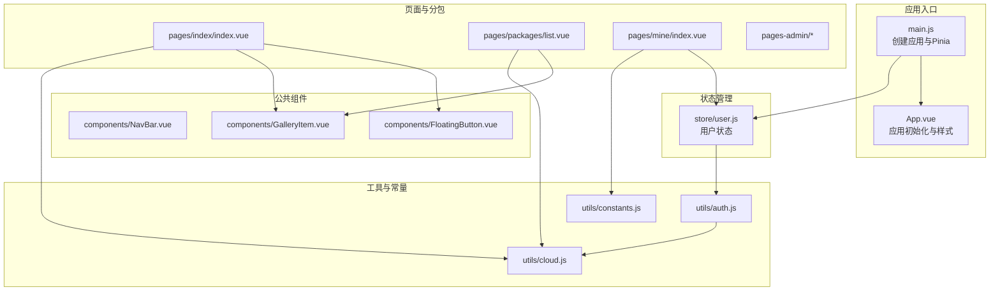
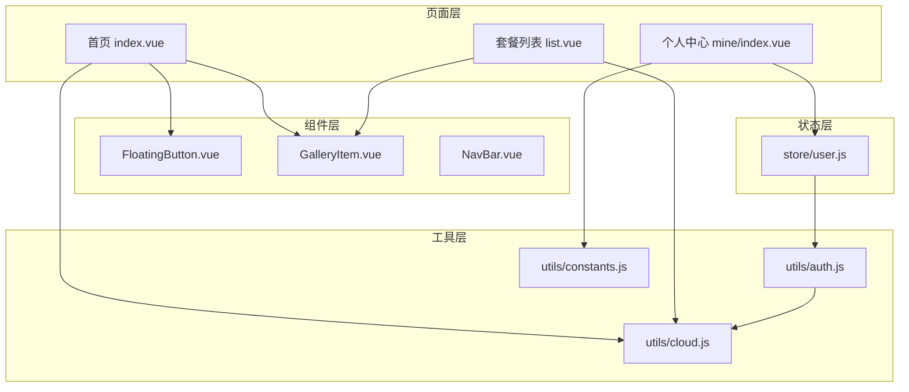
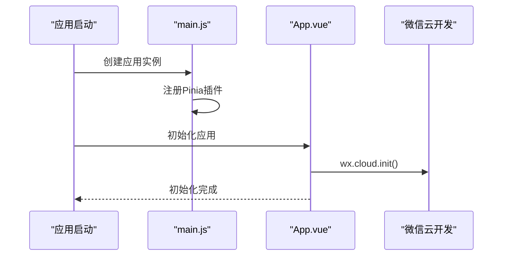
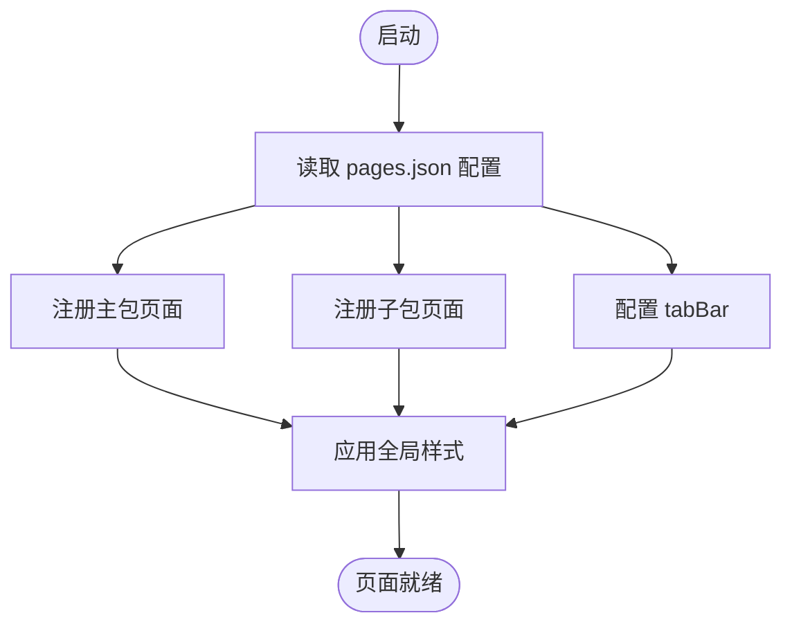
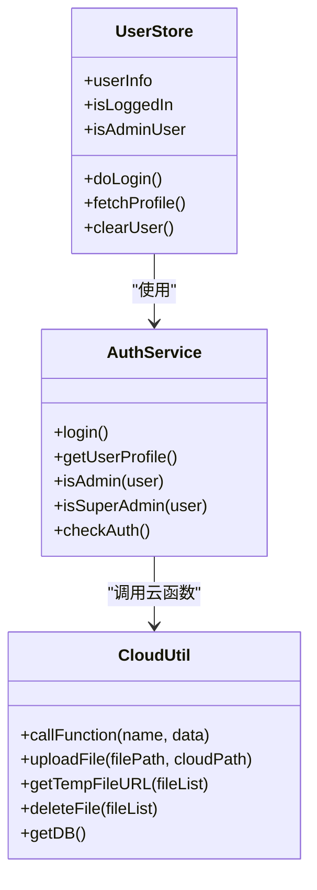
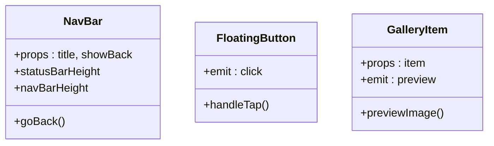
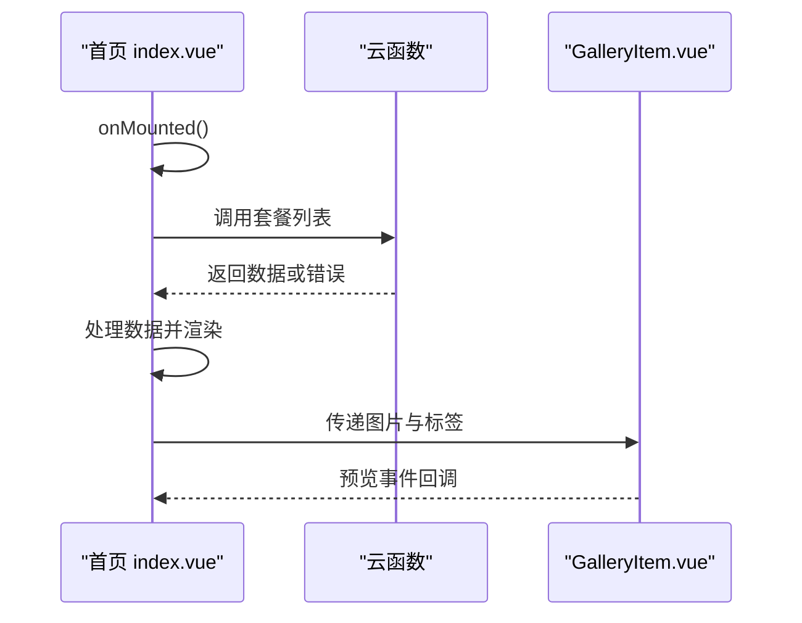
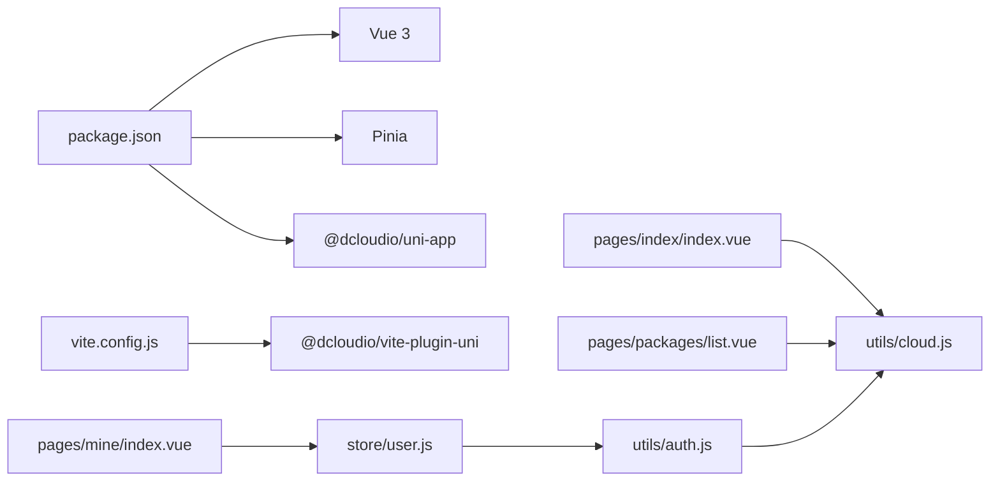

# 前端架构设计

<cite>
**本文档引用的文件**
- [main.js](file://miniprogram/src/main.js)
- [App.vue](file://miniprogram/src/App.vue)
- [pages.json](file://miniprogram/src/pages.json)
- [package.json](file://miniprogram/package.json)
- [vite.config.js](file://miniprogram/vite.config.js)
- [user.js](file://miniprogram/src/store/user.js)
- [auth.js](file://miniprogram/src/utils/auth.js)
- [cloud.js](file://miniprogram/src/utils/cloud.js)
- [constants.js](file://miniprogram/src/utils/constants.js)
- [NavBar.vue](file://miniprogram/src/components/NavBar.vue)
- [FloatingButton.vue](file://miniprogram/src/components/FloatingButton.vue)
- [GalleryItem.vue](file://miniprogram/src/components/GalleryItem.vue)
- [index.vue](file://miniprogram/src/pages/index/index.vue)
- [list.vue](file://miniprogram/src/pages/packages/list.vue)
- [index.vue](file://miniprogram/src/pages/mine/index.vue)
</cite>

## 目录
1. [引言](#引言)
2. [项目结构](#项目结构)
3. [核心组件](#核心组件)
4. [架构总览](#架构总览)
5. [详细组件分析](#详细组件分析)
6. [依赖关系分析](#依赖关系分析)
7. [性能考虑](#性能考虑)
8. [故障排除指南](#故障排除指南)
9. [结论](#结论)

## 引言
本文件面向 lvpai 项目，系统性阐述基于 UniApp + Vue 3 的前端架构设计与实现。重点覆盖以下方面：
- Vue 3 Composition API 在页面与组件中的应用
- Pinia 状态管理在用户态与全局配置中的落地
- 组件化架构设计理念与模块职责划分
- 前端路由与页面结构配置
- UniApp 跨平台开发优势及小程序原生能力封装
- 性能优化策略、代码分割与懒加载实践

## 项目结构
lvpai 采用典型的 UniApp 工程目录，页面按功能分包组织，公共组件与工具方法集中管理，状态通过 Pinia 进行集中管理。

**图表来源**
- [main.js:1-11](file://miniprogram/src/main.js#L1-L11)
- [App.vue:1-26](file://miniprogram/src/App.vue#L1-L26)
- [pages.json:1-177](file://miniprogram/src/pages.json#L1-L177)
- [user.js:1-48](file://miniprogram/src/store/user.js#L1-L48)
- [auth.js:1-47](file://miniprogram/src/utils/auth.js#L1-L47)
- [cloud.js:1-66](file://miniprogram/src/utils/cloud.js#L1-L66)
- [constants.js:1-73](file://miniprogram/src/utils/constants.js#L1-L73)
- [NavBar.vue:1-79](file://miniprogram/src/components/NavBar.vue#L1-L79)
- [FloatingButton.vue:1-48](file://miniprogram/src/components/FloatingButton.vue#L1-L48)
- [GalleryItem.vue:1-60](file://miniprogram/src/components/GalleryItem.vue#L1-L60)
- [index.vue:1-521](file://miniprogram/src/pages/index/index.vue#L1-L521)
- [list.vue:1-305](file://miniprogram/src/pages/packages/list.vue#L1-L305)
- [index.vue:1-309](file://miniprogram/src/pages/mine/index.vue#L1-L309)

**章节来源**
- [main.js:1-11](file://miniprogram/src/main.js#L1-L11)
- [App.vue:1-26](file://miniprogram/src/App.vue#L1-L26)
- [pages.json:1-177](file://miniprogram/src/pages.json#L1-L177)
- [package.json:1-22](file://miniprogram/package.json#L1-L22)
- [vite.config.js:1-7](file://miniprogram/vite.config.js#L1-L7)

## 核心组件
- 应用入口与初始化：在应用入口创建 Vue 实例与 Pinia，并在 App.vue 中完成云开发初始化与全局样式引入。
- 页面路由与分包：通过 pages.json 配置主包页面、子包页面与 tabBar，实现清晰的页面结构与导航体验。
- 状态管理：使用 Pinia 定义用户状态仓库，封装登录、用户信息获取与权限判断等逻辑。
- 工具与常量：统一管理业务常量、云函数调用封装与鉴权逻辑，便于复用与维护。
- 公共组件：提供可复用的导航栏、悬浮按钮、客片卡片等组件，提升开发效率与一致性。

**章节来源**
- [main.js:1-11](file://miniprogram/src/main.js#L1-L11)
- [App.vue:1-26](file://miniprogram/src/App.vue#L1-L26)
- [pages.json:1-177](file://miniprogram/src/pages.json#L1-L177)
- [user.js:1-48](file://miniprogram/src/store/user.js#L1-L48)
- [auth.js:1-47](file://miniprogram/src/utils/auth.js#L1-L47)
- [cloud.js:1-66](file://miniprogram/src/utils/cloud.js#L1-L66)
- [constants.js:1-73](file://miniprogram/src/utils/constants.js#L1-L73)
- [NavBar.vue:1-79](file://miniprogram/src/components/NavBar.vue#L1-L79)
- [FloatingButton.vue:1-48](file://miniprogram/src/components/FloatingButton.vue#L1-L48)
- [GalleryItem.vue:1-60](file://miniprogram/src/components/GalleryItem.vue#L1-L60)

## 架构总览
lvpai 前端采用“页面 + 组件 + 状态 + 工具”的分层架构：
- 页面层：负责业务页面展示与交互，通过 Composition API 管理生命周期与响应式数据。
- 组件层：提供高内聚、低耦合的可复用 UI 组件，支持 Props 传递与事件发射。
- 状态层：使用 Pinia 管理用户态与全局共享状态，避免跨组件重复请求与状态同步问题。
- 工具层：封装云函数调用、鉴权与常量定义，统一业务规则与接口协议。

**图表来源**
- [index.vue:1-521](file://miniprogram/src/pages/index/index.vue#L1-L521)
- [list.vue:1-305](file://miniprogram/src/pages/packages/list.vue#L1-L305)
- [index.vue:1-309](file://miniprogram/src/pages/mine/index.vue#L1-L309)
- [FloatingButton.vue:1-48](file://miniprogram/src/components/FloatingButton.vue#L1-L48)
- [GalleryItem.vue:1-60](file://miniprogram/src/components/GalleryItem.vue#L1-L60)
- [NavBar.vue:1-79](file://miniprogram/src/components/NavBar.vue#L1-L79)
- [user.js:1-48](file://miniprogram/src/store/user.js#L1-L48)
- [auth.js:1-47](file://miniprogram/src/utils/auth.js#L1-L47)
- [cloud.js:1-66](file://miniprogram/src/utils/cloud.js#L1-L66)
- [constants.js:1-73](file://miniprogram/src/utils/constants.js#L1-L73)

## 详细组件分析

### 应用入口与初始化
- 应用创建：在入口文件中创建 Vue SSR 应用实例并挂载 Pinia 插件，确保全局状态可用。
- 应用初始化：在 App.vue 中进行云开发初始化，保证后续云函数与云存储调用可用。
- 全局样式：引入 uni.scss 并设置基础页面样式，统一字体、字号与颜色体系。

**图表来源**
- [main.js:1-11](file://miniprogram/src/main.js#L1-L11)
- [App.vue:1-26](file://miniprogram/src/App.vue#L1-L26)

**章节来源**
- [main.js:1-11](file://miniprogram/src/main.js#L1-L11)
- [App.vue:1-26](file://miniprogram/src/App.vue#L1-L26)

### 页面路由与结构
- 主包页面：首页、套餐、客片、预约、支付、门店、我的、订单等页面。
- 子包页面：管理后台相关页面，实现业务隔离与包体拆分。
- tabBar：统一的底部导航，包含首页、套餐、客片、门店、我的五个入口。
- 全局样式：统一导航栏文字颜色、背景色与页面背景色。

**图表来源**
- [pages.json:1-177](file://miniprogram/src/pages.json#L1-L177)

**章节来源**
- [pages.json:1-177](file://miniprogram/src/pages.json#L1-L177)

### 状态管理：用户状态与权限
- 用户仓库：使用 defineStore 定义用户状态，包含用户信息、登录态与管理员态计算属性。
- 登录流程：封装登录与获取用户信息的异步逻辑，统一错误处理。
- 权限判断：提供管理员与超级管理员判断方法，供页面条件渲染与功能控制。

**图表来源**
- [user.js:1-48](file://miniprogram/src/store/user.js#L1-L48)
- [auth.js:1-47](file://miniprogram/src/utils/auth.js#L1-L47)
- [cloud.js:1-66](file://miniprogram/src/utils/cloud.js#L1-L66)

**章节来源**
- [user.js:1-48](file://miniprogram/src/store/user.js#L1-L48)
- [auth.js:1-47](file://miniprogram/src/utils/auth.js#L1-L47)
- [cloud.js:1-66](file://miniprogram/src/utils/cloud.js#L1-L66)

### 组件化架构：导航栏与悬浮按钮
- 导航栏组件：支持自定义标题、返回按钮与插槽扩展，适配不同页面的导航需求。
- 悬浮按钮组件：提供统一的“立即预约”入口，支持点击事件发射与页面跳转。
- 客片卡片组件：封装图片预览与标签展示，支持懒加载与事件发射。

**图表来源**
- [NavBar.vue:1-79](file://miniprogram/src/components/NavBar.vue#L1-L79)
- [FloatingButton.vue:1-48](file://miniprogram/src/components/FloatingButton.vue#L1-L48)
- [GalleryItem.vue:1-60](file://miniprogram/src/components/GalleryItem.vue#L1-L60)

**章节来源**
- [NavBar.vue:1-79](file://miniprogram/src/components/NavBar.vue#L1-L79)
- [FloatingButton.vue:1-48](file://miniprogram/src/components/FloatingButton.vue#L1-L48)
- [GalleryItem.vue:1-60](file://miniprogram/src/components/GalleryItem.vue#L1-L60)

### 页面实现：首页、套餐列表与个人中心
- 首页：轮播 Banner、快捷入口、热门套餐、必拍场景与信任背书，结合骨架屏与懒加载优化首屏体验。
- 套餐列表：分类标签切换、引导文案、骨架屏加载与空状态提示，统一云函数调用与错误处理。
- 个人中心：用户信息展示、登录入口、功能菜单、管理员入口与联系方式，结合 Pinia 用户态与常量配置。

**图表来源**
- [index.vue:1-521](file://miniprogram/src/pages/index/index.vue#L1-L521)
- [list.vue:1-305](file://miniprogram/src/pages/packages/list.vue#L1-L305)
- [index.vue:1-309](file://miniprogram/src/pages/mine/index.vue#L1-L309)
- [GalleryItem.vue:1-60](file://miniprogram/src/components/GalleryItem.vue#L1-L60)
- [cloud.js:1-66](file://miniprogram/src/utils/cloud.js#L1-L66)

**章节来源**
- [index.vue:1-521](file://miniprogram/src/pages/index/index.vue#L1-L521)
- [list.vue:1-305](file://miniprogram/src/pages/packages/list.vue#L1-L305)
- [index.vue:1-309](file://miniprogram/src/pages/mine/index.vue#L1-L309)
- [cloud.js:1-66](file://miniprogram/src/utils/cloud.js#L1-L66)

## 依赖关系分析
- 技术栈依赖：Vue 3、Pinia、UniApp CLI 与 Vite 插件，构建与运行环境由 package.json 与 vite.config.js 管理。
- 页面与组件：页面通过 import 方式引入组件与工具，形成单向依赖，降低耦合度。
- 状态与工具：页面与组件通过状态仓库与工具函数访问云能力，保持业务逻辑集中与可测试性。

**图表来源**
- [package.json:1-22](file://miniprogram/package.json#L1-L22)
- [vite.config.js:1-7](file://miniprogram/vite.config.js#L1-L7)
- [index.vue:1-521](file://miniprogram/src/pages/index/index.vue#L1-L521)
- [list.vue:1-305](file://miniprogram/src/pages/packages/list.vue#L1-L305)
- [index.vue:1-309](file://miniprogram/src/pages/mine/index.vue#L1-L309)
- [user.js:1-48](file://miniprogram/src/store/user.js#L1-L48)
- [auth.js:1-47](file://miniprogram/src/utils/auth.js#L1-L47)
- [cloud.js:1-66](file://miniprogram/src/utils/cloud.js#L1-L66)

**章节来源**
- [package.json:1-22](file://miniprogram/package.json#L1-L22)
- [vite.config.js:1-7](file://miniprogram/vite.config.js#L1-L7)

## 性能考虑
- 骨架屏与懒加载：在套餐列表页使用骨架屏减少白屏时间，图片组件启用懒加载降低首屏压力。
- 代码分割与分包：通过 pages.json 的 subPackages 对管理后台进行独立分包，减小主包体积，提升下载速度。
- 状态缓存：Pinia 管理用户态，避免重复登录与频繁请求；云函数调用结果在页面内缓存，减少重复网络请求。
- 图标与资源：统一使用静态资源与图标，避免动态拼接导致的额外请求；合理设置图片尺寸与格式，减少带宽消耗。
- 首屏优化：首页采用骨架屏与渐进式渲染，结合滚动监听与条件渲染，提升感知性能。

[本节为通用性能建议，不直接分析具体文件]

## 故障排除指南
- 登录失败：检查云函数 user 的 login 接口返回值与错误日志，确认用户授权与 session 状态。
- 云函数调用失败：核对 callFunction 的 name 与 data 参数，查看失败回调中的错误信息。
- 权限不足：确认用户角色字段 role，区分普通管理员与超级管理员，避免误操作。
- 页面跳转异常：检查 pages.json 中的路径配置与 tabBar 设置，确保页面存在且路径正确。
- 样式冲突：统一使用 uni.scss 与 scoped 样式，避免全局污染；必要时使用深度选择器。

**章节来源**
- [auth.js:1-47](file://miniprogram/src/utils/auth.js#L1-L47)
- [cloud.js:1-66](file://miniprogram/src/utils/cloud.js#L1-L66)
- [pages.json:1-177](file://miniprogram/src/pages.json#L1-L177)

## 结论
lvpai 前端架构以 UniApp + Vue 3 为基础，结合 Pinia 实现了清晰的状态管理与组件化设计。通过 pages.json 的路由与分包配置，实现了良好的页面结构与加载性能。工具层对云开发能力的封装提升了开发效率与可维护性。整体架构具备跨平台扩展潜力，同时在小程序端提供了统一的开发体验与原生能力支持。