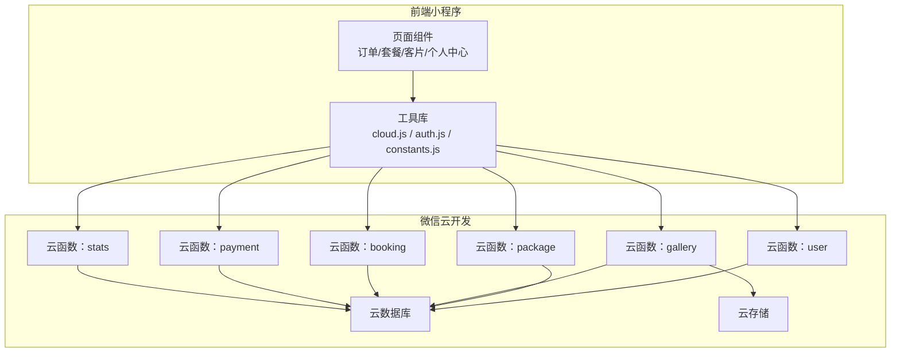
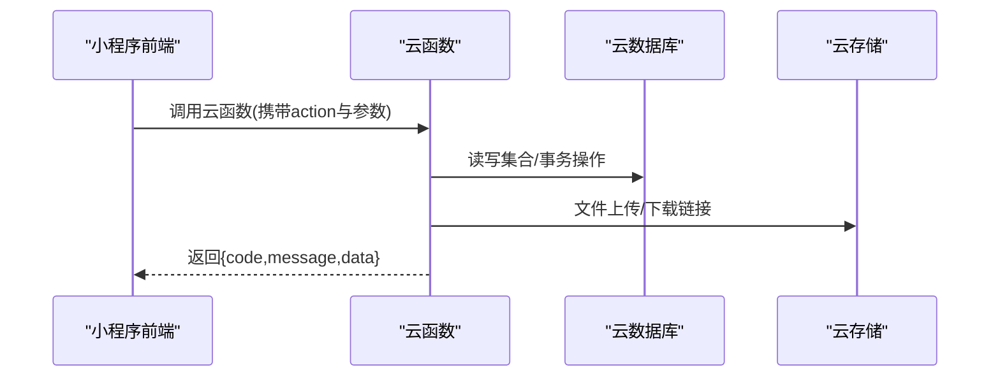
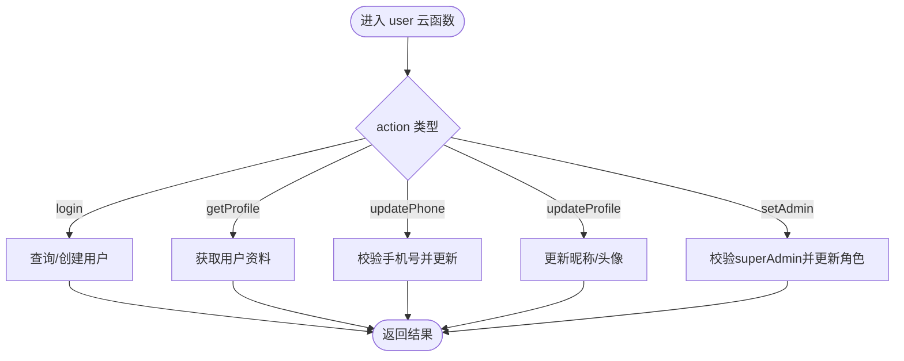
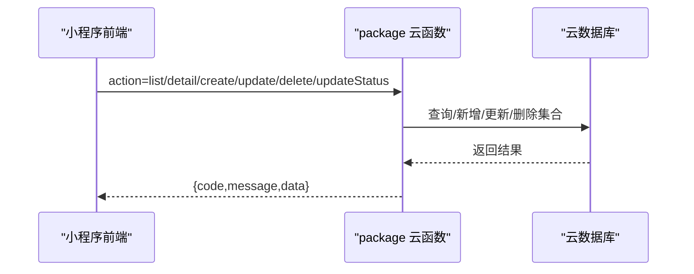
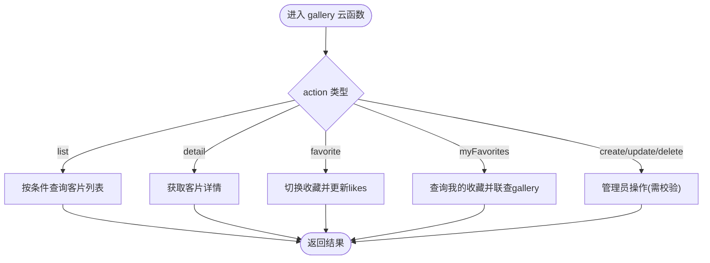
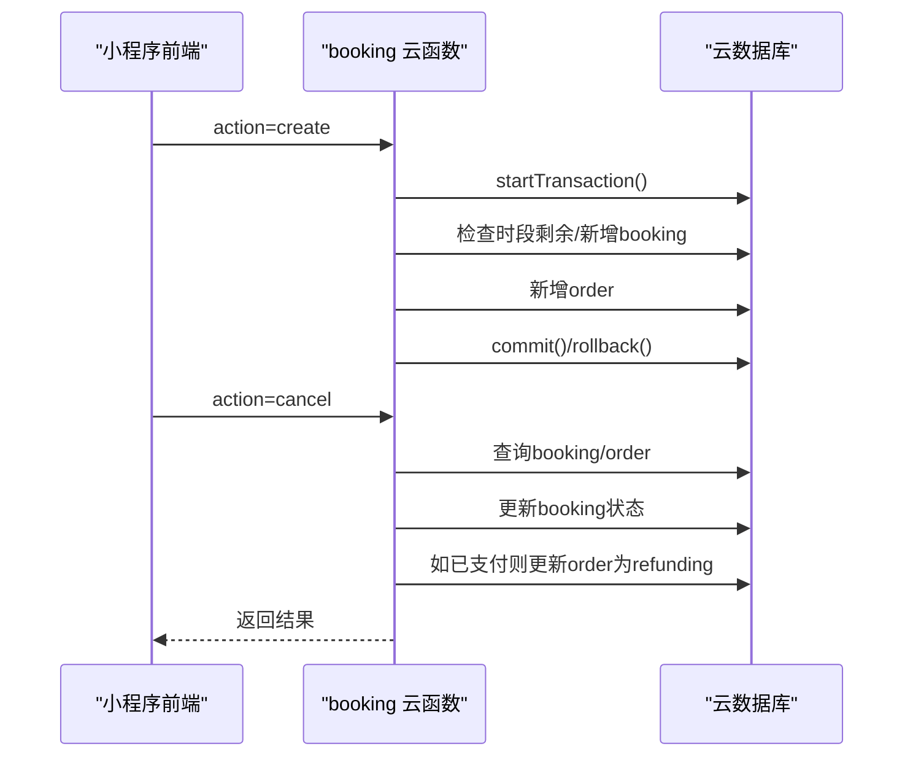
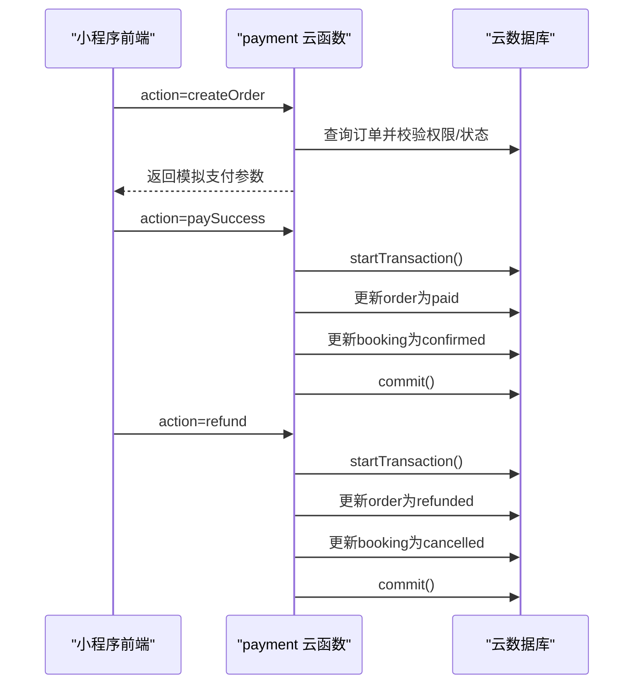
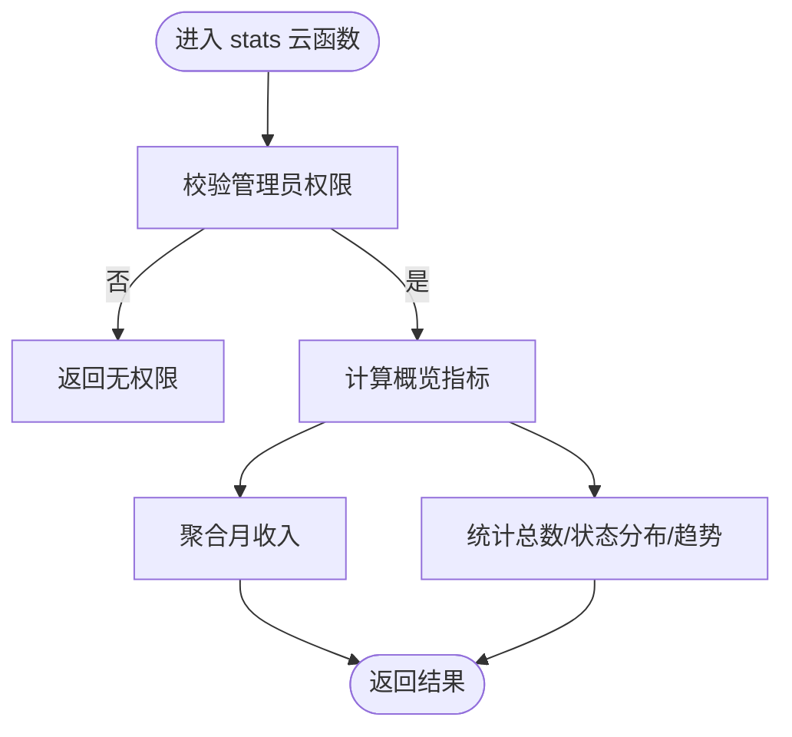
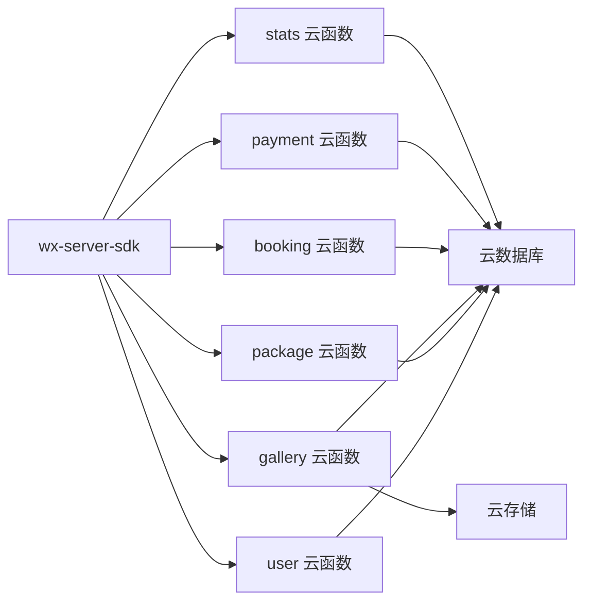

# 后端架构设计

<cite>
**本文档引用的文件**
- [booking/index.js](file://miniprogram/cloudfunctions/booking/index.js)
- [booking/package.json](file://miniprogram/cloudfunctions/booking/package.json)
- [gallery/index.js](file://miniprogram/cloudfunctions/gallery/index.js)
- [gallery/package.json](file://miniprogram/cloudfunctions/gallery/package.json)
- [package/index.js](file://miniprogram/cloudfunctions/package/index.js)
- [package/package.json](file://miniprogram/cloudfunctions/package/package.json)
- [payment/index.js](file://miniprogram/cloudfunctions/payment/index.js)
- [payment/package.json](file://miniprogram/cloudfunctions/payment/package.json)
- [stats/index.js](file://miniprogram/cloudfunctions/stats/index.js)
- [stats/package.json](file://miniprogram/cloudfunctions/stats/package.json)
- [user/index.js](file://miniprogram/cloudfunctions/user/index.js)
- [user/package.json](file://miniprogram/cloudfunctions/user/package.json)
- [cloud.js](file://miniprogram/src/utils/cloud.js)
- [auth.js](file://miniprogram/src/utils/auth.js)
- [constants.js](file://miniprogram/src/utils/constants.js)
</cite>

## 目录
1. [简介](#简介)
2. [项目结构](#项目结构)
3. [核心组件](#核心组件)
4. [架构总览](#架构总览)
5. [详细组件分析](#详细组件分析)
6. [依赖关系分析](#依赖关系分析)
7. [性能考虑](#性能考虑)
8. [故障排查指南](#故障排查指南)
9. [结论](#结论)
10. [附录](#附录)

## 简介
本项目采用微信云开发的无服务器架构，通过云函数实现业务模块化拆分，结合云数据库与云存储，构建从用户管理、套餐管理、客片展示、预约管理到支付与统计的完整后端能力。系统遵循微服务理念，将不同业务域拆分为独立的云函数，便于维护与扩展；同时利用云数据库事务保证关键流程的数据一致性，通过统一的云函数调用封装简化前端集成。

## 项目结构
后端以“云函数”为核心单元，按业务域划分为六个功能模块：
- 用户模块：用户登录、资料管理、权限控制
- 套餐模块：套餐列表、详情、上下架与管理
- 客片模块：客片列表、详情、收藏与管理
- 预约模块：预约创建、查询、状态变更与时段校验
- 支付模块：订单创建、支付模拟、回调与退款
- 统计模块：运营数据概览与趋势统计

前端通过统一的云函数调用封装进行交互，避免直接访问数据库与存储，提升安全性与可维护性。

图表来源
- [cloud.js:1-66](file://miniprogram/src/utils/cloud.js#L1-L66)
- [user/index.js:1-206](file://miniprogram/cloudfunctions/user/index.js#L1-L206)
- [package/index.js:1-222](file://miniprogram/cloudfunctions/package/index.js#L1-L222)
- [gallery/index.js:1-360](file://miniprogram/cloudfunctions/gallery/index.js#L1-L360)
- [booking/index.js:1-463](file://miniprogram/cloudfunctions/booking/index.js#L1-L463)
- [payment/index.js:1-532](file://miniprogram/cloudfunctions/payment/index.js#L1-L532)
- [stats/index.js:1-229](file://miniprogram/cloudfunctions/stats/index.js#L1-L229)

章节来源
- [cloud.js:1-66](file://miniprogram/src/utils/cloud.js#L1-L66)
- [user/index.js:1-206](file://miniprogram/cloudfunctions/user/index.js#L1-L206)
- [package/index.js:1-222](file://miniprogram/cloudfunctions/package/index.js#L1-L222)
- [gallery/index.js:1-360](file://miniprogram/cloudfunctions/gallery/index.js#L1-L360)
- [booking/index.js:1-463](file://miniprogram/cloudfunctions/booking/index.js#L1-L463)
- [payment/index.js:1-532](file://miniprogram/cloudfunctions/payment/index.js#L1-L532)
- [stats/index.js:1-229](file://miniprogram/cloudfunctions/stats/index.js#L1-L229)

## 核心组件
- 云函数入口与路由：所有云函数均通过事件对象的 action 字段分发到对应处理器，统一返回 { code, message, data } 结构，便于前端统一处理。
- 数据访问层：通过 wx-server-sdk 初始化环境，使用 cloud.database() 进行集合操作，支持命令如 _.neq、_.in、$.sum 等。
- 事务处理：在关键流程（如预约创建、支付成功联动更新、客片删除级联）使用 startTransaction()/commit()/rollback() 保证一致性。
- 权限控制：通过用户表中的 role 字段区分 user/admin/superAdmin，管理员操作前进行权限校验。
- 云存储集成：客片图片上传至云存储，前端通过 wx.cloud.uploadFile/getTempFileURL 管理文件链接。

章节来源
- [booking/index.js:67-93](file://miniprogram/cloudfunctions/booking/index.js#L67-L93)
- [payment/index.js:26-52](file://miniprogram/cloudfunctions/payment/index.js#L26-L52)
- [stats/index.js:73-162](file://miniprogram/cloudfunctions/stats/index.js#L73-L162)

## 架构总览
系统采用“前端调用云函数 → 云函数访问云数据库/存储”的三层架构。云函数作为无服务器计算节点，承载业务逻辑；云数据库提供文档型数据存储与聚合分析；云存储负责静态资源（图片）管理。API 网关层面由微信云开发统一提供，前端通过 wx.cloud.callFunction 调用，无需自建网关。

图表来源
- [cloud.js:6-26](file://miniprogram/src/utils/cloud.js#L6-L26)
- [booking/index.js:150-206](file://miniprogram/cloudfunctions/booking/index.js#L150-L206)
- [payment/index.js:203-239](file://miniprogram/cloudfunctions/payment/index.js#L203-L239)
- [gallery/index.js:198-225](file://miniprogram/cloudfunctions/gallery/index.js#L198-L225)

## 详细组件分析

### 用户模块（user）
职责：用户登录注册、资料更新、手机号绑定、管理员角色设置。
关键点：
- 首次登录自动创建用户记录，包含 openid、默认角色等。
- 手机号更新进行基础格式校验。
- 管理员角色设置仅允许 superAdmin 操作。

图表来源
- [user/index.js:7-31](file://miniprogram/cloudfunctions/user/index.js#L7-L31)
- [user/index.js:34-67](file://miniprogram/cloudfunctions/user/index.js#L34-L67)
- [user/index.js:85-115](file://miniprogram/cloudfunctions/user/index.js#L85-L115)
- [user/index.js:118-154](file://miniprogram/cloudfunctions/user/index.js#L118-L154)
- [user/index.js:157-205](file://miniprogram/cloudfunctions/user/index.js#L157-L205)

章节来源
- [user/index.js:1-206](file://miniprogram/cloudfunctions/user/index.js#L1-L206)

### 套餐模块（package）
职责：套餐的增删改查、上下架管理。
关键点：
- 用户端仅展示状态为 on 的套餐。
- 管理员可对套餐进行全量 CRUD 操作。
- 更新时统一更新 updateTime。

图表来源
- [package/index.js:26-58](file://miniprogram/cloudfunctions/package/index.js#L26-L58)
- [package/index.js:61-86](file://miniprogram/cloudfunctions/package/index.js#L61-L86)
- [package/index.js:109-134](file://miniprogram/cloudfunctions/package/index.js#L109-L134)

章节来源
- [package/index.js:1-222](file://miniprogram/cloudfunctions/package/index.js#L1-L222)

### 客片模块（gallery）
职责：客片列表、详情、收藏/取消收藏、管理员增删改。
关键点：
- 用户端仅展示状态为 published 的客片。
- 收藏/取消收藏使用事务保证 gallery.likes 与 favorites 表的一致性。
- 删除客片时级联清理收藏记录。

图表来源
- [gallery/index.js:26-64](file://miniprogram/cloudfunctions/gallery/index.js#L26-L64)
- [gallery/index.js:67-103](file://miniprogram/cloudfunctions/gallery/index.js#L67-L103)
- [gallery/index.js:227-283](file://miniprogram/cloudfunctions/gallery/index.js#L227-L283)
- [gallery/index.js:285-339](file://miniprogram/cloudfunctions/gallery/index.js#L285-L339)
- [gallery/index.js:127-152](file://miniprogram/cloudfunctions/gallery/index.js#L127-L152)

章节来源
- [gallery/index.js:1-360](file://miniprogram/cloudfunctions/gallery/index.js#L1-L360)

### 预约模块（booking）
职责：预约创建、查询、详情、取消、状态更新、可用时段查询。
关键点：
- 预约创建使用事务：先检查时段剩余容量，再同时创建预约与订单，保证一致性。
- 取消预约时根据订单支付状态决定是否需要退款。
- 管理员可更新预约状态并校验权限。

图表来源
- [booking/index.js:67-93](file://miniprogram/cloudfunctions/booking/index.js#L67-L93)
- [booking/index.js:98-206](file://miniprogram/cloudfunctions/booking/index.js#L98-L206)
- [booking/index.js:308-385](file://miniprogram/cloudfunctions/booking/index.js#L308-L385)

章节来源
- [booking/index.js:1-463](file://miniprogram/cloudfunctions/booking/index.js#L1-L463)

### 支付模块（payment）
职责：订单创建、支付模拟、支付成功回调、退款处理、订单查询。
关键点：
- 支付参数目前为模拟生成，真实接入需配置商户号并使用 cloud.cloudPay 接口。
- 支付成功后通过事务更新订单与关联预约状态。
- 退款流程同样通过事务保证订单与预约状态一致。

图表来源
- [payment/index.js:65-166](file://miniprogram/cloudfunctions/payment/index.js#L65-L166)
- [payment/index.js:172-239](file://miniprogram/cloudfunctions/payment/index.js#L172-L239)
- [payment/index.js:338-450](file://miniprogram/cloudfunctions/payment/index.js#L338-L450)

章节来源
- [payment/index.js:1-532](file://miniprogram/cloudfunctions/payment/index.js#L1-L532)

### 统计模块（stats）
职责：管理员数据概览（今日预约、待处理订单、月收入、客片/预约/用户总数）、状态分布与近7日趋势。
关键点：
- 使用聚合命令 $.sum 计算月收入，降级处理聚合异常。
- 状态统计与趋势分析通过循环查询与日期范围计算实现。

图表来源
- [stats/index.js:52-68](file://miniprogram/cloudfunctions/stats/index.js#L52-L68)
- [stats/index.js:73-162](file://miniprogram/cloudfunctions/stats/index.js#L73-L162)
- [stats/index.js:167-228](file://miniprogram/cloudfunctions/stats/index.js#L167-L228)

章节来源
- [stats/index.js:1-229](file://miniprogram/cloudfunctions/stats/index.js#L1-L229)

## 依赖关系分析
- 云函数依赖：所有云函数均依赖 wx-server-sdk，版本固定为 ~2.6.3。
- 数据库依赖：各模块通过 cloud.database() 访问集合，booking 与 payment 对事务有强依赖。
- 前端依赖：前端通过 cloud.js 封装统一调用云函数，auth.js 提供权限判断与登录流程。

图表来源
- [user/package.json:3-5](file://miniprogram/cloudfunctions/user/package.json#L3-L5)
- [package/package.json:3-5](file://miniprogram/cloudfunctions/package/package.json#L3-L5)
- [gallery/package.json:3-5](file://miniprogram/cloudfunctions/gallery/package.json#L3-L5)
- [booking/package.json:3-5](file://miniprogram/cloudfunctions/booking/package.json#L3-L5)
- [payment/package.json:3-5](file://miniprogram/cloudfunctions/payment/package.json#L3-L5)
- [stats/package.json:3-5](file://miniprogram/cloudfunctions/stats/package.json#L3-L5)

章节来源
- [user/package.json:1-7](file://miniprogram/cloudfunctions/user/package.json#L1-L7)
- [package/package.json:1-7](file://miniprogram/cloudfunctions/package/package.json#L1-L7)
- [gallery/package.json:1-7](file://miniprogram/cloudfunctions/gallery/package.json#L1-L7)
- [booking/package.json:1-7](file://miniprogram/cloudfunctions/booking/package.json#L1-L7)
- [payment/package.json:1-7](file://miniprogram/cloudfunctions/payment/package.json#L1-L7)
- [stats/package.json:1-7](file://miniprogram/cloudfunctions/stats/package.json#L1-L7)

## 性能考虑
- 事务使用：在高并发场景下，booking 创建与 gallery 删除均采用事务，有效避免竞态条件，但会增加数据库锁竞争，建议合理设置索引与查询条件。
- 聚合降级：stats 模块在聚合失败时降级为 0，避免阻塞主流程。
- 分页查询：列表接口统一使用 skip/limit 实现分页，注意大数据量时的排序与索引优化。
- 存储访问：前端通过 getTempFileURL 获取临时链接，减少直传压力；大图建议开启 CDN 加速。
- 云函数冷启动：建议保持函数体积最小化，避免频繁冷启动带来的延迟。

## 故障排查指南
- 通用错误：所有云函数捕获异常并返回 { code: -1, message }，前端应统一处理。
- 权限问题：管理员操作需校验 role，若提示无权限，检查用户角色与 openid 是否正确。
- 事务回滚：创建/更新失败时检查事务 rollback 日志，定位具体失败步骤。
- 支付流程：当前为模拟支付，真实支付需配置商户号并启用 cloud.cloudPay 接口；回调与退款同理。
- 数据一致性：涉及多集合更新的流程（预约/订单、收藏/客片）务必使用事务。

章节来源
- [booking/index.js:89-92](file://miniprogram/cloudfunctions/booking/index.js#L89-L92)
- [payment/index.js:48-52](file://miniprogram/cloudfunctions/payment/index.js#L48-L52)
- [stats/index.js:158-161](file://miniprogram/cloudfunctions/stats/index.js#L158-L161)

## 结论
本项目基于微信云开发实现了清晰的微服务化后端架构：以云函数为中心，围绕用户、套餐、客片、预约、支付、统计六大模块构建，配合云数据库事务与云存储，满足了旅拍业务的核心需求。通过统一的云函数调用封装，前端可以简洁地接入后端能力；同时，模块化的云函数设计便于后续扩展与维护。建议在生产环境中完善真实支付与退款接入，并持续优化数据库索引与查询性能。

## 附录
- 前端工具与常量：cloud.js 提供云函数调用封装；auth.js 提供登录与权限判断；constants.js 定义业务常量（分类、状态、时段等），便于前后端统一。

章节来源
- [cloud.js:1-66](file://miniprogram/src/utils/cloud.js#L1-L66)
- [auth.js:1-47](file://miniprogram/src/utils/auth.js#L1-L47)
- [constants.js:1-73](file://miniprogram/src/utils/constants.js#L1-L73)