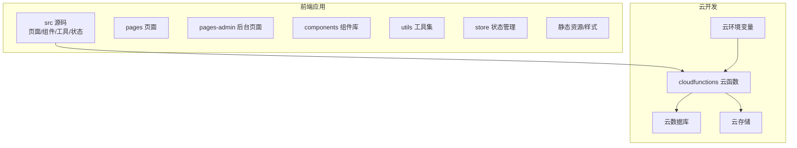
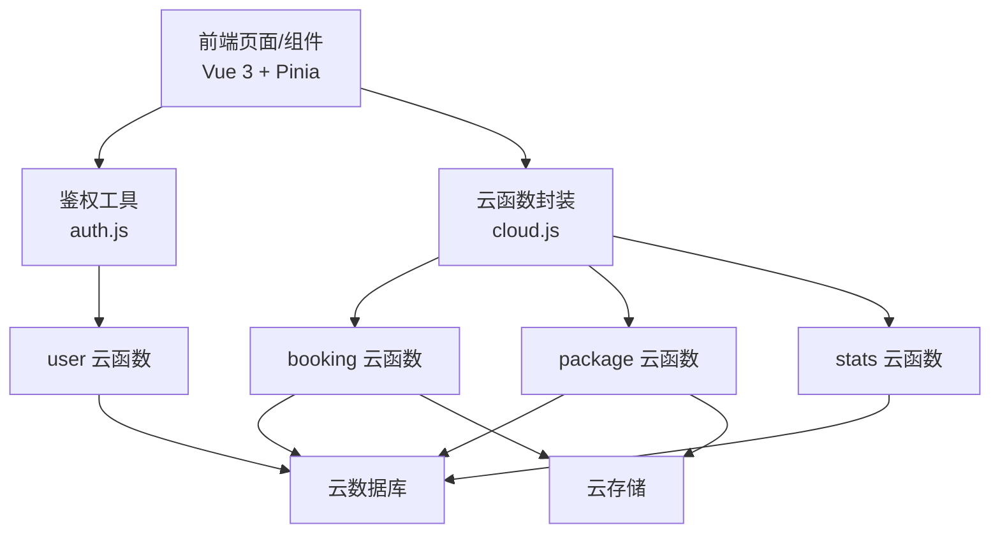
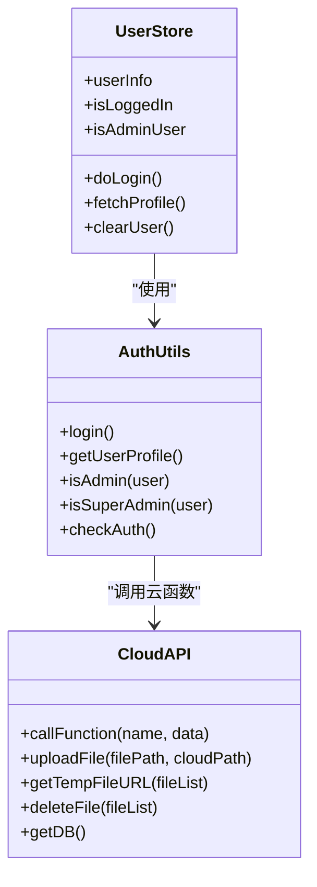
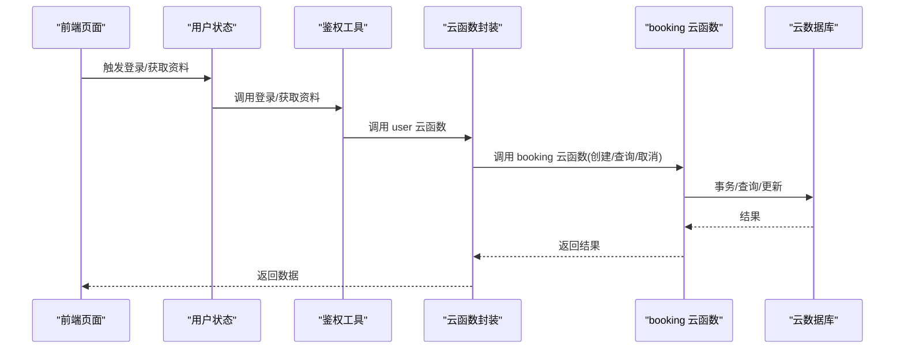
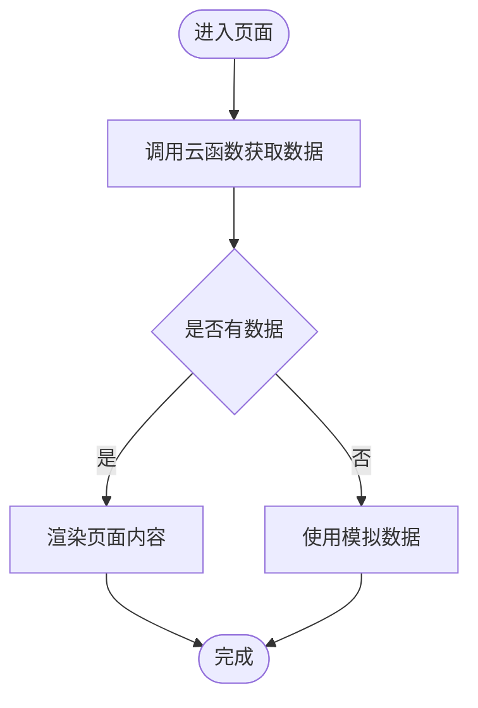
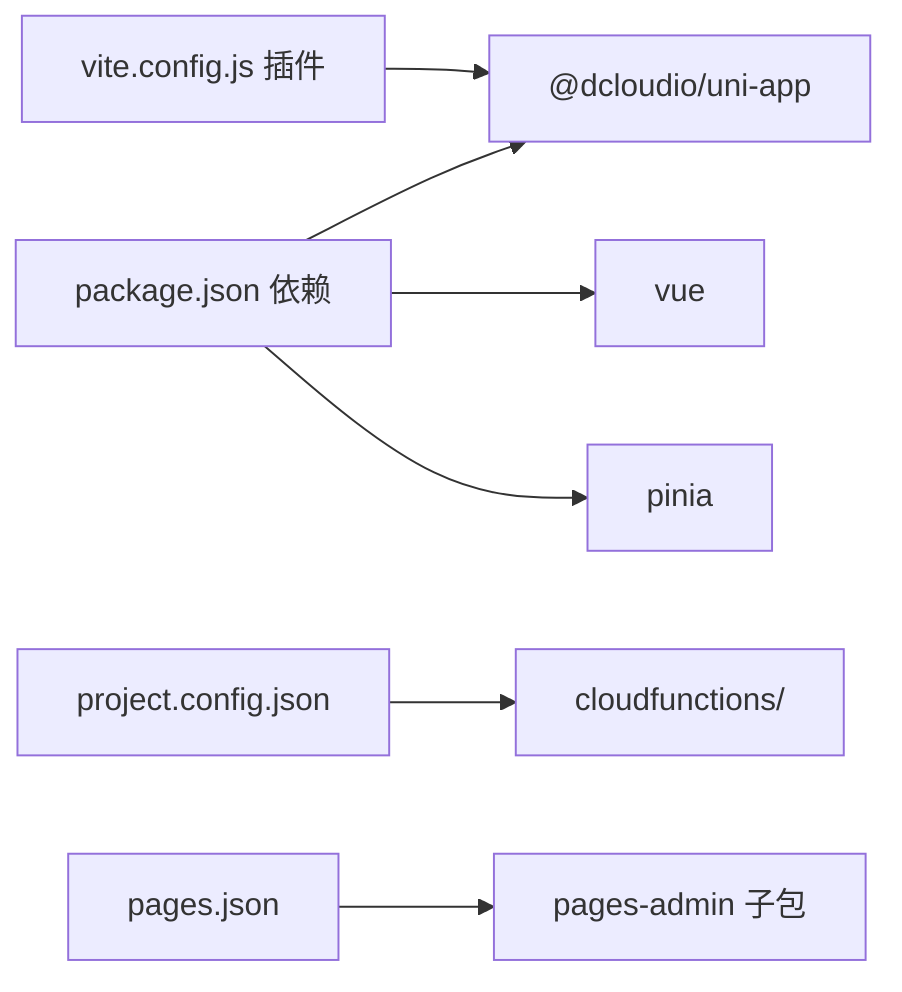

# 技术架构

<cite>
**本文引用的文件**
- [package.json](file://miniprogram/package.json)
- [vite.config.js](file://miniprogram/vite.config.js)
- [main.js](file://miniprogram/src/main.js)
- [App.vue](file://miniprogram/src/App.vue)
- [pages.json](file://miniprogram/src/pages.json)
- [project.config.json](file://miniprogram/project.config.json)
- [cloud.js](file://miniprogram/src/utils/cloud.js)
- [auth.js](file://miniprogram/src/utils/auth.js)
- [user.js](file://miniprogram/src/store/user.js)
- [NavBar.vue](file://miniprogram/src/components/NavBar.vue)
- [index.vue](file://miniprogram/src/pages/index/index.vue)
- [list.vue](file://miniprogram/src/pages/packages/list.vue)
- [index.vue](file://miniprogram/src/pages-admin/dashboard/index.vue)
- [index.js](file://miniprogram/cloudfunctions/booking/index.js)
- [index.js](file://miniprogram/cloudfunctions/user/index.js)
- [index.js](file://miniprogram/cloudfunctions/package/index.js)
- [index.js](file://miniprogram/cloudfunctions/stats/index.js)
- [constants.js](file://miniprogram/src/utils/constants.js)
</cite>

## 目录
1. [引言](#引言)
2. [项目结构](#项目结构)
3. [核心组件](#核心组件)
4. [架构总览](#架构总览)
5. [详细组件分析](#详细组件分析)
6. [依赖分析](#依赖分析)
7. [性能考量](#性能考量)
8. [故障排查指南](#故障排查指南)
9. [结论](#结论)
10. [附录](#附录)

## 引言
本技术架构文档面向 lvpai 项目，系统性阐述其基于 UniApp 跨平台框架、Vue 3 + Pinia 的前端状态管理、以及微信云开发的后端集成方案。文档从整体架构、分层设计、模块划分与组件交互入手，结合云函数设计理念、数据流向与组件化架构，解释技术选型的原因与优势，并提供架构图与组件关系图，帮助开发者快速理解系统职责分工与扩展路径。

## 项目结构
lvpai 采用“前端源码 + 云函数”的双层结构：
- 前端源码位于 miniprogram/src，包含页面、组件、工具、状态管理与样式资源，通过 Vite 插件统一构建。
- 云函数位于 miniprogram/cloudfunctions，按业务域拆分为 booking、user、package、payment、stats、gallery 等子目录，每个子目录包含独立的云函数入口与依赖包。

图表来源
- [project.config.json:1-21](file://miniprogram/project.config.json#L1-L21)
- [pages.json:1-177](file://miniprogram/src/pages.json#L1-L177)

章节来源
- [package.json:1-22](file://miniprogram/package.json#L1-L22)
- [vite.config.js:1-7](file://miniprogram/vite.config.js#L1-L7)
- [project.config.json:1-21](file://miniprogram/project.config.json#L1-L21)
- [pages.json:1-177](file://miniprogram/src/pages.json#L1-L177)

## 核心组件
- 前端框架与构建
  - 使用 @dcloudio/uni-app 3.x 与 Vue 3，配合 Vite 插件进行跨平台编译与运行。
  - 通过 pages.json 进行页面路由与分包配置，支持主包与 pages-admin 子包。
- 状态管理
  - Pinia 提供轻量级全局状态，用户登录态与鉴权状态集中管理。
- 云开发集成
  - 在 App.vue 中初始化云开发；通过 utils/cloud.js 封装云函数调用、文件上传/下载等能力。
- 业务云函数
  - booking：预约与订单联动、时段控制、状态流转。
  - user：登录、资料与角色管理。
  - package：套餐 CRUD 与状态管理。
  - stats：后台数据概览与趋势统计。
  - gallery：客片管理（文件路径中存在，具体实现不在本次分析范围内）。
  - payment：支付流程（文件路径中存在，具体实现不在本次分析范围内）。

章节来源
- [main.js:1-11](file://miniprogram/src/main.js#L1-L11)
- [App.vue:1-26](file://miniprogram/src/App.vue#L1-L26)
- [cloud.js:1-66](file://miniprogram/src/utils/cloud.js#L1-L66)
- [user.js:1-48](file://miniprogram/src/store/user.js#L1-L48)
- [index.js](file://miniprogram/cloudfunctions/booking/index.js)
- [index.js](file://miniprogram/cloudfunctions/user/index.js)
- [index.js](file://miniprogram/cloudfunctions/package/index.js)
- [index.js](file://miniprogram/cloudfunctions/stats/index.js)

## 架构总览
lvpai 采用“前端单页应用 + 微信云开发”的前后端分离架构：
- 前端负责 UI 展示、交互与状态管理，通过云函数暴露的接口进行数据访问。
- 云函数承担业务逻辑与数据持久化，统一处理权限校验、并发控制与复杂查询。
- 云数据库与云存储提供数据与文件能力，环境变量与动态环境支持多环境部署。

图表来源
- [App.vue:1-26](file://miniprogram/src/App.vue#L1-L26)
- [cloud.js:1-66](file://miniprogram/src/utils/cloud.js#L1-L66)
- [auth.js:1-47](file://miniprogram/src/utils/auth.js#L1-L47)
- [index.js](file://miniprogram/cloudfunctions/booking/index.js)
- [index.js](file://miniprogram/cloudfunctions/user/index.js)
- [index.js](file://miniprogram/cloudfunctions/package/index.js)
- [index.js](file://miniprogram/cloudfunctions/stats/index.js)

## 详细组件分析

### 前端应用与状态管理
- 应用初始化
  - 在 App.vue 中初始化云开发能力，确保后续云函数与数据库调用可用。
- 状态管理
  - user store 维护用户登录态与角色判断，提供登录、拉取资料与清理方法。
- 页面与组件
  - pages/index/index 作为首页，整合轮播、快捷入口、热门套餐与场景展示。
  - pages/packages/list 实现套餐分类浏览与骨架屏加载。
  - components/NavBar.vue 提供统一导航栏，适配状态栏高度与返回行为。

图表来源
- [user.js:1-48](file://miniprogram/src/store/user.js#L1-L48)
- [auth.js:1-47](file://miniprogram/src/utils/auth.js#L1-L47)
- [cloud.js:1-66](file://miniprogram/src/utils/cloud.js#L1-L66)

章节来源
- [App.vue:1-26](file://miniprogram/src/App.vue#L1-L26)
- [user.js:1-48](file://miniprogram/src/store/user.js#L1-L48)
- [auth.js:1-47](file://miniprogram/src/utils/auth.js#L1-L47)
- [cloud.js:1-66](file://miniprogram/src/utils/cloud.js#L1-L66)
- [index.vue](file://miniprogram/src/pages/index/index.vue)
- [list.vue](file://miniprogram/src/pages/packages/list.vue)
- [NavBar.vue:1-79](file://miniprogram/src/components/NavBar.vue#L1-L79)

### 云函数设计与数据流

#### 预约与订单云函数（booking）
- 设计理念
  - 将“预约创建”与“订单创建”置于同一事务中，保证数据一致性。
  - 通过时段上限与并发校验避免超卖。
  - 管理员具备状态变更与全量查询权限，普通用户仅能操作自身数据。
- 关键流程
  - 创建预约：校验必填项与时段可用性 → 查询套餐 → 事务内再次校验 → 新增预约与订单 → 提交事务。
  - 取消预约：权限校验 → 状态限制 → 更新预约与订单状态。
  - 管理员状态更新：校验管理员角色 → 更新预约状态。
  - 可用时段查询：遍历时段并统计剩余可预约数。

图表来源
- [auth.js:1-47](file://miniprogram/src/utils/auth.js#L1-L47)
- [cloud.js:1-66](file://miniprogram/src/utils/cloud.js#L1-L66)
- [index.js](file://miniprogram/cloudfunctions/booking/index.js)

章节来源
- [index.js](file://miniprogram/cloudfunctions/booking/index.js)

#### 用户云函数（user）
- 功能要点
  - 登录即注册：首次登录自动创建用户记录。
  - 资料更新：支持昵称、头像与手机号更新。
  - 角色管理：仅超级管理员可修改他人角色。
- 权限模型
  - 普通用户：仅能读写自身资料。
  - 管理员：部分受限操作。
  - 超级管理员：全站角色管理。

章节来源
- [index.js](file://miniprogram/cloudfunctions/user/index.js)

#### 套餐云函数（package）
- 功能要点
  - 列表与详情：支持分类筛选与状态过滤。
  - 管理员 CRUD：创建、更新、删除、上下架。
- 权限模型
  - 非管理员仅可见上架套餐；管理员具备完整权限。

章节来源
- [index.js](file://miniprogram/cloudfunctions/package/index.js)

#### 统计云函数（stats）
- 功能要点
  - 管理员视角的数据概览：今日预约、待处理订单、本月收入、累计客片、累计预约、总用户数。
  - 附加统计：各状态预约数量与近七日趋势。
- 数据来源
  - 通过聚合与计数查询组合生成报表数据。

章节来源
- [index.js](file://miniprogram/cloudfunctions/stats/index.js)

### 页面与组件交互

#### 首页与套餐列表
- 首页 index.vue
  - 展示轮播、快捷入口、热门套餐与场景卡片。
  - 通过云函数调用获取套餐列表，失败时降级为模拟数据。
- 套餐列表 list.vue
  - 分类标签切换与骨架屏加载。
  - 调用 package 云函数获取列表，支持分类筛选。

图表来源
- [index.vue](file://miniprogram/src/pages/index/index.vue)
- [list.vue](file://miniprogram/src/pages/packages/list.vue)
- [cloud.js:1-66](file://miniprogram/src/utils/cloud.js#L1-L66)

章节来源
- [index.vue](file://miniprogram/src/pages/index/index.vue)
- [list.vue](file://miniprogram/src/pages/packages/list.vue)
- [constants.js:1-73](file://miniprogram/src/utils/constants.js#L1-L73)

#### 管理后台仪表盘
- dashboard/index.vue
  - 权限校验：非管理员禁止访问，提示后跳转首页。
  - 调用 stats 云函数获取概览数据，展示关键指标与快捷入口。

章节来源
- [index.vue](file://miniprogram/src/pages-admin/dashboard/index.vue)
- [index.js](file://miniprogram/cloudfunctions/stats/index.js)

## 依赖分析
- 前端依赖
  - @dcloudio/uni-app、@dcloudio/uni-mp-weixin、@dcloudio/uni-components、vue、pinia。
- 构建工具
  - Vite + @dcloudio/vite-plugin-uni。
- 云开发配置
  - project.config.json 指定云函数根目录与小程序产物目录，pages.json 定义页面与分包结构。

图表来源
- [package.json:1-22](file://miniprogram/package.json#L1-L22)
- [vite.config.js:1-7](file://miniprogram/vite.config.js#L1-L7)
- [project.config.json:1-21](file://miniprogram/project.config.json#L1-L21)
- [pages.json:1-177](file://miniprogram/src/pages.json#L1-L177)

章节来源
- [package.json:1-22](file://miniprogram/package.json#L1-L22)
- [vite.config.js:1-7](file://miniprogram/vite.config.js#L1-L7)
- [project.config.json:1-21](file://miniprogram/project.config.json#L1-L21)
- [pages.json:1-177](file://miniprogram/src/pages.json#L1-L177)

## 性能考量
- 前端性能
  - 使用骨架屏与懒加载减少首屏等待；组件复用（如 PackageCard、NavBar）降低重复渲染成本。
  - Pinia 精简状态树，避免不必要的响应式开销。
- 云函数性能
  - 事务保证一致性的同时，尽量缩短事务时间窗口；对高并发场景增加二次校验与限流策略。
  - 聚合查询与分页查询结合，避免一次性拉取大量数据。
- 云存储
  - 文件上传后及时获取临时链接，避免频繁请求导致带宽浪费。
- 缓存与离线
  - 对静态常量与只读数据进行本地缓存；对用户敏感操作保留本地状态并在网络恢复后同步。

## 故障排查指南
- 云函数调用失败
  - 检查 cloud.js 的统一错误处理与返回码；定位具体云函数的异常堆栈。
- 权限问题
  - 确认用户角色与云函数中的管理员校验逻辑；后台页面访问前的权限拦截。
- 数据不一致
  - 关注 booking 云函数中的事务与并发校验；必要时增加幂等与补偿机制。
- 页面白屏或空白
  - 检查 pages.json 的页面路径与分包配置；确认云函数部署与环境变量。

章节来源
- [cloud.js:1-66](file://miniprogram/src/utils/cloud.js#L1-L66)
- [index.js](file://miniprogram/cloudfunctions/booking/index.js)
- [index.js](file://miniprogram/cloudfunctions/user/index.js)
- [pages.json:1-177](file://miniprogram/src/pages.json#L1-L177)

## 结论
lvpai 通过 UniApp 跨平台框架与 Vue 3 + Pinia 的组合，实现了统一的前端体验与清晰的状态管理；借助微信云开发，将业务逻辑下沉至云函数，形成“前端薄壳、后端厚核”的架构模式。分层设计与模块划分使系统具备良好的可维护性与扩展性，适合在现有基础上持续迭代与横向扩展。

## 附录
- 常量与配置
  - 套餐/客片分类、预约时段、状态枚举与门店信息集中于 constants.js，便于统一维护与复用。
- 页面与分包
  - pages.json 明确了主包与 pages-admin 子包的页面清单与样式配置，支持后台管理与前台展示的隔离。

章节来源
- [constants.js:1-73](file://miniprogram/src/utils/constants.js#L1-L73)
- [pages.json:1-177](file://miniprogram/src/pages.json#L1-L177)