# 数据架构设计

<cite>
**本文引用的文件**
- [miniprogram/cloudfunctions/user/index.js](file://miniprogram/cloudfunctions/user/index.js)
- [miniprogram/cloudfunctions/booking/index.js](file://miniprogram/cloudfunctions/booking/index.js)
- [miniprogram/cloudfunctions/package/index.js](file://miniprogram/cloudfunctions/package/index.js)
- [miniprogram/cloudfunctions/gallery/index.js](file://miniprogram/cloudfunctions/gallery/index.js)
- [miniprogram/cloudfunctions/payment/index.js](file://miniprogram/cloudfunctions/payment/index.js)
- [miniprogram/cloudfunctions/stats/index.js](file://miniprogram/cloudfunctions/stats/index.js)
- [miniprogram/src/store/user.js](file://miniprogram/src/store/user.js)
- [miniprogram/src/utils/constants.js](file://miniprogram/src/utils/constants.js)
</cite>

## 目录
1. [简介](#简介)
2. [项目结构](#项目结构)
3. [核心组件](#核心组件)
4. [架构总览](#架构总览)
5. [详细组件分析](#详细组件分析)
6. [依赖关系分析](#依赖关系分析)
7. [性能考量](#性能考量)
8. [故障排查指南](#故障排查指南)
9. [结论](#结论)
10. [附录](#附录)

## 简介
本文件面向 lvpai 小程序项目，系统性梳理其数据模型设计与存储策略，重点覆盖 MongoDB 集合设计理念、文档结构、索引策略、数据一致性与并发控制、缓存与查询优化、数据流与持久化路径，并给出 ER 图与数据流图，最后提供数据迁移、备份恢复与安全实施方案建议。文中所有技术细节均基于仓库现有源码进行归纳与总结。

## 项目结构
lvpai 采用“云开发 + 小程序前端”的架构，数据持久化由微信云开发提供的云数据库承担。后端以云函数为入口，按功能拆分为用户、预约、套餐、客片、支付、统计等模块；前端通过 Pinia 状态管理与工具常量配合云函数进行数据交互。

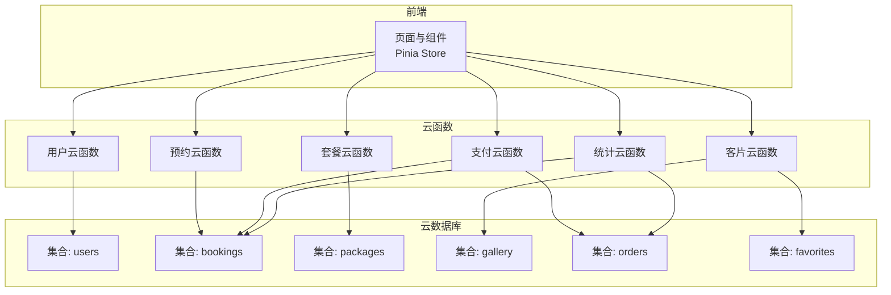

图表来源
- [miniprogram/cloudfunctions/user/index.js:1-206](file://miniprogram/cloudfunctions/user/index.js#L1-L206)
- [miniprogram/cloudfunctions/booking/index.js:1-463](file://miniprogram/cloudfunctions/booking/index.js#L1-L463)
- [miniprogram/cloudfunctions/package/index.js:1-222](file://miniprogram/cloudfunctions/package/index.js#L1-L222)
- [miniprogram/cloudfunctions/gallery/index.js:1-360](file://miniprogram/cloudfunctions/gallery/index.js#L1-L360)
- [miniprogram/cloudfunctions/payment/index.js:1-532](file://miniprogram/cloudfunctions/payment/index.js#L1-L532)
- [miniprogram/cloudfunctions/stats/index.js:1-229](file://miniprogram/cloudfunctions/stats/index.js#L1-L229)

章节来源
- [miniprogram/cloudfunctions/user/index.js:1-206](file://miniprogram/cloudfunctions/user/index.js#L1-L206)
- [miniprogram/cloudfunctions/booking/index.js:1-463](file://miniprogram/cloudfunctions/booking/index.js#L1-L463)
- [miniprogram/cloudfunctions/package/index.js:1-222](file://miniprogram/cloudfunctions/package/index.js#L1-L222)
- [miniprogram/cloudfunctions/gallery/index.js:1-360](file://miniprogram/cloudfunctions/gallery/index.js#L1-L360)
- [miniprogram/cloudfunctions/payment/index.js:1-532](file://miniprogram/cloudfunctions/payment/index.js#L1-L532)
- [miniprogram/cloudfunctions/stats/index.js:1-229](file://miniprogram/cloudfunctions/stats/index.js#L1-L229)

## 核心组件
- 用户模块：负责用户登录、资料维护、角色管理与权限校验。
- 预约模块：负责预约创建、查询、取消、状态变更与并发控制。
- 套餐模块：负责套餐的增删改查与上下架管理。
- 客片模块：负责客片展示、收藏与关联删除事务。
- 支付模块：负责订单创建、支付流程、退款与回调处理（模拟/真实）。
- 统计模块：负责运营数据概览与趋势统计（管理员）。

章节来源
- [miniprogram/cloudfunctions/user/index.js:1-206](file://miniprogram/cloudfunctions/user/index.js#L1-L206)
- [miniprogram/cloudfunctions/booking/index.js:1-463](file://miniprogram/cloudfunctions/booking/index.js#L1-L463)
- [miniprogram/cloudfunctions/package/index.js:1-222](file://miniprogram/cloudfunctions/package/index.js#L1-L222)
- [miniprogram/cloudfunctions/gallery/index.js:1-360](file://miniprogram/cloudfunctions/gallery/index.js#L1-L360)
- [miniprogram/cloudfunctions/payment/index.js:1-532](file://miniprogram/cloudfunctions/payment/index.js#L1-L532)
- [miniprogram/cloudfunctions/stats/index.js:1-229](file://miniprogram/cloudfunctions/stats/index.js#L1-L229)

## 架构总览
系统围绕“用户—预约—套餐—客片—订单”五类实体展开，通过云函数作为统一入口协调数据库读写与业务规则。前端通过 Pinia Store 管理用户态与权限判断，常量文件集中定义枚举与状态标签。

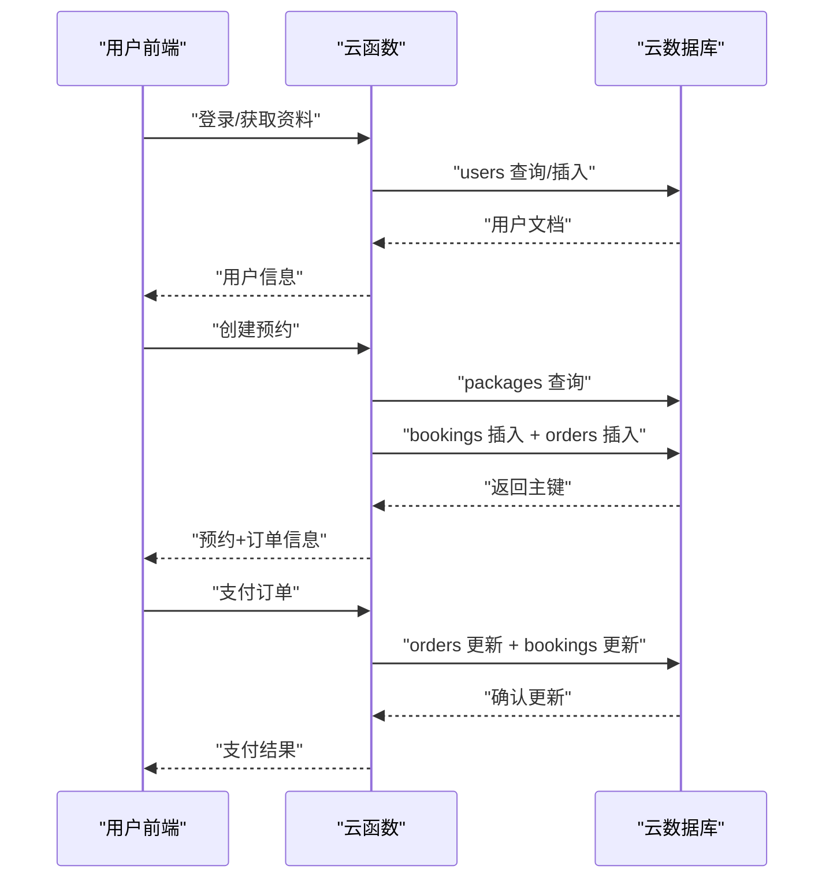

图表来源
- [miniprogram/cloudfunctions/user/index.js:1-206](file://miniprogram/cloudfunctions/user/index.js#L1-L206)
- [miniprogram/cloudfunctions/booking/index.js:1-463](file://miniprogram/cloudfunctions/booking/index.js#L1-L463)
- [miniprogram/cloudfunctions/payment/index.js:1-532](file://miniprogram/cloudfunctions/payment/index.js#L1-L532)

## 详细组件分析

### 用户数据模型与存储策略
- 集合名称：users
- 关键字段：
  - openid：用户唯一标识（与微信 OpenID 对应）
  - nickname、avatar、phone：用户资料
  - role：用户角色（user/admin/superAdmin）
  - createTime：创建时间（服务端时间）
- 约束与规则：
  - 登录即创建用户文档，若已存在则直接返回
  - 手机号更新需正则校验
  - 角色变更仅允许 superAdmin 执行
- 索引策略建议：
  - openid 唯一索引（如未建立）
  - role 查询索引
- 并发与一致性：
  - 单条用户更新使用条件更新，避免竞态
- 缓存与优化：
  - 前端 Pinia Store 缓存用户态，减少重复查询

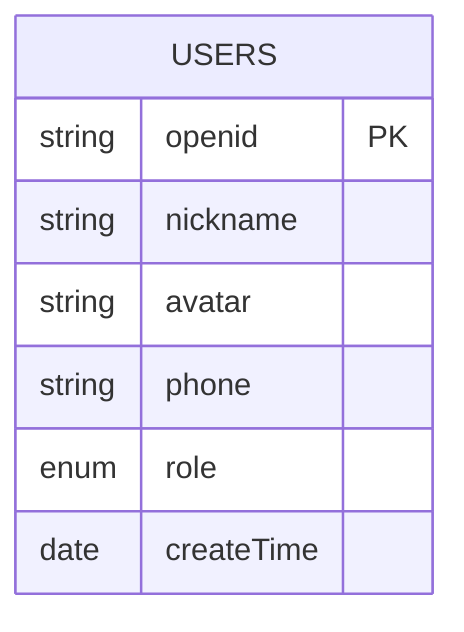

图表来源
- [miniprogram/cloudfunctions/user/index.js:48-66](file://miniprogram/cloudfunctions/user/index.js#L48-L66)
- [miniprogram/cloudfunctions/user/index.js:108-114](file://miniprogram/cloudfunctions/user/index.js#L108-L114)
- [miniprogram/cloudfunctions/user/index.js:191-193](file://miniprogram/cloudfunctions/user/index.js#L191-L193)

章节来源
- [miniprogram/cloudfunctions/user/index.js:1-206](file://miniprogram/cloudfunctions/user/index.js#L1-L206)
- [miniprogram/src/store/user.js:1-48](file://miniprogram/src/store/user.js#L1-L48)

### 预约数据模型与存储策略
- 集合名称：bookings
- 关键字段：
  - userId：关联用户 openid
  - packageId、packageName、packagePrice：套餐快照
  - date、timeSlot：预约日期与时段
  - contactName、contactPhone、persons：联系信息
  - status：预约状态（pending/confirmed/shooting/retouching/completed/cancelled）
  - remark、createTime、updateTime、cancelTime、cancelBy：扩展信息
- 约束与规则：
  - 时段容量限制（每时段最多 5 个）
  - 并发场景下二次检查容量，必要时回滚
  - 取消规则：已完成不可取消；已取消不可重复取消
  - 管理员可修改状态；普通用户仅能查看/取消自己的预约
- 索引策略建议：
  - userId + date + timeSlot 复合索引
  - status、date、userId 等常用过滤字段建立单列索引
- 并发与一致性：
  - 创建预约同时写入 bookings 与 orders，使用事务保证原子性
  - 取消预约时根据订单支付状态决定是否标记退款
- 缓存与优化：
  - 可对“可用时段”进行短期缓存，降低重复计算

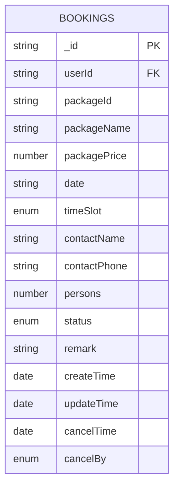

图表来源
- [miniprogram/cloudfunctions/booking/index.js:134-148](file://miniprogram/cloudfunctions/booking/index.js#L134-L148)
- [miniprogram/cloudfunctions/booking/index.js:150-206](file://miniprogram/cloudfunctions/booking/index.js#L150-L206)
- [miniprogram/cloudfunctions/booking/index.js:308-384](file://miniprogram/cloudfunctions/booking/index.js#L308-L384)

章节来源
- [miniprogram/cloudfunctions/booking/index.js:1-463](file://miniprogram/cloudfunctions/booking/index.js#L1-L463)

### 套餐数据模型与存储策略
- 集合名称：packages
- 关键字段：
  - name、price、deposit、category、status、sortOrder、images 等
  - createTime、updateTime：时间戳
- 约束与规则：
  - 上架/下架状态控制前端可见性
  - 管理员权限校验后方可 CRUD
- 索引策略建议：
  - category + status 组合索引
  - sortOrder 排序索引
- 并发与一致性：
  - 单条更新使用条件更新，避免竞态
- 缓存与优化：
  - 列表页可做分页与排序索引优化

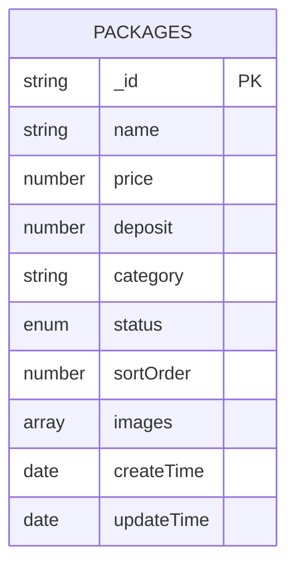

图表来源
- [miniprogram/cloudfunctions/package/index.js:119-123](file://miniprogram/cloudfunctions/package/index.js#L119-L123)
- [miniprogram/cloudfunctions/package/index.js:152-157](file://miniprogram/cloudfunctions/package/index.js#L152-L157)
- [miniprogram/cloudfunctions/package/index.js:209-214](file://miniprogram/cloudfunctions/package/index.js#L209-L214)

章节来源
- [miniprogram/cloudfunctions/package/index.js:1-222](file://miniprogram/cloudfunctions/package/index.js#L1-L222)

### 客片数据模型与存储策略
- 集合名称：gallery
- 关键字段：
  - title、description、category、images、status、likes、createTime、updateTime
- 约束与规则：
  - 发布/下线状态控制前端可见性
  - 收藏与取消收藏使用 favorites 集合维护
- 索引策略建议：
  - category + status 组合索引
  - likes 排序索引
- 并发与一致性：
  - 删除客片时开启事务，同步清理收藏记录
- 缓存与优化：
  - 收藏列表联查 gallery，注意批量 in 查询与映射

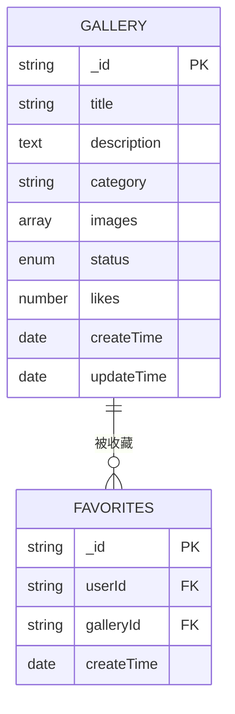

图表来源
- [miniprogram/cloudfunctions/gallery/index.js:136-141](file://miniprogram/cloudfunctions/gallery/index.js#L136-L141)
- [miniprogram/cloudfunctions/gallery/index.js:202-214](file://miniprogram/cloudfunctions/gallery/index.js#L202-L214)
- [miniprogram/cloudfunctions/gallery/index.js:236-282](file://miniprogram/cloudfunctions/gallery/index.js#L236-L282)

章节来源
- [miniprogram/cloudfunctions/gallery/index.js:1-360](file://miniprogram/cloudfunctions/gallery/index.js#L1-L360)

### 订单与支付模型与存储策略
- 集合名称：orders
- 关键字段：
  - bookingId、userId、packageId、packageName、totalPrice、depositAmount、payStatus、orderNo、payTime、refundTime、createTime
- 约束与规则：
  - 订单与预约一一对应
  - 支付成功后更新订单与预约状态
  - 退款流程（管理员）：标记退款并同步预约状态
- 索引策略建议：
  - orderNo 唯一索引
  - userId + payStatus 组合索引
  - payTime 聚合统计索引
- 并发与一致性：
  - 支付成功与退款均使用事务，确保订单与预约状态一致
- 缓存与优化：
  - 订单列表分页与状态过滤

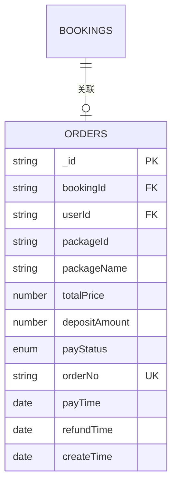

图表来源
- [miniprogram/cloudfunctions/booking/index.js:174-186](file://miniprogram/cloudfunctions/booking/index.js#L174-L186)
- [miniprogram/cloudfunctions/payment/index.js:208-222](file://miniprogram/cloudfunctions/payment/index.js#L208-L222)
- [miniprogram/cloudfunctions/payment/index.js:423-437](file://miniprogram/cloudfunctions/payment/index.js#L423-L437)

章节来源
- [miniprogram/cloudfunctions/booking/index.js:1-463](file://miniprogram/cloudfunctions/booking/index.js#L1-L463)
- [miniprogram/cloudfunctions/payment/index.js:1-532](file://miniprogram/cloudfunctions/payment/index.js#L1-L532)

### 数据一致性、事务与并发控制
- 事务使用点：
  - 预约创建：同时写入 bookings 与 orders
  - 客片删除：删除客片与相关收藏
  - 支付成功：更新订单与预约状态
  - 退款：更新订单与预约状态
- 并发控制：
  - 时段容量检查采用“二次检查 + 事务回滚”
  - 条件更新避免竞态
- 管理员权限：
  - 通过 users 表 role 字段校验，限制敏感操作

章节来源
- [miniprogram/cloudfunctions/booking/index.js:150-206](file://miniprogram/cloudfunctions/booking/index.js#L150-L206)
- [miniprogram/cloudfunctions/gallery/index.js:199-225](file://miniprogram/cloudfunctions/gallery/index.js#L199-L225)
- [miniprogram/cloudfunctions/payment/index.js:204-239](file://miniprogram/cloudfunctions/payment/index.js#L204-L239)
- [miniprogram/cloudfunctions/payment/index.js:422-449](file://miniprogram/cloudfunctions/payment/index.js#L422-L449)

### 查询优化与缓存策略
- 查询优化：
  - 使用 where + orderBy + skip + limit 实现分页
  - 聚合统计使用聚合管道（统计模块）
  - 批量查询使用 in 条件（收藏列表联查）
- 缓存策略：
  - 前端 Pinia 缓存用户态
  - 可对“可用时段”进行短期缓存
  - 列表页可引入本地分页缓存（视业务需求）

章节来源
- [miniprogram/cloudfunctions/stats/index.js:102-117](file://miniprogram/cloudfunctions/stats/index.js#L102-L117)
- [miniprogram/cloudfunctions/gallery/index.js:305-327](file://miniprogram/cloudfunctions/gallery/index.js#L305-L327)
- [miniprogram/src/store/user.js:1-48](file://miniprogram/src/store/user.js#L1-L48)

### 数据流图
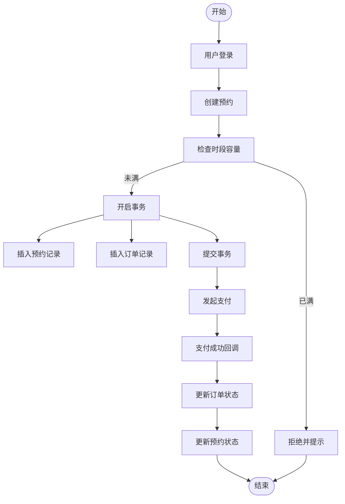

图表来源
- [miniprogram/cloudfunctions/booking/index.js:150-206](file://miniprogram/cloudfunctions/booking/index.js#L150-L206)
- [miniprogram/cloudfunctions/payment/index.js:204-239](file://miniprogram/cloudfunctions/payment/index.js#L204-L239)

## 依赖关系分析
- 云函数间依赖：
  - 预约模块依赖套餐模块（读取套餐快照）
  - 支付模块依赖预约与订单模块（状态联动）
  - 客片模块依赖收藏模块（维护 likes）
  - 统计模块依赖预约与订单模块（聚合统计）
- 前端依赖：
  - Pinia Store 管理用户态
  - 常量文件集中定义枚举与状态标签

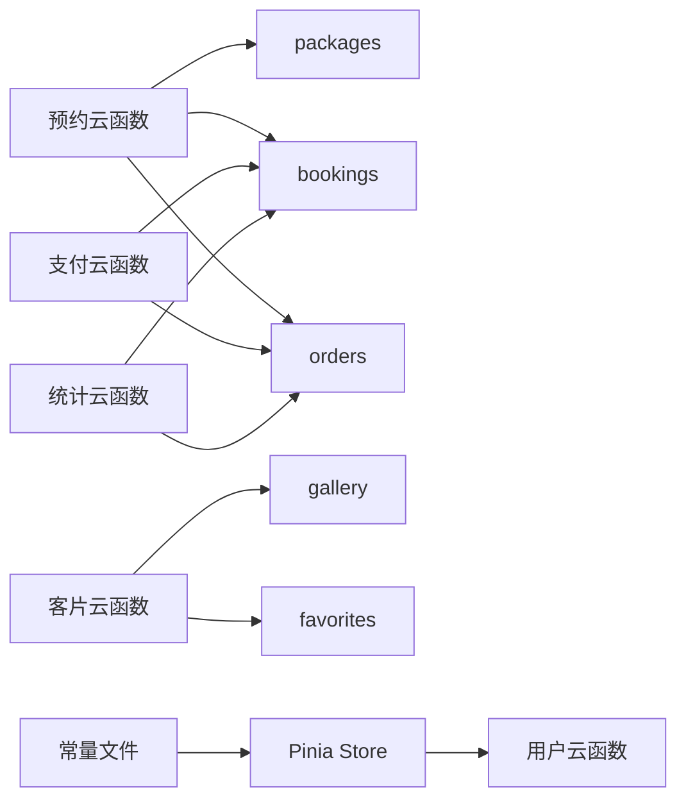

图表来源
- [miniprogram/cloudfunctions/booking/index.js:121-128](file://miniprogram/cloudfunctions/booking/index.js#L121-L128)
- [miniprogram/cloudfunctions/payment/index.js:208-222](file://miniprogram/cloudfunctions/payment/index.js#L208-L222)
- [miniprogram/cloudfunctions/gallery/index.js:202-214](file://miniprogram/cloudfunctions/gallery/index.js#L202-L214)
- [miniprogram/cloudfunctions/stats/index.js:85-97](file://miniprogram/cloudfunctions/stats/index.js#L85-L97)
- [miniprogram/src/store/user.js:1-48](file://miniprogram/src/store/user.js#L1-L48)
- [miniprogram/src/utils/constants.js:1-73](file://miniprogram/src/utils/constants.js#L1-L73)

章节来源
- [miniprogram/cloudfunctions/booking/index.js:1-463](file://miniprogram/cloudfunctions/booking/index.js#L1-L463)
- [miniprogram/cloudfunctions/payment/index.js:1-532](file://miniprogram/cloudfunctions/payment/index.js#L1-L532)
- [miniprogram/cloudfunctions/gallery/index.js:1-360](file://miniprogram/cloudfunctions/gallery/index.js#L1-L360)
- [miniprogram/cloudfunctions/stats/index.js:1-229](file://miniprogram/cloudfunctions/stats/index.js#L1-L229)
- [miniprogram/src/store/user.js:1-48](file://miniprogram/src/store/user.js#L1-L48)
- [miniprogram/src/utils/constants.js:1-73](file://miniprogram/src/utils/constants.js#L1-L73)

## 性能考量
- 索引优化：
  - 为高频查询字段建立单列/复合索引（如 bookings 的 userId+date+timeSlot、orders 的 orderNo、users 的 openid）
- 聚合与分页：
  - 使用聚合管道进行统计，分页查询避免全表扫描
- 事务与锁：
  - 事务内尽量减少跨集合写入，缩短事务窗口
- 缓存：
  - 对热点数据（如可用时段、套餐列表）进行短期缓存
- 异步与幂等：
  - 支付回调与退款回调需保证幂等处理

[本节为通用指导，不直接分析具体文件]

## 故障排查指南
- 常见错误定位：
  - 权限不足：检查用户角色与管理员校验逻辑
  - 数据不存在：核对查询条件与集合名称
  - 并发冲突：关注事务回滚与二次检查逻辑
- 日志与调试：
  - 云函数中统一捕获异常并返回标准化错误信息
- 运维建议：
  - 对关键集合开启备份策略
  - 对高频接口增加超时与重试机制

章节来源
- [miniprogram/cloudfunctions/user/index.js:170-179](file://miniprogram/cloudfunctions/user/index.js#L170-L179)
- [miniprogram/cloudfunctions/booking/index.js:163-166](file://miniprogram/cloudfunctions/booking/index.js#L163-L166)
- [miniprogram/cloudfunctions/payment/index.js:236-238](file://miniprogram/cloudfunctions/payment/index.js#L236-L238)

## 结论
lvpai 的数据架构以云函数为中心，围绕用户、预约、套餐、客片、订单五大实体构建，通过事务与权限校验保障数据一致性与安全性。现有实现具备良好的模块化与可扩展性，建议后续完善索引策略、引入缓存与监控体系，并在生产环境接入真实支付与退款通道。

[本节为总结性内容，不直接分析具体文件]

## 附录

### 数据模型与关系图（ER）
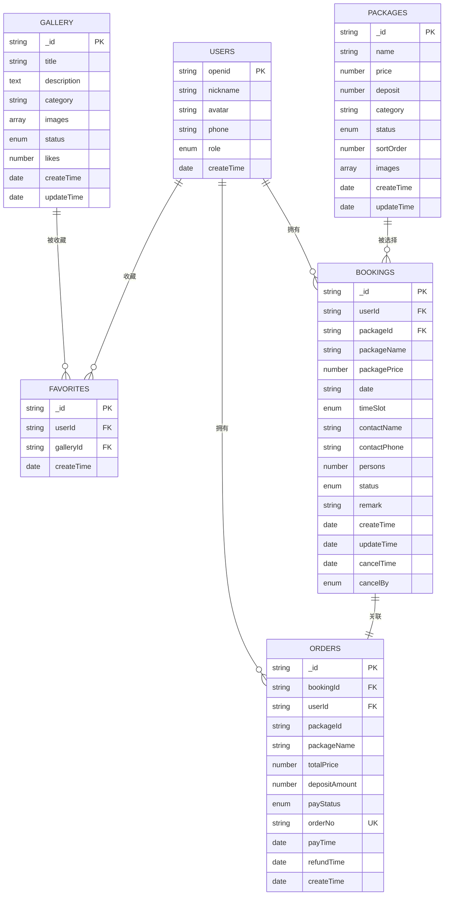

图表来源
- [miniprogram/cloudfunctions/user/index.js:4-5](file://miniprogram/cloudfunctions/user/index.js#L4-L5)
- [miniprogram/cloudfunctions/booking/index.js:134-148](file://miniprogram/cloudfunctions/booking/index.js#L134-L148)
- [miniprogram/cloudfunctions/package/index.js:119-123](file://miniprogram/cloudfunctions/package/index.js#L119-L123)
- [miniprogram/cloudfunctions/gallery/index.js:136-141](file://miniprogram/cloudfunctions/gallery/index.js#L136-L141)
- [miniprogram/cloudfunctions/payment/index.js:174-186](file://miniprogram/cloudfunctions/payment/index.js#L174-L186)

### 数据流图（概念）
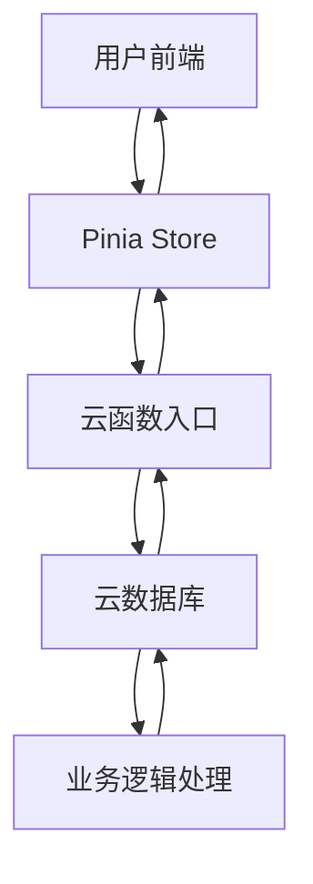

[本图为概念性示意，不直接映射到具体源码文件]