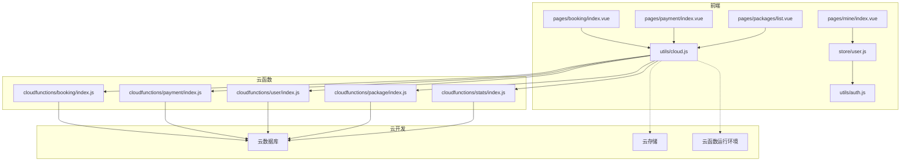
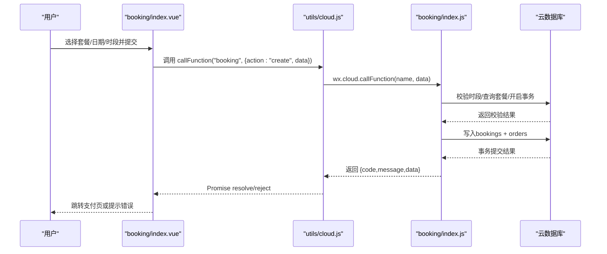
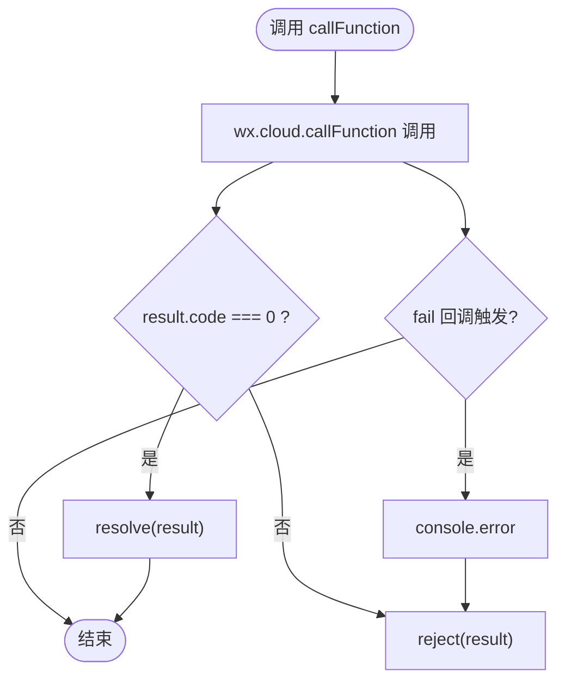
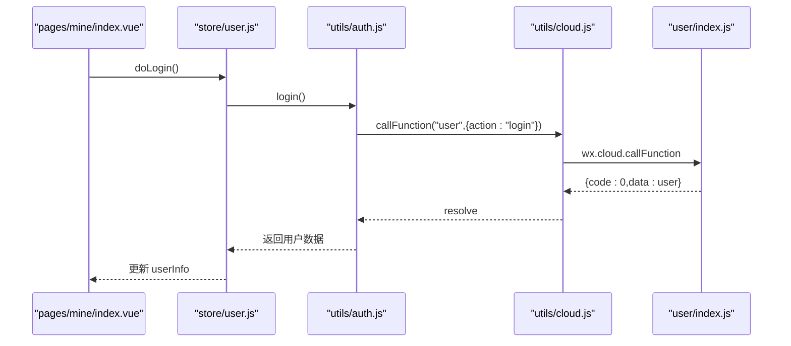
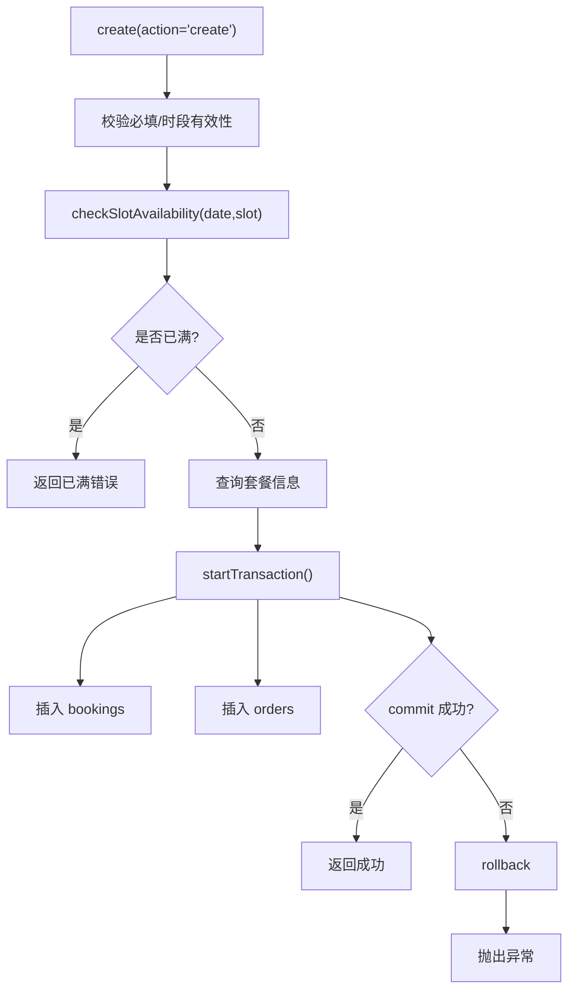
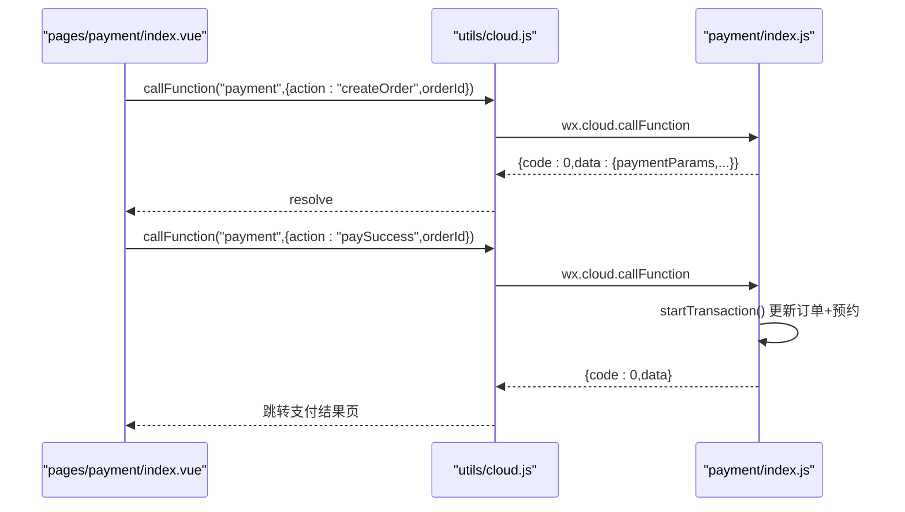
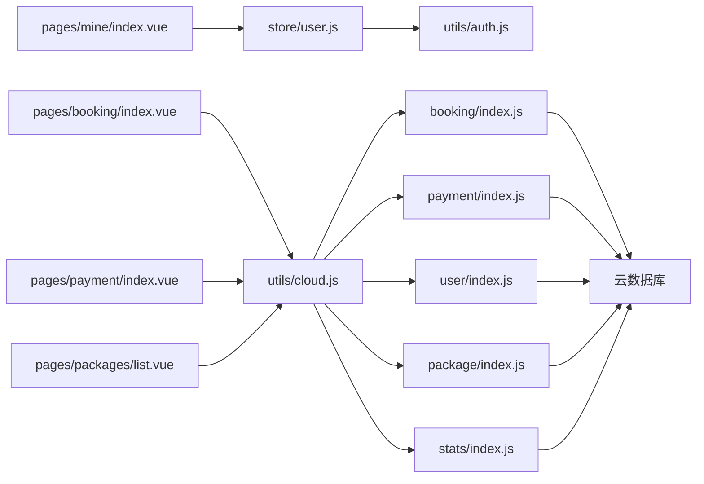

# 集成模式设计

<cite>
**本文档引用的文件**
- [cloud.js](file://miniprogram/src/utils/cloud.js)
- [auth.js](file://miniprogram/src/utils/auth.js)
- [user.js](file://miniprogram/src/store/user.js)
- [booking/index.js](file://miniprogram/cloudfunctions/booking/index.js)
- [payment/index.js](file://miniprogram/cloudfunctions/payment/index.js)
- [user/index.js](file://miniprogram/cloudfunctions/user/index.js)
- [package/index.js](file://miniprogram/cloudfunctions/package/index.js)
- [stats/index.js](file://miniprogram/cloudfunctions/stats/index.js)
- [booking/index.vue](file://miniprogram/src/pages/booking/index.vue)
- [payment/index.vue](file://miniprogram/src/pages/payment/index.vue)
- [packages/list.vue](file://miniprogram/src/pages/packages/list.vue)
- [mine/index.vue](file://miniprogram/src/pages/mine/index.vue)
- [constants.js](file://miniprogram/src/utils/constants.js)
</cite>

## 目录
1. [引言](#引言)
2. [项目结构](#项目结构)
3. [核心组件](#核心组件)
4. [架构总览](#架构总览)
5. [详细组件分析](#详细组件分析)
6. [依赖关系分析](#依赖关系分析)
7. [性能考虑](#性能考虑)
8. [故障排查指南](#故障排查指南)
9. [结论](#结论)
10. [附录](#附录)

## 引言
本文件面向 lvpai 小程序项目，系统性梳理前端与云开发之间的集成模式与通信协议，覆盖以下方面：
- 前端与云函数的 API 调用模式、错误处理与重试策略
- 微信支付、微信云开发、小程序原生 API 的集成实现
- 认证授权流程、权限控制机制与安全验证策略
- 异步任务处理、消息队列与事件驱动架构的实现现状与建议
- 集成架构图与通信序列图
- 集成测试策略与监控告警机制

## 项目结构
lvpai 采用“前端 uni-app + 微信云开发”的混合架构：
- 前端层：基于 uni-app/Vue3，通过封装的云函数调用工具与云开发交互
- 云函数层：按功能域拆分，如 booking、payment、user、package、stats
- 数据层：云数据库（集合：users、packages、bookings、orders、gallery）

图表来源
- [booking/index.vue](file://miniprogram/src/pages/booking/index.vue)
- [payment/index.vue](file://miniprogram/src/pages/payment/index.vue)
- [packages/list.vue](file://miniprogram/src/pages/packages/list.vue)
- [mine/index.vue](file://miniprogram/src/pages/mine/index.vue)
- [cloud.js](file://miniprogram/src/utils/cloud.js)
- [auth.js](file://miniprogram/src/utils/auth.js)
- [user.js](file://miniprogram/src/store/user.js)
- [booking/index.js](file://miniprogram/cloudfunctions/booking/index.js)
- [payment/index.js](file://miniprogram/cloudfunctions/payment/index.js)
- [user/index.js](file://miniprogram/cloudfunctions/user/index.js)
- [package/index.js](file://miniprogram/cloudfunctions/package/index.js)
- [stats/index.js](file://miniprogram/cloudfunctions/stats/index.js)

章节来源
- [booking/index.vue](file://miniprogram/src/pages/booking/index.vue)
- [payment/index.vue](file://miniprogram/src/pages/payment/index.vue)
- [packages/list.vue](file://miniprogram/src/pages/packages/list.vue)
- [mine/index.vue](file://miniprogram/src/pages/mine/index.vue)
- [cloud.js](file://miniprogram/src/utils/cloud.js)

## 核心组件
- 云函数调用封装：统一 Promise 化的 wx.cloud.callFunction 调用，集中处理 result.code 与错误分支
- 权限管理工具：封装登录、用户信息获取、管理员判断、会话检查
- Pinia 用户状态：集中管理登录态、用户信息、管理员标识
- 功能域云函数：booking（预约）、payment（支付）、user（用户）、package（套餐）、stats（统计）
- 前端页面：预约、支付、套餐列表、个人中心等

章节来源
- [cloud.js](file://miniprogram/src/utils/cloud.js)
- [auth.js](file://miniprogram/src/utils/auth.js)
- [user.js](file://miniprogram/src/store/user.js)
- [booking/index.js](file://miniprogram/cloudfunctions/booking/index.js)
- [payment/index.js](file://miniprogram/cloudfunctions/payment/index.js)
- [user/index.js](file://miniprogram/cloudfunctions/user/index.js)
- [package/index.js](file://miniprogram/cloudfunctions/package/index.js)
- [stats/index.js](file://miniprogram/cloudfunctions/stats/index.js)

## 架构总览
整体采用“前端直连云函数”的轻量服务端架构。前端通过封装的工具发起云函数调用，云函数负责鉴权、数据校验、数据库事务与状态变更，并通过云开发提供的云存储与支付能力进行资源与交易处理。

图表来源
- [booking/index.vue](file://miniprogram/src/pages/booking/index.vue)
- [cloud.js](file://miniprogram/src/utils/cloud.js)
- [booking/index.js](file://miniprogram/cloudfunctions/booking/index.js)

## 详细组件分析

### 云函数调用封装与错误处理
- 统一 Promise 化封装：对 wx.cloud.callFunction 进行 Promise 包装，成功回调中解析 result.code，失败回调中透传错误
- 错误分支：当 result.code 非 0 时 reject；否则 resolve；若 result 为空则直接 resolve 原响应
- 云存储：uploadFile/getTempFileURL/deleteFile 均以 Promise 形式返回，便于前端链式调用

图表来源
- [cloud.js](file://miniprogram/src/utils/cloud.js)

章节来源
- [cloud.js](file://miniprogram/src/utils/cloud.js)

### 认证授权与权限控制
- 登录流程：前端调用 user 云函数的 login，首次登录自动创建用户记录，后续返回用户信息
- 用户信息：通过 getProfile 获取当前用户资料
- 角色与权限：支持 user/admin/superAdmin 三级角色；部分操作（如套餐 CRUD、统计、退款）要求管理员或超级管理员
- 会话检查：通过 wx.checkSession 判断登录态有效性

图表来源
- [mine/index.vue](file://miniprogram/src/pages/mine/index.vue)
- [user.js](file://miniprogram/src/store/user.js)
- [auth.js](file://miniprogram/src/utils/auth.js)
- [cloud.js](file://miniprogram/src/utils/cloud.js)
- [user/index.js](file://miniprogram/cloudfunctions/user/index.js)

章节来源
- [auth.js](file://miniprogram/src/utils/auth.js)
- [user.js](file://miniprogram/src/store/user.js)
- [user/index.js](file://miniprogram/cloudfunctions/user/index.js)

### 预约模块（booking）
- 关键能力：创建预约并联动创建订单、查询预约列表/详情、取消预约、更新预约状态、查询可用时段
- 并发控制：使用数据库事务保证“创建预约+创建订单”一致性；二次检查时段避免并发超卖
- 权限控制：非管理员仅能操作本人数据；管理员可查看/修改全部预约
- 时段限制：固定三个时段，每时段最多 5 人

图表来源
- [booking/index.js](file://miniprogram/cloudfunctions/booking/index.js)

章节来源
- [booking/index.js](file://miniprogram/cloudfunctions/booking/index.js)

### 支付模块（payment）
- 关键能力：创建支付订单（模拟/真实两种路径）、支付成功回调（模拟）、退款（管理员）、查询订单、查询我的订单
- 模拟支付：返回 mock 支付参数，便于本地联调；真实接入需配置商户号并使用 cloud.cloudPay 接口
- 事务更新：支付成功后同时更新订单与关联预约状态
- 退款：管理员权限校验，模拟退款更新订单与预约状态

图表来源
- [payment/index.vue](file://miniprogram/src/pages/payment/index.vue)
- [cloud.js](file://miniprogram/src/utils/cloud.js)
- [payment/index.js](file://miniprogram/cloudfunctions/payment/index.js)

章节来源
- [payment/index.js](file://miniprogram/cloudfunctions/payment/index.js)
- [payment/index.vue](file://miniprogram/src/pages/payment/index.vue)

### 套餐模块（package）
- 关键能力：列表/详情、创建/更新/删除（管理员）、上下架（管理员）
- 权限：所有操作均需管理员或超级管理员身份
- 状态：上架/下架，排序字段支持前端展示顺序

章节来源
- [package/index.js](file://miniprogram/cloudfunctions/package/index.js)

### 统计模块（stats）
- 关键能力：管理员仪表盘概览（今日预约、待处理订单、本月收入、客片/预约/用户总数、状态分布、近七日趋势）
- 聚合：使用云开发聚合能力统计月收入，异常时降级为 0

章节来源
- [stats/index.js](file://miniprogram/cloudfunctions/stats/index.js)

### 前端页面与交互
- 预约页：选择套餐、日期、时段，表单校验，提交后跳转支付
- 支付页：倒计时、订单摘要、模拟支付、支付成功跳转结果页
- 套餐列表：分类筛选、骨架屏加载、空状态
- 个人中心：登录态、快捷入口、管理员入口

章节来源
- [booking/index.vue](file://miniprogram/src/pages/booking/index.vue)
- [payment/index.vue](file://miniprogram/src/pages/payment/index.vue)
- [packages/list.vue](file://miniprogram/src/pages/packages/list.vue)
- [mine/index.vue](file://miniprogram/src/pages/mine/index.vue)

## 依赖关系分析
- 前端依赖关系
  - pages → utils/cloud.js（统一云函数调用）
  - pages → utils/auth.js（登录/权限）
  - pages → store/user.js（登录态与用户信息）
  - pages → utils/constants.js（枚举/配置）
- 云函数依赖关系
  - booking/payment/user/package/stats → wx-server-sdk 初始化与数据库命令
  - booking/payment → 事务与状态联动
  - stats → 聚合统计
- 外部依赖
  - 微信云开发：云函数、云数据库、云存储、云支付（模拟/真实两种路径）

图表来源
- [booking/index.vue](file://miniprogram/src/pages/booking/index.vue)
- [payment/index.vue](file://miniprogram/src/pages/payment/index.vue)
- [packages/list.vue](file://miniprogram/src/pages/packages/list.vue)
- [mine/index.vue](file://miniprogram/src/pages/mine/index.vue)
- [cloud.js](file://miniprogram/src/utils/cloud.js)
- [auth.js](file://miniprogram/src/utils/auth.js)
- [user.js](file://miniprogram/src/store/user.js)
- [booking/index.js](file://miniprogram/cloudfunctions/booking/index.js)
- [payment/index.js](file://miniprogram/cloudfunctions/payment/index.js)
- [user/index.js](file://miniprogram/cloudfunctions/user/index.js)
- [package/index.js](file://miniprogram/cloudfunctions/package/index.js)
- [stats/index.js](file://miniprogram/cloudfunctions/stats/index.js)

## 性能考虑
- 云函数冷启动：热点接口（用户登录、套餐列表、可用时段）建议保持常驻或减少初始化开销
- 数据库查询：booking/list、payment/myOrders 使用分页与索引字段（userId/date/status），避免全表扫描
- 事务优化：booking 创建时二次检查时段，降低超卖风险；事务内批量写入减少往返
- 前端缓存：短期内复用套餐列表与可用时段，减少重复请求
- 云存储：图片上传后及时获取临时链接，避免频繁查询

## 故障排查指南
- 云函数返回 {code:-1}：通常为参数校验失败或权限不足，检查前端传参与云函数校验逻辑
- {code:0} 但数据为空：确认集合是否存在对应记录（如套餐、订单、用户）
- 事务回滚：booking 创建失败或并发冲突导致回滚，前端提示稍后重试
- 支付模拟：当前为模拟支付，真实支付需配置商户号并启用 cloud.cloudPay 接口
- 登录态失效：使用 checkAuth 判断，必要时重新登录

章节来源
- [booking/index.js](file://miniprogram/cloudfunctions/booking/index.js)
- [payment/index.js](file://miniprogram/cloudfunctions/payment/index.js)
- [auth.js](file://miniprogram/src/utils/auth.js)

## 结论
lvpai 项目通过统一的云函数调用封装与清晰的功能域划分，实现了从前端到云开发的稳定集成。认证授权与权限控制在云函数侧集中实现，支付采用事务保障一致性。建议在真实支付场景中完善云支付配置与回调处理，并补充异步任务与监控告警机制以提升稳定性与可观测性。

## 附录

### API 与通信协议
- 云函数调用：wx.cloud.callFunction(name, data)，返回 {code,message,data}
- 云存储：uploadFile/getTempFileURL/deleteFile
- 前端调用：Promise 化封装，统一错误处理

章节来源
- [cloud.js](file://miniprogram/src/utils/cloud.js)

### 微信支付与云开发集成要点
- 模拟支付：返回 mock 支付参数，便于前端联调
- 真实支付：配置商户号后使用 cloud.cloudPay 接口下单与回调
- 退款：管理员权限校验，模拟/真实两种路径

章节来源
- [payment/index.js](file://miniprogram/cloudfunctions/payment/index.js)

### 集成测试策略
- 单元测试：针对云函数关键分支（权限校验、参数校验、事务）编写用例
- 端到端测试：预约→支付→状态联动，覆盖正常与异常路径
- 并发测试：模拟高并发创建预约，验证二次检查与事务一致性
- 登录态测试：checkAuth 与会话过期场景

### 监控与告警
- 云函数日志：捕获异常与关键状态变更
- 前端埋点：关键操作（提交预约、支付成功）上报
- 告警阈值：云函数耗时、错误率、支付成功率、数据库慢查询