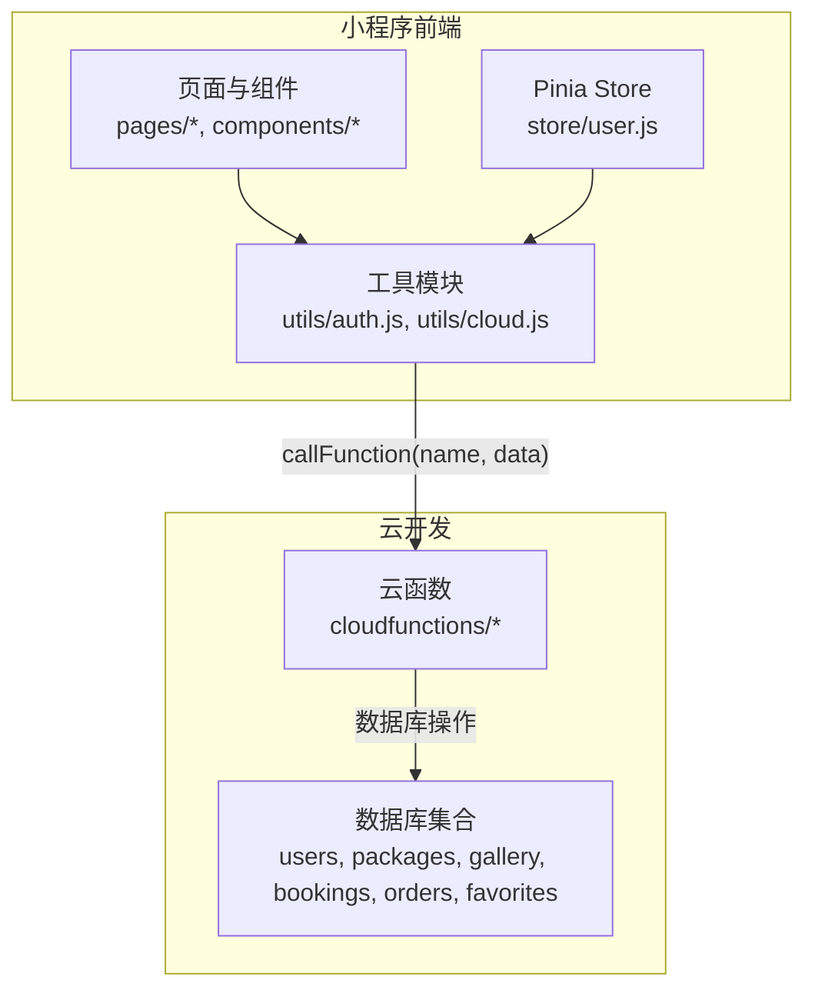
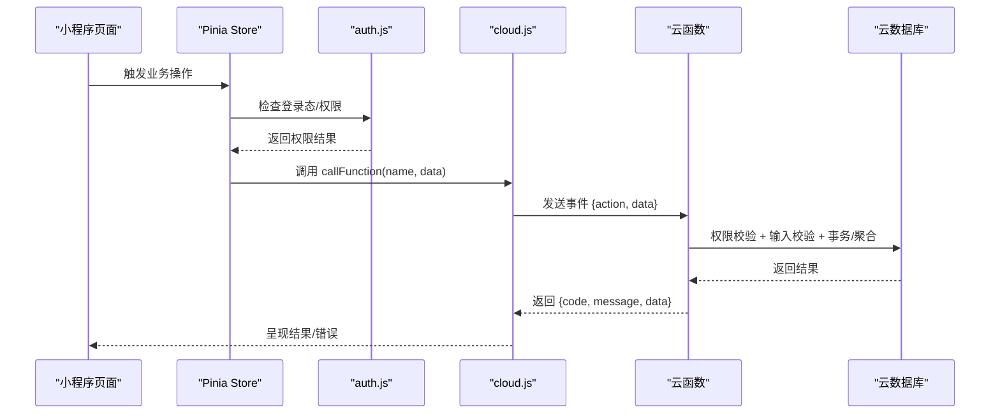
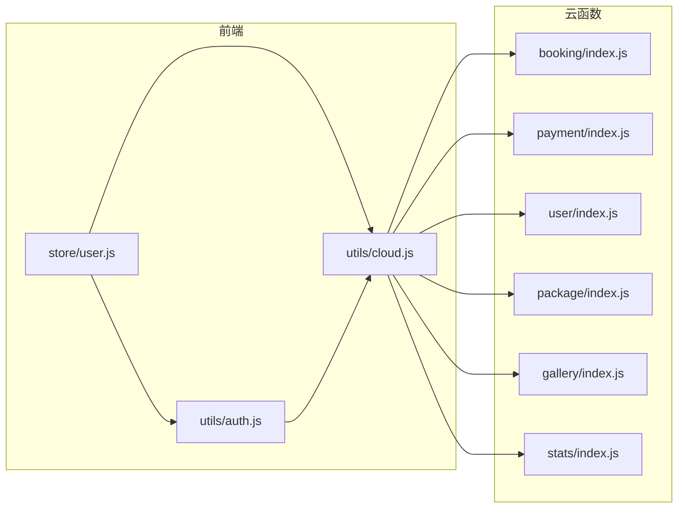
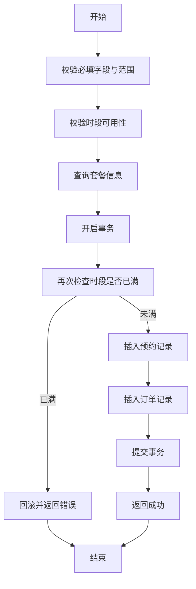

# 安全机制与防护

<cite>
**本文引用的文件**
- [booking/index.js](file://miniprogram/cloudfunctions/booking/index.js)
- [payment/index.js](file://miniprogram/cloudfunctions/payment/index.js)
- [user/index.js](file://miniprogram/cloudfunctions/user/index.js)
- [package/index.js](file://miniprogram/cloudfunctions/package/index.js)
- [gallery/index.js](file://miniprogram/cloudfunctions/gallery/index.js)
- [stats/index.js](file://miniprogram/cloudfunctions/stats/index.js)
- [auth.js](file://miniprogram/src/utils/auth.js)
- [cloud.js](file://miniprogram/src/utils/cloud.js)
- [user.js](file://miniprogram/src/store/user.js)
- [project.config.json](file://miniprogram/project.config.json)
- [manifest.json](file://miniprogram/src/manifest.json)
- [pages.json](file://miniprogram/src/pages.json)
</cite>

## 目录
1. [引言](#引言)
2. [项目结构](#项目结构)
3. [核心组件](#核心组件)
4. [架构总览](#架构总览)
5. [详细组件分析](#详细组件分析)
6. [依赖关系分析](#依赖关系分析)
7. [性能与安全特性](#性能与安全特性)
8. [故障排查指南](#故障排查指南)
9. [结论](#结论)
10. [附录](#附录)

## 引言
本文件面向 lvpai 项目，系统性梳理其安全机制与防护策略，覆盖输入验证、参数过滤、SQL 注入防护、XSS 防护、CSRF 防范、会话劫持防护、云函数安全配置（环境变量保护、API 访问限制、请求频率控制）、安全日志与异常检测、实时告警、代码审计与测试实践以及应急响应预案。文档以实际源码为依据，结合架构图与流程图，帮助开发者快速理解并落地安全最佳实践。

## 项目结构
lvpai 采用“小程序前端 + 云开发云函数”的前后端分离架构。前端通过云函数封装调用，云函数负责业务逻辑与数据库操作，并进行细粒度的权限校验与输入校验。

图表来源
- [project.config.json:1-21](file://miniprogram/project.config.json#L1-L21)
- [manifest.json:1-24](file://miniprogram/src/manifest.json#L1-L24)
- [pages.json:1-177](file://miniprogram/src/pages.json#L1-L177)

章节来源
- [project.config.json:1-21](file://miniprogram/project.config.json#L1-L21)
- [manifest.json:1-24](file://miniprogram/src/manifest.json#L1-L24)
- [pages.json:1-177](file://miniprogram/src/pages.json#L1-L177)

## 核心组件
- 云函数层：booking、payment、user、package、gallery、stats，承担业务编排、权限校验、输入校验、事务一致性与数据聚合。
- 前端工具层：auth.js 提供登录态与权限判断；cloud.js 封装云函数调用；store/user.js 管理用户状态。
- 数据层：users、packages、gallery、bookings、orders、favorites 等集合，配合云函数实现 RBAC 与数据隔离。

章节来源
- [booking/index.js:1-463](file://miniprogram/cloudfunctions/booking/index.js#L1-L463)
- [payment/index.js:1-532](file://miniprogram/cloudfunctions/payment/index.js#L1-L532)
- [user/index.js:1-206](file://miniprogram/cloudfunctions/user/index.js#L1-L206)
- [package/index.js:1-222](file://miniprogram/cloudfunctions/package/index.js#L1-L222)
- [gallery/index.js:1-360](file://miniprogram/cloudfunctions/gallery/index.js#L1-L360)
- [stats/index.js:1-229](file://miniprogram/cloudfunctions/stats/index.js#L1-L229)
- [auth.js:1-47](file://miniprogram/src/utils/auth.js#L1-L47)
- [cloud.js:1-66](file://miniprogram/src/utils/cloud.js#L1-L66)
- [user.js:1-48](file://miniprogram/src/store/user.js#L1-L48)

## 架构总览
下图展示从前端到云函数再到数据库的数据流与安全控制点。

图表来源
- [cloud.js:1-66](file://miniprogram/src/utils/cloud.js#L1-L66)
- [auth.js:1-47](file://miniprogram/src/utils/auth.js#L1-L47)
- [booking/index.js:67-93](file://miniprogram/cloudfunctions/booking/index.js#L67-L93)
- [payment/index.js:26-52](file://miniprogram/cloudfunctions/payment/index.js#L26-L52)
- [user/index.js:7-31](file://miniprogram/cloudfunctions/user/index.js#L7-L31)

## 详细组件分析

### 输入验证与参数过滤
- 必填字段校验：如创建预约、支付订单、取消预约等均对关键字段进行判空与范围校验。
- 有效值域校验：如时间槽、状态枚举、角色枚举等，严格限定可接受值。
- 正则表达式校验：如手机号格式校验。
- 查询条件构建：通过 where 条件拼装，避免动态拼接 SQL 字符串，降低注入风险。

示例路径
- [booking/index.js:98-128](file://miniprogram/cloudfunctions/booking/index.js#L98-L128)
- [payment/index.js:65-92](file://miniprogram/cloudfunctions/payment/index.js#L65-L92)
- [user/index.js:84-114](file://miniprogram/cloudfunctions/user/index.js#L84-L114)

章节来源
- [booking/index.js:98-128](file://miniprogram/cloudfunctions/booking/index.js#L98-L128)
- [payment/index.js:65-92](file://miniprogram/cloudfunctions/payment/index.js#L65-L92)
- [user/index.js:84-114](file://miniprogram/cloudfunctions/user/index.js#L84-L114)

### SQL 注入防护
- 使用云数据库命令对象与内置查询语法，避免字符串拼接构造查询条件。
- 使用聚合与事务保证跨表一致性，减少手写复杂查询带来的风险面。

示例路径
- [booking/index.js:150-205](file://miniprogram/cloudfunctions/booking/index.js#L150-L205)
- [stats/index.js:82-161](file://miniprogram/cloudfunctions/stats/index.js#L82-L161)

章节来源
- [booking/index.js:150-205](file://miniprogram/cloudfunctions/booking/index.js#L150-L205)
- [stats/index.js:82-161](file://miniprogram/cloudfunctions/stats/index.js#L82-L161)

### XSS 防护
- 前端渲染侧：项目未见对用户输入内容进行二次编码输出，建议在渲染用户可控文本时统一进行 HTML 转义与上下文适配。
- 云函数侧：对输入进行严格校验与白名单控制，减少恶意脚本注入机会。
- 建议：在 gallery、packages 等集合的展示逻辑中增加输出转义与 CSP 头部配置。

章节来源
- [gallery/index.js:105-124](file://miniprogram/cloudfunctions/gallery/index.js#L105-L124)
- [package/index.js:88-107](file://miniprogram/cloudfunctions/package/index.js#L88-L107)

### CSRF 防范
- 项目基于微信小程序云开发，天然具备同源与平台信任边界，CSRF 风险较低。
- 建议：若未来开放 Web 或第三方调用，应引入服务端 Token 校验与 SameSite Cookie 等机制。

章节来源
- [project.config.json:1-21](file://miniprogram/project.config.json#L1-L21)
- [manifest.json:1-24](file://miniprogram/src/manifest.json#L1-L24)

### 会话劫持防护
- 登录态校验：前端通过微信会话保持与过期检测；云函数通过 wxContext.OPENID 进行身份绑定。
- 权限最小化：所有敏感操作均进行角色校验（admin/superAdmin）。
- 建议：增加登录态刷新与失效通知、IP/UA 绑定与异常登录检测。

示例路径
- [auth.js:38-46](file://miniprogram/src/utils/auth.js#L38-L46)
- [user/index.js:156-205](file://miniprogram/cloudfunctions/user/index.js#L156-L205)

章节来源
- [auth.js:38-46](file://miniprogram/src/utils/auth.js#L38-L46)
- [user/index.js:156-205](file://miniprogram/cloudfunctions/user/index.js#L156-L205)

### 云函数安全配置
- 环境变量保护：使用动态环境变量初始化云函数，避免硬编码密钥。
- API 访问限制：通过 action 分发与权限校验，限制可调用接口与操作范围。
- 请求频率控制：建议在云函数入口或网关层增加限流策略（如按 openid/IP 维度）。

示例路径
- [booking/index.js:1-6](file://miniprogram/cloudfunctions/booking/index.js#L1-L6)
- [payment/index.js:1-6](file://miniprogram/cloudfunctions/payment/index.js#L1-L6)
- [user/index.js:1-6](file://miniprogram/cloudfunctions/user/index.js#L1-L6)

章节来源
- [booking/index.js:1-6](file://miniprogram/cloudfunctions/booking/index.js#L1-L6)
- [payment/index.js:1-6](file://miniprogram/cloudfunctions/payment/index.js#L1-L6)
- [user/index.js:1-6](file://miniprogram/cloudfunctions/user/index.js#L1-L6)

### 安全日志记录、异常检测与实时告警
- 日志记录：云函数内对错误进行集中捕获与记录，便于问题定位。
- 异常检测：对越权访问、非法状态变更、并发冲突等场景进行显式校验与回滚。
- 实时告警：建议接入云监控与日志服务，对高频错误与异常状态变化触发告警。

示例路径
- [booking/index.js:89-92](file://miniprogram/cloudfunctions/booking/index.js#L89-L92)
- [payment/index.js:48-51](file://miniprogram/cloudfunctions/payment/index.js#L48-L51)
- [stats/index.js:64-67](file://miniprogram/cloudfunctions/stats/index.js#L64-L67)

章节来源
- [booking/index.js:89-92](file://miniprogram/cloudfunctions/booking/index.js#L89-L92)
- [payment/index.js:48-51](file://miniprogram/cloudfunctions/payment/index.js#L48-L51)
- [stats/index.js:64-67](file://miniprogram/cloudfunctions/stats/index.js#L64-L67)

### 代码审计与安全测试
- 审计清单
  - 输入校验：覆盖所有云函数入参，确保类型、长度、范围与格式约束。
  - 权限校验：逐条核对 action 与角色判定，避免越权。
  - 事务与一致性：检查跨表更新是否使用事务，防止脏写。
  - 错误处理：统一错误码与消息，避免泄露敏感信息。
- 测试建议
  - 单元测试：针对校验逻辑与分支进行覆盖。
  - 集成测试：模拟越权、并发、异常网络等场景。
  - 渗透测试：模拟 SQL 注入、XSS、暴力破解等。

章节来源
- [booking/index.js:98-128](file://miniprogram/cloudfunctions/booking/index.js#L98-L128)
- [payment/index.js:65-92](file://miniprogram/cloudfunctions/payment/index.js#L65-L92)
- [user/index.js:84-114](file://miniprogram/cloudfunctions/user/index.js#L84-L114)

### 应急响应预案
- 快速处置
  - 发现异常：立即冻结相关云函数与数据库访问权限。
  - 定位根因：查看云函数日志与数据库变更记录。
  - 修复上线：修复后灰度发布并持续监控。
- 预防措施
  - 强制权限校验与最小权限原则。
  - 引入自动化扫描与合规检查。
  - 建立备份与回滚机制。

## 依赖关系分析

图表来源
- [user.js:1-48](file://miniprogram/src/store/user.js#L1-L48)
- [auth.js:1-47](file://miniprogram/src/utils/auth.js#L1-L47)
- [cloud.js:1-66](file://miniprogram/src/utils/cloud.js#L1-L66)
- [booking/index.js:67-93](file://miniprogram/cloudfunctions/booking/index.js#L67-L93)
- [payment/index.js:26-52](file://miniprogram/cloudfunctions/payment/index.js#L26-L52)
- [user/index.js:7-31](file://miniprogram/cloudfunctions/user/index.js#L7-L31)
- [package/index.js:26-58](file://miniprogram/cloudfunctions/package/index.js#L26-L58)
- [gallery/index.js:26-64](file://miniprogram/cloudfunctions/gallery/index.js#L26-L64)
- [stats/index.js:52-68](file://miniprogram/cloudfunctions/stats/index.js#L52-L68)

章节来源
- [user.js:1-48](file://miniprogram/src/store/user.js#L1-L48)
- [auth.js:1-47](file://miniprogram/src/utils/auth.js#L1-L47)
- [cloud.js:1-66](file://miniprogram/src/utils/cloud.js#L1-L66)
- [booking/index.js:67-93](file://miniprogram/cloudfunctions/booking/index.js#L67-L93)
- [payment/index.js:26-52](file://miniprogram/cloudfunctions/payment/index.js#L26-L52)
- [user/index.js:7-31](file://miniprogram/cloudfunctions/user/index.js#L7-L31)
- [package/index.js:26-58](file://miniprogram/cloudfunctions/package/index.js#L26-L58)
- [gallery/index.js:26-64](file://miniprogram/cloudfunctions/gallery/index.js#L26-L64)
- [stats/index.js:52-68](file://miniprogram/cloudfunctions/stats/index.js#L52-L68)

## 性能与安全特性
- 并发控制：创建预约时使用事务与二次检查，避免超卖。
- 聚合统计：使用聚合管道进行统计计算，减少多次查询。
- 最小暴露面：通过 action 分发与权限校验，限制接口能力。

章节来源
- [booking/index.js:150-205](file://miniprogram/cloudfunctions/booking/index.js#L150-L205)
- [stats/index.js:102-121](file://miniprogram/cloudfunctions/stats/index.js#L102-L121)

## 故障排查指南
- 常见错误与定位
  - 未知操作：检查前端传入 action 是否正确。
  - 权限不足：确认用户角色与校验逻辑。
  - 数据不存在：检查查询条件与 ID 合法性。
  - 并发冲突：关注事务回滚与重试策略。
- 日志与监控
  - 统一错误码与消息，便于前端提示与后端定位。
  - 对异常场景增加告警阈值与追踪 ID。

章节来源
- [booking/index.js:86-88](file://miniprogram/cloudfunctions/booking/index.js#L86-L88)
- [payment/index.js:45-47](file://miniprogram/cloudfunctions/payment/index.js#L45-L47)
- [user/index.js:24-30](file://miniprogram/cloudfunctions/user/index.js#L24-L30)

## 结论
lvpai 项目在云函数层实现了完善的输入校验、权限控制与事务一致性保障，有效降低了常见安全风险。建议后续在前端输出转义、CSP 配置、限流与实时告警等方面进一步加固，并建立标准化的代码审计与渗透测试流程，持续提升整体安全水平。

## 附录
- 关键流程图：创建预约与支付流程

图表来源
- [booking/index.js:98-205](file://miniprogram/cloudfunctions/booking/index.js#L98-L205)