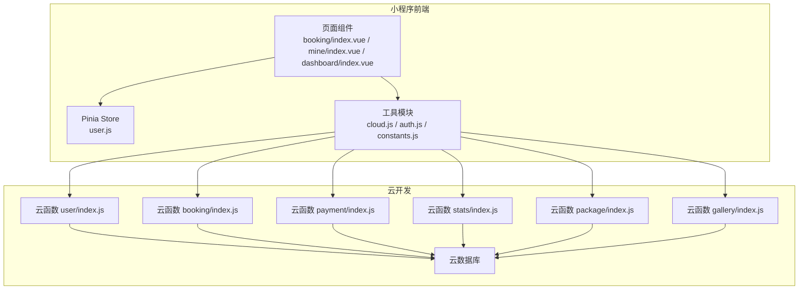
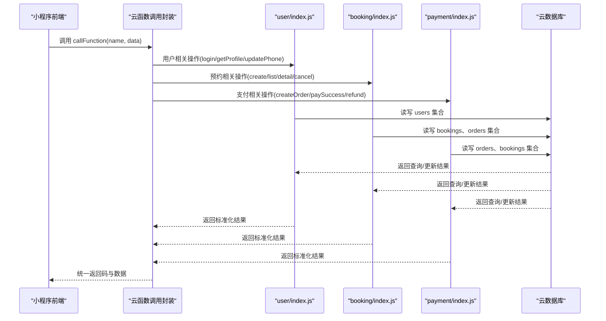
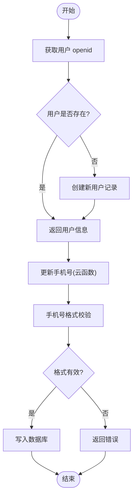
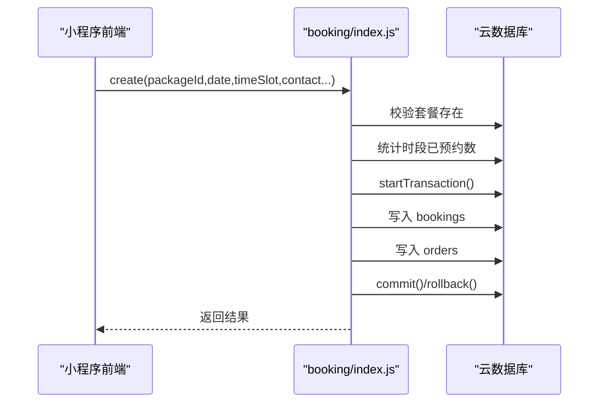
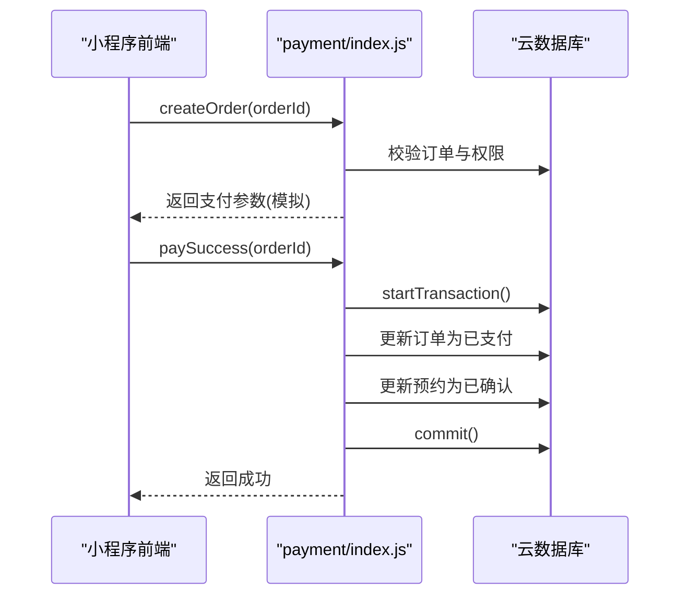
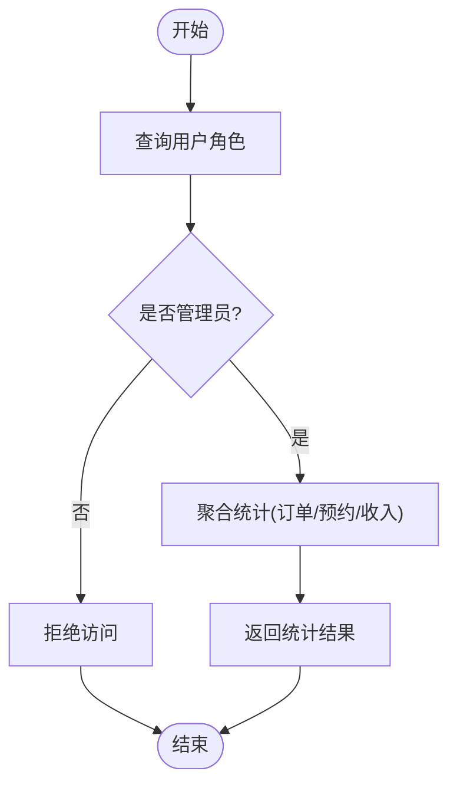
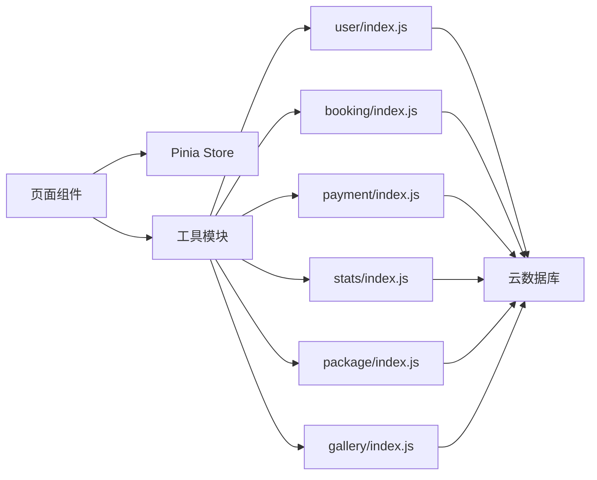

# 数据保护与加密

<cite>
**本文档引用的文件**
- [cloud.js](file://miniprogram/src/utils/cloud.js)
- [auth.js](file://miniprogram/src/utils/auth.js)
- [user.js](file://miniprogram/src/store/user.js)
- [user/index.js](file://miniprogram/cloudfunctions/user/index.js)
- [booking/index.js](file://miniprogram/cloudfunctions/booking/index.js)
- [payment/index.js](file://miniprogram/cloudfunctions/payment/index.js)
- [stats/index.js](file://miniprogram/cloudfunctions/stats/index.js)
- [package/index.js](file://miniprogram/cloudfunctions/package/index.js)
- [gallery/index.js](file://miniprogram/cloudfunctions/gallery/index.js)
- [index.vue](file://miniprogram/src/pages/booking/index.vue)
- [index.vue](file://miniprogram/src/pages/mine/index.vue)
- [index.vue](file://miniprogram/src/pages-admin/dashboard/index.vue)
- [constants.js](file://miniprogram/src/utils/constants.js)
- [project.config.json](file://miniprogram/project.config.json)
</cite>

## 目录
1. [简介](#简介)
2. [项目结构](#项目结构)
3. [核心组件](#核心组件)
4. [架构总览](#架构总览)
5. [详细组件分析](#详细组件分析)
6. [依赖关系分析](#依赖关系分析)
7. [性能考虑](#性能考虑)
8. [故障排查指南](#故障排查指南)
9. [结论](#结论)
10. [附录](#附录)

## 简介
本文件面向 lvpai 项目的开发者与运维人员，系统性梳理项目中的数据保护与加密实践，重点覆盖以下方面：
- 敏感信息（如手机号）的验证规则与存储保护
- 数据库层面的访问控制、索引与查询限制
- 云开发数据库的安全配置要点
- 数据传输与存储层面的加密建议
- 数据泄露防护、异常访问监控与数据完整性验证
- 合规性建议与最佳实践

说明：当前仓库代码未实现端到端的端到端加密与数据库字段级加密，本文在现有实现基础上提出可落地的安全加固建议。

## 项目结构
lvpai 采用“小程序前端 + 微信云开发云函数 + 云数据库”的三层架构。前端通过封装的云函数调用层与后端交互，云函数负责业务逻辑与数据库操作，并进行权限校验与数据校验。

图表来源
- [cloud.js:1-66](file://miniprogram/src/utils/cloud.js#L1-L66)
- [auth.js:1-47](file://miniprogram/src/utils/auth.js#L1-L47)
- [user.js:1-48](file://miniprogram/src/store/user.js#L1-L48)
- [user/index.js:1-206](file://miniprogram/cloudfunctions/user/index.js#L1-L206)
- [booking/index.js:1-463](file://miniprogram/cloudfunctions/booking/index.js#L1-L463)
- [payment/index.js:1-532](file://miniprogram/cloudfunctions/payment/index.js#L1-L532)
- [stats/index.js:1-229](file://miniprogram/cloudfunctions/stats/index.js#L1-L229)
- [package/index.js:1-222](file://miniprogram/cloudfunctions/package/index.js#L1-L222)
- [gallery/index.js:1-360](file://miniprogram/cloudfunctions/gallery/index.js#L1-L360)

章节来源
- [cloud.js:1-66](file://miniprogram/src/utils/cloud.js#L1-L66)
- [auth.js:1-47](file://miniprogram/src/utils/auth.js#L1-L47)
- [user.js:1-48](file://miniprogram/src/store/user.js#L1-L48)
- [project.config.json:1-21](file://miniprogram/project.config.json#L1-L21)

## 核心组件
- 云函数调用封装：统一处理云函数调用、错误与返回码，便于前端一致化处理。
- 权限管理：基于 openid 的用户登录、角色判断与会话检查。
- 数据校验：手机号格式校验、表单必填项校验、时段可用性校验。
- 访问控制：基于角色的管理员权限校验，以及对用户自身数据的读写限制。
- 数据脱敏：前端对手机号进行显示脱敏处理。

章节来源
- [cloud.js:6-26](file://miniprogram/src/utils/cloud.js#L6-L26)
- [auth.js:7-36](file://miniprogram/src/utils/auth.js#L7-L36)
- [user/index.js:94-98](file://miniprogram/cloudfunctions/user/index.js#L94-L98)
- [booking/index.js:101-112](file://miniprogram/cloudfunctions/booking/index.js#L101-L112)
- [index.vue:408-411](file://miniprogram/src/pages/booking/index.vue#L408-L411)
- [index.vue:101-105](file://miniprogram/src/pages/mine/index.vue#L101-L105)

## 架构总览
下图展示了从前端到云函数再到数据库的关键交互路径与安全控制点。

图表来源
- [cloud.js:6-26](file://miniprogram/src/utils/cloud.js#L6-L26)
- [user/index.js:7-31](file://miniprogram/cloudfunctions/user/index.js#L7-L31)
- [booking/index.js:67-93](file://miniprogram/cloudfunctions/booking/index.js#L67-L93)
- [payment/index.js:26-52](file://miniprogram/cloudfunctions/payment/index.js#L26-L52)

## 详细组件分析

### 用户与手机号处理
- 登录与角色：通过 openid 获取用户信息，支持普通用户、管理员与超级管理员三级角色。
- 手机号更新：在云函数侧进行手机号格式校验（中国大陆手机号正则），避免非法格式进入数据库。
- 前端脱敏：在个人中心页面对手机号进行显示脱敏，降低信息泄露风险。

图表来源
- [user/index.js:34-66](file://miniprogram/cloudfunctions/user/index.js#L34-L66)
- [user/index.js:84-115](file://miniprogram/cloudfunctions/user/index.js#L84-L115)
- [user/index.js:94-98](file://miniprogram/cloudfunctions/user/index.js#L94-L98)
- [index.vue:101-105](file://miniprogram/src/pages/mine/index.vue#L101-L105)

章节来源
- [user/index.js:14-115](file://miniprogram/cloudfunctions/user/index.js#L14-L115)
- [index.vue:101-105](file://miniprogram/src/pages/mine/index.vue#L101-L105)

### 预约流程与并发控制
- 必填项与格式校验：套餐、日期、时段、联系人姓名、手机号等必填且格式校验。
- 时段容量控制：按日期+时段维度统计已预约数量，防止超卖。
- 事务保证一致性：创建预约与订单时使用事务，确保数据一致性。
- 权限控制：非管理员仅能查看/修改自己的预约；管理员可跨用户操作。

图表来源
- [booking/index.js:98-206](file://miniprogram/cloudfunctions/booking/index.js#L98-L206)
- [booking/index.js:51-65](file://miniprogram/cloudfunctions/booking/index.js#L51-L65)

章节来源
- [booking/index.js:98-206](file://miniprogram/cloudfunctions/booking/index.js#L98-L206)
- [booking/index.js:211-259](file://miniprogram/cloudfunctions/booking/index.js#L211-L259)
- [booking/index.js:264-303](file://miniprogram/cloudfunctions/booking/index.js#L264-L303)

### 支付流程与状态管理
- 订单状态：未支付、已支付、退款中、已退款等状态流转。
- 权限校验：仅订单所属用户可支付；管理员可执行退款。
- 事务更新：支付成功时同时更新订单与关联预约状态。
- 模拟支付：当前为模拟模式，真实接入需配置微信支付商户号。

图表来源
- [payment/index.js:65-166](file://miniprogram/cloudfunctions/payment/index.js#L65-L166)
- [payment/index.js:172-239](file://miniprogram/cloudfunctions/payment/index.js#L172-L239)

章节来源
- [payment/index.js:65-166](file://miniprogram/cloudfunctions/payment/index.js#L65-L166)
- [payment/index.js:172-239](file://miniprogram/cloudfunctions/payment/index.js#L172-L239)

### 管理员统计与访问控制
- 管理员权限：通过查询 users 集合并比对角色字段，限制统计与管理功能。
- 统计范围：仅管理员可见核心指标与趋势数据。

图表来源
- [stats/index.js:74-78](file://miniprogram/cloudfunctions/stats/index.js#L74-L78)
- [stats/index.js:70-162](file://miniprogram/cloudfunctions/stats/index.js#L70-L162)

章节来源
- [stats/index.js:74-78](file://miniprogram/cloudfunctions/stats/index.js#L74-L78)
- [stats/index.js:70-162](file://miniprogram/cloudfunctions/stats/index.js#L70-L162)

### 数据脱敏与前端展示
- 手机号脱敏：前端使用正则对 11 位手机号中间 4 位进行掩码处理。
- 前端校验：在提交预约前进行手机号格式校验，减少无效请求。

章节来源
- [index.vue:101-105](file://miniprogram/src/pages/mine/index.vue#L101-L105)
- [index.vue:408-411](file://miniprogram/src/pages/booking/index.vue#L408-L411)

## 依赖关系分析
- 前端依赖关系：页面组件依赖 store 与工具模块；工具模块封装云函数调用与权限检查。
- 云函数依赖关系：各云函数依赖 wx-server-sdk 初始化环境，访问云数据库；部分函数间存在相互调用（如统计函数检查管理员权限）。
- 数据库依赖关系：users、bookings、orders、packages、gallery、favorites 等集合构成核心数据模型。

图表来源
- [cloud.js:1-66](file://miniprogram/src/utils/cloud.js#L1-L66)
- [user.js:1-48](file://miniprogram/src/store/user.js#L1-L48)
- [user/index.js:1-206](file://miniprogram/cloudfunctions/user/index.js#L1-L206)
- [booking/index.js:1-463](file://miniprogram/cloudfunctions/booking/index.js#L1-L463)
- [payment/index.js:1-532](file://miniprogram/cloudfunctions/payment/index.js#L1-L532)
- [stats/index.js:1-229](file://miniprogram/cloudfunctions/stats/index.js#L1-L229)
- [package/index.js:1-222](file://miniprogram/cloudfunctions/package/index.js#L1-L222)
- [gallery/index.js:1-360](file://miniprogram/cloudfunctions/gallery/index.js#L1-L360)

## 性能考虑
- 事务使用：在创建预约与订单时使用事务，确保一致性的同时可能带来锁竞争，建议在高并发场景下评估时段容量与重试策略。
- 查询优化：统计函数使用聚合与多次 count 查询，建议在数据量增长后引入合适的索引与缓存策略。
- 前端校验：在前端进行基础校验可减少无效请求，提升整体响应效率。

## 故障排查指南
- 云函数返回码：统一以 { code, message, data } 形式返回，前端应根据 code 判断成功与否。
- 权限错误：若提示无权限，请检查用户角色与 openid 对应关系。
- 数据不存在：当查询不到用户、订单或套餐时，需检查传入 ID 与业务逻辑。
- 支付状态异常：仅未支付订单可支付，已支付订单不可重复支付。

章节来源
- [cloud.js:6-26](file://miniprogram/src/utils/cloud.js#L6-L26)
- [user/index.js:34-82](file://miniprogram/cloudfunctions/user/index.js#L34-L82)
- [booking/index.js:211-259](file://miniprogram/cloudfunctions/booking/index.js#L211-L259)
- [payment/index.js:172-239](file://miniprogram/cloudfunctions/payment/index.js#L172-L239)

## 结论
lvpai 项目在现有实现中已具备较为完善的前端校验、云函数权限控制与事务一致性保障。针对敏感数据保护，建议在现有基础上补充：
- 数据库字段级加密与访问控制
- 传输加密与存储加密
- 异常访问监控与审计日志
- 数据完整性校验与备份策略
- 合规性评估与隐私政策完善

## 附录

### 数据库安全配置建议
- 集合权限：为 users、bookings、orders、packages、gallery、favorites 等集合设置最小权限原则，仅允许授权操作。
- 索引安全：为高频查询字段建立复合索引（如 bookings.date+timeSlot、orders.userId+payStatus），避免全表扫描。
- 查询限制：对列表查询增加分页与总数限制，防止大范围扫描。
- 字段脱敏：对敏感字段在返回层进行脱敏处理（如手机号中间四位掩码）。
- 备份策略：定期备份数据库，启用增量备份与恢复演练。

### 数据传输与存储加密
- 传输加密：确保所有网络通信使用 HTTPS/TLS，避免明文传输。
- 存储加密：结合云平台提供的静态加密能力，对存储的敏感文件与数据进行加密。
- 密钥管理：使用平台提供的密钥管理服务，定期轮换密钥并严格控制访问权限。

### 数据泄露防护与监控
- 异常访问监控：对频繁失败的登录、越权访问、异常查询行为进行告警。
- 审计日志：记录关键操作（如手机号更新、订单状态变更、管理员操作）以便追溯。
- 数据完整性验证：对关键字段（如订单金额、状态）进行一致性校验与校验和计算。

### 合规性建议
- 隐私政策：明确告知用户数据收集目的、使用范围与保留期限。
- 用户同意：在更新手机号等敏感信息前，要求用户确认与授权。
- 数据最小化：仅收集与业务必需的信息，避免过度采集。
- 权利保障：提供用户访问、更正、删除其个人信息的权利。