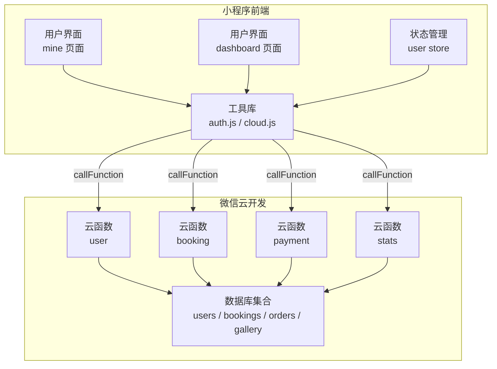
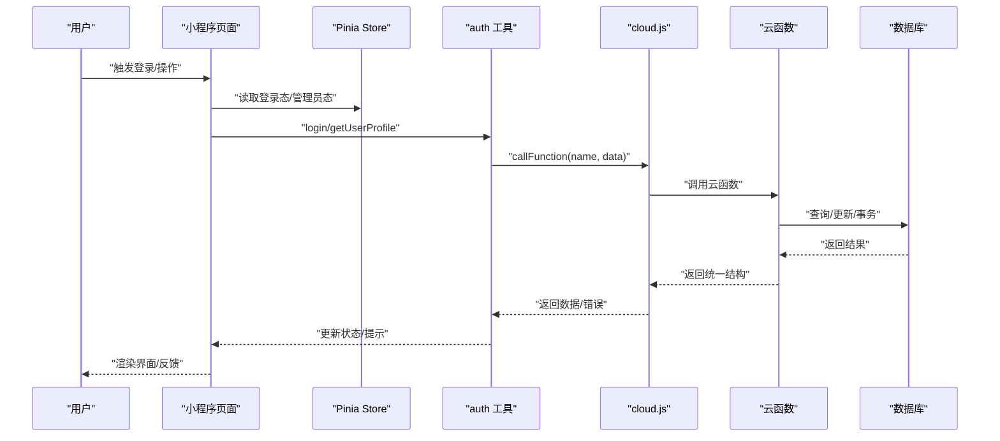
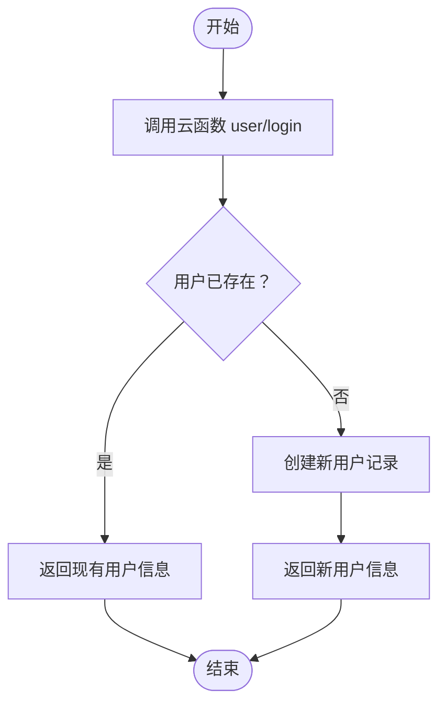
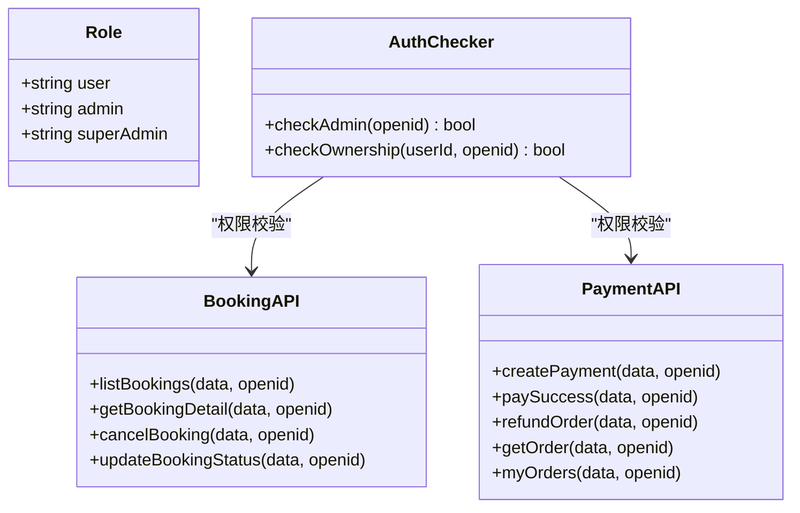
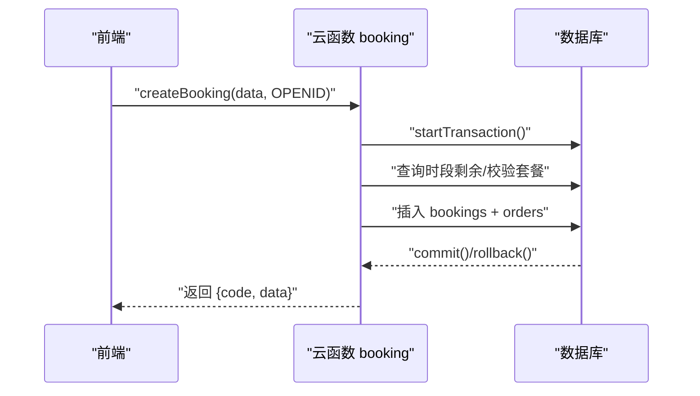
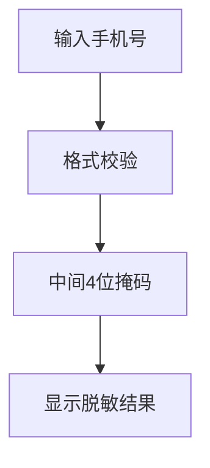
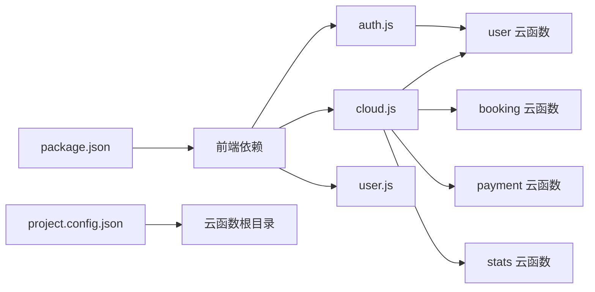

# 数据安全与权限

<cite>
**本文档引用的文件**
- [auth.js](file://miniprogram/src/utils/auth.js)
- [user.js](file://miniprogram/src/store/user.js)
- [cloud.js](file://miniprogram/src/utils/cloud.js)
- [user 云函数](file://miniprogram/cloudfunctions/user/index.js)
- [booking 云函数](file://miniprogram/cloudfunctions/booking/index.js)
- [payment 云函数](file://miniprogram/cloudfunctions/payment/index.js)
- [stats 云函数](file://miniprogram/cloudfunctions/stats/index.js)
- [mine 页面](file://miniprogram/src/pages/mine/index.vue)
- [dashboard 页面](file://miniprogram/src/pages-admin/dashboard/index.vue)
- [常量定义](file://miniprogram/src/utils/constants.js)
- [项目配置](file://miniprogram/project.config.json)
- [包管理](file://miniprogram/package.json)
</cite>

## 目录
1. [简介](#简介)
2. [项目结构](#项目结构)
3. [核心组件](#核心组件)
4. [架构总览](#架构总览)
5. [详细组件分析](#详细组件分析)
6. [依赖关系分析](#依赖关系分析)
7. [性能考虑](#性能考虑)
8. [故障排查指南](#故障排查指南)
9. [结论](#结论)
10. [附录](#附录)

## 简介
本文件面向 lvpai 项目的开发者与运维人员，系统化梳理项目中的数据安全与权限管理机制。重点覆盖以下方面：
- 用户身份认证与会话保持
- 基于角色的访问控制（RBAC）
- 云函数侧权限校验与数据隔离
- 敏感数据处理与展示脱敏
- API 调用封装与错误处理
- 安全漏洞防护建议（SQL 注入、XSS 等）
- 合规性与隐私保护指引

## 项目结构
lvpai 采用“小程序前端 + 微信云开发云函数”的前后端分离架构。前端通过云函数进行用户认证、业务数据读写与支付流程；云函数负责权限校验、数据一致性与业务规则。

图表来源
- [mine 页面:1-309](file://miniprogram/src/pages/mine/index.vue#L1-L309)
- [dashboard 页面:1-295](file://miniprogram/src/pages-admin/dashboard/index.vue#L1-L295)
- [user.js:1-48](file://miniprogram/src/store/user.js#L1-L48)
- [auth.js:1-47](file://miniprogram/src/utils/auth.js#L1-L47)
- [cloud.js:1-66](file://miniprogram/src/utils/cloud.js#L1-L66)
- [user 云函数:1-206](file://miniprogram/cloudfunctions/user/index.js#L1-L206)
- [booking 云函数:1-463](file://miniprogram/cloudfunctions/booking/index.js#L1-L463)
- [payment 云函数:1-532](file://miniprogram/cloudfunctions/payment/index.js#L1-L532)
- [stats 云函数:1-229](file://miniprogram/cloudfunctions/stats/index.js#L1-L229)

章节来源
- [mine 页面:1-309](file://miniprogram/src/pages/mine/index.vue#L1-L309)
- [dashboard 页面:1-295](file://miniprogram/src/pages-admin/dashboard/index.vue#L1-L295)
- [user.js:1-48](file://miniprogram/src/store/user.js#L1-L48)
- [auth.js:1-47](file://miniprogram/src/utils/auth.js#L1-L47)
- [cloud.js:1-66](file://miniprogram/src/utils/cloud.js#L1-L66)

## 核心组件
- 用户认证与权限工具
  - 登录、获取用户信息、角色判断、会话检查
- 状态管理
  - 用户信息、登录态、管理员态
- 云函数调用封装
  - 统一错误处理、返回码约定
- 云函数权限校验
  - 角色校验、资源归属校验、状态变更约束
- 前端展示与脱敏
  - 手机号脱敏显示、管理员入口控制

章节来源
- [auth.js:1-47](file://miniprogram/src/utils/auth.js#L1-L47)
- [user.js:1-48](file://miniprogram/src/store/user.js#L1-L48)
- [cloud.js:1-66](file://miniprogram/src/utils/cloud.js#L1-L66)
- [user 云函数:1-206](file://miniprogram/cloudfunctions/user/index.js#L1-L206)
- [booking 云函数:1-463](file://miniprogram/cloudfunctions/booking/index.js#L1-L463)
- [payment 云函数:1-532](file://miniprogram/cloudfunctions/payment/index.js#L1-L532)
- [stats 云函数:1-229](file://miniprogram/cloudfunctions/stats/index.js#L1-L229)
- [mine 页面:101-105](file://miniprogram/src/pages/mine/index.vue#L101-L105)

## 架构总览
下图展示了从前端到云函数再到数据库的数据流与权限控制路径：

图表来源
- [user.js:1-48](file://miniprogram/src/store/user.js#L1-L48)
- [auth.js:1-47](file://miniprogram/src/utils/auth.js#L1-L47)
- [cloud.js:1-66](file://miniprogram/src/utils/cloud.js#L1-L66)
- [user 云函数:1-206](file://miniprogram/cloudfunctions/user/index.js#L1-L206)
- [booking 云函数:1-463](file://miniprogram/cloudfunctions/booking/index.js#L1-L463)
- [payment 云函数:1-532](file://miniprogram/cloudfunctions/payment/index.js#L1-L532)
- [stats 云函数:1-229](file://miniprogram/cloudfunctions/stats/index.js#L1-L229)

## 详细组件分析

### 用户身份认证与权限工具
- 登录流程
  - 前端调用云函数 user 的 login，创建或获取用户记录
  - 返回用户信息，前端存入 Pinia store
- 角色判断
  - 提供 isAdmin 与 isSuperAdmin 辅助函数
  - 前端根据角色控制菜单与入口
- 会话检查
  - 使用小程序原生 wx.checkSession 进行登录态校验

图表来源
- [auth.js:7-15](file://miniprogram/src/utils/auth.js#L7-L15)
- [user 云函数:34-67](file://miniprogram/cloudfunctions/user/index.js#L34-L67)

章节来源
- [auth.js:1-47](file://miniprogram/src/utils/auth.js#L1-L47)
- [user.js:1-48](file://miniprogram/src/store/user.js#L1-L48)
- [user 云函数:1-206](file://miniprogram/cloudfunctions/user/index.js#L1-L206)

### 基于角色的访问控制（RBAC）
- 角色定义
  - user、admin、superAdmin 三类角色
- 权限边界
  - 非管理员：仅能访问自身数据
  - 管理员：可查看全部预约/订单，执行状态变更与退款等操作
  - 超级管理员：具备最高权限（如设置管理员角色）

图表来源
- [booking 云函数:32-46](file://miniprogram/cloudfunctions/booking/index.js#L32-L46)
- [payment 云函数:10-24](file://miniprogram/cloudfunctions/payment/index.js#L10-L24)
- [stats 云函数:11-25](file://miniprogram/cloudfunctions/stats/index.js#L11-L25)

章节来源
- [booking 云函数:211-259](file://miniprogram/cloudfunctions/booking/index.js#L211-L259)
- [payment 云函数:338-345](file://miniprogram/cloudfunctions/payment/index.js#L338-L345)
- [stats 云函数:74-78](file://miniprogram/cloudfunctions/stats/index.js#L74-L78)

### 云函数权限校验与数据一致性
- 预约模块
  - 列表/详情/取消/状态变更均进行角色与归属校验
  - 使用事务保证“创建预约+创建订单”原子性
- 支付模块
  - 仅本人可支付订单；支付成功后联动更新订单与预约状态
  - 退款仅管理员可执行，且状态严格校验
- 统计模块
  - 仅管理员可查看数据概览

图表来源
- [booking 云函数:150-206](file://miniprogram/cloudfunctions/booking/index.js#L150-L206)

章节来源
- [booking 云函数:150-206](file://miniprogram/cloudfunctions/booking/index.js#L150-L206)
- [payment 云函数:203-239](file://miniprogram/cloudfunctions/payment/index.js#L203-L239)

### 敏感数据处理与展示脱敏
- 前端脱敏
  - mine 页面对手机号进行中间部分掩码处理
- 数据库存储
  - 用户手机号字段存在数据库中，需结合最小化收集原则与本地加密策略（见后续建议）

图表来源
- [mine 页面:101-105](file://miniprogram/src/pages/mine/index.vue#L101-L105)

章节来源
- [mine 页面:101-105](file://miniprogram/src/pages/mine/index.vue#L101-L105)
- [user 云函数:84-115](file://miniprogram/cloudfunctions/user/index.js#L84-L115)

### API 调用封装与错误处理
- 统一调用
  - cloud.js 对 wx.cloud.callFunction 进行封装，统一处理成功/失败与返回码
- 错误传播
  - 云函数返回 { code, message, data } 结构，前端据此展示提示或抛出异常

章节来源
- [cloud.js:6-26](file://miniprogram/src/utils/cloud.js#L6-L26)
- [user 云函数:27-31](file://miniprogram/cloudfunctions/user/index.js#L27-L31)

### 管理员入口与界面控制
- mine 页面根据管理员态显示管理入口
- dashboard 页面在挂载时进行管理员权限检查，无权限则提示并跳转首页

章节来源
- [mine 页面:58-64](file://miniprogram/src/pages/mine/index.vue#L58-L64)
- [dashboard 页面:90-103](file://miniprogram/src/pages-admin/dashboard/index.vue#L90-L103)

## 依赖关系分析
- 前端依赖
  - Vue 3、Pinia 状态管理、UniApp 生态
- 云函数依赖
  - wx-server-sdk 初始化与数据库操作
- 配置文件
  - project.config.json 指定云函数根目录与编译设置

图表来源
- [package.json:1-22](file://miniprogram/package.json#L1-L22)
- [project.config.json:1-21](file://miniprogram/project.config.json#L1-L21)
- [auth.js:1-47](file://miniprogram/src/utils/auth.js#L1-L47)
- [cloud.js:1-66](file://miniprogram/src/utils/cloud.js#L1-L66)
- [user.js:1-48](file://miniprogram/src/store/user.js#L1-L48)
- [user 云函数:1-206](file://miniprogram/cloudfunctions/user/index.js#L1-L206)
- [booking 云函数:1-463](file://miniprogram/cloudfunctions/booking/index.js#L1-L463)
- [payment 云函数:1-532](file://miniprogram/cloudfunctions/payment/index.js#L1-L532)
- [stats 云函数:1-229](file://miniprogram/cloudfunctions/stats/index.js#L1-L229)

章节来源
- [package.json:1-22](file://miniprogram/package.json#L1-L22)
- [project.config.json:1-21](file://miniprogram/project.config.json#L1-L21)

## 性能考虑
- 云函数冷启动
  - 合理复用连接与缓存热点数据，避免频繁初始化
- 查询优化
  - 为高频查询字段建立索引（如 openid、订单号、日期等）
- 事务范围
  - 事务内只做必要操作，缩短锁持有时间
- 前端分页
  - 列表查询使用 skip/limit 控制分页大小，避免一次性拉取大量数据

## 故障排查指南
- 登录失败
  - 检查云函数 user 的 login 流程与数据库 users 表
  - 关注返回码与错误消息
- 权限不足
  - 确认当前用户角色与目标资源归属
  - booking/payment/stats 的 checkAdmin 逻辑
- 数据不一致
  - 关注事务提交/回滚路径
  - 并发场景下的二次检查
- 前端无权限访问
  - dashboard 页面的管理员检查逻辑

章节来源
- [user 云函数:27-31](file://miniprogram/cloudfunctions/user/index.js#L27-L31)
- [booking 云函数:221-226](file://miniprogram/cloudfunctions/booking/index.js#L221-L226)
- [payment 云函数:341-345](file://miniprogram/cloudfunctions/payment/index.js#L341-L345)
- [stats 云函数:74-78](file://miniprogram/cloudfunctions/stats/index.js#L74-L78)
- [dashboard 页面:90-103](file://miniprogram/src/pages-admin/dashboard/index.vue#L90-L103)

## 结论
lvpai 项目在权限控制上采用了清晰的角色模型与严格的资源归属校验，并通过云函数事务保障关键业务的一致性。前端实现了基础的脱敏展示与管理员入口控制。为进一步提升安全性与合规性，建议补充如下措施：
- 引入传输加密与存储加密（如本地敏感字段加密）
- 建立审计日志与访问追踪
- 实施更严格的输入校验与参数过滤
- 完善支付回调与退款的真实接入与签名验证

## 附录

### 安全最佳实践清单
- 传输安全
  - 使用 HTTPS 与微信云托管环境
- 输入校验
  - 严格校验手机号、日期、金额等字段格式与范围
- XSS 防护
  - 前端渲染时避免 innerHTML，使用模板语法或安全渲染库
- SQL 注入防范
  - 云开发数据库使用命令式查询，避免拼接字符串构造查询
- 审计与日志
  - 记录关键操作（登录、状态变更、退款）的时间、用户、IP、结果
- 隐私保护
  - 最小化收集原则，明确用途与期限，提供删除与导出请求通道

### 数据模型与状态映射
- 用户集合 users：角色、手机号等
- 预约集合 bookings：状态、日期、时段、联系人
- 订单集合 orders：支付状态、金额、关联预约
- 客片集合 gallery：图片与分类

章节来源
- [常量定义:1-73](file://miniprogram/src/utils/constants.js#L1-L73)