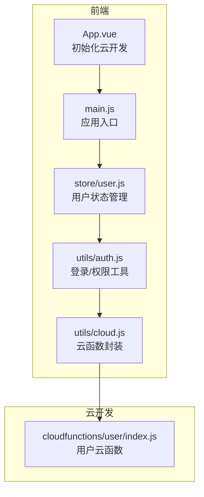
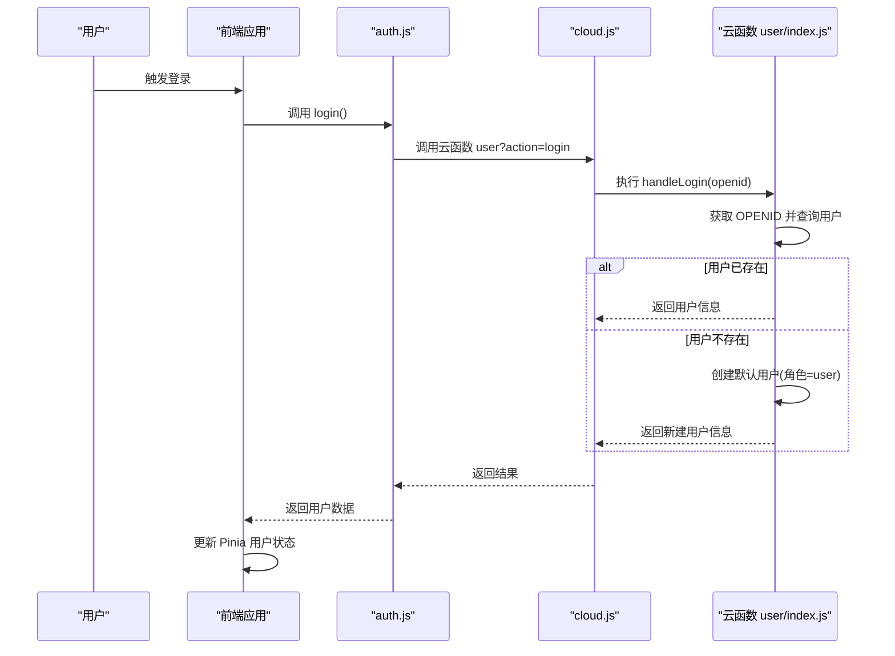
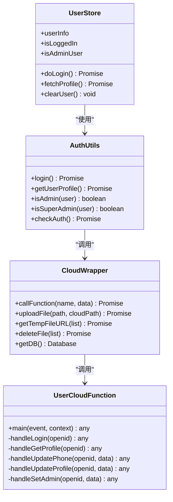
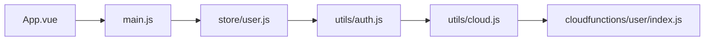
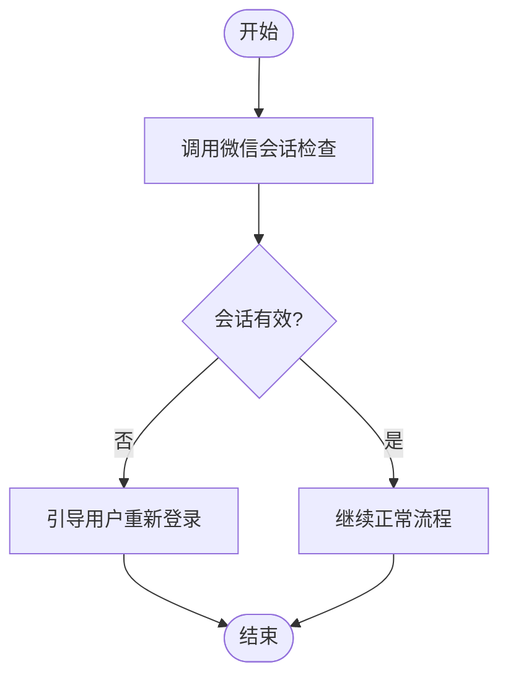

# 身份认证与授权

<cite>
**本文档引用的文件**
- [auth.js](file://miniprogram/src/utils/auth.js)
- [user.js](file://miniprogram/src/store/user.js)
- [cloud.js](file://miniprogram/src/utils/cloud.js)
- [index.js](file://miniprogram/cloudfunctions/user/index.js)
- [App.vue](file://miniprogram/src/App.vue)
- [main.js](file://miniprogram/src/main.js)
</cite>

## 目录
1. [简介](#简介)
2. [项目结构](#项目结构)
3. [核心组件](#核心组件)
4. [架构总览](#架构总览)
5. [详细组件分析](#详细组件分析)
6. [依赖关系分析](#依赖关系分析)
7. [性能考虑](#性能考虑)
8. [故障排查指南](#故障排查指南)
9. [结论](#结论)
10. [附录](#附录)

## 简介
本文件系统性阐述该微信小程序项目的用户身份认证与授权机制，重点覆盖以下内容：
- 微信小程序 openid 的获取与校验流程
- 用户登录、注册与会话管理的实现原理
- 多级权限体系设计（user、admin、superAdmin）及其边界
- 权限检查函数的实现与访问控制策略
- 前端 token 管理、后端权限验证与会话超时处理
- 完整的认证流程图与代码示例路径
- 安全最佳实践与常见问题解决方案

## 项目结构
该项目采用“前端 Vue + Pinia 状态管理 + 云开发云函数”的分层架构。认证相关的关键位置如下：
- 前端工具层：封装云函数调用与权限判断
- 前端状态层：集中管理用户登录态与角色信息
- 云函数层：统一处理用户登录、资料查询与角色变更等业务逻辑

图表来源
- [App.vue:1-26](file://miniprogram/src/App.vue#L1-L26)
- [main.js:1-11](file://miniprogram/src/main.js#L1-L11)
- [auth.js:1-47](file://miniprogram/src/utils/auth.js#L1-L47)
- [cloud.js:1-66](file://miniprogram/src/utils/cloud.js#L1-L66)
- [user.js:1-48](file://miniprogram/src/store/user.js#L1-L48)
- [index.js:1-206](file://miniprogram/cloudfunctions/user/index.js#L1-L206)

章节来源
- [App.vue:1-26](file://miniprogram/src/App.vue#L1-L26)
- [main.js:1-11](file://miniprogram/src/main.js#L1-L11)
- [auth.js:1-47](file://miniprogram/src/utils/auth.js#L1-L47)
- [cloud.js:1-66](file://miniprogram/src/utils/cloud.js#L1-L66)
- [user.js:1-48](file://miniprogram/src/store/user.js#L1-L48)
- [index.js:1-206](file://miniprogram/cloudfunctions/user/index.js#L1-L206)

## 核心组件
- 权限工具模块（auth.js）
  - 提供登录、获取用户信息、管理员判定、会话检查等方法
  - 通过云函数封装调用用户云函数
- 用户状态模块（store/user.js）
  - 使用 Pinia 管理用户信息、登录态与管理员态
  - 对外暴露登录、拉取资料、清理用户信息等接口
- 云函数封装（utils/cloud.js）
  - 统一封装 wx.cloud.callFunction，按返回码进行成功/失败分流
- 用户云函数（cloudfunctions/user/index.js）
  - 实现登录、获取资料、更新资料、设置管理员等操作
  - 内置 openid 获取、用户存在性校验、角色权限校验等

章节来源
- [auth.js:1-47](file://miniprogram/src/utils/auth.js#L1-L47)
- [user.js:1-48](file://miniprogram/src/store/user.js#L1-L48)
- [cloud.js:1-66](file://miniprogram/src/utils/cloud.js#L1-L66)
- [index.js:1-206](file://miniprogram/cloudfunctions/user/index.js#L1-L206)

## 架构总览
下图展示了从用户触发登录到云端完成用户注册/登录与权限判定的整体流程。

图表来源
- [auth.js:7-15](file://miniprogram/src/utils/auth.js#L7-L15)
- [cloud.js:5-26](file://miniprogram/src/utils/cloud.js#L5-L26)
- [index.js:13-67](file://miniprogram/cloudfunctions/user/index.js#L13-L67)

## 详细组件分析

### 组件一：权限工具模块（auth.js）
职责与行为
- 登录：调用云函数 user 的 login 动作，返回用户信息
- 获取用户信息：调用云函数 user 的 getProfile 动作
- 管理员判定：提供 isAdmin 与 isSuperAdmin 辅助函数
- 会话检查：基于微信小程序 wx.checkSession 判断本地会话有效性

关键点
- 通过云函数封装统一调用，避免在前端直接操作数据库
- 错误处理集中在工具层，便于上层统一捕获
- 会话检查用于判断是否需要重新登录或刷新令牌

章节来源
- [auth.js:6-46](file://miniprogram/src/utils/auth.js#L6-L46)

### 组件二：用户状态模块（store/user.js）
职责与行为
- 状态管理：维护 userInfo、isLoggedIn、isAdminUser
- 登录流程：调用 auth.login，成功后写入 userInfo
- 资料拉取：调用 auth.getUserProfile，更新 userInfo
- 清理用户：登出时清空 userInfo

复杂度与性能
- 状态计算属性基于响应式 ref/computed，开销极低
- 登录与拉取资料均为异步调用，避免阻塞主线程

章节来源
- [user.js:1-48](file://miniprogram/src/store/user.js#L1-L48)

### 组件三：云函数封装（cloud.js）
职责与行为
- callFunction：统一封装 wx.cloud.callFunction，按返回码区分成功/失败
- 文件操作：封装上传、下载、删除云文件
- 数据库引用：提供小程序端数据库引用（用于简单读取）

关键点
- 成功条件：返回对象包含 code 且为 0
- 失败条件：返回对象存在但 code 非 0，或调用失败
- 便于在 auth 层统一处理错误

章节来源
- [cloud.js:5-66](file://miniprogram/src/utils/cloud.js#L5-L66)

### 组件四：用户云函数（cloudfunctions/user/index.js）
职责与行为
- 登录处理：获取 OPENID，若用户不存在则创建默认用户（角色=user），否则返回现有用户
- 获取资料：根据 OPENID 查询用户信息
- 更新资料：支持昵称、头像等字段更新
- 设置管理员：仅 superAdmin 可修改目标用户的 role（user/admin/superAdmin）

权限边界
- 角色定义：user（普通用户）、admin（管理员）、superAdmin（超级管理员）
- 权限继承：admin 包含 admin 权限；superAdmin 包含所有权限
- 关键限制：设置角色仅允许 superAdmin 执行

复杂度分析
- 数据库查询与更新均为单条记录操作，时间复杂度 O(1)
- 正则校验手机号的时间复杂度 O(1)

章节来源
- [index.js:7-31](file://miniprogram/cloudfunctions/user/index.js#L7-L31)
- [index.js:34-67](file://miniprogram/cloudfunctions/user/index.js#L34-L67)
- [index.js:69-82](file://miniprogram/cloudfunctions/user/index.js#L69-L82)
- [index.js:117-154](file://miniprogram/cloudfunctions/user/index.js#L117-L154)
- [index.js:156-205](file://miniprogram/cloudfunctions/user/index.js#L156-L205)

### 类关系图（代码级）

图表来源
- [auth.js:1-47](file://miniprogram/src/utils/auth.js#L1-L47)
- [user.js:1-48](file://miniprogram/src/store/user.js#L1-L48)
- [cloud.js:1-66](file://miniprogram/src/utils/cloud.js#L1-L66)
- [index.js:1-206](file://miniprogram/cloudfunctions/user/index.js#L1-L206)

## 依赖关系分析
- 前端依赖链：App.vue → main.js → store/user.js → utils/auth.js → utils/cloud.js → 云函数 user
- 权限耦合：auth.js 中的 isAdmin/isSuperAdmin 与云函数中的角色定义强关联
- 会话管理：auth.js 的 checkAuth 依赖微信小程序原生会话机制

图表来源
- [App.vue:1-26](file://miniprogram/src/App.vue#L1-L26)
- [main.js:1-11](file://miniprogram/src/main.js#L1-L11)
- [user.js:1-48](file://miniprogram/src/store/user.js#L1-L48)
- [auth.js:1-47](file://miniprogram/src/utils/auth.js#L1-L47)
- [cloud.js:1-66](file://miniprogram/src/utils/cloud.js#L1-L66)
- [index.js:1-206](file://miniprogram/cloudfunctions/user/index.js#L1-L206)

章节来源
- [App.vue:1-26](file://miniprogram/src/App.vue#L1-L26)
- [main.js:1-11](file://miniprogram/src/main.js#L1-L11)
- [user.js:1-48](file://miniprogram/src/store/user.js#L1-L48)
- [auth.js:1-47](file://miniprogram/src/utils/auth.js#L1-L47)
- [cloud.js:1-66](file://miniprogram/src/utils/cloud.js#L1-L66)
- [index.js:1-206](file://miniprogram/cloudfunctions/user/index.js#L1-L206)

## 性能考虑
- 云函数调用：建议在高频操作中合并请求，减少网络往返
- 数据库查询：用户登录与资料查询均为单字段匹配，命中索引时查询成本低
- 响应式状态：Pinia 状态更新粒度小，避免不必要的渲染
- 会话检查：checkSession 为本地校验，成本极低

## 故障排查指南
- 登录失败
  - 检查云函数返回码与错误消息，定位是 openid 获取失败还是数据库异常
  - 参考路径：[index.js:34-67](file://miniprogram/cloudfunctions/user/index.js#L34-L67)
- 获取用户信息失败
  - 确认用户是否已注册，以及 openid 是否正确传递
  - 参考路径：[index.js:69-82](file://miniprogram/cloudfunctions/user/index.js#L69-L82)
- 设置管理员失败
  - 确认当前用户是否为 superAdmin，目标用户是否存在
  - 参考路径：[index.js:156-205](file://miniprogram/cloudfunctions/user/index.js#L156-L205)
- 会话失效
  - 使用 checkAuth 判断本地会话状态，必要时引导重新登录
  - 参考路径：[auth.js:38-46](file://miniprogram/src/utils/auth.js#L38-L46)
- 云函数调用异常
  - 统一通过 cloud.js 的 callFunction 进行错误分流，查看返回码与消息
  - 参考路径：[cloud.js:5-26](file://miniprogram/src/utils/cloud.js#L5-L26)

章节来源
- [index.js:34-67](file://miniprogram/cloudfunctions/user/index.js#L34-L67)
- [index.js:69-82](file://miniprogram/cloudfunctions/user/index.js#L69-L82)
- [index.js:156-205](file://miniprogram/cloudfunctions/user/index.js#L156-L205)
- [auth.js:38-46](file://miniprogram/src/utils/auth.js#L38-L46)
- [cloud.js:5-26](file://miniprogram/src/utils/cloud.js#L5-L26)

## 结论
本项目通过“前端工具层 + Pinia 状态层 + 云函数层”的清晰分层，实现了稳定、可扩展的认证与授权机制。核心优势包括：
- 明确的角色体系与严格的权限边界
- 统一的云函数封装与错误处理
- 基于微信原生会话的轻量级会话管理
建议后续可在以下方面持续优化：
- 引入 JWT 令牌与服务端会话持久化，增强跨端一致性
- 在高频接口中增加缓存与批量查询，降低云函数调用频次
- 补充权限注解与接口白名单，强化安全审计

## 附录

### 权限检查函数实现要点
- 角色验证：isAdmin 与 isSuperAdmin 基于用户对象的 role 字段判断
- 操作权限：设置管理员仅允许 superAdmin 执行
- 数据访问权限：所有用户数据均通过云函数进行读写，避免前端直连数据库

章节来源
- [auth.js:28-36](file://miniprogram/src/utils/auth.js#L28-L36)
- [index.js:156-205](file://miniprogram/cloudfunctions/user/index.js#L156-L205)

### 会话超时处理流程

图表来源
- [auth.js:38-46](file://miniprogram/src/utils/auth.js#L38-L46)

### 前端 token 管理建议
- 当前实现依赖微信小程序原生会话与云函数签名，无需前端自管 token
- 若引入 JWT，建议：
  - 存储在受保护的安全存储中（如 uni.setStorageSync 的加密包装）
  - 在每次请求前检查过期时间并自动刷新
  - 在路由守卫中统一拦截未授权访问

### 后端权限验证建议
- 在云函数入口统一校验 openid 与用户角色
- 对敏感操作（如设置管理员）增加二次确认或审计日志
- 对外部请求增加 IP 白名单与频率限制