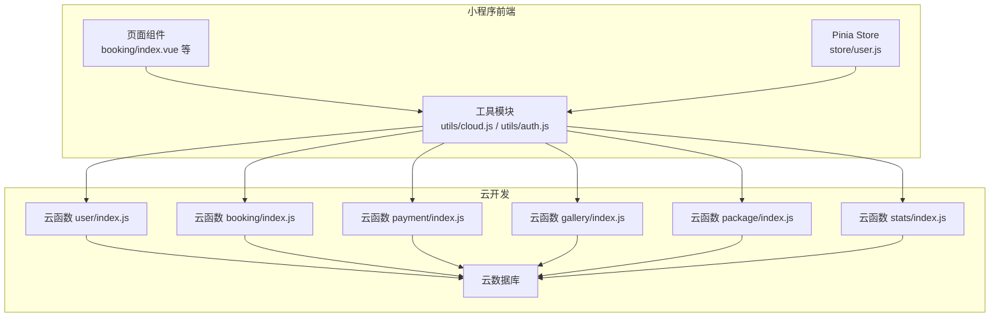
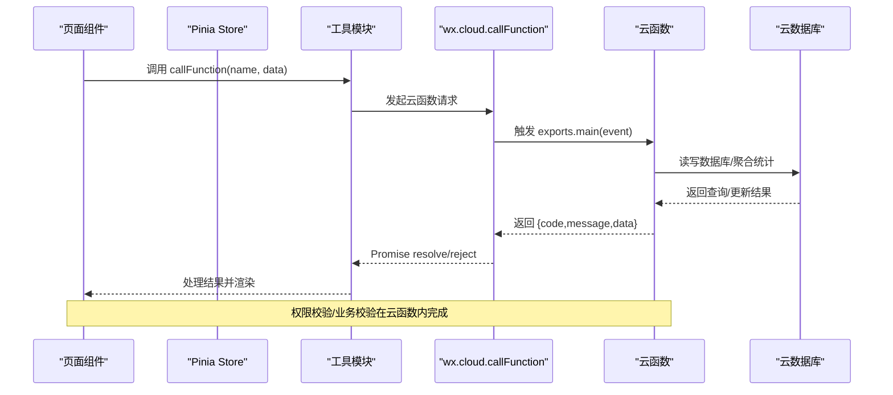
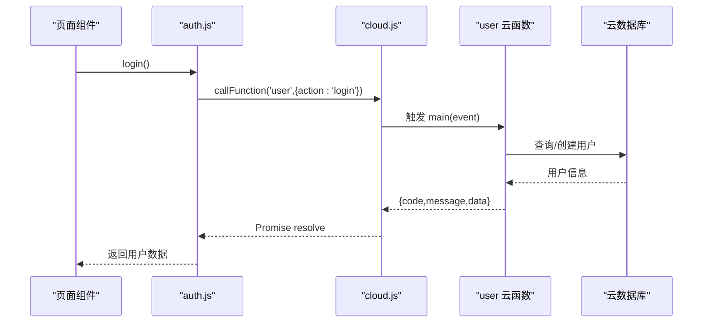
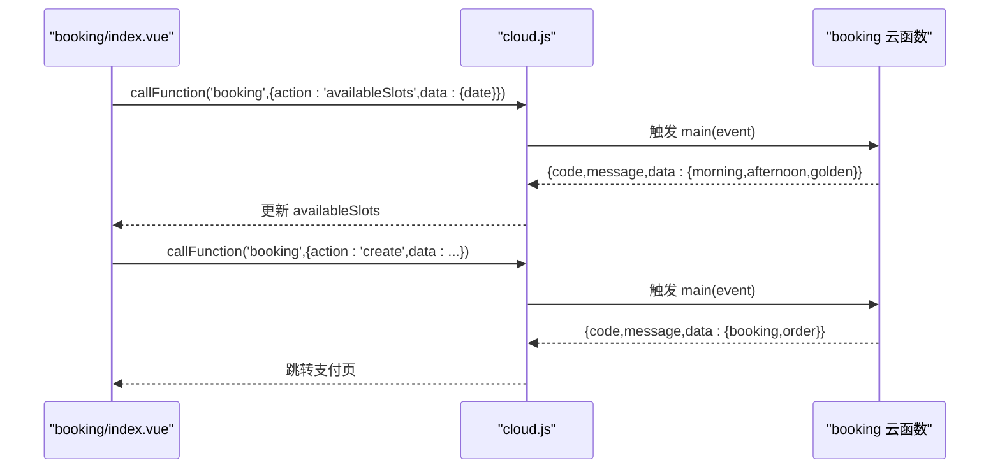
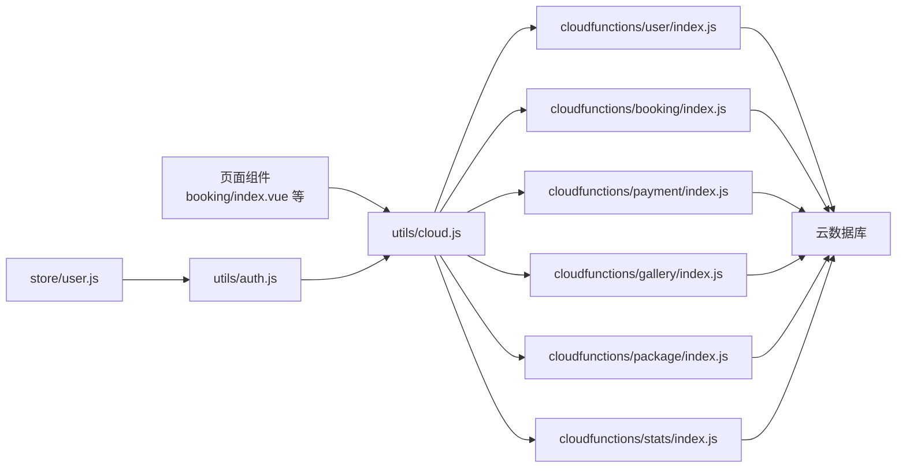

# 云函数调用

<cite>
**本文档引用的文件**
- [cloud.js](file://miniprogram/src/utils/cloud.js)
- [auth.js](file://miniprogram/src/utils/auth.js)
- [user.js](file://miniprogram/src/store/user.js)
- [constants.js](file://miniprogram/src/utils/constants.js)
- [booking/index.vue](file://miniprogram/src/pages/booking/index.vue)
- [dashboard/index.vue](file://miniprogram/src/pages-admin/dashboard/index.vue)
- [user/index.js](file://miniprogram/cloudfunctions/user/index.js)
- [booking/index.js](file://miniprogram/cloudfunctions/booking/index.js)
- [payment/index.js](file://miniprogram/cloudfunctions/payment/index.js)
- [gallery/index.js](file://miniprogram/cloudfunctions/gallery/index.js)
- [package/index.js](file://miniprogram/cloudfunctions/package/index.js)
- [stats/index.js](file://miniprogram/cloudfunctions/stats/index.js)
</cite>

## 目录
1. [简介](#简介)
2. [项目结构](#项目结构)
3. [核心组件](#核心组件)
4. [架构总览](#架构总览)
5. [详细组件分析](#详细组件分析)
6. [依赖关系分析](#依赖关系分析)
7. [性能与并发](#性能与并发)
8. [故障排查指南](#故障排查指南)
9. [结论](#结论)
10. [附录](#附录)

## 简介
本文件面向 lvpai 项目的云函数调用机制，围绕 callFunction 方法的使用方式、参数配置、返回值处理、异步与 Promise 封装、错误处理策略进行系统性说明；同时覆盖认证与权限验证、安全考虑、批量调用与并发控制、超时处理建议、以及云函数与数据库/存储的协同工作流程。文档以实际源码为依据，辅以可视化图示帮助开发者快速掌握调用规范与最佳实践。

## 项目结构
lvpai 采用“小程序前端 + 云开发云函数”的前后端分离架构：
- 前端通过 wx.cloud.callFunction 发起云函数调用，统一由 utils/cloud.js 封装 Promise 化处理。
- 云函数位于 miniprogram/cloudfunctions 目录下，按功能域划分（如 user、booking、payment、gallery、package、stats）。
- 前端页面通过 store/user.js 管理用户态，结合 utils/auth.js 进行登录与权限判断。

图表来源
- [cloud.js:6-26](file://miniprogram/src/utils/cloud.js#L6-L26)
- [user/index.js:7-31](file://miniprogram/cloudfunctions/user/index.js#L7-L31)
- [booking/index.js:67-93](file://miniprogram/cloudfunctions/booking/index.js#L67-L93)
- [payment/index.js:26-52](file://miniprogram/cloudfunctions/payment/index.js#L26-L52)
- [gallery/index.js:26-64](file://miniprogram/cloudfunctions/gallery/index.js#L26-L64)
- [package/index.js:26-58](file://miniprogram/cloudfunctions/package/index.js#L26-L58)
- [stats/index.js:52-68](file://miniprogram/cloudfunctions/stats/index.js#L52-L68)

章节来源
- [cloud.js:1-66](file://miniprogram/src/utils/cloud.js#L1-L66)
- [booking/index.vue:207-494](file://miniprogram/src/pages/booking/index.vue#L207-L494)
- [dashboard/index.vue:73-134](file://miniprogram/src/pages-admin/dashboard/index.vue#L73-L134)

## 核心组件
- callFunction 封装：统一 Promise 化 wx.cloud.callFunction，按返回结构区分成功/失败分支，便于前端统一处理。
- 权限与认证：auth.js 基于 callFunction 调用 user 云函数完成登录与用户信息获取；store/user.js 管理登录态与管理员判定。
- 云函数域：按业务拆分 user、booking、payment、gallery、package、stats 六大云函数，均遵循统一的事件入口与返回结构。

章节来源
- [cloud.js:6-26](file://miniprogram/src/utils/cloud.js#L6-L26)
- [auth.js:7-26](file://miniprogram/src/utils/auth.js#L7-L26)
- [user.js:5-47](file://miniprogram/src/store/user.js#L5-L47)

## 架构总览
云函数调用链路从页面组件发起，经工具层封装，最终到达对应云函数，云函数通过 wx-server-sdk 访问数据库与支付能力，返回统一结构的数据给前端。

图表来源
- [cloud.js:6-26](file://miniprogram/src/utils/cloud.js#L6-L26)
- [user/index.js:7-31](file://miniprogram/cloudfunctions/user/index.js#L7-L31)
- [booking/index.js:67-93](file://miniprogram/cloudfunctions/booking/index.js#L67-L93)
- [payment/index.js:26-52](file://miniprogram/cloudfunctions/payment/index.js#L26-L52)
- [gallery/index.js:26-64](file://miniprogram/cloudfunctions/gallery/index.js#L26-L64)
- [package/index.js:26-58](file://miniprogram/cloudfunctions/package/index.js#L26-L58)
- [stats/index.js:52-68](file://miniprogram/cloudfunctions/stats/index.js#L52-L68)

## 详细组件分析

### callFunction 方法详解
- 调用方式
  - 参数：name（云函数名）、data（请求体对象）
  - 返回：Promise 对象，resolve 返回完整响应；reject 返回错误对象
- 结果处理
  - 若 res.result 存在且 code===0：视为成功，resolve(res.result)
  - 若 res.result 存在但 code!=0：视为业务错误，reject(res.result)
  - 若 res.result 不存在：直接 resolve(res)
  - fail 分支：reject(err)，并打印错误日志
- 适用场景
  - 登录、获取用户信息、套餐查询、预约创建、支付下单、客片管理、套餐管理、统计查询等

章节来源
- [cloud.js:6-26](file://miniprogram/src/utils/cloud.js#L6-L26)

### 异步调用、Promise 封装与错误处理
- 异步模式：所有云函数调用均为异步，前端应使用 await 或 .then/.catch 统一处理
- Promise 封装：封装层负责将回调式调用转换为 Promise，简化前端逻辑
- 错误处理策略
  - 成功路径：校验 res.code === 0，再使用 res.data
  - 业务错误：res.code !== 0 时，使用 res.message 提示用户
  - 网络/SDK 错误：fail 分支统一 reject，前端捕获后提示或重试
- 最佳实践
  - 在页面加载/交互开始处显示加载态，结束时隐藏
  - 对手机号、联系人等输入进行前端校验，减少无效请求
  - 对关键操作（如支付）增加二次确认与幂等保护

章节来源
- [cloud.js:6-26](file://miniprogram/src/utils/cloud.js#L6-L26)
- [booking/index.vue:422-470](file://miniprogram/src/pages/booking/index.vue#L422-L470)

### 认证机制与权限验证
- 登录流程
  - 前端调用 auth.login()，内部通过 callFunction('user', { action: 'login' }) 完成
  - 云函数 user.index.js 根据 wxContext.OPENID 查询/创建用户记录，返回用户数据
- 用户信息获取
  - auth.getUserProfile() 调用 user 云函数的 getProfile 动作，返回当前用户信息
- 权限判定
  - store/user.js 提供 isAdminUser/computed，基于用户角色判断
  - 各云函数在关键操作（如设置管理员、删除客片、上下架套餐、统计）前进行管理员校验
- 安全考虑
  - 云函数内严格校验 openid 与业务数据，避免越权
  - 敏感操作（支付、退款、状态变更）仅允许管理员执行
  - 前端不直接暴露敏感参数，统一通过云函数处理

图表来源
- [auth.js:7-15](file://miniprogram/src/utils/auth.js#L7-L15)
- [cloud.js:6-26](file://miniprogram/src/utils/cloud.js#L6-L26)
- [user/index.js:7-67](file://miniprogram/cloudfunctions/user/index.js#L7-L67)

章节来源
- [auth.js:7-26](file://miniprogram/src/utils/auth.js#L7-L26)
- [user.js:5-47](file://miniprogram/src/store/user.js#L5-L47)
- [user/index.js:7-67](file://miniprogram/cloudfunctions/user/index.js#L7-L67)

### 云函数与数据库、存储的协同
- 数据库访问
  - 云函数通过 cloud.database() 获取数据库实例，使用 collection().where()/get()/add()/update()/remove()/count()/aggregate() 等进行 CRUD 与统计
  - booking 云函数使用事务保证“创建预约+创建订单”的一致性
  - stats 云函数使用聚合查询计算收入与趋势
- 存储访问
  - 前端工具层提供 uploadFile/getTempFileURL/deleteFile 等封装，便于图片上传与链接获取
- 协同机制
  - 前端通过 callFunction 与云函数交互，云函数直接读写数据库，避免前端直连数据库带来的安全风险

章节来源
- [booking/index.js:150-206](file://miniprogram/cloudfunctions/booking/index.js#L150-L206)
- [stats/index.js:73-162](file://miniprogram/cloudfunctions/stats/index.js#L73-L162)
- [cloud.js:28-60](file://miniprogram/src/utils/cloud.js#L28-L60)

### 关键云函数域与调用示例

#### 预约域（booking）
- 主要动作
  - create：创建预约并联动创建订单，支持事务与并发保护
  - list/detail/cancel/updateStatus：列表查询、详情获取、取消与状态更新
  - availableSlots：查询指定日期的可用时段
- 调用示例（页面）
  - 选择日期后调用 availableSlots 获取时段
  - 提交表单时调用 create 创建预约并跳转支付页

图表来源
- [booking/index.vue:342-356](file://miniprogram/src/pages/booking/index.vue#L342-L356)
- [booking/index.vue:422-470](file://miniprogram/src/pages/booking/index.vue#L422-L470)
- [booking/index.js:67-93](file://miniprogram/cloudfunctions/booking/index.js#L67-L93)

章节来源
- [booking/index.vue:342-356](file://miniprogram/src/pages/booking/index.vue#L342-L356)
- [booking/index.vue:422-470](file://miniprogram/src/pages/booking/index.vue#L422-L470)
- [booking/index.js:67-93](file://miniprogram/cloudfunctions/booking/index.js#L67-L93)

#### 支付域（payment）
- 主要动作
  - createOrder：创建支付订单（模拟支付参数），真实接入需配置商户号
  - paySuccess：前端确认支付成功后更新订单与预约状态
  - callback/refund：支付回调与退款处理（模拟/真实两种实现）
  - getOrder/myOrders：订单详情与我的订单列表
- 调用示例（页面）
  - 支付页调用 createOrder 获取支付参数
  - 支付完成后调用 paySuccess 更新状态

章节来源
- [payment/index.js:26-52](file://miniprogram/cloudfunctions/payment/index.js#L26-L52)
- [payment/index.js:65-166](file://miniprogram/cloudfunctions/payment/index.js#L65-L166)
- [payment/index.js:172-239](file://miniprogram/cloudfunctions/payment/index.js#L172-L239)
- [payment/index.js:253-327](file://miniprogram/cloudfunctions/payment/index.js#L253-L327)
- [payment/index.js:338-450](file://miniprogram/cloudfunctions/payment/index.js#L338-L450)
- [payment/index.js:455-531](file://miniprogram/cloudfunctions/payment/index.js#L455-L531)

#### 客片域（gallery）
- 主要动作
  - list/detail：列表与详情（用户端仅返回已发布）
  - create/update/delete/favorite/myFavorites/checkFavorite：管理员增删改与收藏管理
- 调用示例（页面）
  - 客片列表页调用 list
  - 详情页调用 detail/favorite/checkFavorite

章节来源
- [gallery/index.js:26-64](file://miniprogram/cloudfunctions/gallery/index.js#L26-L64)
- [gallery/index.js:67-103](file://miniprogram/cloudfunctions/gallery/index.js#L67-L103)
- [gallery/index.js:105-124](file://miniprogram/cloudfunctions/gallery/index.js#L105-L124)
- [gallery/index.js:127-225](file://miniprogram/cloudfunctions/gallery/index.js#L127-L225)
- [gallery/index.js:227-283](file://miniprogram/cloudfunctions/gallery/index.js#L227-L283)
- [gallery/index.js:285-339](file://miniprogram/cloudfunctions/gallery/index.js#L285-L339)
- [gallery/index.js:341-359](file://miniprogram/cloudfunctions/gallery/index.js#L341-L359)

#### 套餐域（package）
- 主要动作
  - list/detail：列表与详情（用户端仅返回上架）
  - create/update/delete/updateStatus：管理员增删改与上下架
- 调用示例（页面）
  - 预约页调用 list 获取套餐列表
  - 详情页调用 detail 获取套餐详情

章节来源
- [package/index.js:26-58](file://miniprogram/cloudfunctions/package/index.js#L26-L58)
- [package/index.js:61-86](file://miniprogram/cloudfunctions/package/index.js#L61-L86)
- [package/index.js:88-107](file://miniprogram/cloudfunctions/package/index.js#L88-L107)
- [package/index.js:109-134](file://miniprogram/cloudfunctions/package/index.js#L109-L134)
- [package/index.js:136-164](file://miniprogram/cloudfunctions/package/index.js#L136-L164)
- [package/index.js:166-187](file://miniprogram/cloudfunctions/package/index.js#L166-L187)
- [package/index.js:189-221](file://miniprogram/cloudfunctions/package/index.js#L189-L221)

#### 统计域（stats）
- 主要动作
  - overview：管理员获取数据概览（今日预约、待处理订单、本月收入、客片/预约/用户总数、状态分布与趋势）
- 调用示例（页面）
  - 管理后台首页调用 overview 获取统计数据

章节来源
- [stats/index.js:52-68](file://miniprogram/cloudfunctions/stats/index.js#L52-L68)
- [stats/index.js:73-162](file://miniprogram/cloudfunctions/stats/index.js#L73-L162)
- [stats/index.js:167-228](file://miniprogram/cloudfunctions/stats/index.js#L167-L228)
- [dashboard/index.vue:106-122](file://miniprogram/src/pages-admin/dashboard/index.vue#L106-L122)

## 依赖关系分析
- 前端依赖
  - 页面组件依赖 utils/cloud.js 发起云函数调用
  - store/user.js 依赖 utils/auth.js 与 callFunction 完成登录与用户态管理
- 云函数依赖
  - 各云函数依赖 wx-server-sdk 初始化环境与数据库
  - 云函数之间通过数据库协作（如 booking 与 payment 的订单联动）

图表来源
- [booking/index.vue:207-494](file://miniprogram/src/pages/booking/index.vue#L207-L494)
- [dashboard/index.vue:73-134](file://miniprogram/src/pages-admin/dashboard/index.vue#L73-L134)
- [auth.js:4-26](file://miniprogram/src/utils/auth.js#L4-L26)
- [user.js:1-48](file://miniprogram/src/store/user.js#L1-L48)
- [cloud.js:1-66](file://miniprogram/src/utils/cloud.js#L1-L66)

章节来源
- [booking/index.vue:207-494](file://miniprogram/src/pages/booking/index.vue#L207-L494)
- [dashboard/index.vue:73-134](file://miniprogram/src/pages-admin/dashboard/index.vue#L73-L134)
- [auth.js:4-26](file://miniprogram/src/utils/auth.js#L4-L26)
- [user.js:1-48](file://miniprogram/src/store/user.js#L1-L48)
- [cloud.js:1-66](file://miniprogram/src/utils/cloud.js#L1-L66)

## 性能与并发
- 并发控制
  - booking.create 中使用事务与二次检查避免并发导致的超卖
  - 建议前端在短时间内避免重复提交相同请求，可通过按钮禁用与加载态控制
- 超时处理
  - 前端可在调用层增加超时包装（Promise.race），对长时间无响应的请求进行中断与提示
- 批量调用
  - 对多个独立云函数调用，可使用 Promise.all 并行执行，但需注意数据库事务与幂等性
- 缓存与预取
  - 前端可缓存基础数据（如套餐列表、时段可用性），减少重复请求
- 数据库优化
  - 为高频查询字段建立索引（如 bookings.date、orders.payStatus 等）
  - 聚合统计使用聚合管道，避免多次查询

章节来源
- [booking/index.js:150-206](file://miniprogram/cloudfunctions/booking/index.js#L150-L206)
- [booking/index.vue:342-356](file://miniprogram/src/pages/booking/index.vue#L342-L356)

## 故障排查指南
- 常见问题定位
  - 云函数返回 code !== 0：查看 res.message，确认业务参数与权限
  - 云函数 fail：检查网络、环境变量、权限配置
  - 前端 Promise 未处理：确保每个调用都有 try/catch 或 .catch
- 调试技巧
  - 在 utils/cloud.js 中打印调用名称与入参，便于定位
  - 在云函数内对关键路径添加日志，记录 event 与上下文
  - 使用小程序开发者工具的云函数调试功能，查看实时日志
- 安全加固
  - 严禁从前端传入敏感参数，统一通过云函数校验
  - 对管理员操作增加二次确认与审计日志

章节来源
- [cloud.js:6-26](file://miniprogram/src/utils/cloud.js#L6-L26)
- [user/index.js:12-30](file://miniprogram/cloudfunctions/user/index.js#L12-L30)

## 结论
lvpai 的云函数调用体系以 utils/cloud.js 为核心，统一了异步调用、Promise 封装与错误处理；配合 auth.js 与 store/user.js 实现认证与权限管理；六大云函数域覆盖核心业务闭环。通过事务、权限校验与聚合统计等手段，系统在功能完整性与安全性方面具备良好基础。建议在生产环境中进一步完善超时控制、批量调用与缓存策略，并持续优化数据库索引与查询路径。

## 附录

### 调用规范速查
- 调用方式：await callFunction(name, { action, data })
- 成功条件：res.code === 0
- 失败处理：根据 res.message 提示用户或引导重试
- 权限要求：管理员专属操作需先校验角色
- 安全要求：不直接暴露敏感参数，统一走云函数

章节来源
- [cloud.js:6-26](file://miniprogram/src/utils/cloud.js#L6-L26)
- [booking/index.vue:422-470](file://miniprogram/src/pages/booking/index.vue#L422-L470)
- [dashboard/index.vue:106-122](file://miniprogram/src/pages-admin/dashboard/index.vue#L106-L122)