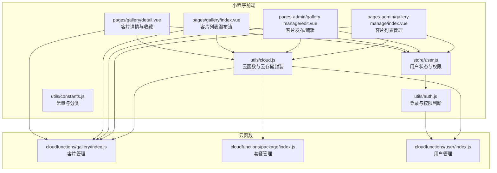
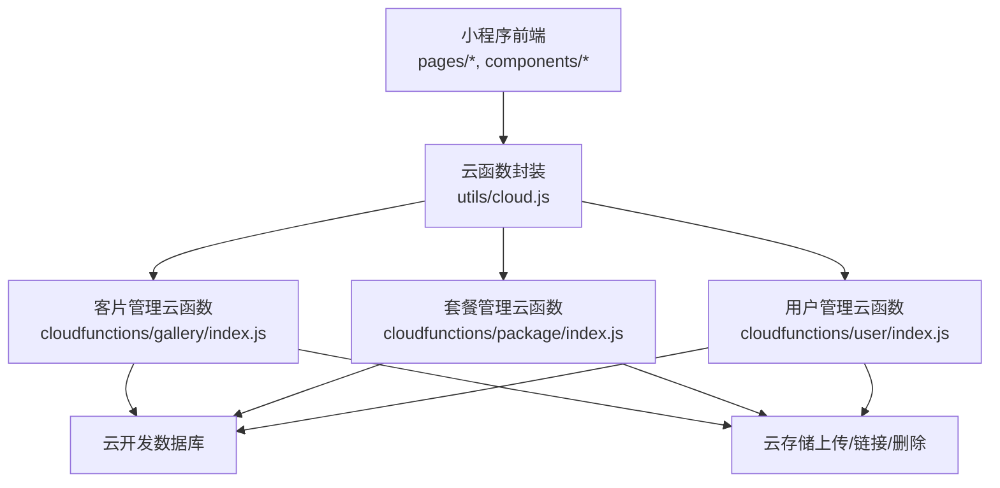
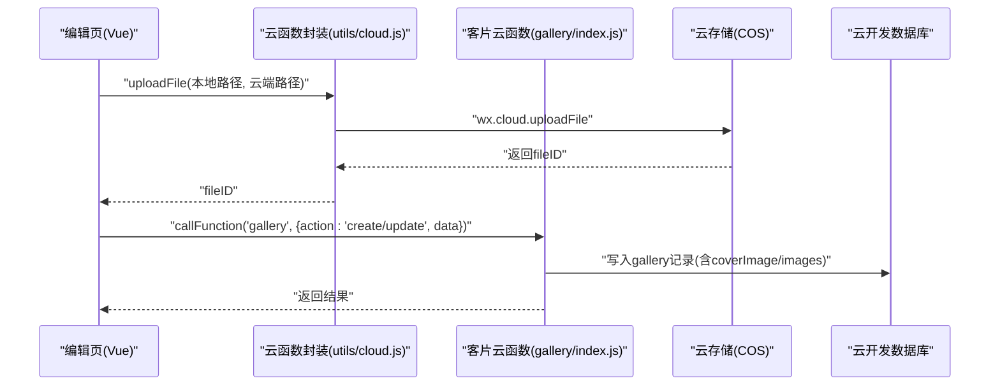
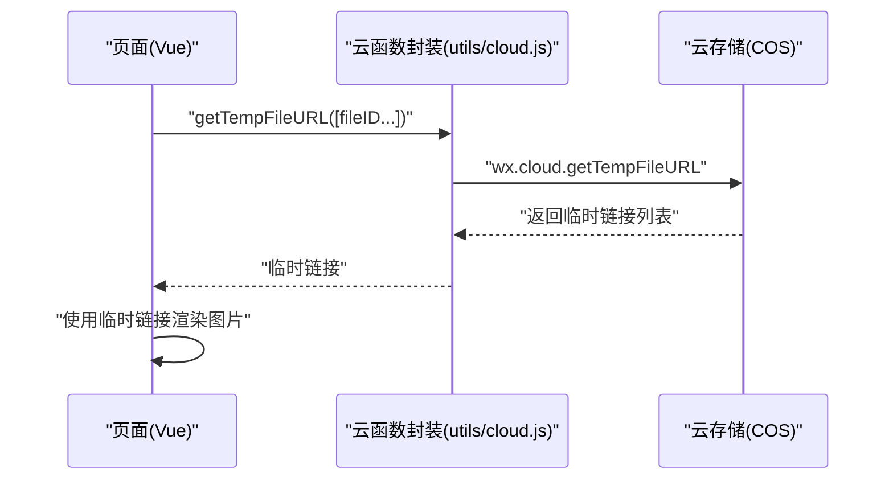
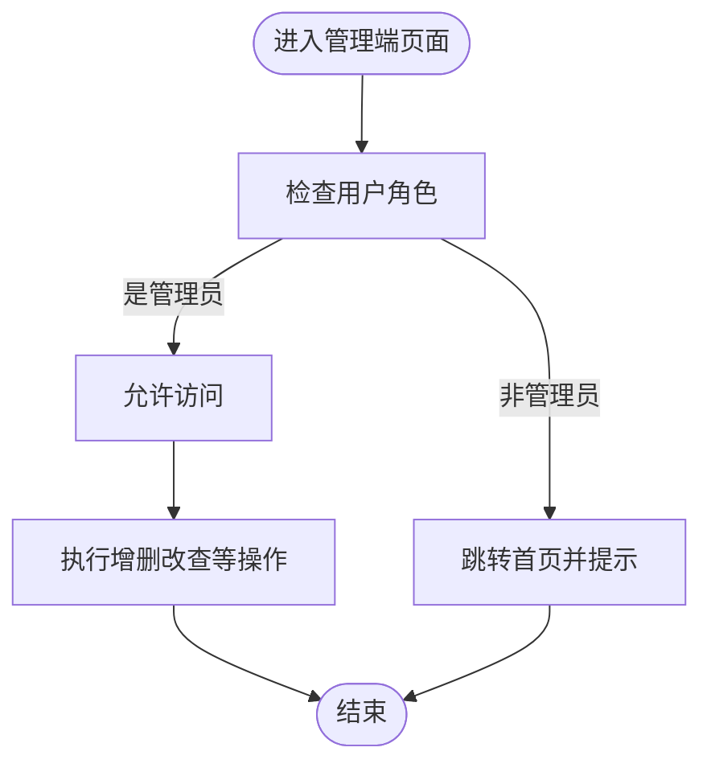
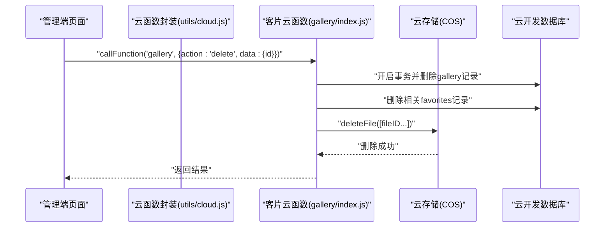
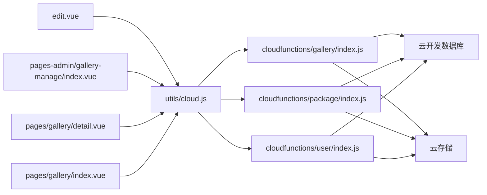

# 云存储操作

<cite>
**本文引用的文件**
- [miniprogram/src/utils/cloud.js](file://miniprogram/src/utils/cloud.js)
- [miniprogram/cloudfunctions/gallery/index.js](file://miniprogram/cloudfunctions/gallery/index.js)
- [miniprogram/cloudfunctions/package/index.js](file://miniprogram/cloudfunctions/package/index.js)
- [miniprogram/cloudfunctions/user/index.js](file://miniprogram/cloudfunctions/user/index.js)
- [miniprogram/src/pages-admin/gallery-manage/index.vue](file://miniprogram/src/pages-admin/gallery-manage/index.vue)
- [miniprogram/src/pages-admin/gallery-manage/edit.vue](file://miniprogram/src/pages-admin/gallery-manage/edit.vue)
- [miniprogram/src/pages/gallery/index.vue](file://miniprogram/src/pages/gallery/index.vue)
- [miniprogram/src/pages/gallery/detail.vue](file://miniprogram/src/pages/gallery/detail.vue)
- [miniprogram/src/store/user.js](file://miniprogram/src/store/user.js)
- [miniprogram/src/utils/auth.js](file://miniprogram/src/utils/auth.js)
- [miniprogram/src/utils/constants.js](file://miniprogram/src/utils/constants.js)
</cite>

## 目录
1. [简介](#简介)
2. [项目结构](#项目结构)
3. [核心组件](#核心组件)
4. [架构总览](#架构总览)
5. [详细组件分析](#详细组件分析)
6. [依赖关系分析](#依赖关系分析)
7. [性能与成本优化](#性能与成本优化)
8. [故障排查指南](#故障排查指南)
9. [结论](#结论)
10. [附录](#附录)

## 简介
本文件面向 lvpai 项目的云存储操作，系统性梳理文件上传、下载与管理能力，覆盖以下主题：
- 文件上传流程与路径管理策略
- 临时链接获取与访问控制
- 权限控制与安全策略
- 文件删除与批量操作
- 类型验证、大小限制与格式转换建议
- 存储空间监控、成本控制与性能优化
- 开发者最佳实践

## 项目结构
lvpai 的云存储相关代码主要分布在三处：
- 小程序前端工具层：封装调用云函数与云存储 API 的通用方法
- 云函数层：提供业务操作入口，如客片管理、套餐管理、用户管理等
- 前端页面与组件：负责表单、瀑布流、预览等交互，并通过云函数与云存储协作

**图表来源**
- [miniprogram/src/utils/cloud.js:1-66](file://miniprogram/src/utils/cloud.js#L1-L66)
- [miniprogram/cloudfunctions/gallery/index.js:1-64](file://miniprogram/cloudfunctions/gallery/index.js#L1-L64)
- [miniprogram/cloudfunctions/package/index.js:1-58](file://miniprogram/cloudfunctions/package/index.js#L1-L58)
- [miniprogram/cloudfunctions/user/index.js:1-31](file://miniprogram/cloudfunctions/user/index.js#L1-L31)
- [miniprogram/src/pages-admin/gallery-manage/index.vue:92-295](file://miniprogram/src/pages-admin/gallery-manage/index.vue#L92-L295)
- [miniprogram/src/pages-admin/gallery-manage/edit.vue:166-444](file://miniprogram/src/pages-admin/gallery-manage/edit.vue#L166-L444)
- [miniprogram/src/pages/gallery/index.vue:100-283](file://miniprogram/src/pages/gallery/index.vue#L100-L283)
- [miniprogram/src/pages/gallery/detail.vue:90-234](file://miniprogram/src/pages/gallery/detail.vue#L90-L234)
- [miniprogram/src/store/user.js:1-48](file://miniprogram/src/store/user.js#L1-L48)
- [miniprogram/src/utils/auth.js:1-47](file://miniprogram/src/utils/auth.js#L1-L47)
- [miniprogram/src/utils/constants.js:1-73](file://miniprogram/src/utils/constants.js#L1-L73)

**章节来源**
- [miniprogram/src/utils/cloud.js:1-66](file://miniprogram/src/utils/cloud.js#L1-L66)
- [miniprogram/cloudfunctions/gallery/index.js:1-64](file://miniprogram/cloudfunctions/gallery/index.js#L1-L64)
- [miniprogram/src/pages-admin/gallery-manage/index.vue:92-295](file://miniprogram/src/pages-admin/gallery-manage/index.vue#L92-L295)
- [miniprogram/src/pages-admin/gallery-manage/edit.vue:166-444](file://miniprogram/src/pages-admin/gallery-manage/edit.vue#L166-L444)
- [miniprogram/src/pages/gallery/index.vue:100-283](file://miniprogram/src/pages/gallery/index.vue#L100-L283)
- [miniprogram/src/pages/gallery/detail.vue:90-234](file://miniprogram/src/pages/gallery/detail.vue#L90-L234)
- [miniprogram/src/store/user.js:1-48](file://miniprogram/src/store/user.js#L1-L48)
- [miniprogram/src/utils/auth.js:1-47](file://miniprogram/src/utils/auth.js#L1-L47)
- [miniprogram/src/utils/constants.js:1-73](file://miniprogram/src/utils/constants.js#L1-L73)

## 核心组件
- 云函数封装（小程序端）：提供统一的云函数调用、文件上传、临时链接获取、文件删除与数据库引用
- 客片管理云函数：提供列表、详情、创建、更新、删除、收藏、我的收藏、检查收藏等操作，并内置管理员权限校验
- 套餐管理云函数：提供套餐列表、详情、创建、更新、删除、上下架等操作，并内置管理员权限校验
- 用户管理云函数：提供登录、获取资料、更新手机号、更新资料、设置管理员角色等
- 管理端页面：客片列表与发布/编辑页面，支持封面图与客片图的上传、状态切换、删除
- 展示端页面：客片瀑布流与详情页，支持收藏、复制文案、图片预览

**章节来源**
- [miniprogram/src/utils/cloud.js:6-66](file://miniprogram/src/utils/cloud.js#L6-L66)
- [miniprogram/cloudfunctions/gallery/index.js:7-64](file://miniprogram/cloudfunctions/gallery/index.js#L7-L64)
- [miniprogram/cloudfunctions/package/index.js:7-58](file://miniprogram/cloudfunctions/package/index.js#L7-L58)
- [miniprogram/cloudfunctions/user/index.js:7-31](file://miniprogram/cloudfunctions/user/index.js#L7-L31)
- [miniprogram/src/pages-admin/gallery-manage/index.vue:136-295](file://miniprogram/src/pages-admin/gallery-manage/index.vue#L136-L295)
- [miniprogram/src/pages-admin/gallery-manage/edit.vue:246-391](file://miniprogram/src/pages-admin/gallery-manage/edit.vue#L246-L391)
- [miniprogram/src/pages/gallery/index.vue:144-283](file://miniprogram/src/pages/gallery/index.vue#L144-L283)
- [miniprogram/src/pages/gallery/detail.vue:119-234](file://miniprogram/src/pages/gallery/detail.vue#L119-L234)

## 架构总览
整体采用“小程序前端 + 云函数 + 云开发数据库/云存储”的三层架构。前端通过云函数封装调用云函数，云函数对数据库进行读写与事务处理，同时可调用云存储进行文件上传与链接生成。

**图表来源**
- [miniprogram/src/utils/cloud.js:6-66](file://miniprogram/src/utils/cloud.js#L6-L66)
- [miniprogram/cloudfunctions/gallery/index.js:1-64](file://miniprogram/cloudfunctions/gallery/index.js#L1-L64)
- [miniprogram/cloudfunctions/package/index.js:1-58](file://miniprogram/cloudfunctions/package/index.js#L1-L58)
- [miniprogram/cloudfunctions/user/index.js:1-31](file://miniprogram/cloudfunctions/user/index.js#L1-L31)

## 详细组件分析

### 文件上传流程与路径管理
- 封装方法：小程序端通过云函数封装提供的上传接口，传入本地临时文件路径与云端目标路径，返回 fileID
- 路径策略：上传时按“gallery/前缀+时间戳+序号+扩展名”规则生成唯一云端路径，便于后续管理与检索
- 批量上传：在编辑页中，支持多张图片并发上传，最终合并为数组写入数据库
- 数据库落库：将返回的 fileID 写入 gallery 记录的 coverImage 与 images 字段

**图表来源**
- [miniprogram/src/pages-admin/gallery-manage/edit.vue:246-391](file://miniprogram/src/pages-admin/gallery-manage/edit.vue#L246-L391)
- [miniprogram/src/utils/cloud.js:28-38](file://miniprogram/src/utils/cloud.js#L28-L38)
- [miniprogram/cloudfunctions/gallery/index.js:127-182](file://miniprogram/cloudfunctions/gallery/index.js#L127-L182)

**章节来源**
- [miniprogram/src/pages-admin/gallery-manage/edit.vue:246-391](file://miniprogram/src/pages-admin/gallery-manage/edit.vue#L246-L391)
- [miniprogram/src/utils/cloud.js:28-38](file://miniprogram/src/utils/cloud.js#L28-L38)
- [miniprogram/cloudfunctions/gallery/index.js:127-182](file://miniprogram/cloudfunctions/gallery/index.js#L127-L182)

### 临时链接获取与访问控制
- 临时链接：小程序端通过封装的临时链接接口批量获取文件的临时访问链接
- 访问控制：前端页面在展示图片时，优先使用临时链接；对于管理端的封面图与客片图，同样通过该接口生成可访问链接
- 安全策略：临时链接有效期由云开发控制，避免长期暴露真实存储地址

**图表来源**
- [miniprogram/src/utils/cloud.js:40-49](file://miniprogram/src/utils/cloud.js#L40-L49)
- [miniprogram/src/pages-admin/gallery-manage/edit.vue:256-261](file://miniprogram/src/pages-admin/gallery-manage/edit.vue#L256-L261)
- [miniprogram/src/pages-admin/gallery-manage/index.vue:148-182](file://miniprogram/src/pages-admin/gallery-manage/index.vue#L148-L182)

**章节来源**
- [miniprogram/src/utils/cloud.js:40-49](file://miniprogram/src/utils/cloud.js#L40-L49)
- [miniprogram/src/pages-admin/gallery-manage/edit.vue:256-261](file://miniprogram/src/pages-admin/gallery-manage/edit.vue#L256-L261)
- [miniprogram/src/pages-admin/gallery-manage/index.vue:148-182](file://miniprogram/src/pages-admin/gallery-manage/index.vue#L148-L182)

### 权限控制与安全策略
- 管理员校验：客片与套餐云函数均提供管理员权限校验，仅 admin/superAdmin 可执行创建、更新、删除、上下架等敏感操作
- 超级管理员：用户云函数支持设置角色，仅 superAdmin 可变更他人角色
- 前端权限：管理端页面在进入时检查用户角色，非管理员跳转首页并提示无权访问
- 安全建议：结合云开发环境变量与云函数权限模型，确保敏感操作仅在服务端执行

**图表来源**
- [miniprogram/cloudfunctions/gallery/index.js:7-24](file://miniprogram/cloudfunctions/gallery/index.js#L7-L24)
- [miniprogram/cloudfunctions/package/index.js:7-24](file://miniprogram/cloudfunctions/package/index.js#L7-L24)
- [miniprogram/cloudfunctions/user/index.js:156-205](file://miniprogram/cloudfunctions/user/index.js#L156-L205)
- [miniprogram/src/pages-admin/gallery-manage/index.vue:108-121](file://miniprogram/src/pages-admin/gallery-manage/index.vue#L108-L121)
- [miniprogram/src/store/user.js:5-47](file://miniprogram/src/store/user.js#L5-L47)
- [miniprogram/src/utils/auth.js:28-36](file://miniprogram/src/utils/auth.js#L28-L36)

**章节来源**
- [miniprogram/cloudfunctions/gallery/index.js:7-24](file://miniprogram/cloudfunctions/gallery/index.js#L7-L24)
- [miniprogram/cloudfunctions/package/index.js:7-24](file://miniprogram/cloudfunctions/package/index.js#L7-L24)
- [miniprogram/cloudfunctions/user/index.js:156-205](file://miniprogram/cloudfunctions/user/index.js#L156-L205)
- [miniprogram/src/pages-admin/gallery-manage/index.vue:108-121](file://miniprogram/src/pages-admin/gallery-manage/index.vue#L108-L121)
- [miniprogram/src/store/user.js:5-47](file://miniprogram/src/store/user.js#L5-L47)
- [miniprogram/src/utils/auth.js:28-36](file://miniprogram/src/utils/auth.js#L28-L36)

### 文件删除与批量操作
- 删除接口：小程序端提供删除文件接口，传入 fileID 数组即可批量删除
- 业务删除：客片删除云函数在事务中先删除客片记录，再删除相关收藏记录，保证数据一致性
- 前端操作：管理端提供删除确认弹窗，删除成功后从列表移除

**图表来源**
- [miniprogram/src/utils/cloud.js:51-60](file://miniprogram/src/utils/cloud.js#L51-L60)
- [miniprogram/cloudfunctions/gallery/index.js:184-225](file://miniprogram/cloudfunctions/gallery/index.js#L184-L225)
- [miniprogram/src/pages-admin/gallery-manage/index.vue:237-280](file://miniprogram/src/pages-admin/gallery-manage/index.vue#L237-L280)

**章节来源**
- [miniprogram/src/utils/cloud.js:51-60](file://miniprogram/src/utils/cloud.js#L51-L60)
- [miniprogram/cloudfunctions/gallery/index.js:184-225](file://miniprogram/cloudfunctions/gallery/index.js#L184-L225)
- [miniprogram/src/pages-admin/gallery-manage/index.vue:237-280](file://miniprogram/src/pages-admin/gallery-manage/index.vue#L237-L280)

### 文件类型验证、大小限制与格式转换
- 上传尺寸：前端在选择图片时指定压缩模式，减少体积
- 类型与数量：封面图与客片图分别限制为 1 张与最多 9 张
- 格式转换：云存储侧未见显式格式转换逻辑，建议在上传前进行格式与尺寸校验，或在云函数中增加校验与转换步骤（例如缩略图生成）

**章节来源**
- [miniprogram/src/pages-admin/gallery-manage/edit.vue:247-299](file://miniprogram/src/pages-admin/gallery-manage/edit.vue#L247-L299)
- [miniprogram/src/pages-admin/gallery-manage/edit.vue:320-338](file://miniprogram/src/pages-admin/gallery-manage/edit.vue#L320-L338)

### 存储空间监控、成本控制与性能优化
- 监控与成本：结合云开发控制台查看存储用量与请求次数，按需调整 CDN 缓存与图片压缩策略
- 性能优化：
  - 使用临时链接缓存与懒加载
  - 瀑布流分页加载，避免一次性渲染过多图片
  - 并发上传时合理控制并发度，避免超时
  - 对大图进行压缩与裁剪，降低带宽与渲染压力

**章节来源**
- [miniprogram/src/pages/gallery/index.vue:144-189](file://miniprogram/src/pages/gallery/index.vue#L144-L189)
- [miniprogram/src/pages-admin/gallery-manage/edit.vue:273-299](file://miniprogram/src/pages-admin/gallery-manage/edit.vue#L273-L299)

## 依赖关系分析
- 前端依赖：页面组件依赖云函数封装与用户状态管理；云函数依赖云开发 SDK 与数据库命令
- 权限耦合：管理端页面与云函数之间存在强耦合的管理员校验逻辑
- 数据耦合：gallery 与 favorites 之间通过 galleryId 关联，删除时需事务保证一致性

**图表来源**
- [miniprogram/src/pages-admin/gallery-manage/edit.vue:166-444](file://miniprogram/src/pages-admin/gallery-manage/edit.vue#L166-L444)
- [miniprogram/src/pages-admin/gallery-manage/index.vue:92-295](file://miniprogram/src/pages-admin/gallery-manage/index.vue#L92-L295)
- [miniprogram/src/pages/gallery/detail.vue:90-234](file://miniprogram/src/pages/gallery/detail.vue#L90-L234)
- [miniprogram/src/pages/gallery/index.vue:100-283](file://miniprogram/src/pages/gallery/index.vue#L100-L283)
- [miniprogram/src/utils/cloud.js:6-66](file://miniprogram/src/utils/cloud.js#L6-L66)
- [miniprogram/cloudfunctions/gallery/index.js:1-64](file://miniprogram/cloudfunctions/gallery/index.js#L1-L64)
- [miniprogram/cloudfunctions/package/index.js:1-58](file://miniprogram/cloudfunctions/package/index.js#L1-L58)
- [miniprogram/cloudfunctions/user/index.js:1-31](file://miniprogram/cloudfunctions/user/index.js#L1-L31)

**章节来源**
- [miniprogram/src/pages-admin/gallery-manage/edit.vue:166-444](file://miniprogram/src/pages-admin/gallery-manage/edit.vue#L166-L444)
- [miniprogram/src/pages-admin/gallery-manage/index.vue:92-295](file://miniprogram/src/pages-admin/gallery-manage/index.vue#L92-L295)
- [miniprogram/src/pages/gallery/detail.vue:90-234](file://miniprogram/src/pages/gallery/detail.vue#L90-L234)
- [miniprogram/src/pages/gallery/index.vue:100-283](file://miniprogram/src/pages/gallery/index.vue#L100-L283)
- [miniprogram/src/utils/cloud.js:6-66](file://miniprogram/src/utils/cloud.js#L6-L66)
- [miniprogram/cloudfunctions/gallery/index.js:1-64](file://miniprogram/cloudfunctions/gallery/index.js#L1-L64)
- [miniprogram/cloudfunctions/package/index.js:1-58](file://miniprogram/cloudfunctions/package/index.js#L1-L58)
- [miniprogram/cloudfunctions/user/index.js:1-31](file://miniprogram/cloudfunctions/user/index.js#L1-L31)

## 性能与成本优化
- 图片优化：上传前压缩、按需裁剪；展示时使用合适尺寸与格式
- 请求优化：分页加载、触底/下拉刷新；对收藏状态进行本地缓存
- 成本控制：合理设置 CDN 缓存与过期策略，避免频繁回源

[本节为通用建议，无需特定文件引用]

## 故障排查指南
- 上传失败：检查本地文件路径与云端路径拼接是否正确，确认网络状态与权限
- 临时链接失效：确认 fileID 正确且未被删除，检查云存储访问策略
- 删除异常：确认 fileID 数组有效，关注事务回滚日志
- 权限错误：确认用户角色与管理员校验逻辑，检查前端权限拦截

**章节来源**
- [miniprogram/src/utils/cloud.js:28-60](file://miniprogram/src/utils/cloud.js#L28-L60)
- [miniprogram/cloudfunctions/gallery/index.js:184-225](file://miniprogram/cloudfunctions/gallery/index.js#L184-L225)
- [miniprogram/src/pages-admin/gallery-manage/edit.vue:256-267](file://miniprogram/src/pages-admin/gallery-manage/edit.vue#L256-L267)

## 结论
lvpai 的云存储体系以云函数封装为核心，结合小程序前端与云开发数据库/云存储，实现了从文件上传、链接生成、权限控制到删除与批量操作的完整闭环。通过严格的管理员权限校验与事务保障，确保业务数据一致性与安全性。建议在现有基础上进一步完善文件类型与尺寸校验、格式转换与缓存策略，持续优化性能与成本。

[本节为总结，无需特定文件引用]

## 附录
- 常量与分类：提供客片分类、套餐分类等常量，便于前端展示与筛选

**章节来源**
- [miniprogram/src/utils/constants.js:13-27](file://miniprogram/src/utils/constants.js#L13-L27)