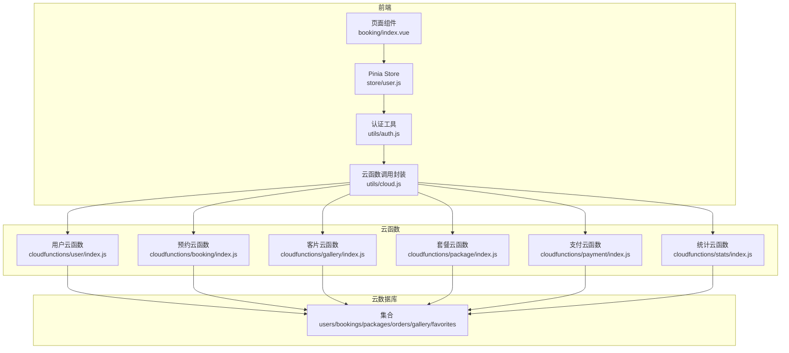
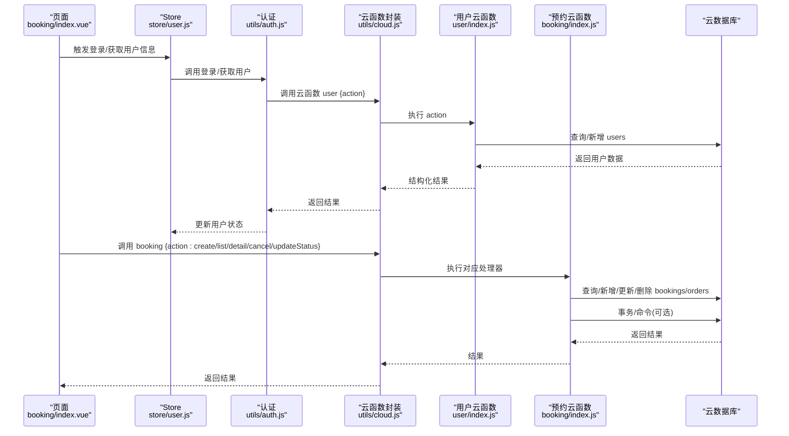
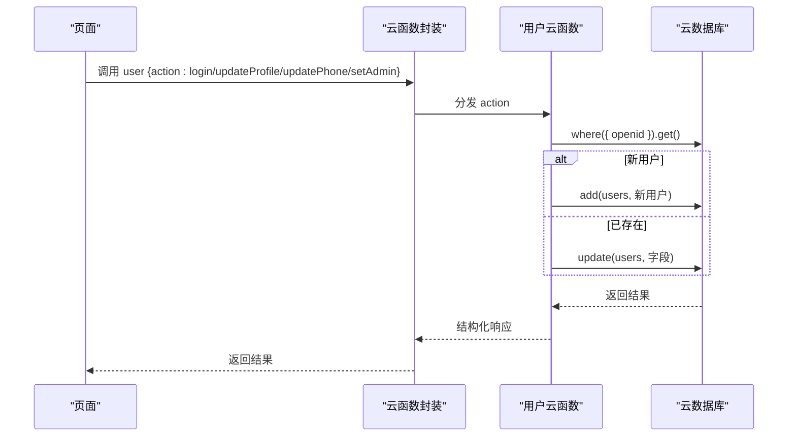
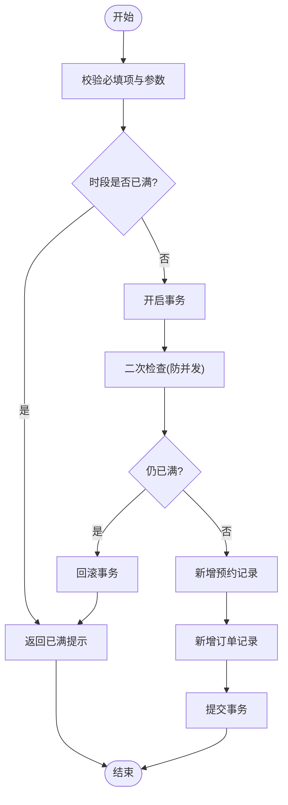
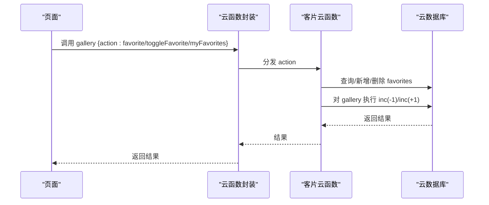
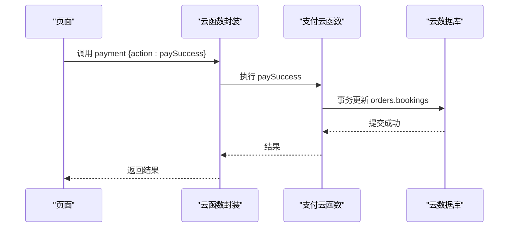
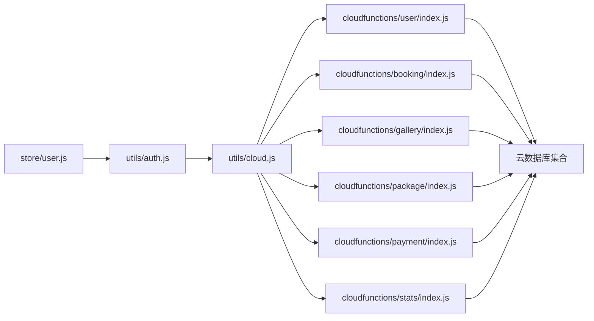

# 云数据库操作

<cite>
**本文引用的文件**
- [miniprogram/src/utils/cloud.js](file://miniprogram/src/utils/cloud.js)
- [miniprogram/src/utils/auth.js](file://miniprogram/src/utils/auth.js)
- [miniprogram/src/store/user.js](file://miniprogram/src/store/user.js)
- [miniprogram/cloudfunctions/user/index.js](file://miniprogram/cloudfunctions/user/index.js)
- [miniprogram/cloudfunctions/booking/index.js](file://miniprogram/cloudfunctions/booking/index.js)
- [miniprogram/cloudfunctions/gallery/index.js](file://miniprogram/cloudfunctions/gallery/index.js)
- [miniprogram/cloudfunctions/package/index.js](file://miniprogram/cloudfunctions/package/index.js)
- [miniprogram/cloudfunctions/payment/index.js](file://miniprogram/cloudfunctions/payment/index.js)
- [miniprogram/cloudfunctions/stats/index.js](file://miniprogram/cloudfunctions/stats/index.js)
- [miniprogram/src/pages/booking/index.vue](file://miniprogram/src/pages/booking/index.vue)
</cite>

## 目录
1. [简介](#简介)
2. [项目结构](#项目结构)
3. [核心组件](#核心组件)
4. [架构总览](#架构总览)
5. [详细组件分析](#详细组件分析)
6. [依赖关系分析](#依赖关系分析)
7. [性能考虑](#性能考虑)
8. [故障排查指南](#故障排查指南)
9. [结论](#结论)
10. [附录](#附录)

## 简介
本文件面向 lvpai 项目的云数据库操作，系统性梳理了基于微信云开发的 CRUD 实现与最佳实践。内容覆盖数据库连接管理、集合操作、文档查询、条件构建、排序与分页、批量与事务处理、并发控制、错误处理与异常捕获、数据验证策略，并提供面向开发者的完整操作指导与性能优化建议。

## 项目结构
lvpai 采用“前端调用云函数 + 云函数访问云数据库”的分层架构：
- 前端通过封装的云函数调用工具发起请求，传递 action 与 data 参数。
- 云函数根据 action 分发到具体业务处理器，使用 wx-server-sdk 访问数据库集合，执行查询、新增、更新、删除等操作。
- 部分场景使用事务保证跨集合的一致性；部分场景使用命令进行原子更新（如自增）。

图表来源
- [miniprogram/src/pages/booking/index.vue](file://miniprogram/src/pages/booking/index.vue)
- [miniprogram/src/store/user.js](file://miniprogram/src/store/user.js)
- [miniprogram/src/utils/auth.js](file://miniprogram/src/utils/auth.js)
- [miniprogram/src/utils/cloud.js](file://miniprogram/src/utils/cloud.js)
- [miniprogram/cloudfunctions/user/index.js](file://miniprogram/cloudfunctions/user/index.js)
- [miniprogram/cloudfunctions/booking/index.js](file://miniprogram/cloudfunctions/booking/index.js)
- [miniprogram/cloudfunctions/gallery/index.js](file://miniprogram/cloudfunctions/gallery/index.js)
- [miniprogram/cloudfunctions/package/index.js](file://miniprogram/cloudfunctions/package/index.js)
- [miniprogram/cloudfunctions/payment/index.js](file://miniprogram/cloudfunctions/payment/index.js)
- [miniprogram/cloudfunctions/stats/index.js](file://miniprogram/cloudfunctions/stats/index.js)

章节来源
- [miniprogram/src/pages/booking/index.vue](file://miniprogram/src/pages/booking/index.vue)
- [miniprogram/src/store/user.js](file://miniprogram/src/store/user.js)
- [miniprogram/src/utils/auth.js](file://miniprogram/src/utils/auth.js)
- [miniprogram/src/utils/cloud.js](file://miniprogram/src/utils/cloud.js)

## 核心组件
- 云函数调用封装：统一处理云函数调用、错误捕获与响应结构化。
- 数据库访问：云函数内初始化 SDK，获取数据库实例，按集合进行 CRUD。
- 权限与校验：通过用户集合判断角色，限制管理员操作范围。
- 事务与原子更新：使用事务保证多集合一致性；使用命令进行原子更新。
- 查询与分页：支持 where 条件、排序、分页、聚合统计。

章节来源
- [miniprogram/src/utils/cloud.js](file://miniprogram/src/utils/cloud.js)
- [miniprogram/cloudfunctions/user/index.js](file://miniprogram/cloudfunctions/user/index.js)
- [miniprogram/cloudfunctions/booking/index.js](file://miniprogram/cloudfunctions/booking/index.js)
- [miniprogram/cloudfunctions/gallery/index.js](file://miniprogram/cloudfunctions/gallery/index.js)
- [miniprogram/cloudfunctions/package/index.js](file://miniprogram/cloudfunctions/package/index.js)
- [miniprogram/cloudfunctions/payment/index.js](file://miniprogram/cloudfunctions/payment/index.js)
- [miniprogram/cloudfunctions/stats/index.js](file://miniprogram/cloudfunctions/stats/index.js)

## 架构总览
下图展示了从前端到云函数再到数据库的整体流程，以及关键的权限与事务节点。

图表来源
- [miniprogram/src/pages/booking/index.vue](file://miniprogram/src/pages/booking/index.vue)
- [miniprogram/src/store/user.js](file://miniprogram/src/store/user.js)
- [miniprogram/src/utils/auth.js](file://miniprogram/src/utils/auth.js)
- [miniprogram/src/utils/cloud.js](file://miniprogram/src/utils/cloud.js)
- [miniprogram/cloudfunctions/user/index.js](file://miniprogram/cloudfunctions/user/index.js)
- [miniprogram/cloudfunctions/booking/index.js](file://miniprogram/cloudfunctions/booking/index.js)

## 详细组件分析

### 云函数调用封装与数据库引用
- 统一 Promise 化 wx.cloud 调用，集中处理成功/失败回调与错误日志。
- 提供上传、下载、删除文件与获取数据库引用的便捷方法。
- 建议：所有前端数据库读写均通过云函数进行，避免直接暴露数据库权限。

章节来源
- [miniprogram/src/utils/cloud.js](file://miniprogram/src/utils/cloud.js)

### 用户模块（登录、资料更新、角色管理）
- 登录：根据 openid 查询或创建用户记录，返回用户信息。
- 资料更新：按需更新昵称/头像，校验必填字段。
- 手机号更新：正则校验手机号，更新后返回最新用户信息。
- 角色管理：仅超级管理员可修改他人角色，含权限校验与错误处理。

图表来源
- [miniprogram/cloudfunctions/user/index.js](file://miniprogram/cloudfunctions/user/index.js)

章节来源
- [miniprogram/cloudfunctions/user/index.js](file://miniprogram/cloudfunctions/user/index.js)

### 预约模块（创建、列表、详情、取消、状态更新、可用时段）
- 创建预约：校验必填项与时段容量，使用事务同时创建预约与订单，防并发。
- 列表查询：支持状态/日期筛选、分页、排序；非管理员仅能看自己。
- 详情查询：权限校验（本人或管理员），联查订单。
- 取消预约：权限校验、状态约束、联动订单退款标记。
- 状态更新：管理员校验，状态枚举校验。
- 可用时段：按日期计算各时段剩余名额。

图表来源
- [miniprogram/cloudfunctions/booking/index.js](file://miniprogram/cloudfunctions/booking/index.js)

章节来源
- [miniprogram/cloudfunctions/booking/index.js](file://miniprogram/cloudfunctions/booking/index.js)

### 客片模块（列表、详情、创建/更新/删除、收藏/取消收藏、我的收藏）
- 列表：分类筛选、发布状态过滤、分页、排序。
- 详情：按主键查询。
- 管理员操作：创建/更新/删除，删除时级联清理收藏。
- 收藏：toggle 收藏，使用命令原子自增/自减点赞数。
- 我的收藏：分页查询收藏记录并联查 gallery。

图表来源
- [miniprogram/cloudfunctions/gallery/index.js](file://miniprogram/cloudfunctions/gallery/index.js)

章节来源
- [miniprogram/cloudfunctions/gallery/index.js](file://miniprogram/cloudfunctions/gallery/index.js)

### 套餐模块（列表、详情、创建/更新/删除、上下架）
- 列表：分类筛选、上架状态过滤、排序。
- 详情：按主键查询。
- 管理员操作：创建/更新/删除/上下架，带权限校验。

章节来源
- [miniprogram/cloudfunctions/package/index.js](file://miniprogram/cloudfunctions/package/index.js)

### 支付模块（订单创建、支付成功、回调、退款、订单查询、我的订单）
- 订单创建：校验订单存在与权限、状态，模拟支付参数返回。
- 支付成功：前端触发，使用事务更新订单与关联预约状态。
- 回调：预留真实回调处理（注释），当前返回模拟结果。
- 退款：管理员校验，模拟退款处理并联动更新预约状态。
- 订单查询：支持按订单 ID 或订单号查询，权限校验。
- 我的订单：按用户分页查询，支持按支付状态筛选。

图表来源
- [miniprogram/cloudfunctions/payment/index.js](file://miniprogram/cloudfunctions/payment/index.js)

章节来源
- [miniprogram/cloudfunctions/payment/index.js](file://miniprogram/cloudfunctions/payment/index.js)

### 统计模块（概览、状态统计、趋势）
- 概览：管理员校验，统计今日预约、待处理订单、本月收入、客片/预约/用户总数。
- 状态统计：遍历各状态计数。
- 趋势：最近7天每日预约数。

章节来源
- [miniprogram/cloudfunctions/stats/index.js](file://miniprogram/cloudfunctions/stats/index.js)

## 依赖关系分析
- 前端依赖：
  - 通过云函数封装统一调用，避免直接访问数据库。
  - 认证工具负责登录与用户信息获取。
  - Pinia Store 管理用户态与权限判定。
- 云函数依赖：
  - wx-server-sdk 初始化环境与数据库。
  - 不同业务云函数依赖各自集合（users/bookings/packages/orders/gallery/favorites）。
  - 多处使用命令（_.neq/_.in/_.inc）与聚合（$.sum）提升查询效率与原子性。

图表来源
- [miniprogram/src/utils/cloud.js](file://miniprogram/src/utils/cloud.js)
- [miniprogram/src/utils/auth.js](file://miniprogram/src/utils/auth.js)
- [miniprogram/src/store/user.js](file://miniprogram/src/store/user.js)
- [miniprogram/cloudfunctions/user/index.js](file://miniprogram/cloudfunctions/user/index.js)
- [miniprogram/cloudfunctions/booking/index.js](file://miniprogram/cloudfunctions/booking/index.js)
- [miniprogram/cloudfunctions/gallery/index.js](file://miniprogram/cloudfunctions/gallery/index.js)
- [miniprogram/cloudfunctions/package/index.js](file://miniprogram/cloudfunctions/package/index.js)
- [miniprogram/cloudfunctions/payment/index.js](file://miniprogram/cloudfunctions/payment/index.js)
- [miniprogram/cloudfunctions/stats/index.js](file://miniprogram/cloudfunctions/stats/index.js)

章节来源
- [miniprogram/src/utils/cloud.js](file://miniprogram/src/utils/cloud.js)
- [miniprogram/src/utils/auth.js](file://miniprogram/src/utils/auth.js)
- [miniprogram/src/store/user.js](file://miniprogram/src/store/user.js)
- [miniprogram/cloudfunctions/user/index.js](file://miniprogram/cloudfunctions/user/index.js)
- [miniprogram/cloudfunctions/booking/index.js](file://miniprogram/cloudfunctions/booking/index.js)
- [miniprogram/cloudfunctions/gallery/index.js](file://miniprogram/cloudfunctions/gallery/index.js)
- [miniprogram/cloudfunctions/package/index.js](file://miniprogram/cloudfunctions/package/index.js)
- [miniprogram/cloudfunctions/payment/index.js](file://miniprogram/cloudfunctions/payment/index.js)
- [miniprogram/cloudfunctions/stats/index.js](file://miniprogram/cloudfunctions/stats/index.js)

## 性能考虑
- 查询优化
  - 使用 where 条件精确过滤，必要时配合索引字段（如 _openid、date、status）。
  - 分页使用 skip/limit，避免一次性拉取大量数据。
  - 联表查询时尽量缩小范围（如 status/published）。
- 原子更新
  - 使用命令进行原子自增/自减（likes），减少并发冲突。
- 事务
  - 关键路径（创建预约+订单、支付成功联动更新）使用事务，保证一致性。
- 聚合统计
  - 使用聚合管道进行分组统计，降低多次查询成本。
- 缓存与降级
  - 对热点列表（如套餐、客片）可在前端做轻量缓存，结合下拉刷新。
  - 异常时提供兜底文案与重试机制。

## 故障排查指南
- 通用错误
  - 云函数返回结构：统一包含 code/message/data；前端据此展示错误与重试。
  - 成功/失败回调：封装中集中处理失败日志，便于定位。
- 权限问题
  - 非管理员尝试管理操作：检查角色校验与权限判定。
- 并发问题
  - 预约创建：二次检查与事务回滚，避免超卖。
- 数据校验
  - 必填项与格式校验（手机号、日期、状态枚举）失败时及时反馈。
- 事务异常
  - 事务块内抛错会自动回滚，注意捕获并记录错误日志。

章节来源
- [miniprogram/src/utils/cloud.js](file://miniprogram/src/utils/cloud.js)
- [miniprogram/cloudfunctions/booking/index.js](file://miniprogram/cloudfunctions/booking/index.js)
- [miniprogram/cloudfunctions/user/index.js](file://miniprogram/cloudfunctions/user/index.js)
- [miniprogram/cloudfunctions/payment/index.js](file://miniprogram/cloudfunctions/payment/index.js)

## 结论
lvpai 的云数据库操作遵循“前端不直连数据库”的安全原则，通过云函数实现统一的 CRUD、权限控制、事务与原子更新。查询条件构建清晰，支持分页与排序；并发场景通过二次检查与事务保障一致性；错误处理与日志记录完善。建议在生产环境中进一步完善索引、监控与告警体系，并持续优化热点查询与缓存策略。

## 附录
- 常用集合与字段
  - users：openid、nickname、avatar、phone、role、createTime
  - bookings：userId、packageId、packageName、packagePrice、date、timeSlot、status、persons、remark、createTime、updateTime、cancelTime、cancelBy
  - orders：bookingId、userId、packageId、packageName、totalPrice、depositAmount、payStatus、orderNo、payTime、refundTime、createTime
  - packages：name、price、deposit、status、category、sortOrder、createTime、updateTime
  - gallery：title、description、images、category、status、likes、createTime、updateTime
  - favorites：userId、galleryId、createTime
- 常用命令
  - 条件：_.neq、_.in
  - 聚合：$.sum
  - 原子更新：_.inc
- 最佳实践清单
  - 所有数据库读写通过云函数。
  - 重要操作使用事务。
  - 对外查询添加权限校验。
  - 合理使用分页与排序。
  - 对热点数据做前端缓存与增量更新。
  - 错误统一结构化返回，前端友好提示。