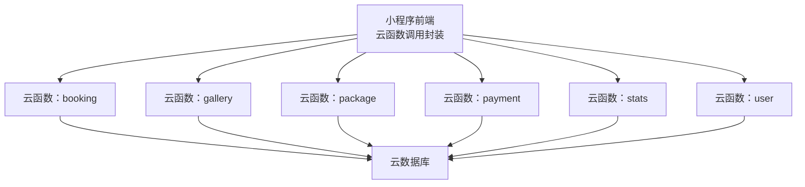
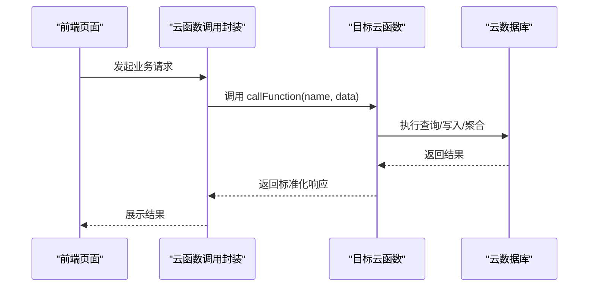
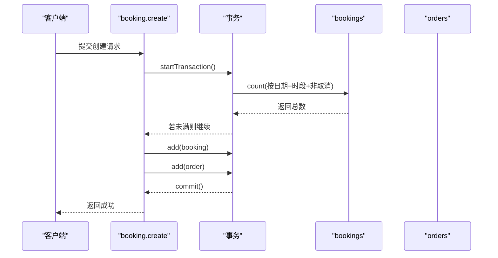
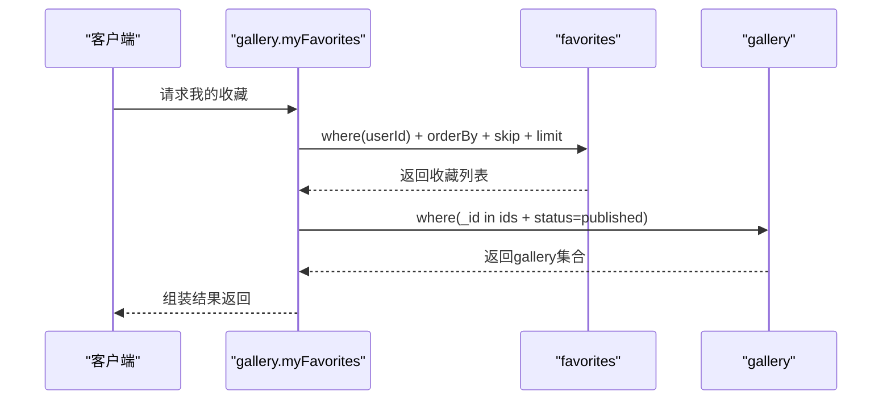
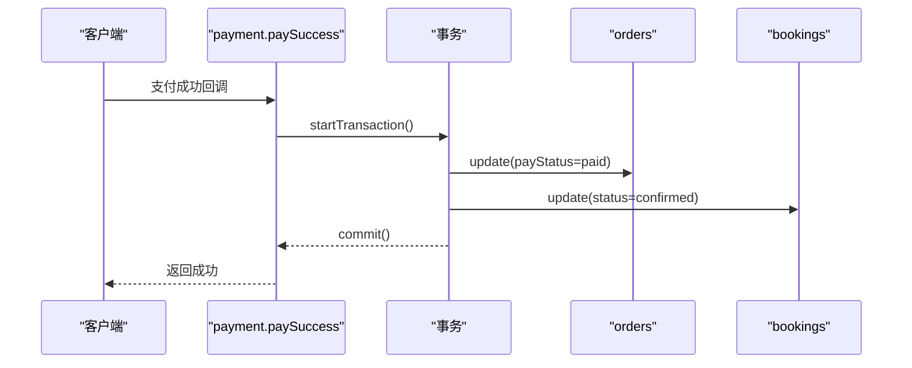
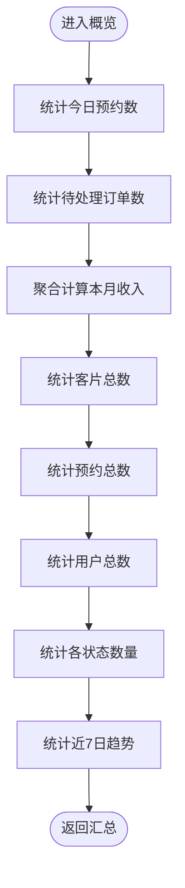
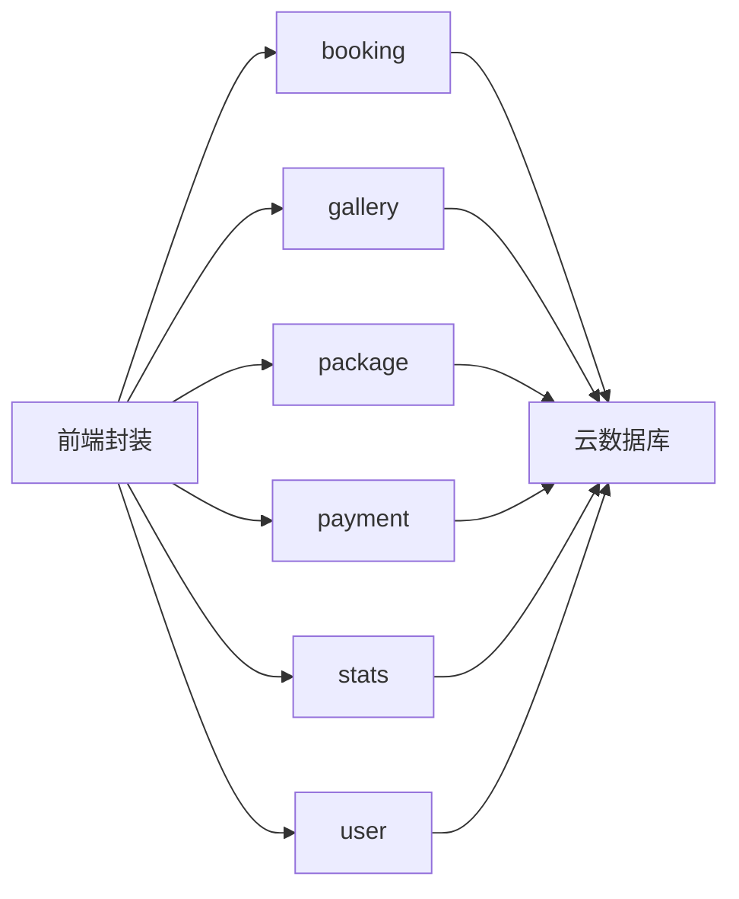

# 数据库性能优化

<cite>
**本文引用的文件**
- [miniprogram/cloudfunctions/booking/index.js](file://miniprogram/cloudfunctions/booking/index.js)
- [miniprogram/cloudfunctions/gallery/index.js](file://miniprogram/cloudfunctions/gallery/index.js)
- [miniprogram/cloudfunctions/package/index.js](file://miniprogram/cloudfunctions/package/index.js)
- [miniprogram/cloudfunctions/payment/index.js](file://miniprogram/cloudfunctions/payment/index.js)
- [miniprogram/cloudfunctions/stats/index.js](file://miniprogram/cloudfunctions/stats/index.js)
- [miniprogram/cloudfunctions/user/index.js](file://miniprogram/cloudfunctions/user/index.js)
- [miniprogram/src/utils/cloud.js](file://miniprogram/src/utils/cloud.js)
- [miniprogram/src/store/user.js](file://miniprogram/src/store/user.js)
</cite>

## 目录
1. [简介](#简介)
2. [项目结构](#项目结构)
3. [核心组件](#核心组件)
4. [架构总览](#架构总览)
5. [详细组件分析](#详细组件分析)
6. [依赖关系分析](#依赖关系分析)
7. [性能考量与优化建议](#性能考量与优化建议)
8. [故障排查指南](#故障排查指南)
9. [结论](#结论)
10. [附录](#附录)

## 简介
本文件面向 lvpai 项目的数据库性能优化，聚焦于云开发环境下的查询优化、索引设计、分页与批量操作、缓存策略、并发控制、复杂查询与聚合、以及监控与排障。通过对现有云函数实现进行逐项分析，提出可落地的优化建议与最佳实践，帮助开发者系统性提升数据库访问效率与稳定性。

## 项目结构
lvpai 采用“前端 + 云函数 + 云数据库”的架构。前端通过封装的云函数调用接口发起请求，云函数负责权限校验、业务编排与数据库操作，并以事务保证关键路径的一致性；统计模块使用聚合查询进行报表计算。

图表来源
- [miniprogram/src/utils/cloud.js:1-66](file://miniprogram/src/utils/cloud.js#L1-L66)
- [miniprogram/cloudfunctions/booking/index.js:1-463](file://miniprogram/cloudfunctions/booking/index.js#L1-L463)
- [miniprogram/cloudfunctions/gallery/index.js:1-360](file://miniprogram/cloudfunctions/gallery/index.js#L1-L360)
- [miniprogram/cloudfunctions/package/index.js:1-222](file://miniprogram/cloudfunctions/package/index.js#L1-L222)
- [miniprogram/cloudfunctions/payment/index.js:1-532](file://miniprogram/cloudfunctions/payment/index.js#L1-L532)
- [miniprogram/cloudfunctions/stats/index.js:1-229](file://miniprogram/cloudfunctions/stats/index.js#L1-L229)
- [miniprogram/cloudfunctions/user/index.js:1-206](file://miniprogram/cloudfunctions/user/index.js#L1-L206)

章节来源
- [miniprogram/src/utils/cloud.js:1-66](file://miniprogram/src/utils/cloud.js#L1-L66)
- [miniprogram/cloudfunctions/booking/index.js:1-463](file://miniprogram/cloudfunctions/booking/index.js#L1-L463)
- [miniprogram/cloudfunctions/gallery/index.js:1-360](file://miniprogram/cloudfunctions/gallery/index.js#L1-L360)
- [miniprogram/cloudfunctions/package/index.js:1-222](file://miniprogram/cloudfunctions/package/index.js#L1-L222)
- [miniprogram/cloudfunctions/payment/index.js:1-532](file://miniprogram/cloudfunctions/payment/index.js#L1-L532)
- [miniprogram/cloudfunctions/stats/index.js:1-229](file://miniprogram/cloudfunctions/stats/index.js#L1-L229)
- [miniprogram/cloudfunctions/user/index.js:1-206](file://miniprogram/cloudfunctions/user/index.js#L1-L206)

## 核心组件
- 预约模块（booking）：支持创建预约、查询列表/详情、取消、状态变更、可用时段查询；使用事务保障并发安全。
- 客片模块（gallery）：支持列表/详情、增删改、收藏切换、我的收藏联表查询。
- 套餐模块（package）：支持列表/详情、增删改、上下架。
- 支付模块（payment）：支持创建支付、支付成功回调、退款、订单查询与分页列表。
- 统计模块（stats）：管理员视角的数据概览、收入统计、状态分布、近7日趋势。
- 用户模块（user）：登录、资料与手机号更新、角色管理。

章节来源
- [miniprogram/cloudfunctions/booking/index.js:67-463](file://miniprogram/cloudfunctions/booking/index.js#L67-L463)
- [miniprogram/cloudfunctions/gallery/index.js:26-360](file://miniprogram/cloudfunctions/gallery/index.js#L26-L360)
- [miniprogram/cloudfunctions/package/index.js:26-222](file://miniprogram/cloudfunctions/package/index.js#L26-L222)
- [miniprogram/cloudfunctions/payment/index.js:26-532](file://miniprogram/cloudfunctions/payment/index.js#L26-L532)
- [miniprogram/cloudfunctions/stats/index.js:52-229](file://miniprogram/cloudfunctions/stats/index.js#L52-L229)
- [miniprogram/cloudfunctions/user/index.js:7-206](file://miniprogram/cloudfunctions/user/index.js#L7-L206)

## 架构总览
云函数作为统一入口，承担鉴权、参数校验、事务与聚合等职责；前端通过封装的云函数调用接口进行交互，避免直接操作数据库，降低耦合度与风险。

图表来源
- [miniprogram/src/utils/cloud.js:5-26](file://miniprogram/src/utils/cloud.js#L5-L26)
- [miniprogram/cloudfunctions/booking/index.js:67-93](file://miniprogram/cloudfunctions/booking/index.js#L67-L93)
- [miniprogram/cloudfunctions/gallery/index.js:26-64](file://miniprogram/cloudfunctions/gallery/index.js#L26-L64)
- [miniprogram/cloudfunctions/package/index.js:26-58](file://miniprogram/cloudfunctions/package/index.js#L26-L58)
- [miniprogram/cloudfunctions/payment/index.js:26-52](file://miniprogram/cloudfunctions/payment/index.js#L26-L52)
- [miniprogram/cloudfunctions/stats/index.js:52-68](file://miniprogram/cloudfunctions/stats/index.js#L52-L68)
- [miniprogram/cloudfunctions/user/index.js:7-31](file://miniprogram/cloudfunctions/user/index.js#L7-L31)

## 详细组件分析

### 预约模块（booking）
- 关键流程：创建预约（含并发检查与事务）、查询列表/详情、取消、状态更新、可用时段统计。
- 并发控制：在事务内再次检查配额，避免超卖。
- 查询模式：多处使用 where + count + orderBy + skip + limit 实现分页；部分场景使用精确匹配与范围过滤。
- 复杂查询：可用时段按时间段循环统计，存在多次查询；可考虑合并为一次聚合或建立辅助索引。

图表来源
- [miniprogram/cloudfunctions/booking/index.js:98-206](file://miniprogram/cloudfunctions/booking/index.js#L98-L206)

章节来源
- [miniprogram/cloudfunctions/booking/index.js:98-206](file://miniprogram/cloudfunctions/booking/index.js#L98-L206)
- [miniprogram/cloudfunctions/booking/index.js:211-259](file://miniprogram/cloudfunctions/booking/index.js#L211-L259)
- [miniprogram/cloudfunctions/booking/index.js:264-303](file://miniprogram/cloudfunctions/booking/index.js#L264-L303)
- [miniprogram/cloudfunctions/booking/index.js:308-385](file://miniprogram/cloudfunctions/booking/index.js#L308-L385)
- [miniprogram/cloudfunctions/booking/index.js:390-438](file://miniprogram/cloudfunctions/booking/index.js#L390-L438)
- [miniprogram/cloudfunctions/booking/index.js:443-462](file://miniprogram/cloudfunctions/booking/index.js#L443-L462)

### 客片模块（gallery）
- 关键流程：列表/详情、增删改、收藏切换、我的收藏联表查询。
- 联表查询：我的收藏列表通过 favorites + gallery 联查，先取收藏列表再批量查询 gallery，构建映射组装结果。
- 查询模式：分类筛选、发布状态过滤、分页排序；收藏切换使用 upsert 式的“存在即删”逻辑。

图表来源
- [miniprogram/cloudfunctions/gallery/index.js:285-339](file://miniprogram/cloudfunctions/gallery/index.js#L285-L339)

章节来源
- [miniprogram/cloudfunctions/gallery/index.js:66-103](file://miniprogram/cloudfunctions/gallery/index.js#L66-L103)
- [miniprogram/cloudfunctions/gallery/index.js:105-124](file://miniprogram/cloudfunctions/gallery/index.js#L105-L124)
- [miniprogram/cloudfunctions/gallery/index.js:126-182](file://miniprogram/cloudfunctions/gallery/index.js#L126-L182)
- [miniprogram/cloudfunctions/gallery/index.js:184-225](file://miniprogram/cloudfunctions/gallery/index.js#L184-L225)
- [miniprogram/cloudfunctions/gallery/index.js:227-283](file://miniprogram/cloudfunctions/gallery/index.js#L227-L283)
- [miniprogram/cloudfunctions/gallery/index.js:285-339](file://miniprogram/cloudfunctions/gallery/index.js#L285-L339)
- [miniprogram/cloudfunctions/gallery/index.js:341-359](file://miniprogram/cloudfunctions/gallery/index.js#L341-L359)

### 套餐模块（package）
- 关键流程：列表/详情、增删改、上下架。
- 查询模式：分类筛选、排序；用户端仅返回上架套餐。

章节来源
- [miniprogram/cloudfunctions/package/index.js:60-86](file://miniprogram/cloudfunctions/package/index.js#L60-L86)
- [miniprogram/cloudfunctions/package/index.js:88-107](file://miniprogram/cloudfunctions/package/index.js#L88-L107)
- [miniprogram/cloudfunctions/package/index.js:109-134](file://miniprogram/cloudfunctions/package/index.js#L109-L134)
- [miniprogram/cloudfunctions/package/index.js:166-187](file://miniprogram/cloudfunctions/package/index.js#L166-L187)
- [miniprogram/cloudfunctions/package/index.js:189-221](file://miniprogram/cloudfunctions/package/index.js#L189-L221)

### 支付模块（payment）
- 关键流程：创建支付订单（模拟/真实）、支付成功回调、退款（模拟/真实）、订单查询与分页列表。
- 事务使用：支付成功回调与退款均使用事务，确保订单与预约状态一致。
- 分页查询：我的订单列表支持分页与状态筛选。

图表来源
- [miniprogram/cloudfunctions/payment/index.js:172-239](file://miniprogram/cloudfunctions/payment/index.js#L172-L239)

章节来源
- [miniprogram/cloudfunctions/payment/index.js:65-166](file://miniprogram/cloudfunctions/payment/index.js#L65-L166)
- [miniprogram/cloudfunctions/payment/index.js:172-239](file://miniprogram/cloudfunctions/payment/index.js#L172-L239)
- [miniprogram/cloudfunctions/payment/index.js:253-327](file://miniprogram/cloudfunctions/payment/index.js#L253-L327)
- [miniprogram/cloudfunctions/payment/index.js:338-450](file://miniprogram/cloudfunctions/payment/index.js#L338-L450)
- [miniprogram/cloudfunctions/payment/index.js:454-492](file://miniprogram/cloudfunctions/payment/index.js#L454-L492)
- [miniprogram/cloudfunctions/payment/index.js:496-531](file://miniprogram/cloudfunctions/payment/index.js#L496-L531)

### 统计模块（stats）
- 关键流程：管理员概览、今日预约、待处理订单、月收入聚合、客片/预约/用户总数、状态分布、近7日趋势。
- 聚合使用：月收入使用聚合 group + sum；状态分布与趋势分别通过多次 count 或按日期遍历实现。

图表来源
- [miniprogram/cloudfunctions/stats/index.js:73-162](file://miniprogram/cloudfunctions/stats/index.js#L73-L162)
- [miniprogram/cloudfunctions/stats/index.js:167-192](file://miniprogram/cloudfunctions/stats/index.js#L167-L192)
- [miniprogram/cloudfunctions/stats/index.js:197-228](file://miniprogram/cloudfunctions/stats/index.js#L197-L228)

章节来源
- [miniprogram/cloudfunctions/stats/index.js:73-162](file://miniprogram/cloudfunctions/stats/index.js#L73-L162)
- [miniprogram/cloudfunctions/stats/index.js:167-192](file://miniprogram/cloudfunctions/stats/index.js#L167-L192)
- [miniprogram/cloudfunctions/stats/index.js:197-228](file://miniprogram/cloudfunctions/stats/index.js#L197-L228)

### 用户模块（user）
- 关键流程：登录（不存在则创建）、获取资料、更新手机号、更新资料、设置管理员角色。
- 权限控制：设置管理员角色要求当前用户为 superAdmin。

章节来源
- [miniprogram/cloudfunctions/user/index.js:33-67](file://miniprogram/cloudfunctions/user/index.js#L33-L67)
- [miniprogram/cloudfunctions/user/index.js:69-82](file://miniprogram/cloudfunctions/user/index.js#L69-L82)
- [miniprogram/cloudfunctions/user/index.js:84-115](file://miniprogram/cloudfunctions/user/index.js#L84-L115)
- [miniprogram/cloudfunctions/user/index.js:117-154](file://miniprogram/cloudfunctions/user/index.js#L117-L154)
- [miniprogram/cloudfunctions/user/index.js:156-205](file://miniprogram/cloudfunctions/user/index.js#L156-L205)

## 依赖关系分析
- 前端依赖：通过统一的云函数调用封装发起请求，减少对数据库直连的耦合。
- 云函数间协作：预约与订单强关联；统计模块依赖多个集合；收藏模块依赖 favorites 与 gallery。
- 外部依赖：依赖微信云开发 SDK，使用事务、聚合、命令等能力。

图表来源
- [miniprogram/src/utils/cloud.js:5-26](file://miniprogram/src/utils/cloud.js#L5-L26)
- [miniprogram/cloudfunctions/booking/index.js:4-5](file://miniprogram/cloudfunctions/booking/index.js#L4-L5)
- [miniprogram/cloudfunctions/gallery/index.js:4](file://miniprogram/cloudfunctions/gallery/index.js#L4)
- [miniprogram/cloudfunctions/package/index.js:4](file://miniprogram/cloudfunctions/package/index.js#L4)
- [miniprogram/cloudfunctions/payment/index.js:4](file://miniprogram/cloudfunctions/payment/index.js#L4)
- [miniprogram/cloudfunctions/stats/index.js:4](file://miniprogram/cloudfunctions/stats/index.js#L4)
- [miniprogram/cloudfunctions/user/index.js:5](file://miniprogram/cloudfunctions/user/index.js#L5)

章节来源
- [miniprogram/src/utils/cloud.js:5-26](file://miniprogram/src/utils/cloud.js#L5-L26)
- [miniprogram/cloudfunctions/booking/index.js:4-5](file://miniprogram/cloudfunctions/booking/index.js#L4-L5)
- [miniprogram/cloudfunctions/gallery/index.js:4](file://miniprogram/cloudfunctions/gallery/index.js#L4)
- [miniprogram/cloudfunctions/package/index.js:4](file://miniprogram/cloudfunctions/package/index.js#L4)
- [miniprogram/cloudfunctions/payment/index.js:4](file://miniprogram/cloudfunctions/payment/index.js#L4)
- [miniprogram/cloudfunctions/stats/index.js:4](file://miniprogram/cloudfunctions/stats/index.js#L4)
- [miniprogram/cloudfunctions/user/index.js:5](file://miniprogram/cloudfunctions/user/index.js#L5)

## 性能考量与优化建议

### 索引设计原则
- 复合索引优先：对高频查询条件组合建立复合索引，如 bookings 的 date+timeSlot+status、orders 的 userId+payStatus、gallery 的 status、favorites 的 userId+galleryId。
- 排序字段：对 orderBy 字段建立索引，避免额外排序开销。
- 范围查询：对范围过滤字段（如 payTime）建立索引，提升聚合效率。
- 唯一索引：对唯一约束字段（如 orderNo、openid）建立唯一索引，加速去重与唯一性校验。

### 查询计划分析与执行效率评估
- 分页查询：当前多处使用 skip + limit，当数据量增大时跳过大量数据成本高。建议：
  - 使用基于游标（基于最后一条记录的主键或时间戳）的分页，避免 deep paging。
  - 对分页字段建立复合索引，确保排序与过滤在同一索引上。
- 聚合与统计：统计模块多次 count 与按日期遍历趋势，建议：
  - 使用聚合管道一次性统计多维度，减少往返次数。
  - 对统计字段建立合适索引，避免全表扫描。
- 联表查询：收藏列表联查 gallery，建议：
  - 先取收藏 ID 列表，再批量查询 gallery，避免 N+1 查询。
  - 对 gallery 的 status 建立索引，过滤已发布内容。

### 分页查询、批量操作与缓存策略
- 分页查询：
  - 替代 skip 的方案：使用 lastDocId 或时间戳游标，结合索引进行高效翻页。
  - 控制每页大小：避免过大 pageSize 导致单次响应过大。
- 批量操作：
  - 使用事务批处理关键路径（如创建预约+订单），减少锁竞争。
  - 对批量写入使用批量 API（若云开发支持），降低网络往返。
- 缓存策略：
  - 对静态或低频变更数据（如套餐列表、分类）做短期缓存，结合失效策略。
  - 对热点查询结果（如热门客片、推荐套餐）做应用层缓存，注意缓存一致性。

### 复杂查询优化与连接池管理
- 复杂查询优化：
  - 合并多次 count 为聚合统计，减少查询次数。
  - 使用投影裁剪不必要的字段，减少传输与解析开销。
- 连接池管理：
  - 云函数天然短生命周期，无需显式连接池；应关注冷启动与并发峰值。
  - 合理设置并发上限，避免瞬时高并发导致超时。

### 并发控制与一致性
- 事务使用：已在关键路径（创建预约、支付成功、退款、删除客片）使用事务，确保原子性。
- 并发冲突预防：在事务内二次校验配额与状态，避免竞态条件。
- 锁粒度：尽量缩小事务范围，减少锁持有时间。

### 数据预加载、懒加载与内存优化
- 预加载：对强关联数据（如订单详情中的套餐信息）在一次查询中获取，减少后续查询。
- 懒加载：对非首屏数据（如更多客片、更多订单）采用懒加载，降低初始负载。
- 内存优化：避免一次性加载过多数据；及时释放中间变量；对大对象使用流式处理思路。

### 性能监控指标与瓶颈识别
- 指标建议：
  - QPS、P95/P99 延迟、错误率、事务回滚率、聚合耗时。
  - 分页深度、平均响应大小、缓存命中率。
- 瓶颈识别：
  - 通过日志与指标定位慢查询（where、count、聚合）。
  - 观察事务冲突与回滚频率，优化并发策略。
  - 监控冷启动与并发峰值，调整部署与资源。

### 最佳实践清单
- 建索引：高频查询条件、排序字段、范围过滤字段。
- 优化分页：游标分页 + 复合索引。
- 聚合优化：合并统计、投影裁剪、索引覆盖。
- 事务优化：缩短事务、减少锁竞争、必要时拆分。
- 缓存策略：热点数据缓存、失效策略、缓存穿透防护。
- 监控告警：建立关键指标阈值与告警。

## 故障排查指南
- 常见问题与定位
  - 查询超时：检查 where 条件是否命中索引，是否存在全表扫描；优化为复合索引或游标分页。
  - 事务回滚：核对事务内二次校验逻辑与并发冲突点；缩小事务范围。
  - 权限错误：确认管理员校验与 openid 校验逻辑是否正确。
  - 联表查询异常：检查 ID 映射与过滤条件，确保 status 与可见性字段正确。
- 日志与调试
  - 在云函数中记录关键步骤与耗时，便于定位慢点。
  - 对聚合与批量操作增加 try-catch，捕获并记录异常细节。
- 快速修复建议
  - 为高频查询字段补索引。
  - 将多次 count 合并为聚合统计。
  - 使用游标分页替代 deep paging。
  - 对热点数据增加缓存层。

章节来源
- [miniprogram/cloudfunctions/booking/index.js:150-206](file://miniprogram/cloudfunctions/booking/index.js#L150-L206)
- [miniprogram/cloudfunctions/payment/index.js:204-239](file://miniprogram/cloudfunctions/payment/index.js#L204-L239)
- [miniprogram/cloudfunctions/gallery/index.js:198-225](file://miniprogram/cloudfunctions/gallery/index.js#L198-L225)
- [miniprogram/cloudfunctions/stats/index.js:100-121](file://miniprogram/cloudfunctions/stats/index.js#L100-L121)

## 结论
通过对 lvpai 项目云函数的系统性分析，当前实现已具备良好的事务一致性与基础分页能力。为进一步提升性能与稳定性，建议围绕索引建设、游标分页、聚合优化、缓存策略与监控体系展开优化。遵循本文提供的索引设计、查询优化、并发控制与监控排障方法，可显著降低延迟、提高吞吐，并增强系统的可维护性。

## 附录
- 前端云函数调用封装：统一的 callFunction 包装，便于错误处理与结果标准化。
- 用户状态管理：Pinia store 管理登录态与管理员标识，便于在前端侧控制功能展示。

章节来源
- [miniprogram/src/utils/cloud.js:5-26](file://miniprogram/src/utils/cloud.js#L5-L26)
- [miniprogram/src/store/user.js:1-48](file://miniprogram/src/store/user.js#L1-L48)