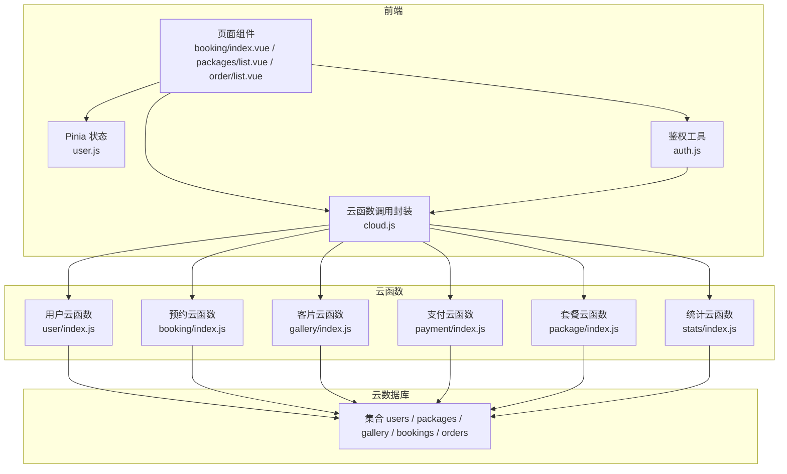
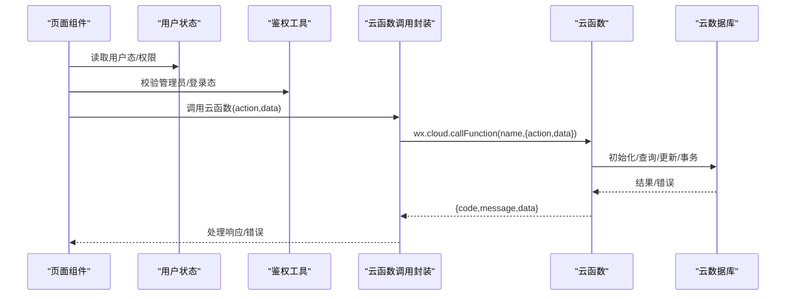
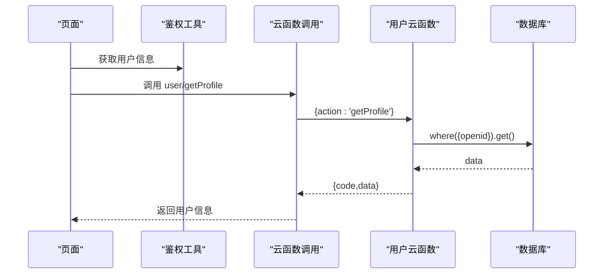
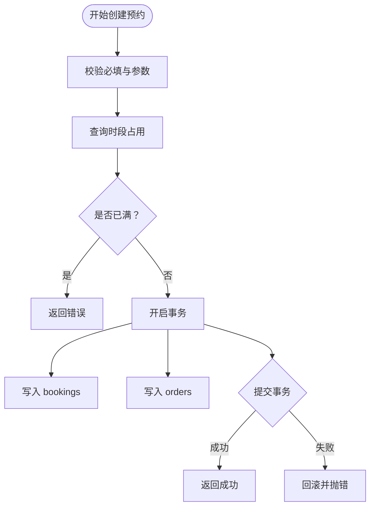
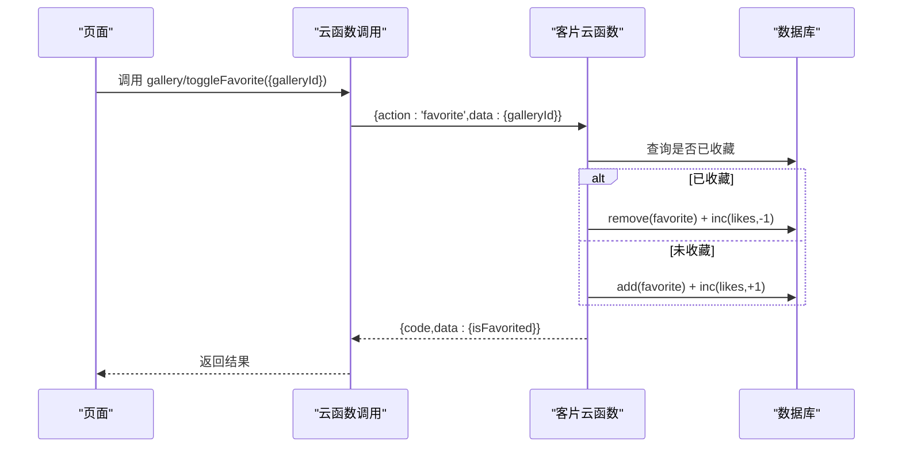
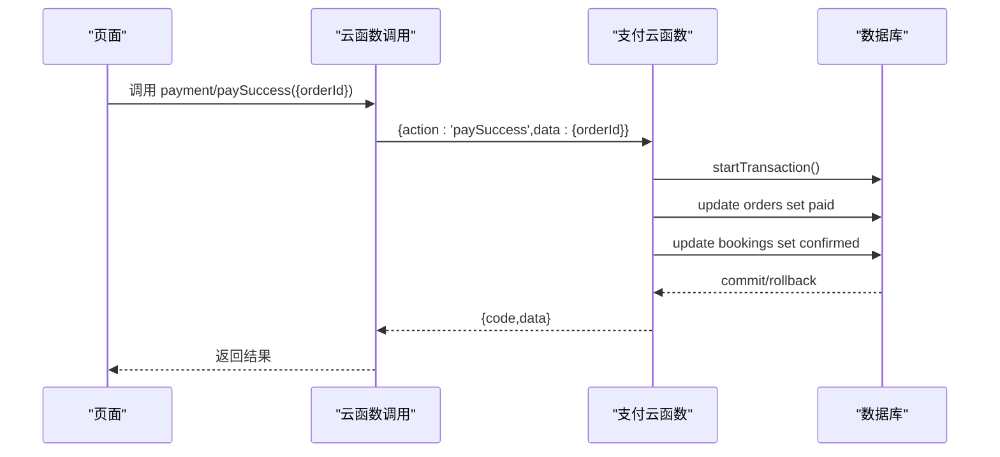
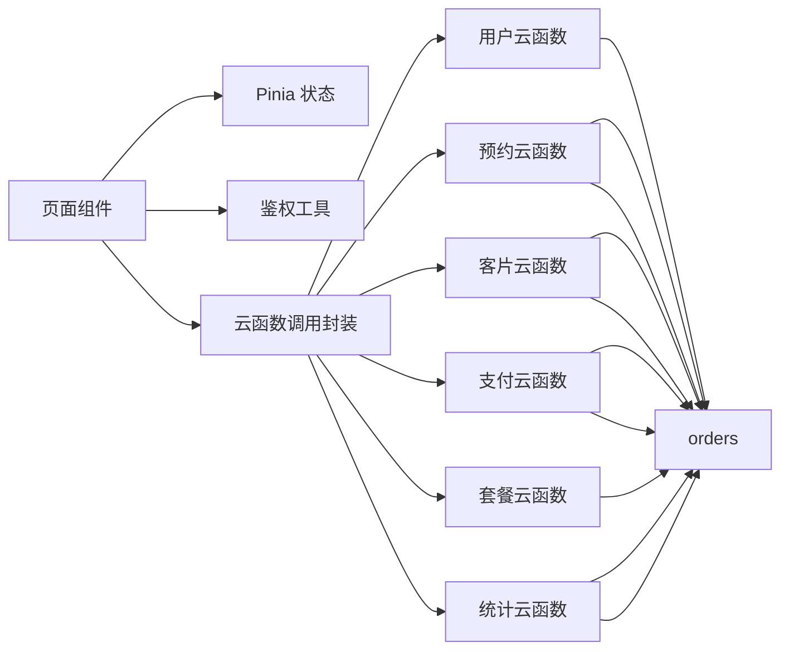

# 数据库操作

<cite>
**本文引用的文件**
- [cloud.js](file://miniprogram/src/utils/cloud.js)
- [auth.js](file://miniprogram/src/utils/auth.js)
- [user.js](file://miniprogram/src/store/user.js)
- [user/index.js](file://miniprogram/cloudfunctions/user/index.js)
- [booking/index.js](file://miniprogram/cloudfunctions/booking/index.js)
- [gallery/index.js](file://miniprogram/cloudfunctions/gallery/index.js)
- [payment/index.js](file://miniprogram/cloudfunctions/payment/index.js)
- [package/index.js](file://miniprogram/cloudfunctions/package/index.js)
- [stats/index.js](file://miniprogram/cloudfunctions/stats/index.js)
- [booking/index.vue](file://miniprogram/src/pages/booking/index.vue)
- [packages/list.vue](file://miniprogram/src/pages/packages/list.vue)
- [order/list.vue](file://miniprogram/src/pages/order/list.vue)
</cite>

## 目录
1. [简介](#简介)
2. [项目结构](#项目结构)
3. [核心组件](#核心组件)
4. [架构总览](#架构总览)
5. [详细组件分析](#详细组件分析)
6. [依赖关系分析](#依赖关系分析)
7. [性能考虑](#性能考虑)
8. [故障排查指南](#故障排查指南)
9. [结论](#结论)
10. [附录](#附录)

## 简介
本文件面向开发者，系统性梳理 lvpai 项目中的数据库操作实现与最佳实践，覆盖 CRUD、云数据库连接与事务、并发控制、查询优化、索引与性能调优、安全性与一致性保障、批量与分页查询、复杂查询、错误处理与异常恢复等主题。文档以实际源码为依据，结合架构图与流程图帮助读者快速理解与落地。

## 项目结构
lvpai 采用“前端通过云函数访问云数据库”的架构：
- 前端通过封装的云函数调用工具发起请求
- 云函数在云端初始化环境并访问数据库集合
- 通过事务保证跨集合的一致性
- 前端页面通过 Pinia 状态管理与鉴权工具进行权限控制

图表来源
- [booking/index.vue:1-200](file://miniprogram/src/pages/booking/index.vue#L1-L200)
- [packages/list.vue:1-200](file://miniprogram/src/pages/packages/list.vue#L1-L200)
- [order/list.vue:1-200](file://miniprogram/src/pages/order/list.vue#L1-L200)
- [user.js:1-48](file://miniprogram/src/store/user.js#L1-L48)
- [auth.js:1-47](file://miniprogram/src/utils/auth.js#L1-L47)
- [cloud.js:1-66](file://miniprogram/src/utils/cloud.js#L1-L66)
- [user/index.js:1-206](file://miniprogram/cloudfunctions/user/index.js#L1-L206)
- [booking/index.js:1-463](file://miniprogram/cloudfunctions/booking/index.js#L1-L463)
- [gallery/index.js:1-360](file://miniprogram/cloudfunctions/gallery/index.js#L1-L360)
- [payment/index.js:1-532](file://miniprogram/cloudfunctions/payment/index.js#L1-L532)
- [package/index.js:1-222](file://miniprogram/cloudfunctions/package/index.js#L1-L222)
- [stats/index.js:1-229](file://miniprogram/cloudfunctions/stats/index.js#L1-L229)

章节来源
- [cloud.js:1-66](file://miniprogram/src/utils/cloud.js#L1-L66)
- [auth.js:1-47](file://miniprogram/src/utils/auth.js#L1-L47)
- [user.js:1-48](file://miniprogram/src/store/user.js#L1-L48)

## 核心组件
- 云函数调用封装：提供统一的云函数调用、文件上传/下载/删除、小程序端数据库引用等能力，便于前端集中管理。
- 用户云函数：负责用户登录、获取/更新资料、设置管理员等，体现最小权限原则与幂等处理。
- 预约云函数：核心业务，包含事务、并发控制、状态机、分页与筛选、可用时段计算。
- 客片云函数：支持增删改、收藏/取消收藏、收藏列表联查、事务删除。
- 支付云函数：模拟支付/退款流程，演示事务更新订单与预约状态。
- 套餐云函数：管理员视角的增删改与上下架。
- 统计云函数：管理员仪表盘数据聚合与趋势统计。
- 前端页面与状态：通过 Pinia 管理用户态，鉴权工具判断管理员身份，页面按需调用云函数。

章节来源
- [cloud.js:1-66](file://miniprogram/src/utils/cloud.js#L1-L66)
- [user/index.js:1-206](file://miniprogram/cloudfunctions/user/index.js#L1-L206)
- [booking/index.js:1-463](file://miniprogram/cloudfunctions/booking/index.js#L1-L463)
- [gallery/index.js:1-360](file://miniprogram/cloudfunctions/gallery/index.js#L1-L360)
- [payment/index.js:1-532](file://miniprogram/cloudfunctions/payment/index.js#L1-L532)
- [package/index.js:1-222](file://miniprogram/cloudfunctions/package/index.js#L1-L222)
- [stats/index.js:1-229](file://miniprogram/cloudfunctions/stats/index.js#L1-L229)
- [booking/index.vue:1-200](file://miniprogram/src/pages/booking/index.vue#L1-L200)
- [packages/list.vue:1-200](file://miniprogram/src/pages/packages/list.vue#L1-L200)
- [order/list.vue:1-200](file://miniprogram/src/pages/order/list.vue#L1-L200)

## 架构总览
下图展示从前端到云函数再到数据库的整体调用链路与职责边界：

图表来源
- [booking/index.vue:1-200](file://miniprogram/src/pages/booking/index.vue#L1-L200)
- [packages/list.vue:1-200](file://miniprogram/src/pages/packages/list.vue#L1-L200)
- [order/list.vue:1-200](file://miniprogram/src/pages/order/list.vue#L1-L200)
- [user.js:1-48](file://miniprogram/src/store/user.js#L1-L48)
- [auth.js:1-47](file://miniprogram/src/utils/auth.js#L1-L47)
- [cloud.js:1-66](file://miniprogram/src/utils/cloud.js#L1-L66)
- [user/index.js:1-206](file://miniprogram/cloudfunctions/user/index.js#L1-L206)
- [booking/index.js:1-463](file://miniprogram/cloudfunctions/booking/index.js#L1-L463)
- [gallery/index.js:1-360](file://miniprogram/cloudfunctions/gallery/index.js#L1-L360)
- [payment/index.js:1-532](file://miniprogram/cloudfunctions/payment/index.js#L1-L532)
- [package/index.js:1-222](file://miniprogram/cloudfunctions/package/index.js#L1-L222)
- [stats/index.js:1-229](file://miniprogram/cloudfunctions/stats/index.js#L1-L229)

## 详细组件分析

### 云函数调用封装与数据库引用
- 统一封装云函数调用、文件上传/下载/删除、小程序端数据库引用，前端通过 Promise 化封装简化调用。
- 小程序端数据库引用仅用于简单读取场景，复杂写入/事务建议在云函数中完成。

章节来源
- [cloud.js:1-66](file://miniprogram/src/utils/cloud.js#L1-L66)

### 用户模块（CRUD 与安全）
- 登录：若用户不存在则创建；存在则返回用户信息。
- 获取资料：按 openid 查询，不存在则报错。
- 更新手机号：正则校验、存在性校验、幂等更新。
- 更新资料：按字段选择性更新，避免全量覆盖。
- 设置管理员：仅 superAdmin 可执行，权限校验前置。

图表来源
- [user/index.js:69-82](file://miniprogram/cloudfunctions/user/index.js#L69-L82)
- [auth.js:17-26](file://miniprogram/src/utils/auth.js#L17-L26)

章节来源
- [user/index.js:1-206](file://miniprogram/cloudfunctions/user/index.js#L1-L206)
- [auth.js:1-47](file://miniprogram/src/utils/auth.js#L1-L47)

### 预约模块（事务、并发、状态机）
- 创建预约：双写 bookings 与 orders，使用事务保证一致性；二次检查时段是否已满，防并发超卖。
- 列表查询：支持管理员/普通用户权限区分、状态/日期筛选、分页排序。
- 详情查询：权限校验（本人或管理员），联查订单。
- 取消预约：状态机保护（已完成不可取消），根据是否已支付决定退款流程。
- 管理员更新状态：仅允许合法状态转换。
- 可用时段：按日期枚举时段，查询每个时段的占用情况。

图表来源
- [booking/index.js:150-206](file://miniprogram/cloudfunctions/booking/index.js#L150-L206)

章节来源
- [booking/index.js:1-463](file://miniprogram/cloudfunctions/booking/index.js#L1-L463)

### 客片模块（收藏/取消收藏、联查、事务删除）
- 列表：分类筛选、发布态过滤、分页。
- 详情：按 ID 获取。
- 创建/更新/删除：管理员权限校验。
- 收藏：原子性切换，使用自增命令维护点赞数。
- 收藏列表：联查 gallery 信息，组装返回。
- 事务删除：删除客片及所有收藏记录。

图表来源
- [gallery/index.js:227-283](file://miniprogram/cloudfunctions/gallery/index.js#L227-L283)

章节来源
- [gallery/index.js:1-360](file://miniprogram/cloudfunctions/gallery/index.js#L1-L360)

### 支付模块（事务与状态联动）
- 创建支付：模拟支付参数返回，演示前端调用与后端事务更新。
- 支付成功：事务更新订单为 paid，并联动预约状态 confirmed。
- 退款：管理员权限校验，模拟退款流程，更新订单与预约状态。
- 订单详情/列表：权限校验与分页查询。

图表来源
- [payment/index.js:203-239](file://miniprogram/cloudfunctions/payment/index.js#L203-L239)

章节来源
- [payment/index.js:1-532](file://miniprogram/cloudfunctions/payment/index.js#L1-L532)

### 套餐模块（管理员 CRUD）
- 列表：分类筛选、上架过滤。
- 详情：按 ID 获取。
- 创建/更新/删除/上下架：管理员权限校验。

章节来源
- [package/index.js:1-222](file://miniprogram/cloudfunctions/package/index.js#L1-L222)

### 统计模块（聚合与趋势）
- 管理员仪表盘：今日预约、待处理订单、月收入、客片/预约/用户总数。
- 状态分布统计：遍历状态计数。
- 近7日趋势：逐日统计有效预约。

章节来源
- [stats/index.js:1-229](file://miniprogram/cloudfunctions/stats/index.js#L1-L229)

### 前端调用示例与最佳实践
- 页面通过云函数封装统一调用，避免在前端直接操作数据库。
- 使用 Pinia 管理用户态与权限判断，减少重复鉴权逻辑。
- 列表页实现上拉加载与下拉刷新，结合分页参数提升体验。

章节来源
- [booking/index.vue:1-200](file://miniprogram/src/pages/booking/index.vue#L1-L200)
- [packages/list.vue:1-200](file://miniprogram/src/pages/packages/list.vue#L1-L200)
- [order/list.vue:1-200](file://miniprogram/src/pages/order/list.vue#L1-L200)
- [user.js:1-48](file://miniprogram/src/store/user.js#L1-L48)
- [auth.js:1-47](file://miniprogram/src/utils/auth.js#L1-L47)

## 依赖关系分析
- 前端依赖关系：页面组件依赖状态与鉴权工具，通过云函数封装调用云函数。
- 云函数依赖关系：各云函数独立运行，booking/payment/galley 使用事务；多个云函数共享 users/ packages/ gallery/ bookings/ orders 集合。
- 数据依赖关系：预约与订单强关联，客片与收藏相互关联；权限通过 users 集合 role 字段控制。

图表来源
- [booking/index.vue:1-200](file://miniprogram/src/pages/booking/index.vue#L1-L200)
- [packages/list.vue:1-200](file://miniprogram/src/pages/packages/list.vue#L1-L200)
- [order/list.vue:1-200](file://miniprogram/src/pages/order/list.vue#L1-L200)
- [user.js:1-48](file://miniprogram/src/store/user.js#L1-L48)
- [auth.js:1-47](file://miniprogram/src/utils/auth.js#L1-L47)
- [cloud.js:1-66](file://miniprogram/src/utils/cloud.js#L1-L66)
- [user/index.js:1-206](file://miniprogram/cloudfunctions/user/index.js#L1-L206)
- [booking/index.js:1-463](file://miniprogram/cloudfunctions/booking/index.js#L1-L463)
- [gallery/index.js:1-360](file://miniprogram/cloudfunctions/gallery/index.js#L1-L360)
- [payment/index.js:1-532](file://miniprogram/cloudfunctions/payment/index.js#L1-L532)
- [package/index.js:1-222](file://miniprogram/cloudfunctions/package/index.js#L1-L222)
- [stats/index.js:1-229](file://miniprogram/cloudfunctions/stats/index.js#L1-L229)

## 性能考虑
- 查询优化
  - 为高频查询字段建立索引（如 bookings.date、bookings.status、orders.userId、users.openid、gallery.category/status 等）。
  - 使用 where + orderBy + limit/skip 实现分页，避免一次性全量扫描。
  - 聚合统计使用聚合管道，减少多次查询往返。
- 并发控制
  - 关键路径使用事务，确保跨集合一致性。
  - 预约创建时二次检查时段占用，降低并发超卖风险。
- 批量操作
  - 使用事务批量删除（客片删除同时清理收藏）。
  - 使用自增命令原子更新点赞数，避免竞态。
- 缓存与预取
  - 前端对常用列表（套餐、客片）做本地缓存与骨架屏，改善首屏体验。
- 日志与监控
  - 对关键错误（如事务回滚、权限不足）记录日志，便于定位问题。

## 故障排查指南
- 通用错误处理
  - 云函数统一 try/catch，返回标准化错误码与消息。
  - 前端对空数据、网络错误进行提示与重试。
- 权限问题
  - 管理员校验失败：确认用户角色与 openid 是否正确。
  - 自身数据访问：非管理员仅能访问自身数据。
- 事务问题
  - 事务回滚：检查提交前的条件判断与并发竞争。
  - 二次检查：预约创建时二次检查时段占用。
- 状态异常
  - 预约状态机：已完成/已取消不可再次取消。
  - 订单状态：仅 unpaid 可支付，已支付不可重复支付。
- 文件操作
  - 上传/删除/获取临时链接失败：检查 fileID 与权限。

章节来源
- [booking/index.js:89-92](file://miniprogram/cloudfunctions/booking/index.js#L89-L92)
- [booking/index.js:163-166](file://miniprogram/cloudfunctions/booking/index.js#L163-L166)
- [payment/index.js:235-239](file://miniprogram/cloudfunctions/payment/index.js#L235-L239)
- [gallery/index.js:221-225](file://miniprogram/cloudfunctions/gallery/index.js#L221-L225)

## 结论
lvpai 项目在云开发环境下实现了清晰的前后端分离与职责划分：前端专注交互与状态管理，云函数专注业务与数据一致性，数据库通过事务与索引保障性能与安全。推荐在生产环境中进一步完善索引策略、埋点监控与异常告警，持续优化用户体验与系统稳定性。

## 附录
- 最佳实践清单
  - 所有写操作均在云函数中执行，前端仅负责展示与交互。
  - 使用事务保证跨集合一致性，特别是订单与预约联动。
  - 对高频查询字段建立索引，合理使用分页与排序。
  - 权限前置校验，避免越权访问。
  - 对外暴露的云函数统一返回 {code,message,data} 格式，便于前端处理。
  - 对关键错误记录日志，便于追踪与恢复。