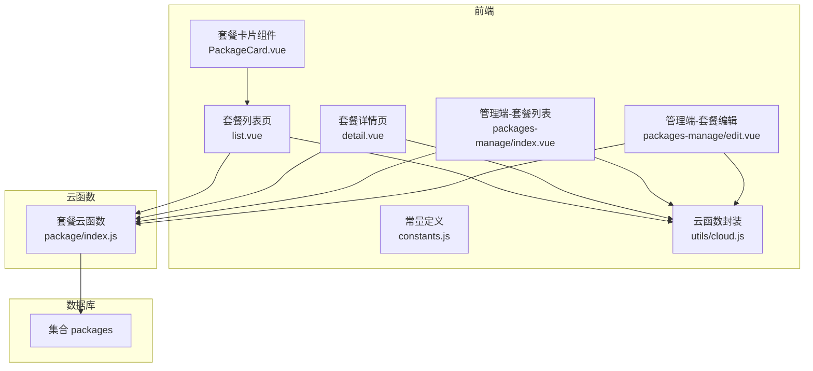
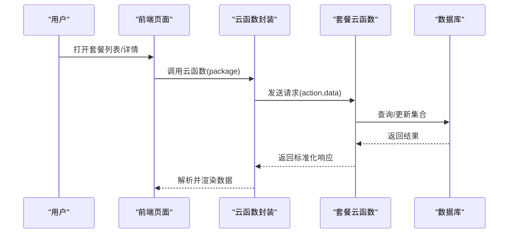
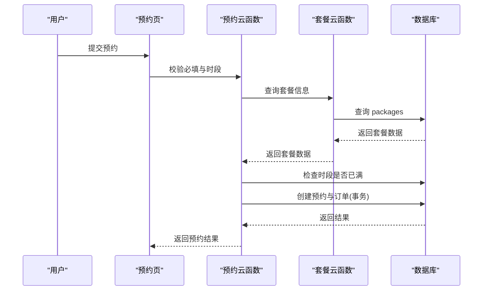
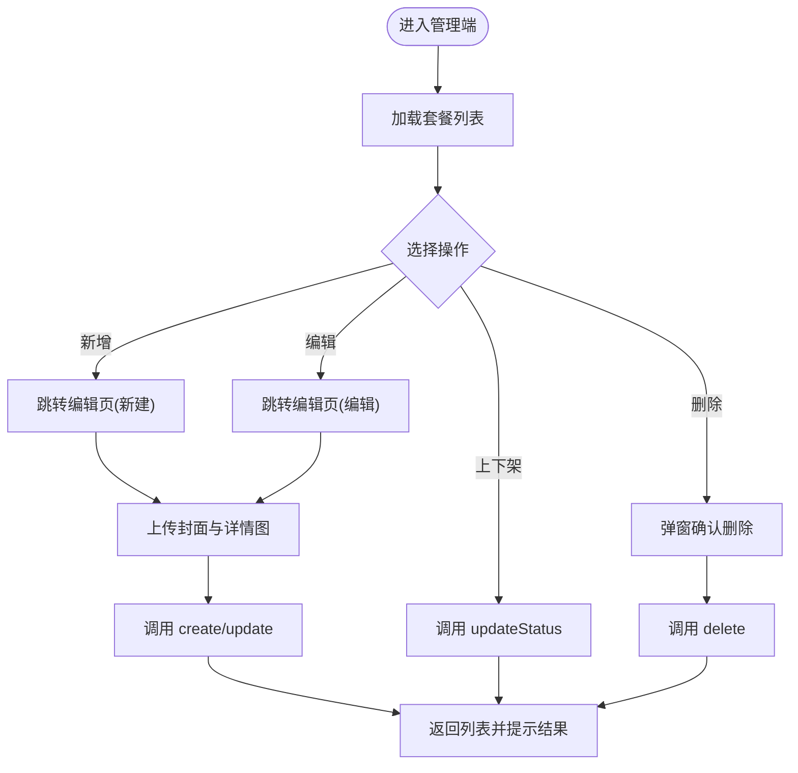
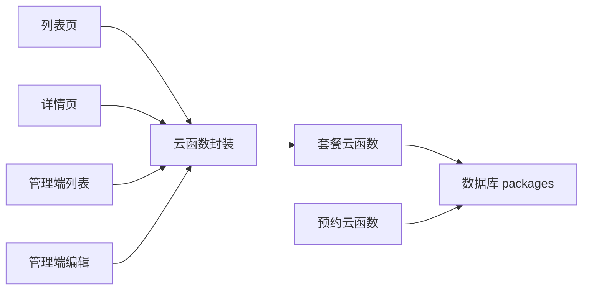

# 套餐模型

<cite>
**本文档引用的文件**
- [miniprogram/src/pages/packages/list.vue](file://miniprogram/src/pages/packages/list.vue)
- [miniprogram/src/pages/packages/detail.vue](file://miniprogram/src/pages/packages/detail.vue)
- [miniprogram/src/components/PackageCard.vue](file://miniprogram/src/components/PackageCard.vue)
- [miniprogram/cloudfunctions/package/index.js](file://miniprogram/cloudfunctions/package/index.js)
- [miniprogram/src/pages-admin/packages-manage/index.vue](file://miniprogram/src/pages-admin/packages-manage/index.vue)
- [miniprogram/src/pages-admin/packages-manage/edit.vue](file://miniprogram/src/pages-admin/packages-manage/edit.vue)
- [miniprogram/src/utils/constants.js](file://miniprogram/src/utils/constants.js)
- [miniprogram/src/utils/cloud.js](file://miniprogram/src/utils/cloud.js)
- [miniprogram/cloudfunctions/booking/index.js](file://miniprogram/cloudfunctions/booking/index.js)
</cite>

## 目录
1. [简介](#简介)
2. [项目结构](#项目结构)
3. [核心组件](#核心组件)
4. [架构总览](#架构总览)
5. [详细组件分析](#详细组件分析)
6. [依赖关系分析](#依赖关系分析)
7. [性能考虑](#性能考虑)
8. [故障排查指南](#故障排查指南)
9. [结论](#结论)
10. [附录](#附录)

## 简介
本文件围绕“套餐模型”进行系统化梳理，覆盖前端页面、云函数后端、常量配置以及与预约系统的关联关系。重点阐述：
- 套餐数据结构字段定义与含义
- 展示逻辑、排序规则与搜索过滤机制
- 套餐与预约系统的关联、防超卖与库存管理
- 套餐编辑、上下架、图片管理的完整业务流程
- 缓存策略与性能优化措施
- 套餐详情页的数据加载与渲染逻辑

## 项目结构
本项目采用前后端分离的云开发模式，前端使用 uni-app，云函数通过 wx-server-sdk 访问云数据库。套餐模块涉及以下关键文件：
- 前端页面：套餐列表、套餐详情、套餐卡片组件
- 后端云函数：套餐 CRUD、状态更新、列表查询
- 管理端：套餐管理列表、套餐编辑表单
- 常量与工具：分类常量、云函数封装

图表来源
- [miniprogram/src/pages/packages/list.vue:57-131](file://miniprogram/src/pages/packages/list.vue#L57-L131)
- [miniprogram/src/pages/packages/detail.vue:141-251](file://miniprogram/src/pages/packages/detail.vue#L141-L251)
- [miniprogram/src/components/PackageCard.vue:21-31](file://miniprogram/src/components/PackageCard.vue#L21-L31)
- [miniprogram/src/pages-admin/packages-manage/index.vue:83-279](file://miniprogram/src/pages-admin/packages-manage/index.vue#L83-L279)
- [miniprogram/src/pages-admin/packages-manage/edit.vue:226-514](file://miniprogram/src/pages-admin/packages-manage/edit.vue#L226-L514)
- [miniprogram/src/utils/constants.js:5-11](file://miniprogram/src/utils/constants.js#L5-L11)
- [miniprogram/src/utils/cloud.js:5-26](file://miniprogram/src/utils/cloud.js#L5-L26)
- [miniprogram/cloudfunctions/package/index.js:26-58](file://miniprogram/cloudfunctions/package/index.js#L26-L58)

章节来源
- [miniprogram/src/pages/packages/list.vue:1-305](file://miniprogram/src/pages/packages/list.vue#L1-L305)
- [miniprogram/src/pages/packages/detail.vue:1-598](file://miniprogram/src/pages/packages/detail.vue#L1-L598)
- [miniprogram/src/components/PackageCard.vue:1-100](file://miniprogram/src/components/PackageCard.vue#L1-L100)
- [miniprogram/src/pages-admin/packages-manage/index.vue:1-500](file://miniprogram/src/pages-admin/packages-manage/index.vue#L1-L500)
- [miniprogram/src/pages-admin/packages-manage/edit.vue:1-864](file://miniprogram/src/pages-admin/packages-manage/edit.vue#L1-L864)
- [miniprogram/src/utils/constants.js:1-73](file://miniprogram/src/utils/constants.js#L1-L73)
- [miniprogram/src/utils/cloud.js:1-66](file://miniprogram/src/utils/cloud.js#L1-L66)
- [miniprogram/cloudfunctions/package/index.js:1-222](file://miniprogram/cloudfunctions/package/index.js#L1-L222)

## 核心组件
- 套餐列表页：负责分类筛选、加载套餐列表、骨架屏与空状态展示
- 套餐详情页：负责轮播图、价格与定金展示、服务详情、收藏与预约跳转
- 套餐卡片组件：复用在列表页，承载封面图、名称、描述、价格与标签
- 管理端套餐列表：分页加载、上下架切换、删除确认、新增入口
- 管理端套餐编辑：表单校验、封面与详情图上传、保存创建或更新
- 常量定义：套餐分类、预约时段、状态枚举等
- 云函数封装：统一调用云函数与文件上传

章节来源
- [miniprogram/src/pages/packages/list.vue:57-131](file://miniprogram/src/pages/packages/list.vue#L57-L131)
- [miniprogram/src/pages/packages/detail.vue:141-251](file://miniprogram/src/pages/packages/detail.vue#L141-L251)
- [miniprogram/src/components/PackageCard.vue:21-31](file://miniprogram/src/components/PackageCard.vue#L21-L31)
- [miniprogram/src/pages-admin/packages-manage/index.vue:83-279](file://miniprogram/src/pages-admin/packages-manage/index.vue#L83-L279)
- [miniprogram/src/pages-admin/packages-manage/edit.vue:226-514](file://miniprogram/src/pages-admin/packages-manage/edit.vue#L226-L514)
- [miniprogram/src/utils/constants.js:5-11](file://miniprogram/src/utils/constants.js#L5-L11)
- [miniprogram/src/utils/cloud.js:5-26](file://miniprogram/src/utils/cloud.js#L5-L26)

## 架构总览
前端通过云函数封装调用云函数，云函数访问数据库中的 packages 集合，实现套餐的增删改查与状态变更；管理端具备管理员权限校验，支持分页与上下架控制；前端详情页与列表页均依赖云函数提供的接口。

图表来源
- [miniprogram/src/utils/cloud.js:5-26](file://miniprogram/src/utils/cloud.js#L5-L26)
- [miniprogram/cloudfunctions/package/index.js:26-58](file://miniprogram/cloudfunctions/package/index.js#L26-L58)

章节来源
- [miniprogram/src/utils/cloud.js:1-66](file://miniprogram/src/utils/cloud.js#L1-L66)
- [miniprogram/cloudfunctions/package/index.js:1-222](file://miniprogram/cloudfunctions/package/index.js#L1-L222)

## 详细组件分析

### 套餐数据结构与字段定义
根据前端页面与管理端编辑表单，套餐数据结构包含以下字段（按用途分类）：
- 基本信息
  - _id：套餐唯一标识（数据库自动生成）
  - name：套餐名称
  - category：套餐分类（basic/advanced/family/vip）
  - price：套餐价格（数字）
  - deposit：定金金额（数字）
  - status：上架状态（active/inactive）
  - coverImage：封面图（云存储文件ID）
  - detailImages：详情图片数组（云存储文件ID数组）
  - description：详细描述（字符串）
  - tag：标签（字符串，如热卖、新品）
- 服务详情
  - duration：拍摄时长（分钟）
  - costumeCount：服装套数
  - retouchCount：精修张数
  - features：包含服务/特色亮点（字符串数组）
- 时间戳
  - createTime/updateTime：创建与更新时间（服务端时间）

字段来源与含义说明
- 分类与标签：由常量定义提供，前端用于展示与筛选
- 价格与定金：用于页面展示与预约流程
- 图片数组：封面图与详情图，支持多图上传
- 服务详情：拍摄时长、服装套数、精修张数等
- 状态：前端用户端仅展示上架状态，管理端可切换

章节来源
- [miniprogram/src/pages/packages/detail.vue:35-115](file://miniprogram/src/pages/packages/detail.vue#L35-L115)
- [miniprogram/src/pages-admin/packages-manage/edit.vue:240-254](file://miniprogram/src/pages-admin/packages-manage/edit.vue#L240-L254)
- [miniprogram/src/utils/constants.js:5-11](file://miniprogram/src/utils/constants.js#L5-L11)
- [miniprogram/cloudfunctions/package/index.js:119-123](file://miniprogram/cloudfunctions/package/index.js#L119-L123)

### 展示逻辑与排序规则
- 列表页展示
  - 分类标签栏：支持“全部”与四个分类，点击切换后发起请求
  - 排序规则：按 sortOrder 升序排列（云函数侧）
  - 筛选条件：用户端仅返回 status='on' 的套餐
  - 加载态：骨架屏与空状态提示
- 详情页展示
  - 轮播图：封面图与详情图组合，支持预览
  - 价格与定金：展示套餐价格与定金信息
  - 服务详情网格：拍摄时长、服装套数、精修张数
  - 特色与描述：features 与 description 字段
  - 底部操作：收藏与立即预约跳转

章节来源
- [miniprogram/src/pages/packages/list.vue:64-131](file://miniprogram/src/pages/packages/list.vue#L64-L131)
- [miniprogram/cloudfunctions/package/index.js:61-86](file://miniprogram/cloudfunctions/package/index.js#L61-L86)
- [miniprogram/src/pages/packages/detail.vue:3-138](file://miniprogram/src/pages/packages/detail.vue#L3-L138)

### 搜索与过滤机制
- 分类过滤：列表页通过分类参数传递给云函数，实现按分类筛选
- 状态过滤：用户端请求自动附加 status='on' 条件
- 排序：按 sortOrder 升序排序
- 管理端：支持分页加载与状态切换

章节来源
- [miniprogram/src/pages/packages/list.vue:94-125](file://miniprogram/src/pages/packages/list.vue#L94-L125)
- [miniprogram/cloudfunctions/package/index.js:61-86](file://miniprogram/cloudfunctions/package/index.js#L61-L86)
- [miniprogram/src/pages-admin/packages-manage/index.vue:120-181](file://miniprogram/src/pages-admin/packages-manage/index.vue#L120-L181)

### 套餐与预约系统的关联关系
- 关联点
  - 预约创建时会查询套餐信息，获取套餐名称与价格
  - 预约流程中使用套餐价格作为总价与定金
- 防超卖与库存管理
  - 预约系统通过时间段配额限制（每时段最大预约数），在创建预约时再次校验，避免并发导致的超卖
  - 云函数内使用事务保证预约与订单的一致性
- 管理端上下架
  - 管理端可切换套餐状态为 active/inactive
  - 用户端仅展示 status='on' 的套餐，避免用户看到下架套餐

图表来源
- [miniprogram/cloudfunctions/booking/index.js:98-179](file://miniprogram/cloudfunctions/booking/index.js#L98-L179)
- [miniprogram/cloudfunctions/package/index.js:88-107](file://miniprogram/cloudfunctions/package/index.js#L88-L107)

章节来源
- [miniprogram/cloudfunctions/booking/index.js:48-93](file://miniprogram/cloudfunctions/booking/index.js#L48-L93)
- [miniprogram/cloudfunctions/booking/index.js:98-179](file://miniprogram/cloudfunctions/booking/index.js#L98-L179)
- [miniprogram/cloudfunctions/package/index.js:88-107](file://miniprogram/cloudfunctions/package/index.js#L88-L107)

### 套餐编辑、上下架、图片管理业务流程
- 管理端列表
  - 分页加载：支持下拉刷新与加载更多
  - 上下架切换：调用 updateStatus 云函数，更新 status 并返回结果
  - 删除确认：弹窗确认后调用 delete 云函数
  - 新增/编辑：跳转至编辑页
- 编辑页
  - 表单校验：名称、分类、价格、定金、封面图必填
  - 图片上传：封面图与详情图分别上传至云存储，返回 fileID
  - 保存：根据是否存在 id 决定 create 或 update
- 权限控制
  - 所有编辑操作均校验管理员角色

图表来源
- [miniprogram/src/pages-admin/packages-manage/index.vue:120-279](file://miniprogram/src/pages-admin/packages-manage/index.vue#L120-L279)
- [miniprogram/src/pages-admin/packages-manage/edit.vue:287-455](file://miniprogram/src/pages-admin/packages-manage/edit.vue#L287-L455)
- [miniprogram/cloudfunctions/package/index.js:109-187](file://miniprogram/cloudfunctions/package/index.js#L109-L187)

章节来源
- [miniprogram/src/pages-admin/packages-manage/index.vue:83-279](file://miniprogram/src/pages-admin/packages-manage/index.vue#L83-L279)
- [miniprogram/src/pages-admin/packages-manage/edit.vue:226-514](file://miniprogram/src/pages-admin/packages-manage/edit.vue#L226-L514)
- [miniprogram/cloudfunctions/package/index.js:109-187](file://miniprogram/cloudfunctions/package/index.js#L109-L187)

### 套餐详情页数据加载与渲染逻辑
- 数据加载
  - 通过云函数 package/detail 获取套餐详情
  - 设置页面标题为套餐名称
- 渲染逻辑
  - 轮播图：封面图与详情图组合，支持预览
  - 价格与定金：展示套餐价格与定金
  - 服务详情网格：拍摄时长、服装套数、精修张数
  - 特色与描述：features 与 description
  - 底部操作：收藏与立即预约跳转

章节来源
- [miniprogram/src/pages/packages/detail.vue:202-251](file://miniprogram/src/pages/packages/detail.vue#L202-L251)
- [miniprogram/src/pages/packages/detail.vue:3-138](file://miniprogram/src/pages/packages/detail.vue#L3-L138)

## 依赖关系分析
- 前端页面依赖云函数封装，统一调用云函数
- 套餐云函数依赖数据库 packages 集合
- 管理端依赖管理员权限校验
- 预约系统依赖套餐信息与时间段配额

图表来源
- [miniprogram/src/utils/cloud.js:5-26](file://miniprogram/src/utils/cloud.js#L5-L26)
- [miniprogram/cloudfunctions/package/index.js:26-58](file://miniprogram/cloudfunctions/package/index.js#L26-L58)
- [miniprogram/cloudfunctions/booking/index.js:67-93](file://miniprogram/cloudfunctions/booking/index.js#L67-L93)

章节来源
- [miniprogram/src/utils/cloud.js:1-66](file://miniprogram/src/utils/cloud.js#L1-L66)
- [miniprogram/cloudfunctions/package/index.js:1-222](file://miniprogram/cloudfunctions/package/index.js#L1-L222)
- [miniprogram/cloudfunctions/booking/index.js:1-462](file://miniprogram/cloudfunctions/booking/index.js#L1-L462)

## 性能考虑
- 列表加载优化
  - 骨架屏与空状态减少白屏时间
  - 分类切换触发请求，避免一次性加载过多数据
- 图片优化
  - 详情页轮播图支持预览，建议使用合适的图片尺寸与格式
  - 管理端支持封面图与详情图上传，建议压缩后再上传
- 请求与并发
  - 预约创建时使用事务与二次校验，避免超卖
  - 列表页按 sortOrder 升序排序，减少前端排序成本
- 缓存策略
  - 前端未见显式缓存逻辑，建议在详情页与列表页增加本地缓存与失效策略，以降低重复请求次数

章节来源
- [miniprogram/src/pages/packages/list.vue:25-54](file://miniprogram/src/pages/packages/list.vue#L25-L54)
- [miniprogram/src/pages/packages/detail.vue:177-184](file://miniprogram/src/pages/packages/detail.vue#L177-L184)
- [miniprogram/cloudfunctions/booking/index.js:150-179](file://miniprogram/cloudfunctions/booking/index.js#L150-L179)

## 故障排查指南
- 云函数调用失败
  - 检查云函数名称与参数是否正确
  - 查看返回的错误码与消息
- 权限问题
  - 管理端操作需管理员角色，否则返回无权限
- 数据异常
  - 套餐不存在或参数为空时，云函数会返回相应错误
- 图片上传失败
  - 检查文件路径与云存储权限
- 预约超卖
  - 预约创建时会再次校验时段配额，若已满则提示选择其他时段

章节来源
- [miniprogram/src/utils/cloud.js:5-26](file://miniprogram/src/utils/cloud.js#L5-L26)
- [miniprogram/cloudfunctions/package/index.js:7-24](file://miniprogram/cloudfunctions/package/index.js#L7-L24)
- [miniprogram/cloudfunctions/package/index.js:92-100](file://miniprogram/cloudfunctions/package/index.js#L92-L100)
- [miniprogram/cloudfunctions/booking/index.js:114-118](file://miniprogram/cloudfunctions/booking/index.js#L114-L118)

## 结论
本套餐模型通过清晰的前后端职责划分与云函数封装，实现了套餐的完整生命周期管理。前端提供良好的用户体验（骨架屏、轮播图、收藏与预约跳转），后端通过权限校验与事务保障数据一致性。结合预约系统的时段配额与二次校验，有效避免超卖。建议后续引入前端缓存策略与更细粒度的错误处理，进一步提升稳定性与性能。

## 附录
- 套餐分类常量：basic、advanced、family、vip
- 预约时段常量：morning、afternoon、golden
- 状态枚举：pending、confirmed、shooting、retouching、completed、cancelled

章节来源
- [miniprogram/src/utils/constants.js:5-27](file://miniprogram/src/utils/constants.js#L5-L27)