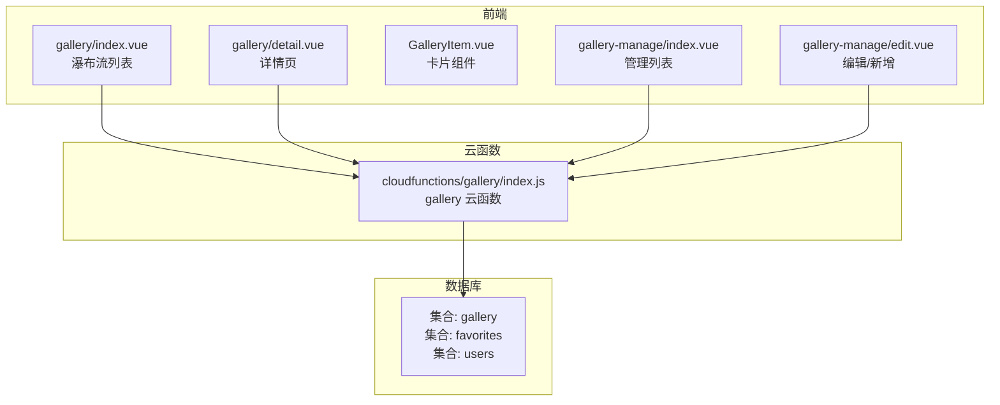
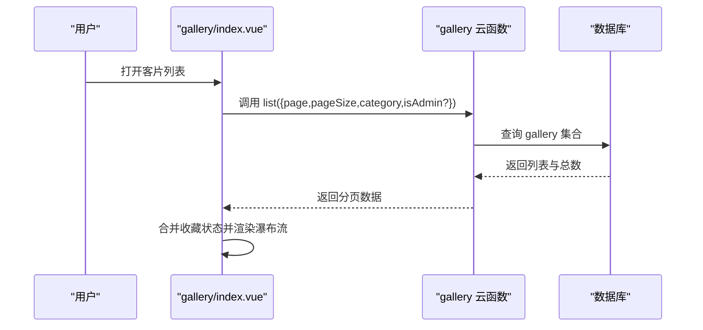
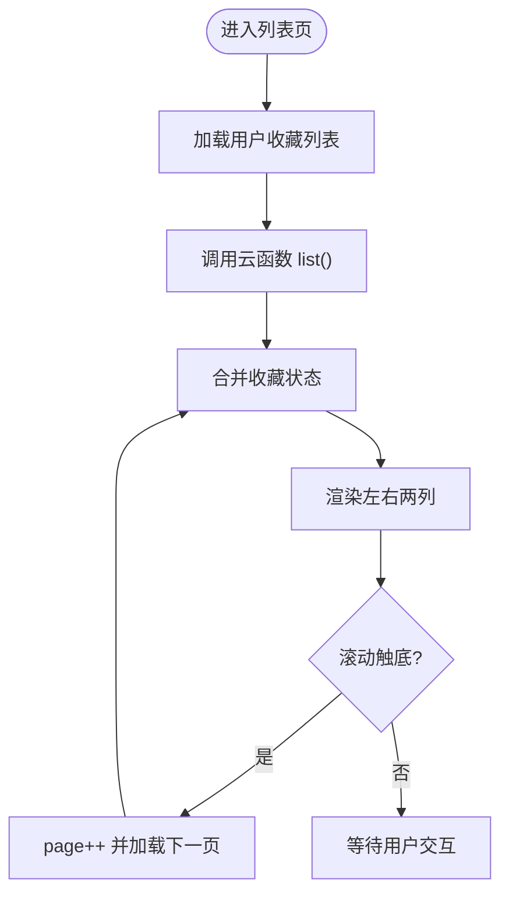
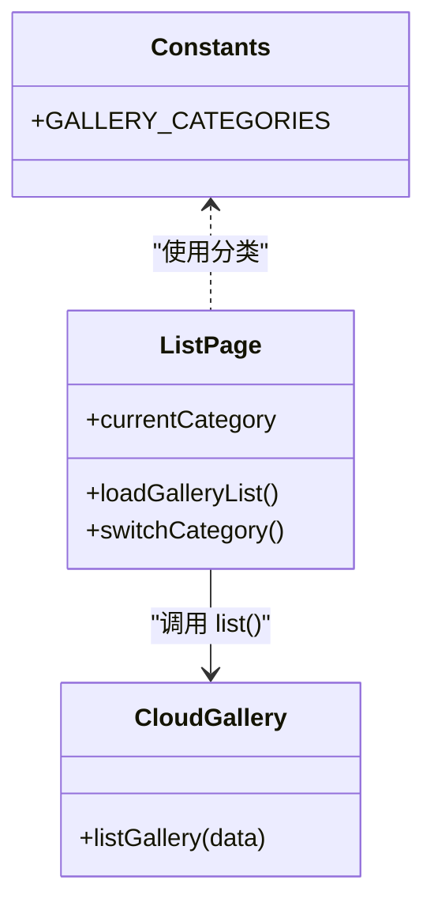
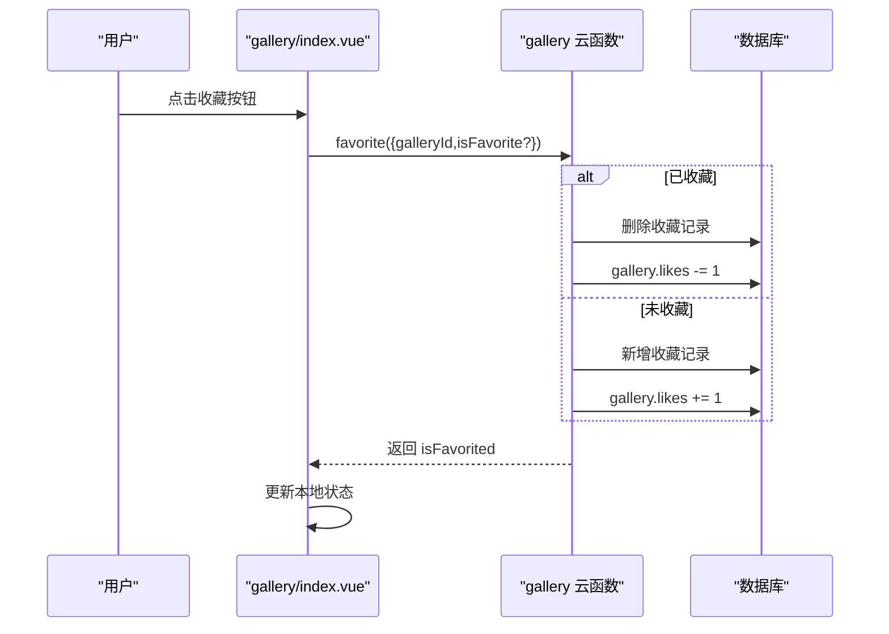
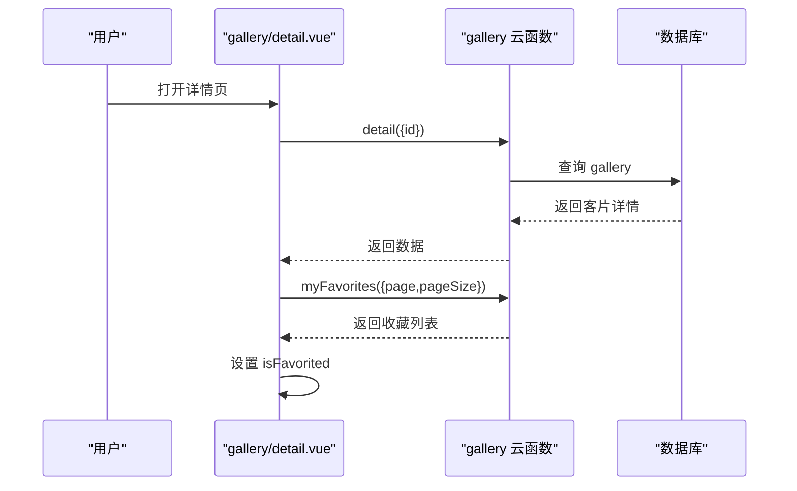
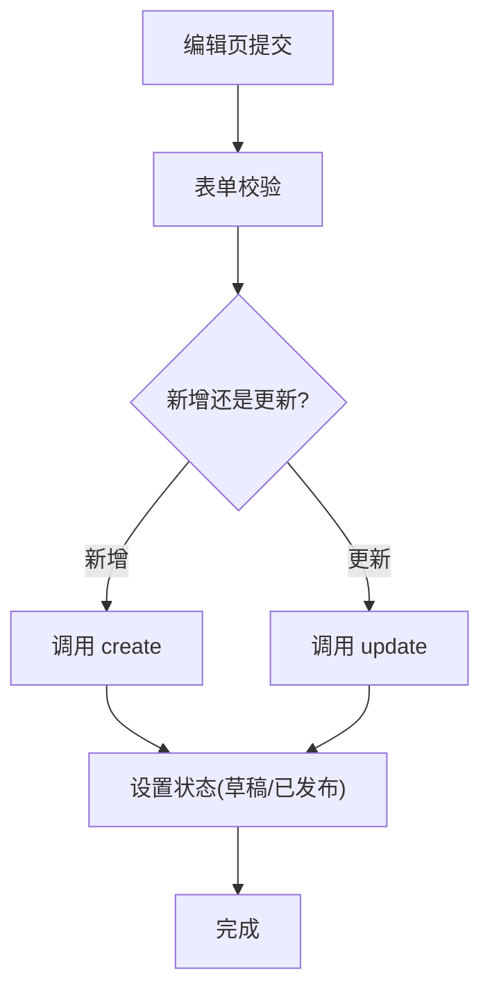
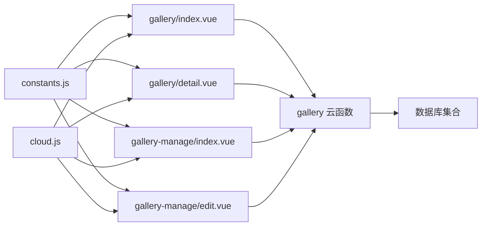

# 客片模型

<cite>
**本文档引用的文件**
- [miniprogram/cloudfunctions/gallery/index.js](file://miniprogram/cloudfunctions/gallery/index.js)
- [miniprogram/src/pages/gallery/index.vue](file://miniprogram/src/pages/gallery/index.vue)
- [miniprogram/src/pages/gallery/detail.vue](file://miniprogram/src/pages/gallery/detail.vue)
- [miniprogram/src/components/GalleryItem.vue](file://miniprogram/src/components/GalleryItem.vue)
- [miniprogram/src/pages-admin/gallery-manage/index.vue](file://miniprogram/src/pages-admin/gallery-manage/index.vue)
- [miniprogram/src/pages-admin/gallery-manage/edit.vue](file://miniprogram/src/pages-admin/gallery-manage/edit.vue)
- [miniprogram/src/utils/constants.js](file://miniprogram/src/utils/constants.js)
- [miniprogram/src/utils/cloud.js](file://miniprogram/src/utils/cloud.js)
- [miniprogram/cloudfunctions/gallery/package.json](file://miniprogram/cloudfunctions/gallery/package.json)
</cite>

## 目录
1. [简介](#简介)
2. [项目结构](#项目结构)
3. [核心组件](#核心组件)
4. [架构总览](#架构总览)
5. [详细组件分析](#详细组件分析)
6. [依赖关系分析](#依赖关系分析)
7. [性能考虑](#性能考虑)
8. [故障排查指南](#故障排查指南)
9. [结论](#结论)
10. [附录](#附录)

## 简介
本文件面向“客片展示系统”的数据结构与实现，围绕以下目标展开：
- 客片数据模型：字段定义、状态管理与业务含义
- 展示层：瀑布流布局与懒加载机制
- 分类与标签：多维筛选与搜索能力
- 管理端：上传、审核、发布的工作流
- 存储与优化：CDN存储策略与图片压缩
- 详情页：数据结构与相关推荐思路

## 项目结构
系统采用“前端页面 + 云函数 + 数据库”的三层架构：
- 前端页面负责用户交互与展示（瀑布流、详情页、管理后台）
- 云函数封装数据访问与业务逻辑（列表、详情、收藏、CRUD）
- 数据库使用微信云开发（集合：gallery、favorites、users）

图表来源
- [miniprogram/src/pages/gallery/index.vue:1-533](file://miniprogram/src/pages/gallery/index.vue#L1-L533)
- [miniprogram/src/pages/gallery/detail.vue:1-450](file://miniprogram/src/pages/gallery/detail.vue#L1-L450)
- [miniprogram/src/pages-admin/gallery-manage/index.vue:1-524](file://miniprogram/src/pages-admin/gallery-manage/index.vue#L1-L524)
- [miniprogram/src/pages-admin/gallery-manage/edit.vue:1-808](file://miniprogram/src/pages-admin/gallery-manage/edit.vue#L1-L808)
- [miniprogram/cloudfunctions/gallery/index.js:1-360](file://miniprogram/cloudfunctions/gallery/index.js#L1-L360)

章节来源
- [miniprogram/src/pages/gallery/index.vue:1-533](file://miniprogram/src/pages/gallery/index.vue#L1-L533)
- [miniprogram/src/pages/gallery/detail.vue:1-450](file://miniprogram/src/pages/gallery/detail.vue#L1-L450)
- [miniprogram/src/pages-admin/gallery-manage/index.vue:1-524](file://miniprogram/src/pages-admin/gallery-manage/index.vue#L1-L524)
- [miniprogram/src/pages-admin/gallery-manage/edit.vue:1-808](file://miniprogram/src/pages-admin/gallery-manage/edit.vue#L1-L808)
- [miniprogram/cloudfunctions/gallery/index.js:1-360](file://miniprogram/cloudfunctions/gallery/index.js#L1-L360)

## 核心组件
- 客片列表页：瀑布流展示、分类筛选、分页加载、收藏状态标记
- 客片详情页：大图轮播、文案与拍摄信息展示、收藏操作
- 管理后台：客片列表、状态切换、新增/编辑、删除
- 云函数：提供 list/detail/create/update/delete/favorite/myFavorites/checkFavorite 等接口
- 常量与工具：分类常量、云函数调用封装、文件上传/下载

章节来源
- [miniprogram/src/pages/gallery/index.vue:1-533](file://miniprogram/src/pages/gallery/index.vue#L1-L533)
- [miniprogram/src/pages/gallery/detail.vue:1-450](file://miniprogram/src/pages/gallery/detail.vue#L1-L450)
- [miniprogram/src/pages-admin/gallery-manage/index.vue:1-524](file://miniprogram/src/pages-admin/gallery-manage/index.vue#L1-L524)
- [miniprogram/src/pages-admin/gallery-manage/edit.vue:1-808](file://miniprogram/src/pages-admin/gallery-manage/edit.vue#L1-L808)
- [miniprogram/cloudfunctions/gallery/index.js:1-360](file://miniprogram/cloudfunctions/gallery/index.js#L1-L360)
- [miniprogram/src/utils/constants.js:1-73](file://miniprogram/src/utils/constants.js#L1-L73)
- [miniprogram/src/utils/cloud.js:1-66](file://miniprogram/src/utils/cloud.js#L1-L66)

## 架构总览
前端通过云函数调用实现与数据库的解耦；云函数统一进行权限校验与数据聚合，前端仅关注展示与交互。

图表来源
- [miniprogram/src/pages/gallery/index.vue:144-189](file://miniprogram/src/pages/gallery/index.vue#L144-L189)
- [miniprogram/cloudfunctions/gallery/index.js:67-103](file://miniprogram/cloudfunctions/gallery/index.js#L67-L103)

章节来源
- [miniprogram/src/pages/gallery/index.vue:144-189](file://miniprogram/src/pages/gallery/index.vue#L144-L189)
- [miniprogram/cloudfunctions/gallery/index.js:67-103](file://miniprogram/cloudfunctions/gallery/index.js#L67-L103)

## 详细组件分析

### 客片数据模型
- 字段概览（基于云函数与管理端表单）：
  - id：客片唯一标识（数据库自增主键）
  - 标题：字符串，必填
  - 分类：枚举值（如“陵前写真”、“草原旅拍”等）
  - 标签：数组，最多5个
  - 封面图：字符串（云存储 fileID）
  - 图片集：数组（云存储 fileID 数组）
  - 朋友圈文案：字符串
  - 状态：枚举（草稿/已发布）
  - 点赞数：整数（由收藏操作维护）
  - 创建时间/更新时间：服务端时间
- 状态与可见性：
  - 用户端仅展示 status='published' 的客片
  - 管理端可查看草稿与已发布

章节来源
- [miniprogram/cloudfunctions/gallery/index.js:136-141](file://miniprogram/cloudfunctions/gallery/index.js#L136-L141)
- [miniprogram/cloudfunctions/gallery/index.js:77-80](file://miniprogram/cloudfunctions/gallery/index.js#L77-L80)
- [miniprogram/src/pages-admin/gallery-manage/edit.vue:181-189](file://miniprogram/src/pages-admin/gallery-manage/edit.vue#L181-L189)
- [miniprogram/src/pages-admin/gallery-manage/edit.vue:348-356](file://miniprogram/src/pages-admin/gallery-manage/edit.vue#L348-L356)

### 瀑布流展示与懒加载
- 布局策略：
  - 使用两个列（leftColumn/rightColumn），通过索引奇偶分配到左右两列，形成视觉上的瀑布流效果
- 懒加载与分页：
  - 列表页默认每页10条，触底加载更多，下拉刷新重置页码
  - 通过 hasMore 控制是否继续加载
- 收藏状态标记：
  - 首次加载时拉取用户收藏列表，缓存到 Set 中，后续列表项按 id 标记 isFavorited

图表来源
- [miniprogram/src/pages/gallery/index.vue:116-123](file://miniprogram/src/pages/gallery/index.vue#L116-L123)
- [miniprogram/src/pages/gallery/index.vue:128-142](file://miniprogram/src/pages/gallery/index.vue#L128-L142)
- [miniprogram/src/pages/gallery/index.vue:144-189](file://miniprogram/src/pages/gallery/index.vue#L144-L189)

章节来源
- [miniprogram/src/pages/gallery/index.vue:116-123](file://miniprogram/src/pages/gallery/index.vue#L116-L123)
- [miniprogram/src/pages/gallery/index.vue:128-142](file://miniprogram/src/pages/gallery/index.vue#L128-L142)
- [miniprogram/src/pages/gallery/index.vue:144-189](file://miniprogram/src/pages/gallery/index.vue#L144-L189)

### 分类管理与标签系统
- 分类常量：
  - GALLERY_CATEGORIES 提供分类枚举，支持“全部/陵前写真/草原旅拍/情侣私奔/儿童成长”
- 前端筛选：
  - 列表页顶部横向滚动分类标签，点击切换当前分类
  - 云函数根据分类条件构造 where 条件
- 标签：
  - 前端卡片显示标签列表
  - 管理端表单支持最多5个标签，输入去重与长度限制

图表来源
- [miniprogram/src/utils/constants.js:13-20](file://miniprogram/src/utils/constants.js#L13-L20)
- [miniprogram/src/pages/gallery/index.vue:191-199](file://miniprogram/src/pages/gallery/index.vue#L191-L199)
- [miniprogram/cloudfunctions/gallery/index.js:67-103](file://miniprogram/cloudfunctions/gallery/index.js#L67-L103)

章节来源
- [miniprogram/src/utils/constants.js:13-20](file://miniprogram/src/utils/constants.js#L13-L20)
- [miniprogram/src/pages/gallery/index.vue:191-199](file://miniprogram/src/pages/gallery/index.vue#L191-L199)
- [miniprogram/cloudfunctions/gallery/index.js:67-103](file://miniprogram/cloudfunctions/gallery/index.js#L67-L103)

### 收藏与点赞机制
- 收藏流程：
  - 调用云函数 favorite，查询是否存在收藏记录
  - 若存在则取消收藏并减少点赞数；否则新增收藏并增加点赞数
  - 前端即时更新本地 isFavorited 状态
- 我的收藏：
  - 云函数 myFavorites 拉取收藏记录并联表查询 gallery（仅 published）

图表来源
- [miniprogram/src/pages/gallery/index.vue:218-241](file://miniprogram/src/pages/gallery/index.vue#L218-L241)
- [miniprogram/cloudfunctions/gallery/index.js:227-283](file://miniprogram/cloudfunctions/gallery/index.js#L227-L283)
- [miniprogram/cloudfunctions/gallery/index.js:285-339](file://miniprogram/cloudfunctions/gallery/index.js#L285-L339)

章节来源
- [miniprogram/src/pages/gallery/index.vue:218-241](file://miniprogram/src/pages/gallery/index.vue#L218-L241)
- [miniprogram/cloudfunctions/gallery/index.js:227-283](file://miniprogram/cloudfunctions/gallery/index.js#L227-L283)
- [miniprogram/cloudfunctions/gallery/index.js:285-339](file://miniprogram/cloudfunctions/gallery/index.js#L285-L339)

### 详情页数据结构与交互
- 数据来源：
  - 调用云函数 detail 获取单条客片详情
  - 同步检查收藏状态（myFavorites）
- 展示内容：
  - 大图轮播（封面图或图片集）
  - 标题、分类标签、朋友圈文案、拍摄信息（地点/套餐）
- 操作：
  - 收藏/取消收藏、预览大图、复制文案

图表来源
- [miniprogram/src/pages/gallery/detail.vue:119-143](file://miniprogram/src/pages/gallery/detail.vue#L119-L143)
- [miniprogram/src/pages/gallery/detail.vue:145-159](file://miniprogram/src/pages/gallery/detail.vue#L145-L159)
- [miniprogram/cloudfunctions/gallery/index.js:105-124](file://miniprogram/cloudfunctions/gallery/index.js#L105-L124)
- [miniprogram/cloudfunctions/gallery/index.js:285-339](file://miniprogram/cloudfunctions/gallery/index.js#L285-L339)

章节来源
- [miniprogram/src/pages/gallery/detail.vue:119-143](file://miniprogram/src/pages/gallery/detail.vue#L119-L143)
- [miniprogram/src/pages/gallery/detail.vue:145-159](file://miniprogram/src/pages/gallery/detail.vue#L145-L159)
- [miniprogram/cloudfunctions/gallery/index.js:105-124](file://miniprogram/cloudfunctions/gallery/index.js#L105-L124)
- [miniprogram/cloudfunctions/gallery/index.js:285-339](file://miniprogram/cloudfunctions/gallery/index.js#L285-L339)

### 管理端工作流：上传、审核、展示
- 新增/编辑：
  - 管理员在编辑页填写标题、分类、标签、封面图、图片集、文案、发布状态
  - 表单校验后调用 create 或 update
- 发布/下架：
  - 管理端可直接切换 status=draft/published
- 删除：
  - 删除客片时开启事务，同时清理相关收藏记录

图表来源
- [miniprogram/src/pages-admin/gallery-manage/edit.vue:340-391](file://miniprogram/src/pages-admin/gallery-manage/edit.vue#L340-L391)
- [miniprogram/src/pages-admin/gallery-manage/index.vue:199-235](file://miniprogram/src/pages-admin/gallery-manage/index.vue#L199-L235)
- [miniprogram/cloudfunctions/gallery/index.js:126-182](file://miniprogram/cloudfunctions/gallery/index.js#L126-L182)
- [miniprogram/cloudfunctions/gallery/index.js:184-225](file://miniprogram/cloudfunctions/gallery/index.js#L184-L225)

章节来源
- [miniprogram/src/pages-admin/gallery-manage/edit.vue:340-391](file://miniprogram/src/pages-admin/gallery-manage/edit.vue#L340-L391)
- [miniprogram/src/pages-admin/gallery-manage/index.vue:199-235](file://miniprogram/src/pages-admin/gallery-manage/index.vue#L199-L235)
- [miniprogram/cloudfunctions/gallery/index.js:126-182](file://miniprogram/cloudfunctions/gallery/index.js#L126-L182)
- [miniprogram/cloudfunctions/gallery/index.js:184-225](file://miniprogram/cloudfunctions/gallery/index.js#L184-L225)

### CDN 存储策略与图片压缩
- 文件上传：
  - 编辑页使用 uploadFile 将图片上传至云存储，生成 fileID
  - 上传时使用压缩参数，减少体积
- 文件管理：
  - 云函数提供 getTempFileURL 获取临时链接，便于预览与展示
- 压缩与优化：
  - 上传时启用压缩（sizeType: ['compressed']）
  - 建议在云存储侧配置图片处理规则（如缩放、格式转换、质量压缩），以进一步降低带宽与加载时间

章节来源
- [miniprogram/src/pages-admin/gallery-manage/edit.vue:246-299](file://miniprogram/src/pages-admin/gallery-manage/edit.vue#L246-L299)
- [miniprogram/src/utils/cloud.js:28-49](file://miniprogram/src/utils/cloud.js#L28-L49)

### 相关推荐算法（概念性建议）
- 基于标签的相似度匹配：统计标签共现频次，为当前客片推荐具有相同/相近标签的客片
- 基于时间的热度：近期浏览/收藏量高的客片优先推荐
- 基于分类的随机采样：按分类均衡采样，避免热门分类过度集中
- 注意：以上为概念性建议，非现有实现

## 依赖关系分析
- 前端依赖：
  - gallery/index.vue 依赖 constants.js（分类）、cloud.js（云函数封装）
  - detail.vue 依赖 constants.js、cloud.js
  - 管理端依赖 cloud.js、constants.js
- 云函数依赖：
  - gallery 云函数依赖 wx-server-sdk，访问数据库与事务

图表来源
- [miniprogram/src/utils/constants.js:1-73](file://miniprogram/src/utils/constants.js#L1-L73)
- [miniprogram/src/utils/cloud.js:1-66](file://miniprogram/src/utils/cloud.js#L1-L66)
- [miniprogram/src/pages/gallery/index.vue:104-105](file://miniprogram/src/pages/gallery/index.vue#L104-L105)
- [miniprogram/src/pages/gallery/detail.vue:92-93](file://miniprogram/src/pages/gallery/detail.vue#L92-L93)
- [miniprogram/src/pages-admin/gallery-manage/index.vue:95-96](file://miniprogram/src/pages-admin/gallery-manage/index.vue#L95-L96)
- [miniprogram/src/pages-admin/gallery-manage/edit.vue:169-170](file://miniprogram/src/pages-admin/gallery-manage/edit.vue#L169-L170)
- [miniprogram/cloudfunctions/gallery/index.js:1-6](file://miniprogram/cloudfunctions/gallery/index.js#L1-L6)

章节来源
- [miniprogram/src/utils/constants.js:1-73](file://miniprogram/src/utils/constants.js#L1-L73)
- [miniprogram/src/utils/cloud.js:1-66](file://miniprogram/src/utils/cloud.js#L1-L66)
- [miniprogram/src/pages/gallery/index.vue:104-105](file://miniprogram/src/pages/gallery/index.vue#L104-L105)
- [miniprogram/src/pages/gallery/detail.vue:92-93](file://miniprogram/src/pages/gallery/detail.vue#L92-L93)
- [miniprogram/src/pages-admin/gallery-manage/index.vue:95-96](file://miniprogram/src/pages-admin/gallery-manage/index.vue#L95-L96)
- [miniprogram/src/pages-admin/gallery-manage/edit.vue:169-170](file://miniprogram/src/pages-admin/gallery-manage/edit.vue#L169-L170)
- [miniprogram/cloudfunctions/gallery/index.js:1-6](file://miniprogram/cloudfunctions/gallery/index.js#L1-L6)

## 性能考虑
- 渲染性能：
  - 瀑布流采用左右两列，减少 DOM 重排
  - 图片懒加载（lazy-load）与分页加载，降低首屏压力
- 网络性能：
  - 云函数统一聚合查询，减少前端多次请求
  - 上传时启用压缩，降低带宽占用
- 数据一致性：
  - 删除客片时使用事务，保证 gallery 与 favorites 的一致性

## 故障排查指南
- 列表为空或不更新：
  - 检查分类筛选是否误选
  - 确认 hasMore 与 page 状态
- 收藏状态不同步：
  - 确认 loadMyFavorites 是否成功拉取收藏列表
  - 检查 isFavorited 的赋值逻辑
- 详情页无法加载：
  - 检查 galleryId 参数传递
  - 确认云函数 detail 返回数据
- 上传失败：
  - 检查 uploadFile 返回的 fileID
  - 确认云存储权限与路径

章节来源
- [miniprogram/src/pages/gallery/index.vue:144-189](file://miniprogram/src/pages/gallery/index.vue#L144-L189)
- [miniprogram/src/pages/gallery/detail.vue:119-143](file://miniprogram/src/pages/gallery/detail.vue#L119-L143)
- [miniprogram/src/pages-admin/gallery-manage/edit.vue:246-299](file://miniprogram/src/pages-admin/gallery-manage/edit.vue#L246-L299)

## 结论
本系统通过清晰的数据模型、瀑布流展示与懒加载机制、完善的分类与标签体系、以及前后端分离的云函数架构，实现了高效稳定的客片展示与管理体验。管理端支持从上传到发布的完整工作流，前端提供良好的用户体验与性能保障。建议在云存储侧进一步完善图片处理规则，持续优化加载速度与带宽成本。

## 附录
- 关键字段清单（摘要）
  - id、title、category、tags、coverImage、images、momentsText、status、likes、createTime、updateTime
- 关键接口清单（摘要）
  - list、detail、create、update、delete、favorite、myFavorites、checkFavorite