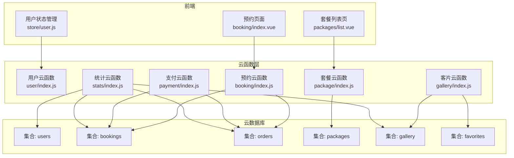
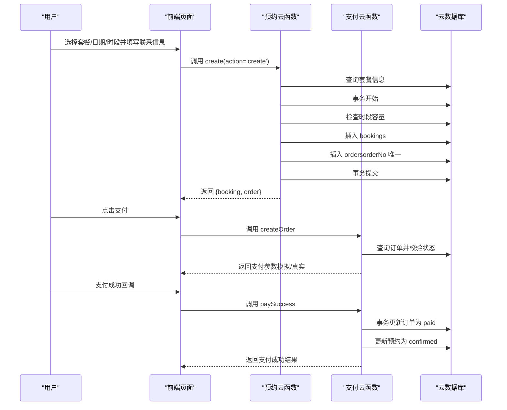
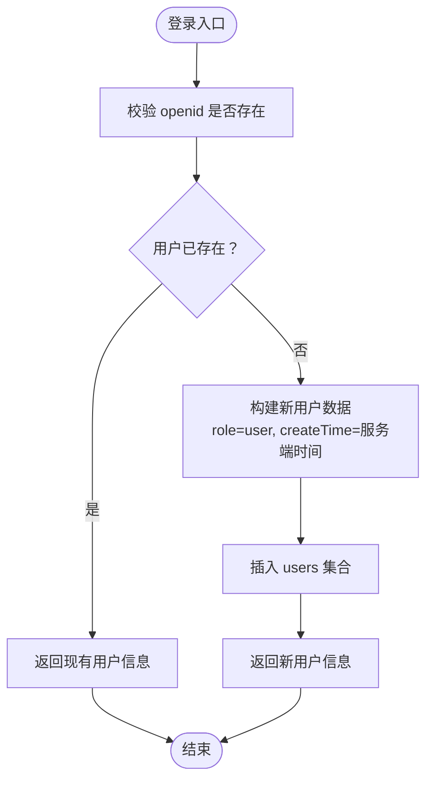
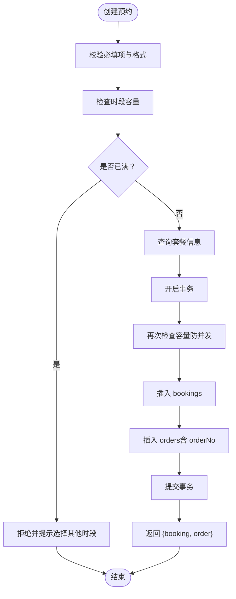
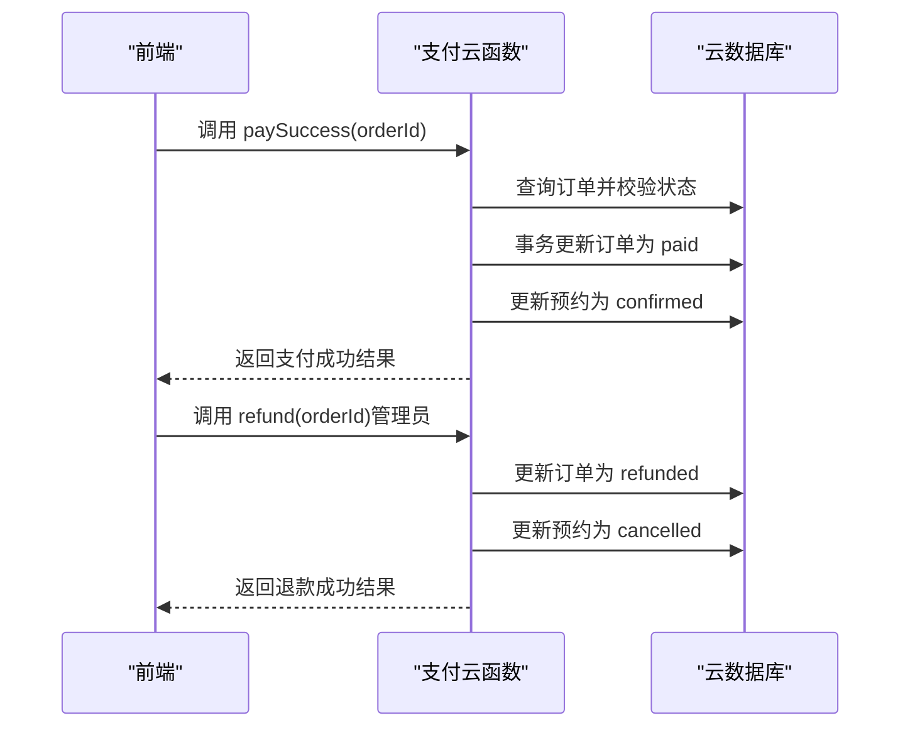
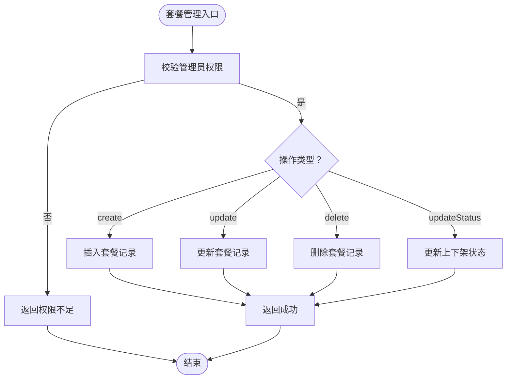
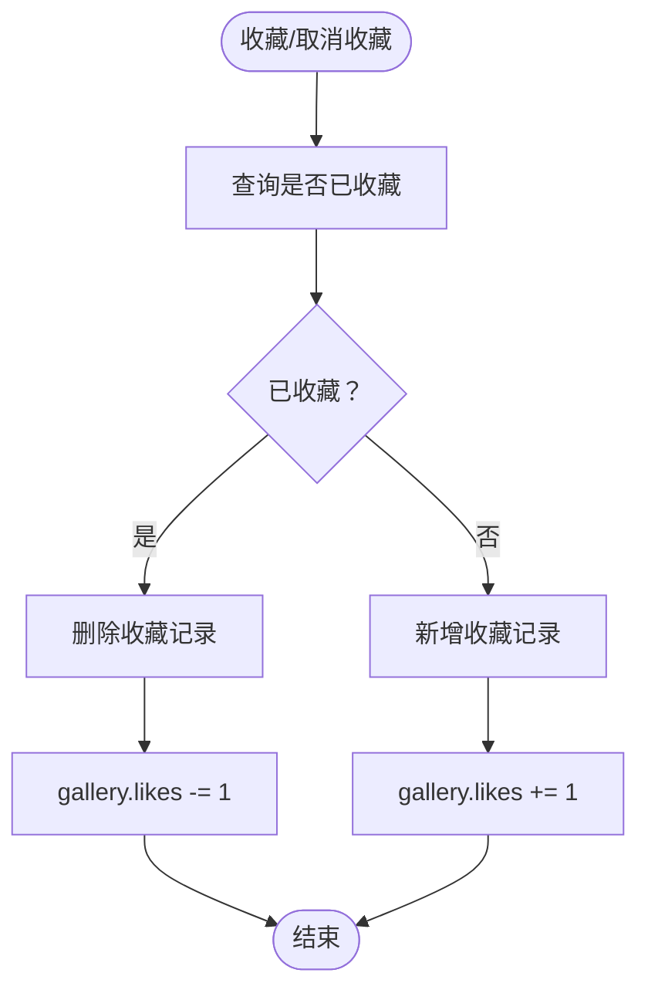
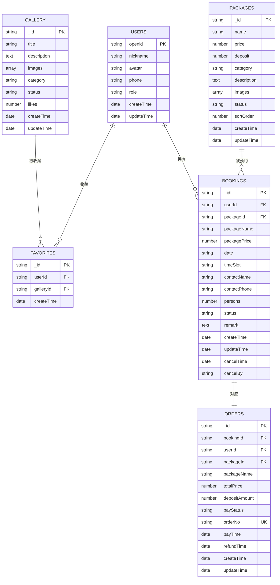

# 数据模型设计

<cite>
**本文档引用的文件**
- [miniprogram/src/store/user.js](file://miniprogram/src/store/user.js)
- [miniprogram/cloudfunctions/user/index.js](file://miniprogram/cloudfunctions/user/index.js)
- [miniprogram/cloudfunctions/booking/index.js](file://miniprogram/cloudfunctions/booking/index.js)
- [miniprogram/cloudfunctions/package/index.js](file://miniprogram/cloudfunctions/package/index.js)
- [miniprogram/cloudfunctions/gallery/index.js](file://miniprogram/cloudfunctions/gallery/index.js)
- [miniprogram/cloudfunctions/payment/index.js](file://miniprogram/cloudfunctions/payment/index.js)
- [miniprogram/cloudfunctions/stats/index.js](file://miniprogram/cloudfunctions/stats/index.js)
- [miniprogram/src/utils/constants.js](file://miniprogram/src/utils/constants.js)
- [miniprogram/src/pages/packages/list.vue](file://miniprogram/src/pages/packages/list.vue)
- [miniprogram/src/pages/booking/index.vue](file://miniprogram/src/pages/booking/index.vue)
</cite>

## 目录
1. [简介](#简介)
2. [项目结构](#项目结构)
3. [核心数据实体](#核心数据实体)
4. [架构总览](#架构总览)
5. [详细组件分析](#详细组件分析)
6. [依赖关系分析](#依赖关系分析)
7. [性能考量](#性能考量)
8. [故障排除指南](#故障排除指南)
9. [结论](#结论)
10. [附录](#附录)

## 简介
本文件系统化梳理 lvpai 项目的核心数据模型，涵盖用户、预约、订单、套餐、客片等实体的结构设计与业务含义，并阐明它们之间的关联关系、外键约束与引用完整性保障。同时提供 ER 图与关系图，帮助开发者快速理解整体数据架构，并给出字段类型、长度限制与验证规则说明，以及模型演进与版本兼容性建议。

## 项目结构
lvpai 采用前后端分离架构：
- 前端基于 uni-app/Vue3，通过云函数调用实现数据访问与业务处理
- 后端以微信云开发云函数为中心，统一管理数据读写与业务逻辑
- 数据存储采用云开发数据库，集合包括 users、bookings、orders、packages、gallery、favorites 等

图表来源
- [miniprogram/src/pages/packages/list.vue:1-131](file://miniprogram/src/pages/packages/list.vue#L1-L131)
- [miniprogram/src/pages/booking/index.vue:1-200](file://miniprogram/src/pages/booking/index.vue#L1-L200)
- [miniprogram/src/store/user.js:1-48](file://miniprogram/src/store/user.js#L1-L48)
- [miniprogram/cloudfunctions/user/index.js:1-206](file://miniprogram/cloudfunctions/user/index.js#L1-L206)
- [miniprogram/cloudfunctions/booking/index.js:1-463](file://miniprogram/cloudfunctions/booking/index.js#L1-L463)
- [miniprogram/cloudfunctions/package/index.js:1-222](file://miniprogram/cloudfunctions/package/index.js#L1-L222)
- [miniprogram/cloudfunctions/gallery/index.js:1-360](file://miniprogram/cloudfunctions/gallery/index.js#L1-L360)
- [miniprogram/cloudfunctions/payment/index.js:1-532](file://miniprogram/cloudfunctions/payment/index.js#L1-L532)
- [miniprogram/cloudfunctions/stats/index.js:1-229](file://miniprogram/cloudfunctions/stats/index.js#L1-L229)

章节来源
- [miniprogram/src/pages/packages/list.vue:1-131](file://miniprogram/src/pages/packages/list.vue#L1-L131)
- [miniprogram/src/pages/booking/index.vue:1-200](file://miniprogram/src/pages/booking/index.vue#L1-L200)
- [miniprogram/src/store/user.js:1-48](file://miniprogram/src/store/user.js#L1-L48)

## 核心数据实体
以下为核心数据实体及其字段、类型、长度限制与验证规则说明（字段命名遵循项目现有风格）：

### 用户模型（users）
- 字段
  - openid: 字符串，唯一标识用户（微信开放平台标识）
  - nickname: 字符串，最大长度 50
  - avatar: 字符串，头像 URL
  - phone: 字符串，最大长度 11，手机号格式校验
  - role: 字符串，枚举值 user/admin/superAdmin，默认 user
  - createTime: 时间戳（服务端时间）
  - updateTime: 时间戳（服务端时间）

- 关键约束与规则
  - openid 唯一性由集合索引保证
  - role 仅允许指定枚举值
  - phone 格式正则：/^1[3-9]\d{9}$/
  - 管理员权限校验：admin/superAdmin 才能执行管理操作

章节来源
- [miniprogram/cloudfunctions/user/index.js:48-66](file://miniprogram/cloudfunctions/user/index.js#L48-L66)
- [miniprogram/cloudfunctions/user/index.js:94-98](file://miniprogram/cloudfunctions/user/index.js#L94-L98)
- [miniprogram/cloudfunctions/user/index.js:166-168](file://miniprogram/cloudfunctions/user/index.js#L166-L168)
- [miniprogram/cloudfunctions/user/index.js:177-179](file://miniprogram/cloudfunctions/user/index.js#L177-L179)

### 预约模型（bookings）
- 字段
  - userId: 字符串，关联用户 openid
  - packageId: 字符串，关联套餐 ID
  - packageName: 字符串，套餐名称快照
  - packagePrice: 数值，套餐价格快照
  - date: 字符串（YYYY-MM-DD），预约日期
  - timeSlot: 字符串，枚举值 morning/afternoon/golden
  - contactName: 字符串，最大长度 20
  - contactPhone: 字符串，最大长度 11
  - persons: 整数，拍摄人数，最小 1
  - status: 字符串，枚举值 pending/confirmed/shooting/retouching/completed/cancelled
  - remark: 字符串，最大长度 200
  - createTime: 时间戳
  - updateTime: 时间戳
  - cancelTime: 时间戳（取消时填充）
  - cancelBy: 字符串，枚举值 user/admin

- 关键约束与规则
  - 时段容量控制：每日期间最多 5 个预约
  - 事务一致性：创建预约与订单必须在同一事务内
  - 状态流转：仅允许按预设状态集变更
  - 权限控制：非管理员仅能查看/取消自己的预约

章节来源
- [miniprogram/cloudfunctions/booking/index.js:134-148](file://miniprogram/cloudfunctions/booking/index.js#L134-L148)
- [miniprogram/cloudfunctions/booking/index.js:150-206](file://miniprogram/cloudfunctions/booking/index.js#L150-L206)
- [miniprogram/cloudfunctions/booking/index.js:404-407](file://miniprogram/cloudfunctions/booking/index.js#L404-L407)
- [miniprogram/cloudfunctions/booking/index.js:328-331](file://miniprogram/cloudfunctions/booking/index.js#L328-L331)

### 订单模型（orders）
- 字段
  - bookingId: 字符串，关联预约 ID
  - userId: 字符串，关联用户 openid
  - packageId: 字符串，关联套餐 ID
  - packageName: 字符串，套餐名称快照
  - totalPrice: 数值，订单总金额
  - depositAmount: 数值，定金金额
  - payStatus: 字符串，枚举值 unpaid/paid/refunded
  - orderNo: 字符串，订单编号，格式 LPYYYYMMDDHHmmssSSSS（固定前缀 LP + 16 位时间戳 + 4 位随机数）
  - payTime: 时间戳（支付成功时填充）
  - refundTime: 时间戳（退款成功时填充）
  - createTime: 时间戳
  - updateTime: 时间戳

- 关键约束与规则
  - 订单编号唯一性：orderNo 唯一
  - 事务一致性：支付成功与预约状态更新在同一事务内
  - 状态机：支付成功后预约状态自动变为 confirmed
  - 退款流程：管理员发起退款，订单状态更新为 refunded，预约状态更新为 cancelled

章节来源
- [miniprogram/cloudfunctions/booking/index.js:16-27](file://miniprogram/cloudfunctions/booking/index.js#L16-L27)
- [miniprogram/cloudfunctions/booking/index.js:174-186](file://miniprogram/cloudfunctions/booking/index.js#L174-L186)
- [miniprogram/cloudfunctions/booking/index.js:188-190](file://miniprogram/cloudfunctions/booking/index.js#L188-L190)
- [miniprogram/cloudfunctions/payment/index.js:203-238](file://miniprogram/cloudfunctions/payment/index.js#L203-L238)

### 套餐模型（packages）
- 字段
  - name: 字符串，套餐名称
  - price: 数值，套餐价格
  - deposit: 数值，定金金额（可空，为空时默认等于 price）
  - category: 字符串，分类标识
  - description: 文本，套餐描述
  - images: 数组，图片 URL 列表
  - status: 字符串，枚举值 on/off（上架/下架）
  - sortOrder: 整数，排序权重
  - createTime: 时间戳
  - updateTime: 时间戳

- 关键约束与规则
  - 管理员权限：仅 admin/superAdmin 可增删改
  - 上架策略：用户端仅显示 status='on' 的套餐

章节来源
- [miniprogram/cloudfunctions/package/index.js:119-123](file://miniprogram/cloudfunctions/package/index.js#L119-L123)
- [miniprogram/cloudfunctions/package/index.js:72-74](file://miniprogram/cloudfunctions/package/index.js#L72-L74)

### 客片模型（gallery）
- 字段
  - title: 字符串，标题
  - description: 文本，描述
  - images: 数组，图片 URL 列表
  - category: 字符串，分类
  - status: 字符串，枚举值 published/unpublished（发布/未发布）
  - likes: 整数，点赞数
  - createTime: 时间戳
  - updateTime: 时间戳

- 关键约束与规则
  - 管理员权限：仅 admin/superAdmin 可发布/删除
  - 发布策略：用户端仅显示 status='published' 的客片
  - 收藏机制：通过 favorites 集合维护用户收藏关系

章节来源
- [miniprogram/cloudfunctions/gallery/index.js:136-141](file://miniprogram/cloudfunctions/gallery/index.js#L136-L141)
- [miniprogram/cloudfunctions/gallery/index.js:78-80](file://miniprogram/cloudfunctions/gallery/index.js#L78-L80)

### 收藏模型（favorites）
- 字段
  - userId: 字符串，关联用户 openid
  - galleryId: 字符串，关联客片 ID
  - createTime: 时间戳

- 关键约束与规则
  - 唯一键：(userId, galleryId) 唯一
  - 自动维护：收藏/取消收藏时同步更新 gallery.likes

章节来源
- [miniprogram/cloudfunctions/gallery/index.js:262-267](file://miniprogram/cloudfunctions/gallery/index.js#L262-L267)
- [miniprogram/cloudfunctions/gallery/index.js:248-252](file://miniprogram/cloudfunctions/gallery/index.js#L248-L252)

## 架构总览
lvpai 的数据流围绕“用户—预约—订单—套餐—客片”展开，云函数作为统一入口协调业务逻辑与数据一致性。

图表来源
- [miniprogram/cloudfunctions/booking/index.js:98-206](file://miniprogram/cloudfunctions/booking/index.js#L98-L206)
- [miniprogram/cloudfunctions/payment/index.js:65-166](file://miniprogram/cloudfunctions/payment/index.js#L65-L166)
- [miniprogram/cloudfunctions/payment/index.js:172-238](file://miniprogram/cloudfunctions/payment/index.js#L172-L238)

## 详细组件分析

### 用户模块
- 功能要点
  - 登录即创建用户记录，若已存在则返回
  - 支持更新昵称、头像、手机号
  - 管理员可设置用户角色（user/admin/superAdmin）
- 关键流程

图表来源
- [miniprogram/cloudfunctions/user/index.js:34-66](file://miniprogram/cloudfunctions/user/index.js#L34-L66)

章节来源
- [miniprogram/cloudfunctions/user/index.js:14-66](file://miniprogram/cloudfunctions/user/index.js#L14-L66)
- [miniprogram/cloudfunctions/user/index.js:118-154](file://miniprogram/cloudfunctions/user/index.js#L118-L154)
- [miniprogram/cloudfunctions/user/index.js:157-205](file://miniprogram/cloudfunctions/user/index.js#L157-L205)

### 预约模块
- 功能要点
  - 时段容量控制（每日期间最多 5 个）
  - 事务保证预约与订单的一致性
  - 状态机与权限控制
- 关键流程

图表来源
- [miniprogram/cloudfunctions/booking/index.js:98-206](file://miniprogram/cloudfunctions/booking/index.js#L98-L206)

章节来源
- [miniprogram/cloudfunctions/booking/index.js:51-65](file://miniprogram/cloudfunctions/booking/index.js#L51-L65)
- [miniprogram/cloudfunctions/booking/index.js:150-206](file://miniprogram/cloudfunctions/booking/index.js#L150-L206)

### 订单模块
- 功能要点
  - 支付成功回调更新订单与预约状态
  - 退款流程（管理员）更新订单与预约状态
- 关键流程

图表来源
- [miniprogram/cloudfunctions/payment/index.js:172-238](file://miniprogram/cloudfunctions/payment/index.js#L172-L238)
- [miniprogram/cloudfunctions/payment/index.js:338-450](file://miniprogram/cloudfunctions/payment/index.js#L338-L450)

章节来源
- [miniprogram/cloudfunctions/payment/index.js:65-166](file://miniprogram/cloudfunctions/payment/index.js#L65-L166)
- [miniprogram/cloudfunctions/payment/index.js:203-238](file://miniprogram/cloudfunctions/payment/index.js#L203-L238)
- [miniprogram/cloudfunctions/payment/index.js:338-450](file://miniprogram/cloudfunctions/payment/index.js#L338-L450)

### 套餐模块
- 功能要点
  - 管理员可增删改查与上下架
  - 用户端仅展示上架套餐
- 关键流程

图表来源
- [miniprogram/cloudfunctions/package/index.js:110-134](file://miniprogram/cloudfunctions/package/index.js#L110-L134)
- [miniprogram/cloudfunctions/package/index.js:137-164](file://miniprogram/cloudfunctions/package/index.js#L137-L164)
- [miniprogram/cloudfunctions/package/index.js:167-187](file://miniprogram/cloudfunctions/package/index.js#L167-L187)
- [miniprogram/cloudfunctions/package/index.js:189-221](file://miniprogram/cloudfunctions/package/index.js#L189-L221)

章节来源
- [miniprogram/cloudfunctions/package/index.js:7-24](file://miniprogram/cloudfunctions/package/index.js#L7-L24)
- [miniprogram/cloudfunctions/package/index.js:61-86](file://miniprogram/cloudfunctions/package/index.js#L61-L86)

### 客片模块
- 功能要点
  - 管理员可发布/编辑/删除客片
  - 用户端仅展示已发布客片
  - 收藏功能与点赞数同步
- 关键流程

图表来源
- [miniprogram/cloudfunctions/gallery/index.js:228-283](file://miniprogram/cloudfunctions/gallery/index.js#L228-L283)

章节来源
- [miniprogram/cloudfunctions/gallery/index.js:67-103](file://miniprogram/cloudfunctions/gallery/index.js#L67-L103)
- [miniprogram/cloudfunctions/gallery/index.js:127-152](file://miniprogram/cloudfunctions/gallery/index.js#L127-L152)
- [miniprogram/cloudfunctions/gallery/index.js:185-225](file://miniprogram/cloudfunctions/gallery/index.js#L185-L225)
- [miniprogram/cloudfunctions/gallery/index.js:228-283](file://miniprogram/cloudfunctions/gallery/index.js#L228-L283)

## 依赖关系分析
- 实体间关系
  - users 与 bookings：一对多（一个用户可有多条预约）
  - bookings 与 orders：一对一（每条预约对应一条订单）
  - packages 与 bookings：一对多（一个套餐可被多次预约）
  - users 与 favorites：一对多（一个用户可收藏多个客片）
  - gallery 与 favorites：一对多（一个客片可被多个用户收藏）

- 外键约束与引用完整性
  - 通过字段引用（如 userId、packageId、bookingId、galleryId）实现逻辑外键
  - 通过云函数中的权限校验与状态机避免非法引用
  - 事务保证跨集合的一致性（预约+订单、收藏+点赞）

图表来源
- [miniprogram/cloudfunctions/user/index.js:48-66](file://miniprogram/cloudfunctions/user/index.js#L48-L66)
- [miniprogram/cloudfunctions/booking/index.js:134-148](file://miniprogram/cloudfunctions/booking/index.js#L134-L148)
- [miniprogram/cloudfunctions/booking/index.js:174-186](file://miniprogram/cloudfunctions/booking/index.js#L174-L186)
- [miniprogram/cloudfunctions/gallery/index.js:136-141](file://miniprogram/cloudfunctions/gallery/index.js#L136-L141)
- [miniprogram/cloudfunctions/package/index.js:119-123](file://miniprogram/cloudfunctions/package/index.js#L119-L123)

章节来源
- [miniprogram/cloudfunctions/booking/index.js:134-148](file://miniprogram/cloudfunctions/booking/index.js#L134-L148)
- [miniprogram/cloudfunctions/booking/index.js:174-186](file://miniprogram/cloudfunctions/booking/index.js#L174-L186)
- [miniprogram/cloudfunctions/gallery/index.js:136-141](file://miniprogram/cloudfunctions/gallery/index.js#L136-L141)
- [miniprogram/cloudfunctions/package/index.js:119-123](file://miniprogram/cloudfunctions/package/index.js#L119-L123)

## 性能考量
- 查询优化
  - 为高频查询字段建立索引：openid、orderNo、status、date、category 等
  - 分页查询使用 skip/limit，避免全量扫描
- 事务与并发
  - 预约创建与支付流程均使用事务，防止并发导致的超卖
  - 二次检查时段容量，降低竞态风险
- 缓存与异步
  - 对热门套餐与客片列表可引入前端缓存
  - 统计报表采用聚合查询，避免多次往返

## 故障排除指南
- 常见问题与定位
  - 预约失败：检查时段是否已满、必填字段是否完整、手机号格式是否正确
  - 支付异常：确认订单状态为 unpaid，核对 orderNo 唯一性
  - 权限不足：确认调用者角色为 admin/superAdmin
  - 数据不一致：检查事务是否正常提交
- 排错步骤
  - 查看云函数返回的错误码与消息
  - 核对集合中对应文档的字段值与状态
  - 使用聚合查询验证统计结果

章节来源
- [miniprogram/cloudfunctions/booking/index.js:101-118](file://miniprogram/cloudfunctions/booking/index.js#L101-L118)
- [miniprogram/cloudfunctions/booking/index.js:328-341](file://miniprogram/cloudfunctions/booking/index.js#L328-L341)
- [miniprogram/cloudfunctions/payment/index.js:84-92](file://miniprogram/cloudfunctions/payment/index.js#L84-L92)
- [miniprogram/cloudfunctions/user/index.js:166-168](file://miniprogram/cloudfunctions/user/index.js#L166-L168)

## 结论
lvpai 的数据模型以“预约—订单”为主线，结合“用户—套餐—客片—收藏”的生态，形成清晰的业务闭环。通过云函数统一处理业务规则与权限校验，配合事务保证关键路径的一致性；前端通过常量与组件化设计提升可维护性。建议后续在生产环境进一步完善索引策略、监控与告警体系，并持续评估字段扩展与版本兼容性。

## 附录

### 字段类型与长度规范
- 字符串字段
  - openid：长度 18-32（微信标准）
  - nickname：最大 50
  - phone：固定 11 位数字
  - contactName：最大 20
  - orderNo：固定 20 位（LPYYYYMMDDHHmmssSSSS）
- 数值字段
  - price/deposit：货币数值（单位：元）
  - persons：整数，最小 1
  - likes：整数，非负
- 时间字段
  - createTime/updateTime/payTime/refundTime：ISO 时间戳
- 枚举字段
  - role：user/admin/superAdmin
  - timeSlot：morning/afternoon/golden
  - status（bookings）：pending/confirmed/shooting/retouching/completed/cancelled
  - status（orders）：unpaid/paid/refunded
  - status（packages）：on/off
  - status（gallery）：published/unpublished
  - payStatus：unpaid/paid/refunded

### 模型演进与版本兼容性
- 版本策略
  - 新增字段采用可选策略，保持向后兼容
  - 枚举扩展遵循“追加不破坏”原则
  - 对外暴露的 orderNo 保持固定格式，便于历史追溯
- 兼容性建议
  - 为新增字段提供默认值与迁移脚本
  - 对外接口返回兼容旧字段，逐步替换
  - 保留历史快照字段（如 packageName/packagePrice）以支持审计与报表