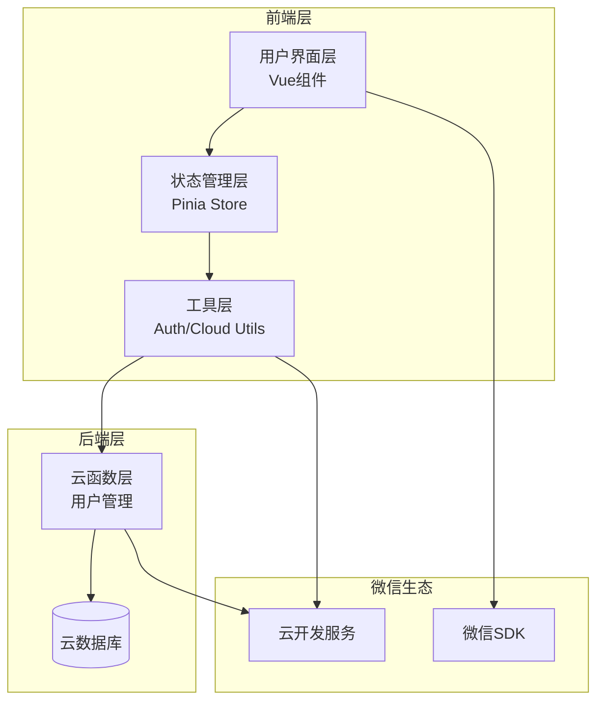
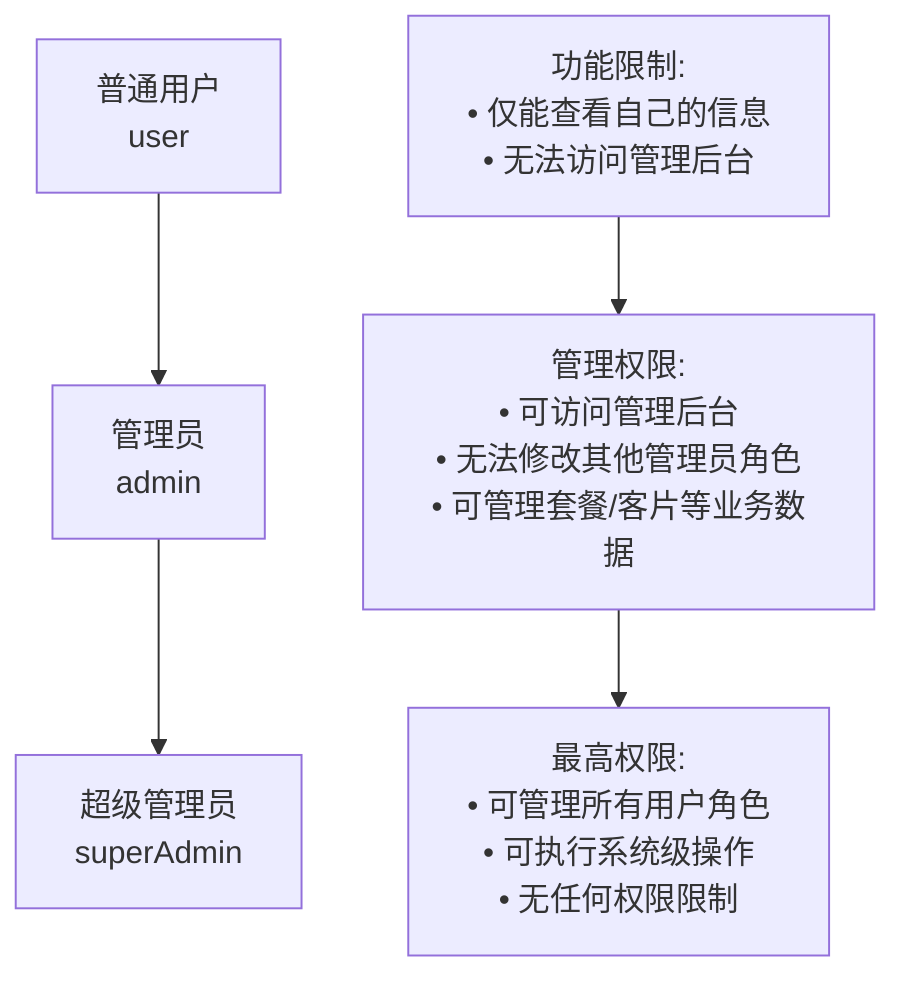
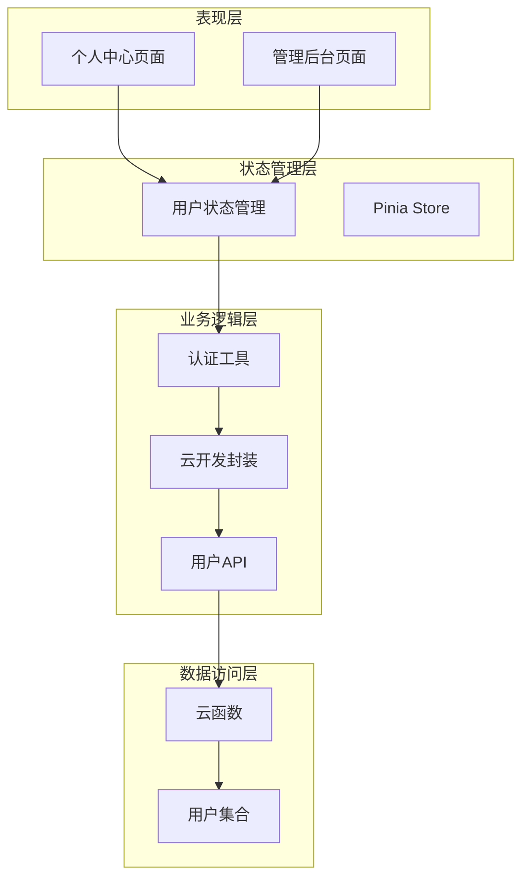
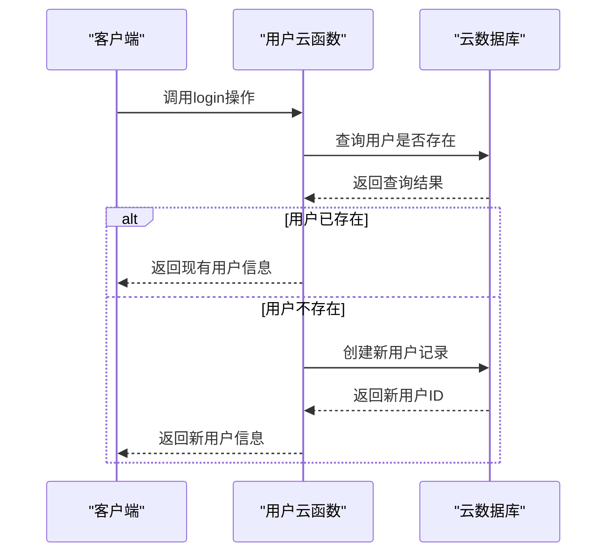
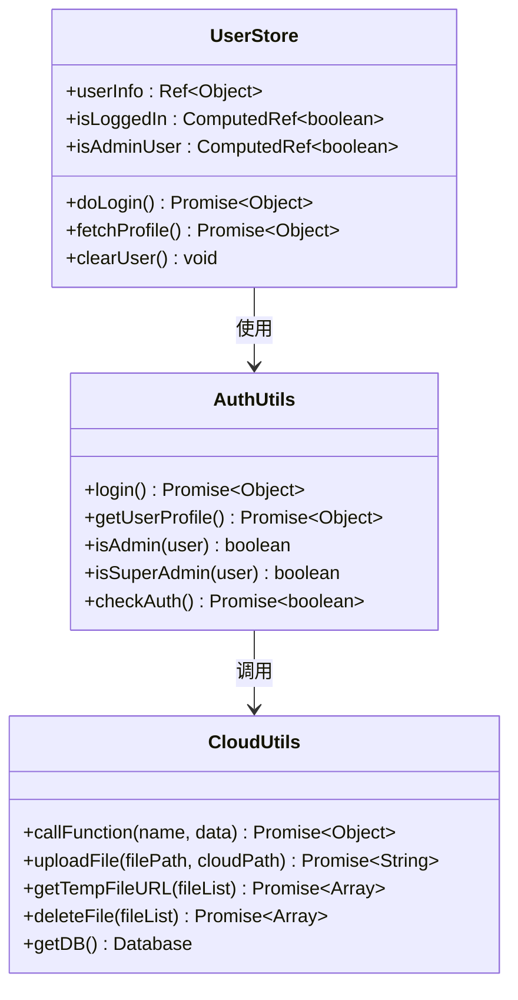
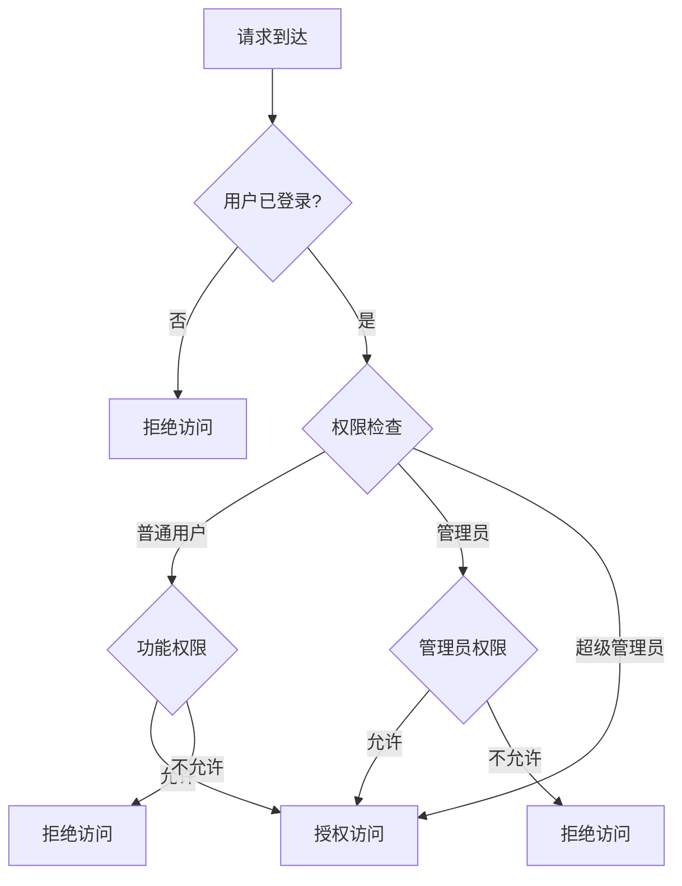
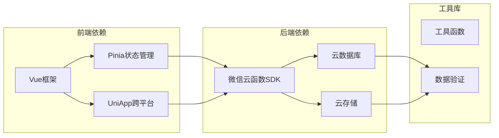

# 用户模型

<cite>
**本文档引用的文件**
- [miniprogram/cloudfunctions/user/index.js](file://miniprogram/cloudfunctions/user/index.js)
- [miniprogram/src/store/user.js](file://miniprogram/src/store/user.js)
- [miniprogram/src/utils/auth.js](file://miniprogram/src/utils/auth.js)
- [miniprogram/src/utils/cloud.js](file://miniprogram/src/utils/cloud.js)
- [miniprogram/src/pages/mine/index.vue](file://miniprogram/src/pages/mine/index.vue)
- [miniprogram/src/pages-admin/dashboard/index.vue](file://miniprogram/src/pages-admin/dashboard/index.vue)
- [miniprogram/src/utils/constants.js](file://miniprogram/src/utils/constants.js)
- [miniprogram/src/main.js](file://miniprogram/src/main.js)
</cite>

## 目录
1. [简介](#简介)
2. [项目结构](#项目结构)
3. [核心组件](#核心组件)
4. [架构概览](#架构概览)
5. [详细组件分析](#详细组件分析)
6. [依赖关系分析](#依赖关系分析)
7. [性能考虑](#性能考虑)
8. [故障排除指南](#故障排除指南)
9. [结论](#结论)

## 简介

本项目采用微信小程序 + 云开发的技术栈，构建了一个完整的用户管理系统。用户模型是整个应用的核心数据结构，负责管理用户身份认证、权限控制和基础信息维护。

系统基于云数据库的集合(users)存储用户数据，通过云函数提供统一的用户操作接口，前端使用Pinia进行状态管理，实现了完整的用户生命周期管理。

## 项目结构

项目采用前后端分离的架构设计，主要分为以下层次：

**图表来源**
- [miniprogram/src/pages/mine/index.vue:1-309](file://miniprogram/src/pages/mine/index.vue#L1-L309)
- [miniprogram/src/store/user.js:1-48](file://miniprogram/src/store/user.js#L1-L48)
- [miniprogram/src/utils/auth.js:1-47](file://miniprogram/src/utils/auth.js#L1-L47)

**章节来源**
- [miniprogram/src/pages/mine/index.vue:1-309](file://miniprogram/src/pages/mine/index.vue#L1-L309)
- [miniprogram/src/store/user.js:1-48](file://miniprogram/src/store/user.js#L1-L48)
- [miniprogram/src/utils/auth.js:1-47](file://miniprogram/src/utils/auth.js#L1-L47)

## 核心组件

### 用户数据模型

用户模型采用简洁而实用的设计，包含以下核心字段：

| 字段名 | 类型 | 必填 | 默认值 | 描述 |
|--------|------|------|--------|------|
| openid | String | 是 | - | 微信用户唯一标识符 |
| nickname | String | 否 | '' | 用户昵称 |
| avatar | String | 否 | '' | 用户头像URL |
| phone | String | 否 | '' | 绑定手机号码 |
| role | String | 否 | 'user' | 用户角色(user/admin/superAdmin) |
| createTime | Date | 否 | 当前时间 | 创建时间戳 |

### 角色权限体系

系统实现三级权限控制机制：

**图表来源**
- [miniprogram/cloudfunctions/user/index.js:166-179](file://miniprogram/cloudfunctions/user/index.js#L166-L179)
- [miniprogram/src/utils/auth.js:28-36](file://miniprogram/src/utils/auth.js#L28-L36)

**章节来源**
- [miniprogram/cloudfunctions/user/index.js:48-55](file://miniprogram/cloudfunctions/user/index.js#L48-L55)
- [miniprogram/cloudfunctions/user/index.js:166-179](file://miniprogram/cloudfunctions/user/index.js#L166-L179)
- [miniprogram/src/utils/auth.js:28-36](file://miniprogram/src/utils/auth.js#L28-L36)

## 架构概览

系统采用三层架构设计，确保职责分离和可维护性：

**图表来源**
- [miniprogram/src/pages/mine/index.vue:74-125](file://miniprogram/src/pages/mine/index.vue#L74-L125)
- [miniprogram/src/pages-admin/dashboard/index.vue:73-134](file://miniprogram/src/pages-admin/dashboard/index.vue#L73-L134)
- [miniprogram/src/store/user.js:5-47](file://miniprogram/src/store/user.js#L5-L47)

## 详细组件分析

### 用户云函数模块

用户云函数提供完整的用户生命周期管理功能：

**图表来源**
- [miniprogram/cloudfunctions/user/index.js:14-67](file://miniprogram/cloudfunctions/user/index.js#L14-L67)

#### 主要功能模块

1. **用户登录处理**
   - 自动识别微信用户身份
   - 实现用户注册与登录一体化
   - 自动生成默认用户信息

2. **用户信息管理**
   - 支持昵称和头像更新
   - 提供手机号绑定功能
   - 实时返回最新用户状态

3. **权限管理**
   - 严格的管理员权限验证
   - 支持角色提升和降级
   - 完整的权限审计

**章节来源**
- [miniprogram/cloudfunctions/user/index.js:1-206](file://miniprogram/cloudfunctions/user/index.js#L1-L206)

### 前端状态管理

用户状态管理采用Pinia进行集中式状态管理：

**图表来源**
- [miniprogram/src/store/user.js:5-47](file://miniprogram/src/store/user.js#L5-L47)
- [miniprogram/src/utils/auth.js:6-46](file://miniprogram/src/utils/auth.js#L6-L46)
- [miniprogram/src/utils/cloud.js:6-66](file://miniprogram/src/utils/cloud.js#L6-L66)

**章节来源**
- [miniprogram/src/store/user.js:1-48](file://miniprogram/src/store/user.js#L1-L48)
- [miniprogram/src/utils/auth.js:1-47](file://miniprogram/src/utils/auth.js#L1-L47)
- [miniprogram/src/utils/cloud.js:1-66](file://miniprogram/src/utils/cloud.js#L1-L66)

### 权限验证机制

系统实现了多层次的权限验证机制：

**图表来源**
- [miniprogram/src/pages-admin/dashboard/index.vue:90-103](file://miniprogram/src/pages-admin/dashboard/index.vue#L90-L103)
- [miniprogram/src/utils/auth.js:28-36](file://miniprogram/src/utils/auth.js#L28-L36)

**章节来源**
- [miniprogram/src/pages-admin/dashboard/index.vue:90-103](file://miniprogram/src/pages-admin/dashboard/index.vue#L90-L103)
- [miniprogram/src/utils/auth.js:28-36](file://miniprogram/src/utils/auth.js#L28-L36)

## 依赖关系分析

系统各组件之间的依赖关系清晰明确：

**图表来源**
- [miniprogram/src/main.js:1-11](file://miniprogram/src/main.js#L1-L11)
- [miniprogram/cloudfunctions/user/index.js:1-5](file://miniprogram/cloudfunctions/user/index.js#L1-L5)

**章节来源**
- [miniprogram/src/main.js:1-11](file://miniprogram/src/main.js#L1-L11)
- [miniprogram/cloudfunctions/user/index.js:1-5](file://miniprogram/cloudfunctions/user/index.js#L1-L5)

## 性能考虑

### 查询优化策略

1. **索引设计建议**
   - openid字段建立唯一索引（自动索引）
   - role字段建立普通索引
   - createTime字段建立时间索引

2. **缓存策略**
   - 前端使用Pinia进行本地缓存
   - 避免重复的用户信息查询
   - 实现智能缓存失效机制

3. **批量操作**
   - 合并多个更新操作
   - 减少网络往返次数
   - 实现事务性操作保证数据一致性

### 安全考虑

1. **数据验证**
   - 前端基础验证
   - 后端严格验证
   - 输入参数白名单过滤

2. **权限控制**
   - 每个操作都进行权限验证
   - 角色继承关系检查
   - 操作日志记录

3. **敏感信息保护**
   - 手机号显示脱敏处理
   - 敏感操作二次确认
   - 数据传输加密

## 故障排除指南

### 常见问题及解决方案

1. **用户登录失败**
   - 检查微信登录状态
   - 验证云函数权限配置
   - 确认用户集合存在

2. **权限验证错误**
   - 检查用户角色状态
   - 验证管理员权限
   - 确认权限检查逻辑

3. **数据同步问题**
   - 实现乐观锁机制
   - 添加重试机制
   - 记录操作日志

**章节来源**
- [miniprogram/cloudfunctions/user/index.js:27-30](file://miniprogram/cloudfunctions/user/index.js#L27-L30)
- [miniprogram/src/utils/auth.js:11-14](file://miniprogram/src/utils/auth.js#L11-L14)

## 结论

本用户模型设计充分体现了现代Web应用的最佳实践：

1. **简洁性**：核心字段设计精简，满足业务需求
2. **安全性**：完善的权限控制和数据验证机制
3. **可扩展性**：清晰的架构设计支持功能扩展
4. **可维护性**：模块化设计便于代码维护

通过云开发的技术优势，系统实现了高可用性和低成本运维，为后续的功能扩展奠定了坚实基础。